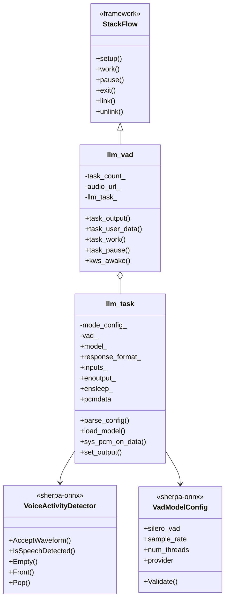
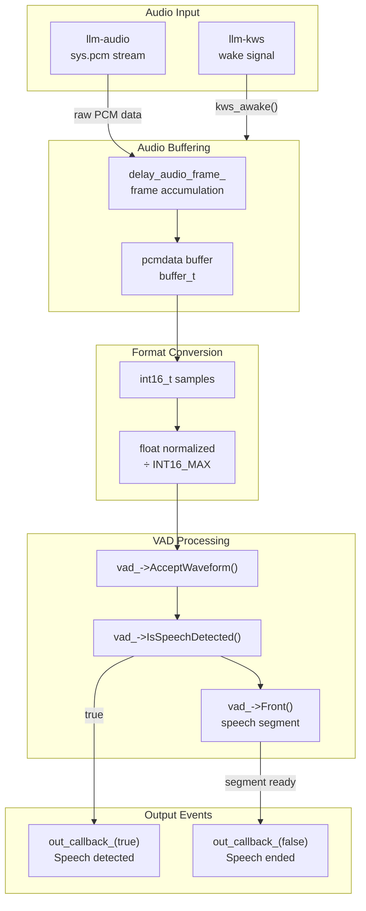
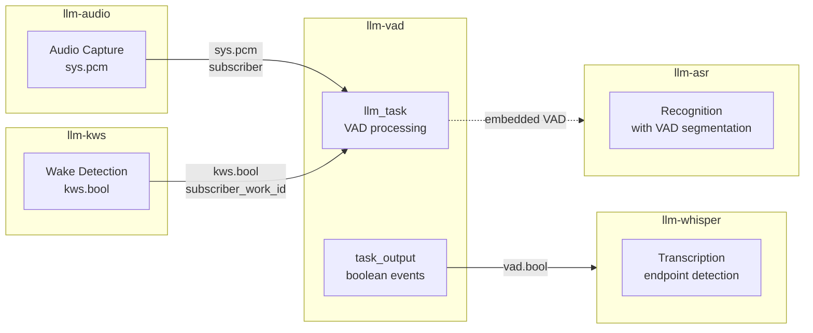
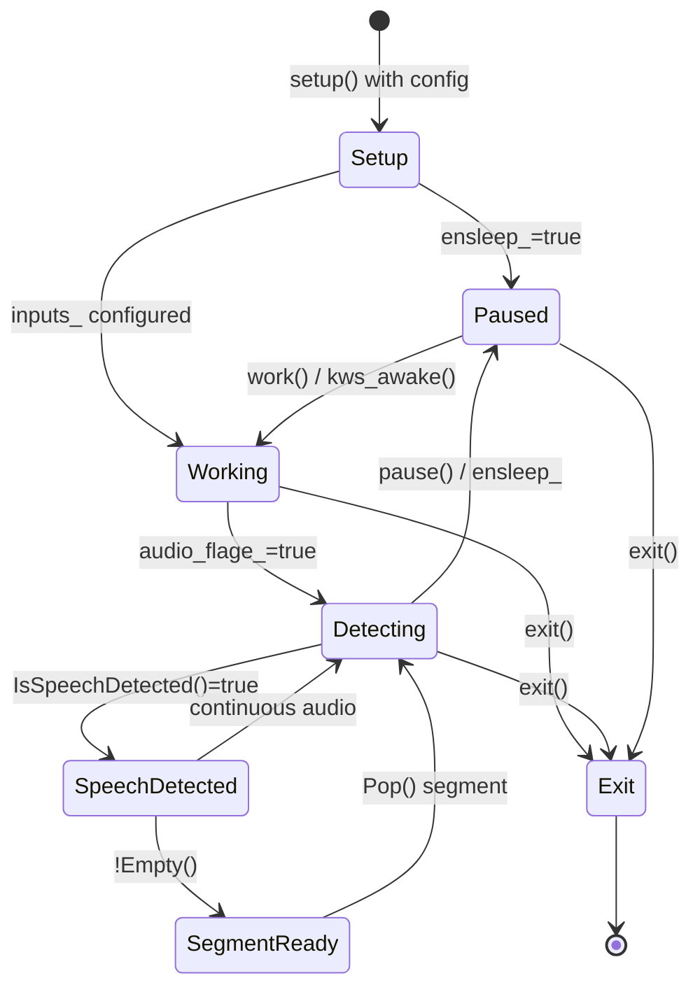
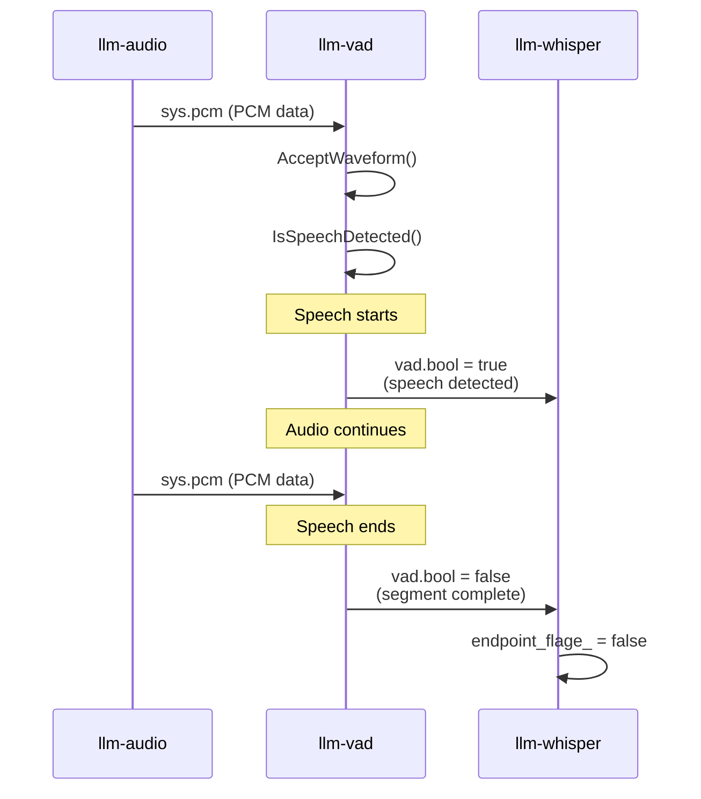

StackFlow Voice Activity Detection (llm-vad)

# Voice Activity Detection (llm-vad)

<details>
<summary>Relevant source files</summary>

The following files were used as context for generating this wiki page:

- [projects/llm_framework/main_asr/src/main.cpp](projects/llm_framework/main_asr/src/main.cpp)
- [projects/llm_framework/main_kws/src/main.cpp](projects/llm_framework/main_kws/src/main.cpp)
- [projects/llm_framework/main_vad/src/main.cpp](projects/llm_framework/main_vad/src/main.cpp)
- [projects/llm_framework/main_whisper/src/main.cpp](projects/llm_framework/main_whisper/src/main.cpp)

</details>


The **llm-vad** unit provides real-time voice activity detection (VAD) to identify when speech is present in audio streams. It uses the Silero VAD model to detect speech segments and emit boolean signals that other units can use for triggering or endpoint detection. For speech recognition functionality, see [Speech Recognition (llm-asr, llm-whisper)](#3.4).

## Purpose and Scope

The VAD unit serves two primary functions:
1. **Speech Detection**: Continuously monitors audio streams and emits signals when speech is detected or ends
2. **Endpoint Detection**: Provides speech boundary information to units like Whisper for improved segmentation

The unit operates as a standalone service that subscribes to audio streams and publishes detection events via the StackFlow framework.

**Sources**: [projects/llm_framework/main_vad/src/main.cpp:1-606]()

## Architecture and Components

**Class Structure**



**Sources**: [projects/llm_framework/main_vad/src/main.cpp:44-235](), [projects/llm_framework/main_vad/src/main.cpp:238-594]()

## Model and Configuration

**Silero VAD Model**

The VAD unit uses the Silero VAD model from sherpa-onnx, a lightweight neural network optimized for real-time speech detection.

**Configuration Structure**

| Parameter | Type | Description | Default/Range |
|-----------|------|-------------|---------------|
| `model` | string | Model identifier (e.g., "silero-vad") | Required |
| `response_format` | string | Output format ("vad.bool") | Required |
| `enoutput` | boolean | Enable output publishing | Required |
| `input` | string/array | Input sources ("sys.pcm", "kws.bool") | Required |
| `silero_vad.model` | string | Path to model file | config file |
| `silero_vad.threshold` | float | Detection threshold | 0.5 |
| `silero_vad.min_silence_duration` | float | Min silence duration (ms) | 500 |
| `silero_vad.min_speech_duration` | float | Min speech duration (ms) | 250 |
| `silero_vad.window_size` | int | Analysis window size (samples) | 512 |
| `sample_rate` | int | Audio sample rate | 16000 |
| `num_threads` | int | Inference threads | 1 |
| `provider` | string | ONNX provider | "cpu" |

**Sources**: [projects/llm_framework/main_vad/src/main.cpp:93-146](), [projects/llm_framework/main_vad/src/main.cpp:120-135]()

## Audio Processing Pipeline

**Data Flow Diagram**



**Processing Implementation**

The audio processing occurs in [main_vad/src/main.cpp:153-202]():

1. **Frame Buffering**: Accumulates `delay_audio_frame_` frames before processing
2. **Format Conversion**: Converts int16 PCM to normalized float [-1.0, 1.0]
3. **VAD Analysis**: Feeds audio to `vad_->AcceptWaveform()`
4. **Detection**: Checks `vad_->IsSpeechDetected()` for immediate feedback
5. **Segmentation**: Processes completed segments from `vad_->Front()`

```cpp
// Key processing logic
vad_->AcceptWaveform(floatSamples.data(), floatSamples.size());

if (vad_->IsSpeechDetected() && !printed) {
    printed = true;
    out_callback_(true);  // Speech started
}

while (!vad_->Empty()) {
    const auto &segment = vad_->Front();
    float duration = segment.samples.size() / 16000.0f;
    vad_->Pop();
    out_callback_(false);  // Speech ended
}
```

**Sources**: [projects/llm_framework/main_vad/src/main.cpp:153-202]()

## Integration with Other Units

**Unit Linking Patterns**



### Integration Methods

**1. Direct Audio Input**
```json
{
  "input": "sys.pcm",
  "model": "silero-vad",
  "response_format": "vad.bool"
}
```
Subscribes to audio capture via [main_vad/src/main.cpp:425-432]().

**2. KWS Wake Activation**
```json
{
  "input": "kws.bool",
  "model": "silero-vad"
}
```
Activates VAD after wake word detection via [main_vad/src/main.cpp:439-446]().

**3. ASR Embedded Integration**

ASR units can embed VAD functionality directly for speech segmentation. In [main_asr/src/main.cpp:555-699](), the ASR uses VAD to:
- Detect speech boundaries
- Segment audio for recognition
- Implement silence timeout for auto-pause

**4. Whisper Endpoint Detection**

Whisper uses VAD signals for endpoint detection via [main_whisper/src/main.cpp:867-872]():
```cpp
llm_channel->subscriber_work_id(
    input, std::bind(&llm_whisper::vad_endpoint, ...));
```

**Sources**: [projects/llm_framework/main_vad/src/main.cpp:424-447](), [projects/llm_framework/main_asr/src/main.cpp:555-699](), [projects/llm_framework/main_whisper/src/main.cpp:867-872]()

## State Management and Lifecycle

**VAD State Machine**



**State Control Functions**

| Function | Purpose | Implementation |
|----------|---------|----------------|
| `setup()` | Initialize VAD model and configuration | [main_vad/src/main.cpp:392-458]() |
| `work()` | Activate VAD processing | [main_vad/src/main.cpp:360-374]() |
| `pause()` | Pause audio subscription | [main_vad/src/main.cpp:376-390]() |
| `link()` | Add input source dynamically | [main_vad/src/main.cpp:461-499]() |
| `unlink()` | Remove input source | [main_vad/src/main.cpp:501-527]() |
| `exit()` | Clean up and release resources | [main_vad/src/main.cpp:556-576]() |

**Sources**: [projects/llm_framework/main_vad/src/main.cpp:360-576]()

## Output Format and Signals

**Boolean Signal Protocol**

The VAD unit publishes boolean signals via the `vad.bool` response format:



**Output Message Structure**

The `task_output()` function publishes boolean values via [main_vad/src/main.cpp:252-263]():

```cpp
void task_output(..., const bool &data) {
    llm_channel->send(llm_task_obj->response_format_, data, LLM_NO_ERROR);
}
```

**Signal Semantics**
- `true`: Speech has been detected (speech start)
- `false`: Speech segment has ended (speech boundary)

**Sources**: [projects/llm_framework/main_vad/src/main.cpp:252-263](), [projects/llm_framework/main_vad/src/main.cpp:177-201]()

## Configuration Example

**Basic VAD Setup**

```json
{
  "model": "silero-vad",
  "response_format": "vad.bool",
  "enoutput": true,
  "input": "sys.pcm"
}
```

**VAD with KWS Wake**

```json
{
  "model": "silero-vad",
  "response_format": "vad.bool",
  "enoutput": true,
  "input": "kws.bool"
}
```

**Configuration with Custom Parameters**

```json
{
  "model": "silero-vad",
  "response_format": "vad.bool",
  "enoutput": true,
  "input": "sys.pcm",
  "silero_vad.threshold": 0.6,
  "silero_vad.min_silence_duration": 600,
  "silero_vad.min_speech_duration": 200,
  "silero_vad.window_size": 512
}
```

The model configuration is loaded from JSON files following the pattern defined in [main_vad/src/main.cpp:100-145]().

**Sources**: [projects/llm_framework/main_vad/src/main.cpp:93-146](), [projects/llm_framework/main_vad/src/main.cpp:392-458]()

## Use Cases

**1. Whisper Endpoint Detection**

VAD signals inform Whisper when to process accumulated audio:
- Links via `input: "vad.bool"` in Whisper setup
- `vad_endpoint()` callback sets `endpoint_flage_` 
- Enables chunked transcription with proper boundaries

**2. ASR Embedded Segmentation**

ASR directly embeds VAD for speech segmentation:
- Uses `sherpa_onnx::VoiceActivityDetector` internally
- Processes speech segments as they're detected
- Implements silence timeout for automatic pause

**3. Audio-Triggered Recording**

VAD can trigger recording or processing when speech is detected:
- Subscribe to `vad.bool` output
- Start recording on `true`, stop on `false`
- Ensures only speech segments are captured

**Sources**: [projects/llm_framework/main_whisper/src/main.cpp:768-778](), [projects/llm_framework/main_asr/src/main.cpp:555-699]()

## Technical Details

**Buffer Management**

The `llm_task` uses a custom buffer implementation:
- `pcmdata`: Ring buffer created via `buffer_create()` [main_vad/src/main.cpp:219]()
- `delay_audio_frame_`: Number of frames to accumulate before processing [main_vad/src/main.cpp:63]()
- `buffer_write_char()`: Appends incoming PCM data
- `buffer_read_i16()`: Reads int16 samples for conversion

**Weak Pointer Pattern**

The implementation uses `std::weak_ptr` extensively to prevent circular references:
```cpp
std::weak_ptr<llm_task> _llm_task_obj = llm_task_obj;
llm_channel->subscriber(audio_url_, [_llm_task_obj](...) {
    _llm_task_obj.lock()->sys_pcm_on_data(raw->string());
});
```

This pattern is visible in [main_vad/src/main.cpp:339-343]() and [main_vad/src/main.cpp:427-431]().

**Thread Safety**

Atomic flags control state:
- `audio_flage_`: Audio subscription active
- `awake_flage_`: Wake activation received
- `superior_flage_`: Superior unit control

**Sources**: [projects/llm_framework/main_vad/src/main.cpp:44-235](), [projects/llm_framework/main_vad/src/main.cpp:153-202]()