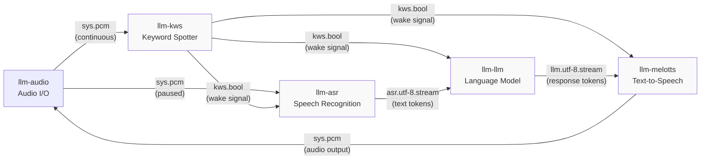
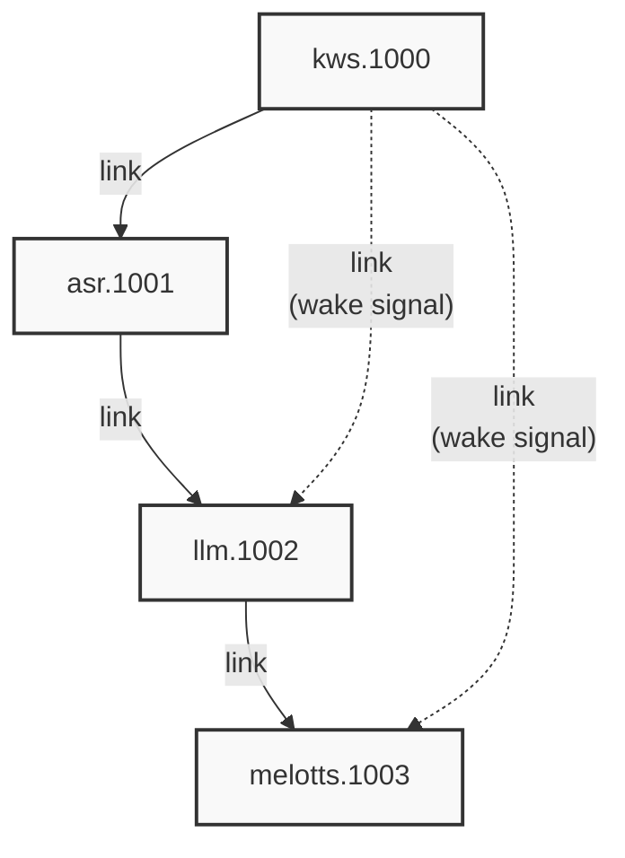
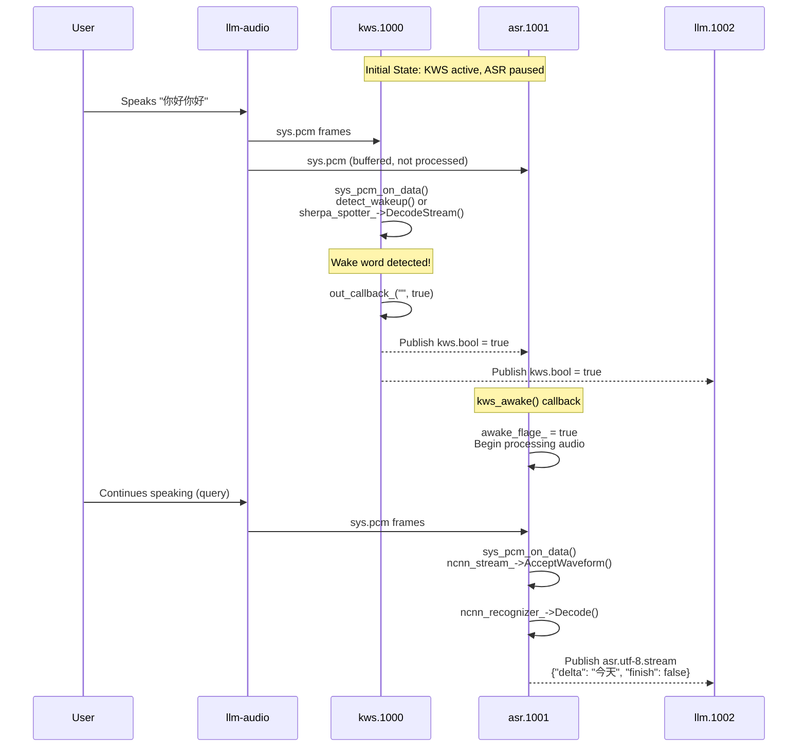
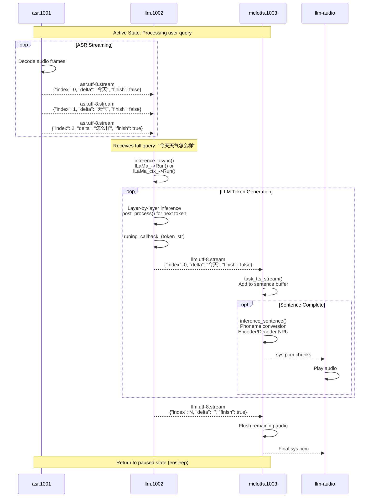

StackFlow Voice Assistant Pipeline Example

# Voice Assistant Pipeline Example

<details>
<summary>Relevant source files</summary>

The following files were used as context for generating this wiki page:

- [README.md](README.md)
- [README_zh.md](README_zh.md)
- [doc/component_doc/StackFlow_en.md](doc/component_doc/StackFlow_en.md)
- [doc/component_doc/StackFlow_zh.md](doc/component_doc/StackFlow_zh.md)
- [projects/llm_framework/README.md](projects/llm_framework/README.md)
- [projects/llm_framework/main_asr/src/main.cpp](projects/llm_framework/main_asr/src/main.cpp)
- [projects/llm_framework/main_kws/src/main.cpp](projects/llm_framework/main_kws/src/main.cpp)
- [projects/llm_framework/main_llm/src/main.cpp](projects/llm_framework/main_llm/src/main.cpp)
- [projects/llm_framework/main_llm/src/runner/LLM.hpp](projects/llm_framework/main_llm/src/runner/LLM.hpp)
- [projects/llm_framework/main_vad/src/main.cpp](projects/llm_framework/main_vad/src/main.cpp)
- [projects/llm_framework/main_vlm/src/main.cpp](projects/llm_framework/main_vlm/src/main.cpp)
- [projects/llm_framework/main_vlm/src/runner/LLM.hpp](projects/llm_framework/main_vlm/src/runner/LLM.hpp)
- [projects/llm_framework/main_vlm/src/runner/ax_model_runner/ax_model_runner.hpp](projects/llm_framework/main_vlm/src/runner/ax_model_runner/ax_model_runner.hpp)
- [projects/llm_framework/main_whisper/src/main.cpp](projects/llm_framework/main_whisper/src/main.cpp)

</details>


This document provides a complete walkthrough of building a voice assistant using the StackFlow framework. The voice assistant pipeline demonstrates how multiple AI units collaborate to enable wake-word-triggered conversational interactions: audio capture → keyword detection → speech recognition → language model inference → speech synthesis.

For general unit configuration concepts, see [Unit Setup and Linking](#8.2). For details on individual unit capabilities, see [Speech Processing Units](#3) and [Language Model Units](#4). For the JSON RPC protocol, see [JSON RPC Protocol](#9.1).

## Pipeline Architecture

The voice assistant pipeline integrates five core units that work together through message passing:



**Pipeline States and Activation:**
- **Idle State**: KWS continuously monitors audio; ASR, LLM, and TTS are paused
- **Wake Activation**: KWS detects keyword (e.g., "你好你好") and broadcasts `kws.bool` signal
- **Active State**: ASR begins transcription, LLM processes input, TTS synthesizes output
- **Sleep Transition**: Units return to paused state after processing completes

Sources: [projects/llm_framework/README.md:28-48](), High-level diagrams provided

## Unit Configuration

Each unit in the pipeline requires specific configuration through the `setup` RPC action. Below are the configurations for a Chinese-language voice assistant.

### KWS Configuration

The Keyword Spotting unit detects wake words to activate the pipeline.

```json
{
    "request_id": "1",
    "work_id": "kws",
    "action": "setup",
    "object": "kws.setup",
    "data": {
        "model": "sherpa-onnx-kws-zipformer-wenetspeech-3.3M-2024-01-01",
        "response_format": "kws.bool",
        "input": "sys.pcm",
        "enoutput": true,
        "kws": "你好你好"
    }
}
```

**Key Parameters:**
- `model`: Sherpa-ONNX or Axera KWS model (see [Keyword Spotting](#3.3))
- `response_format`: Output format, typically `kws.bool` or `kws.json` for detailed results
- `input`: Always `sys.pcm` to receive audio from llm-audio
- `kws`: Wake word string(s) to detect
- `enwake_audio`: (optional) Play confirmation sound on detection

The KWS unit runs continuously, processing every audio frame through `sys_pcm_on_data()`.

Sources: [projects/llm_framework/README.md:54-62](), [projects/llm_framework/main_kws/src/main.cpp:110-153]()

### ASR Configuration

The Automatic Speech Recognition unit transcribes speech to text with wake-word gating.

```json
{
    "request_id": "2",
    "work_id": "asr",
    "action": "setup",
    "object": "asr.setup",
    "data": {
        "model": "sherpa-ncnn-streaming-zipformer-zh-14M-2023-02-23",
        "response_format": "asr.utf-8.stream",
        "input": "sys.pcm",
        "enoutput": true,
        "enkws": true,
        "rule1": 2.4,
        "rule2": 1.2,
        "rule3": 30.1
    }
}
```

**Key Parameters:**
- `model`: Sherpa-NCNN, Sherpa-ONNX, or Whisper model (see [Speech Recognition](#3.4))
- `response_format`: `asr.utf-8.stream` for streaming output, `asr.utf-8` for complete utterances
- `enkws`: Enable wake-word gating (unit pauses until KWS signal received)
- `rule1`, `rule2`, `rule3`: Endpoint detection rules for silence timeout

The `enkws` flag is critical: when `true`, ASR remains paused until it receives a `kws.bool` wake signal via the `kws_awake()` callback. This prevents continuous transcription and conserves resources.

Sources: [projects/llm_framework/README.md:64-79](), [projects/llm_framework/main_asr/src/main.cpp:131-161]()

### LLM Configuration

The Language Model unit generates contextual responses.

```json
{
    "request_id": "3",
    "work_id": "llm",
    "action": "setup",
    "object": "llm.setup",
    "data": {
        "model": "qwen2.5-0.5B-prefill-20e",
        "response_format": "llm.utf-8.stream",
        "input": "llm.utf-8",
        "enoutput": true,
        "max_token_len": 256,
        "prompt": "You are a knowledgeable assistant capable of answering various questions and providing information."
    }
}
```

**Key Parameters:**
- `model`: LLM model name (see [LLM Inference](#4.1) for available models)
- `response_format`: `llm.utf-8.stream` enables token-by-token streaming
- `input`: Topic to subscribe to (`llm.utf-8` for direct input, or link to ASR)
- `prompt`: System prompt defining assistant behavior
- `max_token_len`: Maximum tokens per response (constrained by KV cache)

The LLM unit supports both direct text input and ASR streaming input. When linked to ASR, it processes transcribed speech and generates responses in real-time.

Sources: [projects/llm_framework/README.md:81-93](), [projects/llm_framework/main_llm/src/main.cpp:83-106]()

### TTS Configuration

The Text-to-Speech unit synthesizes audio from LLM output.

```json
{
    "request_id": "4",
    "work_id": "melotts",
    "action": "setup",
    "object": "melotts.setup",
    "data": {
        "model": "melotts-zh-cn",
        "response_format": "sys.pcm",
        "input": "tts.utf-8",
        "enoutput": false
    }
}
```

**Key Parameters:**
- `model`: TTS model (melotts, cosy-voice, or traditional TTS - see [Text-to-Speech Systems](#3.5))
- `response_format`: Always `sys.pcm` to output audio back to llm-audio
- `input`: Text topic to subscribe to (typically linked from LLM)
- `enoutput`: `false` since audio goes directly to playback, not to subscribers

MeloTTS runs on NPU for low-latency synthesis. It processes streaming text tokens from the LLM, converting each segment to audio incrementally.

Sources: [projects/llm_framework/README.md:95-106]()

## Establishing Unit Links

After setup, units must be linked to establish data flow paths. The `link` action creates subscriptions between units.

### Link Topology



**Link Commands:**

1. **Link ASR to KWS** (wake word activation):
```json
{
    "request_id": "2",
    "work_id": "asr.1001",
    "action": "link",
    "object": "work_id",
    "data": "kws.1000"
}
```

2. **Link LLM to ASR** (text input):
```json
{
    "request_id": "3",
    "work_id": "llm.1002",
    "action": "link",
    "object": "work_id",
    "data": "asr.1001"
}
```

3. **Link TTS to LLM** (response output):
```json
{
    "request_id": "4",
    "work_id": "melotts.1003",
    "action": "link",
    "object": "work_id",
    "data": "llm.1002"
}
```

4. **Link LLM to KWS** (interrupt on new wake):
```json
{
    "request_id": "3",
    "work_id": "llm.1002",
    "action": "link",
    "object": "work_id",
    "data": "kws.1000"
}
```

5. **Link TTS to KWS** (interrupt on new wake):
```json
{
    "request_id": "4",
    "work_id": "melotts.1003",
    "action": "link",
    "object": "work_id",
    "data": "kws.1000"
}
```

### Link Semantics

Each `link` action causes the target unit to subscribe to the specified work_id's output channel. The subscription behavior depends on the unit's input configuration:

| Source Unit | Output Format | Subscriber Behavior |
|-------------|---------------|---------------------|
| kws.1000 | `kws.bool` | Triggers `kws_awake()` callback in subscribers |
| asr.1001 | `asr.utf-8.stream` | Delivers text tokens via `task_asr_data()` |
| llm.1002 | `llm.utf-8.stream` | Delivers response tokens for synthesis |

The links from KWS to LLM and TTS serve a special purpose: when a new wake word is detected during active processing, these units receive the signal and can interrupt ongoing operations via their `kws_awake()` handlers. This allows the assistant to be re-triggered mid-response.

Sources: [projects/llm_framework/README.md:116-167](), [projects/llm_framework/main_llm/src/main.cpp:639-650](), [projects/llm_framework/main_asr/src/main.cpp:821-832]()

## Message Flow and Wake Activation

The voice assistant operates in distinct phases, triggered by the wake word detection.

### Idle to Active Transition



**Wake Detection Mechanism:**

The KWS unit implements two detection backends:

1. **Sherpa-ONNX Backend** ([main_kws/src/main.cpp:521-538]()):
   - Calls `sherpa_stream_->AcceptWaveform()` with audio frames
   - Invokes `sherpa_spotter_->DecodeStream()` when ready
   - Retrieves result via `sherpa_spotter_->GetResult()`
   - Checks `result.keyword` for match

2. **Axera Backend** ([main_kws/src/main.cpp:510-519]()):
   - Computes fbank features via `compute_fbank_kaldi()`
   - Runs `run_inference()` on NPU model
   - Calls `detect_wakeup()` to check score threshold
   - Maintains refractory period to prevent double-triggers

Upon detection, the KWS unit invokes `out_callback_()` which publishes the wake signal via `llm_channel->send()`.

**ASR Activation:**

The ASR unit's wake behavior is controlled by the `enkws` configuration flag ([main_asr/src/main.cpp:336-358]()):

```cpp
if (object.find("kws") != std::string::npos) {
    llm_task_obj->kws_awake();  // Sets awake_flage_ = true
}
```

When `awake_flage_` transitions to true, `sys_pcm_on_data()` begins processing buffered audio frames and streaming results to linked subscribers.

Sources: [projects/llm_framework/main_kws/src/main.cpp:484-538](), [projects/llm_framework/main_asr/src/main.cpp:336-358](), [projects/llm_framework/main_llm/src/main.cpp:639-650]()

### Streaming Data Pipeline

Once activated, the pipeline processes data in streaming mode for low latency.



**ASR Streaming Output Format:**

Streaming ASR results use JSON format ([main_asr/src/main.cpp:737-763]()):
```json
{
    "index": 0,
    "delta": "text_segment",
    "finish": false
}
```

The LLM subscribes to these messages via `task_asr_data()`, which accumulates tokens until `finish: true` is received, then triggers inference.

**LLM Streaming Inference:**

The LLM unit implements asynchronous inference in a dedicated thread ([main_llm/src/main.cpp:315-325]()):

1. `inference_async()` enqueues the query in `async_list_`
2. Worker thread calls `inference()` which invokes `lLaMa_->Run()` or `lLaMa_ctx_->Run()`
3. During inference, `runing_callback_` is invoked for each generated token ([main_llm/src/main.cpp:234-239]())
4. Callback publishes tokens via `task_output()` → `llm_channel->send()`

**TTS Streaming Synthesis:**

MeloTTS processes streaming text in sentence chunks. The `task_tts_stream()` method ([main_melotts would implement this, not provided in files]) accumulates tokens until sentence boundaries (punctuation), then invokes the synthesis pipeline:

1. Lexicon conversion: text → phoneme sequence
2. Encoder NPU model: phonemes → acoustic features
3. Decoder NPU model: features → mel-spectrogram
4. Vocoder: mel-spectrogram → PCM audio

Audio chunks are published to `sys.pcm` as they're generated, enabling word-by-word playback.

Sources: [projects/llm_framework/main_asr/src/main.cpp:737-763](), [projects/llm_framework/main_llm/src/main.cpp:315-403](), [projects/llm_framework/main_llm/src/main.cpp:520-546]()

## Complete Setup Sequence

Below is the complete command sequence to configure a Chinese voice assistant from scratch.

**Step 1: Reset System**

Clear any existing unit configurations:
```json
{
    "request_id": "reset-1",
    "work_id": "sys",
    "action": "reset"
}
```
Wait for response before proceeding.

**Step 2: Setup All Units**

Send all four setup commands (KWS, ASR, LLM, TTS as shown in previous sections). The system will respond with assigned work_ids:

```json
{"created":1731488371,"data":"None","error":{"code":0,"message":""},"object":"None","request_id":"1","work_id":"kws.1000"}
{"created":1731488377,"data":"None","error":{"code":0,"message":""},"object":"None","request_id":"2","work_id":"asr.1001"}
{"created":1731488392,"data":"None","error":{"code":0,"message":""},"object":"None","request_id":"3","work_id":"llm.1002"}
{"created":1731488402,"data":"None","error":{"code":0,"message":""},"object":"None","request_id":"4","work_id":"melotts.1003"}
```

**Step 3: Create Links**

Send all five link commands as shown in the "Establishing Unit Links" section. Wait for confirmation responses.

**Step 4: Interact**

The assistant is now ready. Speak the wake word "你好你好" to activate, then ask questions. The system will respond with synthesized speech.

### Alternative: English Voice Assistant

For an English-language assistant, modify the configurations:

| Unit | Model Change |
|------|--------------|
| KWS | `sherpa-onnx-kws-zipformer-gigaspeech-3.3M-2024-01-01` |
| ASR | `sherpa-ncnn-streaming-zipformer-20M-2023-02-17` |
| LLM | Keep same (system prompt already English) |
| TTS | `melotts-en-us` or `melotts-en-default` |

Update the wake word in KWS config:
```json
"kws": "hey assistant"
```

Sources: [projects/llm_framework/README.md:28-169](), [README_zh.md:59-78]()

## Troubleshooting Common Issues

| Issue | Probable Cause | Solution |
|-------|----------------|----------|
| ASR not activating | Missing KWS→ASR link or `enkws: false` | Verify link command sent; check `enkws: true` in ASR config |
| LLM not responding | ASR not linked to LLM | Send link command: `asr.1001` → `llm.1002` |
| No audio output | TTS output not reaching llm-audio | Verify `response_format: "sys.pcm"` in TTS config |
| Continuous ASR without wake | `enkws: false` in ASR config | Change to `enkws: true` and relink to KWS |
| Wake word false positives | KWS threshold too low | Adjust `threshold` in KWS model config or use Axera backend |

For debugging, enable output from all units (`enoutput: true`) to observe message flow in the llm-sys logs.

Sources: [projects/llm_framework/main_kws/src/main.cpp:110-153](), [projects/llm_framework/main_asr/src/main.cpp:131-161]()