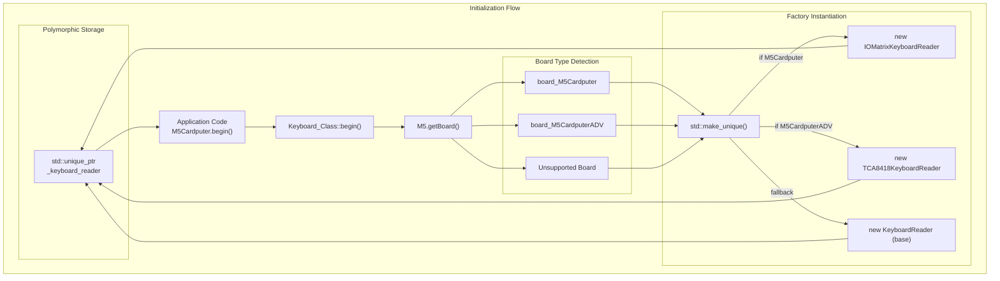
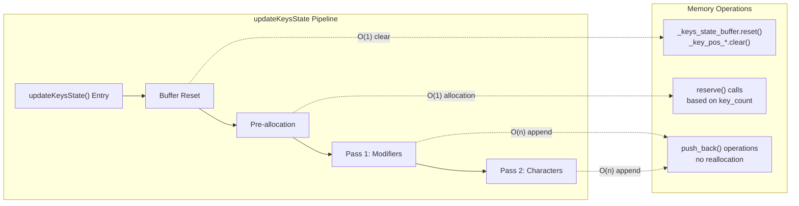
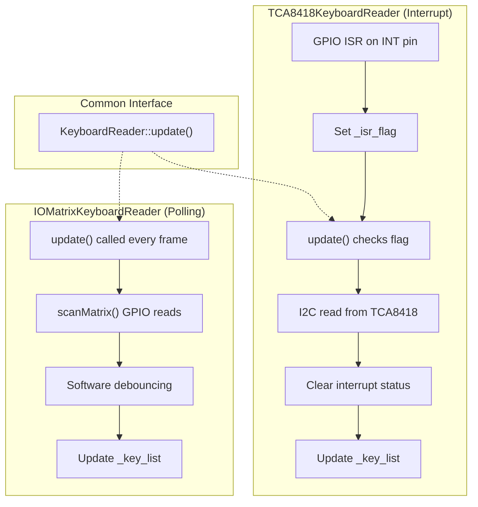
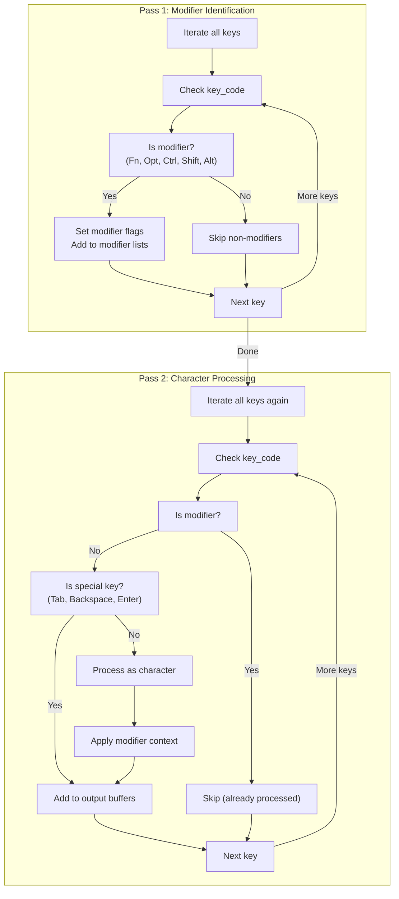
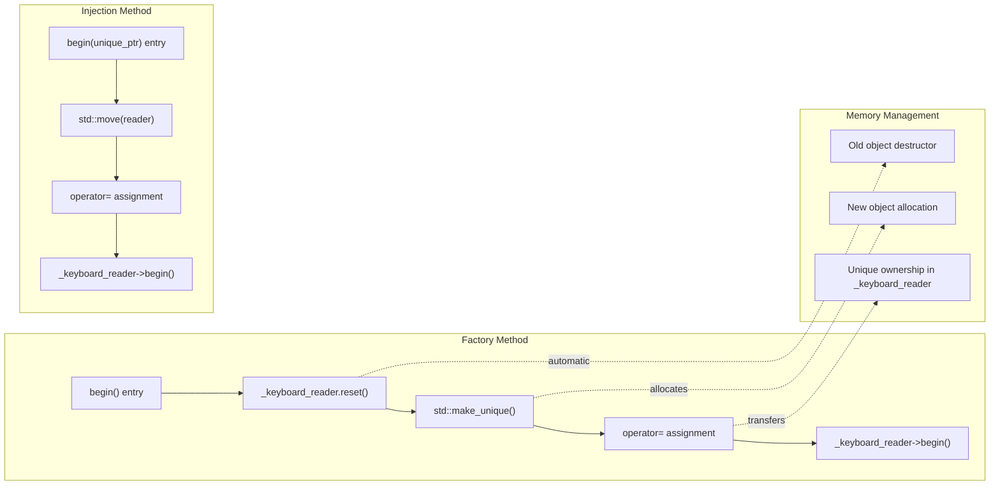
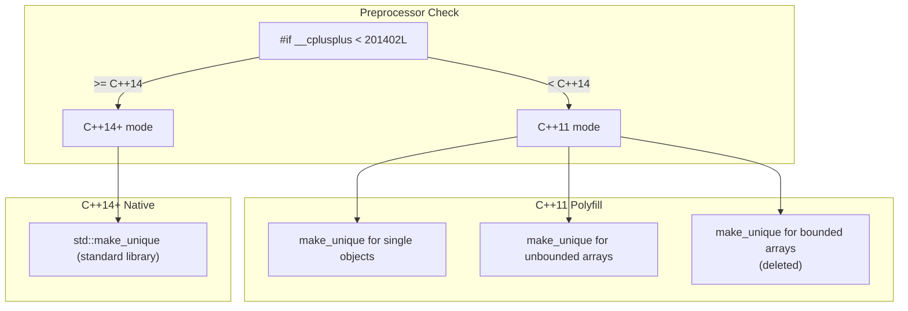
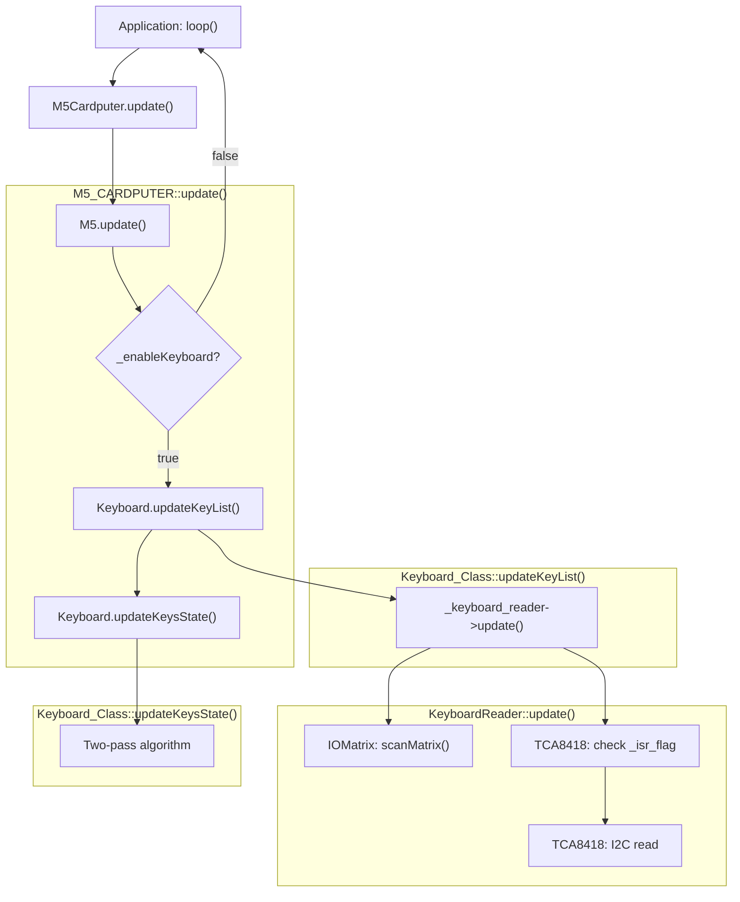

M5Cardputer Advanced Topics

# Advanced Topics

<details>
<summary>Relevant source files</summary>

The following files were used as context for generating this wiki page:

- [src/M5Cardputer.cpp](src/M5Cardputer.cpp)
- [src/utility/Keyboard/Keyboard.cpp](src/utility/Keyboard/Keyboard.cpp)
- [src/utility/Keyboard/KeyboardReader/TCA8418.cpp](src/utility/Keyboard/KeyboardReader/TCA8418.cpp)
- [src/utility/common.h](src/utility/common.h)

</details>


**Purpose:** This page covers advanced implementation details and extension mechanisms in the M5Cardputer library, including hardware abstraction patterns, performance optimization techniques, custom keyboard reader implementation, and C++ compatibility considerations. This material is intended for developers who need to extend the library's functionality, optimize application performance, or understand the internal architecture in depth.

For basic keyboard usage, see [Keyboard System](#4). For step-by-step guidance on creating custom keyboard readers, see [Creating Custom Keyboard Readers](#11.1). For details on automatic hardware detection, see [Hardware Variant Detection](#11.2).

---

## Hardware Abstraction Through Polymorphism

The M5Cardputer library uses runtime polymorphism to support multiple hardware variants through a single unified API. The core pattern is dependency injection via the Factory pattern, where hardware-specific implementations are instantiated based on board detection at runtime.

### Factory Pattern Implementation



**Factory Pattern and Dependency Injection in M5Cardputer**

The library implements two factory methods in `Keyboard_Class`:

| Method Signature | Purpose | Use Case |
|-----------------|---------|----------|
| `void begin()` | Automatic board detection and reader instantiation | Standard applications, automatic hardware support |
| `void begin(std::unique_ptr<KeyboardReader> reader)` | Manual reader injection | Custom hardware, testing, hardware emulation |

**Implementation Details:**

The automatic factory method [src/utility/Keyboard/Keyboard.cpp:15-31]() performs the following steps:

1. **Board Detection**: Calls `M5.getBoard()` to retrieve the board type enumeration
2. **Reader Reset**: Clears any existing `_keyboard_reader` instance using `reset()`
3. **Type-Based Instantiation**: Creates the appropriate reader subclass via `std::make_unique<T>()`
4. **Initialization**: Calls `begin()` on the newly created reader instance

The manual injection method [src/utility/Keyboard/Keyboard.cpp:33-37]() provides a seam for dependency injection, allowing applications to provide custom implementations:

- Accepts ownership transfer via `std::move()` to prevent copying
- Stores the reader in the same `_keyboard_reader` member
- Ensures consistent lifecycle management through smart pointers

**Sources:** [src/utility/Keyboard/Keyboard.cpp:15-37](), [src/M5Cardputer.cpp:12-28]()

---

## Performance Optimization Techniques

The M5Cardputer library employs several optimization strategies to minimize latency, reduce memory allocations, and maximize throughput in the keyboard input pipeline.

### Memory Allocation Strategy



**Memory Pre-allocation in Key State Processing**

| Buffer Name | Type | Pre-allocation Size | Purpose |
|------------|------|---------------------|---------|
| `_key_pos_print_keys` | `std::vector<Point2D_t>` | `key_count` | Printable key positions |
| `_key_pos_hid_keys` | `std::vector<Point2D_t>` | `key_count` | HID-capable key positions |
| `_key_pos_modifier_keys` | `std::vector<Point2D_t>` | 8 | Modifier key positions (fixed maximum) |
| `_keys_state_buffer.modifier_keys` | `std::vector<uint8_t>` | 8 | Active modifier key codes |
| `_keys_state_buffer.hid_keys` | `std::vector<uint8_t>` | `key_count` | HID key codes for USB emulation |
| `_keys_state_buffer.word` | `std::vector<uint8_t>` | `key_count` | Character buffer for text input |

**Pre-allocation Implementation** [src/utility/Keyboard/Keyboard.cpp:102-110]():

The library pre-allocates all dynamic containers at the start of `updateKeysState()` to prevent multiple reallocations during the two-pass processing. This optimization reduces worst-case complexity from O(n log n) to O(n) for the append operations.

**Key Optimization Points:**

1. **Single Allocation**: All vectors are reserved once based on the current key count
2. **Capacity Retention**: `clear()` operations maintain allocated capacity across frames
3. **Modifier Cap**: Modifier key vectors use a fixed size (8) based on the maximum possible modifier keys
4. **Zero Reallocation**: Subsequent `push_back()` calls never trigger reallocation if `key_count` doesn't exceed the previous maximum

**Sources:** [src/utility/Keyboard/Keyboard.cpp:90-110]()

---

### Interrupt-Driven Input vs Polling

The library supports two input acquisition strategies, selected automatically based on hardware capabilities:



**Interrupt-Driven vs Polling Comparison**

| Aspect | IOMatrixKeyboardReader (Polling) | TCA8418KeyboardReader (Interrupt) |
|--------|----------------------------------|-----------------------------------|
| **Update Trigger** | Called every frame in main loop | GPIO interrupt on hardware change |
| **CPU Utilization** | Constant (scans every frame) | Minimal (only on key events) |
| **Latency** | Frame period dependent | Near-instantaneous (ISR latency) |
| **Debouncing** | Software implementation required | Hardware debouncing in TCA8418 |
| **Power Efficiency** | Lower (continuous polling) | Higher (sleep until interrupt) |
| **Implementation Complexity** | Lower | Higher (ISR, flag management) |

**Interrupt Handler Implementation** [src/utility/Keyboard/KeyboardReader/TCA8418.cpp:22-26]():

The TCA8418 implementation uses the `IRAM_ATTR` attribute to ensure the ISR resides in instruction RAM for fast execution. The ISR performs minimal work—only setting a flag—to avoid blocking other interrupts.

**Flag-Based Processing Pattern** [src/utility/Keyboard/KeyboardReader/TCA8418.cpp:52-73]():

1. **ISR Sets Flag**: The `gpio_isr_handler` atomically sets `_isr_flag = true`
2. **Main Loop Checks**: `update()` returns immediately if `!_isr_flag`
3. **Event Processing**: Reads key event from TCA8418 via I2C
4. **Interrupt Clearing**: Writes to `TCA8418_REG_INT_STAT` to acknowledge
5. **Status Verification**: Re-reads status to check for pending events
6. **Flag Reset**: Only clears `_isr_flag` if no pending events remain

This pattern ensures no events are lost if multiple key events occur in rapid succession.

**Sources:** [src/utility/Keyboard/KeyboardReader/TCA8418.cpp:22-73]()

---

### Two-Pass Key State Algorithm

The library implements a two-pass algorithm to ensure deterministic key state processing regardless of the order keys appear in the scan results. This is critical for correct modifier key handling.

**Algorithm Flow:**



**Two-Pass Algorithm in updateKeysState()**

**Pass 1: Modifier Identification** [src/utility/Keyboard/Keyboard.cpp:112-145]()

Objective: Establish complete modifier state before processing any character keys

- Iterates through all pressed keys
- Identifies modifier keys (`KEY_FN`, `KEY_OPT`, `KEY_LEFT_CTRL`, `KEY_LEFT_SHIFT`, `KEY_LEFT_ALT`)
- Sets boolean flags in `_keys_state_buffer` (e.g., `ctrl`, `shift`, `alt`)
- Updates bitmask `_keys_state_buffer.modifiers` for HID compatibility
- Adds modifier positions to `_key_pos_modifier_keys` vector
- Adds modifier key codes to `_keys_state_buffer.modifier_keys` vector

**Pass 2: Character Processing** [src/utility/Keyboard/Keyboard.cpp:147-210]()

Objective: Process character keys with correct modifier context

- Iterates through all pressed keys again
- Skips modifier keys (already processed in Pass 1)
- Handles special keys (`KEY_TAB`, `KEY_BACKSPACE`, `KEY_ENTER`) directly
- For printable keys:
  - Retrieves both primary and secondary character values
  - Selects character based on modifier state: `ctrl || shift || _is_caps_locked`
  - Adds to `_keys_state_buffer.word` character buffer
  - Converts to HID key code and adds to `_keys_state_buffer.hid_keys`

**Determinism Guarantee:**

The two-pass design ensures that the order of keys in the scan list does not affect the output. For example:

| Scan Order | Pass 1 Result | Pass 2 Result | Output |
|------------|---------------|---------------|--------|
| `['A', 'Shift']` | `shift = true` | 'A' with shift | 'A' (uppercase) |
| `['Shift', 'A']` | `shift = true` | 'A' with shift | 'A' (uppercase) |

Without the two-pass design, the first scan order would incorrectly produce lowercase 'a' because the Shift key hadn't been processed yet when 'A' was evaluated.

**Sources:** [src/utility/Keyboard/Keyboard.cpp:90-210]()

---

## Smart Pointer Usage and RAII

The library uses modern C++ RAII (Resource Acquisition Is Initialization) patterns through smart pointers to ensure automatic resource management and exception safety.

### Ownership Transfer Pattern



**Smart Pointer Ownership Pattern**

| Class | Member | Type | Ownership Model | Lifecycle |
|-------|--------|------|-----------------|-----------|
| `Keyboard_Class` | `_keyboard_reader` | `std::unique_ptr<KeyboardReader>` | Exclusive ownership | Automatic destruction |
| `TCA8418KeyboardReader` | `_tca8418` | `std::unique_ptr<Adafruit_TCA8418>` | Exclusive ownership | Automatic destruction |

**Key Patterns:**

1. **Factory Pattern** [src/utility/Keyboard/Keyboard.cpp:15-31]():
   - Uses `std::make_unique<T>()` for allocation
   - Old instance automatically destroyed via `reset()` before new assignment
   - No manual `delete` required

2. **Move Semantics** [src/utility/Keyboard/Keyboard.cpp:33-37]():
   - Parameter accepted as rvalue reference (moved, not copied)
   - `std::move()` transfers ownership from caller to member
   - Caller's pointer becomes null after move
   - Prevents accidental copying of heap-allocated objects

3. **Automatic Cleanup**:
   - When `Keyboard_Class` destructor runs, `_keyboard_reader` destructor runs automatically
   - No explicit cleanup code needed in destructor
   - Exception-safe: cleanup occurs even if exception thrown during initialization

**Sources:** [src/utility/Keyboard/Keyboard.cpp:15-37](), [src/utility/Keyboard/KeyboardReader/TCA8418.cpp:28-50]()

---

## C++11/14 Compatibility Layer

The library maintains compatibility with older C++ standards while using modern features through a compatibility shim.

### std::make_unique Polyfill

**Compatibility Implementation** [src/utility/common.h:12-33]():

The library provides a `std::make_unique` implementation for C++11 environments (prior to C++14, where it was standardized):



**Polyfill Details:**

The compatibility layer provides three overloads:

1. **Single Object**: `std::make_unique<T>(args...)`
   - Uses perfect forwarding via `std::forward<Args>(args)...`
   - Returns `std::unique_ptr<T>` constructed with `new T(...)`

2. **Unbounded Array**: `std::make_unique<T[]>(n)`
   - Creates array of runtime-determined size `n`
   - Value-initializes elements with `new U[n]()`

3. **Bounded Array**: Deleted (compile error)
   - Arrays with compile-time bounds are not supported by `make_unique`

**Usage in M5Cardputer:**

All reader instantiation uses `std::make_unique` consistently:
- [src/utility/Keyboard/Keyboard.cpp:22]() - `IOMatrixKeyboardReader`
- [src/utility/Keyboard/Keyboard.cpp:24]() - `TCA8418KeyboardReader`
- [src/utility/Keyboard/Keyboard.cpp:27]() - Base `KeyboardReader`
- [src/utility/Keyboard/KeyboardReader/TCA8418.cpp:31]() - `Adafruit_TCA8418`

This ensures exception safety and consistent memory management across all supported compilers.

**Sources:** [src/utility/common.h:12-33]()

---

## Update Loop Architecture

The library implements a clear separation between hardware scanning and state processing in the main application update loop.

### Update Call Hierarchy



**Update Loop Pattern**

**Call Sequence** [src/M5Cardputer.cpp:30-37]():

1. **M5.update()**: Updates core M5Stack hardware (power, button, IMU, etc.)
2. **Keyboard.updateKeyList()**: Polls/processes hardware events, updates internal key list
3. **Keyboard.updateKeysState()**: Processes key list to generate high-level state

**Design Rationale:**

| Design Choice | Rationale | Benefit |
|---------------|-----------|---------|
| Separate `updateKeyList()` and `updateKeysState()` | Decouple hardware acquisition from state processing | Allows independent testing and profiling |
| Conditional keyboard update | Optional keyboard subsystem | Reduced overhead for non-keyboard applications |
| Update before read | Ensures fresh state | Applications see latest state in same frame |

**Typical Application Pattern:**

```
void loop() {
    M5Cardputer.update();              // Hardware scan + state processing
    
    if (M5Cardputer.Keyboard.isChange()) {
        // Key state changed this frame
        KeysState state = M5Cardputer.Keyboard.keysState();
        // Process state...
    }
}
```

**Performance Consideration:**

The two-stage update allows applications to skip state processing if no hardware events occurred:

```
// Optimization: only process state if hardware changed
M5Cardputer.Keyboard.updateKeyList();
if (M5Cardputer.Keyboard.isChange()) {
    M5Cardputer.Keyboard.updateKeysState();
    // Process...
}
```

This pattern is useful for high-frequency loops where keyboard processing is expensive relative to the scan operation.

**Sources:** [src/M5Cardputer.cpp:30-37](), [src/utility/Keyboard/Keyboard.cpp:54-75]()

---

## Summary of Advanced Patterns

| Pattern | Implementation | Location | Benefit |
|---------|----------------|----------|---------|
| **Factory Method** | Board detection → Reader instantiation | [Keyboard.cpp:15-31]() | Automatic hardware support |
| **Dependency Injection** | Manual reader injection | [Keyboard.cpp:33-37]() | Testing, custom hardware |
| **Strategy Pattern** | Abstract `KeyboardReader` interface | [KeyboardReader.h]() | Hardware abstraction |
| **RAII** | `unique_ptr` ownership | [Keyboard.cpp]() | Automatic resource cleanup |
| **Move Semantics** | Ownership transfer | [Keyboard.cpp:35]() | Zero-copy efficiency |
| **Two-Pass Algorithm** | Modifier-then-character processing | [Keyboard.cpp:112-210]() | Deterministic state |
| **Memory Pre-allocation** | `reserve()` before loops | [Keyboard.cpp:102-110]() | Reduced allocations |
| **Interrupt-Driven Input** | ISR + flag pattern | [TCA8418.cpp:22-73]() | Low latency, low power |
| **C++11/14 Compatibility** | `make_unique` polyfill | [common.h:12-33]() | Broad compiler support |

These patterns collectively enable the M5Cardputer library to provide a simple, high-level API while maintaining flexibility for hardware variants, performance optimization, and extensibility.

**Sources:** [src/utility/Keyboard/Keyboard.cpp](), [src/utility/Keyboard/KeyboardReader/TCA8418.cpp](), [src/M5Cardputer.cpp](), [src/utility/common.h]()