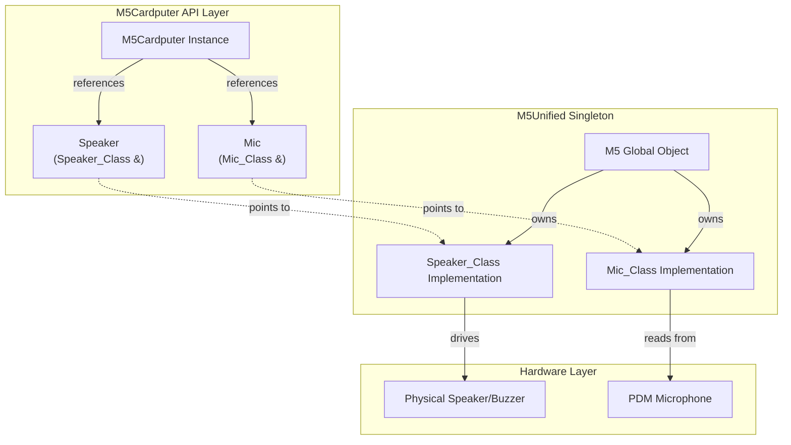
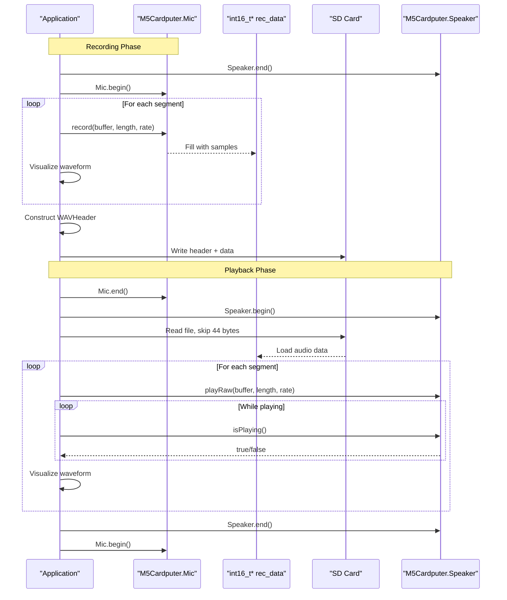

M5Cardputer Audio System

# Audio System

<details>
<summary>Relevant source files</summary>

The following files were used as context for generating this wiki page:

- [examples/Basic/buzzer/buzzer.ino](examples/Basic/buzzer/buzzer.ino)
- [examples/Basic/display/display.ino](examples/Basic/display/display.ino)
- [examples/Basic/mic_wav_record/mic_wav_record.ino](examples/Basic/mic_wav_record/mic_wav_record.ino)
- [src/M5Cardputer.h](src/M5Cardputer.h)

</details>


The Audio System provides audio input and output capabilities for the M5Cardputer through the integrated speaker and microphone. This page documents the `Speaker_Class` and `Mic_Class` interfaces, tone generation, audio recording, raw audio playback, and WAV file handling patterns.

For display-related audio visualization, see [Display System](#5). For SD card operations used in WAV file storage, see [Storage and File System](#7).

## Overview

The M5Cardputer audio system exposes two hardware components through M5Unified references:

| Component | Type | Purpose | Access Point |
|-----------|------|---------|--------------|
| Speaker | `Speaker_Class` | Tone generation, audio playback | `M5Cardputer.Speaker` |
| Microphone | `Mic_Class` | Audio recording | `M5Cardputer.Mic` |

Both components are references to the M5Unified singleton's audio subsystems [src/M5Cardputer.h:22-23](), meaning they share state with the global `M5` object. The audio system supports mono 16-bit PCM audio with configurable sample rates.

**Sources:** [src/M5Cardputer.h:1-45]()

## Audio System Architecture



**Diagram: Audio Component Ownership and Reference Pattern**

The `M5_CARDPUTER` class does not own the audio components; it provides typed references to the M5Unified singleton's `Speaker` and `Mic` instances. This ensures unified state management across all M5Stack APIs and prevents resource conflicts.

**Sources:** [src/M5Cardputer.h:14-39]()

## Speaker System

The `Speaker_Class` provides two primary functions: tone generation for alerts and beeps, and raw audio playback for recorded or generated audio data.

### Initialization and Configuration

The speaker must be initialized before use:

```cpp
M5Cardputer.Speaker.begin();      // Initialize speaker hardware
M5Cardputer.Speaker.setVolume(255); // Set volume (0-255)
M5Cardputer.Speaker.end();        // Release speaker resources
```

Volume control ranges from 0 (mute) to 255 (maximum). Call `end()` when switching from speaker to microphone mode, as both cannot operate simultaneously on most M5Stack hardware.

**Sources:** [examples/Basic/mic_wav_record/mic_wav_record.ino:100-102](), [examples/Basic/mic_wav_record/mic_wav_record.ino:331-332](), [examples/Basic/mic_wav_record/mic_wav_record.ino:369-370]()

### Tone Generation

The `tone()` method generates square wave tones at specified frequencies:

```cpp
M5Cardputer.Speaker.tone(frequency_hz, duration_ms);
```

| Parameter | Type | Description |
|-----------|------|-------------|
| `frequency_hz` | `int` | Tone frequency in Hz |
| `duration_ms` | `int` | Duration in milliseconds |

Example tone patterns [examples/Basic/buzzer/buzzer.ino:30-34]():

```cpp
M5Cardputer.Speaker.tone(10000, 100);  // High-pitched beep (10kHz, 100ms)
delay(1000);
M5Cardputer.Speaker.tone(4000, 20);    // Lower-pitched click (4kHz, 20ms)
```

Tone generation is non-blocking; the method returns immediately while the tone plays asynchronously.

**Sources:** [examples/Basic/buzzer/buzzer.ino:1-35]()

### Raw Audio Playback

The `playRaw()` method plays uncompressed 16-bit signed integer audio data:

```cpp
bool playRaw(const int16_t* data, size_t array_len, uint32_t sample_rate);
```

| Parameter | Type | Description |
|-----------|------|-------------|
| `data` | `const int16_t*` | Pointer to audio sample buffer |
| `array_len` | `size_t` | Number of samples |
| `sample_rate` | `uint32_t` | Sample rate in Hz |

Typical usage pattern [examples/Basic/mic_wav_record/mic_wav_record.ino:336-342]():

```cpp
for (uint16_t i = 0; i < record_number; i++) {
    M5Cardputer.Speaker.playRaw(&rec_data[i * record_length], 
                                 record_length, 
                                 record_samplerate);
    do {
        delay(1);
        M5Cardputer.update();
    } while (M5Cardputer.Speaker.isPlaying());
}
```

The `isPlaying()` method returns `true` while audio output is in progress. Applications must poll this method to detect playback completion, as `playRaw()` returns immediately.

**Sources:** [examples/Basic/mic_wav_record/mic_wav_record.ino:328-373]()

## Microphone System

The `Mic_Class` captures audio from the integrated PDM microphone into application-provided buffers.

### Initialization

```cpp
M5Cardputer.Mic.begin();           // Initialize microphone hardware
bool enabled = M5Cardputer.Mic.isEnabled();  // Check initialization state
M5Cardputer.Mic.end();             // Release microphone resources
```

The microphone and speaker share hardware resources on most M5Stack devices. Call `Speaker.end()` before `Mic.begin()` when switching modes [examples/Basic/mic_wav_record/mic_wav_record.ino:100-102]().

**Sources:** [examples/Basic/mic_wav_record/mic_wav_record.ino:102](), [examples/Basic/mic_wav_record/mic_wav_record.ino:117](), [examples/Basic/mic_wav_record/mic_wav_record.ino:331](), [examples/Basic/mic_wav_record/mic_wav_record.ino:370]()

### Recording Audio

The `record()` method captures audio samples into a provided buffer:

```cpp
bool record(int16_t* data, size_t array_len, uint32_t sample_rate);
```

| Parameter | Type | Description |
|-----------|------|-------------|
| `data` | `int16_t*` | Output buffer for samples |
| `array_len` | `size_t` | Number of samples to record |
| `sample_rate` | `uint32_t` | Sample rate in Hz |

Returns `true` if recording succeeded. Common sample rates are 8000, 16000, 22050, 44100 Hz.

Recording pattern with real-time visualization [examples/Basic/mic_wav_record/mic_wav_record.ino:121-146]():

```cpp
static constexpr const size_t record_length = 240;
static constexpr const size_t record_samplerate = 16000;

for (uint16_t i = 0; i < record_number; i++) {
    auto data = &rec_data[i * record_length];
    if (M5Cardputer.Mic.record(data, record_length, record_samplerate)) {
        // Process recorded samples
        // Visualize waveform on display
    }
}
```

The `record()` call blocks until the requested number of samples is captured. Buffer size and sample rate determine the recording duration: `duration_ms = (array_len / sample_rate) * 1000`.

**Sources:** [examples/Basic/mic_wav_record/mic_wav_record.ino:23-32](), [examples/Basic/mic_wav_record/mic_wav_record.ino:117-150]()

## Audio Data Flow

```mermaid
graph LR
    subgraph "Recording Pipeline"
        PDM["PDM Microphone<br/>Hardware"]
        MIC_REC["Mic.record()"]
        BUFFER["int16_t* Buffer<br/>(Application Memory)"]
        WAV_SAVE["saveWAVToSD()"]
        SD_FILE["SD Card<br/>.wav File"]
    end
    
    subgraph "Playback Pipeline"
        SD_READ["SD.open() + read()"]
        PLAY_BUFFER["int16_t* Buffer<br/>(Loaded Data)"]
        SPKR_PLAY["Speaker.playRaw()"]
        BUZZER_HW["Speaker/Buzzer<br/>Hardware"]
    end
    
    PDM -->|"capture samples"| MIC_REC
    MIC_REC -->|"fill buffer"| BUFFER
    BUFFER -->|"format + write"| WAV_SAVE
    WAV_SAVE -->|"write file"| SD_FILE
    
    SD_FILE -->|"read file"| SD_READ
    SD_READ -->|"load samples"| PLAY_BUFFER
    PLAY_BUFFER -->|"output samples"| SPKR_PLAY
    SPKR_PLAY -->|"drive hardware"| BUZZER_HW
```



**Diagram: Recording and Playback Data Flow**

Audio data flows through application-managed buffers in both directions. The microphone writes directly into application memory via `record()`, and the speaker reads directly from application memory via `playRaw()`. The application is responsible for buffer allocation, WAV formatting, and file I/O.

**Sources:** [examples/Basic/mic_wav_record/mic_wav_record.ino:98-106](), [examples/Basic/mic_wav_record/mic_wav_record.ino:258-282](), [examples/Basic/mic_wav_record/mic_wav_record.ino:328-373](), [examples/Basic/mic_wav_record/mic_wav_record.ino:375-398]()

## WAV File Format Handling

The M5Cardputer does not provide built-in WAV encoding/decoding. Applications must manually construct WAV headers for recording and skip headers when reading.

### WAV Header Structure

Standard WAV file header for 16-bit mono PCM audio [examples/Basic/mic_wav_record/mic_wav_record.ino:39-53]():

```cpp
struct WAVHeader {
    char riff[4]           = {'R', 'I', 'F', 'F'};
    uint32_t fileSize      = 0;                      // Total file size - 8 bytes
    char wave[4]           = {'W', 'A', 'V', 'E'};
    char fmt[4]            = {'f', 'm', 't', ' '};
    uint32_t fmtSize       = 16;
    uint16_t audioFormat   = 1;                      // PCM = 1
    uint16_t numChannels   = 1;                      // Mono
    uint32_t sampleRate    = record_samplerate;      // Samples per second
    uint32_t byteRate      = record_samplerate * sizeof(int16_t);
    uint16_t blockAlign    = sizeof(int16_t);
    uint16_t bitsPerSample = 16;
    char data[4]           = {'d', 'a', 't', 'a'};
    uint32_t dataSize      = 0;                      // Size of audio data in bytes
};
```

| Field | Bytes | Value | Description |
|-------|-------|-------|-------------|
| `fileSize` | 4 | `36 + dataSize` | Total file size minus 8 bytes |
| `audioFormat` | 2 | `1` | PCM (uncompressed) |
| `numChannels` | 2 | `1` | Mono audio |
| `sampleRate` | 4 | `16000` | Sample rate in Hz |
| `byteRate` | 4 | `sampleRate * 2` | Bytes per second |
| `bitsPerSample` | 2 | `16` | Bits per sample |
| `dataSize` | 4 | `samples * 2` | Audio data size in bytes |

**Sources:** [examples/Basic/mic_wav_record/mic_wav_record.ino:39-53]()

### Recording to WAV File

Complete WAV file creation pattern [examples/Basic/mic_wav_record/mic_wav_record.ino:375-398]():

```cpp
bool saveWAVToSD(int16_t* data, size_t dataSize) {
    char filename[32];
    snprintf(filename, sizeof(filename), "/recorded%lu.wav", file_counter++);
    
    File file = SD.open(filename, FILE_WRITE);
    if (!file) return false;
    
    // Populate header
    WAVHeader header;
    header.fileSize = 36 + dataSize * sizeof(int16_t);
    header.dataSize = dataSize * sizeof(int16_t);
    
    // Write header and data
    file.write((uint8_t*)&header, sizeof(WAVHeader));
    file.write((uint8_t*)data, dataSize * sizeof(int16_t));
    file.close();
    
    return true;
}
```

The header must be written before the audio data. The `fileSize` field is calculated as `36 + dataSize` where 36 is the combined size of all header fields after the RIFF chunk, and `dataSize` is the size of audio data in bytes.

**Sources:** [examples/Basic/mic_wav_record/mic_wav_record.ino:375-398]()

### Loading WAV Files for Playback

WAV playback requires skipping the 44-byte header [examples/Basic/mic_wav_record/mic_wav_record.ino:258-282]():

```cpp
File file = SD.open(filePath.c_str());
if (!file) return false;

// Skip 44-byte WAV header
file.seek(44);

// Read audio data directly into buffer
size_t bytesRead = file.read((uint8_t*)rec_data, 
                             record_size * sizeof(int16_t));
file.close();

if (bytesRead == 0) return false;

// Play loaded data
playWAV();
```

The standard WAV header is exactly 44 bytes for PCM audio. After seeking past the header, raw audio samples can be read directly into the playback buffer. No format conversion is needed if the sample rate and bit depth match the recording parameters.

**Sources:** [examples/Basic/mic_wav_record/mic_wav_record.ino:258-282](), [examples/Basic/mic_wav_record/mic_wav_record.ino:269-270]()

## WAV Recording and Playback Pattern



**Diagram: Complete Recording and Playback Sequence**

The sequence demonstrates the mutual exclusivity of microphone and speaker operations. Applications must explicitly switch between recording and playback modes by calling `end()` on one component before calling `begin()` on the other. Buffer memory is reused for both operations to minimize heap fragmentation.

**Sources:** [examples/Basic/mic_wav_record/mic_wav_record.ino:100-106](), [examples/Basic/mic_wav_record/mic_wav_record.ino:114-162](), [examples/Basic/mic_wav_record/mic_wav_record.ino:328-373]()

## Memory Management Patterns

### Buffer Allocation

Allocate recording buffers with sufficient size for the target duration [examples/Basic/mic_wav_record/mic_wav_record.ino:23-26]():

```cpp
static constexpr const size_t record_number = 512;      // Number of segments
static constexpr const size_t record_length = 240;      // Samples per segment
static constexpr const size_t record_size = record_number * record_length;
static constexpr const size_t record_samplerate = 16000; // Hz
```

Total recording duration: `(record_size / record_samplerate)` seconds = `(122880 / 16000)` ≈ 7.68 seconds.

Buffer allocation uses heap memory with DMA capability [examples/Basic/mic_wav_record/mic_wav_record.ino:98-99]():

```cpp
rec_data = (typeof(rec_data))heap_caps_malloc(record_size * sizeof(int16_t), 
                                               MALLOC_CAP_8BIT);
memset(rec_data, 0, record_size * sizeof(int16_t));
```

The `MALLOC_CAP_8BIT` flag ensures the buffer is suitable for DMA operations used by the audio hardware.

**Sources:** [examples/Basic/mic_wav_record/mic_wav_record.ino:23-32](), [examples/Basic/mic_wav_record/mic_wav_record.ino:98-99]()

### Segmented Processing

Processing audio in segments enables real-time visualization and reduces latency [examples/Basic/mic_wav_record/mic_wav_record.ino:121-150]():

```cpp
for (uint16_t i = 0; i < record_number; i++) {
    auto data = &rec_data[i * record_length];
    
    // Record one segment
    if (M5Cardputer.Mic.record(data, record_length, record_samplerate)) {
        // Process previous segment (i >= 2) while recording continues
        if (i >= 2) {
            data = &rec_data[(i - 2) * record_length];
            // Visualize waveform for previous segment
            for (int32_t x = 0; x < width; ++x) {
                // Draw waveform using data[x] samples
            }
        }
    }
}
```

This pattern records segment `i` while visualizing segment `i-2`, creating a pipeline that hides processing latency. The 2-segment delay ensures stable data for visualization while the current segment is being captured.

**Sources:** [examples/Basic/mic_wav_record/mic_wav_record.ino:121-150](), [examples/Basic/mic_wav_record/mic_wav_record.ino:336-367]()

## Common Usage Patterns

### Alert Tones

Short tone patterns for user feedback [examples/Basic/buzzer/buzzer.ino:17-35]():

```cpp
void setup() {
    M5Cardputer.begin();
    M5Cardputer.Display.drawString("Buzzer Test", 
                                   M5Cardputer.Display.width() / 2,
                                   M5Cardputer.Display.height() / 2);
}

void loop() {
    M5Cardputer.Speaker.tone(10000, 100);  // High beep
    delay(1000);
    M5Cardputer.Speaker.tone(4000, 20);    // Low click
    delay(1000);
}
```

**Sources:** [examples/Basic/buzzer/buzzer.ino:17-35]()

### Voice Recording and Playback

Complete voice memo application [examples/Basic/mic_wav_record/mic_wav_record.ino:108-163]():

```cpp
// Record on button press
if (M5Cardputer.BtnA.wasClicked()) {
    if (M5Cardputer.Mic.isEnabled()) {
        // Display recording indicator
        M5Cardputer.Display.fillCircle(70, 15, 8, RED);
        M5Cardputer.Display.drawString("REC", 120, 3);
        
        // Record audio in segments
        for (uint16_t i = 0; i < record_number; i++) {
            auto data = &rec_data[i * record_length];
            M5Cardputer.Mic.record(data, record_length, record_samplerate);
            // Real-time waveform visualization
        }
        
        // Save to SD card
        saveWAVToSD(rec_data, record_size);
    }
}
```

This pattern integrates button input, real-time visual feedback, and persistent storage into a complete recording workflow.

**Sources:** [examples/Basic/mic_wav_record/mic_wav_record.ino:108-163]()

### Audio File Management

File browser with playback control [examples/Basic/mic_wav_record/mic_wav_record.ino:193-256]():

```cpp
void scanAndDisplayWAVFiles() {
    // Scan SD card for .wav files
    File dir = SD.open("/");
    wavFiles.clear();
    while (File entry = dir.openNextFile()) {
        if (!entry.isDirectory() && String(entry.name()).endsWith(".wav")) {
            wavFiles.push_back(String(entry.name()));
        }
        entry.close();
    }
    dir.close();
    
    // Handle keyboard navigation
    if (M5Cardputer.Keyboard.isChange() && M5Cardputer.Keyboard.isPressed()) {
        Keyboard_Class::KeysState status = M5Cardputer.Keyboard.keysState();
        
        // Navigate with ';' (up) and '.' (down)
        if (data == ';') selectedFileIndex--;
        if (data == '.') selectedFileIndex++;
        
        // Delete with DEL key
        if (status.del) {
            SD.remove(filePath.c_str());
            wavFiles.erase(wavFiles.begin() + selectedFileIndex);
        }
        
        // Play with ENTER key
        if (status.enter) {
            playSelectedWAVFile(wavFiles[selectedFileIndex]);
        }
    }
}
```

This pattern demonstrates integration between keyboard input (see [Keyboard System](#4)), file system operations (see [Storage and File System](#7)), and audio playback.

**Sources:** [examples/Basic/mic_wav_record/mic_wav_record.ino:193-256]()

## State Management

The audio system requires explicit mode switching between recording and playback:

| Operation | Required Calls | Purpose |
|-----------|---------------|---------|
| Start Recording | `Speaker.end()` → `Mic.begin()` | Release speaker, acquire microphone |
| Start Playback | `Mic.end()` → `Speaker.begin()` | Release microphone, acquire speaker |
| Check Recording | `Mic.isEnabled()` | Verify microphone is ready |
| Check Playback | `Speaker.isPlaying()` | Poll for playback completion |

Hardware resource contention prevents simultaneous recording and playback. Applications must implement state machines that enforce proper mode transitions.

**Sources:** [examples/Basic/mic_wav_record/mic_wav_record.ino:100-102](), [examples/Basic/mic_wav_record/mic_wav_record.ino:117](), [examples/Basic/mic_wav_record/mic_wav_record.ino:331-332](), [examples/Basic/mic_wav_record/mic_wav_record.ino:339-342](), [examples/Basic/mic_wav_record/mic_wav_record.ino:369-370]()