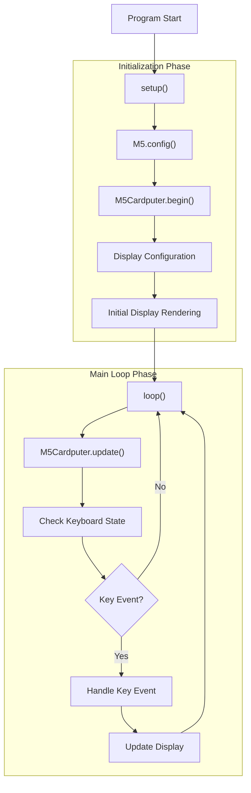
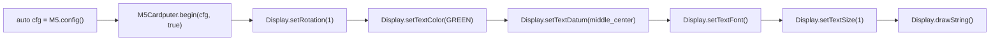
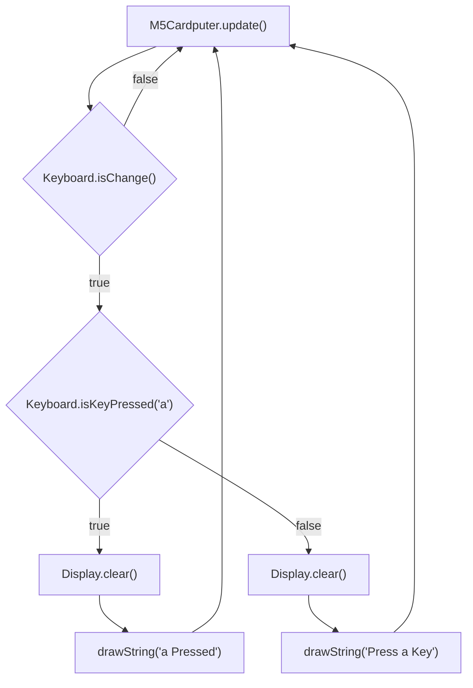
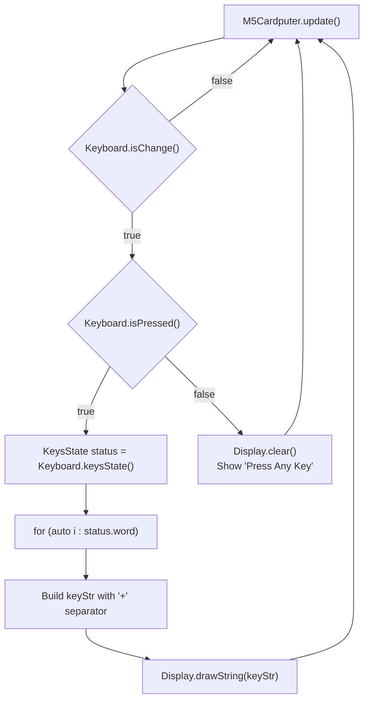
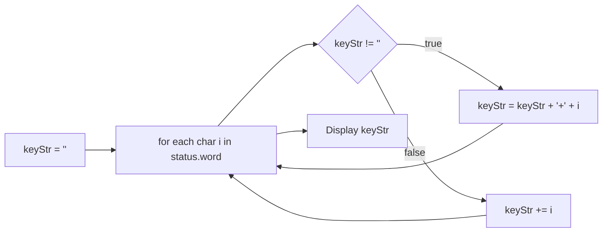
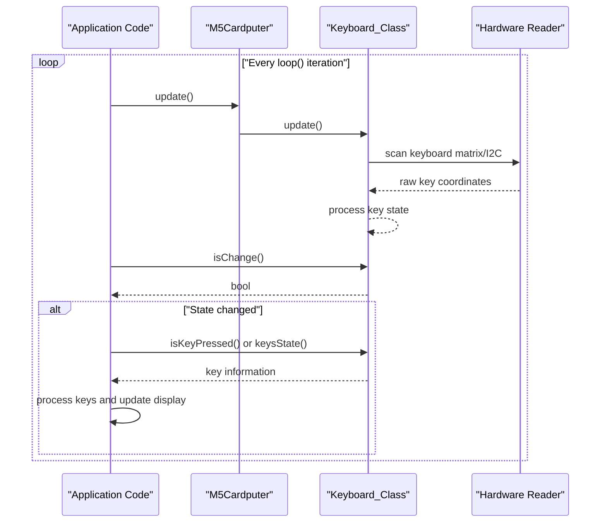

M5Cardputer Basic Example Walkthrough

# Basic Example Walkthrough

<details>
<summary>Relevant source files</summary>

The following files were used as context for generating this wiki page:

- [examples/Basic/ir_nec/ir_nec.ino](examples/Basic/ir_nec/ir_nec.ino)
- [examples/Basic/keyboard/multiPress/multiPress.ino](examples/Basic/keyboard/multiPress/multiPress.ino)
- [examples/Basic/keyboard/singlePress/singlePress.ino](examples/Basic/keyboard/singlePress/singlePress.ino)
- [src/M5Cardputer.h](src/M5Cardputer.h)

</details>


This document provides a step-by-step walkthrough of basic M5Cardputer applications, demonstrating core concepts of initialization, keyboard input processing, and display output. These examples illustrate the fundamental patterns used throughout the M5Cardputer ecosystem.

For information about the complete `Keyboard_Class` API, see [Keyboard_Class API](#4.1). For advanced keyboard handling patterns including text input and scrolling, see [Text Input and Display Patterns](#5.1).

---

## Program Structure Overview

All M5Cardputer applications follow a standard Arduino structure with two main functions: `setup()` for initialization and `loop()` for continuous execution. The typical program flow involves these key steps:



**Sources:** [examples/Basic/keyboard/singlePress/singlePress.ino:1-47](), [examples/Basic/keyboard/multiPress/multiPress.ino:1-57]()

---

## Single Key Press Example

The single key press example demonstrates the simplest keyboard input pattern: detecting when a specific key is pressed and responding to that event.

### Initialization Sequence

The initialization phase configures the M5Cardputer hardware and prepares the display:



**Code Entities and Roles:**

| Code Entity | Purpose | File Location |
|-------------|---------|---------------|
| `M5.config()` | Creates default configuration structure | [examples/Basic/keyboard/singlePress/singlePress.ino:19]() |
| `M5Cardputer.begin(cfg, true)` | Initializes hardware with keyboard enabled | [examples/Basic/keyboard/singlePress/singlePress.ino:20]() |
| `M5Cardputer.Display` | Reference to M5GFX display object | [src/M5Cardputer.h:19-20]() |
| `setRotation(1)` | Sets landscape orientation | [examples/Basic/keyboard/singlePress/singlePress.ino:21]() |
| `setTextColor(GREEN)` | Sets text rendering color | [examples/Basic/keyboard/singlePress/singlePress.ino:22]() |
| `setTextDatum(middle_center)` | Centers text alignment | [examples/Basic/keyboard/singlePress/singlePress.ino:23]() |

The `begin()` method's second parameter (`true`) enables the keyboard subsystem. Setting this to `false` would disable keyboard functionality, which is useful for applications that don't require keyboard input.

**Sources:** [examples/Basic/keyboard/singlePress/singlePress.ino:18-28](), [src/M5Cardputer.h:16-17]()

### Main Loop Processing

The main loop continuously checks for keyboard state changes and responds to specific key presses:



**Key Methods Explained:**

| Method | Return Type | Purpose |
|--------|-------------|---------|
| `M5Cardputer.update()` | `void` | Polls hardware, updates keyboard state | 
| `Keyboard.isChange()` | `bool` | Returns `true` if keyboard state changed since last call |
| `Keyboard.isKeyPressed(char)` | `bool` | Returns `true` if specific character key is currently pressed |
| `Display.clear()` | `void` | Clears display buffer |
| `Display.drawString()` | `void` | Renders text at specified position |

The `update()` call at [examples/Basic/keyboard/singlePress/singlePress.ino:32]() is critical—it triggers the keyboard scanning process that populates the internal key state. Without this call, keyboard methods will always return stale data.

The `isChange()` method at [examples/Basic/keyboard/singlePress/singlePress.ino:33]() acts as an edge detector, returning `true` only when the keyboard state has changed since the previous check. This prevents redundant display updates when no keys are pressed or when the same keys remain pressed.

**Sources:** [examples/Basic/keyboard/singlePress/singlePress.ino:31-46](), [src/M5Cardputer.h:34]()

---

## Multi-Key Press Example

The multi-key press example demonstrates handling simultaneous key presses and building composite input strings. This pattern is essential for modifier key combinations (Ctrl+C, Alt+Tab, etc.) and chord-based input.

### KeysState Structure Access

The multi-key example introduces the `KeysState` structure, which provides comprehensive information about all currently pressed keys:



**KeysState Access Pattern:**

At [examples/Basic/keyboard/multiPress/multiPress.ino:36](), the code declares:
```cpp
Keyboard_Class::KeysState status = M5Cardputer.Keyboard.keysState();
```

This retrieves the current keyboard state structure, which contains three key components:

| Member | Type | Contents |
|--------|------|----------|
| `word` | `std::vector<char>` | Character representations of pressed keys |
| `modifiers` | Bitmask | Flags for Shift, Ctrl, Alt, Fn, Opt, Caps Lock |
| `hid` | Array | USB HID key codes for pressed keys |

The example iterates through the `word` vector at [examples/Basic/keyboard/multiPress/multiPress.ino:38-44](), concatenating characters with a `+` separator to visualize simultaneous key presses.

**Sources:** [examples/Basic/keyboard/multiPress/multiPress.ino:31-56]()

### Multi-Key String Building

The string building logic demonstrates how to process multiple simultaneous key presses:



This logic produces outputs like:
- Single key: `"a"`
- Two keys: `"a+b"`
- Three keys: `"a+b+c"`

The conditional concatenation at [examples/Basic/keyboard/multiPress/multiPress.ino:39-43]() ensures the separator only appears between keys, not before the first key.

**Sources:** [examples/Basic/keyboard/multiPress/multiPress.ino:37-44]()

---

## Core Concepts Summary

### Essential Update-Check-Process Pattern

Both examples follow the fundamental pattern for M5Cardputer keyboard input:



**Critical Method Call Order:**

1. **`M5Cardputer.update()`** - Must be called every loop iteration to scan keyboard hardware
2. **`Keyboard.isChange()`** - Check if state changed before processing keys (avoids redundant work)
3. **`Keyboard.isKeyPressed()` or `Keyboard.keysState()`** - Query specific key state or get complete state

**Sources:** [examples/Basic/keyboard/singlePress/singlePress.ino:31-46](), [examples/Basic/keyboard/multiPress/multiPress.ino:31-56]()

### Display Update Patterns

Both examples demonstrate the standard display update pattern:

| Operation | Purpose | When to Use |
|-----------|---------|-------------|
| `Display.clear()` | Erases entire display | Before drawing new content to prevent artifacts |
| `Display.drawString()` | Renders text | To display keyboard feedback or status messages |
| Positioning via `width()/2`, `height()/2` | Centers text | Standard practice for single-line messages |

The examples use `middle_center` text datum [examples/Basic/keyboard/singlePress/singlePress.ino:23](), which means the X,Y coordinates passed to `drawString()` represent the text's center point rather than top-left corner. This simplifies center-aligned text rendering.

**Sources:** [examples/Basic/keyboard/singlePress/singlePress.ino:21-28](), [examples/Basic/keyboard/multiPress/multiPress.ino:21-28]()

### Comparison: Single vs. Multi-Key Approaches

| Aspect | Single Key Example | Multi-Key Example |
|--------|-------------------|-------------------|
| **Primary Method** | `isKeyPressed(char)` | `keysState()` |
| **Use Case** | Detecting specific key | Handling any/all keys |
| **Return Type** | `bool` | `KeysState` structure |
| **Processing** | Direct conditional | Iterate through `word` vector |
| **Complexity** | Simpler, focused | More comprehensive |
| **Typical Application** | Menu navigation, button press | Text input, key combinations |

The single key approach at [examples/Basic/keyboard/singlePress/singlePress.ino:34]() is optimal when the application only cares about specific keys. The multi-key approach at [examples/Basic/keyboard/multiPress/multiPress.ino:36]() is necessary when handling arbitrary input or multiple simultaneous keys.

**Sources:** [examples/Basic/keyboard/singlePress/singlePress.ino:34-44](), [examples/Basic/keyboard/multiPress/multiPress.ino:36-48]()

---

## Next Steps

After understanding these basic examples, developers can explore:

- **Advanced keyboard handling:** See [Keyboard_Class API](#4.1) for complete method reference including modifier key detection, HID codes, and word buffer management
- **Text input patterns:** See [Text Input and Display Patterns](#5.1) for implementing line editors, scrolling text, and cursor management
- **Complete keyboard state:** See [Key State and Events](#4.2) for details on the two-pass state update algorithm and modifier key handling
- **Additional examples:** See [Keyboard Input Examples](#9.2) for catalog of all provided keyboard examples

The patterns demonstrated in these basic examples—update-check-process cycle, state change detection, and structured display updates—form the foundation for all M5Cardputer applications.

**Sources:** [examples/Basic/keyboard/singlePress/singlePress.ino:1-47](), [examples/Basic/keyboard/multiPress/multiPress.ino:1-57](), [src/M5Cardputer.h:1-45]()