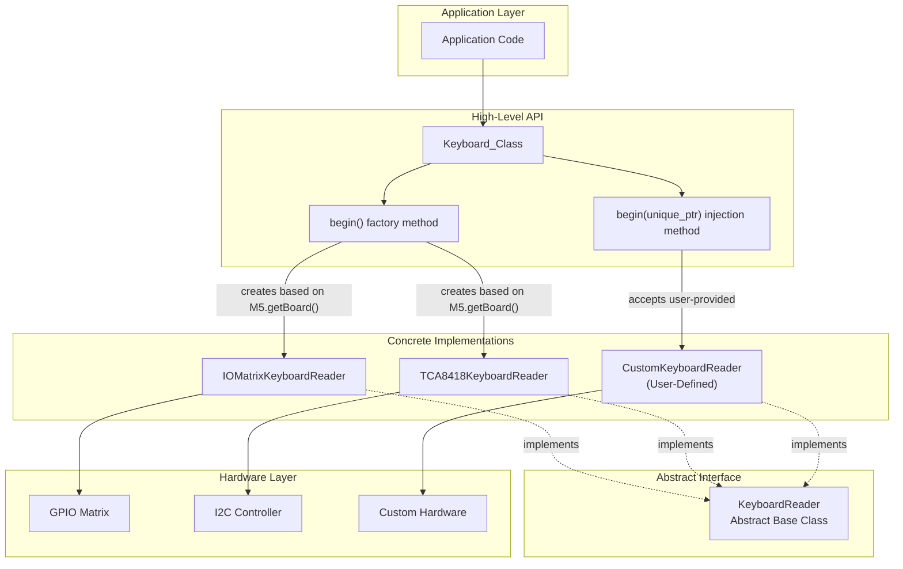
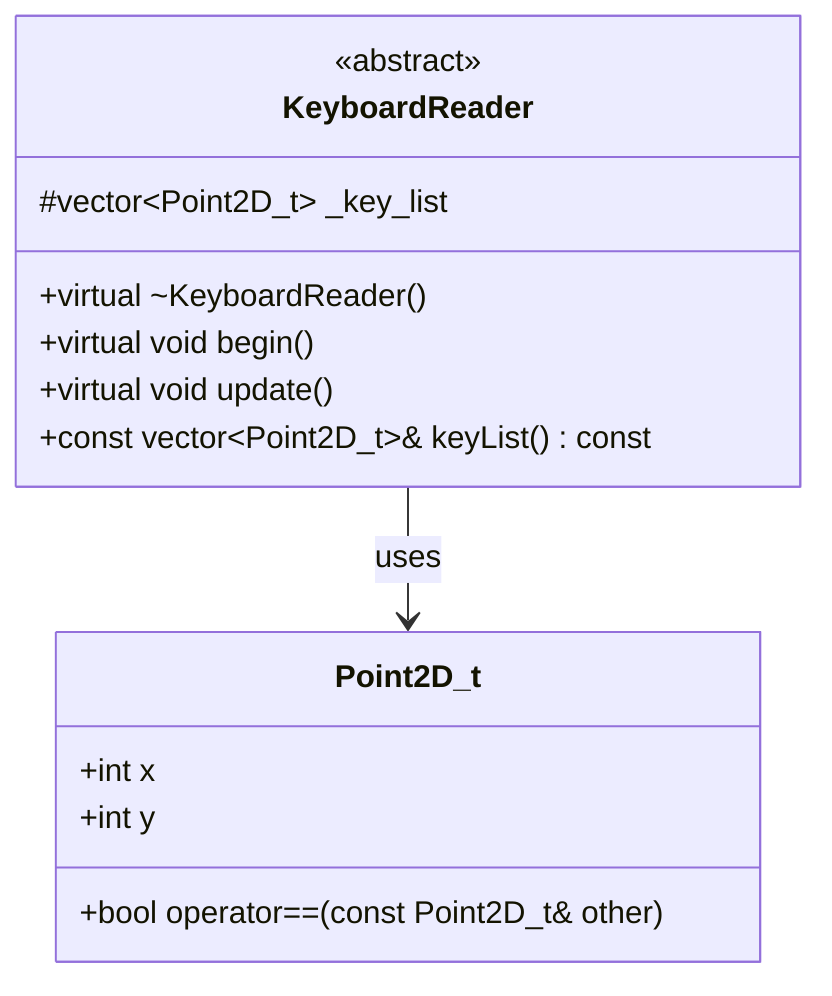
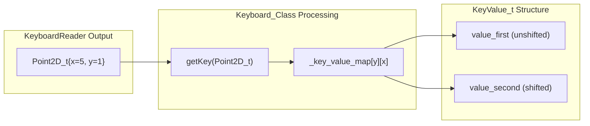
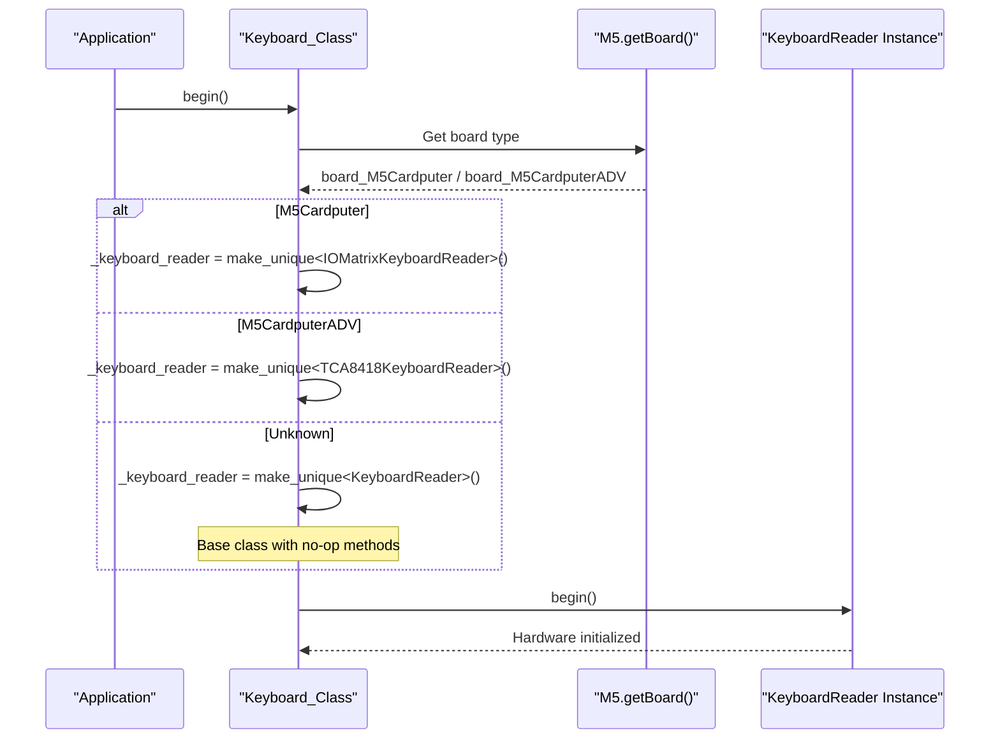
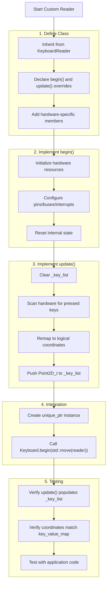
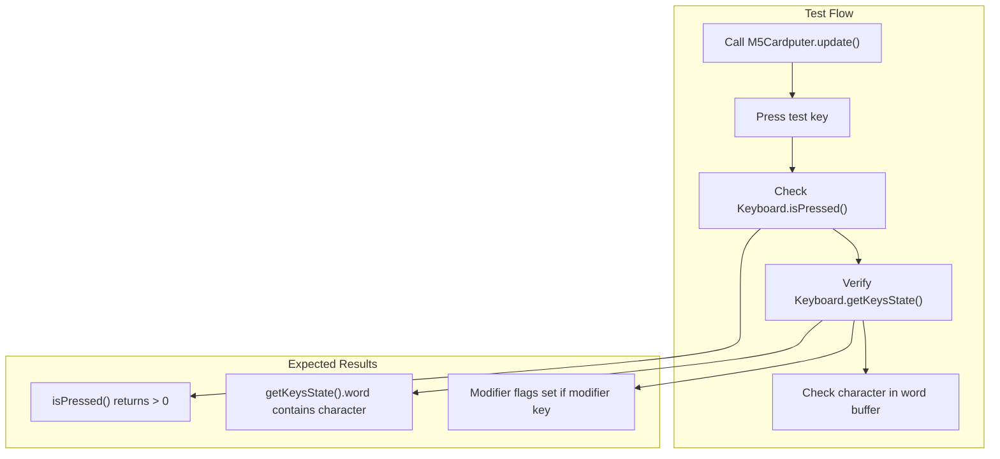
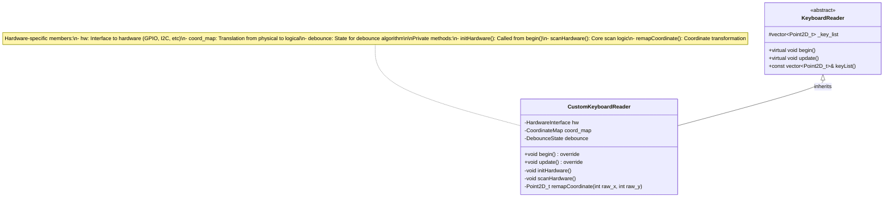

M5Cardputer Creating Custom Keyboard Readers

# Creating Custom Keyboard Readers

<details>
<summary>Relevant source files</summary>

The following files were used as context for generating this wiki page:

- [src/utility/Keyboard/Keyboard.cpp](src/utility/Keyboard/Keyboard.cpp)
- [src/utility/Keyboard/KeyboardReader/IOMatrix.cpp](src/utility/Keyboard/KeyboardReader/IOMatrix.cpp)
- [src/utility/Keyboard/KeyboardReader/KeyboardReader.h](src/utility/Keyboard/KeyboardReader/KeyboardReader.h)

</details>


This document provides a technical guide for implementing custom `KeyboardReader` subclasses to support new keyboard hardware or alternative input methods. It covers the abstract interface definition, implementation requirements, coordinate system conventions, and integration patterns for injecting custom readers into the keyboard subsystem.

For information about the existing keyboard implementations, see [IOMatrix Implementation (M5Cardputer)](#4.5) and [TCA8418 Implementation (M5Cardputer-ADV)](#4.6). For the high-level keyboard API used by applications, see [Keyboard_Class API](#4.1).

---

## Architecture Overview

The keyboard subsystem uses the Strategy pattern to abstract hardware differences. The `Keyboard_Class` owns a `KeyboardReader` instance through a `std::unique_ptr`, allowing runtime polymorphism without virtual function overhead after initialization.



**Sources:** [src/utility/Keyboard/Keyboard.cpp:15-37](), [src/utility/Keyboard/KeyboardReader/KeyboardReader.h:19-51]()

---

## KeyboardReader Abstract Interface

The `KeyboardReader` class defines the minimal interface that all keyboard implementations must satisfy. It is declared in [src/utility/Keyboard/KeyboardReader/KeyboardReader.h]().

### Core Components

| Component | Type | Purpose |
|-----------|------|---------|
| `begin()` | Virtual method | Initialize hardware resources (GPIO, I2C, interrupts) |
| `update()` | Virtual method | Scan hardware and populate `_key_list` with active keys |
| `keyList()` | Inline accessor | Return const reference to `_key_list` |
| `_key_list` | Protected member | `std::vector<Point2D_t>` storing currently pressed key coordinates |

### Interface Definition

The complete interface is defined at [src/utility/Keyboard/KeyboardReader/KeyboardReader.h:22-51]():



**Sources:** [src/utility/Keyboard/KeyboardReader/KeyboardReader.h:9-51]()

---

## Implementation Requirements

### Method Contracts

#### `begin()`

**Purpose:** Initialize hardware resources and prepare the keyboard for scanning.

**Responsibilities:**
- Configure GPIO pins (direction, pull-up/pull-down resistors)
- Initialize I2C communication or other buses
- Set up interrupt handlers if using interrupt-driven scanning
- Reset internal state variables

**Example from IOMatrixKeyboardReader:** [src/utility/Keyboard/KeyboardReader/IOMatrix.cpp:32-46]() configures 3 output pins and 7 input pins with pull-up resistors.

#### `update()`

**Purpose:** Scan the keyboard hardware and populate `_key_list` with currently pressed keys.

**Responsibilities:**
- Clear `_key_list` at the start of each scan
- Perform hardware scan (GPIO read, I2C read, or custom protocol)
- Convert hardware state to `Point2D_t` coordinates
- Apply coordinate remapping if needed
- Append each pressed key to `_key_list`

**Critical Implementation Details:**
- Must call `_key_list.clear()` before scanning to prevent stale data
- Should handle debouncing if hardware doesn't provide it
- Must respect the coordinate system conventions (see next section)
- Should be efficient as it's called every frame by `Keyboard_Class::updateKeyList()`

**Example from IOMatrixKeyboardReader:** [src/utility/Keyboard/KeyboardReader/IOMatrix.cpp:48-79]() demonstrates a complete GPIO matrix scan with coordinate remapping.

### Protected Member Management

The `_key_list` member is the sole communication channel between the reader and `Keyboard_Class`:

| Operation | Location | Purpose |
|-----------|----------|---------|
| `_key_list.clear()` | Start of `update()` | Remove previous scan results |
| `_key_list.push_back(coor)` | During scan | Add each pressed key |
| `_key_list` access | `Keyboard_Class::updateKeysState()` | Process keys through key mapping |

**Sources:** [src/utility/Keyboard/KeyboardReader/IOMatrix.cpp:48-79](), [src/utility/Keyboard/Keyboard.cpp:90-210]()

---

## Coordinate System and Key Mapping

### Point2D_t Structure

The `Point2D_t` struct [src/utility/Keyboard/KeyboardReader/KeyboardReader.h:9-17]() represents a key's logical position in a 2D matrix:

```
struct Point2D_t {
    int x;  // Column index (0-based)
    int y;  // Row index (0-based, typically 0-3 for M5Cardputer)
};
```

### Coordinate Convention

The coordinate system follows this convention:

| Axis | Range | Notes |
|------|-------|-------|
| X (columns) | Typically 0-13 | Depends on keyboard width; maps to character columns |
| Y (rows) | Typically 0-3 | Top row = 0, bottom row = 3 after remapping |
| Negative values | Allowed | Used by `Keyboard_Class::getKey()` to indicate invalid positions [src/utility/Keyboard/Keyboard.cpp:43-44]() |

### Key Mapping Integration

The coordinates returned by `update()` must match the indices used in `Keyboard_Class::_key_value_map`, a 4x14 array defined in [src/utility/Keyboard/Keyboard.h]():



**Implementation Strategy:** If your hardware's native coordinate system doesn't match this convention, apply coordinate remapping in `update()` before adding to `_key_list`. See [src/utility/Keyboard/KeyboardReader/IOMatrix.cpp:64-72]() for an example of Y-axis inversion and offset.

**Sources:** [src/utility/Keyboard/Keyboard.cpp:39-52](), [src/utility/Keyboard/KeyboardReader/IOMatrix.cpp:64-72]()

---

## Integration Patterns

### Factory-Based Integration

The default integration method uses automatic board detection at [src/utility/Keyboard/Keyboard.cpp:15-31]():



**Limitations:** This method only supports built-in board types. Custom readers require manual injection.

### Injection-Based Integration

For custom hardware, use the injection method at [src/utility/Keyboard/Keyboard.cpp:33-37]():

```cpp
// Application code (conceptual)
auto custom_reader = std::make_unique<CustomKeyboardReader>();
M5Cardputer.Keyboard.begin(std::move(custom_reader));
```

**Key Points:**
- Pass ownership via `std::move()` - the unique_ptr is transferred to `Keyboard_Class`
- The custom reader's `begin()` method is called automatically
- After injection, the `Keyboard_Class` uses the custom reader for all operations

**Sources:** [src/utility/Keyboard/Keyboard.cpp:15-37]()

---

## Implementation Workflow

### Step-by-Step Process



**Sources:** [src/utility/Keyboard/KeyboardReader/KeyboardReader.h:22-51](), [src/utility/Keyboard/Keyboard.cpp:33-37]()

---

## Hardware-Specific Considerations

### GPIO Matrix Scanning

For hardware using GPIO matrix scanning (like IOMatrixKeyboardReader):

| Consideration | Implementation Detail |
|---------------|----------------------|
| **Pin Configuration** | Set output pins to OUTPUT mode, input pins to INPUT_PULLUP [src/utility/Keyboard/KeyboardReader/IOMatrix.cpp:34-43]() |
| **Scan Method** | Iterate through output combinations, read input states [src/utility/Keyboard/KeyboardReader/IOMatrix.cpp:55-78]() |
| **Debouncing** | Implement in software or rely on hardware capacitors |
| **Coordinate Mapping** | May require complex remapping based on physical layout [src/utility/Keyboard/KeyboardReader/IOMatrix.cpp:64-72]() |

### I2C Controller Chips

For hardware using I2C keyboard controllers (like TCA8418KeyboardReader):

| Consideration | Implementation Detail |
|---------------|----------------------|
| **I2C Initialization** | Configure I2C bus, verify device presence at expected address |
| **Register Configuration** | Set up controller registers for matrix size, debounce, interrupts |
| **Interrupt Handling** | Optionally use interrupt pin to trigger scans instead of polling |
| **FIFO Management** | Read and clear event FIFO if controller provides one |

### Custom Input Methods

For non-traditional input methods (touchscreen keyboard, gesture recognition, etc.):

| Consideration | Strategy |
|---------------|----------|
| **Coordinate Synthesis** | Map input events to virtual Point2D_t coordinates |
| **Multi-Touch** | Populate `_key_list` with multiple simultaneous keys |
| **Gesture Translation** | Convert gestures to key sequences in `update()` |
| **Timing** | Ensure `update()` completes within frame time (called frequently) |

**Sources:** [src/utility/Keyboard/KeyboardReader/IOMatrix.cpp:9-79]()

---

## Testing and Validation

### Unit Testing Checklist

| Test Case | Expected Behavior | Validation Method |
|-----------|-------------------|-------------------|
| Single key press | `_key_list.size() == 1` with correct coordinates | Call `update()`, inspect `keyList()` |
| Multiple keys | `_key_list.size() == N` with all coordinates | Test key combinations |
| No keys pressed | `_key_list.size() == 0` | Call `update()` with no input |
| Key release | Previously present key removed from `_key_list` | Press then release |
| Coordinate range | All `x` and `y` values within valid bounds | Check min/max values |

### Integration Testing

After injecting your custom reader, verify integration with `Keyboard_Class`:



**Critical Integration Points:**
- `Keyboard_Class::updateKeyList()` must call your `update()` method [src/utility/Keyboard/Keyboard.cpp:54-59]()
- `Keyboard_Class::getKey()` must resolve your coordinates correctly [src/utility/Keyboard/Keyboard.cpp:39-52]()
- `Keyboard_Class::updateKeysState()` must process your key list through the two-pass algorithm [src/utility/Keyboard/Keyboard.cpp:90-210]()

**Sources:** [src/utility/Keyboard/Keyboard.cpp:39-59](), [src/utility/Keyboard/Keyboard.cpp:90-210]()

---

## Common Implementation Patterns

### Pattern 1: Interrupt-Driven Scanning

For hardware with interrupt capability:

| Component | Implementation |
|-----------|----------------|
| Interrupt handler | Set flag in ISR, defer processing to `update()` |
| `begin()` | Attach interrupt to pin, configure trigger mode |
| `update()` | Check flag, scan hardware if set, clear flag |

**Advantages:** Reduces CPU usage, improves responsiveness
**Trade-offs:** More complex interrupt management, potential race conditions

### Pattern 2: Polling with State Caching

For hardware without interrupts:

| Component | Implementation |
|-----------|----------------|
| Previous state cache | Store previous scan results in member variable |
| `update()` | Compare new scan with cache, only update on changes |
| Debounce timer | Track time since last change per key |

**Advantages:** Simpler implementation, predictable behavior
**Trade-offs:** Higher CPU usage if polling frequency is high

### Pattern 3: Coordinate Translation Table

For complex physical layouts:

| Component | Implementation |
|-----------|----------------|
| Lookup table | `const` array mapping hardware coordinates to logical coordinates |
| `update()` | Look up each hardware coordinate in table during scan |
| Table generation | Pre-compute or generate at `begin()` |

**Advantages:** Separates hardware layout from logical mapping
**Trade-offs:** Additional memory for table, indirection overhead

**Sources:** [src/utility/Keyboard/KeyboardReader/IOMatrix.cpp:48-79]()

---

## Example: Conceptual Custom Reader Structure

The following diagram illustrates the typical structure of a custom reader implementation:



**Key Implementation Files to Reference:**
- Abstract interface: [src/utility/Keyboard/KeyboardReader/KeyboardReader.h]()
- GPIO matrix example: [src/utility/Keyboard/KeyboardReader/IOMatrix.cpp]()
- Factory integration: [src/utility/Keyboard/Keyboard.cpp:15-31]()
- Injection integration: [src/utility/Keyboard/Keyboard.cpp:33-37]()

**Sources:** [src/utility/Keyboard/KeyboardReader/KeyboardReader.h:22-51](), [src/utility/Keyboard/KeyboardReader/IOMatrix.cpp:1-79](), [src/utility/Keyboard/Keyboard.cpp:15-37]()

---

## Summary

Creating a custom keyboard reader requires:

1. **Inherit from `KeyboardReader`** and override `begin()` and `update()` methods
2. **Initialize hardware** in `begin()` - configure pins, buses, and interrupts
3. **Populate `_key_list`** in `update()` - clear it first, then add pressed keys as `Point2D_t` coordinates
4. **Respect coordinate conventions** - ensure coordinates match `Keyboard_Class::_key_value_map` indices
5. **Inject via `begin(std::unique_ptr<KeyboardReader>)`** - transfer ownership to `Keyboard_Class`

The minimal interface (`begin()`, `update()`, `_key_list`) provides maximum flexibility while integrating seamlessly with the keyboard processing pipeline. The Strategy pattern ensures custom readers work identically to built-in implementations from the application's perspective.

**Sources:** [src/utility/Keyboard/KeyboardReader/KeyboardReader.h](), [src/utility/Keyboard/Keyboard.cpp]()