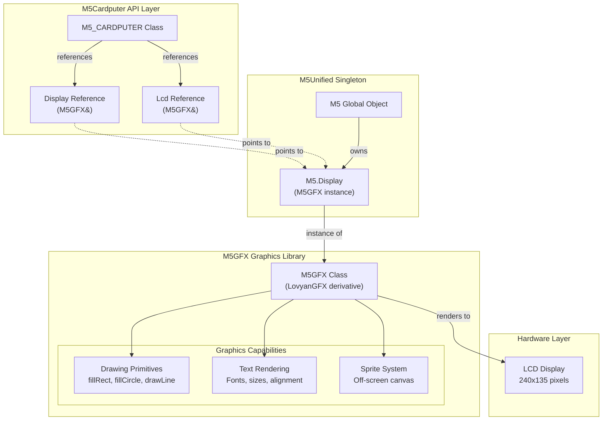
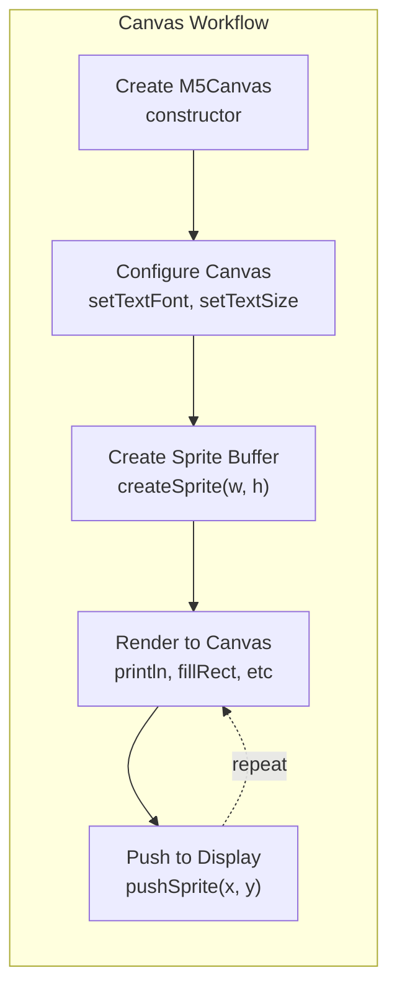
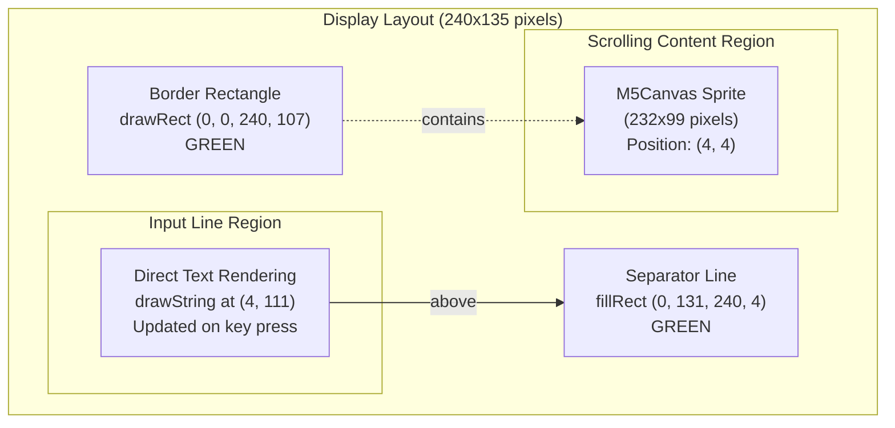

M5Cardputer Display System

# Display System

<details>
<summary>Relevant source files</summary>

The following files were used as context for generating this wiki page:

- [examples/Basic/buzzer/buzzer.ino](examples/Basic/buzzer/buzzer.ino)
- [examples/Basic/display/display.ino](examples/Basic/display/display.ino)
- [examples/Basic/keyboard/inputText/inputText.ino](examples/Basic/keyboard/inputText/inputText.ino)
- [src/M5Cardputer.h](src/M5Cardputer.h)

</details>


## Purpose and Scope

This document covers the display system of the M5Cardputer library, detailing how to perform graphics operations, text rendering, and screen management through the M5GFX graphics library. The display system provides access to a 240x135 pixel LCD screen with support for rotation, multiple text fonts, graphics primitives, and off-screen rendering using sprites.

For information about higher-level text input patterns that combine display and keyboard operations, see [Text Input and Display Patterns](#5.1). For audio-related display examples, see [Audio System](#6).

## Display Hardware Abstraction

The M5Cardputer library exposes the display through a reference to the M5GFX instance managed by M5Unified. Both `Display` and `Lcd` accessors provide the same underlying M5GFX object.



**Sources:** [src/M5Cardputer.h:19-20]()

The display is accessed through two equivalent references defined in the `M5_CARDPUTER` class:

| Accessor | Type | Description |
|----------|------|-------------|
| `Display` | `M5GFX&` | Primary display reference |
| `Lcd` | `M5GFX&` | Alias for `Display` (for backward compatibility) |

Both references point to `M5.Display`, ensuring unified state management across the M5Stack ecosystem. This reference pattern means display operations are zero-copy and share state with any other code that accesses `M5.Display` directly.

**Sources:** [src/M5Cardputer.h:19-20]()

## Display Initialization

The display is automatically initialized when calling `M5Cardputer.begin()`. No explicit display setup is required beyond initial configuration such as rotation and text properties.

### Setting Display Rotation

The M5Cardputer display should typically be set to rotation 1 for landscape orientation:

```cpp
M5Cardputer.Display.setRotation(1);
```

Valid rotation values are:
- `0`: Portrait (135x240)
- `1`: Landscape (240x135) - **Standard orientation for M5Cardputer**
- `2`: Portrait inverted
- `3`: Landscape inverted

**Sources:** [examples/Basic/keyboard/inputText/inputText.ino:25](), [examples/Basic/buzzer/buzzer.ino:20]()

## Text Rendering

### Font Selection

M5GFX provides multiple built-in fonts and supports custom fonts. Fonts are accessed through the `fonts` namespace:

```cpp
M5Cardputer.Display.setTextFont(&fonts::FreeSerifBoldItalic18pt7b);
M5Cardputer.Display.setTextFont(&fonts::Orbitron_Light_32);
```

### Text Size and Scaling

Text size is controlled by `setTextSize()`, which accepts a scaling factor:

```cpp
M5Cardputer.Display.setTextSize(0.5);  // 50% scale
M5Cardputer.Display.setTextSize(1);    // 100% scale (default)
```

**Sources:** [examples/Basic/keyboard/inputText/inputText.ino:26](), [examples/Basic/buzzer/buzzer.ino:24]()

### Text Color and Alignment

```cpp
// Set text color
M5Cardputer.Display.setTextColor(GREEN);

// Set text alignment datum
M5Cardputer.Display.setTextDatum(middle_center);
```

Common text datum values:
- `top_left`, `top_center`, `top_right`
- `middle_left`, `middle_center`, `middle_right`
- `bottom_left`, `bottom_center`, `bottom_right`

**Sources:** [examples/Basic/buzzer/buzzer.ino:21-22]()

### Drawing Text

Text can be drawn using either `drawString()` for positioned text or `println()` for sequential output:

```cpp
// Positioned text
M5Cardputer.Display.drawString("Buzzer Test", 
                               M5Cardputer.Display.width() / 2,
                               M5Cardputer.Display.height() / 2);
```

**Sources:** [examples/Basic/buzzer/buzzer.ino:25-27](), [examples/Basic/keyboard/inputText/inputText.ino:41]()

## Graphics Primitives

M5GFX provides a comprehensive set of drawing primitives. All primitives accept color values as 16-bit RGB565 format.

### Common Drawing Functions

| Function | Description | Example |
|----------|-------------|---------|
| `fillRect(x, y, w, h, color)` | Filled rectangle | [examples/Basic/keyboard/inputText/inputText.ino:31-32]() |
| `drawRect(x, y, w, h, color)` | Rectangle outline | [examples/Basic/keyboard/inputText/inputText.ino:27-28]() |
| `fillCircle(x, y, r, color)` | Filled circle | [examples/Basic/display/display.ino:40]() |
| `drawLine(x0, y0, x1, y1, color)` | Line segment | Referenced in M5GFX |

### Display Dimensions

Access display dimensions using:

```cpp
int width = M5Cardputer.Display.width();
int height = M5Cardputer.Display.height();
```

For the standard M5Cardputer display in landscape mode (rotation 1):
- Width: 240 pixels
- Height: 135 pixels

**Sources:** [examples/Basic/keyboard/inputText/inputText.ino:27-28](), [examples/Basic/display/display.ino:36-38]()

### Graphics Example

```cpp
// Random colored circles
int x = rand() % M5Cardputer.Display.width();
int y = rand() % M5Cardputer.Display.height();
int r = (M5Cardputer.Display.width() >> 4) + 2;
uint16_t c = rand();
M5Cardputer.Display.fillCircle(x, y, r, c);
```

**Sources:** [examples/Basic/display/display.ino:36-40]()

## Canvas and Sprite System

M5GFX provides the `M5Canvas` class for off-screen rendering. Canvases are useful for:
- Buffering complex graphics before display
- Implementing scrolling regions
- Reducing flicker in animations

### Canvas Creation and Configuration



**Sources:** [examples/Basic/keyboard/inputText/inputText.ino:19-40]()

### Creating a Canvas

```cpp
// Create canvas attached to display
M5Canvas canvas(&M5Cardputer.Display);

// Configure canvas properties
canvas.setTextFont(&fonts::FreeSerifBoldItalic18pt7b);
canvas.setTextSize(0.5);

// Allocate sprite buffer
canvas.createSprite(M5Cardputer.Display.width() - 8,
                    M5Cardputer.Display.height() - 36);
```

**Sources:** [examples/Basic/keyboard/inputText/inputText.ino:19](), [examples/Basic/keyboard/inputText/inputText.ino:34-37]()

### Text Scrolling with Canvas

Canvases support automatic text scrolling, useful for terminal-like interfaces:

```cpp
canvas.setTextScroll(true);
canvas.println("Press Key and Enter to Input Text");
```

When text scrolling is enabled, calling `println()` automatically scrolls content upward when the canvas is full.

**Sources:** [examples/Basic/keyboard/inputText/inputText.ino:38-39]()

### Pushing Canvas to Display

After rendering to a canvas, push it to the display at a specific position:

```cpp
canvas.pushSprite(4, 4);  // Push canvas at position (4, 4)
```

This operation transfers the sprite buffer to the display framebuffer at the specified coordinates.

**Sources:** [examples/Basic/keyboard/inputText/inputText.ino:40]()

## Display Update Patterns

### Direct Drawing Pattern

For simple graphics or infrequent updates, draw directly to the display:

```cpp
void loop() {
    // Draw directly to display
    M5Cardputer.Display.fillCircle(x, y, r, color);
    
    // No explicit refresh needed - M5GFX updates immediately
}
```

**Sources:** [examples/Basic/display/display.ino:35-42]()

### Canvas Buffering Pattern

For complex UIs or regions that require updates without flicker, use canvas buffering:

```cpp
// Setup phase - create canvas once
M5Canvas canvas(&M5Cardputer.Display);
canvas.createSprite(width, height);

// Update phase - render to canvas, then push
canvas.fillScreen(BLACK);  // Clear canvas
canvas.println("New content");
canvas.pushSprite(x, y);   // Transfer to display
```

This pattern is demonstrated in the `inputText` example, which maintains a scrolling text region using a canvas while updating a separate input line directly on the display.

**Sources:** [examples/Basic/keyboard/inputText/inputText.ino:36-40](), [examples/Basic/keyboard/inputText/inputText.ino:60-61]()

### Multi-Region Display Pattern

The `inputText` example demonstrates managing multiple display regions:



**Sources:** [examples/Basic/keyboard/inputText/inputText.ino:27-32](), [examples/Basic/keyboard/inputText/inputText.ino:36-40](), [examples/Basic/keyboard/inputText/inputText.ino:41]()

The layout consists of:
1. **Border**: Green rectangle framing the content area
2. **Scrolling Region**: Canvas sprite for scrolling text output
3. **Separator**: Horizontal line dividing regions
4. **Input Line**: Direct text rendering for real-time input display

This pattern minimizes redraws by:
- Using a sprite for the scrolling region (updates only when Enter is pressed)
- Clearing and redrawing only the input line area on each key press

### Clearing Display Regions

To clear a specific region without clearing the entire display:

```cpp
// Clear input line area
M5Cardputer.Display.fillRect(0, M5Cardputer.Display.height() - 28,
                             M5Cardputer.Display.width(), 25,
                             BLACK);
```

**Sources:** [examples/Basic/keyboard/inputText/inputText.ino:65-67]()

## Common Display Operations

### Getting Display Dimensions

```cpp
int width = M5Cardputer.Display.width();   // 240 in rotation 1
int height = M5Cardputer.Display.height(); // 135 in rotation 1
```

### Color Constants

M5GFX provides standard color constants:
- `BLACK`, `WHITE`
- `RED`, `GREEN`, `BLUE`
- `YELLOW`, `CYAN`, `MAGENTA`
- And many more...

**Sources:** [examples/Basic/keyboard/inputText/inputText.ino:28](), [examples/Basic/buzzer/buzzer.ino:21]()

### Display Properties Reference

| Property | Method | Description |
|----------|--------|-------------|
| Rotation | `setRotation(0-3)` | Display orientation |
| Text Font | `setTextFont(&font)` | Font for text rendering |
| Text Size | `setTextSize(scale)` | Text scaling factor |
| Text Color | `setTextColor(color)` | Foreground color for text |
| Text Datum | `setTextDatum(datum)` | Text alignment anchor point |

## M5GFX Integration

The M5Cardputer display system is built on M5GFX, which is a derivative of the LovyanGFX library. Applications can use the full M5GFX API through the `M5Cardputer.Display` reference.

For comprehensive M5GFX API documentation, refer to:
- M5GFX GitHub: https://github.com/m5stack/M5GFX
- LovyanGFX documentation (parent library)

Common M5GFX capabilities available include:
- Hardware-accelerated graphics operations
- Multiple font support (built-in and custom)
- Image loading and display (BMP, JPEG, PNG)
- Color space conversions
- DMA-based transfers for performance

**Sources:** [src/M5Cardputer.h:19-20]()

### Function Pointer Pattern for Graphics Operations

M5GFX objects can be passed as `LovyanGFX*` pointers to generic drawing functions:

```cpp
void draw_function(LovyanGFX* gfx) {
    int x = rand() % gfx->width();
    int y = rand() % gfx->height();
    int r = (gfx->width() >> 4) + 2;
    uint16_t c = rand();
    gfx->fillRect(x - r, y - r, r * 2, r * 2, c);
}

// Call with M5Cardputer display
draw_function(&M5Cardputer.Display);
```

This pattern allows writing reusable graphics code that works with both displays and canvases.

**Sources:** [examples/Basic/display/display.ino:17-23](), [examples/Basic/display/display.ino:41]()