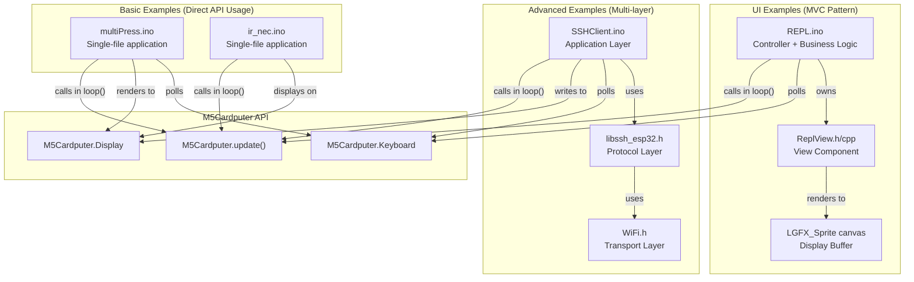
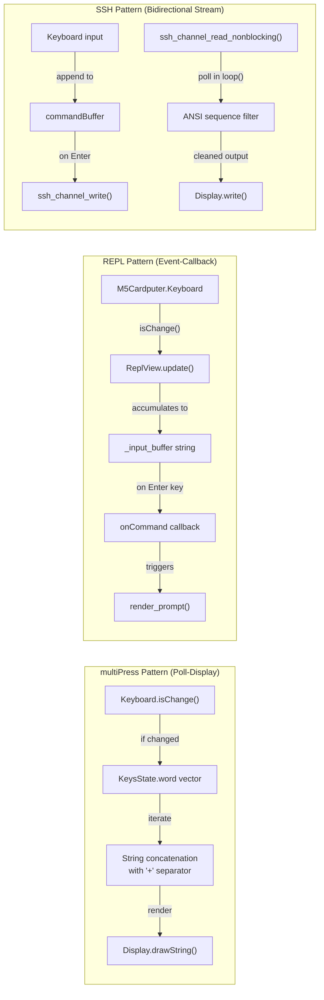

M5Cardputer Example Applications

# Example Applications

<details>
<summary>Relevant source files</summary>

The following files were used as context for generating this wiki page:

- [examples/Advanced/SSHClient/SSHClient.ino](examples/Advanced/SSHClient/SSHClient.ino)
- [examples/Basic/ir_nec/ir_nec.ino](examples/Basic/ir_nec/ir_nec.ino)
- [examples/Basic/keyboard/multiPress/multiPress.ino](examples/Basic/keyboard/multiPress/multiPress.ino)
- [examples/UI/REPL/REPL.ino](examples/UI/REPL/REPL.ino)
- [examples/UI/REPL/ReplView.cpp](examples/UI/REPL/ReplView.cpp)
- [examples/UI/REPL/ReplView.h](examples/UI/REPL/ReplView.h)

</details>


This document provides an overview of the example applications included with the M5Cardputer library. These examples demonstrate various hardware features, interaction patterns, and application architectures ranging from simple keyboard input to complex networked terminal emulation.

For detailed walkthrough of the REPL application, see [REPL Application](#9.1). For a catalog of keyboard-specific examples, see [Keyboard Input Examples](#9.2). For SSH client implementation details, see [SSH Client Application](#8.1).

## Purpose and Scope

The example applications serve three primary purposes:
1. **Learning Resource**: Demonstrate correct usage patterns for M5Cardputer APIs
2. **Testing Framework**: Verify hardware functionality across different board variants
3. **Application Templates**: Provide starting points for custom applications

Each example is self-contained and can be compiled independently using the Arduino IDE or PlatformIO.

## Example Categories

The examples are organized into three directories based on complexity and functionality:

| Category | Directory | Target Audience | Required Knowledge |
|----------|-----------|-----------------|-------------------|
| **Basic** | `examples/Basic/` | Beginners | Arduino programming, basic C++ |
| **UI** | `examples/UI/` | Intermediate | Event handling, graphics rendering |
| **Advanced** | `examples/Advanced/` | Advanced | Network protocols, system architecture |

## Example Inventory

### Basic Examples

These examples demonstrate fundamental hardware features with minimal code complexity.

#### Keyboard Examples

| Example | File Path | Purpose | Key APIs |
|---------|-----------|---------|----------|
| **multiPress** | [examples/Basic/keyboard/multiPress/multiPress.ino]() | Multi-key press detection | `Keyboard.isChange()`, `Keyboard.keysState()`, `KeysState.word` |

**multiPress** demonstrates simultaneous key press handling (up to 3 keys). The application displays all pressed keys concatenated with "+" separators [examples/Basic/keyboard/multiPress/multiPress.ino:36-44](). It uses the `isChange()` method to detect state transitions and `keysState().word` vector to retrieve all active characters.

#### Infrared Examples

| Example | File Path | Purpose | Key APIs |
|---------|-----------|---------|----------|
| **ir_nec** | [examples/Basic/ir_nec/ir_nec.ino]() | NEC protocol IR transmission | `IrSender.sendNEC()`, IRremote library |

**ir_nec** sends infrared signals using the NEC protocol on GPIO 44 [examples/Basic/ir_nec/ir_nec.ino:22](). The example increments command codes (0x34 onwards) and displays transmission status on screen [examples/Basic/ir_nec/ir_nec.ino:60-72]().

Sources: [examples/Basic/keyboard/multiPress/multiPress.ino](), [examples/Basic/ir_nec/ir_nec.ino]()

### UI Examples

These examples demonstrate user interface patterns, text rendering, and interactive application architecture.

#### REPL Application

| Example | File Path | Purpose | Key Patterns |
|---------|-----------|---------|--------------|
| **REPL** | [examples/UI/REPL/REPL.ino]() | Interactive command-line interface | MVC separation, callback architecture, sprite-based rendering |

The **REPL** (Read-Eval-Print Loop) example implements a number guessing game with a reusable terminal UI component. It demonstrates:
- Sprite-based canvas rendering [examples/UI/REPL/REPL.ino:9,66-67]()
- Callback-based command handling [examples/UI/REPL/REPL.ino:70,35-59]()
- Cursor blinking and text input management [examples/UI/REPL/ReplView.cpp:136-143]()
- Screen scrolling with text wrapping [examples/UI/REPL/ReplView.cpp:61-64]()

The application separates view logic (`ReplView` class) from business logic (game state in `REPL.ino`), making the UI component reusable for other terminal-style applications.

Sources: [examples/UI/REPL/REPL.ino](), [examples/UI/REPL/ReplView.h](), [examples/UI/REPL/ReplView.cpp]()

### Advanced Examples

These examples demonstrate complex system integration, network protocols, and multi-threaded architectures.

#### SSH Client

| Example | File Path | Purpose | Key Technologies |
|---------|-----------|---------|------------------|
| **SSHClient** | [examples/Advanced/SSHClient/SSHClient.ino]() | Secure Shell terminal emulator | LibSSH-ESP32, WiFi, PTY handling, ANSI filtering |

The **SSHClient** example implements a full SSH terminal emulator with:
- Interactive credential input [examples/Advanced/SSHClient/SSHClient.ino:66-72]()
- PTY (pseudo-terminal) session management [examples/Advanced/SSHClient/SSHClient.ino:105-121]()
- Bidirectional data streaming (keyboard → SSH, SSH → display) [examples/Advanced/SSHClient/SSHClient.ino:129-221]()
- ANSI escape sequence filtering [examples/Advanced/SSHClient/SSHClient.ino:192-204]()
- Automatic display scrolling [examples/Advanced/SSHClient/SSHClient.ino:174-180]()
- Input debouncing [examples/Advanced/SSHClient/SSHClient.ino:36,132-133]()

The application uses non-blocking SSH channel reads [examples/Advanced/SSHClient/SSHClient.ino:185]() to maintain UI responsiveness while processing remote server output.

Sources: [examples/Advanced/SSHClient/SSHClient.ino]()

## Example Architecture Patterns



**Figure 1: Example Architecture Patterns by Complexity**

This diagram shows how examples at different complexity levels structure their code:
- **Basic examples** use direct API calls in a flat structure
- **UI examples** separate view components from business logic
- **Advanced examples** integrate multiple libraries with layered architecture

Sources: [examples/Basic/keyboard/multiPress/multiPress.ino](), [examples/Basic/ir_nec/ir_nec.ino](), [examples/UI/REPL/REPL.ino](), [examples/UI/REPL/ReplView.h](), [examples/Advanced/SSHClient/SSHClient.ino]()

## Example Data Flow Patterns



**Figure 2: Data Flow Patterns in Different Example Types**

This diagram illustrates three distinct data flow patterns:
- **Poll-Display**: Direct keyboard-to-display flow [examples/Basic/keyboard/multiPress/multiPress.ino:32-56]()
- **Event-Callback**: Buffered input with callback processing [examples/UI/REPL/ReplView.cpp:145-167]()
- **Bidirectional Stream**: Concurrent input/output with filtering [examples/Advanced/SSHClient/SSHClient.ino:129-221]()

Sources: [examples/Basic/keyboard/multiPress/multiPress.ino](), [examples/UI/REPL/ReplView.cpp](), [examples/Advanced/SSHClient/SSHClient.ino]()

## Example Initialization Patterns

Different examples demonstrate different initialization patterns based on their requirements:

### Basic Initialization (multiPress)

```cpp
// Minimal setup with display configuration
auto cfg = M5.config();
M5Cardputer.begin(cfg, true);
M5Cardputer.Display.setRotation(1);
M5Cardputer.Display.setTextColor(GREEN);
M5Cardputer.Display.setTextFont(&fonts::FreeSerifBoldItalic18pt7b);
```

Pattern used in: [examples/Basic/keyboard/multiPress/multiPress.ino:19-25]()

### UI Initialization (REPL)

```cpp
// Sprite-based rendering setup
M5Cardputer.begin();
canvas = new LGFX_Sprite(&M5Cardputer.Display);
canvas->createSprite(width, height);
repl_view.init(canvas);
repl_view.onCommand = handle_command;
repl_view.onRenderTips = []() { /* custom tips */ };
```

Pattern used in: [examples/UI/REPL/REPL.ino:62-76]()

### Network Initialization (SSHClient)

```cpp
// Multi-stage initialization with error handling
M5Cardputer.begin(cfg, true);
WiFi.begin(ssid, password);
while (WiFi.status() != WL_CONNECTED) { delay(500); }

my_ssh_session = ssh_new();
ssh_options_set(my_ssh_session, SSH_OPTIONS_HOST, host);
ssh_connect(my_ssh_session);
ssh_userauth_password(my_ssh_session, NULL, password);
channel = ssh_channel_new(my_ssh_session);
ssh_channel_request_pty(channel);
ssh_channel_request_shell(channel);
```

Pattern used in: [examples/Advanced/SSHClient/SSHClient.ino:50-123]()

Sources: [examples/Basic/keyboard/multiPress/multiPress.ino](), [examples/UI/REPL/REPL.ino](), [examples/Advanced/SSHClient/SSHClient.ino]()

## Keyboard Input Handling Comparison

| Feature | multiPress | REPL | SSHClient |
|---------|------------|------|-----------|
| **Input Method** | Immediate display | Buffered with Enter | Buffered with debounce |
| **Backspace** | Not supported | `status.del` removes from buffer | `status.del` removes with cursor adjustment |
| **Multi-key** | Up to 3 simultaneous | Single character per frame | Single character per frame |
| **State Detection** | `isChange()` + `isPressed()` | `isChange()` + `isPressed()` | `isChange()` + `isPressed()` |
| **Output** | Concatenated string | Callback-based processing | Network transmission |
| **Buffer Type** | Temporary `String` | `std::string _input_buffer` | `String commandBuffer` |

Implementation references:
- multiPress: [examples/Basic/keyboard/multiPress/multiPress.ino:34-49]()
- REPL: [examples/UI/REPL/ReplView.cpp:145-167]()
- SSHClient: [examples/Advanced/SSHClient/SSHClient.ino:129-171]()

Sources: [examples/Basic/keyboard/multiPress/multiPress.ino](), [examples/UI/REPL/ReplView.cpp](), [examples/Advanced/SSHClient/SSHClient.ino]()

## Display Management Patterns

```mermaid
graph TB
    subgraph "Direct Display (multiPress, ir_nec)"
        DIRECT_CLEAR["Display.clear()"]
        DIRECT_DRAW["Display.drawString()"]
        
        DIRECT_CLEAR -->|"immediate"| DIRECT_DRAW
    end
    
    subgraph "Sprite-Based Display (REPL)"
        SPRITE_CREATE["canvas->createSprite()"]
        SPRITE_RENDER["canvas->print() / println()"]
        SPRITE_PUSH["canvas->pushSprite(0,0)"]
        
        SPRITE_CREATE -->|"once in setup"| SPRITE_RENDER
        SPRITE_RENDER -->|"each frame"| SPRITE_PUSH
    end
    
    subgraph "Scrolling Display (SSHClient, REPL)"
        TEXT_WRITE["Display.write() / canvas->println()"]
        CURSOR_CHECK["cursorY > height - lineHeight"]
        SCROLL["Display.scroll(0, -lineHeight) / setTextScroll(true)"]
        CURSOR_ADJUST["Adjust cursor position"]
        
        TEXT_WRITE -->|"continuous"| CURSOR_CHECK
        CURSOR_CHECK -->|"if true"| SCROLL
        SCROLL -->|"then"| CURSOR_ADJUST
    end
```



**Figure 3: Display Management Strategies**

Three display management strategies are demonstrated:
1. **Direct Display**: Immediate rendering with full clears [examples/Basic/keyboard/multiPress/multiPress.ino:45-48]()
2. **Sprite-Based**: Double-buffered rendering for flicker-free updates [examples/UI/REPL/REPL.ino:66-67]()
3. **Scrolling**: Automatic text scrolling for terminal applications [examples/Advanced/SSHClient/SSHClient.ino:174-180](), [examples/UI/REPL/ReplView.cpp:61-64]()

Sources: [examples/Basic/keyboard/multiPress/multiPress.ino](), [examples/UI/REPL/REPL.ino](), [examples/UI/REPL/ReplView.cpp](), [examples/Advanced/SSHClient/SSHClient.ino]()

## Running the Examples

### Prerequisites

All examples require:
- M5Cardputer or M5Cardputer-ADV hardware
- Arduino IDE with M5Stack board support
- M5Unified library (installed automatically with M5Cardputer library)
- M5GFX library (installed automatically with M5Cardputer library)

Additional requirements by example:
- **ir_nec**: IRremote library
- **SSHClient**: LibSSH-ESP32 library, WiFi credentials

### Compilation and Upload

1. Open the `.ino` file in Arduino IDE
2. Select **Tools → Board → ESP32 Arduino → M5Stack-ATOMS3**
3. Select correct COM port under **Tools → Port**
4. Click **Upload** button

### Expected Behavior

| Example | Expected Output | User Interaction |
|---------|----------------|------------------|
| **multiPress** | Displays "Press Any Key", then shows pressed keys | Press up to 3 keys simultaneously |
| **ir_nec** | Shows IR command being sent, green dot blinks | Automatic transmission loop |
| **REPL** | Game prompt, input line with cursor | Type numbers, press Enter to guess |
| **SSHClient** | Prompts for credentials, then SSH session | Type commands, interact with remote shell |

## Example Complexity Metrics

| Example | Lines of Code | Files | External Dependencies | Difficulty Level |
|---------|---------------|-------|----------------------|------------------|
| **multiPress** | 57 | 1 | 0 | Beginner |
| **ir_nec** | 77 | 1 | 1 (IRremote) | Beginner |
| **REPL** | 256 total (88 + 168) | 3 | 0 | Intermediate |
| **SSHClient** | 273 | 1 | 1 (LibSSH-ESP32) | Advanced |

The REPL example, despite having more total lines, is architecturally cleaner due to separation of concerns. The SSHClient example is most complex due to network protocol handling and bidirectional streaming.

Sources: [examples/Basic/keyboard/multiPress/multiPress.ino](), [examples/Basic/ir_nec/ir_nec.ino](), [examples/UI/REPL/REPL.ino](), [examples/UI/REPL/ReplView.h](), [examples/UI/REPL/ReplView.cpp](), [examples/Advanced/SSHClient/SSHClient.ino]()

## Reusable Components

### ReplView Class

The `ReplView` class from the REPL example is a reusable terminal UI component [examples/UI/REPL/ReplView.h:15-51]().

**Key Features:**
- Cursor blinking with 500ms period [examples/UI/REPL/ReplView.h:36]()
- Input buffering with backspace support [examples/UI/REPL/ReplView.cpp:122-134]()
- Callback-based command execution [examples/UI/REPL/ReplView.h:18]()
- Customizable prompt text [examples/UI/REPL/ReplView.h:42]()
- Message display with color coding [examples/UI/REPL/ReplView.cpp:27-33]()

**Integration Pattern:**
```cpp
ReplView repl_view;
repl_view.onCommand = [](const std::string& cmd) {
    // Handle command
};
repl_view.onRenderTips = []() {
    // Render initial screen content
};
repl_view.init(canvas);
// In loop():
repl_view.update();
```

Sources: [examples/UI/REPL/ReplView.h](), [examples/UI/REPL/ReplView.cpp]()

## Common Patterns Summary

### Update Loop Pattern

All examples follow this pattern in `loop()`:
```cpp
void loop() {
    M5Cardputer.update();  // MUST be called first
    // Application-specific logic
}
```

The `M5Cardputer.update()` call is required to refresh keyboard state, button state, and other hardware sensors.

### Keyboard State Query Pattern

```cpp
if (M5Cardputer.Keyboard.isChange()) {
    if (M5Cardputer.Keyboard.isPressed()) {
        Keyboard_Class::KeysState status = M5Cardputer.Keyboard.keysState();
        // Process status.word, status.del, status.enter, etc.
    }
}
```

Pattern used in: [examples/Basic/keyboard/multiPress/multiPress.ino:34-36](), [examples/UI/REPL/ReplView.cpp:147-149](), [examples/Advanced/SSHClient/SSHClient.ino:130-134]()

### Error Handling Pattern (SSH)

The SSHClient demonstrates robust error handling for network operations:
```cpp
my_ssh_session = ssh_new();
if (my_ssh_session == NULL) {
    Serial.println("Error message");
    return;
}
if (ssh_connect(my_ssh_session) != SSH_OK) {
    Serial.println("Error message");
    ssh_free(my_ssh_session);
    return;
}
// ... continue with more operations
```

Pattern used throughout: [examples/Advanced/SSHClient/SSHClient.ino:75-123]()

Sources: [examples/Basic/keyboard/multiPress/multiPress.ino](), [examples/UI/REPL/ReplView.cpp](), [examples/Advanced/SSHClient/SSHClient.ino]()