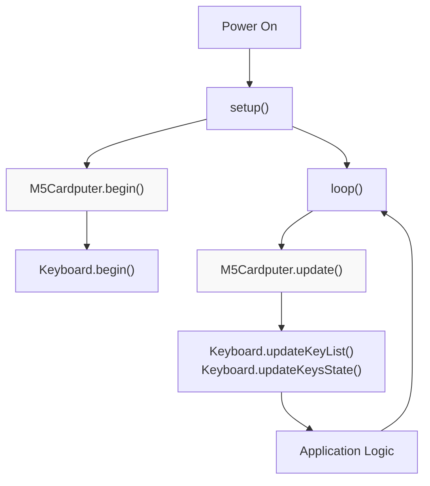
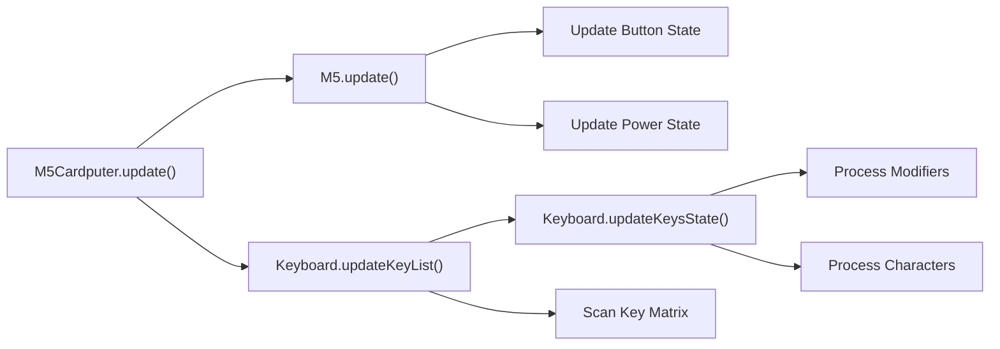
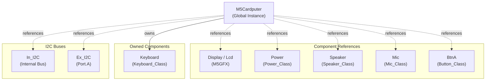
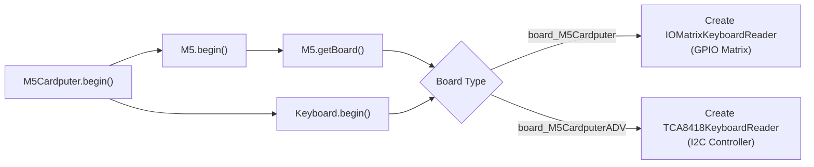

M5Cardputer Getting Started

# Getting Started

<details>
<summary>Relevant source files</summary>

The following files were used as context for generating this wiki page:

- [examples/Basic/keyboard/singlePress/singlePress.ino](examples/Basic/keyboard/singlePress/singlePress.ino)
- [src/M5Cardputer.cpp](src/M5Cardputer.cpp)
- [src/M5Cardputer.h](src/M5Cardputer.h)

</details>


This guide covers the essential steps to install the M5Cardputer library, initialize the hardware, and create your first application. It focuses on the basic program structure, initialization patterns, and a minimal working example.

For detailed walkthroughs of specific example applications, see [Basic Example Walkthrough](#2.1). For comprehensive API documentation, see [M5Cardputer Core API](#3).

---

## Prerequisites

Before using the M5Cardputer library, ensure you have:

| Requirement | Description |
|-------------|-------------|
| **Hardware** | M5Cardputer or M5Cardputer-ADV board |
| **Platform** | Arduino IDE or PlatformIO with ESP32 support |
| **Board Manager** | M5Stack Board Manager v2.0.7 or later |

---

## Installation

### Arduino Library Manager

The M5Cardputer library depends on several external libraries that must be installed:

| Library | Purpose | Repository |
|---------|---------|------------|
| **M5Unified** | Core hardware abstraction for M5Stack devices | https://github.com/m5stack/M5Unified |
| **M5GFX** | Graphics framework for display operations | https://github.com/m5stack/M5GFX |
| **IRremote** | Infrared communication support | Standard Arduino Library |
| **LibSSH-ESP32** | SSH client functionality | https://github.com/ewpa/LibSSH-ESP32 |

Install via Arduino IDE:
1. Open **Sketch → Include Library → Manage Libraries**
2. Search for and install: `M5Unified`, `M5GFX`, `M5Cardputer`
3. Dependencies `IRremote` and `LibSSH-ESP32` are installed automatically

For detailed information about these dependencies, see [Library Dependencies](#1.1).

**Sources:** [src/M5Cardputer.h:1-10]()

---

## Basic Program Structure

All M5Cardputer applications follow the standard Arduino program structure with two required functions:



**Diagram: M5Cardputer Application Lifecycle**

The lifecycle consists of:
1. **`setup()`** - Called once at boot to initialize hardware
2. **`loop()`** - Called repeatedly to process input and execute application logic

**Sources:** [src/M5Cardputer.cpp:12-37]()

---

## Initialization

### Basic Initialization

The simplest initialization uses default settings:

```cpp
#include "M5Cardputer.h"

void setup() {
    M5Cardputer.begin();
}
```

This initializes:
- M5Unified core system with default configuration
- Keyboard hardware (automatically detected variant)
- All peripheral components (Display, Speaker, Mic, Power, Button)

**Sources:** [src/M5Cardputer.cpp:12-19]()

### Custom Configuration

For advanced control, pass a custom configuration:

```cpp
void setup() {
    auto cfg = M5.config();
    // Modify cfg as needed
    M5Cardputer.begin(cfg, true);
}
```

The `begin()` method accepts two parameters:

| Parameter | Type | Default | Description |
|-----------|------|---------|-------------|
| `cfg` | `M5Unified::config_t` | default config | M5Unified configuration structure |
| `enableKeyboard` | `bool` | `true` | Whether to initialize keyboard hardware |

Setting `enableKeyboard` to `false` disables keyboard initialization if your application doesn't require input.

**Sources:** [src/M5Cardputer.h:16-17](), [src/M5Cardputer.cpp:21-28]()

---

## Update Loop

Every application must call `M5Cardputer.update()` at the beginning of each `loop()` iteration:

```cpp
void loop() {
    M5Cardputer.update();
    // Your application logic here
}
```

The `update()` method performs two critical functions:



**Diagram: Update Method Internal Operations**

1. **`M5.update()`** - Updates button states, power management, and other M5Unified components
2. **`Keyboard.updateKeyList()`** - Scans hardware and collects active key coordinates
3. **`Keyboard.updateKeysState()`** - Processes key coordinates into characters, modifiers, and HID codes

**Sources:** [src/M5Cardputer.cpp:30-37]()

---

## Your First Program

Here is a minimal complete program that displays text and responds to keyboard input:

```cpp
#include "M5Cardputer.h"

void setup() {
    auto cfg = M5.config();
    M5Cardputer.begin(cfg, true);
    M5Cardputer.Display.setRotation(1);
    M5Cardputer.Display.setTextColor(GREEN);
    M5Cardputer.Display.setTextDatum(middle_center);
    M5Cardputer.Display.setTextFont(&fonts::FreeSerifBoldItalic18pt7b);
    M5Cardputer.Display.setTextSize(1);
    M5Cardputer.Display.drawString("Press a Key",
                                   M5Cardputer.Display.width() / 2,
                                   M5Cardputer.Display.height() / 2);
}

void loop() {
    M5Cardputer.update();
    if (M5Cardputer.Keyboard.isChange()) {
        if (M5Cardputer.Keyboard.isKeyPressed('a')) {
            M5Cardputer.Display.clear();
            M5Cardputer.Display.drawString("a Pressed",
                                           M5Cardputer.Display.width() / 2,
                                           M5Cardputer.Display.height() / 2);
        } else {
            M5Cardputer.Display.clear();
            M5Cardputer.Display.drawString("Press a Key",
                                           M5Cardputer.Display.width() / 2,
                                           M5Cardputer.Display.height() / 2);
        }
    }
}
```

This example demonstrates:
- Initialization with custom configuration
- Display rotation and text formatting
- Keyboard state detection using `isChange()`
- Single key press detection using `isKeyPressed()`

**Sources:** [examples/Basic/keyboard/singlePress/singlePress.ino:1-47]()

---

## Available Components

The `M5Cardputer` global object provides access to all hardware components through public member references:



**Diagram: M5Cardputer Component Hierarchy**

### Component Reference Table

| Component | Type | Purpose | See Documentation |
|-----------|------|---------|-------------------|
| `Display` / `Lcd` | `M5GFX&` | Graphics and text rendering | [Display System](#5) |
| `Keyboard` | `Keyboard_Class` | Keyboard input processing | [Keyboard System](#4) |
| `Speaker` | `Speaker_Class&` | Audio output and tone generation | [Audio System](#6) |
| `Mic` | `Mic_Class&` | Audio recording | [Audio System](#6) |
| `Power` | `Power_Class&` | Battery and power management | [Hardware Component Access](#3.2) |
| `BtnA` | `Button_Class&` | Physical button input | [Hardware Component Access](#3.2) |
| `In_I2C` | `I2C_Class&` | Internal I2C bus for onboard devices | [I2C Bus Management](#3.3) |
| `Ex_I2C` | `I2C_Class&` | External I2C bus (Port.A expansion) | [I2C Bus Management](#3.3) |

**Sources:** [src/M5Cardputer.h:14-33]()

---

## Component Access Patterns

### Display Operations

```cpp
// Set display orientation (0=portrait, 1=landscape)
M5Cardputer.Display.setRotation(1);

// Clear screen
M5Cardputer.Display.clear();

// Draw text
M5Cardputer.Display.drawString("Hello", x, y);
```

### Keyboard Input

```cpp
// Check if keyboard state changed
if (M5Cardputer.Keyboard.isChange()) {
    // Check specific key
    if (M5Cardputer.Keyboard.isKeyPressed('a')) {
        // Handle 'a' key press
    }
}
```

### Button Input

```cpp
// Check if button A was pressed
if (M5Cardputer.BtnA.wasPressed()) {
    // Handle button press
}
```

**Sources:** [examples/Basic/keyboard/singlePress/singlePress.ino:18-47]()

---

## Hardware Variant Detection

The library automatically detects whether the device is a standard M5Cardputer or M5Cardputer-ADV at initialization and configures the keyboard hardware accordingly:



**Diagram: Automatic Hardware Variant Selection**

Your application code remains identical regardless of hardware variant. The keyboard implementation is selected transparently at runtime.

For detailed information about hardware variants, see [Supported Hardware](#1.2). For implementation details, see [Hardware Abstraction Layer](#4.4).

**Sources:** [src/M5Cardputer.cpp:12-28]()

---

## Next Steps

Now that you have a working M5Cardputer application:

1. **Explore Examples** - See [Example Applications](#9) for more complex use cases
2. **Learn Keyboard API** - See [Keyboard_Class API](#4.1) for advanced input handling
3. **Display Graphics** - See [Display System](#5) for graphics capabilities
4. **Add Audio** - See [Audio System](#6) for speaker and microphone operations

For a detailed walkthrough of a complete example, proceed to [Basic Example Walkthrough](#2.1).

**Sources:** [examples/Basic/keyboard/singlePress/singlePress.ino:1-47]()