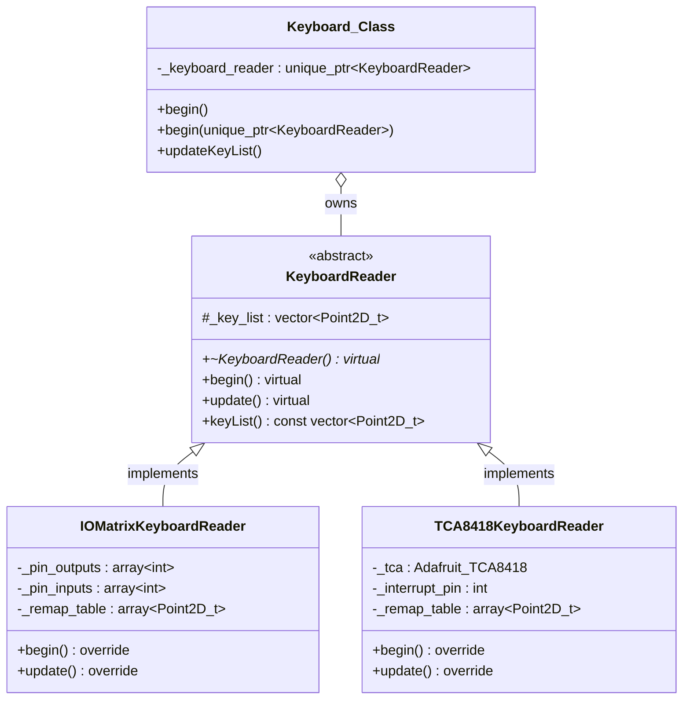
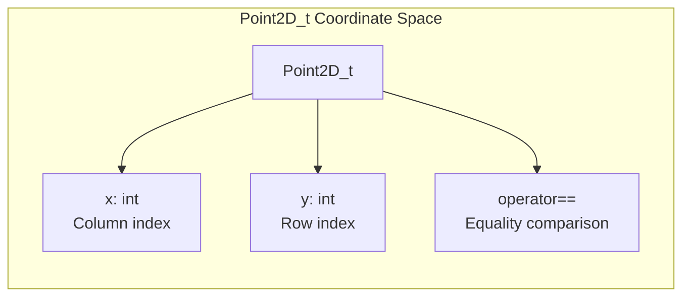
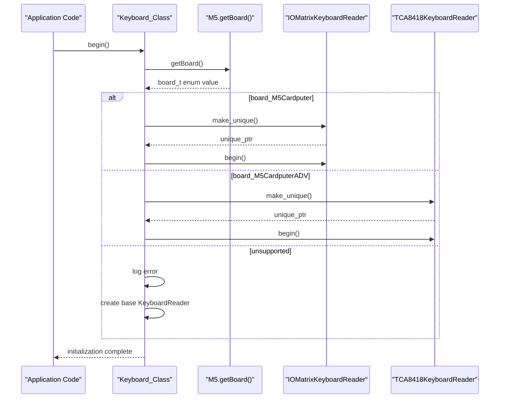
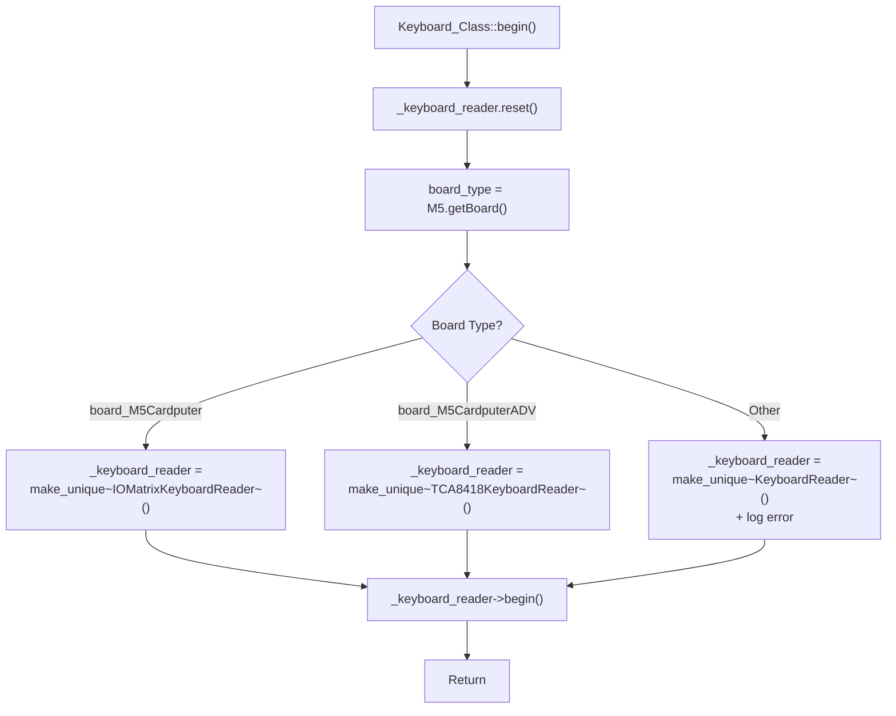
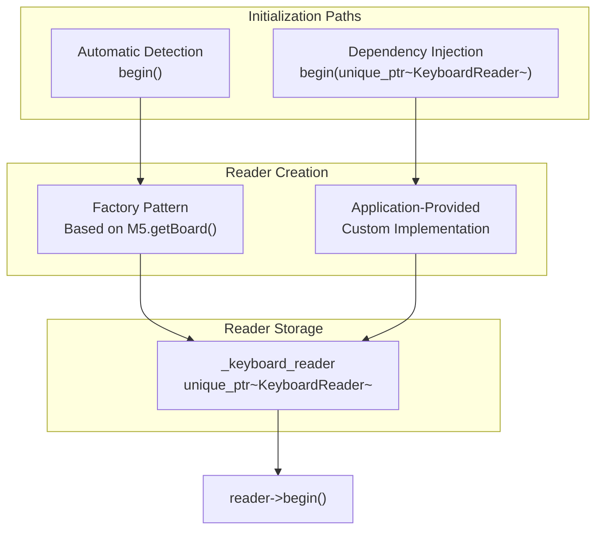
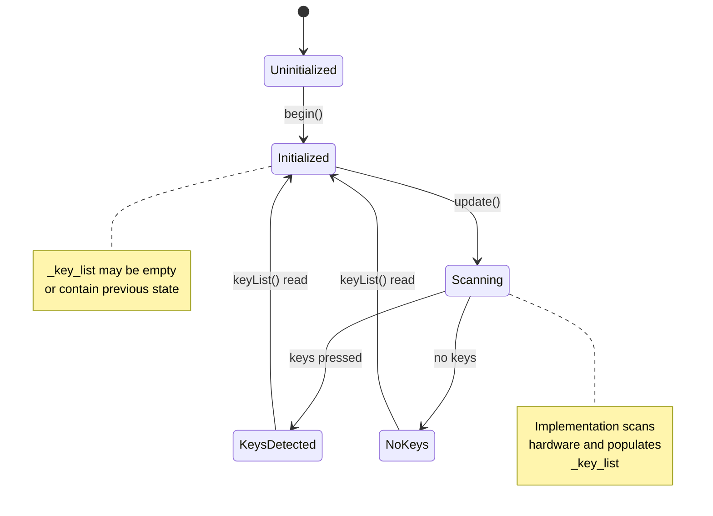
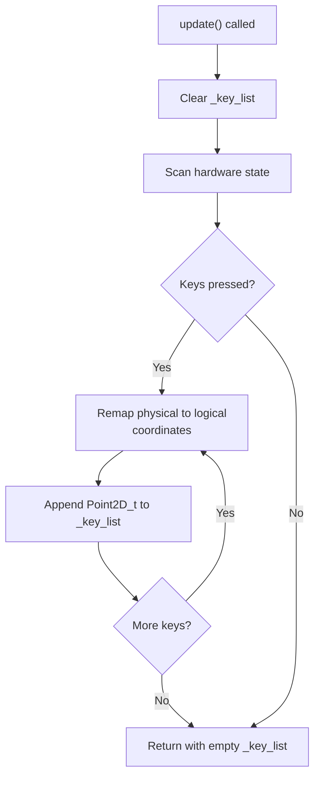
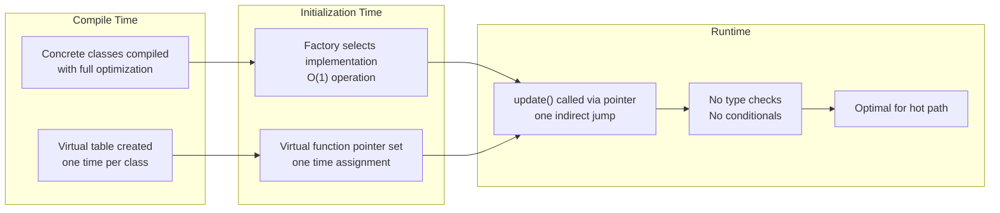
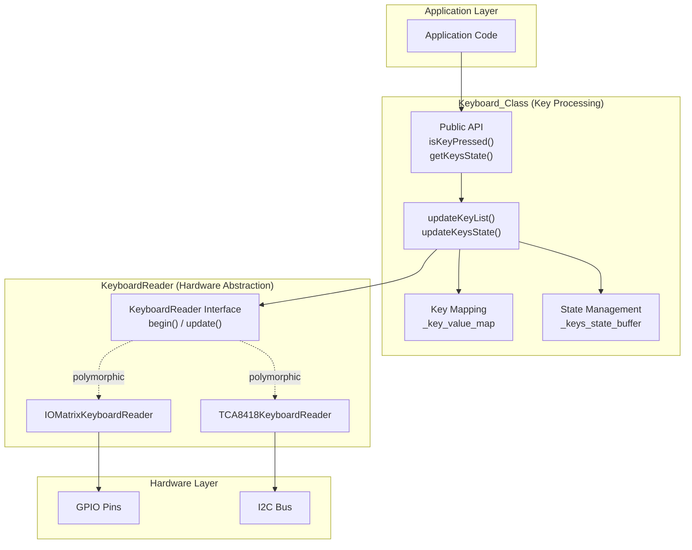
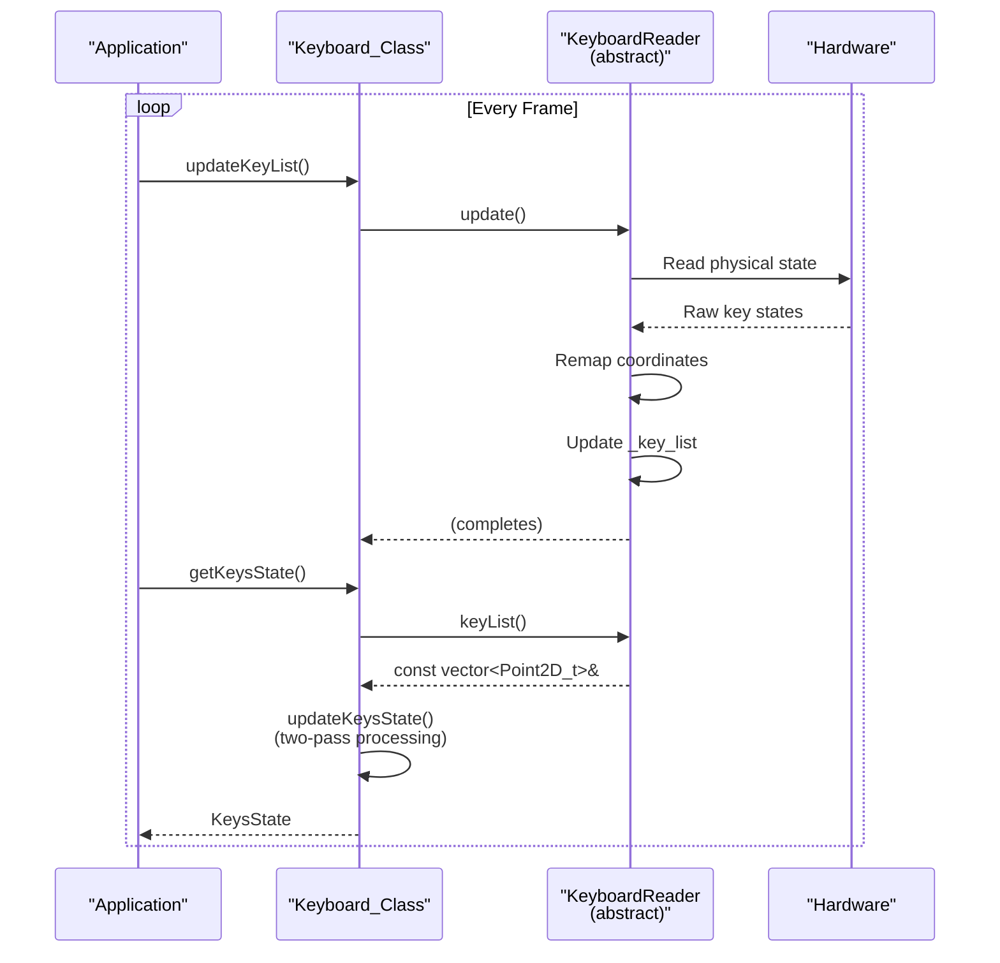

M5Cardputer Hardware Abstraction Layer

# Hardware Abstraction Layer

<details>
<summary>Relevant source files</summary>

The following files were used as context for generating this wiki page:

- [src/utility/Keyboard/Keyboard.cpp](src/utility/Keyboard/Keyboard.cpp)
- [src/utility/Keyboard/KeyboardReader/KeyboardReader.h](src/utility/Keyboard/KeyboardReader/KeyboardReader.h)

</details>


## Purpose and Scope

This page documents the keyboard hardware abstraction layer, specifically the `KeyboardReader` abstract interface that enables the M5Cardputer library to support multiple hardware variants through runtime polymorphism. The abstraction layer decouples the high-level `Keyboard_Class` API from hardware-specific implementation details, allowing the same application code to run on both the standard M5Cardputer (GPIO matrix) and M5Cardputer-ADV (I2C controller) without modification.

For details on the concrete GPIO matrix implementation, see [IOMatrix Implementation (M5Cardputer)](#4.5). For I2C controller implementation details, see [TCA8418 Implementation (M5Cardputer-ADV)](#4.6). For the high-level keyboard API that consumes this abstraction layer, see [Keyboard_Class API](#4.1).

---

## KeyboardReader Abstract Interface

The `KeyboardReader` class serves as the foundational abstraction for all keyboard hardware implementations. It defines a minimal contract that hardware-specific readers must fulfill while providing default implementations for optional functionality.

### Interface Definition



**Interface Contract**: The `KeyboardReader` class [src/utility/Keyboard/KeyboardReader/KeyboardReader.h:22-51]() defines three virtual methods and one protected member:

| Method | Default Behavior | Implementation Requirement |
|--------|-----------------|---------------------------|
| `begin()` | No operation | Initialize hardware (GPIO pins, I2C devices, etc.) |
| `update()` | No operation | Scan keyboard and populate `_key_list` with active keys |
| `keyList() const` | Return `_key_list` reference | No override needed (non-virtual) |
| `~KeyboardReader()` | Default destructor | Cleanup hardware resources if needed |

Sources: [src/utility/Keyboard/KeyboardReader/KeyboardReader.h:22-51]()

### Point2D_t Structure

The coordinate system uses `Point2D_t` [src/utility/Keyboard/KeyboardReader/KeyboardReader.h:9-17]() to represent key positions in a logical 2D grid:



**Coordinate Semantics**:
- `x` represents the column position (0-13 for 14-column layout)
- `y` represents the row position (0-3 for 4-row layout)
- Negative values indicate invalid/error coordinates
- Equality operator enables efficient set operations and duplicate detection

The coordinate system is hardware-independent. Implementations are responsible for remapping physical hardware coordinates to this logical layout.

Sources: [src/utility/Keyboard/KeyboardReader/KeyboardReader.h:9-17]()

---

## Factory Pattern and Board Detection

The `Keyboard_Class` employs a factory pattern to instantiate the appropriate `KeyboardReader` implementation based on runtime board detection. This eliminates conditional compilation directives and enables single-binary support for multiple hardware variants.

### Board Detection Flow



**Factory Implementation**: The `begin()` method [src/utility/Keyboard/Keyboard.cpp:15-31]() performs the following steps:

1. **Reset existing reader**: `_keyboard_reader.reset()` destroys any previously instantiated reader
2. **Query board type**: `M5.getBoard()` returns an enum identifying the hardware
3. **Instantiate concrete reader**:
   - `board_M5Cardputer` → `std::make_unique<IOMatrixKeyboardReader>()`
   - `board_M5CardputerADV` → `std::make_unique<TCA8418KeyboardReader>()`
   - Other → Base `KeyboardReader()` with error logging
4. **Initialize reader**: Call `_keyboard_reader->begin()` to configure hardware

Sources: [src/utility/Keyboard/Keyboard.cpp:15-31]()

### Reader Instantiation Logic



The factory pattern provides several architectural benefits:

| Benefit | Description |
|---------|-------------|
| **Single Binary** | One compiled binary supports all hardware variants |
| **Runtime Selection** | Board detection happens at initialization, not compile-time |
| **Zero Overhead** | Virtual dispatch overhead only at initialization, not per-scan |
| **Extensibility** | New hardware variants can be added without modifying `Keyboard_Class` |
| **Testability** | Dependency injection allows mock readers for testing |

Sources: [src/utility/Keyboard/Keyboard.cpp:15-31]()

---

## Dependency Injection Mechanism

The library supports dependency injection as an alternative to automatic board detection, enabling advanced use cases such as custom keyboard hardware, testing with mock readers, or overriding automatic detection.

### Injection Interface



**Injection Method**: The overloaded `begin()` method [src/utility/Keyboard/Keyboard.cpp:33-37]() accepts a `std::unique_ptr<KeyboardReader>`:

```cpp
void Keyboard_Class::begin(std::unique_ptr<KeyboardReader> reader)
{
    _keyboard_reader = std::move(reader);
    _keyboard_reader->begin();
}
```

This method:
1. **Transfers ownership**: Uses move semantics to transfer the unique_ptr
2. **Initializes reader**: Calls `begin()` on the injected implementation
3. **Bypasses detection**: Skips automatic board detection entirely

**Use Cases**:

| Scenario | Application |
|----------|-------------|
| Custom Hardware | Implement `KeyboardReader` for third-party keyboard hardware |
| Unit Testing | Inject mock readers with predefined key sequences |
| Hardware Override | Force specific implementation regardless of detection |
| Research/Development | Test experimental reader implementations |

Sources: [src/utility/Keyboard/Keyboard.cpp:33-37]()

---

## Implementation Requirements

Concrete `KeyboardReader` implementations must fulfill specific behavioral contracts to integrate correctly with `Keyboard_Class`. The abstraction layer enforces minimal coupling while ensuring consistent behavior across implementations.

### State Management Contract



**State Lifecycle**:

1. **Construction**: Reader is in uninitialized state, `_key_list` is empty
2. **Initialization** (`begin()`): Configure hardware resources (pins, I2C, interrupts)
3. **Scanning** (`update()`): Read hardware state and populate `_key_list`
4. **Consumption** (`keyList()`): External code reads `_key_list` via const reference

**Critical Requirements**:

| Requirement | Rationale |
|-------------|-----------|
| **Thread Safety**: `update()` and `keyList()` are called from same thread | Avoids race conditions on `_key_list` |
| **Non-blocking**: `update()` must complete quickly (<1ms typical) | Prevents UI lag and missed key events |
| **Clear on scan**: `_key_list` should be cleared and rebuilt each `update()` | Ensures stale data doesn't persist |
| **Coordinate consistency**: All returned `Point2D_t` use same logical layout | Enables hardware-independent key mapping |
| **Error handling**: Invalid hardware states should not crash | Graceful degradation (empty list on error) |

Sources: [src/utility/Keyboard/Keyboard.cpp:54-59](), [src/utility/Keyboard/KeyboardReader/KeyboardReader.h:22-51]()

### Update Method Semantics

The `update()` method is the core of the abstraction layer. The `Keyboard_Class` calls it through the abstraction [src/utility/Keyboard/Keyboard.cpp:54-59]():

```cpp
void Keyboard_Class::updateKeyList()
{
    if (_keyboard_reader) {
        _keyboard_reader->update();
    }
}
```

**Expected Behavior**:



**Implementation Considerations**:

- **Remapping**: Physical hardware layout may differ from logical layout (e.g., 8×7 matrix → 4×14 grid)
- **Debouncing**: Implementations should handle hardware debouncing if needed
- **Repeat rate**: Auto-repeat behavior (if any) is implementation-specific
- **Performance**: Typical `update()` execution time: 100-500μs depending on hardware

Sources: [src/utility/Keyboard/Keyboard.cpp:54-59]()

---

## Polymorphic Architecture Benefits

The hardware abstraction layer achieves true hardware independence through careful architectural decisions that balance abstraction overhead with performance.

### Zero-Cost Abstraction Analysis



**Performance Characteristics**:

| Operation | Overhead | Frequency | Impact |
|-----------|----------|-----------|--------|
| `begin()` factory dispatch | ~10μs | Once at startup | Negligible |
| `update()` virtual call | 1-2 CPU cycles | ~60 Hz typical | <0.01% CPU |
| `keyList()` non-virtual access | 0 cycles | Many times/frame | Zero overhead |
| Memory overhead | 8 bytes (vtable ptr) | Per reader instance | Minimal |

**Abstraction Trade-offs**:

✅ **Benefits**:
- Single codebase for multiple hardware variants
- No preprocessor conditionals cluttering code
- Easy to add new hardware support
- Testable through dependency injection

⚠️ **Costs**:
- 8-byte vtable pointer per instance
- 1-2 cycle indirect call overhead for `update()` and `begin()`
- Dynamic memory allocation (mitigated by `unique_ptr`)

The virtual dispatch overhead is insignificant compared to the cost of hardware I/O operations (GPIO reads: ~1μs each, I2C transactions: ~100μs).

Sources: [src/utility/Keyboard/Keyboard.cpp:15-37]()

### Hardware Variant Support Matrix

The abstraction layer currently supports two hardware implementations with distinct characteristics:

| Feature | IOMatrixKeyboardReader | TCA8418KeyboardReader |
|---------|----------------------|---------------------|
| **Board Type** | `board_M5Cardputer` | `board_M5CardputerADV` |
| **Hardware Interface** | Direct GPIO matrix | I2C keyboard controller |
| **Physical Layout** | 8×7 matrix | 7×8 matrix |
| **Scan Method** | Active polling | Interrupt + I2C read |
| **Remapping Required** | Yes (8×7 → 4×14) | Yes (7×8 → 4×14) |
| **Typical Scan Time** | ~200μs | ~100μs (cached) |
| **Power Consumption** | Higher (constant GPIO toggling) | Lower (interrupt-driven) |
| **Implementation** | See [IOMatrix](#4.5) | See [TCA8418](#4.6) |

Both implementations present an identical `Point2D_t` coordinate space to the `Keyboard_Class`, ensuring that key mapping and state processing logic remains hardware-independent.

Sources: [src/utility/Keyboard/Keyboard.cpp:15-31]()

---

## Integration with Keyboard_Class

The abstraction layer integrates seamlessly with the higher-level `Keyboard_Class` through a clean interface boundary that separates hardware concerns from key processing logic.

### Component Interaction



**Responsibility Separation**:

| Layer | Responsibilities | Does NOT Handle |
|-------|-----------------|-----------------|
| **KeyboardReader** | Hardware scanning, coordinate remapping, `_key_list` management | Key mapping, modifier processing, state aggregation |
| **Keyboard_Class** | Key mapping, modifier detection, state aggregation, API | Hardware I/O, physical layout, debouncing |
| **Application** | Business logic, UI, event handling | Hardware details, key coordinate mapping |

This separation enables independent evolution of hardware support and key processing logic without cross-layer contamination.

Sources: [src/utility/Keyboard/Keyboard.cpp:15-59](), [src/utility/Keyboard/KeyboardReader/KeyboardReader.h:22-51]()

### Data Flow Through Abstraction



The abstraction layer acts as a data transformation boundary:

1. **Hardware → Coordinates**: Reader converts hardware state to `Point2D_t` list
2. **Coordinates → Characters**: `Keyboard_Class` maps coordinates to characters using `_key_value_map`
3. **Characters → State**: `Keyboard_Class` aggregates into `KeysState` structure

Each layer operates on progressively higher-level abstractions, with the `KeyboardReader` interface serving as the critical boundary between hardware-specific and hardware-independent code.

Sources: [src/utility/Keyboard/Keyboard.cpp:54-59](), [src/utility/Keyboard/Keyboard.cpp:90-210]()