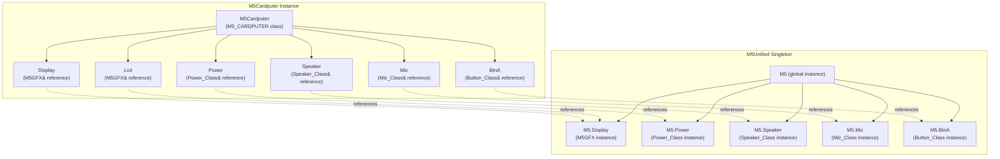
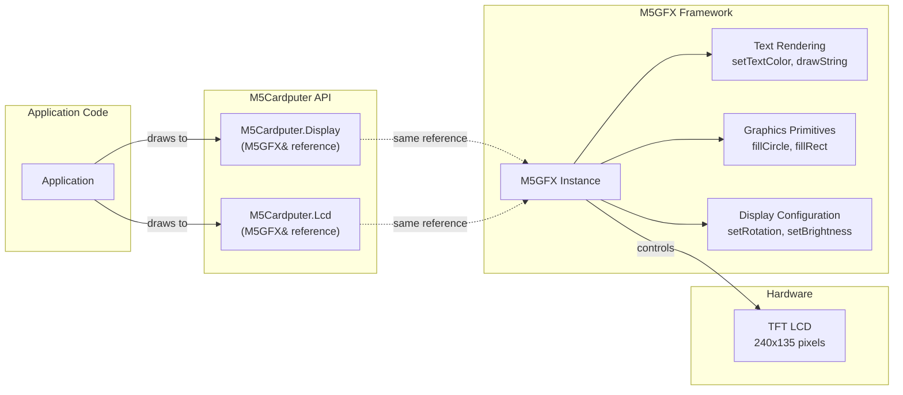
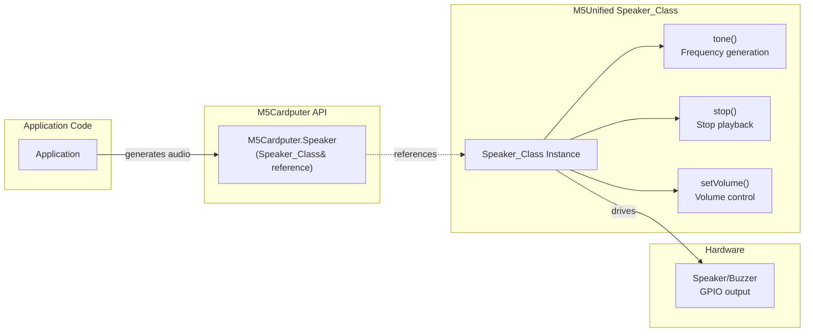
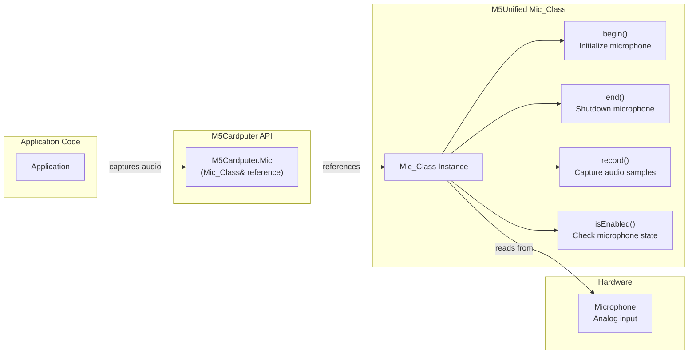
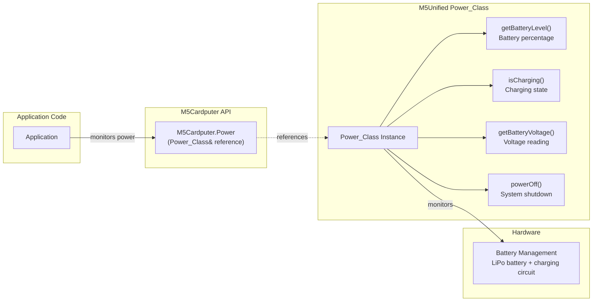
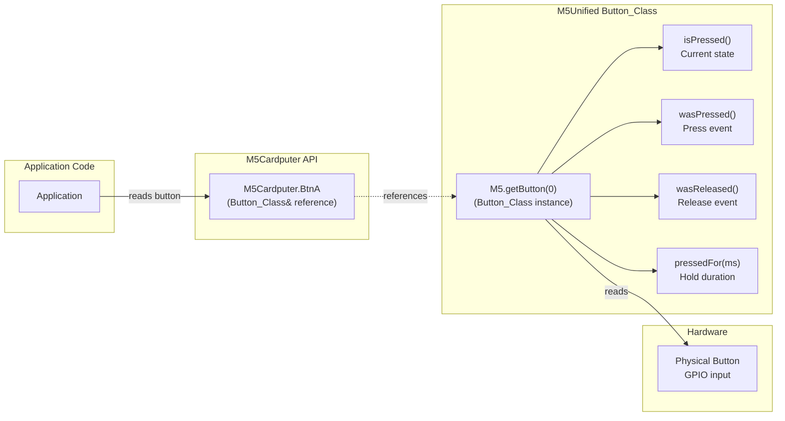
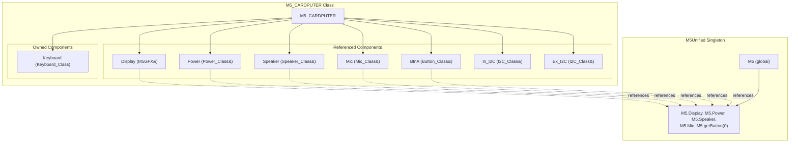

M5Cardputer Hardware Component Access

# Hardware Component Access

<details>
<summary>Relevant source files</summary>

The following files were used as context for generating this wiki page:

- [examples/Basic/buzzer/buzzer.ino](examples/Basic/buzzer/buzzer.ino)
- [examples/Basic/display/display.ino](examples/Basic/display/display.ino)
- [src/M5Cardputer.h](src/M5Cardputer.h)

</details>


## Purpose and Scope

This page documents how to access and use hardware components through the M5Cardputer interface, specifically the Display, Speaker, Microphone, Power, and Button subsystems. These components are exposed as reference members of the `M5_CARDPUTER` class and provide direct access to the underlying M5Unified hardware abstractions.

For keyboard access, see [Keyboard System](#4). For I2C bus management, see [I2C Bus Management](#3.3). For initialization methods, see [Initialization and Configuration](#3.1).

**Sources:** [src/M5Cardputer.h:1-45]()

---

## Component Reference Architecture

The `M5_CARDPUTER` class employs a reference pattern for standard M5Stack peripherals. Rather than duplicating hardware management logic, it exposes references to components managed by the `M5Unified` singleton. This ensures unified state management and zero-copy access across the M5Stack ecosystem.

### Component Reference Mapping



**Diagram: M5Cardputer Component Reference Structure**

The reference members are initialized as follows:

| Component | Declaration | Target |
|-----------|-------------|--------|
| `Display` | `M5GFX &Display = M5.Display` | Graphics and LCD interface |
| `Lcd` | `M5GFX &Lcd = Display` | Alias for Display (legacy compatibility) |
| `Power` | `Power_Class &Power = M5.Power` | Battery and power management |
| `Speaker` | `Speaker_Class &Speaker = M5.Speaker` | Audio output and tone generation |
| `Mic` | `Mic_Class &Mic = M5.Mic` | Microphone input and recording |
| `BtnA` | `Button_Class &BtnA = M5.getButton(0)` | Physical button interface |

**Sources:** [src/M5Cardputer.h:19-24]()

---

## Display Component

The `Display` member provides access to the M5GFX graphics framework, which handles all screen rendering operations. The M5Cardputer features a 240x135 pixel TFT LCD display.

### Display Component Structure



**Diagram: Display Component Architecture**

### Common Display Operations

| Operation Category | Methods | Purpose |
|-------------------|---------|---------|
| **Configuration** | `setRotation(uint8_t r)` | Set screen orientation (0-3) |
| | `setBrightness(uint8_t brightness)` | Adjust backlight brightness |
| **Text Rendering** | `setTextColor(uint32_t color)` | Set text foreground color |
| | `setTextDatum(textdatum_t datum)` | Set text anchor point |
| | `setTextFont(const IFont* font)` | Set font for text rendering |
| | `setTextSize(float size)` | Set text scaling factor |
| | `drawString(const String& string, int32_t x, int32_t y)` | Draw text at coordinates |
| **Graphics** | `fillCircle(int32_t x, int32_t y, int32_t r, uint32_t color)` | Draw filled circle |
| | `fillRect(int32_t x, int32_t y, int32_t w, int32_t h, uint32_t color)` | Draw filled rectangle |
| | `drawLine(int32_t x0, int32_t y0, int32_t x1, int32_t y1, uint32_t color)` | Draw line |
| **Screen Control** | `clear()` or `fillScreen(uint32_t color)` | Clear screen to color |
| | `width()` / `height()` | Get current display dimensions |

### Display Usage Example

The following pattern demonstrates typical display initialization and usage:

```cpp
// Display configuration (from buzzer.ino)
M5Cardputer.Display.setRotation(1);           // Landscape orientation
M5Cardputer.Display.setTextColor(GREEN);      // Set text color
M5Cardputer.Display.setTextDatum(middle_center); // Center text alignment
M5Cardputer.Display.setTextFont(&fonts::Orbitron_Light_32); // Set font
M5Cardputer.Display.setTextSize(1);           // Text scaling

// Draw centered text
M5Cardputer.Display.drawString("Buzzer Test",
                               M5Cardputer.Display.width() / 2,
                               M5Cardputer.Display.height() / 2);

// Graphics operations (from display.ino)
int x = rand() % M5Cardputer.Display.width();
int y = rand() % M5Cardputer.Display.height();
M5Cardputer.Display.fillCircle(x, y, radius, color);
```

### Display and Lcd Aliases

Both `Display` and `Lcd` reference the same `M5GFX` instance. The `Lcd` alias exists for backward compatibility with older M5Stack code. They are functionally identical and can be used interchangeably.

**Sources:** [src/M5Cardputer.h:19-20](), [examples/Basic/display/display.ino:1-42](), [examples/Basic/buzzer/buzzer.ino:20-27]()

---

## Speaker Component

The `Speaker` member provides access to the built-in buzzer/speaker for audio output. It supports tone generation and basic audio playback.

### Speaker Component Structure



**Diagram: Speaker Component Architecture**

### Common Speaker Operations

| Method | Parameters | Purpose |
|--------|------------|---------|
| `tone(uint32_t freq)` | `freq`: Frequency in Hz | Play continuous tone |
| `tone(uint32_t freq, uint32_t duration)` | `freq`: Frequency in Hz<br/>`duration`: Duration in milliseconds | Play tone for specified duration |
| `stop()` | None | Stop current audio output |
| `setVolume(uint8_t volume)` | `volume`: 0-255 (0=off, 255=max) | Set output volume level |

### Speaker Usage Example

```cpp
// Play high-frequency tone for 100ms (from buzzer.ino)
M5Cardputer.Speaker.tone(10000, 100);
delay(1000);

// Play lower-frequency tone for 20ms
M5Cardputer.Speaker.tone(4000, 20);
delay(1000);

// Continuous tone until stopped
M5Cardputer.Speaker.tone(440);  // Play A4 note
delay(500);
M5Cardputer.Speaker.stop();     // Stop playback
```

**Sources:** [src/M5Cardputer.h:22](), [examples/Basic/buzzer/buzzer.ino:30-34]()

---

## Microphone Component

The `Mic` member provides access to the built-in microphone for audio input and recording operations.

### Microphone Component Structure



**Diagram: Microphone Component Architecture**

### Common Microphone Operations

| Method | Parameters | Purpose |
|--------|------------|---------|
| `begin()` | None | Initialize microphone hardware |
| `end()` | None | Shutdown microphone and release resources |
| `isEnabled()` | None | Check if microphone is currently active |
| `record(int16_t* buffer, size_t length, uint32_t sample_rate)` | `buffer`: Audio data buffer<br/>`length`: Number of samples<br/>`sample_rate`: Sampling rate in Hz | Record audio samples |

### Microphone Usage Pattern

```cpp
// Initialize microphone
M5Cardputer.Mic.begin();

// Check if microphone is enabled
if (M5Cardputer.Mic.isEnabled()) {
    // Allocate buffer for audio samples
    int16_t* buffer = new int16_t[1024];
    
    // Record audio at 16kHz sample rate
    M5Cardputer.Mic.record(buffer, 1024, 16000);
    
    // Process audio data...
    
    delete[] buffer;
}

// Shutdown microphone
M5Cardputer.Mic.end();
```

**Sources:** [src/M5Cardputer.h:23]()

---

## Power Component

The `Power` member provides access to power management and battery monitoring functionality.

### Power Component Structure



**Diagram: Power Component Architecture**

### Common Power Operations

| Method | Return Type | Purpose |
|--------|-------------|---------|
| `getBatteryLevel()` | `int8_t` | Get battery charge percentage (0-100, -1 if unavailable) |
| `isCharging()` | `bool` | Check if battery is currently charging |
| `getBatteryVoltage()` | `float` | Get battery voltage in millivolts |
| `powerOff()` | `void` | Initiate system shutdown |
| `deepSleep(uint64_t time_us)` | `void` | Enter deep sleep for specified microseconds |

### Power Usage Pattern

```cpp
// Check battery status
int8_t batteryLevel = M5Cardputer.Power.getBatteryLevel();
if (batteryLevel >= 0) {
    M5Cardputer.Display.printf("Battery: %d%%\n", batteryLevel);
}

// Check charging state
if (M5Cardputer.Power.isCharging()) {
    M5Cardputer.Display.println("Charging...");
}

// Get battery voltage
float voltage = M5Cardputer.Power.getBatteryVoltage();
M5Cardputer.Display.printf("Voltage: %.2f mV\n", voltage);

// Low battery shutdown
if (batteryLevel < 5) {
    M5Cardputer.Power.powerOff();
}
```

**Sources:** [src/M5Cardputer.h:21]()

---

## Button Component

The `BtnA` member provides access to the physical button on the M5Cardputer. The button is accessed through the M5Unified `Button_Class` interface, which provides debouncing and event tracking.

### Button Component Structure



**Diagram: Button Component Architecture**

### Common Button Operations

| Method | Return Type | Purpose |
|--------|-------------|---------|
| `isPressed()` | `bool` | Check if button is currently pressed |
| `wasPressed()` | `bool` | Check if button was pressed since last check (consumes event) |
| `wasReleased()` | `bool` | Check if button was released since last check (consumes event) |
| `pressedFor(uint32_t ms)` | `bool` | Check if button has been held for specified milliseconds |
| `wasHold()` | `bool` | Check if button was held and released (consumes event) |

### Button State Management

The button methods follow an event consumption pattern:
- `isPressed()`: Non-consuming, returns current physical state
- `wasPressed()`, `wasReleased()`, `wasHold()`: Consuming, clear event flag after reading

To properly detect button events, call `M5Cardputer.update()` in your main loop to refresh button state.

### Button Usage Pattern

```cpp
void loop() {
    M5Cardputer.update();  // Update button state
    
    // Check for button press event
    if (M5Cardputer.BtnA.wasPressed()) {
        M5Cardputer.Display.println("Button pressed!");
    }
    
    // Check current button state
    if (M5Cardputer.BtnA.isPressed()) {
        M5Cardputer.Display.println("Button is held down");
    }
    
    // Check for long press (2 seconds)
    if (M5Cardputer.BtnA.pressedFor(2000)) {
        M5Cardputer.Display.println("Long press detected");
    }
    
    // Check for button release
    if (M5Cardputer.BtnA.wasReleased()) {
        M5Cardputer.Display.println("Button released");
    }
}
```

**Sources:** [src/M5Cardputer.h:24]()

---

## Component Access Patterns

### Reference vs. Ownership

The hardware component access pattern in M5Cardputer distinguishes between referenced and owned components:



**Diagram: Component Ownership Model**

### Component Initialization Order

Hardware components are initialized through the M5Cardputer initialization sequence:

1. **M5Unified Initialization**: `M5.begin()` is called first, initializing all M5Unified components
2. **Reference Binding**: Component references are bound to M5 singleton members
3. **Keyboard Initialization**: If enabled, `Keyboard.begin()` initializes the device-specific keyboard reader

```cpp
void M5_CARDPUTER::begin(m5::M5Unified::config_t cfg, bool enableKeyboard) {
    M5.begin(cfg);  // Initializes Display, Power, Speaker, Mic, Buttons
    
    // References are already bound at construction time:
    // Display -> M5.Display
    // Power -> M5.Power
    // Speaker -> M5.Speaker
    // Mic -> M5.Mic
    // BtnA -> M5.getButton(0)
    
    if (enableKeyboard) {
        Keyboard.begin();  // Initialize keyboard subsystem
    }
}
```

### Direct vs. M5Cardputer Access

Since component members are references to M5Unified objects, these two access patterns are equivalent:

```cpp
// Access through M5Cardputer (recommended for M5Cardputer projects)
M5Cardputer.Display.fillScreen(BLACK);
M5Cardputer.Speaker.tone(1000, 100);
M5Cardputer.Power.getBatteryLevel();

// Direct access through M5 singleton (also valid)
M5.Display.fillScreen(BLACK);
M5.Speaker.tone(1000, 100);
M5.Power.getBatteryLevel();
```

The M5Cardputer interface is preferred for consistency and code clarity in M5Cardputer-specific applications.

### Component Update Cycle

For components that track events (Button), the update cycle is critical:

```cpp
void loop() {
    // Update all M5Unified components
    M5Cardputer.update();  
    
    // Now safe to query button events
    if (M5Cardputer.BtnA.wasPressed()) {
        // Handle button press
    }
    
    // Other component access does not require update()
    M5Cardputer.Display.println("Text");
    M5Cardputer.Speaker.tone(1000);
}
```

The `M5Cardputer.update()` method internally calls `M5.update()`, which refreshes button states, power status, and other dynamic component states.

**Sources:** [src/M5Cardputer.h:14-39](), [src/M5Cardputer.cpp]()

---

## Summary

The M5Cardputer hardware component access system provides:

- **Unified Interface**: All common M5Stack peripherals accessible through consistent API
- **Reference Pattern**: Zero-copy access to M5Unified components via reference members
- **Alias Support**: `Display` and `Lcd` provide backward compatibility
- **Clear Ownership**: Referenced components managed by M5Unified, device-specific components owned by M5_CARDPUTER
- **Event Tracking**: Button component provides debounced event detection through update cycle

For advanced display operations and graphics patterns, see [Display System](#5). For audio recording and playback details, see [Audio System](#6). For I2C communication with external devices, see [I2C Bus Management](#3.3).