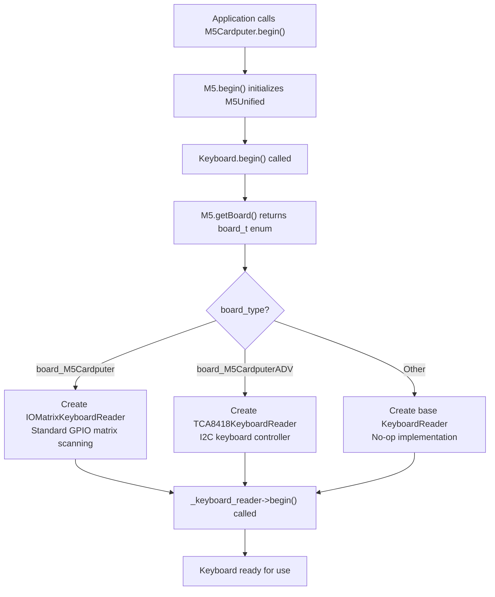
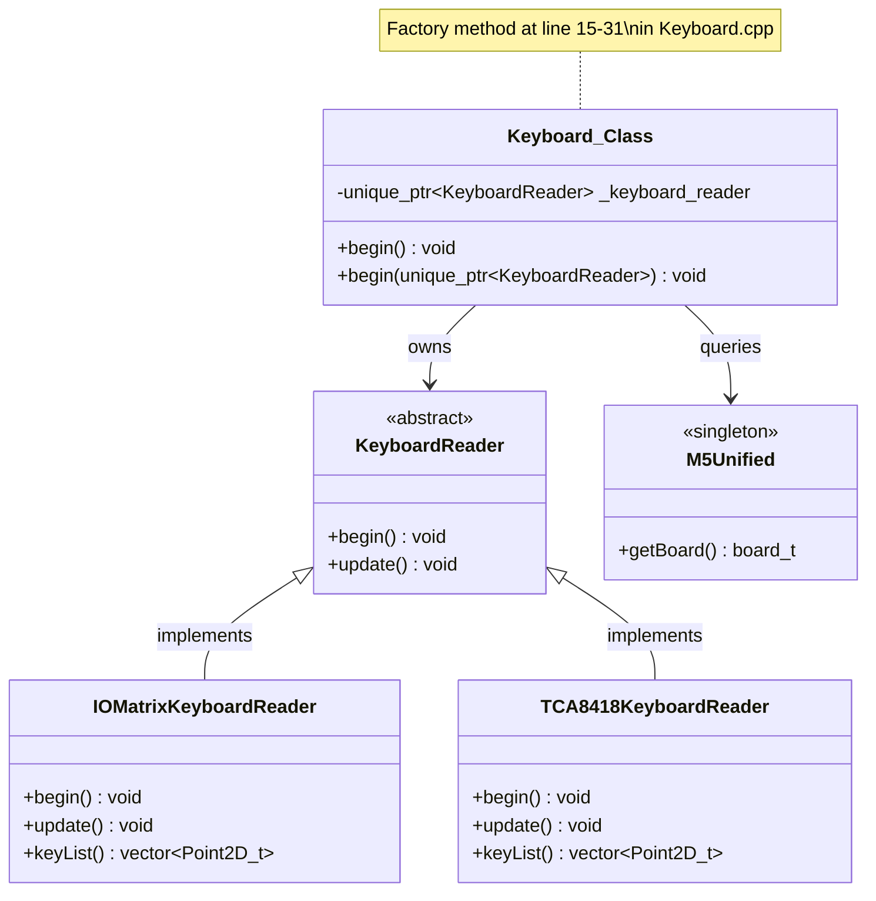
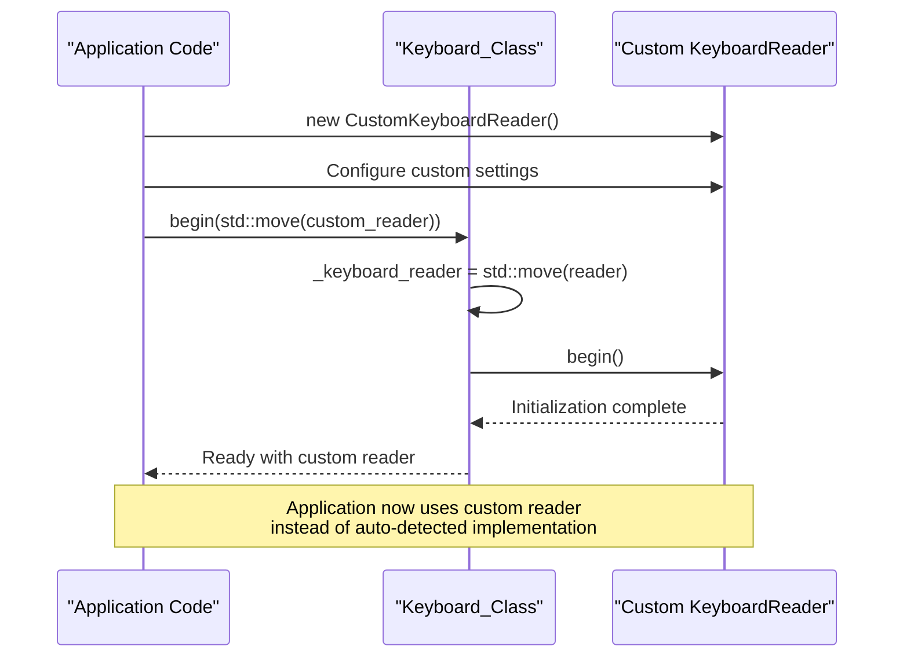
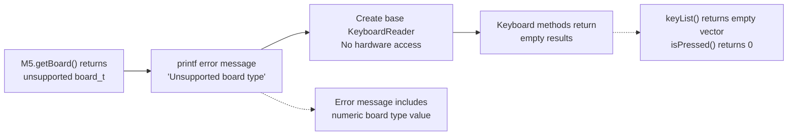
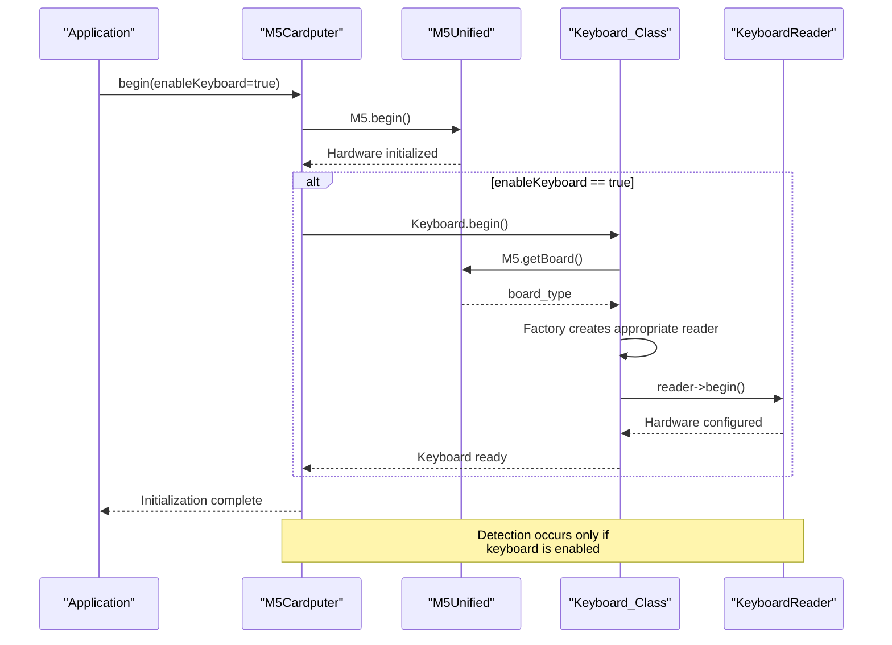

M5Cardputer Hardware Variant Detection

# Hardware Variant Detection

<details>
<summary>Relevant source files</summary>

The following files were used as context for generating this wiki page:

- [src/M5Cardputer.cpp](src/M5Cardputer.cpp)
- [src/utility/Keyboard/Keyboard.cpp](src/utility/Keyboard/Keyboard.cpp)

</details>


## Purpose and Scope

This document explains how the M5Cardputer library automatically detects which hardware variant is running at boot time and selects the appropriate keyboard implementation. The detection mechanism enables the same application code to run on both the standard M5Cardputer and the M5Cardputer-ADV hardware without modification.

For details on the specific keyboard implementations that are selected, see [IOMatrix Implementation (M5Cardputer)](#4.5) and [TCA8418 Implementation (M5Cardputer-ADV)](#4.6). For information on creating custom keyboard readers, see [Creating Custom Keyboard Readers](#11.1).

## Detection Architecture

The hardware variant detection occurs during keyboard initialization and relies on the M5Unified library's board identification capability. The process follows a factory pattern where the `Keyboard_Class` creates the appropriate `KeyboardReader` implementation based on the detected board type.

### Board Type Detection Flow



**Sources:** [src/utility/Keyboard/Keyboard.cpp:15-31](), [src/M5Cardputer.cpp:12-28]()

## Board Type Enumeration

The M5Unified library defines board types in the `m5::board_t` enumeration. The M5Cardputer library recognizes the following values:

| Board Type Constant | Description | Keyboard Implementation |
|---------------------|-------------|------------------------|
| `board_M5Cardputer` | Standard M5Cardputer hardware | `IOMatrixKeyboardReader` |
| `board_M5CardputerADV` | M5Cardputer-ADV hardware with TCA8418 controller | `TCA8418KeyboardReader` |
| Other values | Unsupported boards | Base `KeyboardReader` (no-op) |

The board type detection is performed by calling `M5.getBoard()`, which returns the detected board type based on hardware identification mechanisms in the M5Unified library.

**Sources:** [src/utility/Keyboard/Keyboard.cpp:17-28]()

## Keyboard Reader Factory Implementation

The `Keyboard_Class::begin()` method implements the factory pattern that instantiates the correct keyboard reader. This method performs three key operations:

1. **Detection**: Calls `M5.getBoard()` to retrieve the board type
2. **Reset**: Clears any existing keyboard reader with `_keyboard_reader.reset()`
3. **Instantiation**: Creates the appropriate reader implementation using `std::make_unique`

### Factory Pattern Code Entities



**Sources:** [src/utility/Keyboard/Keyboard.cpp:15-31]()

### Implementation Selection Logic

The factory logic is implemented as a conditional chain in [src/utility/Keyboard/Keyboard.cpp:21-28]():

```
if (board_type == m5::board_t::board_M5Cardputer)
    → IOMatrixKeyboardReader instantiated
    → GPIO matrix scanning enabled
    → 3 output pins + 7 input pins configured

else if (board_type == m5::board_t::board_M5CardputerADV)
    → TCA8418KeyboardReader instantiated
    → I2C communication at address 0x34
    → Interrupt pin GPIO 11 configured

else
    → Base KeyboardReader instantiated
    → Error message printed to console
    → No keyboard functionality available
```

The selected reader is stored in the `_keyboard_reader` member variable as a `std::unique_ptr<KeyboardReader>`, ensuring automatic memory management and polymorphic behavior.

**Sources:** [src/utility/Keyboard/Keyboard.cpp:21-28]()

## Hardware-Specific Initialization

Once the appropriate `KeyboardReader` implementation is instantiated, its `begin()` method is called to perform hardware-specific initialization. This initialization differs significantly between the two supported variants:

### Standard M5Cardputer (IOMatrixKeyboardReader)

- Configures GPIO pins for matrix scanning
- Sets 3 pins as outputs (row selection)
- Sets 7 pins as inputs with pull-ups (column reading)
- Establishes coordinate remapping table for 8×7 physical layout

### M5Cardputer-ADV (TCA8418KeyboardReader)

- Initializes I2C communication with TCA8418 chip at address 0x34
- Configures interrupt pin (GPIO 11) for event notification
- Programs the TCA8418 controller registers
- Establishes coordinate remapping table for 7×8 matrix layout

Both implementations satisfy the `KeyboardReader` interface, providing the same `update()` and `keyList()` methods to the parent `Keyboard_Class`.

**Sources:** [src/utility/Keyboard/Keyboard.cpp:30]()

## Custom Reader Injection

The library provides an alternative initialization method that bypasses automatic detection and accepts a custom `KeyboardReader` implementation. This mechanism enables advanced use cases such as:

- Testing with mock keyboard implementations
- Supporting custom hardware modifications
- Implementing alternative input methods

### Dependency Injection Method



**Sources:** [src/utility/Keyboard/Keyboard.cpp:33-37]()

The injection method signature is:

```
void Keyboard_Class::begin(std::unique_ptr<KeyboardReader> reader)
```

This method transfers ownership of the provided reader to the `Keyboard_Class` using move semantics, then calls the reader's `begin()` method. The automatic board detection is bypassed entirely when this method is used.

**Sources:** [src/utility/Keyboard/Keyboard.cpp:33-37]()

## Error Handling for Unsupported Boards

When the detected board type does not match any supported variant, the library instantiates a base `KeyboardReader` object and prints an error message to the console. This fallback behavior prevents crashes but results in a non-functional keyboard system.

### Error Handling Flow



**Sources:** [src/utility/Keyboard/Keyboard.cpp:26-28]()

The error message format is:
```
[error] Keyboard: Unsupported board type: <numeric_value>
```

Where `<numeric_value>` is the integer cast of the unrecognized `board_t` enumeration value. This provides diagnostic information for debugging hardware identification issues.

**Sources:** [src/utility/Keyboard/Keyboard.cpp:26]()

## Integration with M5Cardputer Initialization

The hardware variant detection is triggered automatically during the standard M5Cardputer initialization sequence. The `M5_CARDPUTER::begin()` method coordinates the overall initialization:

### Initialization Sequence



**Sources:** [src/M5Cardputer.cpp:12-28](), [src/utility/Keyboard/Keyboard.cpp:15-31]()

The `enableKeyboard` parameter in `M5_CARDPUTER::begin()` controls whether keyboard initialization occurs. If set to `false`, the hardware variant detection is skipped entirely, and no keyboard reader is created.

**Sources:** [src/M5Cardputer.cpp:12-19]()

## Runtime Behavior

After initialization, the selected keyboard reader operates transparently. The `Keyboard_Class` methods delegate to the reader's implementation without any additional runtime checks:

| Method | Behavior |
|--------|----------|
| `updateKeyList()` | Calls `_keyboard_reader->update()` to refresh key state |
| `keyList()` | Returns `_keyboard_reader->keyList()` with active keys |
| `isPressed()` | Returns count of keys in `keyList()` |

The polymorphic behavior ensures that application code remains hardware-agnostic. The same `Keyboard_Class` API works identically on both hardware variants, with differences handled internally by the respective `KeyboardReader` implementations.

**Sources:** [src/utility/Keyboard/Keyboard.cpp:54-64]()