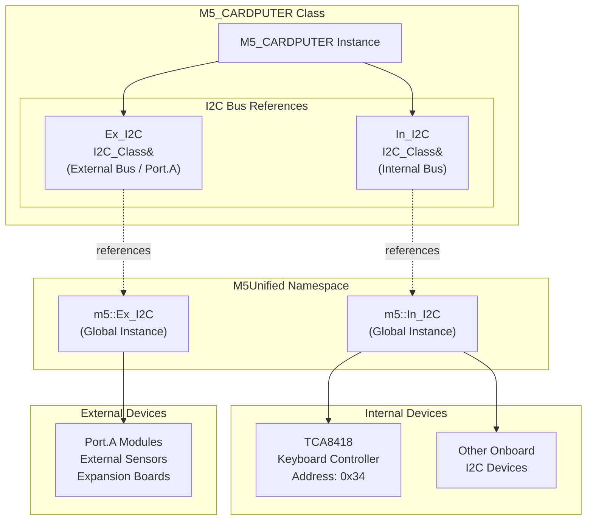
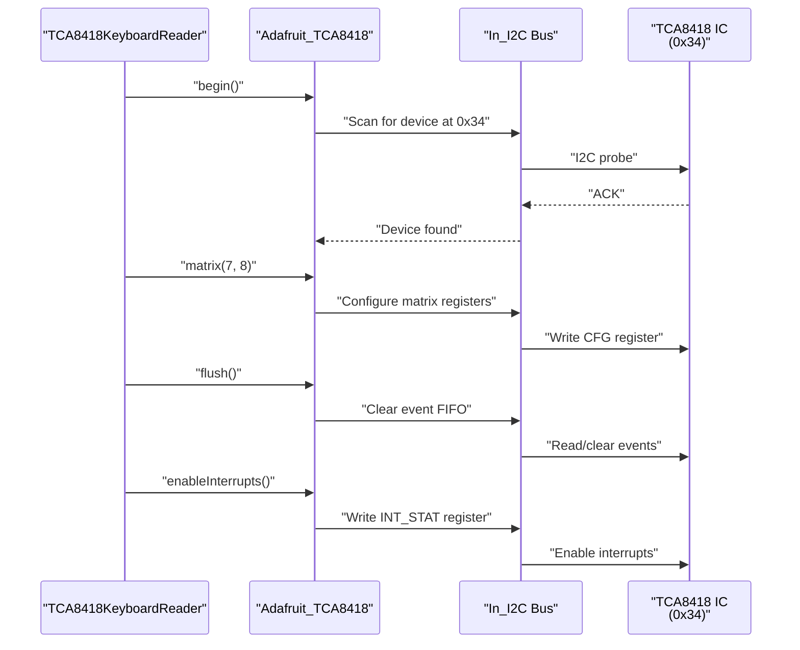
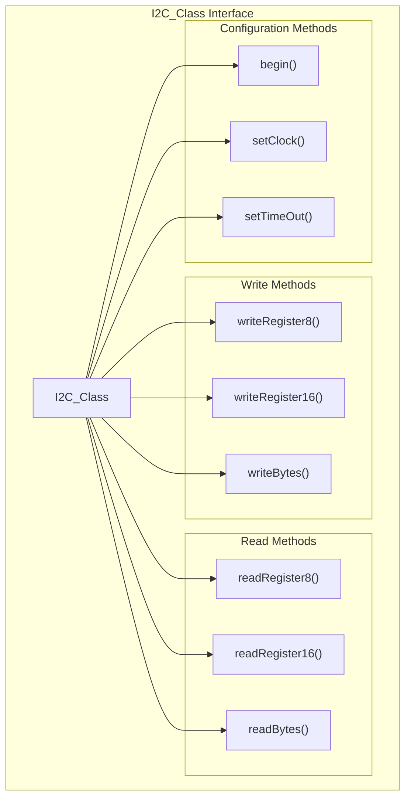
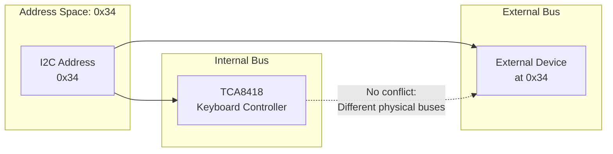

M5Cardputer I2C Bus Management

# I2C Bus Management

<details>
<summary>Relevant source files</summary>

The following files were used as context for generating this wiki page:

- [src/M5Cardputer.h](src/M5Cardputer.h)
- [src/utility/Keyboard/KeyboardReader/TCA8418.cpp](src/utility/Keyboard/KeyboardReader/TCA8418.cpp)
- [src/utility/common.h](src/utility/common.h)

</details>


## Purpose and Scope

This document explains the I2C bus architecture in the M5Cardputer library, focusing on the separation between internal and external I2C buses. The M5_CARDPUTER class exposes two distinct I2C bus references: `In_I2C` for onboard devices and `Ex_I2C` for external peripherals connected to Port.A. This separation prevents address conflicts and provides clear organization for I2C communication.

For information about initializing the M5Cardputer system, see [Initialization and Configuration](#3.1). For details on accessing other hardware components, see [Hardware Component Access](#3.2).

---

## I2C Bus Architecture

The M5Cardputer provides two separate I2C buses through the M5_CARDPUTER class. Both buses are references to `I2C_Class` objects managed by M5Unified, ensuring zero-copy access to the underlying I2C hardware interfaces.

**I2C Bus Definitions**



**Sources:** [src/M5Cardputer.h:28-32]()

---

## Internal I2C Bus (In_I2C)

The `In_I2C` bus connects to onboard I2C devices that are part of the M5Cardputer hardware. This bus is used exclusively for internal communication with integrated components.

### Declaration and Access

The internal I2C bus is exposed as a public reference member in the M5_CARDPUTER class:

```cpp
/// for internal I2C device
I2C_Class &In_I2C = m5::In_I2C;
```

This reference can be accessed through the `M5Cardputer` global instance:

```cpp
M5Cardputer.In_I2C.writeRegister8(address, reg, value);
```

### Connected Devices

The primary device on the internal I2C bus varies by hardware variant:

| Hardware Variant | Internal I2C Device | Address | Purpose |
|-----------------|---------------------|---------|---------|
| M5Cardputer | None (GPIO matrix) | N/A | Keyboard uses direct GPIO |
| M5Cardputer-ADV | TCA8418 | 0x34 | Keyboard controller IC |

### TCA8418 Usage Example

The TCA8418KeyboardReader class demonstrates internal I2C bus usage. During initialization, it communicates with the TCA8418 keyboard controller to configure the matrix and enable interrupts:



**Sources:** [src/utility/Keyboard/KeyboardReader/TCA8418.cpp:28-50]()

### I2C Communication Details

The TCA8418 keyboard controller uses the internal I2C bus for several operations:

1. **Initialization**: Configure the 7×8 keyboard matrix and interrupt settings
2. **Event Reading**: Retrieve key press/release events from the FIFO buffer
3. **Register Access**: Read and write configuration and status registers
4. **Interrupt Management**: Clear interrupt flags and check pending events

Example of interrupt flag clearing:

```cpp
// Clear the IRQ flag
_tca8418->writeRegister8(TCA8418_REG_INT_STAT, 1);
int intstat = _tca8418->readRegister8(TCA8418_REG_INT_STAT);
if ((intstat & 0x01) == 0) {
    _isr_flag = false;
}
```

**Sources:** [src/utility/Keyboard/KeyboardReader/TCA8418.cpp:60-66]()

---

## External I2C Bus (Ex_I2C)

The `Ex_I2C` bus provides access to external I2C devices connected to Port.A, the expansion port on the M5Cardputer. This bus allows users to connect additional sensors, actuators, and peripheral modules.

### Declaration and Access

The external I2C bus is exposed similarly to the internal bus:

```cpp
/// for external I2C device (Port.A)
I2C_Class &Ex_I2C = m5::Ex_I2C;
```

Access pattern:

```cpp
M5Cardputer.Ex_I2C.readRegister8(address, reg);
```

### Typical Usage Scenarios

The external I2C bus is intended for:

- **M5Stack Port.A Modules**: Environmental sensors (ENV III, TVOC/eCO2, etc.)
- **Grove I2C Devices**: Third-party sensors using Grove connectors
- **Custom I2C Peripherals**: User-designed expansion boards
- **Display Modules**: External OLED or LCD displays
- **ADC/DAC Modules**: External analog interfaces

### Port.A Pin Configuration

Port.A on the M5Cardputer provides I2C connectivity with the following signals:

| Signal | Description |
|--------|-------------|
| SDA | I2C Data Line |
| SCL | I2C Clock Line |
| 5V | Power Supply (5V) |
| GND | Ground Reference |

**Sources:** [src/M5Cardputer.h:31-32]()

---

## I2C_Class Interface

Both `In_I2C` and `Ex_I2C` are instances of the `I2C_Class` from M5Unified. This class provides a unified interface for I2C communication across all M5Stack devices.

### Common I2C Operations

The `I2C_Class` interface supports standard I2C operations:

**Write Operations:**
- `writeRegister8(addr, reg, value)` - Write single byte to register
- `writeRegister16(addr, reg, value)` - Write 16-bit value to register
- `writeBytes(addr, buffer, length)` - Write buffer to device

**Read Operations:**
- `readRegister8(addr, reg)` - Read single byte from register
- `readRegister16(addr, reg)` - Read 16-bit value from register
- `readBytes(addr, buffer, length)` - Read buffer from device

**Configuration:**
- `begin()` - Initialize I2C bus
- `setClock(frequency)` - Set I2C clock frequency
- `setTimeOut(timeout)` - Configure timeout duration



For complete I2C_Class documentation, refer to the M5Unified library documentation.

**Sources:** [src/M5Cardputer.h:28-32]()

---

## I2C Address Space Management

Proper I2C address space management prevents conflicts between internal and external devices. The separation of buses (`In_I2C` vs `Ex_I2C`) provides inherent isolation, but understanding address allocation is important for troubleshooting.

### Address Allocation

**Internal I2C Bus (In_I2C):**

| Address | Device | Variant | Notes |
|---------|--------|---------|-------|
| 0x34 | TCA8418 | M5Cardputer-ADV | Keyboard controller |
| 0x00-0x33 | Reserved | Both | Available for future internal devices |
| 0x35-0x7F | Reserved | Both | Available for future internal devices |

**External I2C Bus (Ex_I2C):**

The external bus has no pre-allocated addresses, allowing full flexibility for user-connected devices. Common M5Stack module addresses:

| Address Range | Typical Devices |
|---------------|-----------------|
| 0x20-0x27 | IO expanders (PCF8574, MCP23017) |
| 0x38-0x3F | Environmental sensors |
| 0x40-0x4F | Light sensors, IMUs |
| 0x50-0x57 | EEPROMs |
| 0x68-0x6F | RTC modules, IMUs |
| 0x76-0x77 | Pressure sensors (BMP280, BME280) |

### Conflict Prevention Strategy

The dual-bus architecture provides automatic conflict prevention:



Even if an external device uses address 0x34 (same as the TCA8418), no conflict occurs because they operate on separate physical I2C buses.

**Sources:** [src/utility/Keyboard/KeyboardReader/TCA8418.cpp:28-36]()

---

## Usage Patterns and Best Practices

### Pattern 1: Scanning for Devices

Before communicating with an I2C device, verify its presence by scanning the bus:

```cpp
// Scan external I2C bus for devices
for (uint8_t addr = 0x08; addr < 0x78; addr++) {
    if (M5Cardputer.Ex_I2C.writeBytes(addr, nullptr, 0) == 0) {
        Serial.printf("Device found at address 0x%02X\n", addr);
    }
}
```

### Pattern 2: Register-Based Communication

Most I2C devices use register-based communication:

```cpp
// Read temperature from external sensor at 0x48
uint8_t tempReg = 0x00;
int16_t rawTemp = M5Cardputer.Ex_I2C.readRegister16(0x48, tempReg);
float temperature = rawTemp * 0.0625;  // Convert to Celsius
```

### Pattern 3: Multi-Byte Transfers

For bulk data transfers, use buffer-based methods:

```cpp
// Write configuration sequence to external device
uint8_t config[] = {0x10, 0x20, 0x30, 0x40};
M5Cardputer.Ex_I2C.writeBytes(deviceAddr, config, sizeof(config));
```

### Pattern 4: Error Handling

Always check return values for I2C operations:

```cpp
int result = M5Cardputer.Ex_I2C.writeRegister8(addr, reg, value);
if (result != 0) {
    Serial.printf("I2C write failed: error code %d\n", result);
    // Handle error: retry, report, or fall back
}
```

### Best Practices Summary

1. **Use the Correct Bus**: Access internal devices through `In_I2C`, external devices through `Ex_I2C`
2. **Check Device Presence**: Scan the bus before attempting communication
3. **Handle Errors**: Check return codes and implement retry logic for critical operations
4. **Document Addresses**: Maintain a list of external device addresses to prevent accidental conflicts
5. **Clock Speed**: Keep default clock speeds unless specific devices require customization
6. **Pull-up Resistors**: Ensure proper pull-up resistors on external I2C lines (typically 4.7kΩ - 10kΩ)

**Sources:** [src/M5Cardputer.h:28-32](), [src/utility/Keyboard/KeyboardReader/TCA8418.cpp:28-66]()

---

## Summary

The M5Cardputer's dual I2C bus architecture provides:

- **Clear Separation**: Internal devices on `In_I2C`, external devices on `Ex_I2C`
- **Conflict Prevention**: Separate physical buses eliminate address conflicts
- **Unified Interface**: Both buses use the same `I2C_Class` API from M5Unified
- **Hardware Flexibility**: The M5Cardputer-ADV uses internal I2C for its TCA8418 keyboard controller, while the standard M5Cardputer reserves the internal bus for future use

This architecture ensures robust I2C communication while maintaining simplicity for application developers.