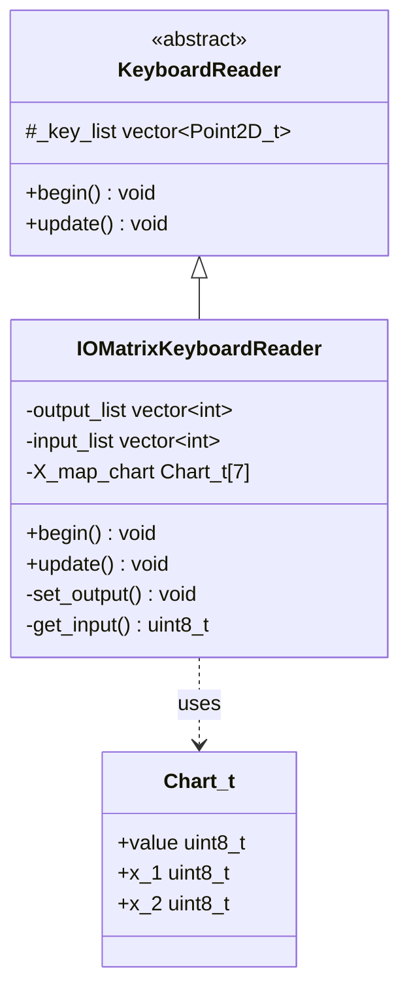
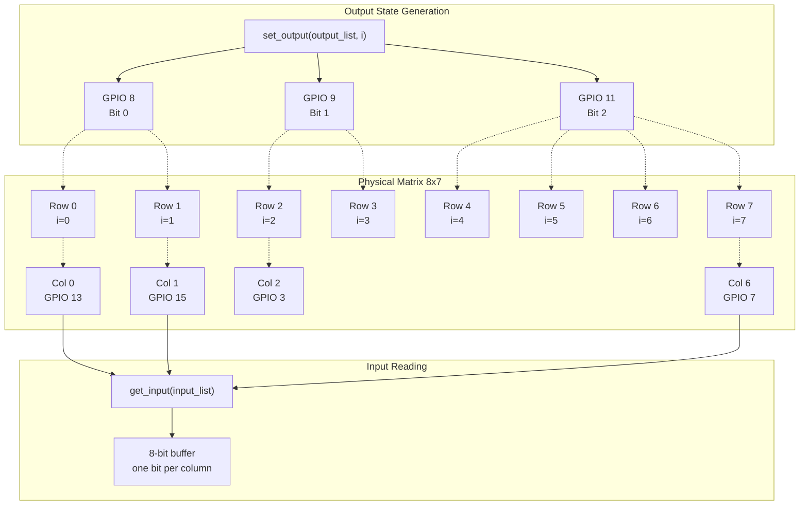
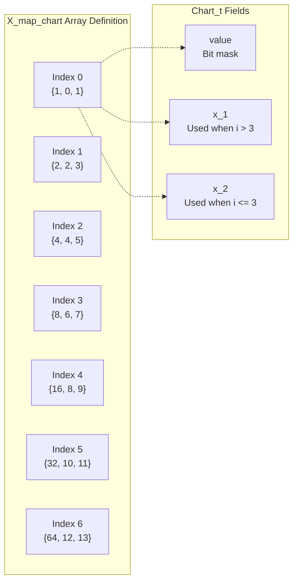
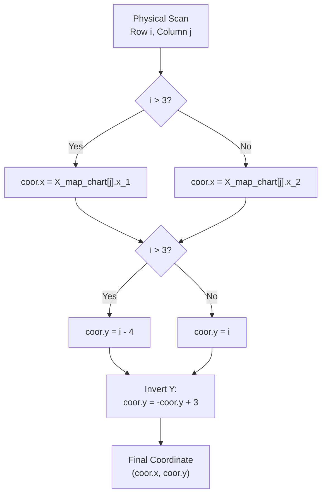
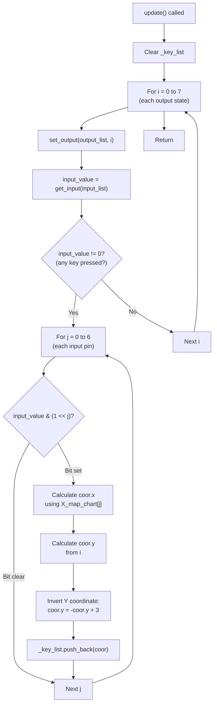

M5Cardputer IOMatrix Implementation (M5Cardputer)

# IOMatrix Implementation (M5Cardputer)

<details>
<summary>Relevant source files</summary>

The following files were used as context for generating this wiki page:

- [src/utility/Keyboard/KeyboardReader/IOMatrix.cpp](src/utility/Keyboard/KeyboardReader/IOMatrix.cpp)
- [src/utility/Keyboard/KeyboardReader/IOMatrix.h](src/utility/Keyboard/KeyboardReader/IOMatrix.h)

</details>


## Purpose and Scope

This document provides a detailed technical description of the `IOMatrixKeyboardReader` class, which implements keyboard scanning for the standard M5Cardputer hardware variant. This implementation uses direct GPIO matrix scanning with 3 output pins and 7 input pins to detect key presses on the physical keyboard.

For information about the abstract `KeyboardReader` interface that this class implements, see [Hardware Abstraction Layer](#4.4). For the alternative TCA8418-based implementation used in M5Cardputer-ADV, see [TCA8418 Implementation](#4.6). For higher-level keyboard API documentation, see [Keyboard_Class API](#4.1).

**Sources:** [src/utility/Keyboard/KeyboardReader/IOMatrix.h:1-37](), [src/utility/Keyboard/KeyboardReader/IOMatrix.cpp:1-80]()

## Class Overview

`IOMatrixKeyboardReader` is a concrete implementation of the `KeyboardReader` abstract interface. It provides keyboard input functionality for the standard M5Cardputer by directly scanning a GPIO-based key matrix without requiring an external keyboard controller IC.



**Sources:** [src/utility/Keyboard/KeyboardReader/IOMatrix.h:11-36]()

## GPIO Pin Configuration

The `IOMatrixKeyboardReader` uses a total of 10 GPIO pins to scan the keyboard matrix:

### Output Pins (3 pins)

These pins are configured as digital outputs and encode the row selection state using binary encoding:

| Pin Number | Bit Position | Purpose |
|------------|--------------|---------|
| GPIO 8     | Bit 0        | Row select LSB |
| GPIO 9     | Bit 1        | Row select middle bit |
| GPIO 11    | Bit 2        | Row select MSB |

With 3 bits, this configuration can address 8 different row states (0-7).

### Input Pins (7 pins)

These pins are configured as digital inputs with internal pull-up resistors. Each pin corresponds to a column in the matrix:

| Pin Number | Column Index |
|------------|--------------|
| GPIO 13    | 0            |
| GPIO 15    | 1            |
| GPIO 3     | 2            |
| GPIO 4     | 3            |
| GPIO 5     | 4            |
| GPIO 6     | 5            |
| GPIO 7     | 6            |

**Sources:** [src/utility/Keyboard/KeyboardReader/IOMatrix.h:29-30](), [src/utility/Keyboard/KeyboardReader/IOMatrix.cpp:32-46]()

## Matrix Scanning Architecture

The IOMatrix implementation scans an 8×7 physical matrix, where 8 rows are addressed through binary-encoded output pins and 7 columns are read directly from input pins.



### Scanning Process

The scanning process iterates through all 8 possible output states (i = 0 to 7):

1. **Set Output State**: The three output pins are set to encode the current row index `i` [src/utility/Keyboard/KeyboardReader/IOMatrix.cpp:56]()
2. **Read Input Pins**: All 7 input pins are read to detect which columns have keys pressed [src/utility/Keyboard/KeyboardReader/IOMatrix.cpp:57]()
3. **Process Results**: If any input reads LOW (key pressed), the coordinate is calculated and stored [src/utility/Keyboard/KeyboardReader/IOMatrix.cpp:60-76]()

**Sources:** [src/utility/Keyboard/KeyboardReader/IOMatrix.cpp:48-79]()

## Coordinate Remapping System

The physical matrix scanning produces raw coordinates that do not directly correspond to the logical keyboard layout. The `X_map_chart` array provides the mapping from physical input pin indices to logical X coordinates.

### X_map_chart Structure



Each entry in `X_map_chart` is a `Chart_t` structure containing:

- **value**: A bit mask (unused in current implementation)
- **x_1**: X coordinate to use when the output state index `i > 3`
- **x_2**: X coordinate to use when the output state index `i <= 3`

| Input Pin Index (j) | value | x_1 (i > 3) | x_2 (i ≤ 3) |
|---------------------|-------|-------------|-------------|
| 0                   | 1     | 0           | 1           |
| 1                   | 2     | 2           | 3           |
| 2                   | 4     | 4           | 5           |
| 3                   | 8     | 6           | 7           |
| 4                   | 16    | 8           | 9           |
| 5                   | 32    | 10          | 11          |
| 6                   | 64    | 12          | 13          |

**Sources:** [src/utility/Keyboard/KeyboardReader/IOMatrix.h:11-15](), [src/utility/Keyboard/KeyboardReader/IOMatrix.h:32]()

### Coordinate Transformation Algorithm

The transformation from physical scan coordinates to logical keyboard coordinates follows this algorithm:



The coordinate transformation is implemented in [src/utility/Keyboard/KeyboardReader/IOMatrix.cpp:64-72]():

1. **X Coordinate Selection**: `coor.x = (i > 3) ? X_map_chart[j].x_1 : X_map_chart[j].x_2`
2. **Initial Y Calculation**: `coor.y = (i > 3) ? (i - 4) : i`
3. **Y Coordinate Inversion**: `coor.y = -coor.y + 3`

This transformation ensures that the physical matrix mapping aligns with the logical keyboard layout expected by higher-level code.

**Sources:** [src/utility/Keyboard/KeyboardReader/IOMatrix.cpp:64-72]()

## Key Detection Algorithm

The `update()` method implements the complete key detection algorithm, which scans the entire matrix and populates the `_key_list` vector with all currently pressed keys.

### Algorithm Flow



### Method Implementations

#### begin()

Initializes the GPIO pins for matrix scanning [src/utility/Keyboard/KeyboardReader/IOMatrix.cpp:32-46]():

1. **Reset and Configure Output Pins**: Each output pin is reset, configured as OUTPUT, and set to LOW
2. **Reset and Configure Input Pins**: Each input pin is reset and configured as INPUT_PULLUP
3. **Initialize Output State**: Set all output pins to state 0

```cpp
// Implementation in IOMatrix.cpp:32-46
void IOMatrixKeyboardReader::begin() {
    // Configure 3 output pins
    for (auto i : output_list) {
        gpio_reset_pin((gpio_num_t)i);
        pinMode(i, OUTPUT);
        digitalWrite(i, 0);
    }
    
    // Configure 7 input pins with pull-up
    for (auto i : input_list) {
        gpio_reset_pin((gpio_num_t)i);
        pinMode(i, INPUT_PULLUP);
    }
    
    // Initialize to output state 0
    set_output(output_list, 0);
}
```

#### set_output()

Sets the three output pins to encode a specific row state [src/utility/Keyboard/KeyboardReader/IOMatrix.cpp:9-16]():

- Masks the output value to 3 bits (0-7 range)
- Sets each output pin based on the corresponding bit in the output value
- Pin 0 receives bit 0, pin 1 receives bit 1, pin 2 receives bit 2

#### get_input()

Reads all seven input pins and packs their states into a single byte [src/utility/Keyboard/KeyboardReader/IOMatrix.cpp:18-30]():

- Reads each input pin (LOW = key pressed, HIGH = no key)
- Inverts the logic (LOW becomes 1, HIGH becomes 0)
- Packs the 7 bits into a byte, with bit i corresponding to input pin i
- Returns the packed byte where each set bit indicates a pressed key

#### update()

The main scanning method [src/utility/Keyboard/KeyboardReader/IOMatrix.cpp:48-79]():

1. **Clear Previous State**: Clears the `_key_list` vector
2. **Scan All Rows**: Iterates through output states 0-7
3. **For Each Row**: 
   - Sets the output pins to select the row
   - Reads all input pins
   - If any inputs are LOW (key pressed), processes each column
4. **For Each Pressed Key**:
   - Calculates the logical X coordinate using `X_map_chart`
   - Calculates the Y coordinate from the row index
   - Inverts and offsets the Y coordinate
   - Adds the coordinate to `_key_list`

**Sources:** [src/utility/Keyboard/KeyboardReader/IOMatrix.cpp:9-79]()

## Coordinate Mapping Examples

To illustrate the coordinate transformation, here are several examples:

| Physical (i, j) | i > 3? | x_1/x_2 selection | Raw Y | Final X | Final Y | Result |
|-----------------|--------|-------------------|-------|---------|---------|--------|
| (0, 0)          | No     | x_2 = 1           | 0     | 1       | 3       | (1, 3) |
| (4, 0)          | Yes    | x_1 = 0           | 0     | 0       | 3       | (0, 3) |
| (3, 1)          | No     | x_2 = 3           | 3     | 3       | 0       | (3, 0) |
| (7, 6)          | Yes    | x_1 = 12          | 3     | 12      | 0       | (12, 0)|

This mapping creates a logical coordinate space where:
- X coordinates range from 0 to 13
- Y coordinates range from 0 to 3
- The coordinate space matches the physical keyboard layout

**Sources:** [src/utility/Keyboard/KeyboardReader/IOMatrix.cpp:64-72]()

## Performance Characteristics

The IOMatrix implementation provides the following performance characteristics:

- **Scan Rate**: The `update()` method performs 8 sequential GPIO operations (one per row), each involving setting 3 output pins and reading 7 input pins
- **Latency**: Minimal latency as scanning is performed directly via GPIO without I2C communication overhead
- **CPU Usage**: Higher than I2C-based implementations due to active polling, but still negligible on ESP32
- **Simultaneity**: The implementation correctly detects multiple simultaneous key presses across different rows and columns

**Sources:** [src/utility/Keyboard/KeyboardReader/IOMatrix.cpp:48-79]()

## Hardware Requirements

The IOMatrixKeyboardReader requires the following hardware connections on the M5Cardputer board:

- **10 GPIO pins** available and dedicated to keyboard scanning
- **Physical keyboard matrix** with diodes to prevent ghosting
- **Pull-up resistors** on input lines (internal pull-ups are used)
- **ESP32 microcontroller** with sufficient GPIO pins

This implementation is specific to the standard M5Cardputer hardware design and cannot be used with other keyboard configurations without modification to the pin assignments and coordinate mapping.

**Sources:** [src/utility/Keyboard/KeyboardReader/IOMatrix.h:29-32]()