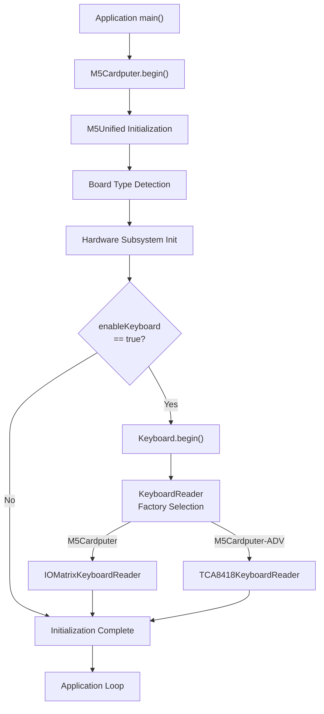
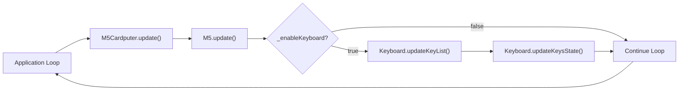
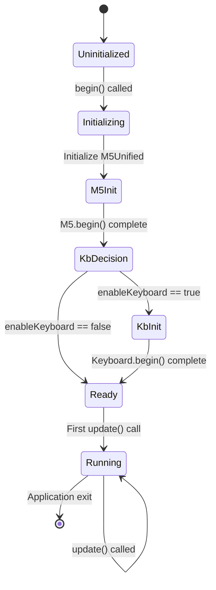

M5Cardputer Initialization and Configuration

# Initialization and Configuration

<details>
<summary>Relevant source files</summary>

The following files were used as context for generating this wiki page:

- [src/M5Cardputer.cpp](src/M5Cardputer.cpp)
- [src/M5Cardputer.h](src/M5Cardputer.h)

</details>


## Purpose and Scope

This document explains how to initialize and configure the M5Cardputer library through the `M5_CARDPUTER` class. It covers the two `begin()` methods, configuration options, and the initialization lifecycle. For accessing hardware components after initialization, see [Hardware Component Access](#3.2). For I2C bus configuration, see [I2C Bus Management](#3.3).

The initialization process sets up the M5Unified framework, configures hardware components, and optionally initializes the keyboard subsystem. All M5Cardputer applications must call one of the `begin()` methods before accessing any hardware features.

**Sources:** [src/M5Cardputer.h:1-45](), [src/M5Cardputer.cpp:1-38]()

---

## The Global M5Cardputer Instance

The library provides a global singleton instance named `M5Cardputer` that serves as the primary interface to all hardware functionality. This instance is declared in [src/M5Cardputer.h:43]() and defined in [src/M5Cardputer.cpp:10]().

```cpp
extern m5::M5_CARDPUTER M5Cardputer;
```

Applications interact with this global object rather than creating their own instances. The `M5_CARDPUTER` class definition is in the `m5` namespace [src/M5Cardputer.h:12-41](), but the global instance is accessible directly as `M5Cardputer` in the global namespace.

**Sources:** [src/M5Cardputer.h:43](), [src/M5Cardputer.cpp:10]()

---

## Initialization Methods

### Basic Initialization


**Diagram: Basic Initialization Call Chain**

The simplest initialization method is:

```cpp
void M5_CARDPUTER::begin(bool enableKeyboard = true);
```

This method performs the following operations [src/M5Cardputer.cpp:12-19]():

1. Calls `M5.begin()` to initialize the M5Unified framework
2. Stores the `enableKeyboard` parameter in `_enableKeyboard` member
3. Conditionally calls `Keyboard.begin()` if `enableKeyboard` is `true`

**Parameters:**

| Parameter | Type | Default | Description |
|-----------|------|---------|-------------|
| `enableKeyboard` | `bool` | `true` | Whether to initialize the keyboard subsystem |

**Sources:** [src/M5Cardputer.h:16](), [src/M5Cardputer.cpp:12-19]()

### Custom Configuration

```cpp
void M5_CARDPUTER::begin(m5::M5Unified::config_t cfg, bool enableKeyboard = true);
```

This overload allows passing custom configuration to the M5Unified framework [src/M5Cardputer.cpp:21-28](). It follows the same initialization sequence but forwards the `cfg` parameter to `M5.begin(cfg)`.

**Parameters:**

| Parameter | Type | Default | Description |
|-----------|------|---------|-------------|
| `cfg` | `m5::M5Unified::config_t` | N/A | M5Unified configuration structure |
| `enableKeyboard` | `bool` | `true` | Whether to initialize the keyboard subsystem |

The `m5::M5Unified::config_t` structure is defined by the M5Unified library and controls various hardware subsystems. Common configuration options include:

| Configuration Field | Purpose | Typical Values |
|---------------------|---------|----------------|
| `serial_baudrate` | Serial console baud rate | 115200, 9600 |
| `output_power` | Display backlight and power settings | true/false |
| `internal_imu` | Initialize internal IMU | true/false |
| `internal_rtc` | Initialize internal RTC | true/false |
| `external_imu` | Initialize external IMU | true/false |
| `external_rtc` | Initialize external RTC | true/false |

**Sources:** [src/M5Cardputer.h:17](), [src/M5Cardputer.cpp:21-28]()

---

## Initialization Lifecycle



**Diagram: Complete Initialization Lifecycle**

The initialization process consists of two major phases:

1. **M5Unified Initialization**: Detects board type, initializes display, power management, speaker, microphone, and button hardware
2. **Keyboard Initialization**: If enabled, creates the appropriate hardware-specific keyboard reader and initializes the keyboard subsystem

The board type detection automatically determines whether to use `IOMatrixKeyboardReader` (standard M5Cardputer) or `TCA8418KeyboardReader` (M5Cardputer-ADV). For details on this selection process, see [Hardware Variant Detection](#11.2).

**Sources:** [src/M5Cardputer.cpp:12-28]()

---

## Keyboard Initialization Control

The `enableKeyboard` parameter allows applications to disable keyboard initialization if not needed. This is useful for:

- Applications that don't use keyboard input
- Custom keyboard implementations (see [Creating Custom Keyboard Readers](#11.1))
- Power-sensitive applications that want to minimize power consumption
- Testing and debugging scenarios

When `enableKeyboard` is set to `false`:

1. The `Keyboard.begin()` method is not called [src/M5Cardputer.cpp:16-18]()
2. The `_enableKeyboard` member is set to `false` [src/M5Cardputer.cpp:15]()
3. The `update()` method skips keyboard update operations [src/M5Cardputer.cpp:33-36]()

The keyboard can still be manually initialized later by calling `M5Cardputer.Keyboard.begin()` directly, though this is not recommended as the `_enableKeyboard` flag will still be `false`, preventing automatic updates.

**Sources:** [src/M5Cardputer.cpp:12-19](), [src/M5Cardputer.cpp:21-28]()

---

## The Update Cycle

```cpp
void M5_CARDPUTER::update(void);
```

After initialization, applications must call `M5Cardputer.update()` regularly (typically once per main loop iteration) to update hardware state [src/M5Cardputer.cpp:30-37]().



**Diagram: Update Cycle Data Flow**

The `update()` method performs the following operations:

1. **M5.update()** [src/M5Cardputer.cpp:32](): Updates button states, power management, and other M5Unified subsystems
2. **Keyboard.updateKeyList()** [src/M5Cardputer.cpp:34](): Scans hardware and updates the list of currently pressed keys (only if keyboard is enabled)
3. **Keyboard.updateKeysState()** [src/M5Cardputer.cpp:35](): Processes key list through the two-pass state update algorithm (only if keyboard is enabled)

### Update Frequency Recommendations

| Application Type | Recommended Update Frequency | Rationale |
|-----------------|------------------------------|-----------|
| Interactive UI | Every loop iteration | Ensures responsive keyboard and button input |
| Real-time applications | Every loop iteration | Minimizes input latency |
| Background tasks | Every 10-50ms | Balances responsiveness with CPU usage |
| Power-sensitive | Every 50-100ms | Reduces power consumption |

**Sources:** [src/M5Cardputer.cpp:30-37](), [src/M5Cardputer.h:34]()

---

## Typical Initialization Patterns

### Pattern 1: Minimal Initialization

```cpp
void setup() {
    M5Cardputer.begin();  // Use all defaults
}

void loop() {
    M5Cardputer.update();
    // Application logic
}
```

This pattern uses default configuration for all subsystems. Suitable for most applications.

### Pattern 2: Keyboard-Disabled Initialization

```cpp
void setup() {
    M5Cardputer.begin(false);  // Disable keyboard
}

void loop() {
    M5Cardputer.update();
    // Application logic without keyboard
}
```

This pattern is useful for display-only applications or when implementing custom input methods.

### Pattern 3: Custom M5Unified Configuration

```cpp
void setup() {
    auto cfg = M5.config();
    cfg.serial_baudrate = 9600;
    cfg.output_power = false;
    
    M5Cardputer.begin(cfg, true);
}

void loop() {
    M5Cardputer.update();
    // Application logic
}
```

This pattern provides fine-grained control over M5Unified subsystems while still enabling the keyboard.

**Sources:** [src/M5Cardputer.cpp:12-28]()

---

## Initialization State Machine



**Diagram: M5Cardputer Initialization State Machine**

The `M5_CARDPUTER` class maintains internal state through the `_enableKeyboard` private member [src/M5Cardputer.h:38](). This flag controls whether keyboard updates are performed during the `update()` cycle [src/M5Cardputer.cpp:33-36]().

**States:**

| State | Description | Transitions |
|-------|-------------|-------------|
| **Uninitialized** | Object constructed but `begin()` not called | → Initializing |
| **Initializing** | `begin()` executing, hardware setup in progress | → M5Init |
| **M5Init** | M5Unified initialization executing | → KbDecision |
| **KbDecision** | Checking `enableKeyboard` parameter | → KbInit or Ready |
| **KbInit** | Keyboard initialization executing | → Ready |
| **Ready** | Initialization complete, waiting for first `update()` | → Running |
| **Running** | Normal operation, `update()` being called regularly | → Running (loop) |

**Sources:** [src/M5Cardputer.h:38](), [src/M5Cardputer.cpp:12-37]()

---

## Hardware Component References

After successful initialization, the `M5_CARDPUTER` class exposes hardware components through public reference members [src/M5Cardputer.h:19-32]():

| Member | Type | Source | Purpose |
|--------|------|--------|---------|
| `Display` | `M5GFX&` | `M5.Display` | Primary display interface |
| `Lcd` | `M5GFX&` | `Display` | Alias for Display (backward compatibility) |
| `Power` | `Power_Class&` | `M5.Power` | Power management and battery status |
| `Speaker` | `Speaker_Class&` | `M5.Speaker` | Audio output |
| `Mic` | `Mic_Class&` | `M5.Mic` | Audio input |
| `BtnA` | `Button_Class&` | `M5.getButton(0)` | Physical button A |
| `Keyboard` | `Keyboard_Class` | Owned instance | Keyboard subsystem |
| `In_I2C` | `I2C_Class&` | `m5::In_I2C` | Internal I2C bus |
| `Ex_I2C` | `I2C_Class&` | `m5::Ex_I2C` | External I2C bus (Port.A) |

Note that `Keyboard` is the only directly owned component [src/M5Cardputer.h:26](), while all other members are references to components managed by the M5Unified singleton. This design ensures unified state management across the M5Stack ecosystem. For detailed usage of these components, see [Hardware Component Access](#3.2).

**Sources:** [src/M5Cardputer.h:19-32]()