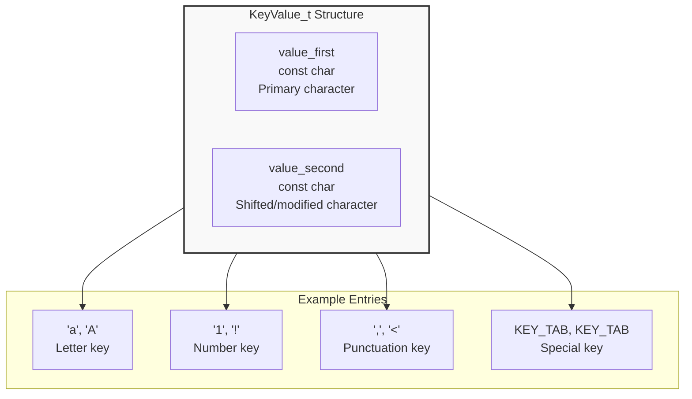
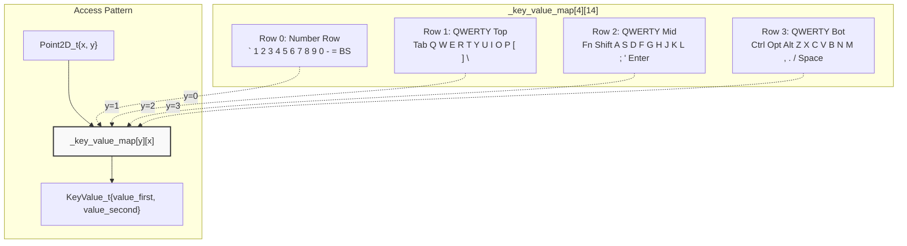
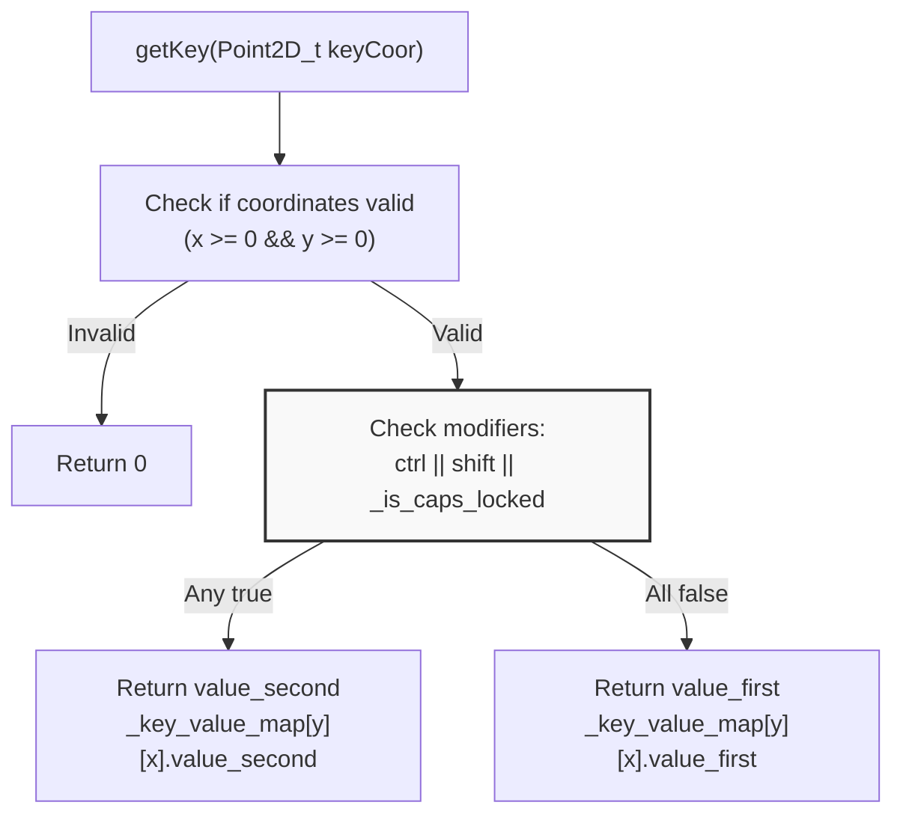
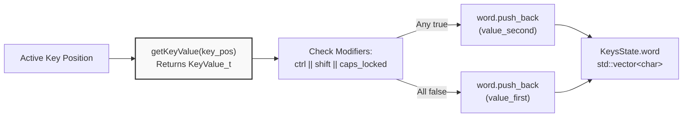
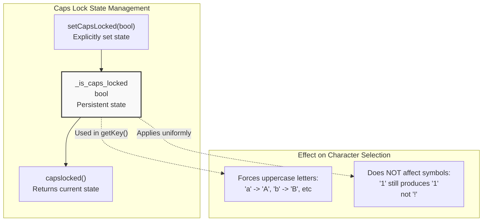
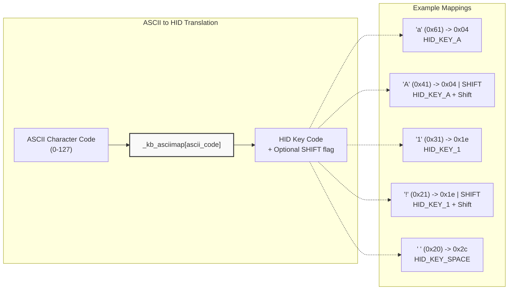
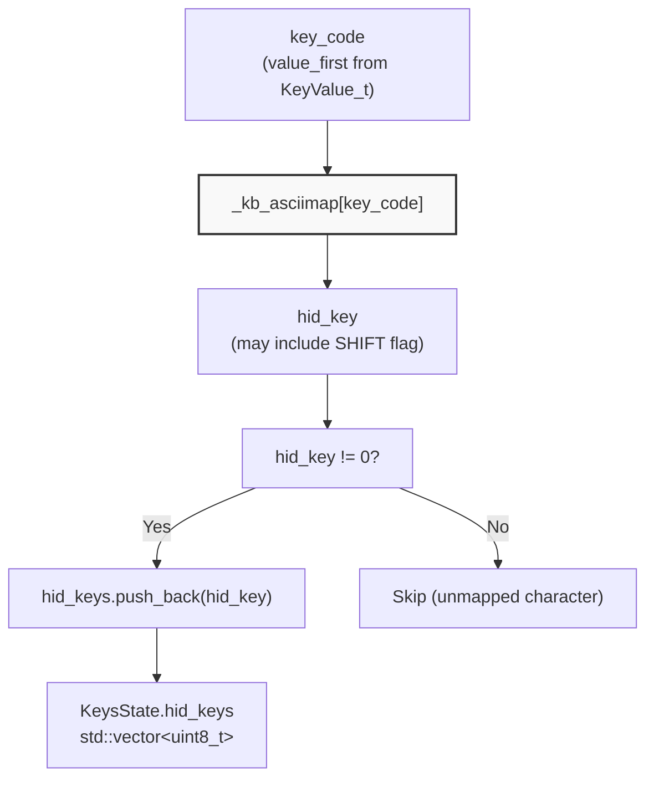
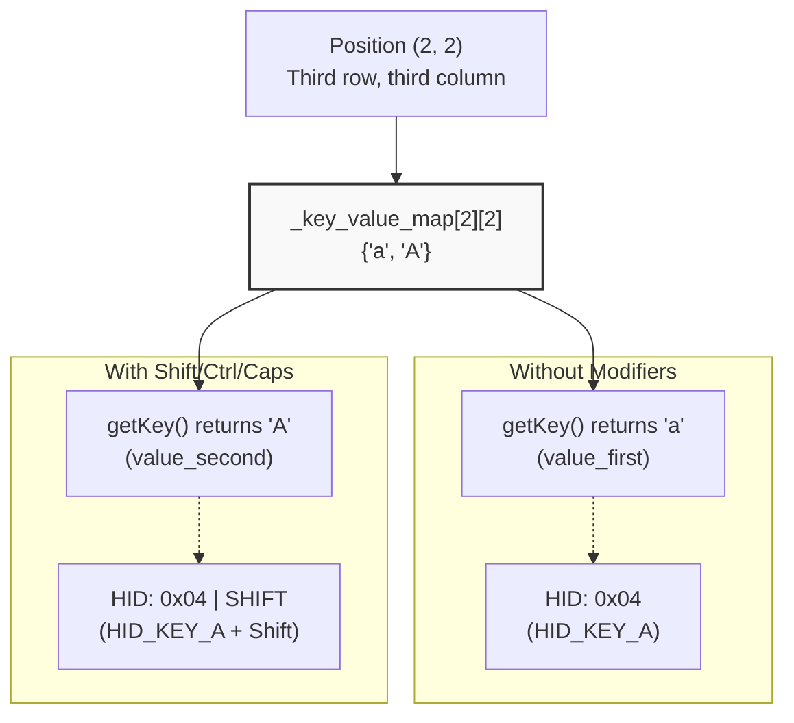
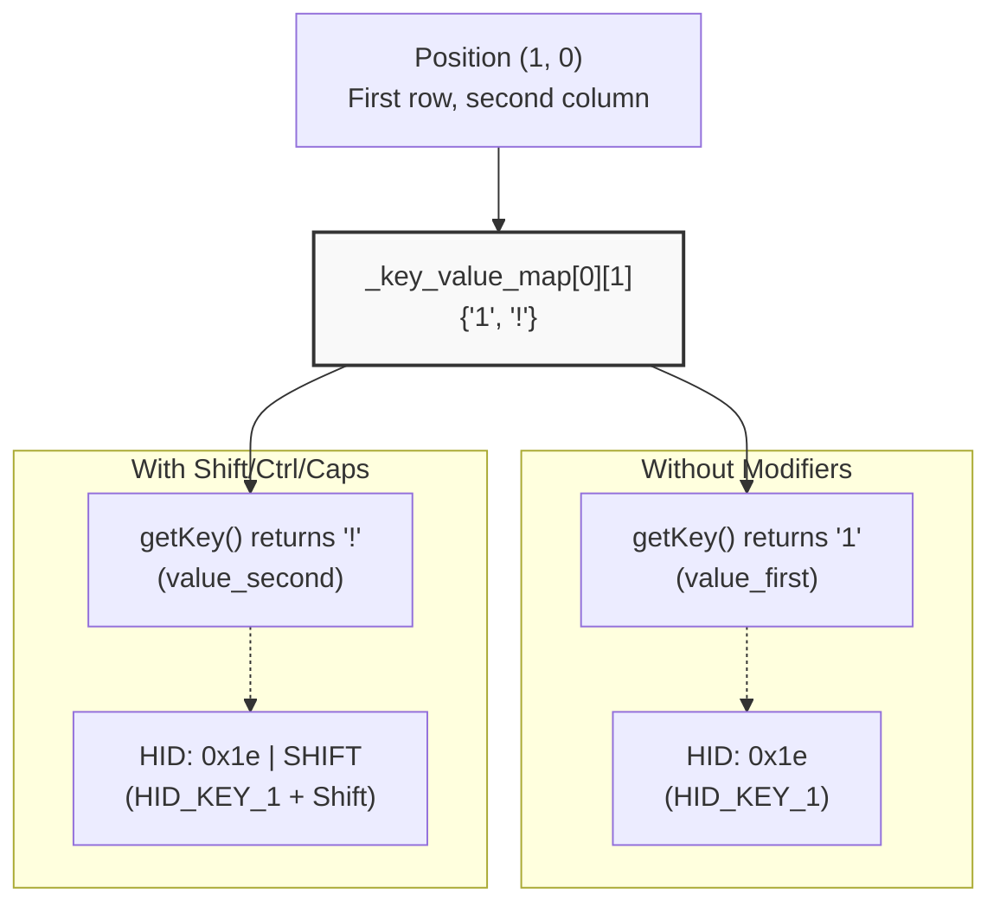
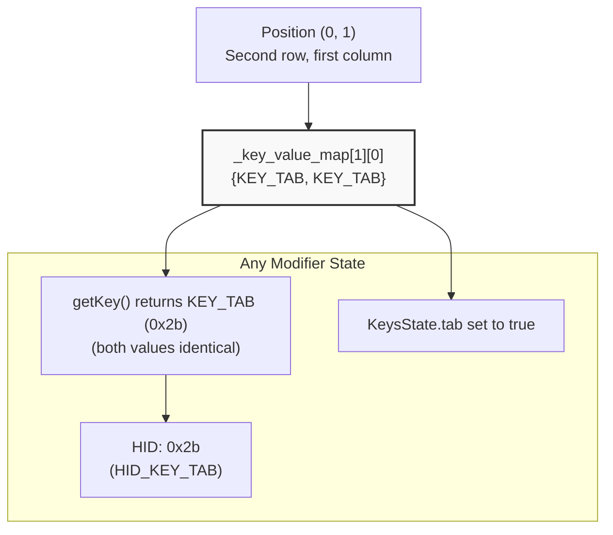

M5Cardputer Key Mapping and Character Translation

# Key Mapping and Character Translation

<details>
<summary>Relevant source files</summary>

The following files were used as context for generating this wiki page:

- [src/utility/Adafruit_TCA8418/Adafruit_TCA8418_registers.h](src/utility/Adafruit_TCA8418/Adafruit_TCA8418_registers.h)
- [src/utility/Keyboard/Keyboard.cpp](src/utility/Keyboard/Keyboard.cpp)
- [src/utility/Keyboard/Keyboard.h](src/utility/Keyboard/Keyboard.h)
- [src/utility/Keyboard/Keyboard_def.h](src/utility/Keyboard/Keyboard_def.h)

</details>


This document explains how the M5Cardputer keyboard system translates physical key coordinates into ASCII characters and HID key codes. It covers the dual-value key mapping structure, character selection logic based on modifier keys and Caps Lock state, and the relationship between character codes and USB HID codes.

For information about the overall keyboard processing pipeline and state management, see [Key State and Events](#4.2). For details on hardware-specific coordinate generation, see [Hardware Abstraction Layer](#4.4).

## Key Value Map Structure

The keyboard system uses a compile-time constant 4x14 array called `_key_value_map` that maps physical key coordinates (x, y) to character pairs. Each entry is a `KeyValue_t` structure containing two character values.

### KeyValue_t Structure



**Sources:** [src/utility/Keyboard/Keyboard.h:13-16]()

The `value_first` field stores the character produced when the key is pressed without modifiers. The `value_second` field stores the character produced when Shift, Ctrl, or Caps Lock is active. For non-character keys like Tab, Backspace, and modifier keys themselves, both values are identical.

### Key Map Layout

The `_key_value_map` is organized as a 4-row by 14-column array corresponding to the physical keyboard layout:

| Row | Columns | Description |
|-----|---------|-------------|
| 0   | 0-13    | Number row: `` ` 1 2 3 4 5 6 7 8 9 0 - = BACKSPACE`` |
| 1   | 0-13    | Top letter row: ``TAB q w e r t y u i o p [ ] \`` |
| 2   | 0-13    | Middle letter row: ``FN SHIFT a s d f g h j k l ; ' ENTER`` |
| 3   | 0-13    | Bottom letter row: ``CTRL OPT ALT z x c v b n m , . / SPACE`` |



**Sources:** [src/utility/Keyboard/Keyboard.h:18-73]()

### Key Categories in the Map

The map contains three categories of keys:

**Letter Keys:** All letters have lowercase as `value_first` and uppercase as `value_second`:
```
{'a', 'A'}, {'b', 'B'}, ..., {'z', 'Z'}
```

**Number and Symbol Keys:** Numbers have their shifted symbols as `value_second`:
```
{'1', '!'}, {'2', '@'}, {'3', '#'}, ...
{'-', '_'}, {'=', '+'}, {'[', '{'}, ...
```

**Special and Modifier Keys:** These have identical values for both fields:
```
{KEY_TAB, KEY_TAB}
{KEY_BACKSPACE, KEY_BACKSPACE}
{KEY_ENTER, KEY_ENTER}
{KEY_FN, KEY_FN}
{KEY_LEFT_SHIFT, KEY_LEFT_SHIFT}
{KEY_LEFT_CTRL, KEY_LEFT_CTRL}
```

**Sources:** [src/utility/Keyboard/Keyboard.h:18-73]()

## Character Selection Logic

The `Keyboard_Class::getKey()` method determines which character value to return based on the current modifier state and Caps Lock setting.

### getKey() Decision Flow



**Sources:** [src/utility/Keyboard/Keyboard.cpp:39-52]()

The selection logic is straightforward: if any of Ctrl, Shift, or Caps Lock is active, use `value_second`; otherwise use `value_first`. This applies uniformly to all keys, though for special keys (Tab, Enter, etc.) both values are identical so the selection has no effect.

### Modifier State Sources

The modifier flags used in character selection come from the `KeysState` buffer, which is populated during the two-pass state update:

| Modifier | Flag Field | Effect on Character Selection |
|----------|------------|-------------------------------|
| Shift | `_keys_state_buffer.shift` | Forces `value_second` selection |
| Ctrl | `_keys_state_buffer.ctrl` | Forces `value_second` selection |
| Caps Lock | `_is_caps_locked` | Forces `value_second` selection |
| Alt | `_keys_state_buffer.alt` | No effect on character selection |
| Fn | `_keys_state_buffer.fn` | No effect on character selection |
| Opt | `_keys_state_buffer.opt` | No effect on character selection |

Note that Alt, Fn, and Opt are tracked but do not affect the character mapping logic. They are available to applications for custom behavior.

**Sources:** [src/utility/Keyboard/Keyboard.cpp:46-50](), [src/utility/Keyboard/Keyboard.h:77-88]()

### Character Selection During State Update

The `updateKeysState()` method applies the same selection logic when building the character buffer:



**Sources:** [src/utility/Keyboard/Keyboard.cpp:201-208]()

This ensures consistent character values whether queried via `getKey()` or retrieved from the `word` buffer in `KeysState`.

## Caps Lock Behavior

The Caps Lock state is managed separately from the momentary modifier keys:



**Sources:** [src/utility/Keyboard/Keyboard.h:144-151](), [src/utility/Keyboard/Keyboard.cpp:46-50]()

Important: Caps Lock has the same effect as Shift/Ctrl in the character selection logic. This means it affects all keys uniformly, not just letters. For example, with Caps Lock enabled:
- Letters: `'a'` becomes `'A'` ✓ (expected)
- Numbers: `'1'` becomes `'!'` (may be unexpected)
- Symbols: `','` becomes `'<'` (may be unexpected)

Applications that want traditional Caps Lock behavior (affecting only letters) must implement their own filtering logic.

## HID Key Code Translation

In addition to character mapping, the keyboard system maintains a separate translation table for USB HID key codes. This enables the M5Cardputer to act as a USB keyboard device.

### ASCII to HID Mapping

The `_kb_asciimap` array translates ASCII character codes (0-127) to HID usage codes:



**Sources:** [src/utility/Keyboard/Keyboard_def.h:24-154]()

The HID codes use the USB HID Usage Tables standard. The high bit (0x80, defined as `SHIFT`) indicates that the Shift modifier must be active to produce the character.

### HID Code Generation During State Update

When `updateKeysState()` processes keys, it generates HID codes for the `hid_keys` vector:



**Sources:** [src/utility/Keyboard/Keyboard.cpp:194-198]()

Note that HID codes are generated from `value_first` regardless of modifier state. The HID codes themselves contain shift information when needed (via the `SHIFT` flag), making the modifier state implicit in the code.

## Special Key Constants

Special keys (non-printable and modifier keys) use predefined constants instead of ASCII values:

| Constant | Value | Description |
|----------|-------|-------------|
| `KEY_BACKSPACE` | 0x2a | Backspace/Delete key |
| `KEY_TAB` | 0x2b | Tab key |
| `KEY_ENTER` | 0x28 | Enter/Return key |
| `KEY_LEFT_CTRL` | 0x80 | Left Control modifier |
| `KEY_LEFT_SHIFT` | 0x81 | Left Shift modifier |
| `KEY_LEFT_ALT` | 0x82 | Left Alt modifier |
| `KEY_FN` | 0xff | Function key (device-specific) |
| `KEY_OPT` | 0x00 | Option key (device-specific) |

**Sources:** [src/utility/Keyboard/Keyboard_def.h:11-22]()

These constants correspond to USB HID usage codes for standard keyboard keys. The modifier key codes (0x80-0x82) are used both in the key map and in bitmask calculations for the `modifiers` field in `KeysState`.

## Complete Mapping Examples

### Letter Key: 'a' at Position (2, 2)



### Symbol Key: '1' at Position (1, 0)



### Special Key: Tab at Position (0, 1)



**Sources:** [src/utility/Keyboard/Keyboard.h:18-73](), [src/utility/Keyboard/Keyboard.cpp:39-52](), [src/utility/Keyboard/Keyboard_def.h:24-154]()

## Integration Points

The key mapping and character translation system integrates with other keyboard subsystem components:

**From Hardware Layer:** Raw key coordinates (Point2D_t) are provided by `KeyboardReader` implementations (see [Hardware Abstraction Layer](#4.4))

**To State Update:** `updateKeysState()` uses `getKeyValue()` to retrieve both values and selects the appropriate one based on modifier state (see [Key State and Events](#4.2))

**To Application:** Applications can:
- Call `getKey(Point2D_t)` directly for coordinate-to-character translation
- Access `KeysState.word` for the character buffer with modifiers applied
- Access `KeysState.hid_keys` for USB HID keyboard emulation

**Sources:** [src/utility/Keyboard/Keyboard.cpp:39-52](), [src/utility/Keyboard/Keyboard.cpp:90-210](), [src/utility/Keyboard/Keyboard.h:129-132]()