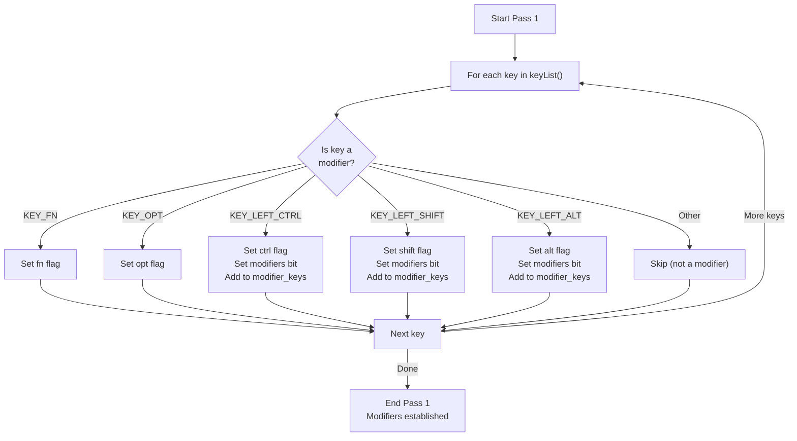
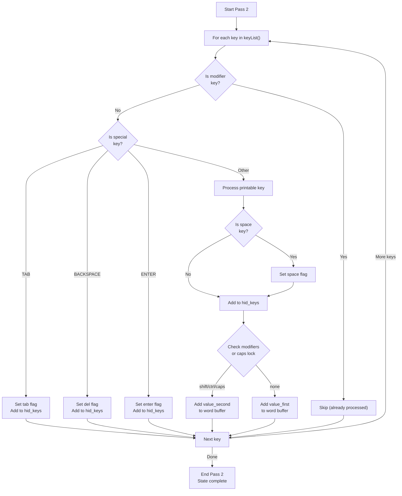
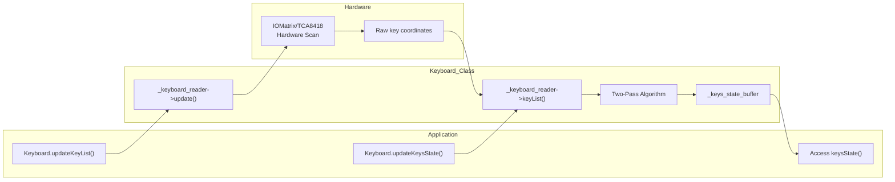

M5Cardputer Key State and Events

# Key State and Events

<details>
<summary>Relevant source files</summary>

The following files were used as context for generating this wiki page:

- [src/utility/Adafruit_TCA8418/Adafruit_TCA8418_registers.h](src/utility/Adafruit_TCA8418/Adafruit_TCA8418_registers.h)
- [src/utility/Keyboard/Keyboard.cpp](src/utility/Keyboard/Keyboard.cpp)
- [src/utility/Keyboard/Keyboard.h](src/utility/Keyboard/Keyboard.h)
- [src/utility/Keyboard/Keyboard_def.h](src/utility/Keyboard/Keyboard_def.h)

</details>


## Purpose and Scope

This page documents the keyboard state management system, focusing on the `KeysState` structure, modifier key handling, HID key codes, and the two-pass state update algorithm that processes physical key events into usable application state.

For information about key mapping and character translation, see [Key Mapping and Character Translation](#4.3). For the hardware-level keyboard scanning, see [Hardware Abstraction Layer](#4.4).

---

## The KeysState Structure

The `KeysState` structure aggregates all keyboard state information into a single, queryable object. It provides multiple representations of the current key state to support different application needs.

### Structure Definition

```cpp
struct KeysState {
    bool tab;
    bool fn;
    bool shift;
    bool ctrl;
    bool opt;
    bool alt;
    bool del;
    bool enter;
    bool space;
    uint8_t modifiers;
    
    std::vector<char> word;
    std::vector<uint8_t> hid_keys;
    std::vector<uint8_t> modifier_keys;
    
    void reset();
};
```

**Sources:** [src/utility/Keyboard/Keyboard.h:77-109]()

### Field Descriptions

| Field | Type | Purpose |
|-------|------|---------|
| `tab` | `bool` | True if Tab key is pressed |
| `fn` | `bool` | True if Fn (Function) key is pressed |
| `shift` | `bool` | True if Shift key is pressed |
| `ctrl` | `bool` | True if Ctrl key is pressed |
| `opt` | `bool` | True if Opt (Option) key is pressed |
| `alt` | `bool` | True if Alt key is pressed |
| `del` | `bool` | True if Backspace/Delete key is pressed |
| `enter` | `bool` | True if Enter key is pressed |
| `space` | `bool` | True if Space key is pressed |
| `modifiers` | `uint8_t` | Bitmask of active modifier keys for USB HID |
| `word` | `std::vector<char>` | Character buffer of printable keys pressed |
| `hid_keys` | `std::vector<uint8_t>` | USB HID key codes for all non-modifier keys |
| `modifier_keys` | `std::vector<uint8_t>` | USB HID codes of active modifier keys |

The `reset()` method clears all flags, sets `modifiers` to 0, and empties all vectors. This is called at the start of each state update cycle.

**Sources:** [src/utility/Keyboard/Keyboard.h:77-109]()

---

## Modifier Keys

Modifier keys are special keys that change the behavior of other keys but typically don't produce characters themselves. The keyboard system recognizes five modifier keys:

### Standard USB HID Modifiers

| Modifier | Key Code Constant | HID Value | Bitmask Position |
|----------|-------------------|-----------|------------------|
| Left Ctrl | `KEY_LEFT_CTRL` | `0x80` | Bit 0 |
| Left Shift | `KEY_LEFT_SHIFT` | `0x81` | Bit 1 |
| Left Alt | `KEY_LEFT_ALT` | `0x82` | Bit 2 |

These modifiers follow the USB HID specification and set corresponding bits in the `modifiers` bitmask field using the formula: `(1 << (key_code - 0x80))`.

### Non-Standard Modifiers

| Modifier | Key Code Constant | HID Value | Purpose |
|----------|-------------------|-----------|---------|
| Fn (Function) | `KEY_FN` | `0xff` | Device-specific function layer access |
| Opt (Option) | `KEY_OPT` | `0x00` | Device-specific option key |

The `KEY_FN` and `KEY_OPT` keys set boolean flags but do not contribute to the USB HID `modifiers` bitmask, as they are not standard USB modifiers.

**Sources:** [src/utility/Keyboard/Keyboard_def.h:11-18](), [src/utility/Keyboard/Keyboard.cpp:116-145]()

---

## HID Key Codes

The keyboard system maintains a mapping from ASCII characters to USB HID key codes to support USB keyboard emulation and standardized key reporting.

### The ASCII-to-HID Map

The `_kb_asciimap` array provides a lookup table from ASCII values (0-127) to USB HID usage codes. The mapping includes a `SHIFT` flag (0x80) that indicates whether the Shift modifier is required to produce that character.

```cpp
#define SHIFT 0x80

const uint8_t _kb_asciimap[128] = {
    // Control characters map to 0x00 (except special keys)
    KEY_BACKSPACE,  // 0x08 -> 0x2a
    KEY_TAB,        // 0x09 -> 0x2b
    KEY_ENTER,      // 0x0a -> 0x28
    
    // Printable characters
    0x2c,           // ' ' (space)
    0x1e | SHIFT,   // '!' (requires Shift)
    0x04,           // 'a'
    0x04 | SHIFT,   // 'A' (requires Shift)
    // ... and so on
};
```

### HID Code Extraction

During state processing, the system extracts HID codes using:

```cpp
const uint8_t hid_key = _kb_asciimap[key_code];
```

The base HID code (without the SHIFT bit) is added to the `hid_keys` vector for each pressed key.

**Sources:** [src/utility/Keyboard/Keyboard_def.h:11-154](), [src/utility/Keyboard/Keyboard.cpp:195-198]()

---

## The Two-Pass State Update Algorithm

The `updateKeysState()` method implements a two-pass algorithm to ensure deterministic key processing regardless of the order in which keys appear in the hardware scan list.

### Why Two Passes Are Required

When multiple keys are pressed simultaneously, the hardware may report them in any order. If a letter key is processed before detecting the Shift key, the wrong character would be generated. The two-pass approach solves this by:

1. **Pass 1:** Identify all modifier keys to establish the modifier context
2. **Pass 2:** Process all other keys using the established modifier context

### Pass 1: Modifier Identification

Pass 1 iterates through all pressed keys and identifies modifiers, setting flags and building the modifier state:



**Diagram: Pass 1 - Modifier Key Identification**

**Sources:** [src/utility/Keyboard/Keyboard.cpp:112-145]()

### Pass 2: Character and Key Processing

Pass 2 processes all non-modifier keys, using the modifier state established in Pass 1:



**Diagram: Pass 2 - Character and Key Processing**

**Sources:** [src/utility/Keyboard/Keyboard.cpp:147-210]()

### State Update Implementation Details

The `updateKeysState()` method performs the following sequence:

1. **Initialization:** Reset the `_keys_state_buffer` and clear internal tracking vectors
2. **Pre-allocation:** Reserve space in vectors to avoid reallocation during processing
3. **Pass 1:** Scan for modifiers (lines 116-145)
4. **Pass 2:** Process remaining keys with known modifier context (lines 151-209)

Character selection during Pass 2 uses the modifier state:

```cpp
if (_keys_state_buffer.ctrl || _keys_state_buffer.shift || _is_caps_locked) {
    _keys_state_buffer.word.push_back(key_value.value_second);
} else {
    _keys_state_buffer.word.push_back(key_value.value_first);
}
```

**Sources:** [src/utility/Keyboard/Keyboard.cpp:90-211]()

---

## State Update Process Flow

The complete key state update process involves coordination between the hardware reader and the state processing system:



**Diagram: Key State Update Flow from Hardware to Application**

### Update Sequence

1. **Hardware Update:** `updateKeyList()` calls `_keyboard_reader->update()` to scan hardware
2. **Coordinate Collection:** Hardware reader populates its internal key list with coordinates
3. **State Processing:** `updateKeysState()` reads coordinates via `keyList()` and executes the two-pass algorithm
4. **Application Access:** Applications query state via `keysState()` accessor

**Sources:** [src/utility/Keyboard/Keyboard.cpp:54-59](), [src/utility/Keyboard/Keyboard.cpp:90-211](), [src/utility/Keyboard/Keyboard.h:119-127](), [src/utility/Keyboard/Keyboard.h:139-142]()

---

## Querying Key State

The `Keyboard_Class` provides multiple methods for applications to query keyboard state:

### Direct State Access

```cpp
KeysState& keysState();
```

Returns a reference to the current `_keys_state_buffer`, allowing access to all state fields:

```cpp
auto& state = Cardputer.Keyboard.keysState();
if (state.shift) { /* ... */ }
if (state.word.size() > 0) {
    char c = state.word[0];
}
```

**Sources:** [src/utility/Keyboard/Keyboard.h:139-142]()

### Change Detection

```cpp
bool isChange();
```

Detects when the number of pressed keys changes by comparing the current key list size to the previous size stored in `_last_key_size`. Returns `true` if the count differs.

**Sources:** [src/utility/Keyboard/Keyboard.cpp:66-75]()

### Press Detection

```cpp
uint8_t isPressed();
```

Returns the number of currently pressed keys (size of the key list).

```cpp
bool isKeyPressed(char c);
```

Checks if a specific character is currently pressed by iterating through the key list and checking if any key generates the specified character.

**Sources:** [src/utility/Keyboard/Keyboard.cpp:61-64](), [src/utility/Keyboard/Keyboard.cpp:77-86]()

### Key Coordinate to Character Translation

```cpp
uint8_t getKey(Point2D_t keyCoor);
```

Translates a key coordinate to its current character value, respecting modifier state:

- Returns `value_second` if Ctrl, Shift, or Caps Lock is active
- Returns `value_first` otherwise

**Sources:** [src/utility/Keyboard/Keyboard.cpp:39-52]()

---

## State Query Patterns

### Example: Text Input Processing

```cpp
Cardputer.Keyboard.updateKeyList();
if (Cardputer.Keyboard.isChange()) {
    Cardputer.Keyboard.updateKeysState();
    auto& state = Cardputer.Keyboard.keysState();
    
    for (char c : state.word) {
        // Process each character
        buffer += c;
    }
    
    if (state.del) {
        // Handle backspace
        if (buffer.length() > 0) {
            buffer.pop_back();
        }
    }
    
    if (state.enter) {
        // Process completed input
        processCommand(buffer);
        buffer.clear();
    }
}
```

### Example: Modifier-Aware Input

```cpp
Cardputer.Keyboard.updateKeyList();
Cardputer.Keyboard.updateKeysState();
auto& state = Cardputer.Keyboard.keysState();

if (state.ctrl && state.word.size() > 0) {
    char c = state.word[0];
    if (c == 'c' || c == 'C') {
        // Handle Ctrl+C
        handleCopy();
    }
}
```

### Example: HID Keyboard Emulation

```cpp
Cardputer.Keyboard.updateKeyList();
Cardputer.Keyboard.updateKeysState();
auto& state = Cardputer.Keyboard.keysState();

// Send USB HID report
uint8_t report[8];
report[0] = state.modifiers;  // Modifier byte
report[1] = 0;                // Reserved
for (int i = 0; i < 6; i++) {
    report[2 + i] = (i < state.hid_keys.size()) ? state.hid_keys[i] : 0;
}
sendHIDReport(report);
```

**Sources:** [src/utility/Keyboard/Keyboard.h:77-109](), [src/utility/Keyboard/Keyboard.cpp:90-211]()

---

## Key State Data Structures

The keyboard system maintains several internal vectors to track different categories of keys:

| Vector | Type | Purpose |
|--------|------|---------|
| `_key_pos_print_keys` | `std::vector<Point2D_t>` | Coordinates of printable character keys (A, B, C, etc.) |
| `_key_pos_hid_keys` | `std::vector<Point2D_t>` | Coordinates of keys that produce HID codes (printable + space, enter, del) |
| `_key_pos_modifier_keys` | `std::vector<Point2D_t>` | Coordinates of USB HID modifier keys (shift, ctrl, alt) |

These vectors are populated during the two-pass algorithm and serve different tracking purposes:

- **Print keys:** Used for text generation and display
- **HID keys:** Used for USB keyboard emulation
- **Modifier keys:** Used for specialized modifier handling

**Sources:** [src/utility/Keyboard/Keyboard.h:155-157](), [src/utility/Keyboard/Keyboard.cpp:95-97]()

---

## Caps Lock Handling

Caps Lock is managed as a persistent state flag `_is_caps_locked` that toggles character case selection:

```cpp
bool capslocked();
void setCapsLocked(bool isLocked);
```

When Caps Lock is active, character selection in `getKey()` and `updateKeysState()` treats it equivalently to holding Shift or Ctrl, selecting `value_second` from the key value map.

**Sources:** [src/utility/Keyboard/Keyboard.h:144-151](), [src/utility/Keyboard/Keyboard.cpp:46-50](), [src/utility/Keyboard/Keyboard.cpp:202-208]()

---

## Performance Considerations

The state update system implements several optimizations:

1. **Vector Pre-allocation:** Reserves capacity for vectors at the start of `updateKeysState()` to minimize reallocations (lines 103-110)
2. **Single Pass Reads:** Each key coordinate is read from the hardware reader only once per cycle
3. **Early Continues:** Modifier keys skip further processing in Pass 2 using `continue` statements
4. **Reference Access:** The `keysState()` method returns a reference, avoiding copies

**Sources:** [src/utility/Keyboard/Keyboard.cpp:102-110](), [src/utility/Keyboard/Keyboard.h:139-142]()