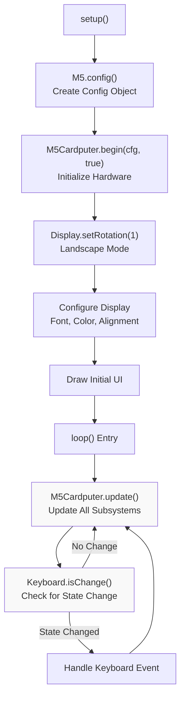
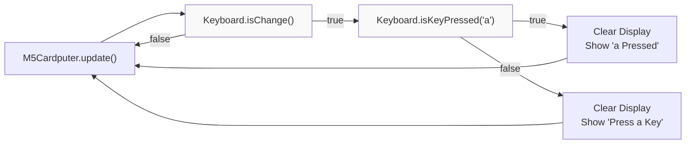
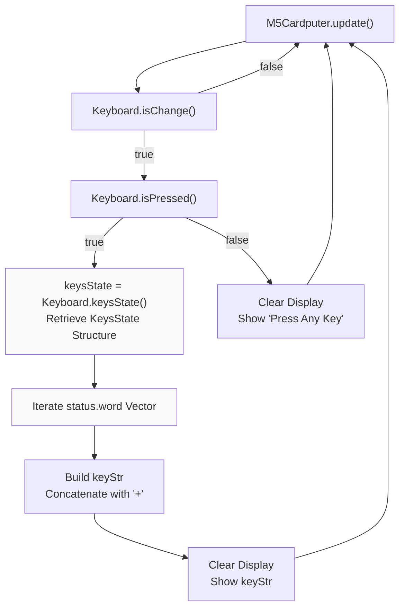
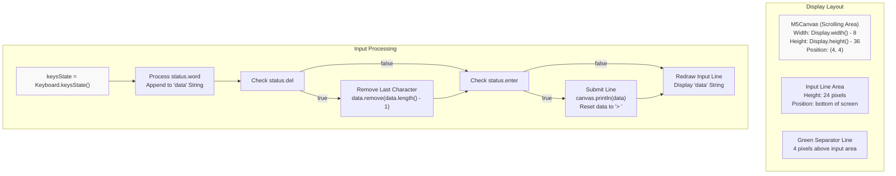
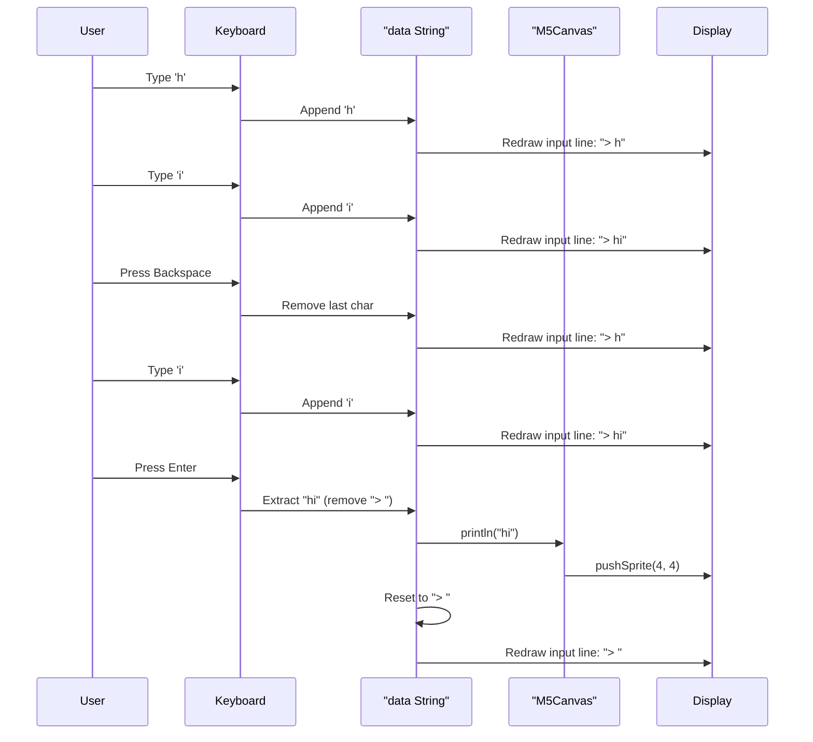
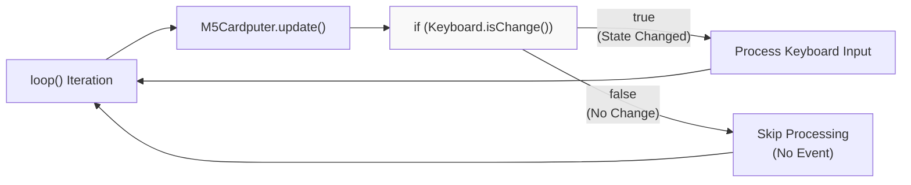
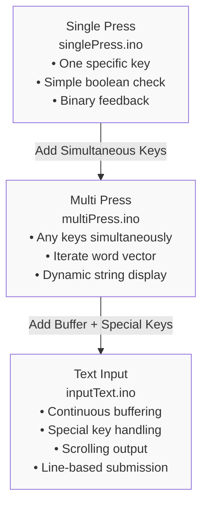

M5Cardputer Keyboard Input Examples

# Keyboard Input Examples

<details>
<summary>Relevant source files</summary>

The following files were used as context for generating this wiki page:

- [examples/Basic/ir_nec/ir_nec.ino](examples/Basic/ir_nec/ir_nec.ino)
- [examples/Basic/keyboard/inputText/inputText.ino](examples/Basic/keyboard/inputText/inputText.ino)
- [examples/Basic/keyboard/multiPress/multiPress.ino](examples/Basic/keyboard/multiPress/multiPress.ino)
- [examples/Basic/keyboard/singlePress/singlePress.ino](examples/Basic/keyboard/singlePress/singlePress.ino)

</details>


This page catalogs the keyboard input examples included with the M5Cardputer library, demonstrating progressively complex patterns for handling keyboard input. These examples illustrate three fundamental input scenarios: single key detection, simultaneous multi-key handling, and continuous text input with display buffering.

For comprehensive documentation of the keyboard subsystem architecture, see [Keyboard System](#4). For API reference details on keyboard state queries and processing methods, see [Keyboard_Class API](#4.1). For information on the REPL example which demonstrates advanced keyboard integration, see [REPL Application](#9.1).

## Example Overview

The M5Cardputer library includes three keyboard examples in the `examples/Basic/keyboard/` directory, each demonstrating a specific input pattern:

| Example | File | Primary Purpose | Keyboard API Features |
|---------|------|-----------------|----------------------|
| Single Press | `singlePress.ino` | Detect individual key presses | `isChange()`, `isKeyPressed(char)` |
| Multi Press | `multiPress.ino` | Handle simultaneous key presses | `keysState()`, `KeysState::word` vector |
| Input Text | `inputText.ino` | Continuous text input with buffering | `keysState()`, special keys (`del`, `enter`) |

All three examples follow the same initialization and update pattern but differ in their keyboard event handling logic.

**Sources:** [examples/Basic/keyboard/singlePress/singlePress.ino:1-47](), [examples/Basic/keyboard/multiPress/multiPress.ino:1-57](), [examples/Basic/keyboard/inputText/inputText.ino:1-74]()

## Common Initialization Pattern

All keyboard examples share a consistent setup sequence that initializes the M5Cardputer hardware and configures the display:



**Initialization Sequence:**

1. **Configuration Creation** - `M5.config()` returns a configuration object with default settings
2. **Hardware Initialization** - `M5Cardputer.begin(cfg, true)` initializes all hardware with display enabled
3. **Display Configuration** - `setRotation(1)` sets landscape mode; text properties are configured
4. **Main Loop** - `M5Cardputer.update()` must be called each iteration to refresh keyboard state

The second parameter to `begin()` controls whether the display is initialized. All keyboard examples pass `true` to enable the display for visual feedback.

**Sources:** [examples/Basic/keyboard/singlePress/singlePress.ino:18-29](), [examples/Basic/keyboard/multiPress/multiPress.ino:18-29](), [examples/Basic/keyboard/inputText/inputText.ino:22-42]()

## Single Key Detection Pattern

The `singlePress.ino` example demonstrates the simplest keyboard input pattern: detecting when a specific key is pressed. This example checks for the 'a' key and provides immediate visual feedback.



### Key API Methods

The single press example uses two primary `Keyboard_Class` methods:

| Method | Return Type | Purpose |
|--------|------------|---------|
| `isChange()` | `bool` | Returns `true` if keyboard state changed since last `update()` |
| `isKeyPressed(char)` | `bool` | Returns `true` if the specified character key is currently pressed |

### Implementation Details

The loop in [examples/Basic/keyboard/singlePress/singlePress.ino:31-46]() follows this logic:

1. **State Change Detection** - `isChange()` is checked first to avoid unnecessary processing when no keys have been pressed or released
2. **Specific Key Query** - `isKeyPressed('a')` checks if the 'a' key is currently in the pressed state
3. **Display Update** - The screen is cleared and redrawn with appropriate feedback text

This pattern is efficient for applications that need to respond to specific control keys without processing the full keyboard state. The `isKeyPressed()` method works with any printable character from the keyboard's character map.

**Sources:** [examples/Basic/keyboard/singlePress/singlePress.ino:31-46]()

## Multi-Key Detection Pattern

The `multiPress.ino` example demonstrates handling simultaneous key presses, displaying all currently pressed keys as a concatenated string (e.g., "a+s+d"). This pattern supports up to three simultaneous key presses on standard M5Cardputer hardware.



### KeysState Structure Usage

The multi-press example retrieves the full keyboard state using `keysState()`, which returns a `Keyboard_Class::KeysState` structure. This structure contains multiple representations of the current keyboard state:

| Member | Type | Contents in Multi-Press Example |
|--------|------|--------------------------------|
| `word` | `std::vector<char>` | All currently pressed character keys |
| Modifier flags | `bool` | Not used in this example (see Text Input Pattern) |
| HID key codes | Various | Not used in this example |

### String Building Logic

The string concatenation logic in [examples/Basic/keyboard/multiPress/multiPress.ino:36-44]() demonstrates proper handling of the `word` vector:

```
For each character 'i' in status.word:
    If keyStr is not empty:
        Append "+" then append 'i'
    Else:
        Append 'i' directly
```

This produces output like:
- Single key: `"a"`
- Two keys: `"a+s"`
- Three keys: `"a+s+d"`

The order of characters in the `word` vector depends on the keyboard scanning order and does not necessarily match the physical key press sequence.

**Sources:** [examples/Basic/keyboard/multiPress/multiPress.ino:31-56]()

## Text Input Pattern

The `inputText.ino` example demonstrates a complete text input system with continuous character buffering, backspace handling, and line submission. This pattern uses an M5Canvas sprite for scrolling output and a fixed input area at the bottom of the display.



### Display Architecture

The text input example uses a two-layer display architecture:

1. **Scrolling Canvas** - An `M5Canvas` sprite ([examples/Basic/keyboard/inputText/inputText.ino:19]()) handles the output history with automatic text scrolling enabled via `setTextScroll(true)` ([examples/Basic/keyboard/inputText/inputText.ino:38]())
2. **Input Line** - A fixed region at the bottom displays the current input buffer prefixed with "> "

The canvas is created with dimensions `Display.width() - 8` by `Display.height() - 36` to leave margins and space for the input area ([examples/Basic/keyboard/inputText/inputText.ino:36-37]()).

### Special Key Handling

The text input pattern processes three types of input from the `KeysState` structure:

| KeysState Member | Type | Handling Logic | Code Reference |
|------------------|------|----------------|----------------|
| `word` | `std::vector<char>` | Each character appended to `data` string | [inputText.ino:50-52]() |
| `del` | `bool` | Removes last character if `true` | [inputText.ino:54-56]() |
| `enter` | `bool` | Submits line to canvas, resets buffer | [inputText.ino:58-63]() |

### Buffer Management Flow



### Input Line Update Process

The input line update logic ([examples/Basic/keyboard/inputText/inputText.ino:65-70]()) follows this sequence:

1. **Clear Input Area** - `fillRect()` clears the bottom 28 pixels with BLACK
2. **Redraw Current Buffer** - `drawString()` renders the current `data` string at position (4, Display.height() - 24)

This redraw-on-change approach ensures the display always reflects the current buffer state without flickering.

**Sources:** [examples/Basic/keyboard/inputText/inputText.ino:19-74]()

## Common Patterns and Best Practices

### Event-Driven Processing

All three examples follow an event-driven pattern using `isChange()` as a gate:



This pattern avoids unnecessary processing when the keyboard state is unchanged. The `isChange()` method returns `true` whenever keys are pressed or released since the last `update()` call.

### Display Update Strategy

Two display update strategies are demonstrated:

| Strategy | Used By | Approach | Trade-offs |
|----------|---------|----------|------------|
| Full Clear/Redraw | singlePress, multiPress | Clear entire display, redraw content | Simple but causes brief flicker |
| Partial Update | inputText | Clear only changed regions, redraw selectively | More efficient, no flicker |

The input text example ([examples/Basic/keyboard/inputText/inputText.ino:65-70]()) uses targeted `fillRect()` to clear only the input line area, minimizing visual artifacts.

### Progressive Complexity

The three examples demonstrate increasing complexity:



Developers should start with the single press example to understand basic keyboard integration, then progress to multi-press for understanding state structures, and finally study the text input example for complete text handling patterns.

**Sources:** [examples/Basic/keyboard/singlePress/singlePress.ino:31-46](), [examples/Basic/keyboard/multiPress/multiPress.ino:31-56](), [examples/Basic/keyboard/inputText/inputText.ino:44-73]()

## API Method Comparison

The following table summarizes the keyboard API methods used across all examples:

| Method | Return Type | Single Press | Multi Press | Text Input | Purpose |
|--------|-------------|--------------|-------------|------------|---------|
| `isChange()` | `bool` | ✓ | ✓ | ✓ | Detect any keyboard state change |
| `isPressed()` | `bool` | - | ✓ | ✓ | Check if any key is currently pressed |
| `isKeyPressed(char)` | `bool` | ✓ | - | - | Check if specific character key is pressed |
| `keysState()` | `KeysState` | - | ✓ | ✓ | Retrieve full keyboard state structure |

The progression shows increasing reliance on the `KeysState` structure for more complex input scenarios. While `isKeyPressed(char)` is sufficient for simple control schemes, applications requiring multi-key input or text entry must use `keysState()` to access the `word` vector and special key flags.

**Sources:** [examples/Basic/keyboard/singlePress/singlePress.ino:33-34](), [examples/Basic/keyboard/multiPress/multiPress.ino:34-36](), [examples/Basic/keyboard/inputText/inputText.ino:46-48]()

## Integration Notes

### Hardware Compatibility

All keyboard examples work identically on both M5Cardputer and M5Cardputer-ADV hardware variants. The hardware abstraction layer (see [Hardware Abstraction Layer](#4.4)) ensures the same API behavior regardless of the underlying keyboard implementation (GPIO matrix or TCA8418 I2C controller).

### Update Frequency Requirements

The `M5Cardputer.update()` call frequency directly impacts keyboard responsiveness. All examples call `update()` once per loop iteration without delay, ensuring immediate response to key presses. Applications that introduce delays between `update()` calls may miss brief key presses or experience sluggish input response.

### Character Set Limitations

The keyboard examples work with the character set defined in the keyboard's `_key_value_map` array (see [Key Mapping and Character Translation](#4.3)). This includes:
- Lowercase letters (a-z)
- Uppercase letters (A-Z when Shift or Caps Lock is active)
- Numbers (0-9)
- Common symbols (., ', ;, /, etc.)
- Special characters accessible via modifier keys

Multi-byte or Unicode characters are not supported through the standard keyboard input methods.

**Sources:** [examples/Basic/keyboard/singlePress/singlePress.ino:1-47](), [examples/Basic/keyboard/multiPress/multiPress.ino:1-57](), [examples/Basic/keyboard/inputText/inputText.ino:1-74]()