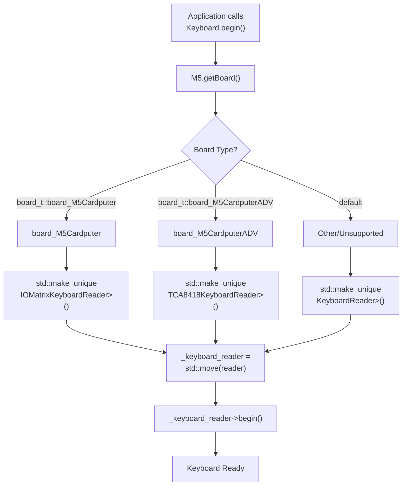
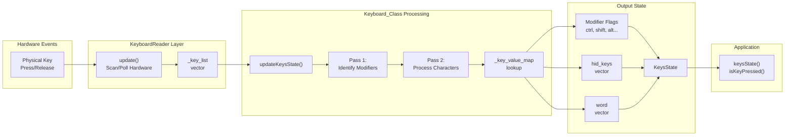
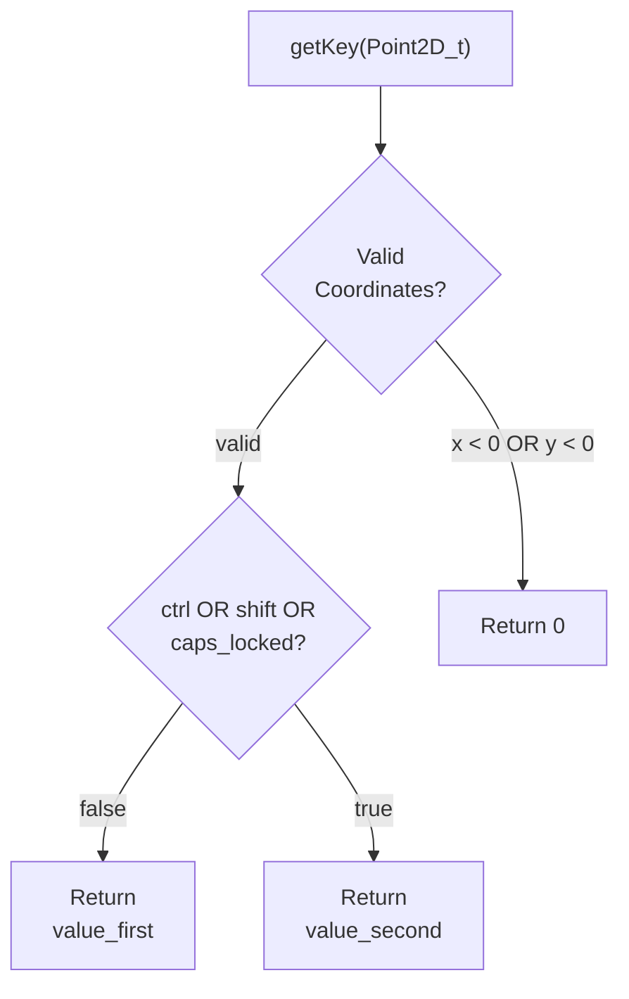
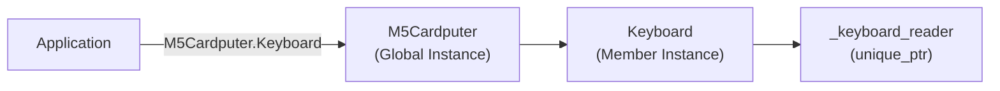

M5Cardputer Keyboard System

# Keyboard System

<details>
<summary>Relevant source files</summary>

The following files were used as context for generating this wiki page:

- [src/utility/Keyboard/Keyboard.cpp](src/utility/Keyboard/Keyboard.cpp)
- [src/utility/Keyboard/Keyboard.h](src/utility/Keyboard/Keyboard.h)
- [src/utility/Keyboard/KeyboardReader/KeyboardReader.h](src/utility/Keyboard/KeyboardReader/KeyboardReader.h)

</details>


## Purpose and Scope

The keyboard system provides a unified API for reading keyboard input from M5Cardputer hardware variants while abstracting away hardware-specific implementation details. This system implements a three-layer architecture consisting of the high-level `Keyboard_Class` API, an abstract `KeyboardReader` interface, and concrete hardware implementations for both the standard M5Cardputer (GPIO matrix) and M5Cardputer-ADV (TCA8418 I2C controller).

This page provides a high-level overview of the keyboard subsystem architecture and the relationships between its components. For detailed information about specific aspects:
- **API reference and methods**: See [Keyboard_Class API](#4.1)
- **Key state management and events**: See [Key State and Events](#4.2)
- **Character mapping logic**: See [Key Mapping and Character Translation](#4.3)
- **Hardware abstraction details**: See [Hardware Abstraction Layer](#4.4)
- **GPIO implementation**: See [IOMatrix Implementation](#4.5)
- **I2C implementation**: See [TCA8418 Implementation](#4.6)

## System Architecture

The keyboard system uses a layered architecture with clear separation between application interface, hardware abstraction, and hardware-specific implementations.

### Three-Layer Design

```mermaid
graph TB
    subgraph "Application Layer"
        APP["Application Code"]
    end
    
    subgraph "High-Level API Layer"
        KBCLASS["Keyboard_Class<br/>(Keyboard.h/cpp)"]
        
        subgraph "State Management"
            KEYSTATE["KeysState<br/>Structure"]
            KEYMAP["_key_value_map<br/>[4][14] Array"]
        end
        
        subgraph "Processing Logic"
            UPDATE["updateKeysState()"]
            GETKEY["getKey()"]
            ISPRESS["isKeyPressed()"]
        end
    end
    
    subgraph "Hardware Abstraction Layer"
        READER["KeyboardReader<br/>(Abstract Interface)"]
        BEGIN["begin()"]
        UPDT["update()"]
        KEYLIST["keyList()"]
    end
    
    subgraph "Hardware Implementation Layer"
        IOMATRIX["IOMatrixKeyboardReader<br/>(GPIO Scanning)"]
        TCA8418["TCA8418KeyboardReader<br/>(I2C Controller)"]
    end
    
    subgraph "Hardware"
        GPIO["GPIO Matrix<br/>3 out + 7 in pins"]
        I2C["TCA8418 Chip<br/>I2C 0x34"]
    end
    
    APP --> KBCLASS
    
    KBCLASS --> UPDATE
    KBCLASS --> GETKEY
    KBCLASS --> ISPRESS
    KBCLASS --> KEYSTATE
    KBCLASS --> KEYMAP
    
    KBCLASS -.->|"owns unique_ptr"| READER
    
    READER <|--|"implements"| IOMATRIX
    READER <|--|"implements"| TCA8418
    
    READER --> BEGIN
    READER --> UPDT
    READER --> KEYLIST
    
    IOMATRIX --> GPIO
    TCA8418 --> I2C
```

**Sources:** [src/utility/Keyboard/Keyboard.h](), [src/utility/Keyboard/Keyboard.cpp](), [src/utility/Keyboard/KeyboardReader/KeyboardReader.h]()

The `Keyboard_Class` maintains ownership of a `KeyboardReader` implementation through a `std::unique_ptr<KeyboardReader>` stored in the `_keyboard_reader` member [src/utility/Keyboard/Keyboard.h:154](). This enables runtime polymorphism without virtual function overhead for applications, as the concrete type is determined during initialization.

### Component Responsibilities

| Component | Responsibility | Location |
|-----------|---------------|----------|
| `Keyboard_Class` | High-level API, key mapping, state aggregation, modifier handling | [src/utility/Keyboard/Keyboard.h:75-161]() |
| `KeyboardReader` | Abstract interface defining hardware reader contract | [src/utility/Keyboard/KeyboardReader/KeyboardReader.h:22-51]() |
| `IOMatrixKeyboardReader` | GPIO matrix scanning for standard M5Cardputer | Referenced in [src/utility/Keyboard/Keyboard.cpp:22]() |
| `TCA8418KeyboardReader` | I2C communication for M5Cardputer-ADV | Referenced in [src/utility/Keyboard/Keyboard.cpp:24]() |
| `KeysState` | Structured representation of current keyboard state | [src/utility/Keyboard/Keyboard.h:77-109]() |
| `_key_value_map` | Static mapping of key coordinates to character values | [src/utility/Keyboard/Keyboard.h:18-73]() |

**Sources:** [src/utility/Keyboard/Keyboard.h](), [src/utility/Keyboard/Keyboard.cpp]()

## Hardware Variant Support

The keyboard system automatically selects the appropriate hardware implementation at initialization based on board detection. This factory pattern ensures the same application code runs on both hardware variants without modification.

### Board Detection and Reader Instantiation



**Sources:** [src/utility/Keyboard/Keyboard.cpp:15-31]()

The initialization sequence in `Keyboard_Class::begin()` [src/utility/Keyboard/Keyboard.cpp:15-31]() performs the following steps:

1. **Board Detection**: Calls `M5.getBoard()` to determine hardware variant [src/utility/Keyboard/Keyboard.cpp:17]()
2. **Reader Reset**: Clears any existing reader with `_keyboard_reader.reset()` [src/utility/Keyboard/Keyboard.cpp:18]()
3. **Reader Creation**: Instantiates the appropriate concrete reader based on board type [src/utility/Keyboard/Keyboard.cpp:21-28]()
4. **Reader Initialization**: Calls `_keyboard_reader->begin()` to initialize hardware [src/utility/Keyboard/Keyboard.cpp:30]()

An alternative initialization method `begin(std::unique_ptr<KeyboardReader> reader)` [src/utility/Keyboard/Keyboard.cpp:33-37]() allows dependency injection for testing or custom hardware implementations.

## Key Processing Pipeline

The keyboard system processes hardware events through a multi-stage pipeline that converts raw physical key presses into structured application data.

### Data Flow Overview



**Sources:** [src/utility/Keyboard/Keyboard.cpp:54-210](), [src/utility/Keyboard/KeyboardReader/KeyboardReader.h:36-47]()

### Key Coordinate System

The keyboard uses a 2D coordinate system where each key is identified by its `(x, y)` position. The `Point2D_t` structure [src/utility/Keyboard/KeyboardReader/KeyboardReader.h:9-17]() represents these coordinates:

```cpp
struct Point2D_t {
    int x = 0;
    int y = 0;
};
```

The `_key_value_map` [src/utility/Keyboard/Keyboard.h:18-73]() is a 4×14 array that maps coordinates to character values. Each entry is a `KeyValue_t` structure containing:
- `value_first`: Primary character (lowercase, unshifted symbols)
- `value_second`: Secondary character (uppercase, shifted symbols)

### Two-Pass State Update Algorithm

The `updateKeysState()` method [src/utility/Keyboard/Keyboard.cpp:90-210]() implements a two-pass algorithm to ensure consistent modifier handling regardless of key scan order:

#### Pass 1: Modifier Identification

In the first pass [src/utility/Keyboard/Keyboard.cpp:116-145](), the system identifies all active modifier keys:

| Modifier Key | Flag Set | Action |
|--------------|----------|--------|
| `KEY_FN` | `_keys_state_buffer.fn = true` | Function key, device-specific features |
| `KEY_OPT` | `_keys_state_buffer.opt = true` | Option key, alternative functions |
| `KEY_LEFT_CTRL` | `_keys_state_buffer.ctrl = true` | Control modifier, adds to modifier bitmask |
| `KEY_LEFT_SHIFT` | `_keys_state_buffer.shift = true` | Shift modifier, affects character selection |
| `KEY_LEFT_ALT` | `_keys_state_buffer.alt = true` | Alt modifier, adds to modifier bitmask |

**Sources:** [src/utility/Keyboard/Keyboard.cpp:116-145]()

#### Pass 2: Character Processing

In the second pass [src/utility/Keyboard/Keyboard.cpp:151-209](), the system processes all non-modifier keys using the now-established modifier context:

1. **Skip Modifiers**: Modifier keys identified in Pass 1 are skipped [src/utility/Keyboard/Keyboard.cpp:158-165]()
2. **Handle Special Keys**: Process TAB, BACKSPACE, ENTER [src/utility/Keyboard/Keyboard.cpp:168-184]()
3. **Generate HID Codes**: Convert ASCII to HID key codes using `_kb_asciimap` [src/utility/Keyboard/Keyboard.cpp:195-198]()
4. **Apply Modifiers**: Select between `value_first` and `value_second` based on modifier state and Caps Lock [src/utility/Keyboard/Keyboard.cpp:202-208]()

**Sources:** [src/utility/Keyboard/Keyboard.cpp:151-209]()

### Character Selection Logic

The `getKey()` method [src/utility/Keyboard/Keyboard.cpp:39-52]() determines which character value to return based on the current modifier state:



**Sources:** [src/utility/Keyboard/Keyboard.cpp:39-52]()

This logic is applied during Pass 2 of state updates to populate the character buffer in the `KeysState` structure.

## Integration with M5Cardputer Core

The `Keyboard_Class` is instantiated as a member of the `M5_CARDPUTER` class and initialized during the core initialization sequence. Applications access the keyboard through the global `M5Cardputer` instance:



**Sources:** Referenced from M5Cardputer core architecture (see [M5Cardputer Core API](#3))

The keyboard is initialized when `M5Cardputer.begin()` is called, which in turn calls `Keyboard.begin()` to set up the appropriate hardware reader based on the detected board type.

## State Management

The `KeysState` structure [src/utility/Keyboard/Keyboard.h:77-109]() aggregates all keyboard state information in a single, easily queryable format:

| Member | Type | Purpose |
|--------|------|---------|
| `tab`, `fn`, `shift`, `ctrl`, `opt`, `alt` | `bool` | Individual modifier flags for quick checking |
| `del`, `enter`, `space` | `bool` | Special key states |
| `modifiers` | `uint8_t` | Bitmask of USB HID modifier keys |
| `word` | `std::vector<char>` | Character buffer for text input |
| `hid_keys` | `std::vector<uint8_t>` | USB HID key codes for keyboard emulation |
| `modifier_keys` | `std::vector<uint8_t>` | List of active modifier key codes |

**Sources:** [src/utility/Keyboard/Keyboard.h:77-109]()

Applications can access this state through the `keysState()` method [src/utility/Keyboard/Keyboard.h:139-142](), which returns a reference to the internal `_keys_state_buffer` member.

## Summary

The keyboard system achieves hardware abstraction through:

1. **Factory Pattern**: Runtime selection of hardware implementation based on board detection
2. **Strategy Pattern**: Polymorphic `KeyboardReader` interface enabling multiple implementations
3. **Two-Pass Processing**: Deterministic modifier handling independent of key scan order
4. **Unified State**: Single `KeysState` structure providing multiple output formats (flags, HID codes, characters)

This architecture enables the same application code to run on both M5Cardputer hardware variants while maintaining efficient, direct hardware access through zero-cost abstractions. The clear separation between layers facilitates testing, maintenance, and potential addition of future hardware variants.

**Sources:** [src/utility/Keyboard/Keyboard.cpp](), [src/utility/Keyboard/Keyboard.h](), [src/utility/Keyboard/KeyboardReader/KeyboardReader.h]()