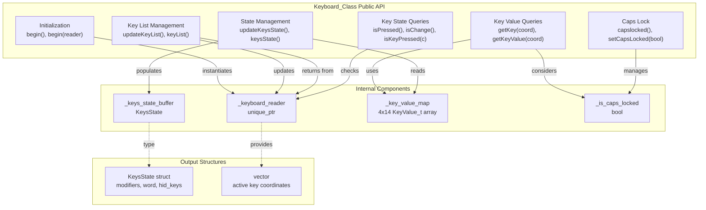
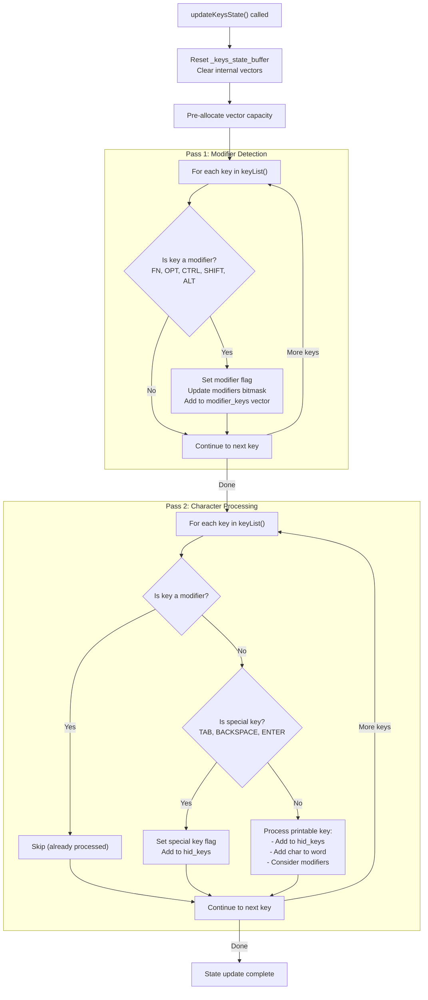
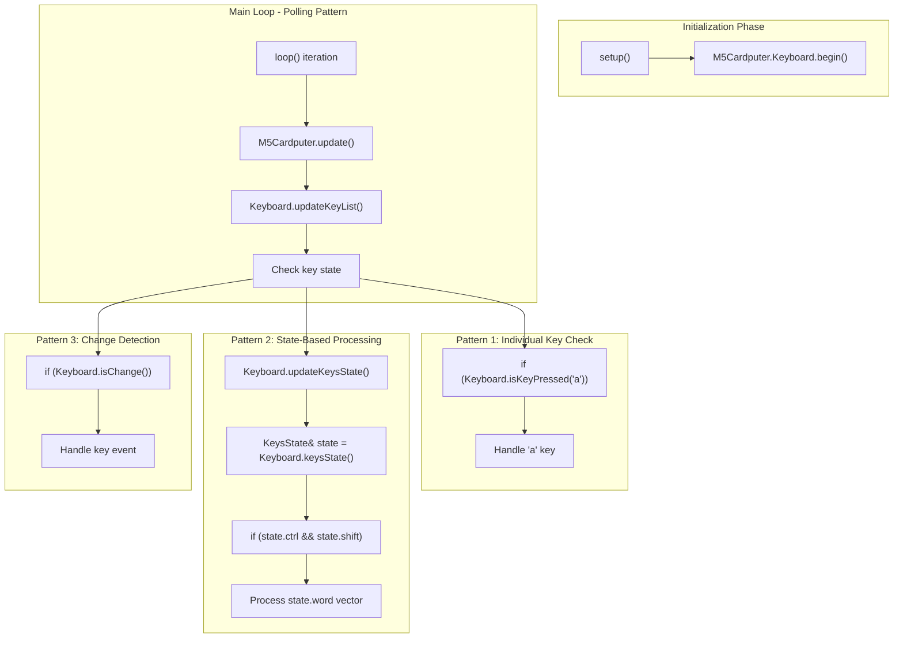

M5Cardputer Keyboard_Class API

# Keyboard_Class API

<details>
<summary>Relevant source files</summary>

The following files were used as context for generating this wiki page:

- [src/utility/Keyboard/Keyboard.cpp](src/utility/Keyboard/Keyboard.cpp)
- [src/utility/Keyboard/Keyboard.h](src/utility/Keyboard/Keyboard.h)

</details>


This document provides a complete API reference for the `Keyboard_Class`, the primary interface for keyboard input in the M5Cardputer library. It covers initialization, key state queries, and input processing methods.

For details on the `KeysState` structure, modifier key handling, and the two-pass state update algorithm, see [Key State and Events](#4.2). For information on key mapping and character translation, see [Key Mapping and Character Translation](#4.3). For the hardware abstraction layer details, see [Hardware Abstraction Layer](#4.4).

## Class Overview

The `Keyboard_Class` manages keyboard input by coordinating hardware abstraction, key state tracking, and character translation. It provides both low-level access to individual key states and high-level aggregated state information.



**Diagram: Keyboard_Class API Organization**

Sources: [src/utility/Keyboard/Keyboard.h:75-161](), [src/utility/Keyboard/Keyboard.cpp:15-211]()

## Initialization

The `Keyboard_Class` must be initialized before use. Two initialization methods are provided: automatic hardware detection and manual reader injection.

### Automatic Initialization

```cpp
void begin();
```

Automatically detects the hardware variant and instantiates the appropriate `KeyboardReader` implementation. Uses `M5.getBoard()` to determine board type and creates either an `IOMatrixKeyboardReader` (for `board_M5Cardputer`) or a `TCA8418KeyboardReader` (for `board_M5CardputerADV`).

**Implementation:** [src/utility/Keyboard/Keyboard.cpp:15-31]()

**Behavior:**
- Resets any existing keyboard reader
- Detects board type via `M5.getBoard()`
- Instantiates appropriate reader based on board type
- Falls back to base `KeyboardReader` for unsupported boards (logs error)
- Calls `begin()` on the instantiated reader

**Example Usage:**
```cpp
M5Cardputer.Keyboard.begin();  // Auto-detect and initialize
```

### Manual Reader Injection

```cpp
void begin(std::unique_ptr<KeyboardReader> reader);
```

Allows injection of a custom `KeyboardReader` implementation. This method is used for testing or custom hardware support.

**Parameters:**
- `reader`: Unique pointer to a `KeyboardReader` implementation (ownership transferred)

**Implementation:** [src/utility/Keyboard/Keyboard.cpp:33-37]()

Sources: [src/utility/Keyboard/Keyboard.h:115-116](), [src/utility/Keyboard/Keyboard.cpp:15-37]()

## Key List Management

The keyboard maintains a list of currently pressed key coordinates. These methods manage and access that list.

### updateKeyList()

```cpp
void updateKeyList();
```

Updates the internal key list by calling `update()` on the underlying `KeyboardReader`. This method should be called regularly (typically in the main loop) to poll for hardware changes.

**Implementation:** [src/utility/Keyboard/Keyboard.cpp:54-59]()

**Behavior:**
- Delegates to `_keyboard_reader->update()`
- No-op if reader is null
- Does not process or translate keys (see `updateKeysState()` for that)

### keyList()

```cpp
inline const std::vector<Point2D_t>& keyList();
```

Returns a const reference to the vector of currently pressed key coordinates. Each coordinate represents a physical key position in the matrix.

**Return Value:** Const reference to `std::vector<Point2D_t>` containing active key coordinates. Returns an empty static vector if no reader is initialized.

**Implementation:** [src/utility/Keyboard/Keyboard.h:120-127]()

**Point2D_t Structure:**
- `int x`: Column coordinate (0-13)
- `int y`: Row coordinate (0-3)

Sources: [src/utility/Keyboard/Keyboard.h:119-127](), [src/utility/Keyboard/Keyboard.cpp:54-59]()

## Key Value Queries

These methods translate key coordinates to character values.

### getKey()

```cpp
uint8_t getKey(Point2D_t keyCoor);
```

Returns the character value for a given key coordinate, considering current modifier state and Caps Lock.

**Parameters:**
- `keyCoor`: Key coordinate (x: 0-13, y: 0-3)

**Return Value:** ASCII character code, or 0 if coordinate is invalid

**Implementation:** [src/utility/Keyboard/Keyboard.cpp:39-52]()

**Character Selection Logic:**
1. Returns 0 for negative coordinates
2. If any of `ctrl`, `shift`, or Caps Lock is active, returns `value_second`
3. Otherwise returns `value_first`

**Example:**
```cpp
Point2D_t coord = {2, 1};  // 'w' key
uint8_t c = Keyboard.getKey(coord);  // Returns 'w' or 'W' depending on modifiers
```

### getKeyValue()

```cpp
inline KeyValue_t getKeyValue(const Point2D_t& keyCoor);
```

Returns the complete `KeyValue_t` structure for a key coordinate, providing both primary and shifted values without considering current modifier state.

**Parameters:**
- `keyCoor`: Key coordinate (x: 0-13, y: 0-3)

**Return Value:** `KeyValue_t` structure with `value_first` and `value_second` fields

**Implementation:** [src/utility/Keyboard/Keyboard.h:129-132]()

**KeyValue_t Structure:**
```cpp
struct KeyValue_t {
    const char value_first;   // Unshifted character
    const char value_second;  // Shifted character
};
```

Sources: [src/utility/Keyboard/Keyboard.h:13-16](), [src/utility/Keyboard/Keyboard.h:129-132](), [src/utility/Keyboard/Keyboard.cpp:39-52]()

## Key State Queries

These methods provide various ways to check keyboard state.

### isPressed()

```cpp
uint8_t isPressed();
```

Returns the number of currently pressed keys.

**Return Value:** Count of active keys in the key list

**Implementation:** [src/utility/Keyboard/Keyboard.cpp:61-64]()

**Usage:**
```cpp
if (M5Cardputer.Keyboard.isPressed()) {
    // At least one key is pressed
}
```

### isChange()

```cpp
bool isChange();
```

Detects changes in the number of pressed keys since the last call.

**Return Value:** `true` if the key count changed, `false` otherwise

**Implementation:** [src/utility/Keyboard/Keyboard.cpp:66-75]()

**Behavior:**
- Compares current key count with cached `_last_key_size`
- Updates `_last_key_size` when a change is detected
- Useful for edge-triggered key detection

### isKeyPressed()

```cpp
bool isKeyPressed(char c);
```

Checks if a specific character is currently pressed, considering modifiers.

**Parameters:**
- `c`: ASCII character to check

**Return Value:** `true` if the character is among the currently pressed keys, `false` otherwise

**Implementation:** [src/utility/Keyboard/Keyboard.cpp:77-86]()

**Behavior:**
- Iterates through all pressed keys
- Calls `getKey()` for each coordinate (applies modifiers)
- Returns true on first match

**Example:**
```cpp
if (M5Cardputer.Keyboard.isKeyPressed('a')) {
    // User is pressing the 'a' key (lowercase)
}
```

Sources: [src/utility/Keyboard/Keyboard.h:134-136](), [src/utility/Keyboard/Keyboard.cpp:61-86]()

## State Management

The keyboard class provides aggregated state information through the `KeysState` structure.

### updateKeysState()

```cpp
void updateKeysState();
```

Processes all currently pressed keys and populates the `_keys_state_buffer` with aggregated state information. This method implements a two-pass algorithm to ensure deterministic modifier handling.

**Implementation:** [src/utility/Keyboard/Keyboard.cpp:90-211]()

**Two-Pass Algorithm:**



**Diagram: updateKeysState() Two-Pass Processing**

**Pass 1 (Lines 116-145):**
- Identifies all modifier keys (FN, OPT, CTRL, SHIFT, ALT)
- Sets corresponding boolean flags in `KeysState`
- Updates `modifiers` bitmask for HID compliance
- Ensures modifier state is known before processing other keys

**Pass 2 (Lines 151-209):**
- Skips modifier keys (already processed)
- Handles special keys (TAB, BACKSPACE, ENTER)
- Processes printable keys with correct modifier context
- Populates `word`, `hid_keys`, and `modifier_keys` vectors

**Performance Optimizations:**
- Pre-allocates vector capacity to avoid reallocation ([src/utility/Keyboard/Keyboard.cpp:102-110]())
- Uses const references to avoid copies
- Reserves space based on key count

### keysState()

```cpp
inline KeysState& keysState();
```

Returns a reference to the current `KeysState` buffer. Must call `updateKeysState()` first to ensure data is current.

**Return Value:** Reference to the internal `KeysState` structure

**Implementation:** [src/utility/Keyboard/Keyboard.h:139-142]()

Sources: [src/utility/Keyboard/Keyboard.h:138-142](), [src/utility/Keyboard/Keyboard.cpp:90-211]()

## Caps Lock Management

The keyboard class maintains a Caps Lock state that affects character translation.

### capslocked()

```cpp
inline bool capslocked(void);
```

Returns the current Caps Lock state.

**Return Value:** `true` if Caps Lock is active, `false` otherwise

**Implementation:** [src/utility/Keyboard/Keyboard.h:144-147]()

### setCapsLocked()

```cpp
inline void setCapsLocked(bool isLocked);
```

Sets the Caps Lock state.

**Parameters:**
- `isLocked`: New Caps Lock state

**Implementation:** [src/utility/Keyboard/Keyboard.h:148-151]()

**Effect on Character Translation:**
- When Caps Lock is active, `getKey()` returns `value_second` characters
- Affects character selection in `updateKeysState()` ([src/utility/Keyboard/Keyboard.cpp:202-208]())

Sources: [src/utility/Keyboard/Keyboard.h:144-151](), [src/utility/Keyboard/Keyboard.cpp:46-50](), [src/utility/Keyboard/Keyboard.cpp:202-208]()

## KeysState Structure

The `KeysState` structure aggregates all keyboard state information. See [Key State and Events](#4.2) for detailed documentation.

### Structure Definition

```cpp
struct KeysState {
    // Individual key flags
    bool tab;          // TAB key pressed
    bool fn;           // FN key pressed
    bool shift;        // SHIFT key pressed
    bool ctrl;         // CTRL key pressed
    bool opt;          // OPT key pressed
    bool alt;          // ALT key pressed
    bool del;          // BACKSPACE key pressed
    bool enter;        // ENTER key pressed
    bool space;        // SPACE key pressed
    
    // Modifier bitmask (HID standard)
    uint8_t modifiers;
    
    // Key collections
    std::vector<char> word;                // Printable characters
    std::vector<uint8_t> hid_keys;         // HID key codes
    std::vector<uint8_t> modifier_keys;    // Modifier key codes
    
    void reset();  // Clears all state
};
```

**Definition:** [src/utility/Keyboard/Keyboard.h:77-109]()

### Member Variables

| Field | Type | Description |
|-------|------|-------------|
| `tab` | `bool` | True if TAB key is pressed |
| `fn` | `bool` | True if FN key is pressed |
| `shift` | `bool` | True if SHIFT key is pressed |
| `ctrl` | `bool` | True if CTRL key is pressed |
| `opt` | `bool` | True if OPT key is pressed |
| `alt` | `bool` | True if ALT key is pressed |
| `del` | `bool` | True if BACKSPACE key is pressed |
| `enter` | `bool` | True if ENTER key is pressed |
| `space` | `bool` | True if SPACE key is pressed |
| `modifiers` | `uint8_t` | Bitmask of active modifiers (HID format) |
| `word` | `std::vector<char>` | Printable characters from pressed keys |
| `hid_keys` | `std::vector<uint8_t>` | HID key codes for all non-modifier keys |
| `modifier_keys` | `std::vector<uint8_t>` | Key codes for active modifiers |

Sources: [src/utility/Keyboard/Keyboard.h:77-109]()

## Usage Patterns

The following diagram illustrates typical usage patterns for the `Keyboard_Class` API.



**Diagram: Common Keyboard API Usage Patterns**

### Pattern 1: Individual Key Polling

```cpp
void loop() {
    M5Cardputer.update();
    M5Cardputer.Keyboard.updateKeyList();
    
    if (M5Cardputer.Keyboard.isKeyPressed('a')) {
        Serial.println("'a' key pressed");
    }
}
```

### Pattern 2: Aggregated State Processing

```cpp
void loop() {
    M5Cardputer.update();
    M5Cardputer.Keyboard.updateKeyList();
    M5Cardputer.Keyboard.updateKeysState();
    
    auto& state = M5Cardputer.Keyboard.keysState();
    
    if (state.ctrl && state.word.size() > 0) {
        // Handle Ctrl+key combinations
        char c = state.word[0];
        Serial.printf("Ctrl+%c\n", c);
    }
}
```

### Pattern 3: Edge-Triggered Events

```cpp
void loop() {
    M5Cardputer.update();
    M5Cardputer.Keyboard.updateKeyList();
    
    if (M5Cardputer.Keyboard.isChange()) {
        int count = M5Cardputer.Keyboard.isPressed();
        Serial.printf("Key count changed: %d\n", count);
    }
}
```

Sources: [examples/Basics/Keyboard/KeyInput/KeyInput.ino](), [examples/Advanced/REPL/REPL.ino]()

## API Method Summary

| Method | Return Type | Purpose |
|--------|-------------|---------|
| `begin()` | `void` | Auto-detect and initialize keyboard reader |
| `begin(reader)` | `void` | Initialize with custom reader |
| `updateKeyList()` | `void` | Poll hardware for key changes |
| `keyList()` | `const vector<Point2D_t>&` | Get active key coordinates |
| `getKey(coord)` | `uint8_t` | Get character for coordinate (with modifiers) |
| `getKeyValue(coord)` | `KeyValue_t` | Get both character values for coordinate |
| `isPressed()` | `uint8_t` | Get count of pressed keys |
| `isChange()` | `bool` | Detect key count changes |
| `isKeyPressed(c)` | `bool` | Check if specific character is pressed |
| `updateKeysState()` | `void` | Process keys into aggregated state |
| `keysState()` | `KeysState&` | Get aggregated state structure |
| `capslocked()` | `bool` | Get Caps Lock state |
| `setCapsLocked(locked)` | `void` | Set Caps Lock state |

Sources: [src/utility/Keyboard/Keyboard.h:115-151]()