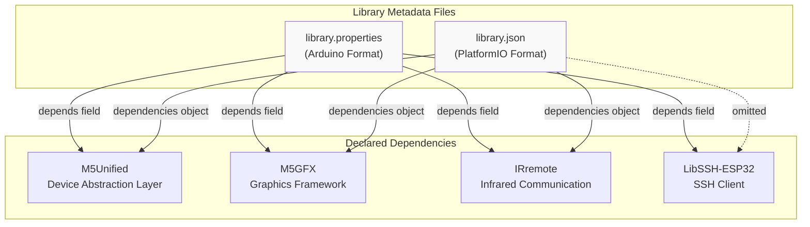
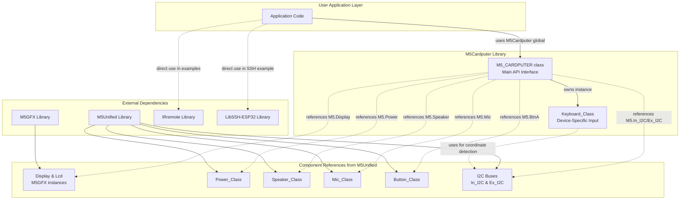
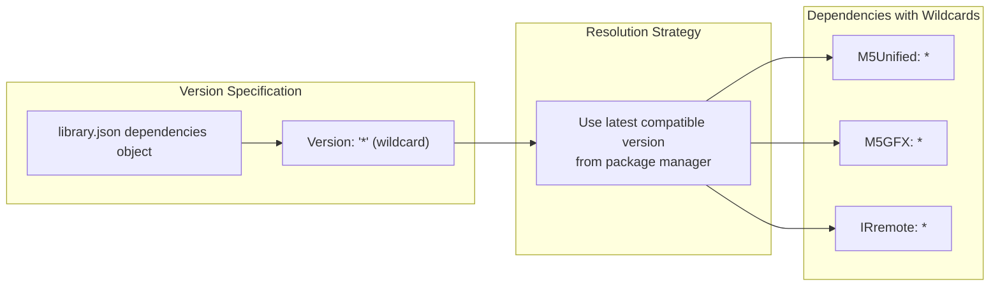
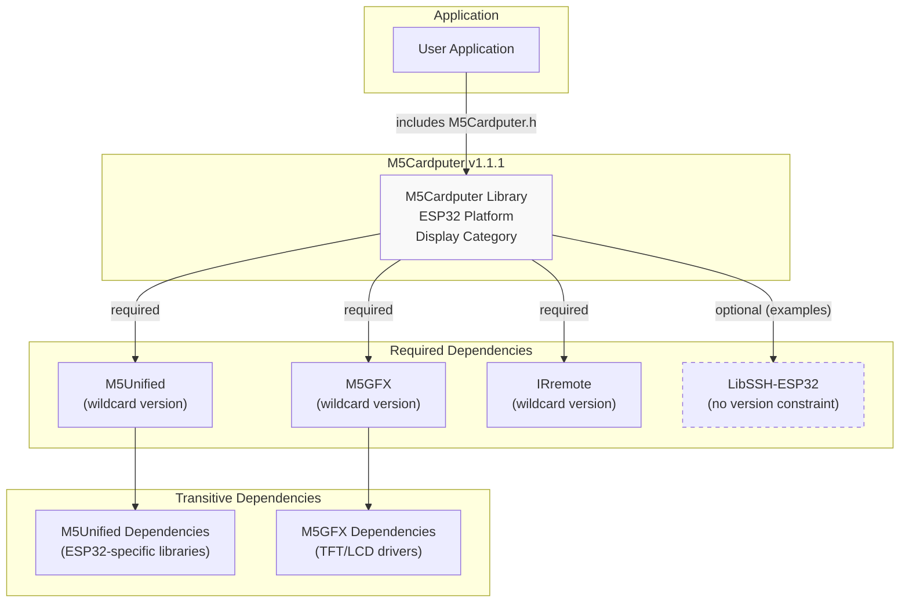

M5Cardputer Library Dependencies

# Library Dependencies

<details>
<summary>Relevant source files</summary>

The following files were used as context for generating this wiki page:

- [library.json](library.json)
- [library.properties](library.properties)

</details>


## Purpose and Scope

This document details the external library dependencies required by M5Cardputer v1.1.1. Each dependency is explained in terms of its role within the library architecture, the functionality it provides, and how it integrates with the M5Cardputer API. For information about the hardware variants that these dependencies support, see [Supported Hardware](#1.2). For details on how to initialize the library with these dependencies, see [Initialization and Configuration](#3.1).

---

## Dependency Overview

The M5Cardputer library declares four external dependencies that provide core functionality across display, device management, infrared communication, and secure networking capabilities.

| Dependency | Category | Purpose | Declared In |
|------------|----------|---------|-------------|
| **M5Unified** | Device Abstraction | Unified API for M5Stack hardware components including power, I2C, buttons, speaker, and microphone | [library.properties:11]() |
| **M5GFX** | Graphics Framework | High-performance graphics rendering, text display, and sprite management | [library.properties:11]() |
| **IRremote** | Communication | Infrared signal transmission and reception | [library.properties:11]() |
| **LibSSH-ESP32** | Networking | SSH client implementation for secure remote terminal access | [library.properties:11]() |

**Sources:** [library.properties:1-11](), [library.json:22-26]()

---

## Dependency Declaration Files

The M5Cardputer library declares its dependencies in two metadata files using different formats for Arduino Library Manager and PlatformIO compatibility.

### Dependency Declaration in Library Metadata



**Note:** `LibSSH-ESP32` is declared in [library.properties:11]() but omitted from [library.json:22-26](), likely due to PlatformIO repository availability constraints. Applications requiring SSH functionality must manually include this dependency.

**Sources:** [library.properties:11](), [library.json:22-26]()

---

## Dependency Architecture

The following diagram shows how dependencies integrate with the M5Cardputer library structure and which components they provide.

### M5Cardputer Dependency Integration



**Sources:** [library.properties:11](), [library.json:22-26]()

---

## Dependency Details

### M5Unified

**Purpose:** M5Unified provides a unified device abstraction layer for all M5Stack products, including the M5Cardputer. It manages hardware initialization, power control, I2C buses, buttons, audio input/output, and board variant detection.

**Integration Pattern:** M5Cardputer uses a reference-based architecture where most hardware components (Display, Power, Speaker, Mic, BtnA, I2C buses) are accessed through the `M5` global singleton rather than being duplicated. This ensures unified state management and zero-copy access.

**Key Components Exposed:**
- `M5.Power` - Battery status, power management
- `M5.Speaker` - Audio output and tone generation
- `M5.Mic` - Microphone input and recording
- `M5.BtnA` - Physical button state
- `M5.In_I2C` - Internal I2C bus for onboard components
- `M5.Ex_I2C` - External I2C bus (Port.A expansion)
- `M5.getBoard()` - Hardware variant detection (distinguishes M5Cardputer vs M5Cardputer-ADV)

**Critical for:** Hardware initialization sequence, board detection for keyboard implementation selection, power management, audio I/O, and I2C communication with keyboard controllers.

**Sources:** [library.properties:11](), [library.json:23]()

---

### M5GFX

**Purpose:** M5GFX is a high-performance graphics library optimized for M5Stack displays. It provides hardware-accelerated drawing primitives, text rendering with multiple fonts, sprite management, and display rotation.

**Integration Pattern:** M5Cardputer exposes the `M5.Display` and `M5.Lcd` references which are `M5GFX` instances. Applications use this for all display operations.

**Key Features Used:**
- Text rendering with built-in and custom fonts
- Graphics primitives (lines, rectangles, circles, fill operations)
- Display rotation and coordinate transformation
- Sprite system for efficient graphics composition
- High-speed display updates via DMA

**Critical for:** All visual output including keyboard input display, REPL interfaces, graphics demonstrations, and text-based applications.

**Sources:** [library.properties:11](), [library.json:24]()

---

### IRremote

**Purpose:** IRremote provides infrared signal transmission and reception capabilities using the ESP32's RMT (Remote Control) peripheral.

**Integration Pattern:** IRremote is not wrapped by M5Cardputer but is declared as a dependency because IR functionality is hardware-supported and commonly used in M5Cardputer applications. Applications must directly initialize and use the IRremote library.

**Typical Usage:**
- IR remote control transmission
- IR signal reception and decoding
- Custom IR protocol implementation

**Critical for:** Applications requiring infrared communication such as remote controls, IR-based data exchange, or appliance control.

**Sources:** [library.properties:11](), [library.json:25]()

---

### LibSSH-ESP32

**Purpose:** LibSSH-ESP32 is an ESP32 port of the libssh library, providing SSH client functionality for secure remote terminal access.

**Integration Pattern:** LibSSH-ESP32 is not wrapped by M5Cardputer. It is declared as a dependency in `library.properties` to support SSH client examples but must be directly initialized and used by applications. This dependency is **omitted from library.json**, requiring manual installation in PlatformIO environments.

**Key Features:**
- SSH client connection establishment
- Password and key-based authentication
- Remote command execution
- Interactive shell sessions
- Secure channel management

**Critical for:** SSH terminal applications, remote server management tools, and secure IoT device communication.

**Sources:** [library.properties:11]()

---

## Version Constraints

### Wildcard Version Policy



All dependencies in [library.json:22-26]() use wildcard version specifiers (`"*"`), meaning the library manager will install the latest available version compatible with the ESP32 platform. This approach:

- **Advantages:** Automatically benefits from bug fixes and performance improvements in dependencies
- **Risks:** Potential breaking changes if dependencies introduce incompatible API changes
- **Mitigation:** M5Stack maintains M5Unified and M5GFX, ensuring coordinated releases

**Sources:** [library.json:22-26]()

---

## Dependency Installation

### Arduino IDE

When installing M5Cardputer via Arduino Library Manager, the following dependencies are automatically resolved and installed:
- M5Unified
- M5GFX
- IRremote
- LibSSH-ESP32

### PlatformIO

Add to `platformio.ini`:
```ini
lib_deps = 
    M5Cardputer
    LibSSH-ESP32  ; Required for SSH examples, not auto-resolved
```

The M5Unified, M5GFX, and IRremote dependencies are automatically resolved. LibSSH-ESP32 must be manually added due to its omission from [library.json:22-26]().

**Sources:** [library.properties:11](), [library.json:22-26]()

---

## Dependency Graph

### Complete Dependency Tree



**Legend:** Dashed border indicates optional/example-only dependency (LibSSH-ESP32)

**Sources:** [library.properties:1-11](), [library.json:1-26]()

---

## Summary Table

| Library | Version | Provided By | Used For | Auto-Installed |
|---------|---------|-------------|----------|----------------|
| **M5Unified** | Latest (wildcard) | M5Stack | Device abstraction, power, audio, I2C, board detection | Yes (all platforms) |
| **M5GFX** | Latest (wildcard) | M5Stack | Graphics rendering, text display, sprites | Yes (all platforms) |
| **IRremote** | Latest (wildcard) | Third-party | Infrared communication | Yes (all platforms) |
| **LibSSH-ESP32** | Unspecified | Third-party | SSH client functionality | Yes (Arduino), Manual (PlatformIO) |

**Sources:** [library.properties:1-11](), [library.json:1-26]()