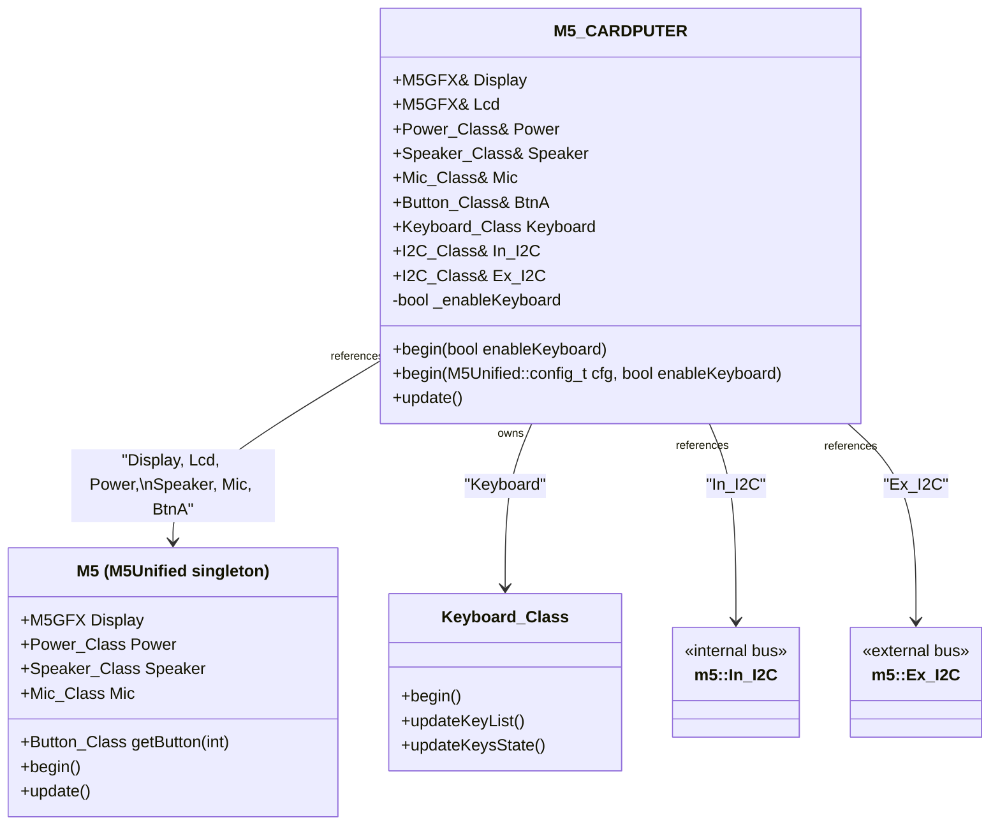
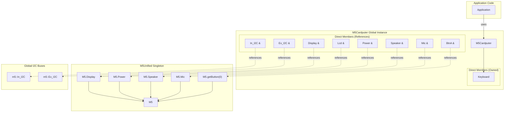
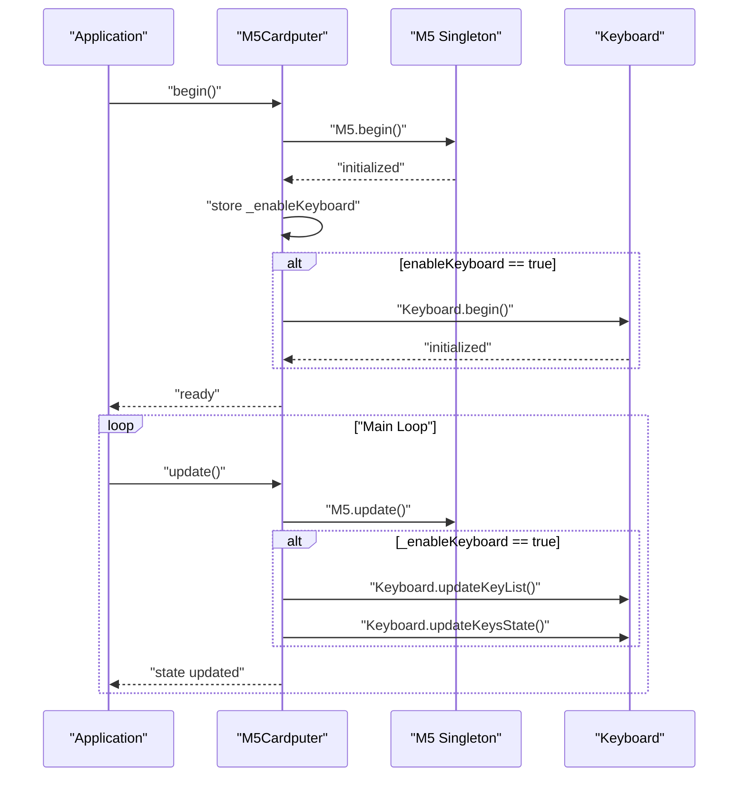
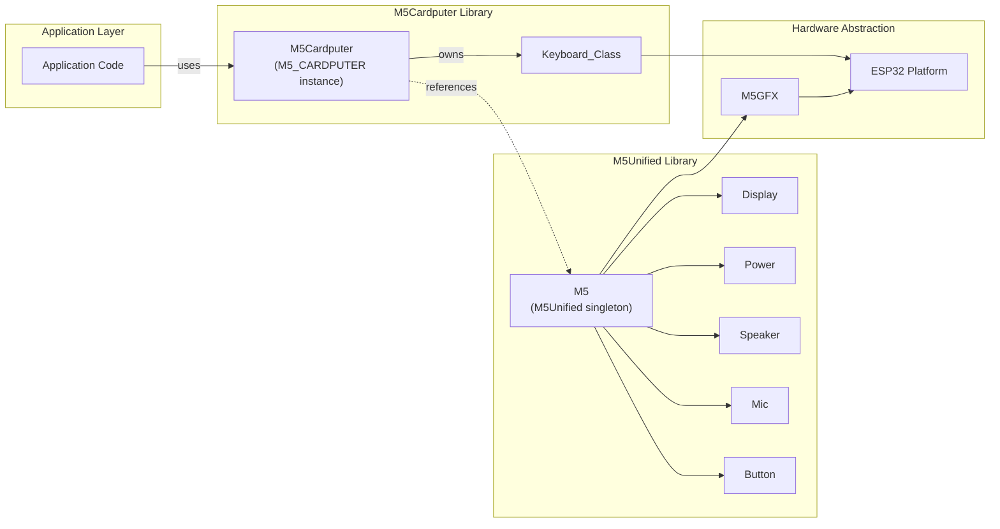

M5Cardputer M5Cardputer Core API

# M5Cardputer Core API

<details>
<summary>Relevant source files</summary>

The following files were used as context for generating this wiki page:

- [src/M5Cardputer.cpp](src/M5Cardputer.cpp)
- [src/M5Cardputer.h](src/M5Cardputer.h)

</details>


## Purpose and Scope

This document provides comprehensive reference documentation for the `M5_CARDPUTER` class, the primary interface for interacting with M5Cardputer hardware. The `M5_CARDPUTER` class aggregates hardware components, manages initialization, and provides the main update loop for applications.

This page covers the class structure, component ownership model, and initialization patterns. For detailed information on specific subsystems, see:
- Initialization methods and configuration options: [Initialization and Configuration](#3.1)
- Accessing Display, Speaker, Mic, Power, and Button: [Hardware Component Access](#3.2)
- Internal and external I2C bus management: [I2C Bus Management](#3.3)
- Keyboard-specific APIs: [Keyboard_Class API](#4.1)

---

## The M5_CARDPUTER Class

The `M5_CARDPUTER` class [src/M5Cardputer.h:14-39]() serves as the unified entry point for all M5Cardputer functionality. It follows a hybrid ownership model: most hardware peripherals are **referenced** from the M5Unified singleton, while device-specific components like the keyboard are **directly owned**.

### Global Instance

The library provides a pre-instantiated global object:

```cpp
extern m5::M5_CARDPUTER M5Cardputer;
```

Applications interact with the hardware exclusively through this global `M5Cardputer` instance [src/M5Cardputer.cpp:10]().

**Sources:** [src/M5Cardputer.h:43](), [src/M5Cardputer.cpp:10]()

---

## Class Structure

The following diagram maps the `M5_CARDPUTER` class members to their code entities:



**Key Observations:**
- **Referenced Components**: `Display`, `Lcd`, `Power`, `Speaker`, `Mic`, and `BtnA` are reference members [src/M5Cardputer.h:19-24]() pointing to the corresponding components in the M5Unified singleton
- **Owned Component**: `Keyboard` is a directly owned instance [src/M5Cardputer.h:26]()
- **I2C Bus References**: `In_I2C` and `Ex_I2C` reference global I2C bus objects [src/M5Cardputer.h:29,32]()

**Sources:** [src/M5Cardputer.h:14-39]()

---

## Component Ownership Model

The following diagram illustrates the ownership and reference relationships:



**Design Rationale:**

| Component Type | Ownership | Rationale |
|---------------|-----------|-----------|
| Display, Power, Speaker, Mic, BtnA | Reference to M5 singleton | These are standard M5Stack peripherals shared across all M5 devices. Referencing prevents duplication and ensures unified state management. |
| Keyboard | Direct ownership | Device-specific to M5Cardputer. Not provided by M5Unified, so `M5_CARDPUTER` owns and manages it directly. |
| I2C Buses | Reference to globals | Global bus objects allow sharing across modules. References provide convenient access. |

**Sources:** [src/M5Cardputer.h:19-32]()

---

## Initialization Methods

The `M5_CARDPUTER` class provides two initialization methods:

### Method 1: Simple Initialization

```cpp
void begin(bool enableKeyboard = true);
```

[src/M5Cardputer.h:16](), [src/M5Cardputer.cpp:12-19]()

Initializes the M5Cardputer with default M5Unified configuration. The `enableKeyboard` parameter controls whether the keyboard subsystem is initialized.

**Behavior:**
1. Calls `M5.begin()` [src/M5Cardputer.cpp:14]()
2. Stores `enableKeyboard` flag [src/M5Cardputer.cpp:15]()
3. If `enableKeyboard` is true, calls `Keyboard.begin()` [src/M5Cardputer.cpp:16-18]()

### Method 2: Custom Configuration

```cpp
void begin(m5::M5Unified::config_t cfg, bool enableKeyboard = true);
```

[src/M5Cardputer.h:17](), [src/M5Cardputer.cpp:21-28]()

Initializes the M5Cardputer with custom M5Unified configuration. Allows fine-grained control over internal I2C, external I2C, display, LED, and power management settings.

**Behavior:**
1. Calls `M5.begin(cfg)` with custom configuration [src/M5Cardputer.cpp:23]()
2. Stores `enableKeyboard` flag [src/M5Cardputer.cpp:24]()
3. If `enableKeyboard` is true, calls `Keyboard.begin()` [src/M5Cardputer.cpp:25-27]()

For detailed configuration options and initialization lifecycle, see [Initialization and Configuration](#3.1).

**Sources:** [src/M5Cardputer.h:16-17](), [src/M5Cardputer.cpp:12-28]()

---

## Update Method

The `update()` method must be called regularly in the application main loop:

```cpp
void update(void);
```

[src/M5Cardputer.h:34](), [src/M5Cardputer.cpp:30-37]()

### Initialization Sequence



**Update Cycle:**
1. Calls `M5.update()` to refresh M5Unified state (buttons, power, etc.) [src/M5Cardputer.cpp:32]()
2. If keyboard is enabled:
   - Calls `Keyboard.updateKeyList()` to scan for pressed keys [src/M5Cardputer.cpp:34]()
   - Calls `Keyboard.updateKeysState()` to process key states and generate events [src/M5Cardputer.cpp:35]()

**Sources:** [src/M5Cardputer.cpp:30-37]()

---

## Basic Usage Pattern

The following example demonstrates the standard initialization and update pattern:

```cpp
#include <M5Cardputer.h>

void setup() {
    // Initialize M5Cardputer with keyboard enabled
    M5Cardputer.begin();
    
    // Access display
    M5Cardputer.Display.setTextSize(2);
    M5Cardputer.Display.println("Ready");
}

void loop() {
    // Update all subsystems
    M5Cardputer.update();
    
    // Check keyboard input
    if (M5Cardputer.Keyboard.isChange()) {
        // Process keyboard events
    }
    
    // Check button
    if (M5Cardputer.BtnA.wasPressed()) {
        // Handle button press
    }
}
```

This pattern ensures:
- All hardware is properly initialized during `setup()`
- Component states are refreshed every loop iteration via `update()`
- Applications can query component states after each update

**Sources:** [src/M5Cardputer.h:16,34](), [src/M5Cardputer.cpp:12-37]()

---

## Member Summary Table

| Member | Type | Access | Purpose |
|--------|------|--------|---------|
| `Display` | `M5GFX&` | Reference | Primary display interface for graphics operations |
| `Lcd` | `M5GFX&` | Reference | Alias for `Display` (backward compatibility) |
| `Power` | `Power_Class&` | Reference | Battery and power management |
| `Speaker` | `Speaker_Class&` | Reference | Audio output (tones and WAV playback) |
| `Mic` | `Mic_Class&` | Reference | Microphone input and recording |
| `BtnA` | `Button_Class&` | Reference | Physical button on the device |
| `Keyboard` | `Keyboard_Class` | Owned | Full keyboard input processing |
| `In_I2C` | `I2C_Class&` | Reference | Internal I2C bus for onboard devices |
| `Ex_I2C` | `I2C_Class&` | Reference | External I2C bus (Port.A connector) |

**Sources:** [src/M5Cardputer.h:19-32]()

---

## Implementation Details

### Namespace

The `M5_CARDPUTER` class is defined in the `m5` namespace [src/M5Cardputer.h:12]():

```cpp
namespace m5 {
    class M5_CARDPUTER { /* ... */ };
}
```

The global instance is in the global namespace for convenience:

```cpp
extern m5::M5_CARDPUTER M5Cardputer;
```

### Private Members

The class maintains a single private member [src/M5Cardputer.h:38]():

```cpp
bool _enableKeyboard;
```

This flag stores whether the keyboard subsystem is active, controlling whether keyboard update methods are called in `update()` [src/M5Cardputer.cpp:33-36]().

**Sources:** [src/M5Cardputer.h:12,38,43](), [src/M5Cardputer.cpp:33-36]()

---

## Relationship to M5Unified



The `M5_CARDPUTER` class acts as a **facade** that:
1. Wraps M5Unified functionality for standard peripherals
2. Extends M5Unified with device-specific features (Keyboard)
3. Provides a unified, simplified interface for applications
4. Manages the initialization and update lifecycle for both M5Unified and device-specific components

This design allows applications to use a single consistent interface (`M5Cardputer`) while leveraging the full M5Stack ecosystem underneath.

**Sources:** [src/M5Cardputer.h:9-10,14-39](), [src/M5Cardputer.cpp:10-37]()