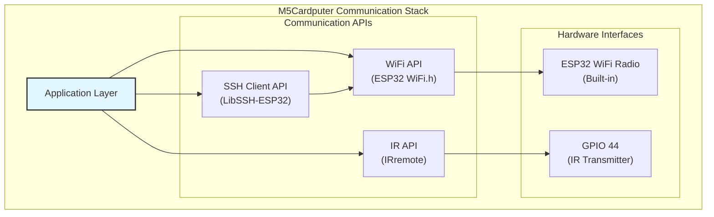
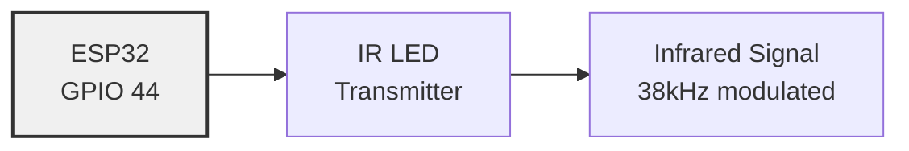
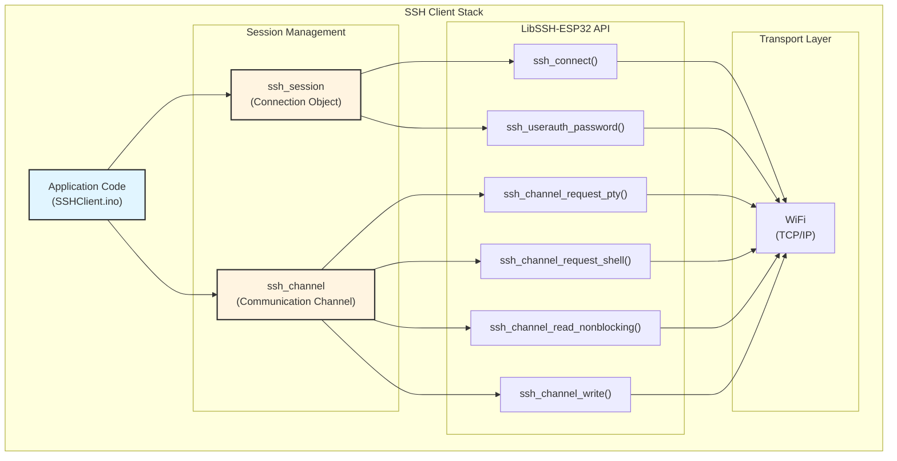
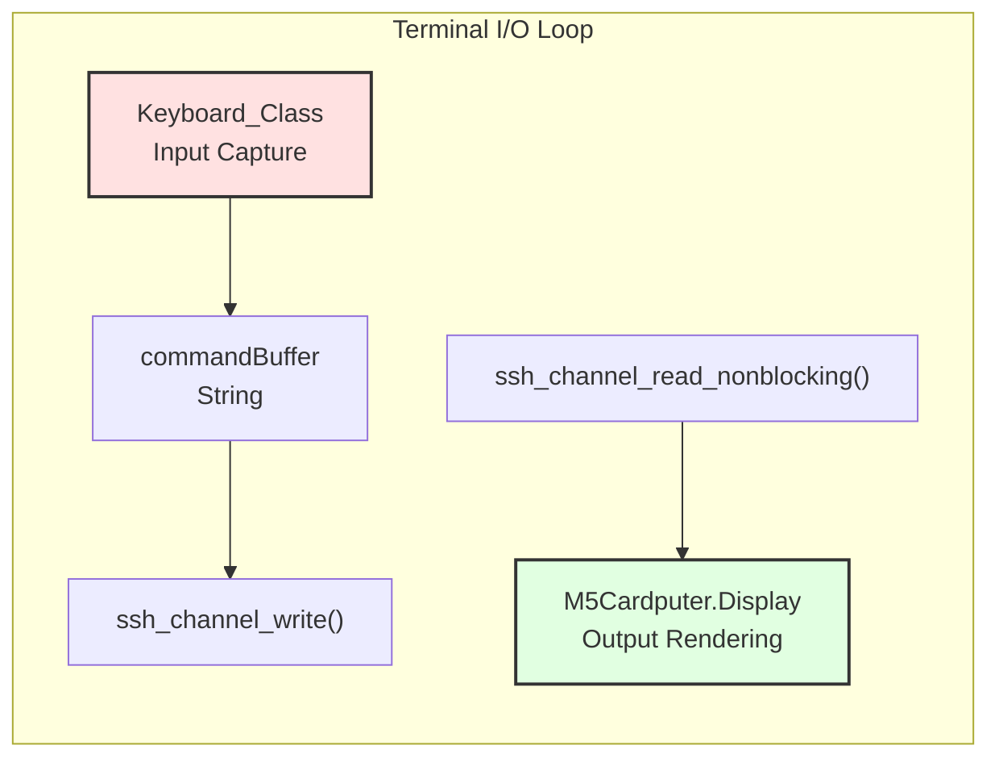
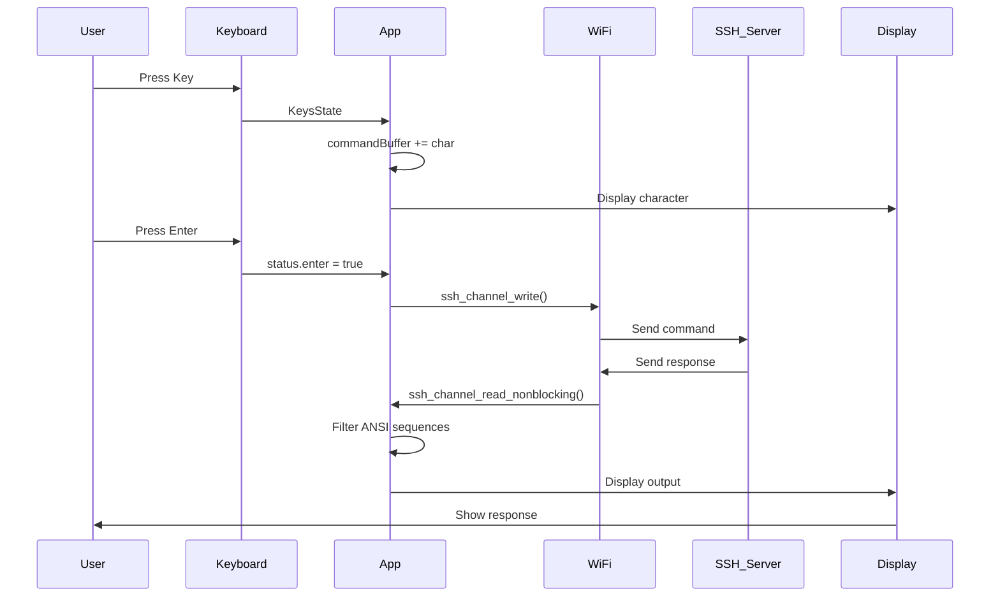
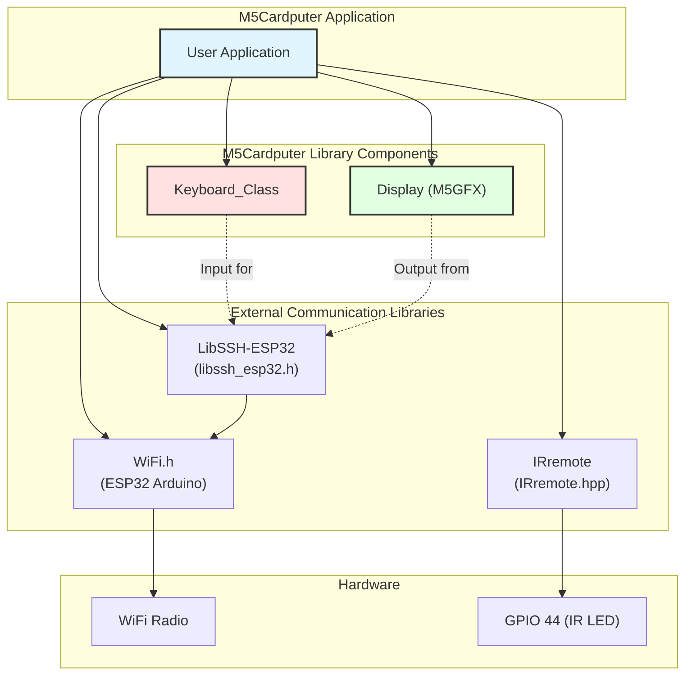

M5Cardputer Networking and Communication

# Networking and Communication

<details>
<summary>Relevant source files</summary>

The following files were used as context for generating this wiki page:

- [examples/Advanced/SSHClient/SSHClient.ino](examples/Advanced/SSHClient/SSHClient.ino)
- [examples/Basic/ir_nec/ir_nec.ino](examples/Basic/ir_nec/ir_nec.ino)
- [examples/Basic/keyboard/multiPress/multiPress.ino](examples/Basic/keyboard/multiPress/multiPress.ino)
- [library.properties](library.properties)

</details>


## Purpose and Scope

This document covers the networking and communication capabilities of the M5Cardputer library, including WiFi connectivity, SSH client functionality, and infrared (IR) communication. The M5Cardputer leverages the ESP32's built-in WiFi radio and integrates with the `LibSSH-ESP32` and `IRremote` libraries to provide network and wireless communication features.

For keyboard input handling used in network applications, see [Keyboard System](#4). For display operations used in SSH terminals, see [Display System](#5). For a complete walkthrough of building SSH client applications, see [SSH Client Application](#8.1).

---

## Communication Technologies Overview

The M5Cardputer supports three primary communication technologies:

| Technology | Hardware Interface | Library Dependency | Primary Use Case |
|------------|-------------------|-------------------|------------------|
| WiFi | ESP32 built-in WiFi radio | ESP32 WiFi library | Network connectivity, internet access |
| SSH | WiFi + LibSSH-ESP32 | `LibSSH-ESP32` | Secure remote shell access, command execution |
| Infrared (IR) | GPIO 44 (IR transmitter) | `IRremote` | Remote control transmission, device control |



**Sources:** [library.properties:11]()

---

## WiFi Connectivity

The M5Cardputer uses the ESP32's built-in WiFi capabilities through the standard Arduino WiFi library. WiFi functionality is not directly provided by the M5Cardputer library itself, but is utilized by higher-level protocols like SSH.

### WiFi Initialization

WiFi connection is established using the standard ESP32 WiFi API:

```cpp
#include <WiFi.h>

const char* ssid = "Your_SSID";
const char* password = "Your_Password";

WiFi.begin(ssid, password);
while (WiFi.status() != WL_CONNECTED) {
    delay(500);
}
```

### WiFi Connection States

| State | WiFi.status() Value | Description |
|-------|---------------------|-------------|
| Idle | `WL_IDLE_STATUS` | WiFi is in idle state |
| No SSID | `WL_NO_SSID_AVAIL` | Configured SSID cannot be reached |
| Connected | `WL_CONNECTED` | Successfully connected to network |
| Connect Failed | `WL_CONNECT_FAILED` | Connection failed |
| Disconnected | `WL_DISCONNECTED` | Disconnected from network |

**Sources:** [examples/Advanced/SSHClient/SSHClient.ino:17-61]()

---

## Infrared (IR) Communication

The M5Cardputer includes an IR transmitter on GPIO 44, enabling transmission of infrared signals for remote control applications. The library depends on the `IRremote` library for IR protocol implementation.

### IR Hardware Configuration



**IR Transmitter Pin:** GPIO 44

### IR Initialization

The IR transmitter must be configured before use:

```cpp
#define IR_TX_PIN 44
#include <IRremote.hpp>

IrSender.begin(DISABLE_LED_FEEDBACK);
IrSender.setSendPin(IR_TX_PIN);
```

### Supported IR Protocols

The `IRremote` library supports multiple IR protocols. The M5Cardputer examples demonstrate the NEC protocol:

| Method | Protocol | Parameters | Description |
|--------|----------|------------|-------------|
| `sendNEC()` | NEC | address, command, repeats | Send NEC protocol IR command |
| `sendOnkyo()` | Onkyo | address, command, repeats | Send Onkyo protocol IR command |

### IR Transmission Example

```cpp
// Send NEC protocol command
uint8_t address = 0x1111;
uint8_t command = 0x34;
uint8_t repeats = 0;

IrSender.sendNEC(address, command, repeats);
```

### IR Configuration Defines

The IR implementation uses preprocessor defines for optimization:

- `DISABLE_CODE_FOR_RECEIVER`: Disables receiver code to save 450 bytes program memory and 269 bytes RAM
- `SEND_PWM_BY_TIMER`: Uses hardware timer for PWM generation
- `IR_TX_PIN`: Defines the GPIO pin for IR transmission (44)

**Sources:** [examples/Basic/ir_nec/ir_nec.ino:1-77](), [library.properties:11]()

---

## SSH Client Architecture

The M5Cardputer integrates the `LibSSH-ESP32` library to provide SSH (Secure Shell) client functionality, enabling secure remote terminal access over WiFi. The SSH implementation uses the standard libssh C library API.



### SSH Session Lifecycle

The SSH client follows a strict initialization and operation sequence:

| Phase | Function | Purpose |
|-------|----------|---------|
| 1. Create | `ssh_new()` | Allocate new SSH session object |
| 2. Configure | `ssh_options_set()` | Set host, user, and connection options |
| 3. Connect | `ssh_connect()` | Establish TCP connection to SSH server |
| 4. Authenticate | `ssh_userauth_password()` | Authenticate with password credentials |
| 5. Open Channel | `ssh_channel_new()` + `ssh_channel_open_session()` | Create communication channel |
| 6. Request PTY | `ssh_channel_request_pty()` | Request pseudo-terminal allocation |
| 7. Request Shell | `ssh_channel_request_shell()` | Start interactive shell session |
| 8. Communicate | `ssh_channel_read/write()` | Send commands and receive output |
| 9. Cleanup | `ssh_channel_close/free()` + `ssh_disconnect/free()` | Close channel and session |

### SSH Session Creation and Configuration

```cpp
ssh_session my_ssh_session = ssh_new();
if (my_ssh_session == NULL) {
    // Handle error
}

ssh_options_set(my_ssh_session, SSH_OPTIONS_HOST, hostname);
ssh_options_set(my_ssh_session, SSH_OPTIONS_USER, username);
```

### SSH Connection and Authentication

```cpp
// Connect to server
if (ssh_connect(my_ssh_session) != SSH_OK) {
    ssh_free(my_ssh_session);
    // Handle connection error
}

// Authenticate with password
if (ssh_userauth_password(my_ssh_session, NULL, password) != SSH_AUTH_SUCCESS) {
    ssh_disconnect(my_ssh_session);
    ssh_free(my_ssh_session);
    // Handle authentication error
}
```

### SSH Channel Operations

```cpp
ssh_channel channel = ssh_channel_new(my_ssh_session);
ssh_channel_open_session(channel);
ssh_channel_request_pty(channel);
ssh_channel_request_shell(channel);

// Write command to channel
String command = "ls -la";
ssh_channel_write(channel, command.c_str(), command.length());
ssh_channel_write(channel, "\r", 1);  // Send carriage return

// Read response (non-blocking)
char buffer[128];
int nbytes = ssh_channel_read_nonblocking(channel, buffer, sizeof(buffer), 0);
if (nbytes > 0) {
    // Process received data
}
```

### SSH Channel State Management

| Function | Purpose | Return Value |
|----------|---------|--------------|
| `ssh_channel_is_closed()` | Check if channel is closed | Boolean |
| `ssh_channel_is_eof()` | Check if end-of-file reached | Boolean |
| `ssh_channel_read_nonblocking()` | Read without blocking | Bytes read, or <0 on error |
| `ssh_channel_write()` | Write data to channel | Bytes written, or error code |

**Sources:** [examples/Advanced/SSHClient/SSHClient.ino:17-20,38-39,75-124,159-221](), [library.properties:11]()

---

## SSH Terminal Integration

The SSH client implementation integrates with the M5Cardputer's keyboard and display to provide a full terminal experience.



### Keyboard Input Processing

The SSH client uses the keyboard system to capture user input:

```cpp
if (M5Cardputer.Keyboard.isChange() && M5Cardputer.Keyboard.isPressed()) {
    Keyboard_Class::KeysState status = M5Cardputer.Keyboard.keysState();
    
    // Append characters to command buffer
    for (auto i : status.word) {
        commandBuffer += i;
        M5Cardputer.Display.print(i);
    }
    
    // Handle backspace
    if (status.del && commandBuffer.length() > 2) {
        commandBuffer.remove(commandBuffer.length() - 1);
        // Update display
    }
    
    // Send command on Enter
    if (status.enter) {
        String message = commandBuffer.substring(2);
        ssh_channel_write(channel, message.c_str(), message.length());
        ssh_channel_write(channel, "\r", 1);
        commandBuffer = "> ";
    }
}
```

### Display Output Processing

SSH server output is read and displayed, with optional ANSI sequence filtering:

```cpp
char buffer[128];
int nbytes = ssh_channel_read_nonblocking(channel, buffer, sizeof(buffer), 0);
bool isAnsiSequence = false;

if (nbytes > 0) {
    for (int i = 0; i < nbytes; ++i) {
        char c = buffer[i];
        
        if (filterAnsiSequences) {
            if (c == '\033') {
                isAnsiSequence = true;
            } else if (isAnsiSequence) {
                if (isalpha(c)) {
                    isAnsiSequence = false;
                }
            } else {
                if (c != '\r') {
                    M5Cardputer.Display.write(c);
                }
            }
        } else {
            if (c != '\r') {
                M5Cardputer.Display.write(c);
            }
        }
    }
}
```

### ANSI Sequence Filtering

| Sequence Type | Pattern | Action |
|---------------|---------|--------|
| Escape start | `\033` (ESC) | Set `isAnsiSequence = true` |
| Sequence content | Any character while in sequence | Skip character |
| Sequence end | Alphabetic character | Set `isAnsiSequence = false` |
| Regular character | Any character outside sequence | Display character |

### Display Scrolling Management

The SSH client implements automatic scrolling when cursor reaches bottom:

```cpp
const int lineHeight = 32;
int cursorY = M5Cardputer.Display.getCursorY();

if (cursorY > M5Cardputer.Display.height() - lineHeight) {
    M5Cardputer.Display.scroll(0, -lineHeight);
    cursorY -= lineHeight;
    M5Cardputer.Display.setCursor(M5Cardputer.Display.getCursorX(), cursorY);
}
```

**Sources:** [examples/Advanced/SSHClient/SSHClient.ino:31-36,126-221]()

---

## Input Debouncing for Network Applications

Network applications implement input debouncing to prevent duplicate key presses from being sent:

```cpp
unsigned long lastKeyPressMillis = 0;
const unsigned long debounceDelay = 200;  // milliseconds

if (M5Cardputer.Keyboard.isChange() && M5Cardputer.Keyboard.isPressed()) {
    unsigned long currentMillis = millis();
    if (currentMillis - lastKeyPressMillis >= debounceDelay) {
        lastKeyPressMillis = currentMillis;
        // Process keyboard input
    }
}
```

### Debounce Configuration

| Parameter | Value | Purpose |
|-----------|-------|---------|
| `lastKeyPressMillis` | Timestamp (ms) | Last key press time |
| `debounceDelay` | 200 ms (default) | Minimum time between key presses |

**Sources:** [examples/Advanced/SSHClient/SSHClient.ino:35-36,129-172,224-272]()

---

## Communication Data Flow



**Sources:** [examples/Advanced/SSHClient/SSHClient.ino:126-221]()

---

## Network Application Patterns

### Credential Input Pattern

The SSH client implements a reusable input pattern for collecting credentials:

```cpp
void waitForInput(String& input) {
    String currentInput = input;
    
    while (true) {
        M5Cardputer.update();
        if (M5Cardputer.Keyboard.isChange()) {
            Keyboard_Class::KeysState status = M5Cardputer.Keyboard.keysState();
            
            // Handle backspace
            if (status.del && currentInput.length() > 0) {
                currentInput.remove(currentInput.length() - 1);
                // Update display
            }
            
            // Append characters
            for (auto i : status.word) {
                currentInput += i;
                M5Cardputer.Display.print(i);
            }
            
            // Complete on Enter
            if (status.enter) {
                input = currentInput;
                break;
            }
        }
        
        // Timeout after 3 minutes
        if (millis() - startTime > 180000) {
            ESP.restart();
        }
    }
}

// Usage
M5Cardputer.Display.print("SSH Host: ");
waitForInput(ssh_host);
M5Cardputer.Display.print("\nSSH Username: ");
waitForInput(ssh_user);
M5Cardputer.Display.print("\nSSH Password: ");
waitForInput(ssh_password);
```

### Input Timeout Pattern

Network applications implement timeouts to prevent indefinite waiting:

- **Credential input timeout:** 180000 ms (3 minutes)
- **Action on timeout:** Call `ESP.restart()` to reboot device

**Sources:** [examples/Advanced/SSHClient/SSHClient.ino:41-42,224-272]()

---

## Error Handling in Network Applications

### SSH Error Handling Pattern

```cpp
// Session creation
ssh_session my_ssh_session = ssh_new();
if (my_ssh_session == NULL) {
    Serial.println("SSH Session creation failed.");
    return;
}

// Connection
if (ssh_connect(my_ssh_session) != SSH_OK) {
    Serial.println("SSH Connect error.");
    ssh_free(my_ssh_session);
    return;
}

// Authentication
if (ssh_userauth_password(my_ssh_session, NULL, password) != SSH_AUTH_SUCCESS) {
    Serial.println("SSH Authentication error.");
    ssh_disconnect(my_ssh_session);
    ssh_free(my_ssh_session);
    return;
}

// Channel operations
if (ssh_channel_request_pty(channel) != SSH_OK) {
    Serial.println("SSH PTY request error.");
    ssh_channel_close(channel);
    ssh_channel_free(channel);
    ssh_disconnect(my_ssh_session);
    ssh_free(my_ssh_session);
    return;
}
```

### SSH Error Return Codes

| Return Code | Meaning | Required Cleanup |
|-------------|---------|------------------|
| `SSH_OK` | Operation successful | None |
| `SSH_ERROR` | Generic error | Free allocated resources |
| `SSH_AUTH_SUCCESS` | Authentication succeeded | None |
| `SSH_AUTH_DENIED` | Authentication failed | Disconnect and free session |
| `NULL` | Object creation failed | None (nothing to free) |

### Channel Closure Detection

```cpp
if (nbytes < 0 || ssh_channel_is_closed(channel)) {
    ssh_channel_close(channel);
    ssh_channel_free(channel);
    ssh_disconnect(my_ssh_session);
    ssh_free(my_ssh_session);
    M5Cardputer.Display.println("\nSSH session closed.");
    return;
}
```

**Sources:** [examples/Advanced/SSHClient/SSHClient.ino:75-124,214-221]()

---

## Memory Considerations for Network Applications

### Buffer Sizing

Network applications must carefully manage buffer sizes to avoid memory issues on the ESP32:

| Buffer | Size | Purpose | Location |
|--------|------|---------|----------|
| SSH read buffer | 128 bytes | Receive SSH data | Stack (local) |
| Command buffer | Dynamic String | Store user input | Heap |

```cpp
char buffer[128];  // Reduced buffer size for less memory usage
int nbytes = ssh_channel_read_nonblocking(channel, buffer, sizeof(buffer), 0);
```

### Memory-Efficient Patterns

- Use stack-allocated buffers for temporary read/write operations
- Reuse `String` objects instead of creating new ones
- Process data immediately rather than buffering large amounts
- Use non-blocking operations to avoid blocking while waiting for data

**Sources:** [examples/Advanced/SSHClient/SSHClient.ino:183]()

---

## Communication Libraries Integration Summary



The M5Cardputer library provides the interface layer (keyboard and display) that enables effective use of networking libraries, while the communication protocols themselves are implemented by specialized external libraries.

**Sources:** [library.properties:11](), [examples/Advanced/SSHClient/SSHClient.ino:17-20](), [examples/Basic/ir_nec/ir_nec.ino:22-25]()