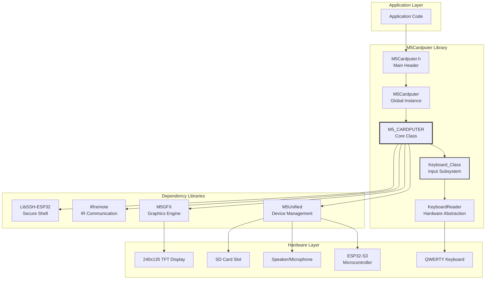
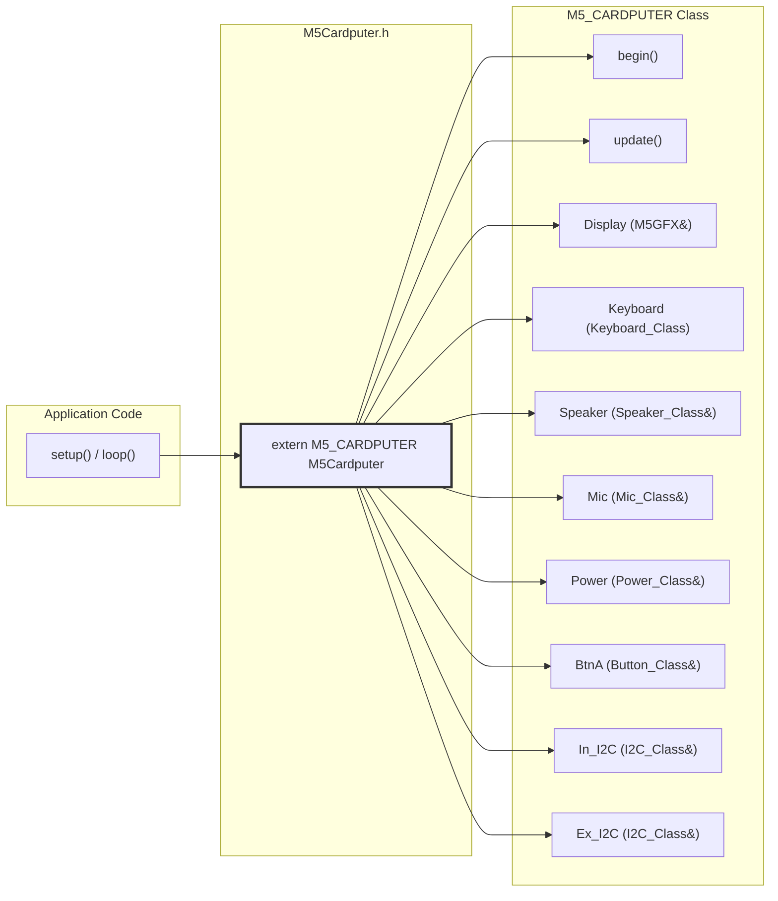
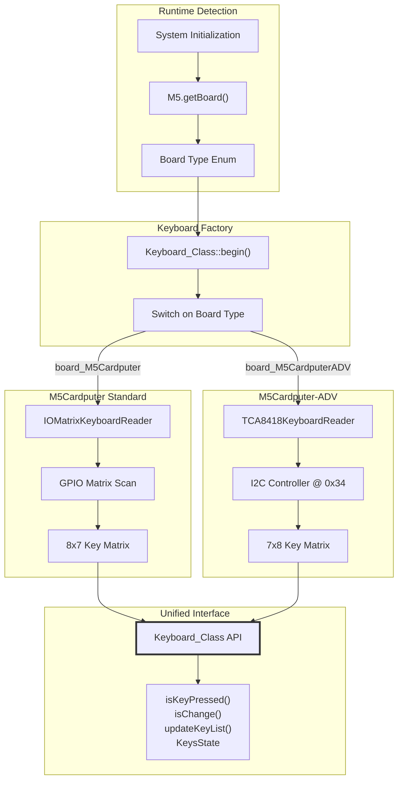
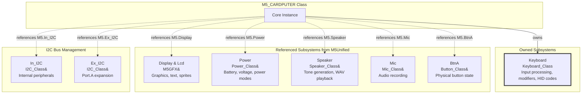

M5Cardputer Overview

# Overview

<details>
<summary>Relevant source files</summary>

The following files were used as context for generating this wiki page:

- [README.md](README.md)
- [library.json](library.json)
- [library.properties](library.properties)

</details>


## Purpose and Scope

The M5Cardputer library provides a unified Arduino framework for developing applications on M5Stack's M5Cardputer and M5Cardputer-ADV hardware platforms. This library abstracts hardware differences between board variants, integrates keyboard input processing, and coordinates access to display, audio, storage, and networking peripherals through the M5Stack ecosystem.

This document introduces the library's architecture, main components, and integration patterns. For specific subsystems, see:
- Hardware-specific implementation details: [Supported Hardware](#1.2)
- External dependency requirements: [Library Dependencies](#1.1)
- Initialization and setup procedures: [Getting Started](#2)
- Core API reference: [M5Cardputer Core API](#3)
- Keyboard input processing: [Keyboard System](#4)

**Sources:** [library.properties:1-11](), [library.json:1-27](), [README.md:1-12]()

---

## Library Architecture

The M5Cardputer library operates as an integration layer within the M5Stack ecosystem, providing a device-specific API while delegating common functionality to established M5Stack libraries.

### Library Structure



**Sources:** [library.properties:1-11](), [library.json:22-26]()

### Dependency Integration

The library declares four primary dependencies, each serving a specific architectural role:

| Dependency | Version | Purpose | Architectural Role |
|------------|---------|---------|-------------------|
| **M5Unified** | * (latest) | Device abstraction layer | Provides unified access to M5Stack hardware: power management, speakers, microphones, buttons, I2C buses |
| **M5GFX** | * (latest) | Graphics framework | Handles all display operations: drawing primitives, text rendering, sprite management, color spaces |
| **IRremote** | * (latest) | Infrared communication | Enables IR transmit/receive for remote control applications |
| **LibSSH-ESP32** | (implicit) | SSH client library | Provides secure shell connectivity for network terminal applications |

**Sources:** [library.properties:11](), [library.json:22-26]()

---

## Main API Entry Point

Applications interact with the M5Cardputer hardware through a single global instance and a core class that aggregates all subsystems.

### Global Instance Pattern



The global `M5Cardputer` instance is defined as `extern M5_CARDPUTER M5Cardputer` in the main header file, following the Arduino library convention. Applications access all functionality through this single object.

**Typical Usage Pattern:**
```cpp
#include <M5Cardputer.h>

void setup() {
    M5Cardputer.begin();  // Initialize all subsystems
}

void loop() {
    M5Cardputer.update();  // Poll hardware state
    
    // Access subsystems
    M5Cardputer.Display.println("Hello");
    M5Cardputer.Keyboard.isKeyPressed('A');
    M5Cardputer.Speaker.tone(1000);
}
```

**Sources:** [library.properties:10]()

---

## Hardware Abstraction Strategy

The library supports two hardware variants with different keyboard implementations while maintaining API compatibility.

### Board Variant Support



The library uses runtime polymorphism to select the appropriate keyboard implementation based on detected hardware. Both implementations satisfy the `KeyboardReader` abstract interface, ensuring identical behavior at the application level. For detailed hardware specifications, see [Supported Hardware](#1.2).

**Sources:** [library.properties:5](), [library.json:3-4]()

---

## Major Subsystems Overview

The M5_CARDPUTER class organizes functionality into distinct subsystems, each handling a specific hardware domain.

### Subsystem Architecture



### Subsystem Responsibilities

| Subsystem | Type | Responsibilities |
|-----------|------|------------------|
| **Keyboard** | Owned | Key state polling, modifier tracking, character mapping, HID code generation |
| **Display** | Referenced | 240x135 TFT operations, graphics primitives, text rendering |
| **Power** | Referenced | Battery monitoring, power management, voltage measurement |
| **Speaker** | Referenced | Audio tone generation, WAV file playback, buzzer control |
| **Mic** | Referenced | Microphone sampling, audio recording to SD card |
| **BtnA** | Referenced | Physical button press/release detection |
| **In_I2C** | Referenced | Communication with onboard peripherals (keyboard controller on ADV) |
| **Ex_I2C** | Referenced | Communication with Port.A expansion modules |

The distinction between "owned" and "referenced" subsystems reflects the library's design philosophy:
- **Owned subsystems** (Keyboard) are device-specific and not provided by M5Unified
- **Referenced subsystems** are exposed from the M5 singleton for unified state management across the M5Stack ecosystem

For detailed API documentation, see:
- Keyboard functionality: [Keyboard System](#4)
- Display operations: [Display System](#5)
- Audio capabilities: [Audio System](#6)
- I2C bus usage: [I2C Bus Management](#3.3)

**Sources:** [library.properties:1-11]()

---

## Development Ecosystem

### Platform Requirements

| Component | Specification |
|-----------|--------------|
| **Architecture** | `esp32` |
| **Framework** | Arduino |
| **Platform** | espressif32 |
| **Target MCU** | ESP32-S3 |
| **IDE Support** | Arduino IDE, PlatformIO |

**Sources:** [library.properties:9](), [library.json:14-19]()

### Library Category and Classification

The library is categorized under **Display** in the Arduino Library Manager, reflecting its primary focus on graphical applications with integrated keyboard input. Despite the display categorization, the library provides comprehensive functionality including:

- Keyboard input processing
- Audio recording and playback
- Network communication (WiFi, SSH, IR)
- File system operations (SD card)
- Power management

This multi-domain capability makes the M5Cardputer suitable for terminal emulators, interactive REPLs, portable SSH clients, and other applications requiring rich I/O capabilities.

**Sources:** [library.properties:7]()

### Installation and Setup

The library is distributed through:
- **Arduino Library Manager**: Search for "M5Cardputer"
- **PlatformIO Registry**: `m5stack/M5Cardputer`
- **GitHub Repository**: https://github.com/m5stack/M5Cardputer.git

For installation procedures and initial setup, see [Getting Started](#2).

**Sources:** [library.properties:8](), [library.json:9-11]()

---

## Version and Licensing

**Current Version:** 1.1.1

**License Information:**
- M5Cardputer library follows M5Stack's standard licensing
- M5GFX dependency: MIT License
- M5Unified dependency: MIT License
- Other dependencies maintain their respective licenses

**Authors and Maintainers:**
- Primary Author: M5Stack
- Contributors: Sean
- Maintainer: M5Stack

For support and updates, refer to the official M5Stack website at http://M5Stack.com.

**Sources:** [library.properties:2-6](), [library.json:5-7,13](), [README.md:7-10]()