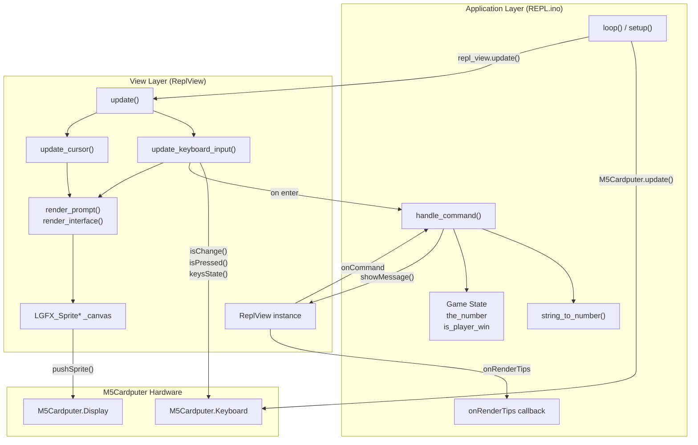
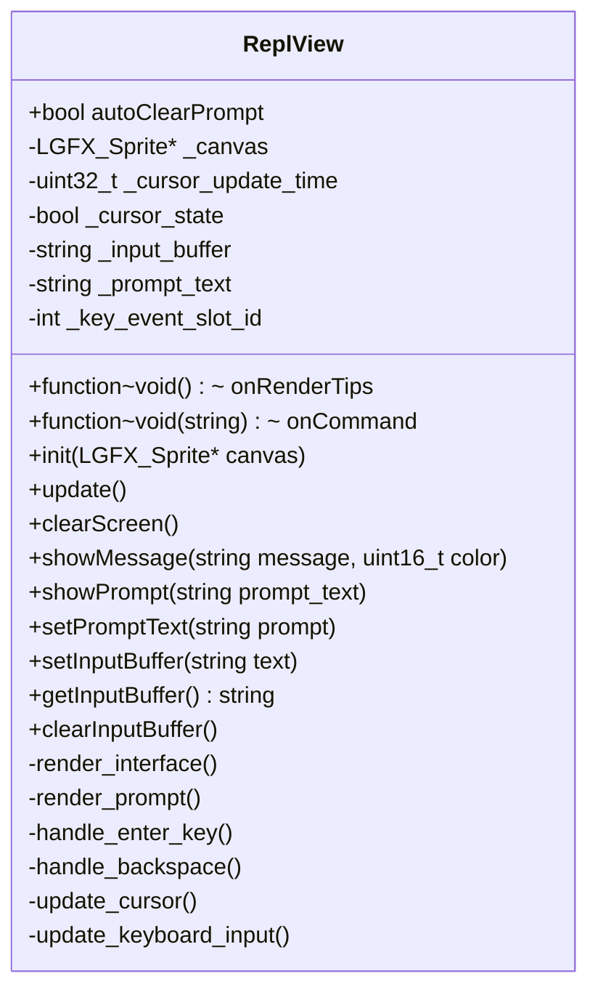
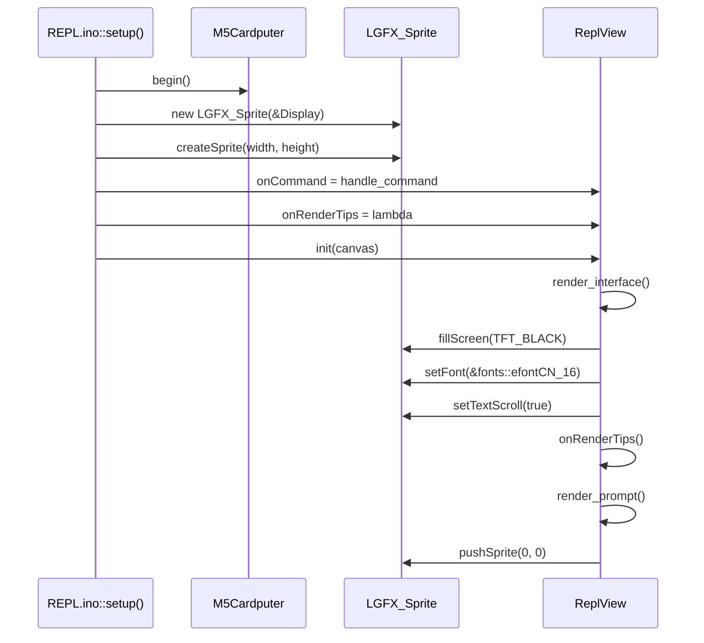
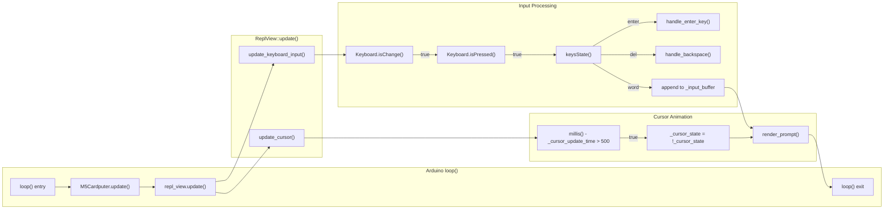
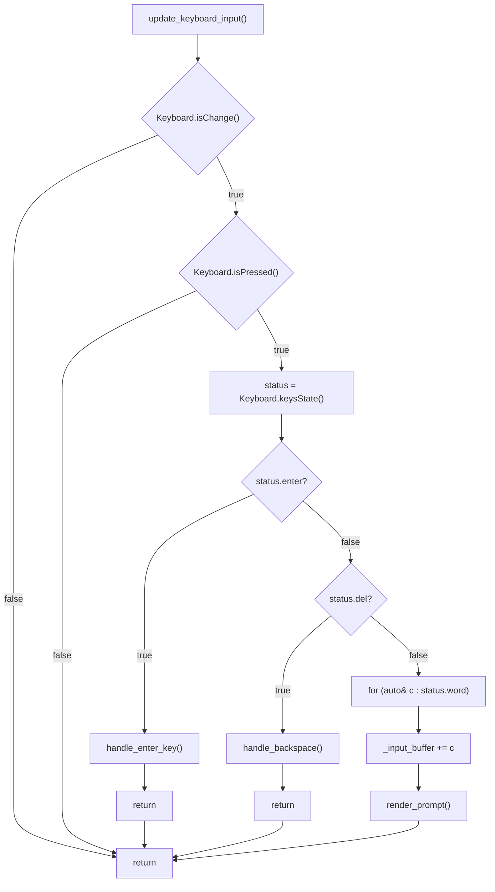
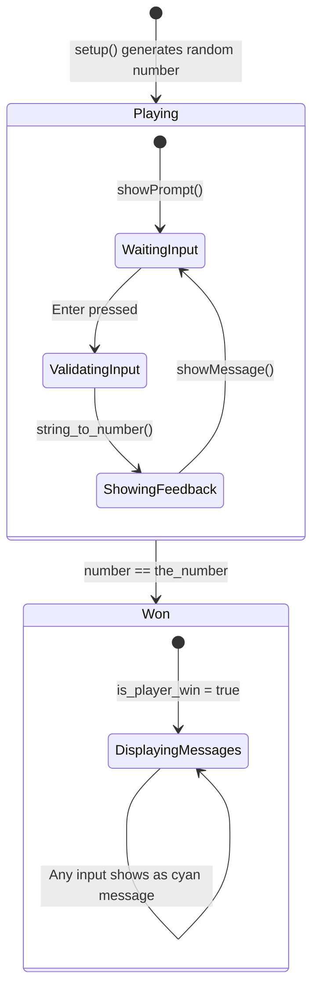
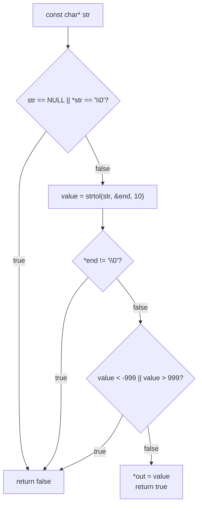
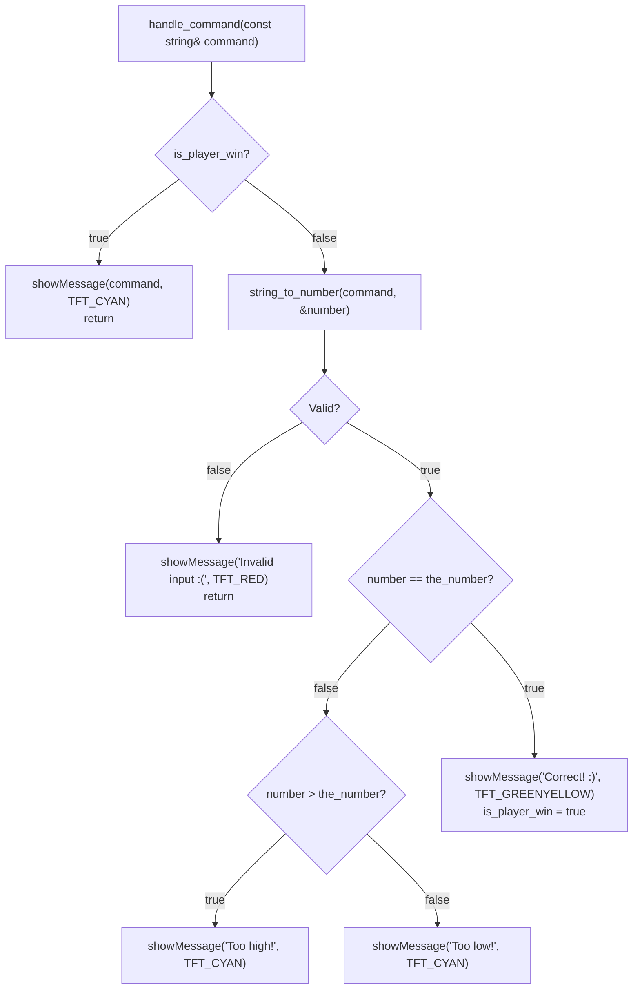

M5Cardputer REPL Application

# REPL Application

<details>
<summary>Relevant source files</summary>

The following files were used as context for generating this wiki page:

- [examples/UI/REPL/REPL.ino](examples/UI/REPL/REPL.ino)
- [examples/UI/REPL/ReplView.cpp](examples/UI/REPL/ReplView.cpp)
- [examples/UI/REPL/ReplView.h](examples/UI/REPL/ReplView.h)

</details>


## Purpose and Scope

The REPL (Read-Eval-Print Loop) application demonstrates how to build an interactive command-line interface on the M5Cardputer using the `ReplView` class. This example implements a number-guessing game to showcase text input handling, cursor management, message display, and callback-based application architecture. The REPL pattern is widely applicable for debugging tools, configuration interfaces, and interactive applications requiring text-based command entry.

For general keyboard input patterns beyond REPL interfaces, see [Keyboard Input Examples](#9.2). For display system fundamentals, see [Display System](#5). For keyboard API reference, see [Keyboard_Class API](#4.1).

**Sources:** [examples/UI/REPL/REPL.ino:1-88](), [examples/UI/REPL/ReplView.h:1-52]()

---

## Architecture Overview

The REPL application follows a Model-View-Controller pattern with clear separation between UI rendering (`ReplView`) and application logic (in `REPL.ino`). The architecture uses callback functions to decouple the view from game-specific behavior.



**Component Responsibilities:**

| Component | File | Responsibility |
|-----------|------|----------------|
| `ReplView` | [ReplView.h:15-51]() | UI rendering, keyboard input processing, cursor animation |
| `LGFX_Sprite* canvas` | [REPL.ino:9]() | Double-buffered rendering surface for flicker-free display |
| `handle_command()` | [REPL.ino:35-59]() | Game logic: input validation, number comparison, win condition |
| `string_to_number()` | [REPL.ino:14-33]() | Input validation and range checking (-999 to 999) |
| `onRenderTips` callback | [REPL.ino:71-75]() | Renders application-specific instructions at startup |
| `onCommand` callback | [REPL.ino:70]() | Invoked when user presses Enter with non-empty input |

**Sources:** [examples/UI/REPL/REPL.ino:1-88](), [examples/UI/REPL/ReplView.h:15-51](), [examples/UI/REPL/ReplView.cpp:8-167]()

---

## ReplView Class Design

The `ReplView` class provides a reusable REPL interface with configurable behavior through callbacks. It manages the complete input-display lifecycle without imposing specific command handling logic.

### Class Interface



### Public Configuration

| Member | Type | Default | Purpose |
|--------|------|---------|---------|
| `onRenderTips` | `std::function<void()>` | nullptr | Called during `render_interface()` to display application-specific instructions |
| `onCommand` | `std::function<void(const std::string&)>` | nullptr | Called when Enter is pressed with non-empty input buffer |
| `autoClearPrompt` | `bool` | true | If true, clears `_input_buffer` after Enter; if false, preserves input for inspection |

**Sources:** [examples/UI/REPL/ReplView.h:17-19]()

### Initialization Sequence



**Sources:** [examples/UI/REPL/REPL.ino:61-80](), [examples/UI/REPL/ReplView.cpp:8-73]()

---

## Update Loop Architecture

The REPL application uses a polling-based update loop that processes keyboard events and manages cursor animation on every iteration.



### Update Timing

- **Keyboard polling:** Every call to `M5Cardputer.update()` refreshes keyboard state
- **Cursor blink:** Toggles every `CURSOR_BLINK_PERIOD` (500ms) based on `millis()` comparison
- **Rendering:** Only occurs when input changes or cursor state toggles, minimizing unnecessary redraws

**Sources:** [examples/UI/REPL/REPL.ino:82-87](), [examples/UI/REPL/ReplView.cpp:14-18](), [examples/UI/REPL/ReplView.cpp:136-143]()

---

## Keyboard Input Processing

The `update_keyboard_input()` method implements a state-machine approach to keyboard event handling, processing special keys first, then collecting character input.



### Key Event Handling

| Key | Field | Handler | Behavior |
|-----|-------|---------|----------|
| Enter | `status.enter` | `handle_enter_key()` | Finalizes input, invokes `onCommand` callback, clears buffer if `autoClearPrompt` |
| Backspace/Delete | `status.del` | `handle_backspace()` | Removes last character from `_input_buffer`, re-renders prompt |
| Printable characters | `status.word` | Direct append | Iterates through `word` vector, appends each character to `_input_buffer` |

### Enter Key Processing

When Enter is pressed, `handle_enter_key()` performs these steps:

1. **Finalize current line:** Clears cursor area with `fillRect()`, re-renders prompt + input without cursor
2. **Move to next line:** Calls `_canvas->println()` to advance cursor position
3. **Invoke command callback:** Calls `onCommand(_input_buffer)` if callback is set and buffer is non-empty
4. **Reset for next input:** Clears `_input_buffer` if `autoClearPrompt` is true, renders new prompt line

**Sources:** [examples/UI/REPL/ReplView.cpp:145-167](), [examples/UI/REPL/ReplView.cpp:99-120](), [examples/UI/REPL/ReplView.cpp:122-134]()

---

## Display Rendering Pipeline

The REPL application uses sprite-based double buffering to prevent screen flicker. All rendering operations target the `LGFX_Sprite` canvas, which is then pushed to the display as a complete frame.

```mermaid
graph TB
    subgraph "Canvas Configuration (render_interface)"
        FILL["fillScreen(TFT_BLACK)"]
        FONT["setFont(&fonts::efontCN_16)"]
        SCROLL["setTextScroll(true)"]
        CURSOR_POS["setCursor(0, 0)"]
        TEXT_SIZE["setTextSize(1)"]
        COLORS["setBaseColor(TFT_BLACK)<br/>setTextColor(TFT_WHITE, TFT_BLACK)"]
    end
    
    subgraph "Prompt Rendering (render_prompt)"
        GET_Y["cursor_y = getCursorY()"]
        CLEAR_LINE["fillRect(0, cursor_y, width, 15, TFT_BLACK)"]
        BUILD_TEXT["display_text = _prompt_text + _input_buffer"]
        ADD_CURSOR{"_cursor_state?"}
        CURSOR_CHAR["display_text += '_'"]
        SPACE_CHAR["display_text += ' '"]
        SET_CURSOR["setCursor(0, cursor_y)"]
        PRINT["print(display_text)"]
        PUSH["pushSprite(0, 0)"]
    end
    
    subgraph "Message Display (showMessage)"
        SET_COLOR["setTextColor(color, TFT_BLACK)"]
        PRINTLN["println(message)"]
        RESET_COLOR["setTextColor(TFT_WHITE, TFT_BLACK)"]
        PUSH_MSG["pushSprite(0, 0)"]
    end
    
    FILL --> FONT
    FONT --> SCROLL
    SCROLL --> CURSOR_POS
    CURSOR_POS --> TEXT_SIZE
    TEXT_SIZE --> COLORS
    
    GET_Y --> CLEAR_LINE
    CLEAR_LINE --> BUILD_TEXT
    BUILD_TEXT --> ADD_CURSOR
    ADD_CURSOR -->|true| CURSOR_CHAR
    ADD_CURSOR -->|false| SPACE_CHAR
    CURSOR_CHAR --> SET_CURSOR
    SPACE_CHAR --> SET_CURSOR
    SET_CURSOR --> PRINT
    PRINT --> PUSH
    
    SET_COLOR --> PRINTLN
    PRINTLN --> RESET_COLOR
    RESET_COLOR --> PUSH_MSG
```



### Critical Rendering Techniques

**Cursor Flicker Prevention:**
The cursor is rendered as part of the prompt text string rather than as a separate shape. This ensures atomic rendering—the entire line is drawn in one operation, preventing the cursor from appearing separate from the text.

**Line Clearing:**
Before re-rendering the prompt, `fillRect(0, cursor_y, _canvas->width(), 15, TFT_BLACK)` clears the entire line. The height of 15 pixels matches the font height to ensure complete erasure of previous characters and cursor states.

**Text Scrolling:**
`setTextScroll(true)` enables automatic vertical scrolling when `println()` operations exceed canvas height. New lines push older content upward, maintaining a scrolling terminal effect.

**Sources:** [examples/UI/REPL/ReplView.cpp:58-97](), [examples/UI/REPL/ReplView.cpp:27-33]()

---

## Application-Specific Implementation

The number-guessing game in `REPL.ino` demonstrates how to use `ReplView` to implement application logic through callbacks.

### Game State Management



### Input Validation Flow

The `string_to_number()` function implements strict input validation:



**Validation Rules:**
- Input must be non-null and non-empty
- Must parse completely as base-10 integer (no trailing characters)
- Must be within range [-999, 999]

**Sources:** [examples/UI/REPL/REPL.ino:14-33]()

### Command Handler Implementation



### Color Coding Scheme

| Message Type | Color Constant | RGB | Usage |
|--------------|---------------|-----|-------|
| Success | `TFT_GREENYELLOW` | Green-Yellow | Correct guess |
| Information | `TFT_CYAN` | Cyan | Hints, post-win messages |
| Error | `TFT_RED` | Red | Invalid input |
| Default | `TFT_WHITE` | White | Prompt text |

**Sources:** [examples/UI/REPL/REPL.ino:35-59]()

---

## Usage Patterns

### Basic REPL Setup

```
setup():
  1. Initialize M5Cardputer
  2. Create LGFX_Sprite covering full display
  3. Set ReplView callbacks (onRenderTips, onCommand)
  4. Call ReplView::init()
  
loop():
  1. Call M5Cardputer.update() to refresh hardware state
  2. Call ReplView::update() to process input and animate cursor
```

### Customizing the Interface

**Changing Prompt Text:**
```cpp
repl_view.setPromptText("custom> ");
```

**Pre-filling Input:**
```cpp
repl_view.setInputBuffer("default text");
```

**Preserving Input After Enter:**
```cpp
repl_view.autoClearPrompt = false;
```

**Displaying Colored Messages:**
```cpp
repl_view.showMessage("Error occurred", TFT_RED);
repl_view.showMessage("Processing...", TFT_YELLOW);
```

**Clearing Screen:**
```cpp
repl_view.clearScreen();
```

**Sources:** [examples/UI/REPL/ReplView.h:19-34](), [examples/UI/REPL/ReplView.cpp:35-56]()

---

## Memory and Performance Considerations

### Sprite Memory Allocation

The full-screen sprite requires approximately 38,400 bytes (240×135×16bpp÷8) for the M5Cardputer's 240×135 display. This memory is allocated on the heap via `createSprite()`.

**Memory Layout:**
- `LGFX_Sprite` object: ~100 bytes (stack or heap depending on allocation)
- Frame buffer: 38,400 bytes (heap)
- Total: ~38.5 KB

### Rendering Performance

| Operation | Frequency | Cost |
|-----------|-----------|------|
| `render_prompt()` | On input change + cursor blink (every 500ms) | ~5ms (fillRect + print + pushSprite) |
| `update_keyboard_input()` | Every loop iteration | <1ms (no-op when no keys pressed) |
| `update_cursor()` | Every loop iteration | <1ms (time comparison only) |
| `showMessage()` | Per command execution | ~3ms (println + pushSprite) |

### Optimization Notes

- **Cursor rendering:** Only re-renders when state changes or input is modified
- **Keyboard polling:** Early returns from `update_keyboard_input()` when `isChange()` is false
- **Line clearing:** Uses `fillRect()` instead of clearing entire canvas, minimizing pixel writes
- **Text scrolling:** Handled natively by M5GFX, no application-level buffer management needed

**Sources:** [examples/UI/REPL/ReplView.cpp:75-97](), [examples/UI/REPL/ReplView.cpp:136-167]()

---

## Extension Opportunities

### Adding Command History

Implement up/down arrow navigation through previous commands by:
1. Storing commands in `std::vector<std::string>`
2. Tracking current history index
3. Processing `status.fn` modifier with keyboard navigation
4. Calling `setInputBuffer()` to display historical command

### Implementing Tab Completion

Add auto-completion by:
1. Maintaining a list of valid commands
2. Detecting Tab key in `update_keyboard_input()`
3. Matching `_input_buffer` prefix against command list
4. Completing partial match or cycling through options

### Multi-line Input Support

Enable multi-line editing by:
1. Treating Enter as line break instead of command submission
2. Using Ctrl+Enter for command submission
3. Tracking cursor position within multi-line buffer
4. Implementing vertical cursor navigation

### Custom Syntax Highlighting

Add color-coded text by:
1. Parsing `_input_buffer` for keywords/syntax
2. Rendering different segments with `setTextColor()` before each `print()`
3. Maintaining color state during character-by-character rendering

**Sources:** [examples/UI/REPL/ReplView.h:15-51](), [examples/UI/REPL/ReplView.cpp:145-167]()