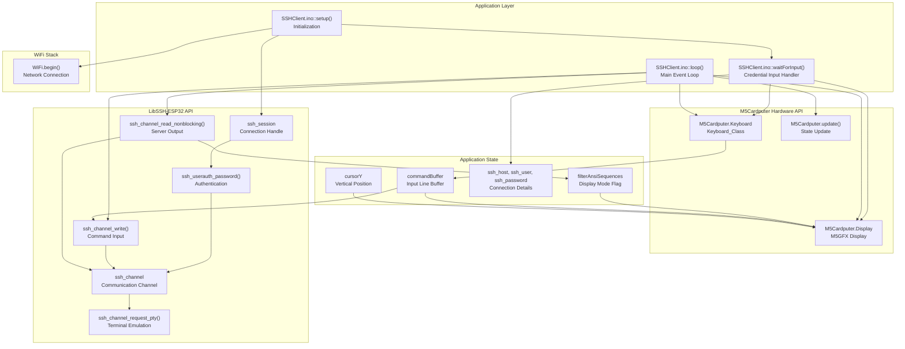
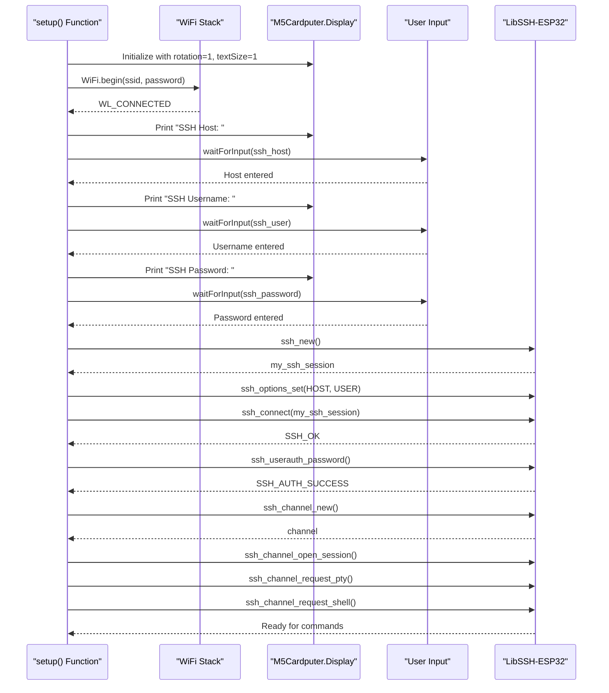
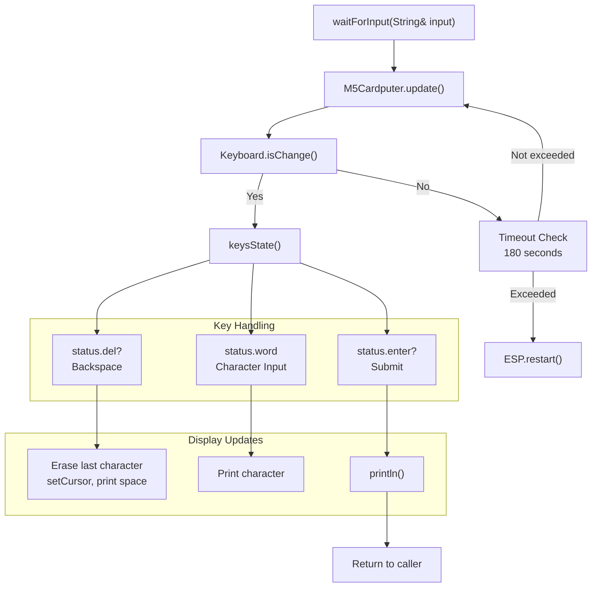
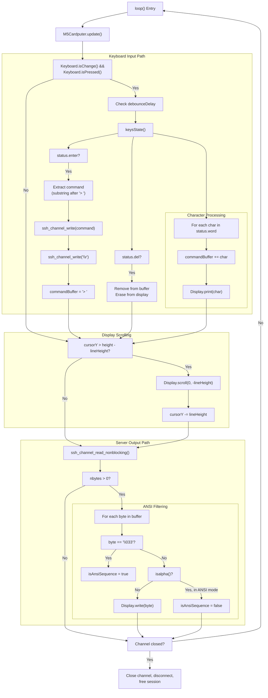
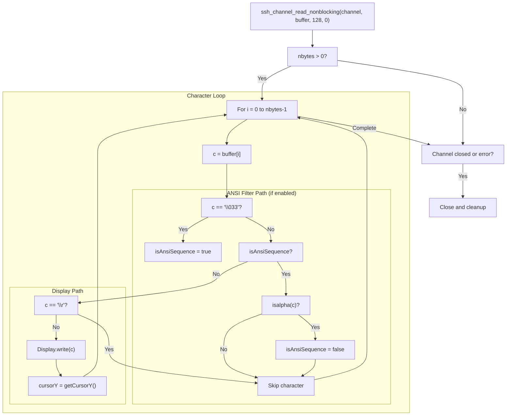

M5Cardputer SSH Client Application

# SSH Client Application

<details>
<summary>Relevant source files</summary>

The following files were used as context for generating this wiki page:

- [examples/Advanced/SSHClient/SSHClient.ino](examples/Advanced/SSHClient/SSHClient.ino)

</details>


## Purpose and Scope

This page documents the SSH Client example application included with the M5Cardputer library. The application demonstrates how to build a terminal emulator that connects to remote SSH servers, providing interactive command-line access through the M5Cardputer's keyboard and display. It covers WiFi initialization, LibSSH-ESP32 session management, PTY (pseudo-terminal) configuration, keyboard input processing, display scrolling, and ANSI escape sequence filtering.

For general networking overview and IR communication features, see [Networking and Communication](#8). For keyboard input processing details, see [Keyboard_Class API](#4.1). For display text handling patterns, see [Text Input and Display Patterns](#5.1).

## Application Architecture

The SSH Client application integrates several subsystems to create a functional terminal emulator on the M5Cardputer device.



**Sources:** [examples/Advanced/SSHClient/SSHClient.ino:1-272]()

## Key Components

### Global State Variables

| Variable | Type | Purpose | Initial Value |
|----------|------|---------|---------------|
| `ssh_host` | `String` | SSH server hostname/IP | Empty string |
| `ssh_user` | `String` | SSH username | Empty string |
| `ssh_password` | `String` | SSH password | Empty string |
| `my_ssh_session` | `ssh_session` | LibSSH session handle | Created by `ssh_new()` |
| `channel` | `ssh_channel` | LibSSH channel handle | Created by `ssh_channel_new()` |
| `commandBuffer` | `String` | Current input line | `"> "` (prompt) |
| `cursorY` | `int` | Vertical cursor position | 0 |
| `filterAnsiSequences` | `bool` | ANSI filtering toggle | `true` |
| `lastKeyPressMillis` | `unsigned long` | Debounce timestamp | 0 |

**Sources:** [examples/Advanced/SSHClient/SSHClient.ino:26-44]()

### Configuration Constants

| Constant | Value | Purpose |
|----------|-------|---------|
| `lineHeight` | 32 | Vertical scroll increment in pixels |
| `debounceDelay` | 200 ms | Minimum time between key events |

**Sources:** [examples/Advanced/SSHClient/SSHClient.ino:34-36]()

## Initialization Sequence

The application follows a multi-stage initialization process to establish a fully functional SSH terminal session.



**Sources:** [examples/Advanced/SSHClient/SSHClient.ino:46-124]()

### WiFi Connection

The application connects to WiFi during setup using blocking calls:

```
WiFi.begin(ssid, password);
while (WiFi.status() != WL_CONNECTED) {
    delay(500);
    Serial.print(".");
}
```

The WiFi SSID and password must be hardcoded in the sketch at compile time ([examples/Advanced/SSHClient/SSHClient.ino:22-23]()).

**Sources:** [examples/Advanced/SSHClient/SSHClient.ino:56-61]()

### Credential Input with `waitForInput()`

The `waitForInput()` function implements a blocking input routine for collecting SSH credentials. It uses the keyboard subsystem to capture characters and display them in real-time.



**Key features:**
- **Debouncing**: 200ms delay between key presses ([examples/Advanced/SSHClient/SSHClient.ino:227]())
- **Backspace handling**: Removes characters from input buffer and display ([examples/Advanced/SSHClient/SSHClient.ino:235-247]())
- **Character accumulation**: Appends `status.word` characters to `currentInput` ([examples/Advanced/SSHClient/SSHClient.ino:249-256]())
- **Timeout protection**: Reboots after 180 seconds (3 minutes) of inactivity ([examples/Advanced/SSHClient/SSHClient.ino:265-270]())

**Sources:** [examples/Advanced/SSHClient/SSHClient.ino:224-272]()

### SSH Session Establishment

The LibSSH-ESP32 library requires a specific sequence of calls to establish an interactive shell session:

1. **Create session**: `ssh_session my_ssh_session = ssh_new()` ([examples/Advanced/SSHClient/SSHClient.ino:75]())
2. **Set options**: `ssh_options_set()` for host and user ([examples/Advanced/SSHClient/SSHClient.ino:80-81]())
3. **Connect**: `ssh_connect(my_ssh_session)` ([examples/Advanced/SSHClient/SSHClient.ino:83]())
4. **Authenticate**: `ssh_userauth_password()` with password ([examples/Advanced/SSHClient/SSHClient.ino:89-90]())
5. **Create channel**: `ssh_channel channel = ssh_channel_new(my_ssh_session)` ([examples/Advanced/SSHClient/SSHClient.ino:97]())
6. **Open session**: `ssh_channel_open_session(channel)` ([examples/Advanced/SSHClient/SSHClient.ino:98]())
7. **Request PTY**: `ssh_channel_request_pty(channel)` for terminal emulation ([examples/Advanced/SSHClient/SSHClient.ino:105]())
8. **Request shell**: `ssh_channel_request_shell(channel)` to start interactive shell ([examples/Advanced/SSHClient/SSHClient.ino:114]())

Each step includes error checking with early return on failure. The PTY request is critical for interactive terminal behavior, enabling proper line editing, cursor control, and command echoing on the remote server.

**Sources:** [examples/Advanced/SSHClient/SSHClient.ino:75-121]()

## Main Loop Operation

The `loop()` function implements the core terminal emulator logic, handling bidirectional communication between the keyboard and SSH server.



**Sources:** [examples/Advanced/SSHClient/SSHClient.ino:126-222]()

## Keyboard Input Processing

The application uses the M5Cardputer keyboard subsystem to capture user input with debouncing.

### Input Event Handling

The keyboard state is checked on each loop iteration:

```
if (M5Cardputer.Keyboard.isChange() && M5Cardputer.Keyboard.isPressed()) {
    unsigned long currentMillis = millis();
    if (currentMillis - lastKeyPressMillis >= debounceDelay) {
        lastKeyPressMillis = currentMillis;
        Keyboard_Class::KeysState status = M5Cardputer.Keyboard.keysState();
        // Process keys...
    }
}
```

**Sources:** [examples/Advanced/SSHClient/SSHClient.ino:130-134]()

### Character Accumulation

Characters from `status.word` are appended to `commandBuffer` and immediately displayed:

```
for (auto i : status.word) {
    commandBuffer += i;
    M5Cardputer.Display.print(i);
    cursorY = M5Cardputer.Display.getCursorY();
}
```

**Sources:** [examples/Advanced/SSHClient/SSHClient.ino:136-140]()

### Backspace Handling

The delete key removes the last character from both the buffer and display. The implementation protects the prompt (`"> "`) from deletion:

```
if (status.del && commandBuffer.length() > 2) {
    commandBuffer.remove(commandBuffer.length() - 1);
    M5Cardputer.Display.setCursor(
        M5Cardputer.Display.getCursorX() - 6,
        M5Cardputer.Display.getCursorY());
    M5Cardputer.Display.print(" ");
    M5Cardputer.Display.setCursor(
        M5Cardputer.Display.getCursorX() - 6,
        M5Cardputer.Display.getCursorY());
    cursorY = M5Cardputer.Display.getCursorY();
}
```

The cursor is moved back 6 pixels (character width), a space is printed to erase the character, and the cursor is moved back again to position for the next character.

**Sources:** [examples/Advanced/SSHClient/SSHClient.ino:142-152]()

### Command Submission

When Enter is pressed, the command is extracted (excluding the `"> "` prompt), sent to the SSH server, and the buffer is reset:

```
if (status.enter) {
    commandBuffer.trim();
    String message = commandBuffer.substring(2);  // Exclude "> "
    ssh_channel_write(channel, message.c_str(), message.length());
    ssh_channel_write(channel, "\r", 1);  // Send carriage return
    
    commandBuffer = "> ";  // Reset to prompt
    M5Cardputer.Display.print('\n');
    cursorY = M5Cardputer.Display.getCursorY();
}
```

Note that only a single carriage return (`"\r"`) is sent. Different servers may require `"\n"` or `"\r\n"` as noted in the code comments.

**Sources:** [examples/Advanced/SSHClient/SSHClient.ino:154-170]()

## Display Management

### Automatic Scrolling

When the cursor reaches the bottom of the display, the content scrolls upward by one line:

```
if (cursorY > M5Cardputer.Display.height() - lineHeight) {
    M5Cardputer.Display.scroll(0, -lineHeight);
    cursorY -= lineHeight;
    M5Cardputer.Display.setCursor(M5Cardputer.Display.getCursorX(), cursorY);
}
```

The `lineHeight` constant (32 pixels) determines the scroll increment. The cursor position is adjusted to remain on-screen after scrolling.

**Sources:** [examples/Advanced/SSHClient/SSHClient.ino:174-180]()

### Display Configuration

The display is configured during setup with:
- **Rotation**: 1 (landscape orientation) ([examples/Advanced/SSHClient/SSHClient.ino:52]())
- **Text size**: 1 (default font size) ([examples/Advanced/SSHClient/SSHClient.ino:53]())

## Server Output Processing

The application reads data from the SSH channel and processes it for display.



**Sources:** [examples/Advanced/SSHClient/SSHClient.ino:183-221]()

### Non-Blocking Read

The application uses `ssh_channel_read_nonblocking()` with a 128-byte buffer to avoid blocking the main loop:

```
char buffer[128];
int nbytes = ssh_channel_read_nonblocking(channel, buffer, sizeof(buffer), 0);
```

This allows the application to continue processing keyboard input even when no server output is available.

**Sources:** [examples/Advanced/SSHClient/SSHClient.ino:183-185]()

### ANSI Escape Sequence Filtering

The `filterAnsiSequences` flag controls whether ANSI escape codes are removed from the output. When enabled, the filter operates as follows:

1. When `'\033'` (ESC) is encountered, set `isAnsiSequence = true` ([examples/Advanced/SSHClient/SSHClient.ino:193-194]())
2. While in ANSI sequence mode, skip all characters ([examples/Advanced/SSHClient/SSHClient.ino:195-199]())
3. When an alphabetic character is found (the terminating character of ANSI sequences), set `isAnsiSequence = false` ([examples/Advanced/SSHClient/SSHClient.ino:196-198]())
4. Only display characters when not in ANSI sequence mode ([examples/Advanced/SSHClient/SSHClient.ino:200-204]())

This simple state machine filters most common ANSI escape sequences including:
- Cursor positioning codes (e.g., `\033[H`)
- Text formatting codes (e.g., `\033[1m` for bold)
- Color codes (e.g., `\033[31m` for red text)

Carriage return characters (`'\r'`) are always filtered to prevent display issues ([examples/Advanced/SSHClient/SSHClient.ino:201]()).

**Sources:** [examples/Advanced/SSHClient/SSHClient.ino:189-211]()

## Session Cleanup

When the channel is closed or an error occurs, the application performs orderly cleanup:

```
if (nbytes < 0 || ssh_channel_is_closed(channel)) {
    ssh_channel_close(channel);
    ssh_channel_free(channel);
    ssh_disconnect(my_ssh_session);
    ssh_free(my_ssh_session);
    M5Cardputer.Display.println("\nSSH session closed.");
    return;
}
```

The cleanup sequence follows LibSSH-ESP32 best practices:
1. Close the channel
2. Free the channel handle
3. Disconnect the session
4. Free the session handle

**Sources:** [examples/Advanced/SSHClient/SSHClient.ino:214-221]()

## Configuration and Customization

### Required Changes

Before compiling, users must modify the following constants:

| Constant | Location | Purpose |
|----------|----------|---------|
| `ssid` | [Line 22]() | WiFi network SSID |
| `password` | [Line 23]() | WiFi network password |

**Sources:** [examples/Advanced/SSHClient/SSHClient.ino:22-23]()

### Optional Configuration

| Variable | Default | Purpose | Modification Impact |
|----------|---------|---------|---------------------|
| `filterAnsiSequences` | `true` | Enable ANSI filtering | Set to `false` to display raw ANSI codes |
| `debounceDelay` | 200 ms | Key debounce time | Reduce for faster input, increase if keys repeat |
| `lineHeight` | 32 pixels | Scroll increment | Adjust based on font size |

**Sources:** [examples/Advanced/SSHClient/SSHClient.ino:43-44](), [examples/Advanced/SSHClient/SSHClient.ino:34-36]()

## Limitations and Considerations

### Terminal Emulation Limitations

- **No cursor control**: The application does not interpret ANSI cursor positioning codes beyond filtering them
- **No line editing**: Server-side line editing (arrow keys, home/end) is not supported
- **Single-line input**: Commands must fit on one line; multi-line editing is not implemented
- **No scrollback**: Previous output cannot be scrolled back once it moves off-screen

### Security Considerations

- **Plaintext credentials**: SSH credentials are hardcoded in the sketch or entered at runtime but stored in plaintext in memory
- **No host key verification**: The application does not verify SSH host keys, making it vulnerable to man-in-the-middle attacks
- **Password authentication only**: Public key authentication is not implemented

### Performance Considerations

- **Small buffer size**: The 128-byte read buffer may cause display lag with high-volume server output
- **Synchronous keyboard handling**: The 200ms debounce delay adds perceptible latency to keyboard input
- **No output buffering**: Each character is individually written to the display, which may be slow for bulk output

## Integration with M5Cardputer Systems

The SSH Client example demonstrates integration of multiple M5Cardputer subsystems:

| Subsystem | Integration Point | Purpose |
|-----------|-------------------|---------|
| Keyboard | `M5Cardputer.Keyboard.keysState()` | Capture user input |
| Display | `M5Cardputer.Display` (M5GFX) | Render terminal output |
| WiFi | ESP32 WiFi stack | Network connectivity |
| LibSSH-ESP32 | `ssh_*` function calls | SSH protocol implementation |

The application follows the standard M5Cardputer event loop pattern:
1. Call `M5Cardputer.update()` to refresh peripheral states
2. Check for keyboard changes
3. Process any pending events
4. Update display as needed

This pattern is consistent with other M5Cardputer examples like the REPL application (see [REPL Application](#9.1)).

**Sources:** [examples/Advanced/SSHClient/SSHClient.ino:126-172]()