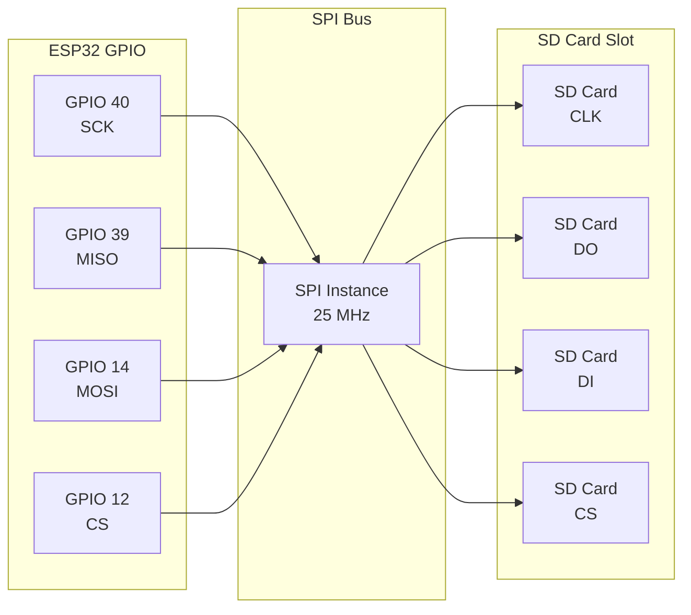
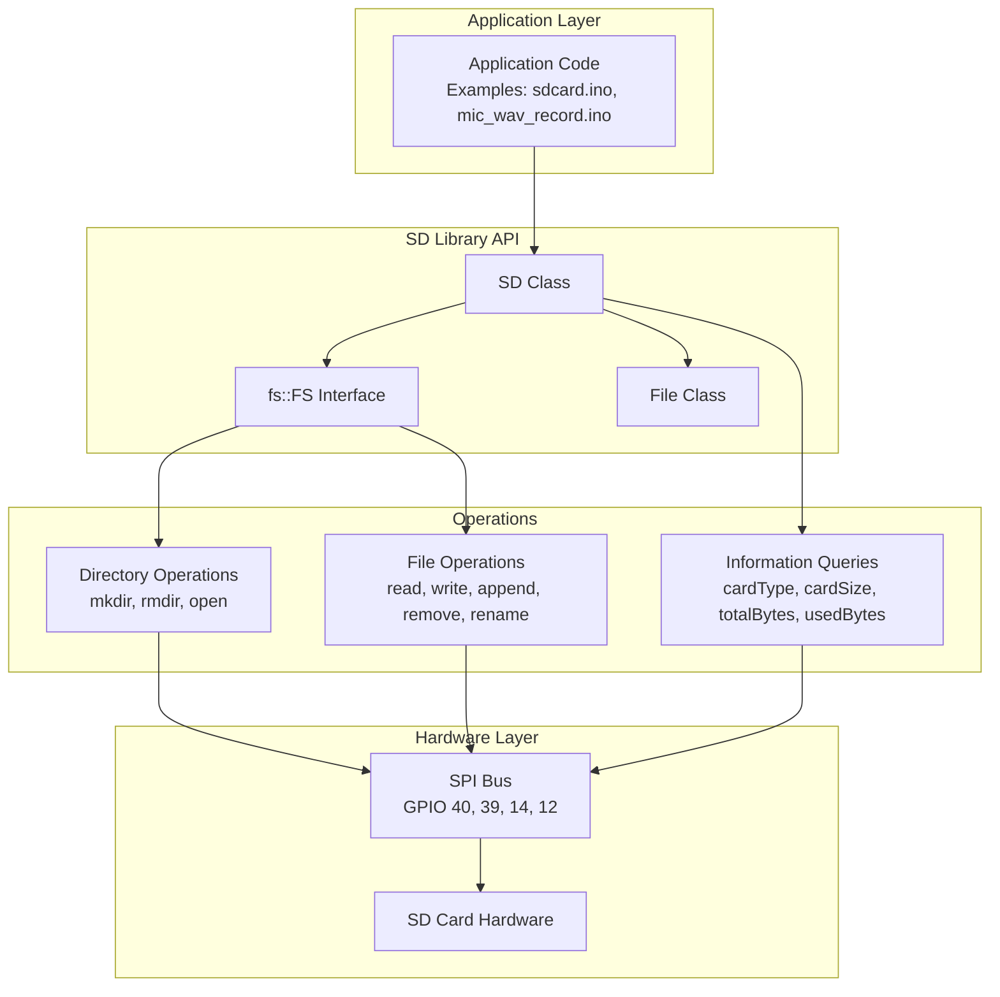
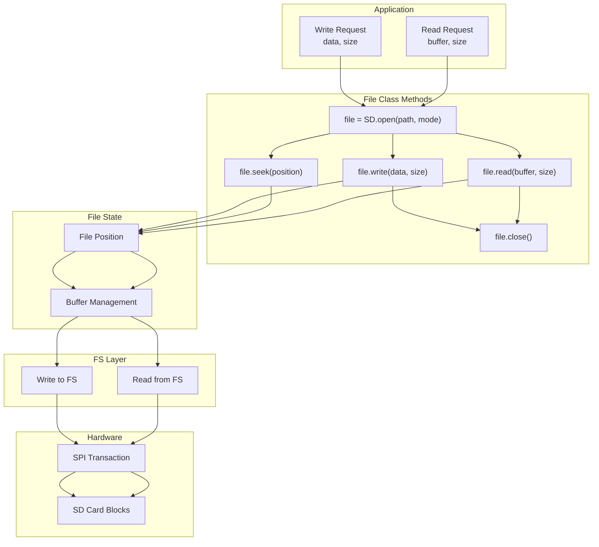
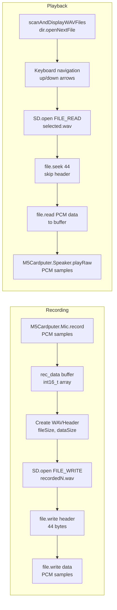

M5Cardputer Storage and File System

# Storage and File System

<details>
<summary>Relevant source files</summary>

The following files were used as context for generating this wiki page:

- [examples/Basic/mic_wav_record/mic_wav_record.ino](examples/Basic/mic_wav_record/mic_wav_record.ino)
- [examples/Basic/sdcard/sdcard.ino](examples/Basic/sdcard/sdcard.ino)

</details>


This document covers SD card storage operations on the M5Cardputer, including hardware configuration, file system initialization, file and directory management, and specialized file format handling. The M5Cardputer provides SD card access through an SPI interface, enabling applications to store and retrieve data persistently.

For audio recording and playback operations that use the file system, see [Audio System](#6).

## Overview

The M5Cardputer connects to SD cards via SPI bus using dedicated GPIO pins. The Arduino SD library provides the file system abstraction layer, supporting standard file operations including read, write, append, delete, and directory management. Both example applications demonstrate the complete workflow from hardware initialization through advanced file operations.

**Sources:** [examples/Basic/sdcard/sdcard.ino:1-274](), [examples/Basic/mic_wav_record/mic_wav_record.ino:1-399]()

## SD Card Hardware Configuration

The SD card interface uses a dedicated SPI bus with the following pin assignments:

| Signal | GPIO Pin | Function |
|--------|----------|----------|
| SCK | 40 | SPI Clock |
| MISO | 39 | Master In, Slave Out |
| MOSI | 14 | Master Out, Slave In |
| CS | 12 | Chip Select |

The SPI bus operates at 25 MHz for SD card communication. These pins are defined as constants in both example applications:

```
#define SD_SPI_SCK_PIN  40
#define SD_SPI_MISO_PIN 39
#define SD_SPI_MOSI_PIN 14
#define SD_SPI_CS_PIN   12
```

### Hardware Connection Diagram



**Sources:** [examples/Basic/sdcard/sdcard.ino:21-24](), [examples/Basic/mic_wav_record/mic_wav_record.ino:18-21]()

## SD Card Initialization

SD card initialization requires two steps: SPI bus configuration and SD library initialization.

### SPI Bus Setup

The SPI bus must be initialized with the correct pin assignments before the SD library can access the card. This is done using `SPI.begin()`:

```cpp
SPI.begin(SD_SPI_SCK_PIN, SD_SPI_MISO_PIN, SD_SPI_MOSI_PIN, SD_SPI_CS_PIN);
```

**Sources:** [examples/Basic/sdcard/sdcard.ino:52](), [examples/Basic/mic_wav_record/mic_wav_record.ino:74]()

### SD Library Initialization

After SPI bus configuration, initialize the SD library with `SD.begin()`, passing the CS pin, SPI instance, and clock frequency:

```cpp
if (!SD.begin(SD_SPI_CS_PIN, SPI, 25000000)) {
    // Initialization failed
}
```

The third parameter (25000000) specifies 25 MHz clock speed. If initialization fails, the function returns `false`.

**Sources:** [examples/Basic/sdcard/sdcard.ino:54-61](), [examples/Basic/mic_wav_record/mic_wav_record.ino:76-79]()

### Card Detection and Information

After successful initialization, query card properties:

| Method | Description | Return Type |
|--------|-------------|-------------|
| `SD.cardType()` | Returns card type | `uint8_t` |
| `SD.cardSize()` | Returns card capacity in bytes | `uint64_t` |
| `SD.totalBytes()` | Returns total file system bytes | `uint64_t` |
| `SD.usedBytes()` | Returns used file system bytes | `uint64_t` |

The `cardType()` method returns one of:
- `CARD_NONE` - No card detected
- `CARD_MMC` - MultiMediaCard
- `CARD_SD` - Standard Capacity SD
- `CARD_SDHC` - High Capacity SD

**Sources:** [examples/Basic/sdcard/sdcard.ino:63-82](), [examples/Basic/mic_wav_record/mic_wav_record.ino:80-96]()

## File System API Architecture



**Sources:** [examples/Basic/sdcard/sdcard.ino:26-34](), [examples/Basic/mic_wav_record/mic_wav_record.ino:55-59]()

## Directory Operations

Directory operations are performed through the `fs::FS` interface, which the `SD` object implements.

### Listing Directory Contents

Open a directory and iterate through its contents using `openNextFile()`:

```cpp
File root = fs.open(dirname);
if (root && root.isDirectory()) {
    File file = root.openNextFile();
    while (file) {
        if (file.isDirectory()) {
            // Handle subdirectory
        } else {
            // Handle file: file.name(), file.size()
        }
        file = root.openNextFile();
    }
}
```

The `listDir()` function in [examples/Basic/sdcard/sdcard.ino:102-131]() demonstrates recursive directory traversal with a depth parameter.

### Creating and Removing Directories

| Operation | Method | Example |
|-----------|--------|---------|
| Create | `fs.mkdir(path)` | `SD.mkdir("/mydir")` |
| Remove | `fs.rmdir(path)` | `SD.rmdir("/mydir")` |

Both methods return `bool` indicating success or failure. Note that `rmdir()` only removes empty directories.

**Sources:** [examples/Basic/sdcard/sdcard.ino:133-149]()

### Directory Scanning Pattern

The WAV recording example demonstrates a practical pattern for scanning specific file types:

```cpp
File dir = SD.open("/");
std::vector<String> wavFiles;
while (File entry = dir.openNextFile()) {
    if (!entry.isDirectory() && String(entry.name()).endsWith(".wav")) {
        wavFiles.push_back(String(entry.name()));
    }
    entry.close();
}
dir.close();
```

**Sources:** [examples/Basic/mic_wav_record/mic_wav_record.ino:193-216]()

## File I/O Operations

### Opening Files

Files are opened using `fs.open()` with optional mode flags:

| Mode | Flag | Description |
|------|------|-------------|
| Read | (default) | Open for reading; file must exist |
| Write | `FILE_WRITE` | Create or truncate file for writing |
| Append | `FILE_APPEND` | Open for appending; preserves existing content |

```cpp
File file = fs.open(path);              // Read mode
File file = fs.open(path, FILE_WRITE);  // Write mode
File file = fs.open(path, FILE_APPEND); // Append mode
```

**Sources:** [examples/Basic/sdcard/sdcard.ino:151-196]()

### Reading Files

The `File` class provides multiple read methods:

```cpp
File file = fs.open(path);
if (file) {
    // Read single byte
    int byte = file.read();
    
    // Read buffer
    uint8_t buffer[512];
    size_t bytesRead = file.read(buffer, sizeof(buffer));
    
    // Check if data available
    while (file.available()) {
        // Process data
    }
    
    file.close();
}
```

**Sources:** [examples/Basic/sdcard/sdcard.ino:151-165](), [examples/Basic/sdcard/sdcard.ino:217-240]()

### Writing Files

Write operations use `print()` or `write()` methods:

```cpp
File file = fs.open(path, FILE_WRITE);
if (file) {
    // Write string/text
    file.print(message);
    
    // Write raw bytes
    file.write(buffer, bufferSize);
    
    file.close();
}
```

**Sources:** [examples/Basic/sdcard/sdcard.ino:167-196]()

### File Manipulation

| Operation | Method | Example |
|-----------|--------|---------|
| Rename | `fs.rename(oldPath, newPath)` | `SD.rename("/old.txt", "/new.txt")` |
| Delete | `fs.remove(path)` | `SD.remove("/file.txt")` |
| Seek | `file.seek(position)` | `file.seek(44)` |

The `seek()` method positions the file pointer at a specific byte offset, useful for skipping headers or accessing specific data locations.

**Sources:** [examples/Basic/sdcard/sdcard.ino:199-215](), [examples/Basic/mic_wav_record/mic_wav_record.ino:270]()

## File I/O Data Flow



**Sources:** [examples/Basic/sdcard/sdcard.ino:217-256](), [examples/Basic/mic_wav_record/mic_wav_record.ino:258-282]()

## WAV File Format Handling

The microphone recording example demonstrates specialized handling for WAV audio files, a common use case for persistent storage.

### WAV Header Structure

The WAV file format requires a 44-byte header before the audio data. The `WAVHeader` struct defines this structure:

```cpp
struct WAVHeader {
    char riff[4]           = {'R', 'I', 'F', 'F'};
    uint32_t fileSize      = 0;                      // 36 + data size
    char wave[4]           = {'W', 'A', 'V', 'E'};
    char fmt[4]            = {'f', 'm', 't', ' '};
    uint32_t fmtSize       = 16;
    uint16_t audioFormat   = 1;                      // PCM
    uint16_t numChannels   = 1;                      // Mono
    uint32_t sampleRate    = record_samplerate;      // 16000 Hz
    uint32_t byteRate      = record_samplerate * sizeof(int16_t);
    uint16_t blockAlign    = sizeof(int16_t);
    uint16_t bitsPerSample = 16;
    char data[4]           = {'d', 'a', 't', 'a'};
    uint32_t dataSize      = 0;                      // Audio data bytes
};
```

**Sources:** [examples/Basic/mic_wav_record/mic_wav_record.ino:39-53]()

### Writing WAV Files

The `saveWAVToSD()` function demonstrates the complete workflow:

1. Generate unique filename using counter
2. Open file in write mode
3. Populate header with file and data sizes
4. Write header structure (44 bytes)
5. Write audio data
6. Close file

```cpp
bool saveWAVToSD(int16_t* data, size_t dataSize) {
    char filename[32];
    snprintf(filename, sizeof(filename), "/recorded%lu.wav", file_counter++);
    
    File file = SD.open(filename, FILE_WRITE);
    if (!file) return false;
    
    WAVHeader header;
    header.fileSize = 36 + dataSize * sizeof(int16_t);
    header.dataSize = dataSize * sizeof(int16_t);
    
    file.write((uint8_t*)&header, sizeof(WAVHeader));
    file.write((uint8_t*)data, dataSize * sizeof(int16_t));
    file.close();
    
    return true;
}
```

**Sources:** [examples/Basic/mic_wav_record/mic_wav_record.ino:375-398]()

### Reading WAV Files

When reading WAV files, skip the 44-byte header using `file.seek(44)` before reading audio data:

```cpp
File file = SD.open(filePath.c_str());
if (file) {
    file.seek(44);  // Skip WAV header
    size_t bytesRead = file.read((uint8_t*)buffer, bufferSize);
    file.close();
}
```

**Sources:** [examples/Basic/mic_wav_record/mic_wav_record.ino:258-282]()

### WAV File Management Pattern

The recording example implements a complete file browser with the following features:

- Automatic scanning for `.wav` files: [examples/Basic/mic_wav_record/mic_wav_record.ino:193-216]()
- Keyboard navigation (up/down arrows): [examples/Basic/mic_wav_record/mic_wav_record.ino:227-234]()
- File deletion support: [examples/Basic/mic_wav_record/mic_wav_record.ino:237-248]()
- File selection and playback: [examples/Basic/mic_wav_record/mic_wav_record.ino:251-253]()
- Display update with visual selection: [examples/Basic/mic_wav_record/mic_wav_record.ino:164-192]()

## WAV File Processing Pipeline



**Sources:** [examples/Basic/mic_wav_record/mic_wav_record.ino:55-59](), [examples/Basic/mic_wav_record/mic_wav_record.ino:114-163](), [examples/Basic/mic_wav_record/mic_wav_record.ino:193-256](), [examples/Basic/mic_wav_record/mic_wav_record.ino:258-282](), [examples/Basic/mic_wav_record/mic_wav_record.ino:375-398]()

## Performance Considerations

### Buffered I/O

The SD card test example demonstrates buffered file I/O for performance measurement. Reading and writing in larger blocks (512 bytes or more) improves throughput:

```cpp
static uint8_t buf[512];
// Read in 512-byte blocks
file.read(buf, 512);
// Write in 512-byte blocks  
file.write(buf, 512);
```

**Sources:** [examples/Basic/sdcard/sdcard.ino:217-256]()

### SPI Clock Speed

The SD library is initialized with 25 MHz clock speed, balancing reliability and performance. This is specified in the third parameter of `SD.begin()`:

```cpp
SD.begin(SD_SPI_CS_PIN, SPI, 25000000)
```

**Sources:** [examples/Basic/sdcard/sdcard.ino:54](), [examples/Basic/mic_wav_record/mic_wav_record.ino:76]()

## Common Patterns

### Error Checking Pattern

Both examples demonstrate consistent error checking:

```cpp
if (!SD.begin(SD_SPI_CS_PIN, SPI, 25000000)) {
    // Handle initialization failure
    while (1);
}

File file = SD.open(path);
if (!file) {
    // Handle file open failure
    return;
}
```

**Sources:** [examples/Basic/sdcard/sdcard.ino:54-61](), [examples/Basic/mic_wav_record/mic_wav_record.ino:76-79]()

### Resource Management Pattern

Always close files after use to ensure data is flushed and resources are released:

```cpp
File file = SD.open(path);
// ... perform operations ...
file.close();
```

**Sources:** [examples/Basic/sdcard/sdcard.ino:164](), [examples/Basic/sdcard/sdcard.ino:180](), [examples/Basic/sdcard/sdcard.ino:196]()

### Dynamic Filename Generation

The WAV recording example uses a counter for unique filenames:

```cpp
static uint32_t file_counter = 0;
char filename[32];
snprintf(filename, sizeof(filename), "/recorded%lu.wav", file_counter++);
```

**Sources:** [examples/Basic/mic_wav_record/mic_wav_record.ino:34](), [examples/Basic/mic_wav_record/mic_wav_record.ino:378-379]()