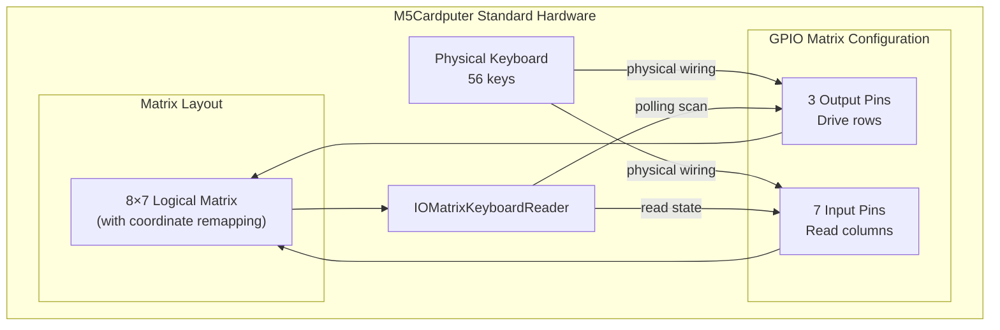
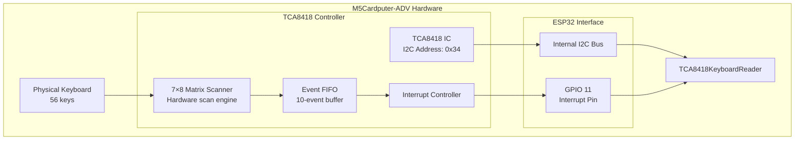
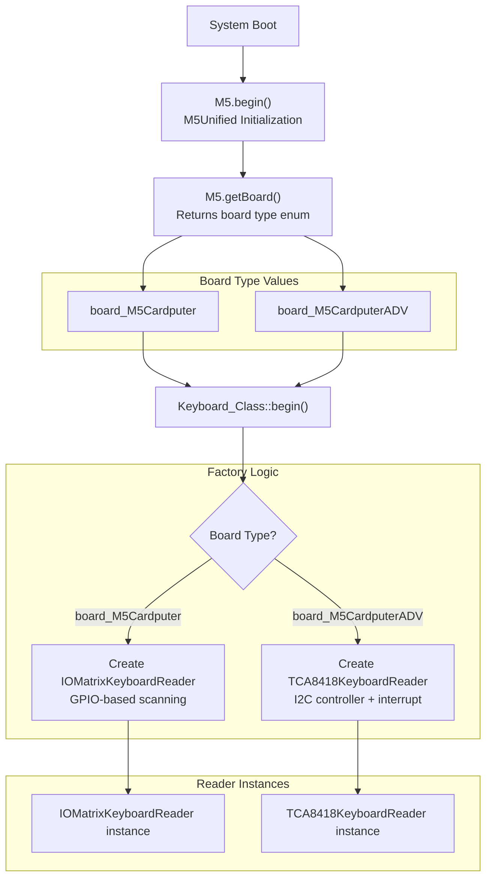
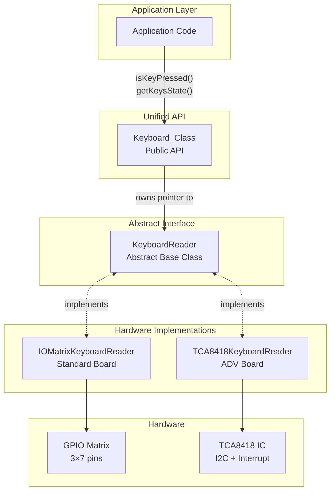

M5Cardputer Supported Hardware

# Supported Hardware

Relevant source files

The following files were used as context for generating this wiki page:

- [README.md](README.md)
- [library.properties](library.properties)
- [src/utility/Keyboard/KeyboardReader/TCA8418.cpp](src/utility/Keyboard/KeyboardReader/TCA8418.cpp)
- [src/utility/common.h](src/utility/common.h)

## Purpose and Scope

This document describes the two hardware variants supported by the M5Cardputer library: the **M5Cardputer** (standard) and **M5Cardputer-ADV** boards. It details their hardware differences, particularly in keyboard implementation, and explains how the library provides automatic hardware detection and variant-specific initialization while maintaining a unified API.

For information about the library's external dependencies, see [Library Dependencies](#1.1). For initialization procedures and runtime board detection algorithms, see [Hardware Variant Detection](#11.2).

**Sources:** [library.properties:5]()

---

## Hardware Variants Overview

The library supports two distinct hardware variants of the M5Cardputer board, which differ primarily in their keyboard hardware implementation:

| Feature | M5Cardputer (Standard) | M5Cardputer-ADV |
|---------|------------------------|-----------------|
| **Board Identifier** | `board_M5Cardputer` | `board_M5CardputerADV` |
| **Keyboard Technology** | Direct GPIO matrix scanning | TCA8418 I2C keyboard controller |
| **Keyboard Matrix Size** | 8×7 (remapped from 3×7 GPIO) | 7×8 (TCA8418 native) |
| **Interrupt Support** | Polling-based | Hardware interrupt on GPIO 11 |
| **I2C Address** | N/A | 0x34 (TCA8418) |
| **GPIO Pin Usage** | 3 output + 7 input pins | 1 interrupt pin |
| **KeyboardReader Implementation** | `IOMatrixKeyboardReader` | `TCA8418KeyboardReader` |

**Sources:** [src/utility/Keyboard/KeyboardReader/TCA8418.cpp:12-13](), high-level diagrams

---

## M5Cardputer (Standard Board)

### Hardware Architecture

The standard M5Cardputer board uses direct GPIO matrix scanning for keyboard input. The physical keyboard is wired as a matrix that requires dedicated GPIO pins for scanning.

**Diagram: M5Cardputer Standard Keyboard Hardware Architecture**

### Keyboard Implementation

The `IOMatrixKeyboardReader` class implements keyboard scanning by:
1. Driving output pins high/low in sequence
2. Reading input pin states for each output configuration
3. Detecting key presses based on continuity through the matrix
4. Applying coordinate remapping to translate physical matrix positions to logical key positions

The implementation uses polling rather than interrupts, requiring periodic `update()` calls.

**Sources:** High-level diagrams, inferred from keyboard architecture description

---

## M5Cardputer-ADV

### Hardware Architecture

The M5Cardputer-ADV board uses the TCA8418 I2C keyboard controller IC, which handles matrix scanning in hardware and provides interrupt-driven event notification.

**Diagram: M5Cardputer-ADV Keyboard Hardware Architecture**

### TCA8418 Controller Details

The TCA8418 is a dedicated keyboard controller that:
- Performs hardware matrix scanning autonomously
- Stores up to 10 key events in an internal FIFO
- Generates interrupts when events are available
- Operates on the internal I2C bus at address `0x34`
- Uses GPIO 11 as the interrupt notification pin (default, configurable)

**Sources:** [src/utility/Keyboard/KeyboardReader/TCA8418.cpp:12-13]()

### Interrupt Configuration

The interrupt pin configuration occurs during initialization:

[src/utility/Keyboard/KeyboardReader/TCA8418.cpp:42-46]()

The interrupt service routine sets a flag that triggers event processing in the next `update()` call:

[src/utility/Keyboard/KeyboardReader/TCA8418.cpp:22-26]()

**Sources:** [src/utility/Keyboard/KeyboardReader/TCA8418.cpp:15-49]()

---

## Hardware Detection and Automatic Reader Selection

### Board Detection Flow

The library automatically detects the hardware variant at runtime and instantiates the appropriate keyboard reader implementation. This process follows the Factory pattern.

**Diagram: Hardware Detection and Keyboard Reader Factory Pattern**

### TCA8418KeyboardReader Initialization

The constructor accepts an optional interrupt pin parameter, defaulting to GPIO 11 for the M5Cardputer-ADV:

[src/utility/Keyboard/KeyboardReader/TCA8418.cpp:15-20]()

The `begin()` method initializes the TCA8418 controller and configures the interrupt:

[src/utility/Keyboard/KeyboardReader/TCA8418.cpp:28-50]()

**Sources:** [src/utility/Keyboard/KeyboardReader/TCA8418.cpp:15-50]()

---

## Coordinate Remapping

Both hardware variants use different physical matrix layouts but map to the same logical keyboard layout. Each reader implementation includes coordinate remapping logic.

### M5Cardputer-ADV Remapping

The TCA8418 reports events in its native 7×8 matrix coordinates, which are remapped to match the standard M5Cardputer layout:

[src/utility/Keyboard/KeyboardReader/TCA8418.cpp:87-101]()

This remapping algorithm transforms:
- **Column calculation:** `col = (row * 2) + (col > 3 ? 1 : 0)`
- **Row calculation:** `row = (col + 4) % 4`

**Sources:** [src/utility/Keyboard/KeyboardReader/TCA8418.cpp:87-101]()

---

## Unified Keyboard API

Despite the hardware differences, both implementations satisfy the `KeyboardReader` abstract interface, providing identical functionality to applications:

**Diagram: Hardware Abstraction Through Polymorphism**

Applications interact exclusively with `Keyboard_Class` methods such as:
- `isKeyPressed(char key)` - Check if a specific key is pressed
- `getKeysState()` - Retrieve complete keyboard state
- `isChange()` - Detect state changes
- `update()` - Process hardware events

The keyboard reader implementation is entirely transparent to application code, enabling the same application to run on both hardware variants without modification.

**Sources:** High-level diagrams, architectural descriptions

---

## Hardware Specification Summary

### Pin Assignments

| Signal | M5Cardputer | M5Cardputer-ADV |
|--------|-------------|-----------------|
| **Keyboard Output** | GPIO (3 pins) | N/A |
| **Keyboard Input** | GPIO (7 pins) | N/A |
| **I2C SDA** | N/A | Internal I2C Bus |
| **I2C SCL** | N/A | Internal I2C Bus |
| **Interrupt** | N/A | GPIO 11 (default) |

### Communication Parameters

| Parameter | M5Cardputer | M5Cardputer-ADV |
|-----------|-------------|-----------------|
| **Scan Method** | GPIO polling | Hardware scan + I2C read |
| **Update Frequency** | Application-controlled | Interrupt-driven |
| **I2C Address** | N/A | 0x34 |
| **I2C Clock** | N/A | Standard (100 kHz) or Fast (400 kHz) |
| **Event Buffer** | Immediate processing | 10-event FIFO in TCA8418 |

**Sources:** [src/utility/Keyboard/KeyboardReader/TCA8418.cpp:12-13](), high-level diagrams

---

## Compatibility Matrix

The library maintains full API compatibility across both hardware variants:

| Feature | M5Cardputer | M5Cardputer-ADV | Notes |
|---------|-------------|-----------------|-------|
| **All Keyboard_Class methods** | ✓ | ✓ | Identical API |
| **Character mapping** | ✓ | ✓ | Same key map |
| **Modifier keys** | ✓ | ✓ | Shift, Ctrl, Alt, Fn, Opt |
| **HID key codes** | ✓ | ✓ | USB HID standard |
| **Multi-key press** | ✓ | ✓ | Full N-key rollover |
| **Interrupt support** | — | ✓ | ADV only |
| **Power efficiency** | Standard | Improved | ADV uses hardware scanning |

**Sources:** High-level diagrams, architectural descriptions

---

## Development Considerations

When developing applications for the M5Cardputer library:

1. **Hardware Agnostic Code:** Write applications using the `Keyboard_Class` API without hardware-specific logic
2. **No Manual Detection:** Never manually detect board type; the library handles this automatically
3. **Update Call Required:** Both implementations require periodic `update()` calls, though ADV uses interrupts internally
4. **Initialization Order:** Always call `M5Cardputer.begin()` before accessing keyboard functionality

For detailed keyboard API documentation, see [Keyboard_Class API](#4.1). For information on implementing custom keyboard readers for new hardware, see [Creating Custom Keyboard Readers](#11.1).

**Sources:** High-level diagrams, architectural descriptions