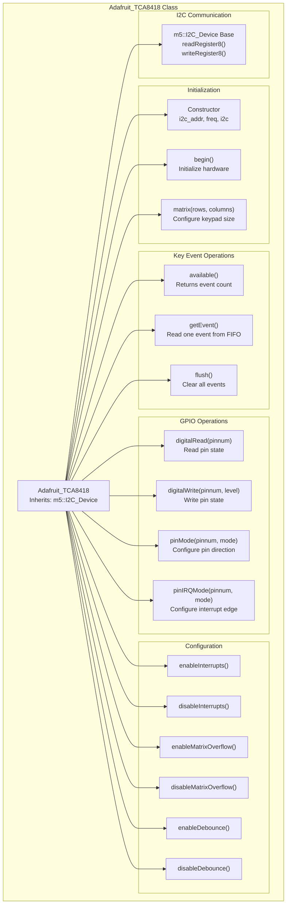
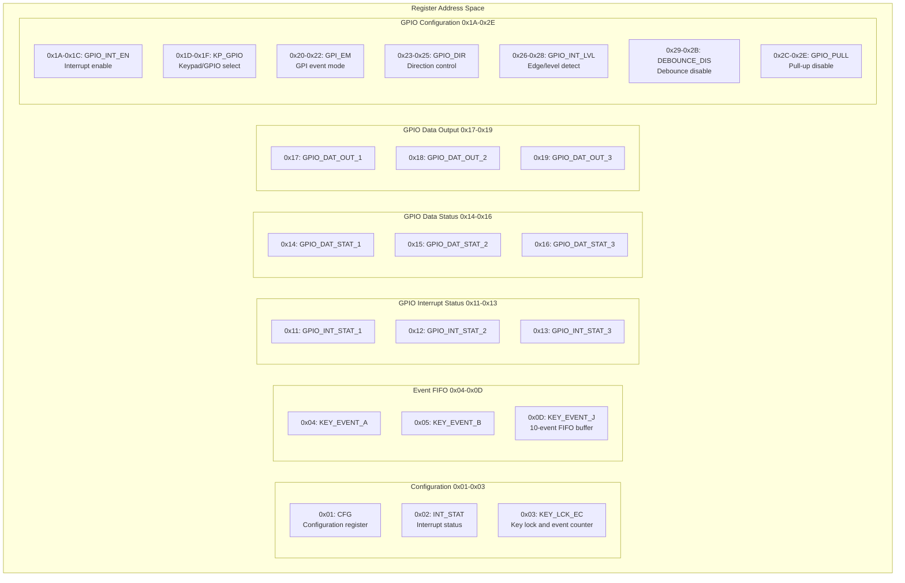
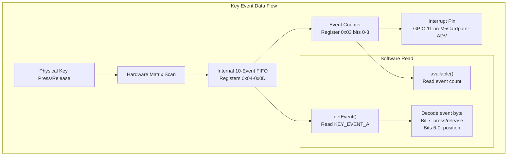
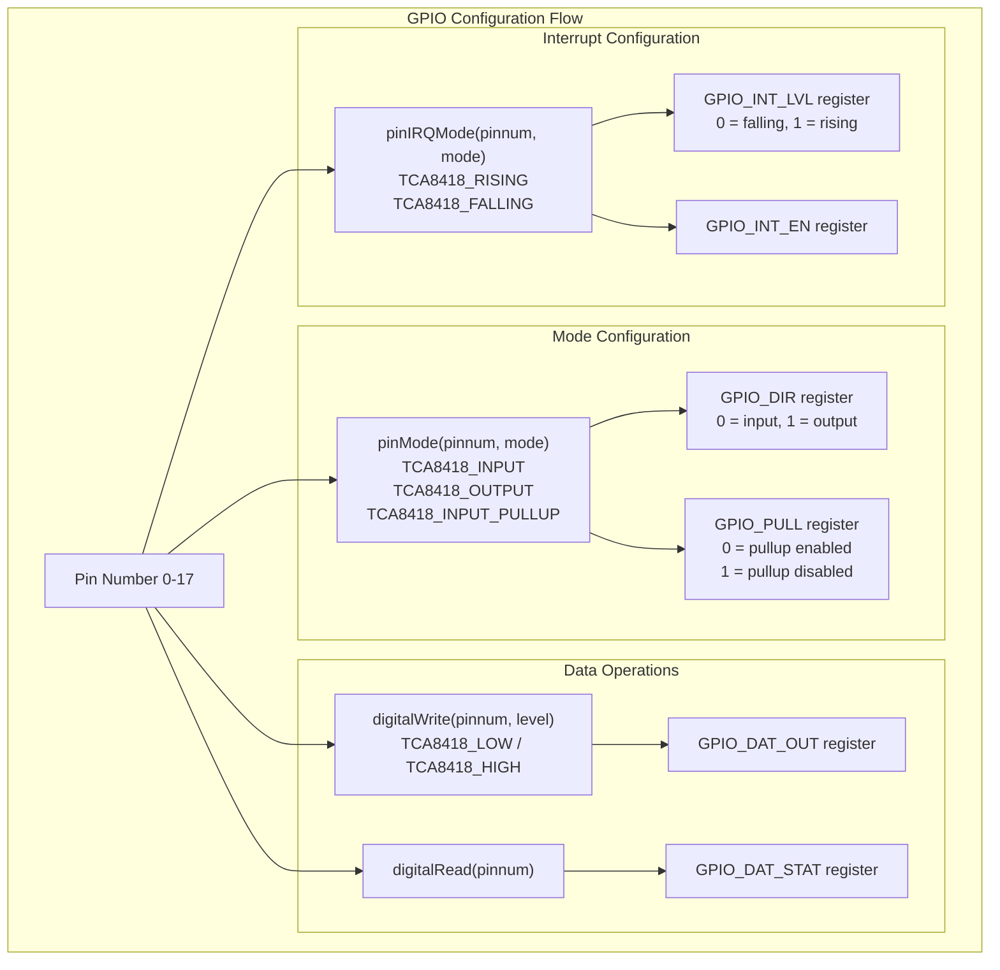

M5Cardputer TCA8418 Driver Reference

# TCA8418 Driver Reference

<details>
<summary>Relevant source files</summary>

The following files were used as context for generating this wiki page:

- [src/utility/Adafruit_TCA8418/Adafruit_TCA8418.cpp](src/utility/Adafruit_TCA8418/Adafruit_TCA8418.cpp)
- [src/utility/Adafruit_TCA8418/Adafruit_TCA8418.h](src/utility/Adafruit_TCA8418/Adafruit_TCA8418.h)
- [src/utility/Adafruit_TCA8418/Adafruit_TCA8418_registers.h](src/utility/Adafruit_TCA8418/Adafruit_TCA8418_registers.h)
- [src/utility/Keyboard/Keyboard_def.h](src/utility/Keyboard/Keyboard_def.h)

</details>


This document provides low-level reference documentation for the `Adafruit_TCA8418` driver class, which interfaces with the TCA8418 I2C keypad matrix controller and GPIO expander chip used in the M5Cardputer-ADV hardware. This page covers the driver API, register map, I2C communication protocol, event handling, and GPIO expander functionality.

For information about how this driver is integrated into the M5Cardputer keyboard system, see [TCA8418 Implementation (M5Cardputer-ADV)](#4.6). For higher-level keyboard API usage, see [Keyboard_Class API](#4.1).

## TCA8418 Chip Overview

The TCA8418 is an I2C-controlled keypad scan IC with integrated GPIO expander capabilities. The chip provides:

- **Keypad Matrix Scanning**: Up to 8 rows × 10 columns (80 keys maximum)
- **Event FIFO Buffer**: Internal 10-event buffer with press/release tracking
- **GPIO Expander**: 18 configurable GPIO pins (when not used for matrix scanning)
- **Interrupt Support**: Hardware interrupt output for event notification
- **Debouncing**: Configurable key debounce functionality

The driver communicates via I2C at address `0x34` (default) and supports standard 400 kHz I2C speeds.

**Sources:** [src/utility/Adafruit_TCA8418/Adafruit_TCA8418.h:1-125]()

## Adafruit_TCA8418 Class Structure



**Sources:** [src/utility/Adafruit_TCA8418/Adafruit_TCA8418.h:68-123](), [src/utility/Adafruit_TCA8418/Adafruit_TCA8418.cpp:1-400]()

## Initialization

### Constructor

```cpp
Adafruit_TCA8418(std::uint8_t i2c_addr = TCA8418_DEFAULT_ADDR, 
                 std::uint32_t freq = 400000,
                 m5::I2C_Class* i2c = &m5::In_I2C)
```

Creates an instance of the TCA8418 driver. Parameters:
- `i2c_addr`: I2C device address (default: `0x34`)
- `freq`: I2C bus frequency in Hz (default: 400000)
- `i2c`: Pointer to I2C bus interface (default: internal bus)

**Sources:** [src/utility/Adafruit_TCA8418/Adafruit_TCA8418.h:74-75](), [src/utility/Adafruit_TCA8418/Adafruit_TCA8418.cpp:42-45]()

### begin()

```cpp
bool begin()
```

Initializes the TCA8418 hardware by configuring default register states. The initialization sequence:

1. Sets all GPIO pins to INPUT mode (registers `GPIO_DIR_1/2/3`)
2. Enables key events for all pins (registers `GPI_EM_1/2/3`)
3. Configures FALLING edge detection (registers `GPIO_INT_LVL_1/2/3`)
4. Enables interrupts for all pins (registers `GPIO_INT_EN_1/2/3`)

Returns `true` if successful, `false` if I2C communication fails.

**Sources:** [src/utility/Adafruit_TCA8418/Adafruit_TCA8418.cpp:60-87]()

### matrix()

```cpp
bool matrix(uint8_t rows, uint8_t columns)
```

Configures the keypad matrix dimensions. Parameters:
- `rows`: Number of rows (1-8)
- `columns`: Number of columns (1-10)

This method writes to the `KP_GPIO_1/2/3` registers to designate which pins function as matrix scan lines versus GPIO. Returns `false` if parameters exceed hardware limits.

**Sources:** [src/utility/Adafruit_TCA8418/Adafruit_TCA8418.cpp:99-131]()

## Register Map

The TCA8418 provides 47 8-bit registers organized into functional groups:



**Register Naming Convention**: Multi-byte registers use suffixes `_1`, `_2`, `_3` to represent pins 0-7, 8-15, and 16-17 respectively.

**Sources:** [src/utility/Adafruit_TCA8418/Adafruit_TCA8418_registers.h:19-68]()

### Configuration Register (0x01)

| Bit | Name | Description |
|-----|------|-------------|
| 7 | `AI` | Auto-increment for read/write operations |
| 6 | `GPI_E_CGF` | Event mode configuration |
| 5 | `OVR_FLOW_M` | Overflow mode enable |
| 4 | `INT_CFG` | Interrupt configuration |
| 3 | `OVR_FLOW_IEN` | Overflow interrupt enable |
| 2 | `K_LCK_IEN` | Keypad lock interrupt enable |
| 1 | `GPI_IEN` | GPI interrupt enable |
| 0 | `KE_IEN` | Key events interrupt enable |

**Sources:** [src/utility/Adafruit_TCA8418/Adafruit_TCA8418_registers.h:70-78]()

### Interrupt Status Register (0x02)

| Bit | Name | Description |
|-----|------|-------------|
| 4 | `CAD_INT` | Ctrl-Alt-Del sequence detected |
| 3 | `OVR_FLOW_INT` | FIFO overflow occurred |
| 2 | `K_LCK_INT` | Key lock state changed |
| 1 | `GPI_INT` | GPIO interrupt occurred |
| 0 | `K_INT` | Key event available |

**Sources:** [src/utility/Adafruit_TCA8418/Adafruit_TCA8418_registers.h:80-85]()

### Key Lock and Event Counter Register (0x03)

| Bit | Name | Description |
|-----|------|-------------|
| 6 | `K_LCK_EN` | Key lock enable |
| 5 | `LCK_2` | Keypad lock status 2 |
| 4 | `LCK_1` | Keypad lock status 1 |
| 3-0 | `KLEC[3:0]` | Key event count (0-10) |

The event count bits (0-3) indicate the number of events in the FIFO buffer.

**Sources:** [src/utility/Adafruit_TCA8418/Adafruit_TCA8418_registers.h:87-94]()

## Pin Numbering

The TCA8418 uses a specific pin numbering scheme for its 18 physical pins:

```mermaid
graph LR
    subgraph "Pin Enumeration"
        R0["TCA8418_ROW0 = 0"]
        R1["TCA8418_ROW1 = 1"]
        R2["TCA8418_ROW2 = 2"]
        R3["TCA8418_ROW3 = 3"]
        R4["TCA8418_ROW4 = 4"]
        R5["TCA8418_ROW5 = 5"]
        R6["TCA8418_ROW6 = 6"]
        R7["TCA8418_ROW7 = 7"]
        C0["TCA8418_COL0 = 8"]
        C1["TCA8418_COL1 = 9"]
        C2["TCA8418_COL2 = 10"]
        C3["TCA8418_COL3 = 11"]
        C4["TCA8418_COL4 = 12"]
        C5["TCA8418_COL5 = 13"]
        C6["TCA8418_COL6 = 14"]
        C7["TCA8418_COL7 = 15"]
        C8["TCA8418_COL8 = 16"]
        C9["TCA8418_COL9 = 17"]
    end
```



Pins 0-7 correspond to matrix rows, pins 8-17 correspond to matrix columns. When configured for GPIO mode, these same pin numbers are used.

**Sources:** [src/utility/Adafruit_TCA8418/Adafruit_TCA8418.h:31-50]()

## Key Event System

### Event Format

Key events are encoded as 8-bit values in the FIFO buffer:

| Bit 7 | Bits 6-0 | Meaning |
|-------|----------|---------|
| 0 | 0x01-0x50 | Key press at position (row * 10 + col + 1) |
| 1 | 0x81-0xD0 | Key release at position (row * 10 + col + 1) |
| 0 | 0x5B-0x72 | GPIO pin press (pins 18-42) |
| 1 | 0xDB-0xF2 | GPIO pin release (pins 18-42) |

Bit 7 acts as a press/release flag: `0` = press, `1` = release.



**Sources:** [src/utility/Adafruit_TCA8418/Adafruit_TCA8418.cpp:138-186]()

### available()

```cpp
uint8_t available()
```

Returns the number of key events currently in the FIFO buffer (0-10). This method reads register `0x03` (`KEY_LCK_EC`) and masks the lower 4 bits to obtain the event count.

**Sources:** [src/utility/Adafruit_TCA8418/Adafruit_TCA8418.cpp:143-148]()

### getEvent()

```cpp
uint8_t getEvent()
```

Reads and removes one event from the FIFO buffer. Returns the event byte (see Event Format above) or `0x00` if no events are available. Reading from register `0x04` (`KEY_EVENT_A`) automatically advances the FIFO pointer.

**Sources:** [src/utility/Adafruit_TCA8418/Adafruit_TCA8418.cpp:162-166]()

### flush()

```cpp
uint8_t flush()
```

Clears all events from the FIFO buffer and GPIO interrupt status registers. Returns the number of events flushed. This method:

1. Reads all events from the FIFO until `getEvent()` returns 0
2. Reads GPIO interrupt status registers (`0x11-0x13`)
3. Clears the interrupt status register (`0x02`)

**Sources:** [src/utility/Adafruit_TCA8418/Adafruit_TCA8418.cpp:174-186]()

## GPIO Operations

When pins are not configured as part of the keypad matrix, they can function as general-purpose I/O:



**Sources:** [src/utility/Adafruit_TCA8418/Adafruit_TCA8418.cpp:192-303]()

### pinMode()

```cpp
bool pinMode(uint8_t pinnum, uint8_t mode)
```

Configures pin direction and pull-up resistor. Parameters:
- `pinnum`: Pin number (0-17)
- `mode`: One of:
  - `TCA8418_INPUT`: Input without pull-up
  - `TCA8418_OUTPUT`: Output mode
  - `TCA8418_INPUT_PULLUP`: Input with pull-up enabled

The method writes to two register banks:
- `GPIO_DIR_1/2/3` (0x23-0x25): Sets direction (0=input, 1=output)
- `GPIO_PULL_1/2/3` (0x2C-0x2E): Controls pull-ups (0=enabled, 1=disabled)

**Sources:** [src/utility/Adafruit_TCA8418/Adafruit_TCA8418.cpp:243-270]()

### digitalRead()

```cpp
uint8_t digitalRead(uint8_t pinnum)
```

Reads the current state of a pin. Returns:
- `TCA8418_HIGH` (1) if pin is high
- `TCA8418_LOW` (0) if pin is low
- `0xFF` if pin number is invalid

Reads from `GPIO_DAT_STAT_1/2/3` registers (0x14-0x16).

**Sources:** [src/utility/Adafruit_TCA8418/Adafruit_TCA8418.cpp:199-210]()

### digitalWrite()

```cpp
bool digitalWrite(uint8_t pinnum, uint8_t level)
```

Sets the output level of a pin configured as OUTPUT. Parameters:
- `pinnum`: Pin number (0-17)
- `level`: `TCA8418_LOW` (0) or `TCA8418_HIGH` (1)

Writes to `GPIO_DAT_OUT_1/2/3` registers (0x17-0x19). Returns `false` if pin number is invalid.

**Sources:** [src/utility/Adafruit_TCA8418/Adafruit_TCA8418.cpp:219-234]()

### pinIRQMode()

```cpp
bool pinIRQMode(uint8_t pinnum, uint8_t mode)
```

Configures interrupt edge detection for a pin. Parameters:
- `pinnum`: Pin number (0-17)
- `mode`: `TCA8418_RISING` or `TCA8418_FALLING`

This method:
1. Sets edge detection mode in `GPIO_INT_LVL_1/2/3` registers (0x26-0x28)
2. Enables interrupt for the pin in `GPIO_INT_EN_1/2/3` registers (0x1A-0x1C)

**Sources:** [src/utility/Adafruit_TCA8418/Adafruit_TCA8418.cpp:279-303]()

## Configuration Methods

### Interrupt Control

```cpp
void enableInterrupts()
void disableInterrupts()
```

Enable or disable both key event and GPIO interrupts by setting/clearing the `GPI_IEN` and `KE_IEN` bits in the configuration register (0x01).

**Sources:** [src/utility/Adafruit_TCA8418/Adafruit_TCA8418.cpp:313-328]()

### Matrix Overflow Control

```cpp
void enableMatrixOverflow()
void disableMatrixOverflow()
```

Enable or disable FIFO overflow interrupt. When overflow mode is enabled, new events are discarded when the FIFO is full. When disabled, new events overwrite the oldest event.

**Sources:** [src/utility/Adafruit_TCA8418/Adafruit_TCA8418.cpp:333-348]()

### Debounce Control

```cpp
void enableDebounce()
void disableDebounce()
```

Enable or disable hardware key debouncing for all pins by writing to `DEBOUNCE_DIS_1/2/3` registers (0x29-0x2B). Setting bits to 0 enables debounce, setting to 1 disables it.

**Sources:** [src/utility/Adafruit_TCA8418/Adafruit_TCA8418.cpp:353-368]()

## I2C Register Access

The `Adafruit_TCA8418` class inherits from `m5::I2C_Device`, which provides low-level register access methods:

```cpp
uint8_t readRegister8(uint8_t reg)
void writeRegister8(uint8_t reg, uint8_t value)
```

These methods handle I2C communication with the TCA8418 at the configured address. All higher-level methods use these primitives for register access.

**Register Access Pattern Example:**
```
// Read event count
uint8_t count = readRegister8(TCA8418_REG_KEY_LCK_EC);
count &= 0x0F;  // Mask lower 4 bits

// Configure matrix for 7 rows × 8 columns
writeRegister8(TCA8418_REG_KP_GPIO_1, 0x7F);  // Rows 0-6
writeRegister8(TCA8418_REG_KP_GPIO_2, 0xFF);  // Columns 0-7
```

**Sources:** [src/utility/Adafruit_TCA8418/Adafruit_TCA8418.h:72-73](), [src/utility/Adafruit_TCA8418/Adafruit_TCA8418.cpp:143-148]()

## Constants and Enumerations

### Pin Mode Constants

| Constant | Value | Description |
|----------|-------|-------------|
| `TCA8418_INPUT` | 0 | Input mode without pull-up |
| `TCA8418_OUTPUT` | 1 | Output mode |
| `TCA8418_INPUT_PULLUP` | 2 | Input mode with pull-up enabled |

**Sources:** [src/utility/Adafruit_TCA8418/Adafruit_TCA8418.h:57-61]()

### Pin Level Constants

| Constant | Value | Description |
|----------|-------|-------------|
| `TCA8418_LOW` | 0 | Logic low level |
| `TCA8418_HIGH` | 1 | Logic high level |

**Sources:** [src/utility/Adafruit_TCA8418/Adafruit_TCA8418.h:52-55]()

### Interrupt Edge Constants

| Constant | Value | Description |
|----------|-------|-------------|
| `TCA8418_RISING` | 0 | Rising edge detection |
| `TCA8418_FALLING` | 1 | Falling edge detection |

**Sources:** [src/utility/Adafruit_TCA8418/Adafruit_TCA8418.h:63-66]()

### Default I2C Address

| Constant | Value | Description |
|----------|-------|-------------|
| `TCA8418_DEFAULT_ADDR` | 0x34 | Default I2C device address |

**Sources:** [src/utility/Adafruit_TCA8418/Adafruit_TCA8418.h:28]()

## Usage in M5Cardputer-ADV

The TCA8418 driver is used by the `TCA8418KeyboardReader` class to implement keyboard scanning for the M5Cardputer-ADV board. The integration pattern:

1. Driver instantiation with internal I2C bus and GPIO 11 for interrupts
2. Matrix configuration for 7×8 keyboard layout
3. Polling or interrupt-driven event reading
4. Coordinate remapping from TCA8418 event codes to logical keyboard positions

For details on this integration, see [TCA8418 Implementation (M5Cardputer-ADV)](#4.6).

**Sources:** [src/utility/Adafruit_TCA8418/Adafruit_TCA8418.h:1-125](), [src/utility/Adafruit_TCA8418/Adafruit_TCA8418.cpp:1-400]()