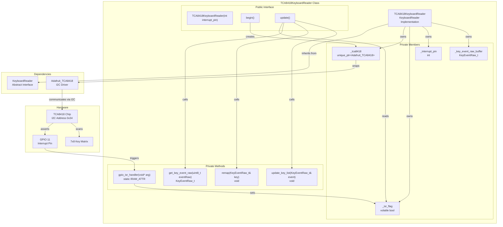
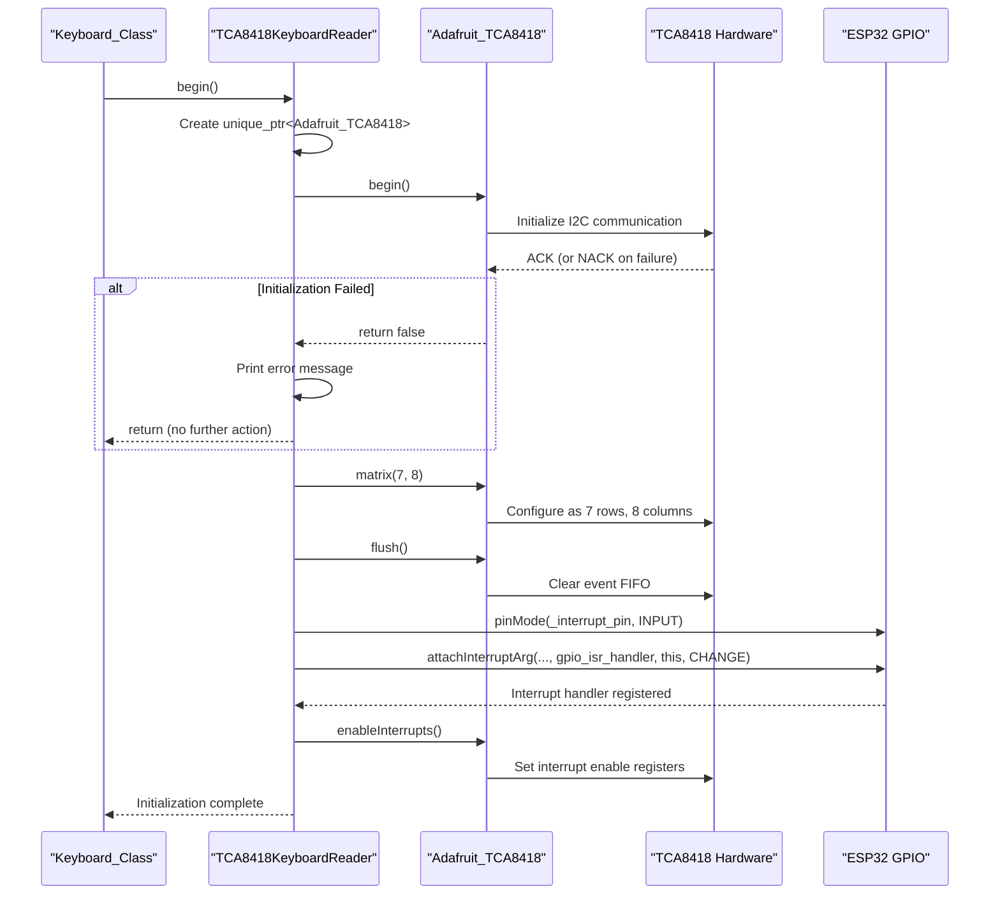
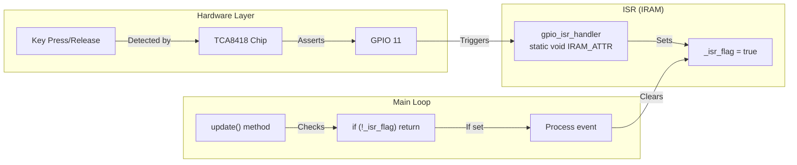
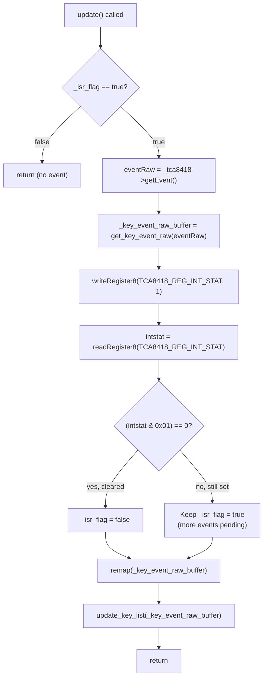
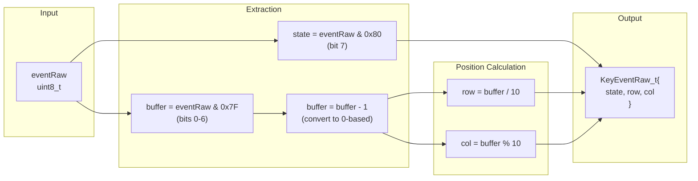
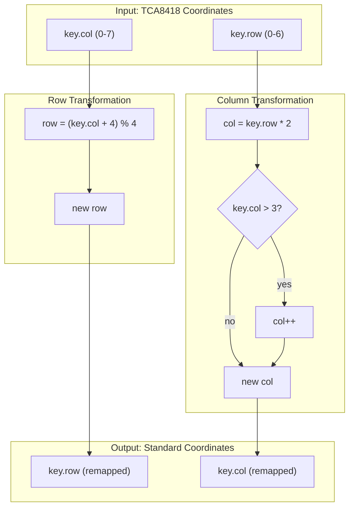
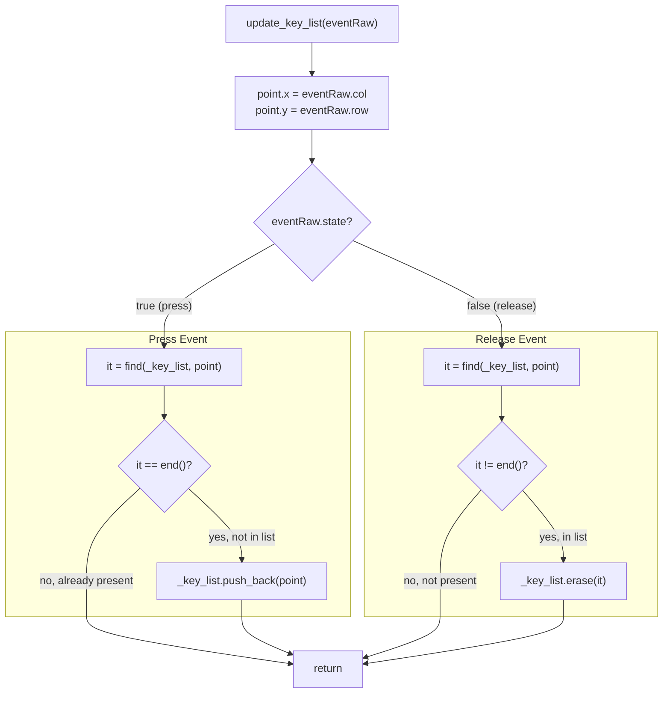
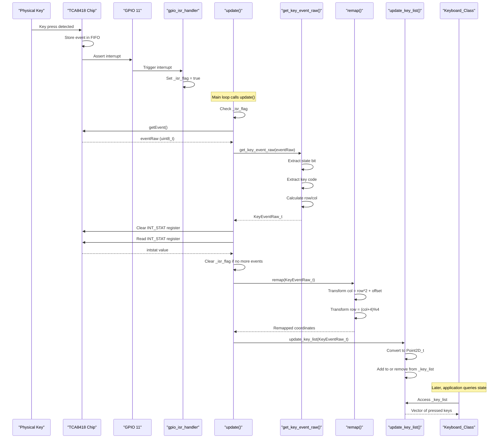

M5Cardputer TCA8418 Implementation (M5Cardputer-ADV)

# TCA8418 Implementation (M5Cardputer-ADV)

<details>
<summary>Relevant source files</summary>

The following files were used as context for generating this wiki page:

- [src/utility/Keyboard/KeyboardReader/TCA8418.cpp](src/utility/Keyboard/KeyboardReader/TCA8418.cpp)
- [src/utility/Keyboard/KeyboardReader/TCA8418.h](src/utility/Keyboard/KeyboardReader/TCA8418.h)
- [src/utility/common.h](src/utility/common.h)

</details>


## Purpose and Scope

This document provides a detailed technical reference for the `TCA8418KeyboardReader` class, which implements keyboard input handling for the M5Cardputer-ADV hardware variant. The TCA8418KeyboardReader communicates with the TCA8418 I2C keyboard controller chip to scan a 7x8 key matrix, process interrupt-driven key events, and provide key state information through the unified `KeyboardReader` interface.

For the abstract keyboard interface and polymorphic hardware support, see [Hardware Abstraction Layer](#4.4). For the standard M5Cardputer GPIO-based implementation, see [IOMatrix Implementation (M5Cardputer)](#4.5). For high-level keyboard API usage, see [Keyboard_Class API](#4.1).

---

## Architecture Overview

The `TCA8418KeyboardReader` class provides an interrupt-driven implementation of the `KeyboardReader` interface, delegating physical key scanning to the TCA8418 I2C controller. This design offloads matrix scanning from the ESP32, reducing CPU load and enabling reliable key event detection.

### Class Structure



**Sources:** [src/utility/Keyboard/KeyboardReader/TCA8418.h:1-41](), [src/utility/Keyboard/KeyboardReader/TCA8418.cpp:1-122]()

---

## Initialization Process

The `begin()` method initializes the TCA8418 controller and configures interrupt handling. This method is called once during keyboard subsystem initialization.

### Initialization Sequence



**Sources:** [src/utility/Keyboard/KeyboardReader/TCA8418.cpp:28-50]()

### Initialization Steps

| Step | Method Call | Purpose |
|------|-------------|---------|
| 1 | `_tca8418 = std::make_unique<Adafruit_TCA8418>()` | Create driver instance using C++11-compatible make_unique |
| 2 | `_tca8418->begin()` | Initialize I2C communication at default address 0x34 |
| 3 | `_tca8418->matrix(7, 8)` | Configure TCA8418 for 7-row, 8-column matrix |
| 4 | `_tca8418->flush()` | Clear any stale events from FIFO |
| 5 | `pinMode(_interrupt_pin, INPUT)` | Configure GPIO 11 as input (default) |
| 6 | `attachInterruptArg(...)` | Attach ISR to detect interrupt pin changes |
| 7 | `_tca8418->enableInterrupts()` | Enable TCA8418 interrupt generation |

**Sources:** [src/utility/Keyboard/KeyboardReader/TCA8418.cpp:28-50](), [src/utility/common.h:15-19]()

### Default Hardware Configuration

The TCA8418KeyboardReader uses the following default configuration:

| Parameter | Value | Location |
|-----------|-------|----------|
| I2C Address | 0x34 | Adafruit_TCA8418 default |
| Interrupt Pin | GPIO 11 | [src/utility/Keyboard/KeyboardReader/TCA8418.cpp:13]() |
| Matrix Size | 7 rows × 8 columns | [src/utility/Keyboard/KeyboardReader/TCA8418.cpp:39]() |
| Interrupt Mode | CHANGE (both edges) | [src/utility/Keyboard/KeyboardReader/TCA8418.cpp:45]() |

**Sources:** [src/utility/Keyboard/KeyboardReader/TCA8418.cpp:13-50]()

---

## Interrupt-Driven Event Handling

The TCA8418 controller uses hardware interrupts to signal key events, minimizing polling overhead and ensuring responsive key detection.

### Interrupt Service Routine

The `gpio_isr_handler` is a static method marked with `IRAM_ATTR` for fast execution from IRAM. It sets the `_isr_flag` volatile boolean to indicate a pending event.



**Sources:** [src/utility/Keyboard/KeyboardReader/TCA8418.cpp:22-26](), [src/utility/Keyboard/KeyboardReader/TCA8418.h:32-36]()

### Update Method Flow

The `update()` method processes pending key events when called from the main loop. It checks the interrupt flag, reads events, clears the interrupt, and updates the key list.



**Sources:** [src/utility/Keyboard/KeyboardReader/TCA8418.cpp:52-73]()

### Interrupt Flag Clearing Logic

The TCA8418 hardware maintains an interrupt status register (TCA8418_REG_INT_STAT). Writing 1 to this register attempts to clear the interrupt. However, if additional events remain in the FIFO, the interrupt bit remains set. This mechanism ensures no events are lost:

- If interrupt clears: `_isr_flag = false`, no more events to process
- If interrupt remains set: `_isr_flag = true`, more events pending, `update()` will be called again

**Sources:** [src/utility/Keyboard/KeyboardReader/TCA8418.cpp:60-66]()

---

## Raw Event Decoding

The TCA8418 controller reports key events as 8-bit values encoding the key state and matrix position.

### Event Format

The TCA8418 event byte format:

| Bit 7 | Bits 6-0 |
|-------|----------|
| State (1=press, 0=release) | Key code (1-based index into matrix) |

### Decoding Algorithm

The `get_key_event_raw()` method converts the raw byte into a `KeyEventRaw_t` structure:



**Sources:** [src/utility/Keyboard/KeyboardReader/TCA8418.cpp:75-85]()

### Example Decode

For a key press at TCA8418 matrix position (3, 5):

```
TCA8418 Key Code = (3 * 10) + 5 + 1 = 36
Event Byte = 0x80 | 36 = 0xA4 (164 decimal)

Decoding:
  state = 0xA4 & 0x80 = 0x80 (true, pressed)
  buffer = 0xA4 & 0x7F = 0x24 (36)
  buffer = 36 - 1 = 35
  row = 35 / 10 = 3
  col = 35 % 10 = 5
```

**Sources:** [src/utility/Keyboard/KeyboardReader/TCA8418.cpp:75-85]()

---

## Coordinate Remapping

The TCA8418 chip's 7×8 matrix layout differs from the standard M5Cardputer's 4×14 logical layout. The `remap()` method transforms TCA8418 coordinates to match the standard layout, ensuring consistent key mapping across hardware variants.

### Remapping Algorithm



**Sources:** [src/utility/Keyboard/KeyboardReader/TCA8418.cpp:88-101]()

### Transformation Rules

The remapping logic implements two transformations:

**Column Mapping:**
```
new_col = old_row * 2 + (old_col > 3 ? 1 : 0)
```

This effectively splits the 7 TCA rows into 14 columns by doubling the row index and adding an offset based on the original column position.

**Row Mapping:**
```
new_row = (old_col + 4) % 4
```

This wraps the 8 TCA columns into 4 rows using modulo arithmetic with a 4-position offset.

**Sources:** [src/utility/Keyboard/KeyboardReader/TCA8418.cpp:88-101]()

### Mapping Table Example

Sample coordinate transformations:

| TCA Row | TCA Col | New Row | New Col | Formula Verification |
|---------|---------|---------|---------|---------------------|
| 0 | 0 | 0 | 0 | col = 0*2 + 0 = 0, row = (0+4)%4 = 0 |
| 0 | 4 | 0 | 1 | col = 0*2 + 1 = 1, row = (4+4)%4 = 0 |
| 1 | 0 | 0 | 2 | col = 1*2 + 0 = 2, row = (0+4)%4 = 0 |
| 2 | 3 | 3 | 4 | col = 2*2 + 0 = 4, row = (3+4)%4 = 3 |
| 6 | 7 | 3 | 13 | col = 6*2 + 1 = 13, row = (7+4)%4 = 3 |

**Sources:** [src/utility/Keyboard/KeyboardReader/TCA8418.cpp:88-101]()

---

## Key List Management

The `update_key_list()` method maintains `_key_list`, a vector of currently pressed keys inherited from the `KeyboardReader` base class. This list is used by `Keyboard_Class` to determine active keys.

### Key List Update Logic



**Sources:** [src/utility/Keyboard/KeyboardReader/TCA8418.cpp:103-121]()

### Duplicate Key Handling

The method uses `std::find` to check for duplicate entries before adding or removing keys:

- **On press:** Only add the key if it's not already in the list (prevents duplicates from repeated events)
- **On release:** Only remove the key if it's present in the list (prevents errors from spurious release events)

This defensive approach ensures `_key_list` accurately reflects the current pressed keys without corruption from event anomalies.

**Sources:** [src/utility/Keyboard/KeyboardReader/TCA8418.cpp:103-121]()

---

## Data Structures

### KeyEventRaw_t Structure

The `KeyEventRaw_t` private structure encapsulates a single key event:

```cpp
struct KeyEventRaw_t {
    bool state;      // true = pressed, false = released
    uint8_t row;     // Row coordinate (after decoding, before remapping)
    uint8_t col;     // Column coordinate (after decoding, before remapping)
};
```

This structure is used internally as an intermediate representation between the TCA8418's raw byte format and the final `Point2D_t` coordinates stored in `_key_list`.

**Sources:** [src/utility/Keyboard/KeyboardReader/TCA8418.h:25-29]()

---

## Interrupt Pin Configuration

### Constructor Behavior

The `TCA8418KeyboardReader` constructor accepts an optional `interrupt_pin` parameter:

```cpp
TCA8418KeyboardReader(int interrupt_pin = -1)
```

- If `interrupt_pin` is negative (default -1), the constructor sets `_interrupt_pin` to `DEFAULT_TCA8418_INT_PIN` (GPIO 11)
- If a non-negative pin is provided, that pin is used instead

This allows hardware flexibility while providing a sensible default for the M5Cardputer-ADV board.

**Sources:** [src/utility/Keyboard/KeyboardReader/TCA8418.cpp:15-20](), [src/utility/Keyboard/KeyboardReader/TCA8418.cpp:13]()

### Interrupt Edge Detection

The interrupt is configured to trigger on `CHANGE` (both rising and falling edges):

```cpp
attachInterruptArg(digitalPinToInterrupt(_interrupt_pin), gpio_isr_handler, this, CHANGE);
```

This ensures the ISR captures both the assertion and de-assertion of the TCA8418 interrupt signal, providing maximum responsiveness.

**Sources:** [src/utility/Keyboard/KeyboardReader/TCA8418.cpp:45]()

---

## Complete Event Processing Pipeline

The following diagram shows the complete flow from hardware key press to application-accessible key state:



**Sources:** [src/utility/Keyboard/KeyboardReader/TCA8418.cpp:52-73](), [src/utility/Keyboard/KeyboardReader/TCA8418.cpp:75-85](), [src/utility/Keyboard/KeyboardReader/TCA8418.cpp:88-101](), [src/utility/Keyboard/KeyboardReader/TCA8418.cpp:103-121]()

---

## Comparison with IOMatrix Implementation

The `TCA8418KeyboardReader` differs significantly from the GPIO-based `IOMatrixKeyboardReader`:

| Aspect | TCA8418KeyboardReader | IOMatrixKeyboardReader |
|--------|----------------------|------------------------|
| **Hardware Interface** | I2C communication with TCA8418 chip | Direct GPIO matrix scanning |
| **Matrix Size** | 7 rows × 8 columns (hardware) | 3 output pins × 7 input pins (8×7 logical) |
| **Event Detection** | Interrupt-driven (hardware FIFO) | Polling-based (manual scanning) |
| **CPU Overhead** | Low (only processes on interrupt) | Higher (continuous polling in update()) |
| **Pin Requirements** | 2 pins (SDA, SCL) + 1 interrupt pin | 10 pins (3 output + 7 input) |
| **Event Buffering** | Hardware FIFO in TCA8418 | None (immediate processing) |
| **Coordinate Remapping** | Complex (7×8 → 4×14) | Simpler (8×7 → 4×14) |
| **Initialization** | Requires I2C device init | Direct GPIO configuration |

The TCA8418 implementation trades hardware complexity for reduced CPU load and pin count, making it suitable for advanced variants where GPIO pins are scarce or other processing demands require efficient keyboard handling.

**Sources:** [src/utility/Keyboard/KeyboardReader/TCA8418.cpp:1-122](), [src/utility/Keyboard/KeyboardReader/TCA8418.h:1-41]()

---

## Key Implementation Details

### C++11 Compatibility

The code uses `std::make_unique` for smart pointer creation, with a custom implementation for C++11 compatibility defined in [src/utility/common.h:15-19](). This ensures the code works with older toolchains while using modern C++ idioms.

**Sources:** [src/utility/common.h:1-34](), [src/utility/Keyboard/KeyboardReader/TCA8418.cpp:31]()

### IRAM Attribute

The ISR is marked with `IRAM_ATTR`, which places the function in IRAM (instruction RAM) rather than flash memory. This ensures fast interrupt response times without flash access latency.

**Sources:** [src/utility/Keyboard/KeyboardReader/TCA8418.cpp:22](), [src/utility/Keyboard/KeyboardReader/TCA8418.h:36]()

### Volatile Flag

The `_isr_flag` member is marked `volatile` to prevent compiler optimization issues. This ensures the main loop always reads the current value set by the ISR, preventing race conditions.

**Sources:** [src/utility/Keyboard/KeyboardReader/TCA8418.h:32]()

---

## Error Handling

The implementation includes minimal error handling:

- **Initialization failure:** If `_tca8418->begin()` returns false, an error message is printed to serial, and the method returns early
- **No exception handling:** The code follows Arduino/embedded conventions, avoiding exceptions
- **Silent failures:** After initialization failure, subsequent `update()` calls will do nothing (null pointer check not shown but implicitly handled by early return)

**Sources:** [src/utility/Keyboard/KeyboardReader/TCA8418.cpp:33-35]()

---

## Usage Example

While application code typically uses the high-level `Keyboard_Class` API, the `TCA8418KeyboardReader` is instantiated and used like this:

```cpp
// During Keyboard_Class initialization
if (M5.getBoard() == board_M5CardputerADV) {
    _reader = new TCA8418KeyboardReader();  // Uses default GPIO 11
    _reader->begin();
}

// In main loop (called by Keyboard_Class::update())
_reader->update();  // Processes interrupt-driven events

// Key list is available via _reader->_key_list (protected member)
```

For complete keyboard API usage, see [Keyboard_Class API](#4.1).

**Sources:** [src/utility/Keyboard/KeyboardReader/TCA8418.cpp:15-50](), [src/utility/Keyboard/KeyboardReader/TCA8418.cpp:52-73]()