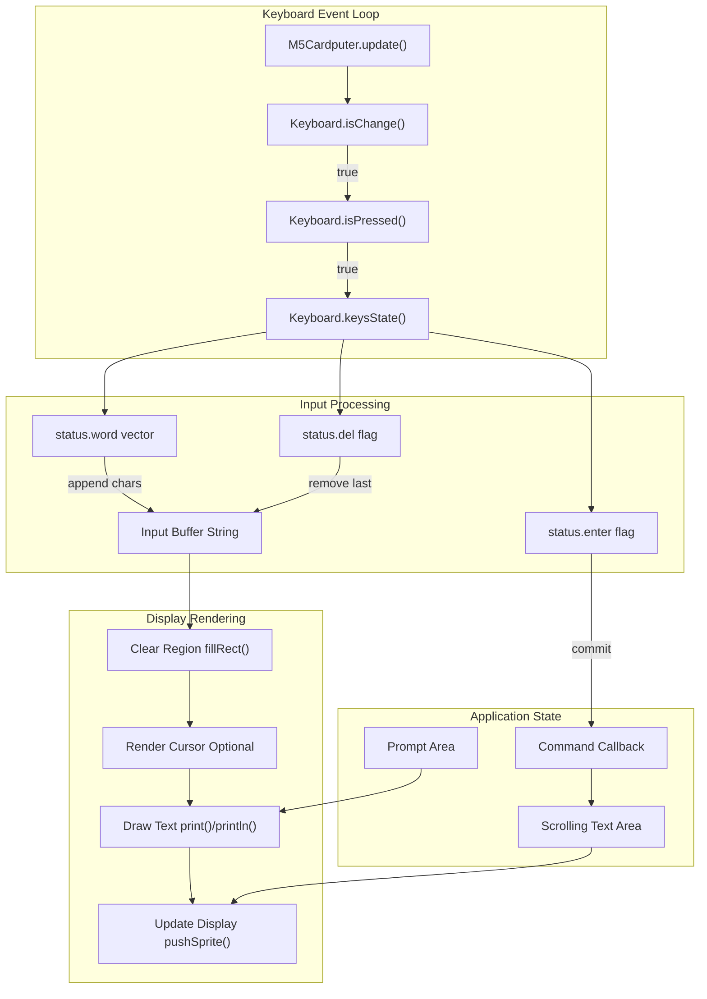
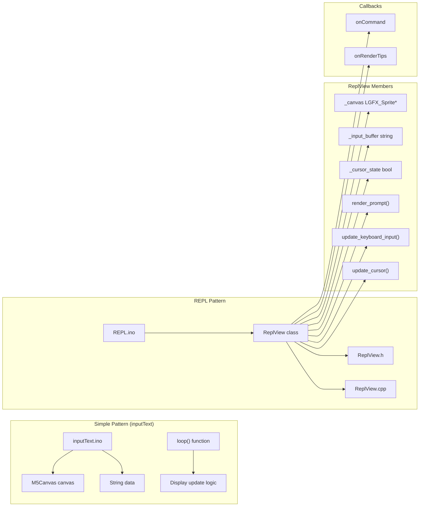
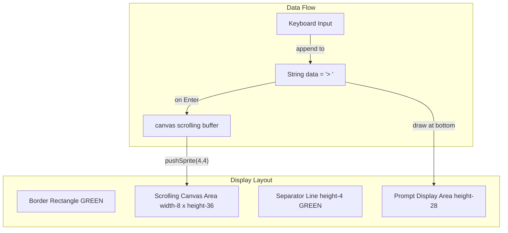
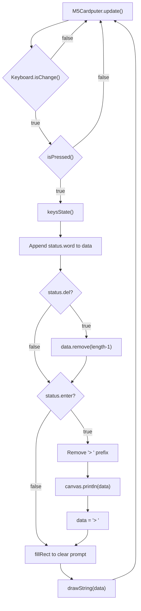
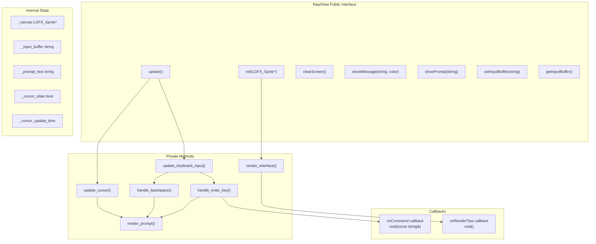
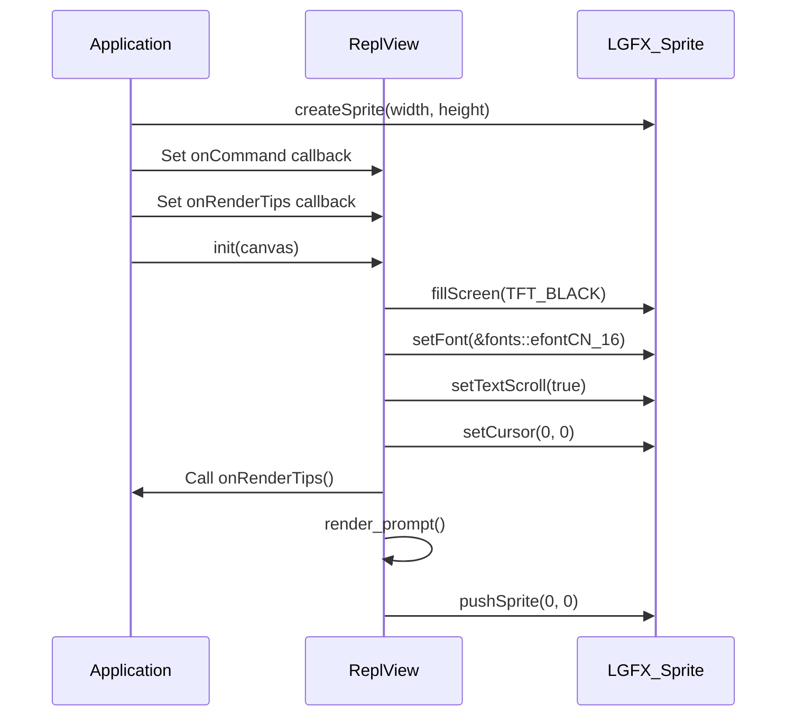
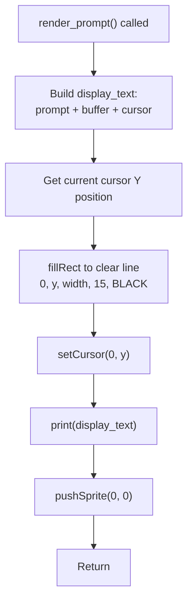
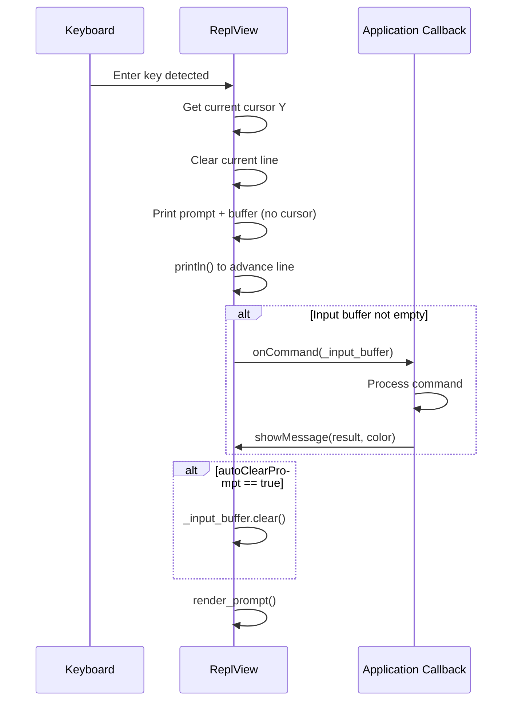

M5Cardputer Text Input and Display Patterns

# Text Input and Display Patterns

<details>
<summary>Relevant source files</summary>

The following files were used as context for generating this wiki page:

- [examples/Basic/keyboard/inputText/inputText.ino](examples/Basic/keyboard/inputText/inputText.ino)
- [examples/UI/REPL/REPL.ino](examples/UI/REPL/REPL.ino)
- [examples/UI/REPL/ReplView.cpp](examples/UI/REPL/ReplView.cpp)
- [examples/UI/REPL/ReplView.h](examples/UI/REPL/ReplView.h)

</details>


## Purpose and Scope

This document describes common patterns for implementing text input and display functionality on the M5Cardputer. It covers input buffer management, display update strategies, cursor rendering, and text scrolling techniques, with detailed examples from the `inputText` and `REPL` applications. For general display operations and M5GFX usage, see [Display System](#5). For keyboard input processing details, see [Keyboard System](#4).

---

## Pattern Overview

The M5Cardputer library enables two primary text input/display patterns:

| Pattern | Use Case | Complexity | Example |
|---------|----------|------------|---------|
| **Simple Direct Rendering** | Basic text entry, single-line prompts | Low | `inputText.ino` |
| **REPL-Style Interface** | Command-line interfaces, interactive applications | Medium | `ReplView` class |

Both patterns share common elements:

- **Input Buffer**: String accumulation from keyboard events
- **Display Canvas**: Sprite or canvas for text rendering
- **Keyboard Polling**: `isChange()` / `isPressed()` detection
- **Character Extraction**: Reading from `KeysState.word`
- **Special Key Handling**: Enter, backspace/delete processing

---

## Input-Display Data Flow



**Sources:** [examples/Basic/keyboard/inputText/inputText.ino:44-73](), [examples/UI/REPL/ReplView.cpp:145-167]()

---

## Code Entity Reference



**Sources:** [examples/Basic/keyboard/inputText/inputText.ino:1-74](), [examples/UI/REPL/ReplView.h:1-52](), [examples/UI/REPL/ReplView.cpp:1-168]()

---

## Pattern 1: Simple Input Display

The `inputText` example demonstrates a minimal text input pattern with two distinct display regions: a scrolling text area for committed lines and a fixed prompt area at the bottom.

### Architecture



**Sources:** [examples/Basic/keyboard/inputText/inputText.ino:22-42]()

### Display Initialization

The example creates a scrolling canvas that occupies most of the screen, with a fixed prompt area at the bottom:

```
Display Rectangle: 0,0 to width x (height-28)  [line 27-28]
Separator Line: height-4 pixels from bottom     [line 31-32]
Canvas: (width-8) x (height-36), positioned at 4,4  [line 36-37]
Prompt Area: Bottom 28 pixels  [line 41]
```

**Key configurations:**
- `canvas.setTextScroll(true)` enables automatic scrolling [examples/Basic/keyboard/inputText/inputText.ino:38]()
- `canvas.setTextFont(&fonts::FreeSerifBoldItalic18pt7b)` sets font [examples/Basic/keyboard/inputText/inputText.ino:34]()
- Canvas is positioned with 4-pixel margins [examples/Basic/keyboard/inputText/inputText.ino:40]()

**Sources:** [examples/Basic/keyboard/inputText/inputText.ino:22-42]()

### Input Processing Loop



**Sources:** [examples/Basic/keyboard/inputText/inputText.ino:44-73]()

### Character Accumulation

Characters are accumulated using the `status.word` vector:

```
for (auto i : status.word) {
    data += i;
}
```

This pattern appends all newly pressed characters to the input string [examples/Basic/keyboard/inputText/inputText.ino:50-52](). The `word` vector contains ASCII characters generated by the keyboard's two-pass state update algorithm (see [Key State and Events](#4.2)).

**Sources:** [examples/Basic/keyboard/inputText/inputText.ino:50-52]()

### Display Update Strategy

The simple pattern uses **partial region clearing** to minimize flicker:

1. Clear only the prompt area: `fillRect(0, height-28, width, 25, BLACK)` [examples/Basic/keyboard/inputText/inputText.ino:65-67]()
2. Redraw the prompt text: `drawString(data, 4, height-24)` [examples/Basic/keyboard/inputText/inputText.ino:69-70]()

This approach avoids clearing the entire screen, preserving the scrolling text area.

**Sources:** [examples/Basic/keyboard/inputText/inputText.ino:65-70]()

---

## Pattern 2: REPL-Style Interface

The `ReplView` class provides a more sophisticated text interface with cursor blinking, callback-based command handling, and clean separation of concerns.

### Class Architecture



**Sources:** [examples/UI/REPL/ReplView.h:15-51](), [examples/UI/REPL/ReplView.cpp:1-168]()

### Initialization Sequence



**Sources:** [examples/UI/REPL/REPL.ino:61-76](), [examples/UI/REPL/ReplView.cpp:8-12](), [examples/UI/REPL/ReplView.cpp:58-73]()

### Cursor Blinking Implementation

The `ReplView` class implements cursor blinking with a configurable period:

| Parameter | Value | Purpose |
|-----------|-------|---------|
| `CURSOR_BLINK_PERIOD` | 500ms | Time between cursor state toggles |
| `_cursor_state` | `bool` | Current visibility state |
| `_cursor_update_time` | `uint32_t` | Last update timestamp |

**Blinking logic:**

```
void update_cursor() {
    if (millis() - _cursor_update_time > CURSOR_BLINK_PERIOD) {
        _cursor_state = !_cursor_state;
        _cursor_update_time = millis();
        render_prompt();
    }
}
```

The cursor is rendered as an underscore `_` when visible, or a space ` ` when hidden [examples/UI/REPL/ReplView.cpp:79-82](). This creates a non-flickering cursor effect by toggling the character displayed at the cursor position.

**Sources:** [examples/UI/REPL/ReplView.h:36](), [examples/UI/REPL/ReplView.cpp:136-143](), [examples/UI/REPL/ReplView.cpp:75-97]()

### Prompt Rendering Strategy

The `render_prompt()` method implements a **clear-and-redraw** pattern to avoid visual artifacts:



**Key technique:** The method clears a fixed-height rectangle (15 pixels) at the current cursor position before redrawing [examples/UI/REPL/ReplView.cpp:89](). This ensures complete removal of the previous cursor state and prevents ghosting artifacts.

**Sources:** [examples/UI/REPL/ReplView.cpp:75-97]()

### Input Buffer Management

The `ReplView` class maintains a separate input buffer from the display:

| Method | Purpose | Side Effects |
|--------|---------|--------------|
| `setInputBuffer(text)` | Replace buffer content | Triggers `render_prompt()` |
| `getInputBuffer()` | Read buffer (const reference) | None |
| `clearInputBuffer()` | Empty the buffer | Triggers `render_prompt()` |
| `handle_backspace()` | Remove last character | Updates display if buffer non-empty |

**Backspace implementation:**

```
void handle_backspace() {
    if (!_input_buffer.empty()) {
        _input_buffer.pop_back();
        int cursor_y = _canvas->getCursorY();
        _canvas->fillRect(0, cursor_y, _canvas->width(), 15, BLACK);
        render_prompt();
    }
}
```

This pattern ensures no buffer underflow and updates the display only when characters are actually removed [examples/UI/REPL/ReplView.cpp:122-134]().

**Sources:** [examples/UI/REPL/ReplView.h:28-33](), [examples/UI/REPL/ReplView.cpp:46-56](), [examples/UI/REPL/ReplView.cpp:122-134]()

### Enter Key Handling and Command Dispatch



**Auto-clear behavior:** The `autoClearPrompt` flag controls whether the input buffer is automatically cleared after command execution [examples/UI/REPL/ReplView.h:19](). When `false`, the previous input remains in the buffer for potential reuse.

**Sources:** [examples/UI/REPL/ReplView.cpp:99-120](), [examples/UI/REPL/ReplView.h:19]()

### Keyboard Input Processing

The `update_keyboard_input()` method processes keyboard events each frame:

```
void update_keyboard_input() {
    if (M5Cardputer.Keyboard.isChange()) {
        if (M5Cardputer.Keyboard.isPressed()) {
            auto& status = M5Cardputer.Keyboard.keysState();
            
            if (status.enter) {
                handle_enter_key();
                return;
            }
            
            if (status.del) {
                handle_backspace();
                return;
            }
            
            for (auto& c : status.word) {
                _input_buffer += c;
            }
            render_prompt();
        }
    }
}
```

**Processing priority:**
1. Enter key (highest priority) - commits input
2. Delete/backspace key - removes characters
3. Regular characters - appended to buffer

This priority ordering prevents characters from being added before Enter/Delete handling [examples/UI/REPL/ReplView.cpp:145-167]().

**Sources:** [examples/UI/REPL/ReplView.cpp:145-167]()

---

## Display Update Strategies Comparison

| Strategy | Pattern | Flicker Risk | Performance | Use Case |
|----------|---------|--------------|-------------|----------|
| **Full Screen Clear** | `canvas.fillScreen()` then redraw | High | Low | Initial render only |
| **Line Clear + Redraw** | `fillRect(0, y, width, height)` | Low | Medium | Prompt updates, cursor |
| **Sprite Push** | `canvas.pushSprite(x, y)` | None | High | Final display commit |
| **Direct Drawing** | `Display.drawString()` | Medium | Highest | Non-buffered updates |

### Recommended Pattern

For smooth text input interfaces, use the **sprite-based buffered rendering** pattern:

1. Create an `LGFX_Sprite` or `M5Canvas` matching display dimensions
2. Enable text scrolling: `canvas->setTextScroll(true)`
3. Perform all drawing operations on the sprite
4. Call `canvas->pushSprite(0, 0)` once per frame

This approach eliminates tearing and provides consistent performance regardless of drawing complexity.

**Sources:** [examples/UI/REPL/REPL.ino:66-67](), [examples/Basic/keyboard/inputText/inputText.ino:36-40]()

---

## Text Scrolling Management

Both patterns leverage M5GFX's automatic text scrolling feature.

### Configuration

```
canvas.setTextScroll(true);  // Enable auto-scrolling
canvas.setCursor(0, 0);       // Initial position
```

**Behavior:** When text reaches the bottom of the sprite, the content automatically scrolls upward, and the cursor wraps to create a new line [examples/UI/REPL/ReplView.cpp:62]().

### Scrolling Region

The scrolling region is defined by the sprite dimensions:

| Example | Canvas Size | Scrolling Area |
|---------|-------------|----------------|
| `inputText` | `(width-8, height-36)` | Full sprite except margins |
| `ReplView` | `(width, height)` | Entire screen |

**Margin considerations:** The `inputText` pattern uses margins to create visual separation from screen edges and the prompt area [examples/Basic/keyboard/inputText/inputText.ino:36-37]().

**Sources:** [examples/Basic/keyboard/inputText/inputText.ino:36-40](), [examples/UI/REPL/ReplView.cpp:58-73]()

---

## Cursor Visualization Techniques

### Technique 1: Character-Based Cursor (ReplView)

**Implementation:** Toggle between underscore `_` and space ` ` characters at fixed intervals.

**Advantages:**
- Simple implementation
- No special drawing required
- Consistent with font metrics

**Disadvantages:**
- Fixed appearance (no custom shapes)
- Tied to text rendering

**Sources:** [examples/UI/REPL/ReplView.cpp:79-82]()

### Technique 2: Rectangle-Based Cursor

**Implementation:** Draw a filled rectangle at the cursor position (not shown in examples, but common pattern).

```
// Pseudocode (not from examples)
canvas->fillRect(cursor_x, cursor_y, char_width, char_height, color);
```

**Advantages:**
- Full control over appearance (color, size, shape)
- Can overlap text for block cursor effect

**Disadvantages:**
- Requires font metrics calculation
- More complex redraw logic

### Technique 3: No Visible Cursor (inputText)

The `inputText` example does not render a cursor, relying on the displayed text itself to indicate input position.

**Advantages:**
- Simplest implementation
- No blinking logic required

**Disadvantages:**
- Less clear input state indication
- May confuse users about focus

**Sources:** [examples/Basic/keyboard/inputText/inputText.ino:44-73]()

---

## Message Display Pattern

The `ReplView` class provides a `showMessage()` method for displaying colored feedback:

```
void showMessage(const std::string& message, uint16_t color = TFT_WHITE) {
    _canvas->setTextColor(color, TFT_BLACK);
    _canvas->println(message.c_str());
    _canvas->setTextColor(TFT_WHITE, TFT_BLACK);
    _canvas->pushSprite(0, 0);
}
```

**Usage pattern:**

```
repl_view.showMessage("Correct! :)", TFT_GREENYELLOW);
repl_view.showMessage("Too high!", TFT_CYAN);
repl_view.showMessage("Invalid input :(", TFT_RED);
```

This pattern temporarily changes text color for visual feedback, then restores the default color [examples/UI/REPL/ReplView.cpp:27-33]().

**Sources:** [examples/UI/REPL/ReplView.cpp:27-33](), [examples/UI/REPL/REPL.ino:35-59]()

---

## Best Practices

### Input Buffer Management

1. **Use string types:** `std::string` or `String` provides automatic memory management
2. **Validate buffer state:** Check `empty()` before removing characters
3. **Limit buffer size:** Implement maximum length checks for bounded input fields
4. **Clear buffer after commit:** Reset input state after Enter key handling

### Display Updates

1. **Minimize redraws:** Only update changed regions using `fillRect()`
2. **Use sprites for complex scenes:** Buffer all drawing before final `pushSprite()`
3. **Separate prompt from history:** Use distinct display regions for input vs output
4. **Enable text scrolling:** Configure `setTextScroll(true)` for automatic line wrapping

### Keyboard Processing

1. **Check isChange() before isPressed():** Avoid processing identical states
2. **Handle special keys first:** Process Enter and Delete before regular characters
3. **Iterate status.word:** All typed characters are in the vector, including shifted/modified
4. **Update display after all input:** Collect all changes before rendering

### Cursor Management

1. **Use consistent timing:** 500ms blink period provides good visibility
2. **Update during idle frames:** Don't skip cursor updates during input processing
3. **Clear old cursor position:** Always erase previous cursor before drawing new state

**Sources:** [examples/UI/REPL/ReplView.cpp:145-167](), [examples/Basic/keyboard/inputText/inputText.ino:44-73](), [examples/UI/REPL/ReplView.h:36]()