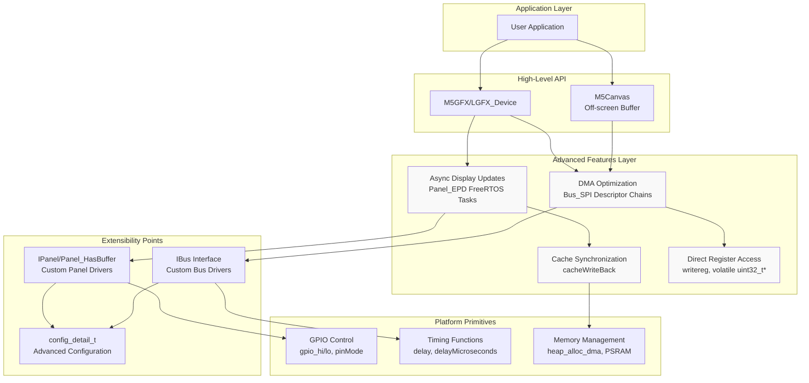
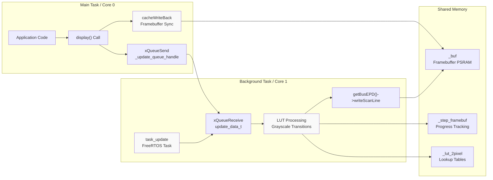
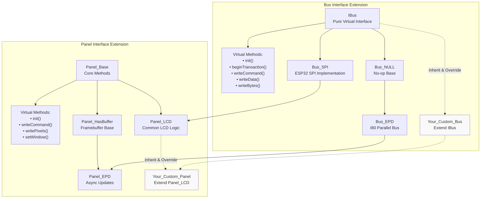
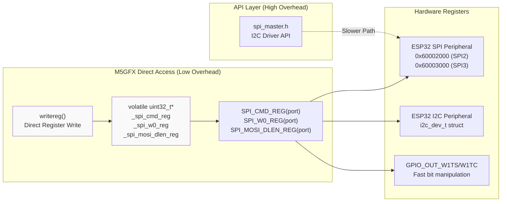
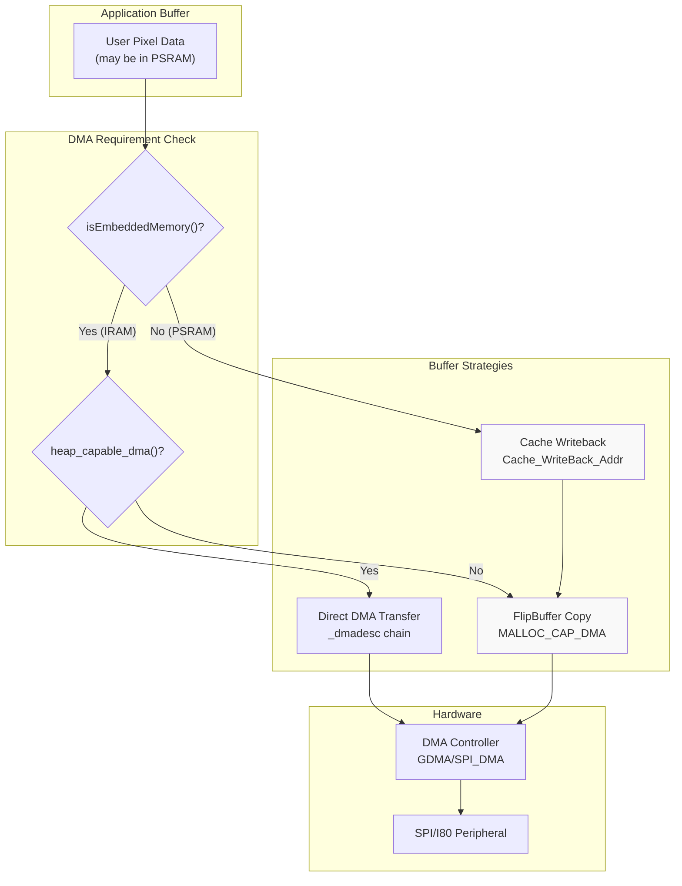

M5GFX Advanced Topics

# Advanced Topics

<details>
<summary>Relevant source files</summary>

The following files were used as context for generating this wiki page:

- [src/lgfx/v1/misc/enum.hpp](src/lgfx/v1/misc/enum.hpp)
- [src/lgfx/v1/platforms/esp32/Bus_EPD.cpp](src/lgfx/v1/platforms/esp32/Bus_EPD.cpp)
- [src/lgfx/v1/platforms/esp32/Bus_EPD.h](src/lgfx/v1/platforms/esp32/Bus_EPD.h)
- [src/lgfx/v1/platforms/esp32/Bus_SPI.cpp](src/lgfx/v1/platforms/esp32/Bus_SPI.cpp)
- [src/lgfx/v1/platforms/esp32/Bus_SPI.hpp](src/lgfx/v1/platforms/esp32/Bus_SPI.hpp)
- [src/lgfx/v1/platforms/esp32/Panel_EPD.cpp](src/lgfx/v1/platforms/esp32/Panel_EPD.cpp)
- [src/lgfx/v1/platforms/esp32/Panel_EPD.hpp](src/lgfx/v1/platforms/esp32/Panel_EPD.hpp)
- [src/lgfx/v1/platforms/esp32/common.cpp](src/lgfx/v1/platforms/esp32/common.cpp)
- [src/lgfx/v1/platforms/esp32/common.hpp](src/lgfx/v1/platforms/esp32/common.hpp)

</details>


This section covers advanced features and techniques for power users, library contributors, and developers implementing custom hardware support. These topics assume familiarity with the core M5GFX architecture described in [Architecture Overview](#1.2) and the panel/bus abstractions covered in sections [4](#4) and [5](#5).

**Scope of Advanced Topics:**
- Multi-threaded display updates with FreeRTOS integration
- Performance optimization strategies including DMA, register-level access, and cache management
- Implementing custom panel and bus drivers by extending base classes
- Advanced display-specific configuration (custom LUTs, timing parameters, hardware quirks)

For general usage patterns and basic configuration, see [Getting Started](#1.1). For platform-specific implementation details without the advanced optimization context, see [Platform Abstraction Layer](#5).

---

## Overview of Advanced Architecture

The M5GFX library is structured to support both high-level ease-of-use and low-level performance optimization. Advanced features are primarily implemented in platform-specific directories (`src/lgfx/v1/platforms/esp32/`) and leverage ESP32-specific capabilities.



**Sources:** [src/lgfx/v1/platforms/esp32/Panel_EPD.cpp:1-297](), [src/lgfx/v1/platforms/esp32/Bus_SPI.cpp:1-203](), [src/lgfx/v1/platforms/esp32/common.cpp:1-523]()

---

## Key Advanced Components

### Multi-Threading Architecture

The library implements asynchronous display updates using FreeRTOS tasks, primarily for e-paper displays where refresh operations are time-consuming. The `Panel_EPD` class demonstrates this pattern.



**Key Classes and Functions:**
- `Panel_EPD::task_update()` - Background task function [src/lgfx/v1/platforms/esp32/Panel_EPD.cpp:293-293]()
- `Panel_EPD::display()` - Queues update requests [src/lgfx/v1/platforms/esp32/Panel_EPD.cpp:553-589]()
- `xQueueCreate()` - FreeRTOS queue for inter-task communication [src/lgfx/v1/platforms/esp32/Panel_EPD.cpp:286-286]()
- `cacheWriteBack()` - Ensures cache coherency across CPU cores [src/lgfx/v1/platforms/esp32/Panel_EPD.cpp:61-70]()

**Sources:** [src/lgfx/v1/platforms/esp32/Panel_EPD.cpp:286-296](), [src/lgfx/v1/platforms/esp32/Panel_EPD.hpp:113-126]()

---

### Performance-Critical Data Paths

M5GFX implements multiple optimization strategies for high-speed data transfer. The following table summarizes the key techniques:

| Technique | Implementation | Use Case | File Reference |
|-----------|---------------|----------|----------------|
| **DMA Descriptor Chains** | `lldesc_t* _dmadesc` | Large pixel buffer transfers | [Bus_SPI.cpp:630-714]() |
| **Direct Register Access** | `writereg()`, `volatile uint32_t*` | Bypass driver overhead | [Bus_SPI.cpp:110-111]() |
| **HIGHPART Double Buffering** | `SPI_USR_MOSI_HIGHPART` | Pipeline CPU/SPI operations | [Bus_SPI.cpp:583-625]() |
| **Fixed-Point LUT** | `_lut_2pixel` lookup table | E-paper grayscale conversion | [Panel_EPD.cpp:228-284]() |
| **Inline Assembly** | `__asm__ __volatile__` | Xtensa-optimized pixel blitting | [Panel_EPD.cpp:592-807]() |
| **FlipBuffer** | `_flip_buffer.getBuffer()` | DMA-safe memory allocation | [Bus_SPI.cpp:537-544]() |
| **Cache Management** | `Cache_WriteBack_Addr()` | PSRAM coherency | [Panel_EPD.cpp:32-70]() |

**Sources:** [src/lgfx/v1/platforms/esp32/Bus_SPI.cpp:515-627](), [src/lgfx/v1/platforms/esp32/Panel_EPD.cpp:591-808](), [src/lgfx/v1/platforms/esp32/common.cpp:174-176]()

---

### Extension Points for Custom Drivers

The library provides well-defined interfaces for implementing custom hardware support. The following diagram shows the inheritance hierarchy and virtual methods that must be implemented:



**Key Extension Points:**
- `IBus` - Implement for custom communication protocols [src/lgfx/v1/Bus.hpp]()
- `Panel_LCD` - Extend for standard LCD controllers with window commands [src/lgfx/v1/panel/Panel_LCD.hpp]()
- `Panel_HasBuffer` - Extend for displays requiring framebuffer management [src/lgfx/v1/panel/Panel_HasBuffer.hpp]()
- `config_detail_t` - Define hardware-specific parameters [src/lgfx/v1/platforms/esp32/Panel_EPD.hpp:42-58]()

**Sources:** [src/lgfx/v1/platforms/esp32/Bus_SPI.hpp:65-206](), [src/lgfx/v1/platforms/esp32/Panel_EPD.hpp:37-126](), [src/lgfx/v1/platforms/esp32/Bus_EPD.h:38-107]()

---

## Platform-Specific Optimizations

### ESP32 Register-Level Access

For maximum performance, M5GFX bypasses ESP-IDF driver APIs and accesses hardware registers directly:



**Key Functions:**
- `writereg(addr, value)` - Inline register write [src/lgfx/v1/platforms/esp32/common.cpp:174-174]()
- `reg(addr)` - Uncached register pointer [src/lgfx/v1/platforms/esp32/common.cpp:175-175]()
- `gpio_hi(pin)` / `gpio_lo(pin)` - Single-cycle GPIO writes [src/lgfx/v1/platforms/esp32/common.hpp:157-158]()

**Sources:** [src/lgfx/v1/platforms/esp32/common.cpp:174-176](), [src/lgfx/v1/platforms/esp32/Bus_SPI.cpp:110-111](), [src/lgfx/v1/platforms/esp32/common.hpp:143-158]()

---

### DMA Memory Management

The library carefully manages DMA-capable memory allocation to avoid cache coherency issues and ensure compatibility with ESP32 hardware constraints:



**Memory Allocation Functions:**
- `heap_alloc_dma(size)` - Allocates DMA-capable memory [src/lgfx/v1/platforms/esp32/common.hpp:114-114]()
- `heap_alloc_psram(size)` - Allocates SPIRAM for large buffers [src/lgfx/v1/platforms/esp32/common.hpp:115-115]()
- `isEmbeddedMemory(ptr)` - Checks if pointer is in internal SRAM [src/lgfx/v1/platforms/esp32/common.hpp:120-120]()
- `FlipBuffer::getBuffer(len)` - Returns DMA-safe buffer [src/lgfx/v1/platforms/esp32/Bus_SPI.cpp:537-537]()

**Sources:** [src/lgfx/v1/platforms/esp32/common.hpp:113-127](), [src/lgfx/v1/platforms/esp32/Bus_SPI.cpp:530-545](), [src/lgfx/v1/platforms/esp32/Panel_EPD.cpp:228-250]()

---

## Configuration Detail Structures

Advanced hardware configuration is exposed through `config_detail_t` structures that extend the basic `config_t`:

| Configuration | Purpose | Example Fields | Reference |
|---------------|---------|----------------|-----------|
| `Panel_EPD::config_detail_t` | E-paper grayscale LUTs | `lut_quality`, `lut_text`, `lut_fast`, `task_priority` | [Panel_EPD.hpp:42-58]() |
| `Bus_SPI::config_t` | SPI timing & DMA | `freq_write`, `freq_read`, `dma_channel`, `spi_mode` | [Bus_SPI.hpp:75-97]() |
| `Bus_EPD::config_t` | I80 parallel bus | `bus_speed`, `pin_data[16]`, `bus_width` | [Bus_EPD.h:41-81]() |

**Custom LUT Example (E-Paper):**
```cpp
Panel_EPD::config_detail_t cfg_detail;
cfg_detail.lut_quality = my_custom_lut;      // Pointer to uint32_t array
cfg_detail.lut_quality_step = 20;            // Number of LUT entries
cfg_detail.task_priority = 2;                // FreeRTOS priority
cfg_detail.task_pinned_core = APP_CPU_NUM;   // Pin to specific core
panel->config_detail(cfg_detail);
```

**Sources:** [src/lgfx/v1/platforms/esp32/Panel_EPD.hpp:42-61](), [src/lgfx/v1/platforms/esp32/Panel_EPD.cpp:180-197]()

---

## Next Steps

The following subsections provide detailed implementation guidance:

- **[Multi-Threading and Async Updates](#7.1)** - FreeRTOS task implementation, queue management, cache synchronization
- **[Performance Optimization Techniques](#7.2)** - DMA batching, register access, function pointer dispatch, inline assembly
- **[Custom Panel and Bus Drivers](#7.3)** - Step-by-step guide to extending `IBus`, `Panel_LCD`, and `Panel_HasBuffer`
- **[Display-Specific Configuration](#7.4)** - Custom LUTs, resolution/PLL settings, signal timing, board-specific workarounds

**Sources:** [src/lgfx/v1/platforms/esp32/Panel_EPD.cpp:1-880](), [src/lgfx/v1/platforms/esp32/Bus_SPI.cpp:1-1024](), [src/lgfx/v1/platforms/esp32/common.cpp:1-1531]()