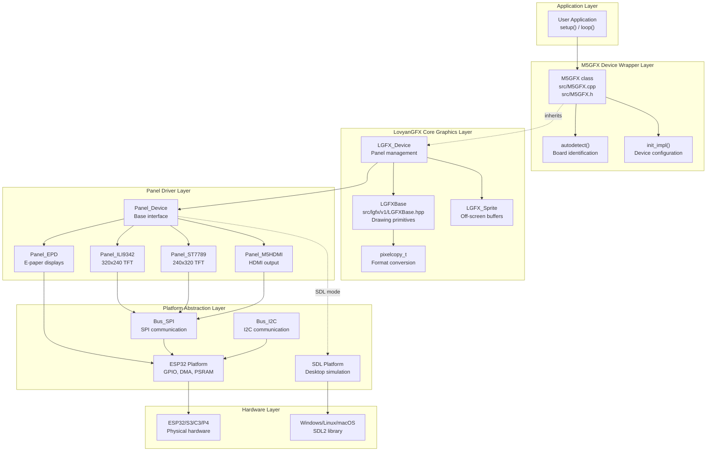
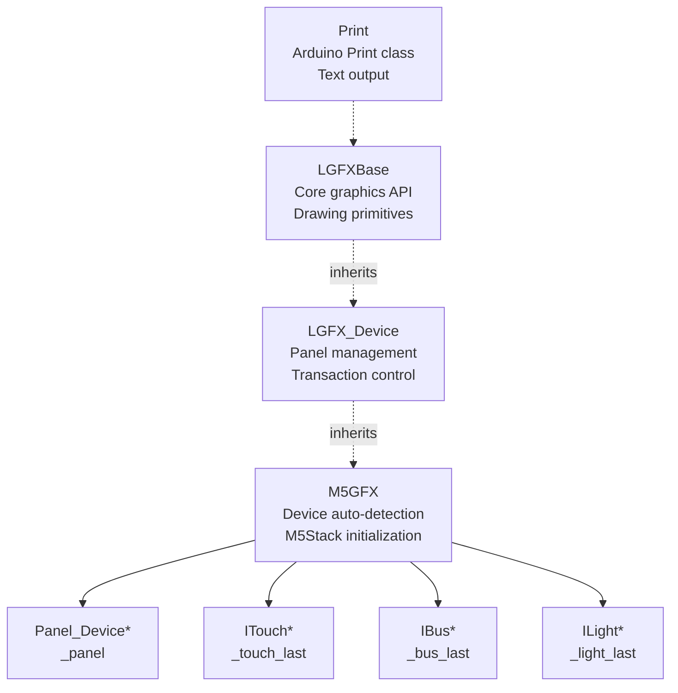
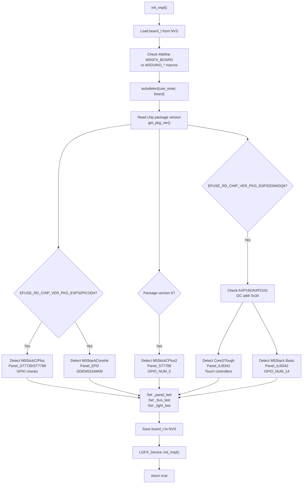
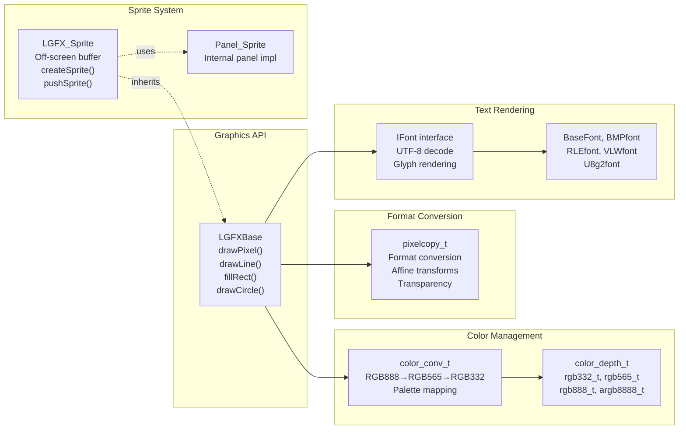
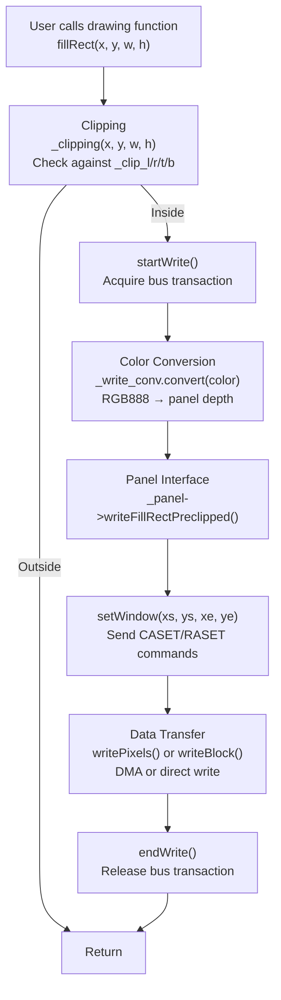
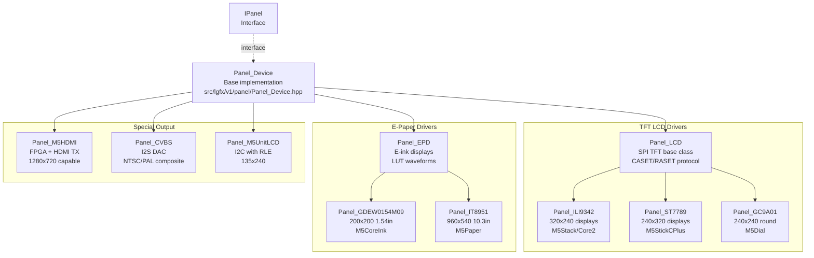
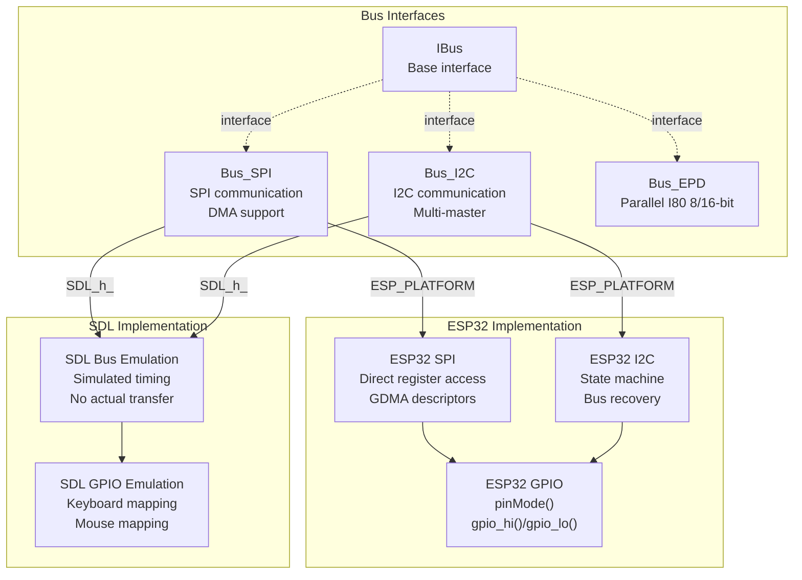
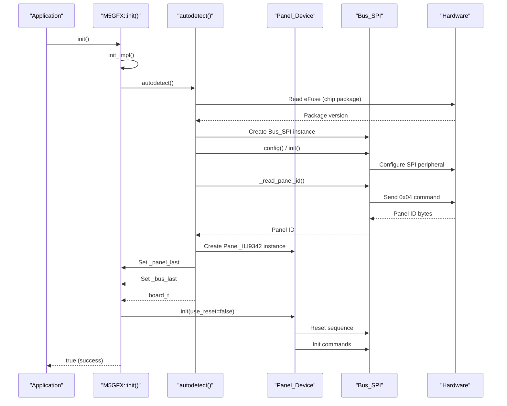
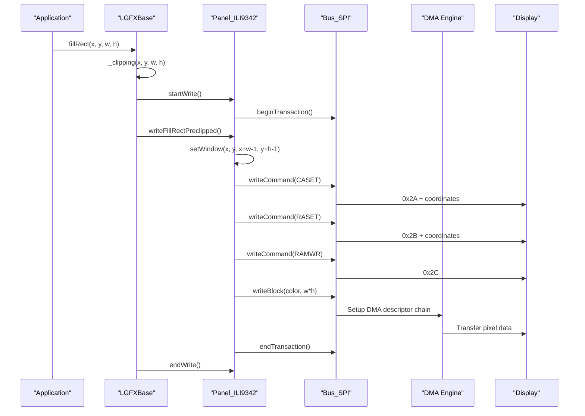

M5GFX Architecture Overview

# Architecture Overview

<details>
<summary>Relevant source files</summary>

The following files were used as context for generating this wiki page:

- [src/M5GFX.cpp](src/M5GFX.cpp)
- [src/M5GFX.h](src/M5GFX.h)
- [src/lgfx/boards.hpp](src/lgfx/boards.hpp)
- [src/lgfx/v1/LGFXBase.cpp](src/lgfx/v1/LGFXBase.cpp)
- [src/lgfx/v1/LGFXBase.hpp](src/lgfx/v1/LGFXBase.hpp)
- [src/lgfx/v1/misc/colortype.hpp](src/lgfx/v1/misc/colortype.hpp)

</details>


## Purpose and Scope

This document describes the high-level architecture of the M5GFX library, explaining how the system is organized into distinct layers and how these layers interact. M5GFX is a graphics library specifically designed for M5Stack hardware that wraps the LovyanGFX graphics engine with device-specific initialization and configuration logic.

For information about specific M5Stack devices and their hardware configurations, see [Supported Devices and Displays](#1.3). For details on the M5GFX device wrapper classes, see [M5GFX Device Classes](#2). For LovyanGFX core functionality, see [LovyanGFX Graphics Core](#3).

---

## System Layering

M5GFX employs a five-layer architecture that separates hardware abstraction, graphics operations, and platform-specific implementations:



**Sources:** [src/M5GFX.cpp:1-2800](), [src/M5GFX.h:1-300](), [src/lgfx/v1/LGFXBase.hpp:1-1500]()

---

## M5GFX Device Wrapper Layer

The `M5GFX` class serves as the primary entry point and hardware abstraction layer. It inherits from `LGFX_Device` and adds M5Stack-specific device detection and initialization.

### Class Hierarchy



**Sources:** [src/M5GFX.h:174-274](), [src/M5GFX.cpp:60-63](), [src/lgfx/v1/LGFXBase.hpp:56-63]()

### Board Auto-Detection

The `M5GFX::autodetect()` method implements a multi-stage detection algorithm that identifies the connected M5Stack hardware:



**Sources:** [src/M5GFX.cpp:620-709](), [src/M5GFX.cpp:712-1695]()

### Key Detection Components

| Component | Purpose | Code Reference |
|-----------|---------|----------------|
| `get_pkg_ver()` | Reads ESP32 chip package version from eFuse | [src/M5GFX.cpp:733]() |
| `_read_panel_id()` | Reads LCD panel ID via SPI command 0x04 | [src/M5GFX.cpp:583-598]() |
| `i2c::readRegister8()` | Checks for I2C devices (AXP power ICs, GPIO expanders) | [src/M5GFX.cpp:893]() |
| `board_t` enumeration | Identifies specific M5Stack hardware models | [src/lgfx/boards.hpp:8-72]() |

**Sources:** [src/M5GFX.cpp:583-709](), [src/lgfx/boards.hpp:1-78]()

---

## LovyanGFX Core Graphics Layer

LovyanGFX provides the underlying graphics engine with hardware-agnostic drawing operations. M5GFX builds on this foundation without modifying core graphics behavior.

### Core Classes



**Sources:** [src/lgfx/v1/LGFXBase.hpp:56-1500](), [src/lgfx/v1/LGFXBase.cpp:1-8000]()

### Graphics Pipeline Flow



**Sources:** [src/lgfx/v1/LGFXBase.cpp:198-213](), [src/lgfx/v1/LGFXBase.hpp:145-156]()

---

## Panel Driver Layer

Panel drivers implement the `IPanel` interface and provide hardware-specific initialization and communication protocols.

### Panel Driver Hierarchy



**Sources:** [src/M5GFX.cpp:16-32](), [src/M5GFX.cpp:85-530]()

### Panel Configuration Pattern

Each panel driver uses a configuration structure to define hardware parameters:

| Configuration Parameter | Purpose | Example Values |
|------------------------|---------|----------------|
| `pin_cs` | Chip select GPIO | `GPIO_NUM_14`, `GPIO_NUM_5` |
| `pin_rst` | Hardware reset GPIO | `GPIO_NUM_33`, `GPIO_NUM_18` |
| `panel_width` | Physical width in pixels | `320`, `240`, `135` |
| `panel_height` | Physical height in pixels | `240`, `320`, `240` |
| `offset_x` / `offset_y` | Display RAM offset | `0`, `26`, `52` |
| `offset_rotation` | Default rotation offset | `0-3` |
| `invert` | Color inversion flag | `true`, `false` |
| `rgb_order` | RGB vs BGR pixel order | `true`, `false` |
| `freq_write` | SPI write frequency (Hz) | `40000000`, `27000000` |

**Sources:** [src/M5GFX.cpp:85-343](), [src/M5GFX.cpp:355-502]()

---

## Platform Abstraction Layer

The platform abstraction layer provides unified interfaces for bus communication and hardware control across different ESP32 variants and SDL simulation.

### Bus Abstraction



**Sources:** [src/M5GFX.cpp:6-52]()

### Platform Detection Pattern

Conditional compilation directives select platform-specific implementations:

```cpp
#if defined ( ESP_PLATFORM )
  // ESP32 hardware implementation
  #include <driver/i2c.h>
  #include <driver/spi_master.h>
  
  #if defined ( CONFIG_IDF_TARGET_ESP32P4 )
    // ESP32-P4 specific (DSI interface)
  #elif defined ( CONFIG_IDF_TARGET_ESP32S3 )
    // ESP32-S3 specific
  #elif defined ( CONFIG_IDF_TARGET_ESP32C6 )
    // ESP32-C6 specific
  #endif
  
#else
  // SDL simulation for desktop
  #include "lgfx/v1/platforms/sdl/Panel_sdl.hpp"
#endif
```

**Sources:** [src/M5GFX.cpp:6-52]()

---

## Component Communication

### Initialization Sequence



**Sources:** [src/M5GFX.cpp:620-709](), [src/M5GFX.cpp:712-1695]()

### Drawing Operation Flow



**Sources:** [src/lgfx/v1/LGFXBase.cpp:198-213]()

---

## Memory Management

### Resource Ownership

The `M5GFX` class uses `std::shared_ptr` to manage dynamically allocated resources:

| Resource | Type | Purpose |
|----------|------|---------|
| `_panel_last` | `std::shared_ptr<Panel_Device>` | Current panel driver instance |
| `_touch_last` | `std::shared_ptr<ITouch>` | Touch controller instance |
| `_bus_last` | `std::shared_ptr<IBus>` | Bus communication instance |
| `_light_last` | `std::shared_ptr<ILight>` | Backlight control instance |

**Sources:** [src/M5GFX.h:187-192]()

### Buffer Allocation Strategy

| Buffer Type | Allocation | Purpose |
|-------------|------------|---------|
| Panel framebuffer | DMA-capable RAM | Direct hardware access via DMA |
| Sprite buffer | PSRAM or heap | Off-screen rendering (`LGFX_Sprite`) |
| Font glyph cache | Heap | Temporary storage for rendered glyphs |
| DMA descriptor chain | DMA-capable RAM | SPI burst transfer control |

**Sources:** [src/M5GFX.cpp:714-1695]()

---

## Conditional Compilation

The codebase uses extensive conditional compilation to support different platforms and chip variants:

### Platform Selection

```
#if defined ( ESP_PLATFORM )
  → ESP32 hardware implementation
  #if defined ( CONFIG_IDF_TARGET_ESP32P4 )
    → ESP32-P4 specific features (DSI, MIPI)
  #elif defined ( CONFIG_IDF_TARGET_ESP32S3 )
    → ESP32-S3 specific features (Octal PSRAM, EPD)
  #elif defined ( CONFIG_IDF_TARGET_ESP32C6 )
    → ESP32-C6 specific features
  #endif
#else
  → SDL desktop simulation
#endif
```

**Sources:** [src/M5GFX.cpp:6-52]()

### Board-Specific Code

The `autodetect()` function contains board-specific detection and initialization code organized by chip package:

- **PICO-D4 (lines 736-834)**: M5StickC, M5StickCPlus, M5StackCoreInk
- **PICO-V3_02 (lines 835-878)**: M5StickCPlus2, M5AtomPsram
- **D0WDQ6 (lines 881-1695)**: M5Stack Basic, M5StackCore2, M5Tough
- **ESP32-S3 (lines 345-502)**: M5StackCoreS3, M5AtomS3, M5Dial

**Sources:** [src/M5GFX.cpp:712-1695]()

---

## Summary

The M5GFX architecture demonstrates clean separation of concerns through five distinct layers:

1. **M5GFX Device Wrapper**: Hardware detection, board-specific initialization
2. **LovyanGFX Core**: Unified graphics API, color management, text rendering
3. **Panel Drivers**: Display-specific protocols and initialization
4. **Platform Abstraction**: Bus communication, GPIO control, DMA operations
5. **Hardware/OS**: Physical ESP32 peripherals or SDL simulation

This layered approach enables:
- Support for 30+ M5Stack hardware variants through runtime detection
- Cross-platform development via SDL simulation
- Consistent graphics API regardless of underlying display technology
- Efficient hardware access through direct register manipulation and DMA

**Sources:** [src/M5GFX.cpp:1-2800](), [src/M5GFX.h:1-300](), [src/lgfx/v1/LGFXBase.hpp:1-1500](), [src/lgfx/boards.hpp:1-78]()