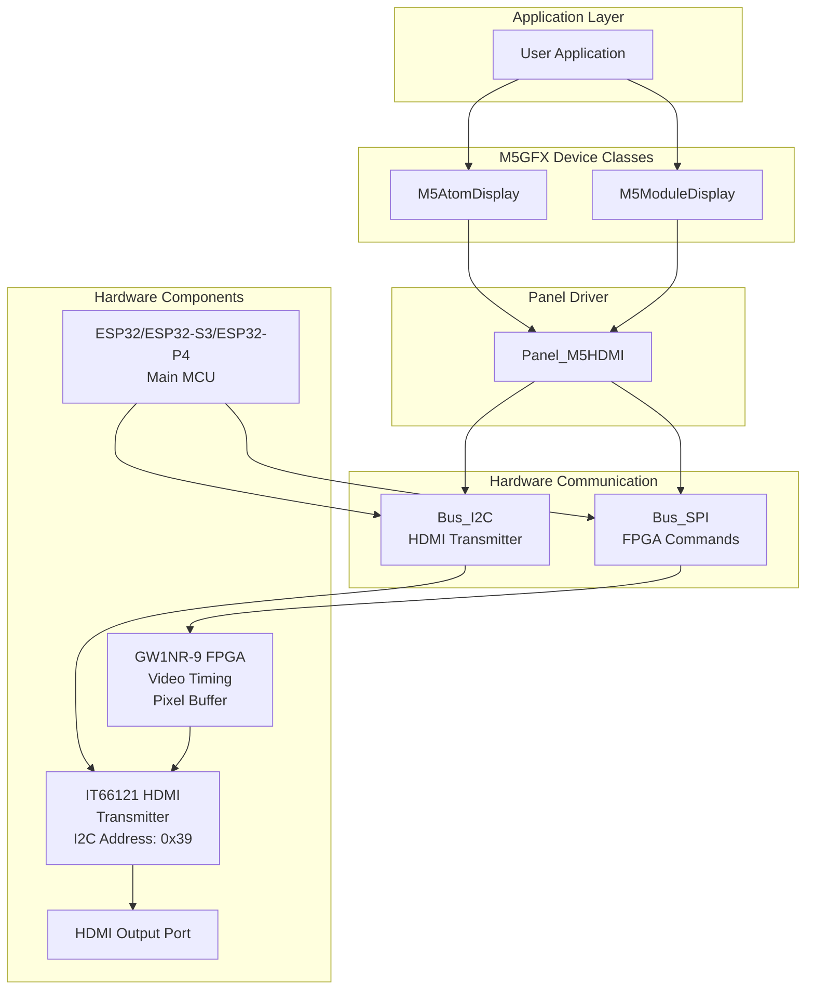
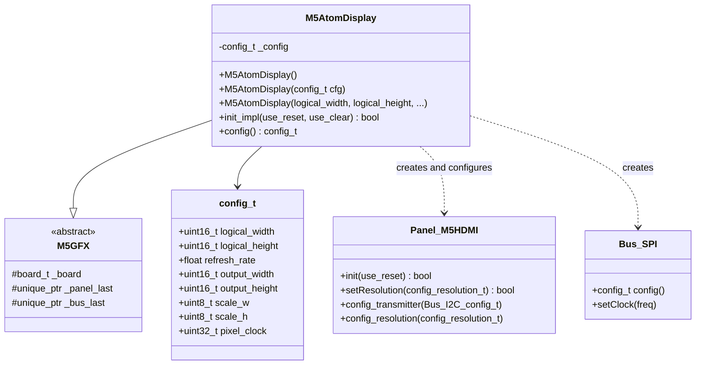
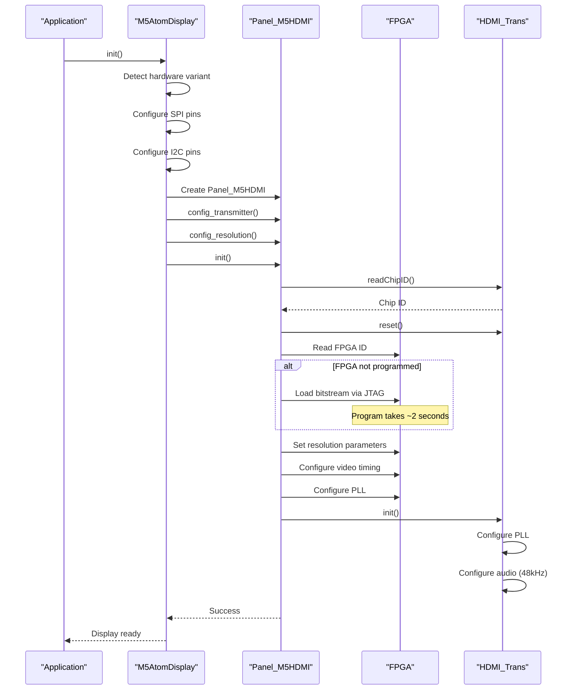
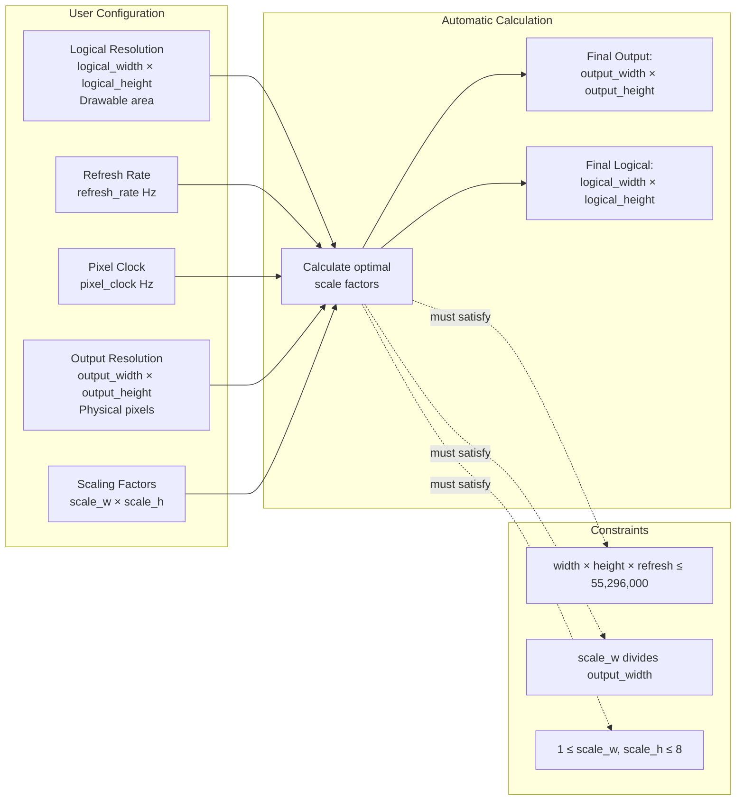

M5GFX Atom Display Device Classes

# Atom Display Device Classes

<details>
<summary>Relevant source files</summary>

The following files were used as context for generating this wiki page:

- [docs/ATOMDisplay.md](docs/ATOMDisplay.md)
- [docs/UnitRCA.md](docs/UnitRCA.md)
- [examples/Basic/TouchTest/TouchTest.ino](examples/Basic/TouchTest/TouchTest.ino)
- [src/M5AtomDisplay.h](src/M5AtomDisplay.h)
- [src/M5ModuleDisplay.h](src/M5ModuleDisplay.h)
- [src/M5ModuleRCA.h](src/M5ModuleRCA.h)
- [src/M5UnitRCA.h](src/M5UnitRCA.h)
- [src/lgfx/v1/panel/Panel_M5HDMI.cpp](src/lgfx/v1/panel/Panel_M5HDMI.cpp)
- [src/lgfx/v1/panel/Panel_M5HDMI.hpp](src/lgfx/v1/panel/Panel_M5HDMI.hpp)
- [src/lgfx/v1/panel/Panel_M5HDMI_FS.h](src/lgfx/v1/panel/Panel_M5HDMI_FS.h)

</details>


## Overview

The `M5AtomDisplay` and `M5ModuleDisplay` classes provide pre-configured HDMI video output for M5Stack hardware. Both classes wrap the `Panel_M5HDMI` driver with device-specific pin mappings and initialization logic, enabling ESP32/ESP32-S3/ESP32-P4 devices to output graphics to external displays via HDMI.

**Key Features:**
- Hardware-specific pin configuration for M5Atom and M5Stack Core devices
- Automatic platform detection (ESP32, ESP32-S3, ESP32-P4)
- Configurable resolution up to 1920×1080 (with refresh rate constraints)
- Hardware scaling support (1×-8× in both dimensions)
- SDL desktop simulation support for development without hardware

**Related Pages:**
- For underlying HDMI panel driver implementation details, see [HDMI Panel Driver](4.3)
- For composite video output (RCA), see [RCA and Composite Video Device Classes](2.5)
- For I2C-based display units, see [Unit Display Device Classes](2.4)

---

## System Architecture

Both `M5AtomDisplay` and `M5ModuleDisplay` are thin wrapper classes that configure and initialize the `Panel_M5HDMI` driver with hardware-specific pin mappings. The HDMI output system consists of three main hardware components working together:

**System Architecture Diagram:**



Sources: [src/M5AtomDisplay.h:1-256](), [src/M5ModuleDisplay.h:1-265](), [src/lgfx/v1/panel/Panel_M5HDMI.hpp:1-314]()

---

## Hardware Component Overview

The HDMI output system consists of three main components:

| Component | Model | Interface | Role |
|-----------|-------|-----------|------|
| **FPGA** | GW1NR-9 | SPI (80MHz write, 16MHz read) | Video timing generation, pixel buffering, hardware scaling, command processing |
| **HDMI Transmitter** | IT66121 | I2C address 0x39 (100-400kHz) | HDMI protocol encoding, EDID reading, signal conversion |
| **MCU** | ESP32/ESP32-S3/ESP32-P4 | SPI + I2C master | Application code, M5GFX library, command generation |

The ESP32 sends drawing commands to the FPGA via SPI and configures the HDMI transmitter via I2C. The FPGA maintains a frame buffer, generates video timing signals, and outputs to the HDMI transmitter chip which encodes the HDMI protocol.

**Note:** For detailed implementation of the Panel_M5HDMI driver, FPGA programming, and HDMI transmitter control, see [HDMI Panel Driver](4.3).

Sources: [src/lgfx/v1/panel/Panel_M5HDMI.cpp:18-591](), [src/lgfx/v1/panel/Panel_M5HDMI.hpp:210-237]()

---

## M5AtomDisplay Class

The `M5AtomDisplay` class provides HDMI output for M5Atom-series devices (ATOM S3, ATOM Lite, ATOM Matrix, ATOM PSRAM).

### Class Structure

**M5AtomDisplay Class Hierarchy:**



### Hardware Pin Configuration

The class automatically detects the M5Atom hardware variant and configures pins accordingly:

| Hardware | ESP32 Chip | SPI Host | SPI CS | SPI MOSI | SPI MISO | SPI SCLK | I2C Port | I2C SDA | I2C SCL |
|----------|-----------|----------|--------|----------|----------|----------|----------|---------|---------|
| ATOM S3/S3R | ESP32-S3 | SPI2_HOST | GPIO_8 | GPIO_6 | GPIO_5 | GPIO_7 | 1 | GPIO_38 | GPIO_39 |
| ATOM Lite | ESP32-PICO-D4 | VSPI_HOST | GPIO_33 | GPIO_19 | GPIO_22 | GPIO_23 | 1 | GPIO_25 | GPIO_21 |
| ATOM PSRAM | ESP32-PICO-V3-02 | VSPI_HOST | GPIO_33 | GPIO_19 | GPIO_22 | GPIO_5 | 1 | GPIO_25 | GPIO_21 |

**Detection Logic:**
- **Compile-time:** Uses `CONFIG_IDF_TARGET_ESP32S3` to detect ESP32-S3
- **Runtime:** Uses `lgfx::get_pkg_ver()` to distinguish ATOM Lite (PICO-D4) from ATOM PSRAM (PICO-V3-02) by checking package version
  - `EFUSE_RD_CHIP_VER_PKG_ESP32PICOD4` → ATOM Lite (SCLK on GPIO_23)
  - Other package variants → ATOM PSRAM (SCLK on GPIO_5)

Sources: [src/M5AtomDisplay.h:128-169]()

### Constructor Options

```cpp
// Simple constructor with defaults (1280x720@60Hz)
M5AtomDisplay display;

// Constructor with logical resolution
M5AtomDisplay display(1920, 1080);

// Full configuration constructor
M5AtomDisplay display(
    uint16_t logical_width,   // Drawable width
    uint16_t logical_height,  // Drawable height
    float refresh_rate,       // Hz (default: auto)
    uint16_t output_width,    // Physical width (default: auto)
    uint16_t output_height,   // Physical height (default: auto)
    uint_fast8_t scale_w,     // Horizontal scale (default: auto)
    uint_fast8_t scale_h,     // Vertical scale (default: auto)
    uint32_t pixel_clock      // Hz (default: 74250000)
);

// Configuration struct constructor
M5AtomDisplay::config_t cfg;
cfg.logical_width = 640;
cfg.logical_height = 480;
cfg.refresh_rate = 60.0f;
M5AtomDisplay display(cfg);
```

Sources: [src/M5AtomDisplay.h:74-99]()

### Initialization Flow



Sources: [src/M5AtomDisplay.h:101-250](), [src/lgfx/v1/panel/Panel_M5HDMI.cpp:506-591]()

---

## M5ModuleDisplay Class

The `M5ModuleDisplay` class provides HDMI output for M5Stack Core devices with an external HDMI module connected via the bottom port.

### Supported Host Devices

The class supports multiple M5Stack Core device families:

| Device Family | ESP32 Chip | Detection Method |
|--------------|-----------|------------------|
| M5Stack Core Basic/Fire/GO | ESP32 | Runtime: No AXP192 detected at I2C address 0x34 |
| M5Stack Core2/Tough | ESP32 | Runtime: AXP192 or AXP2101 detected (ID: 0x03 or 0x4A) |
| M5Stack CoreS3 | ESP32-S3 | Compile-time: `CONFIG_IDF_TARGET_ESP32S3` defined |
| M5Tab5 | ESP32-P4 | Compile-time: `CONFIG_IDF_TARGET_ESP32P4` defined |

### Pin Configuration Differences

The class automatically detects the host device and configures appropriate pins:

| Host Device | SPI Host | I2C Port | I2C SDA | I2C SCL | SPI CS | SPI MOSI | SPI MISO | SPI SCLK |
|-------------|----------|----------|---------|---------|--------|----------|----------|----------|
| Basic/Fire/GO | VSPI_HOST | 0 | GPIO_21 | GPIO_22 | GPIO_13 | GPIO_23 | GPIO_19 | GPIO_18 |
| Core2/Tough | VSPI_HOST | 1 | GPIO_21 | GPIO_22 | GPIO_19 | GPIO_23 | GPIO_38 | GPIO_18 |
| CoreS3 | SPI2_HOST | 1 | GPIO_12 | GPIO_11 | GPIO_7 | GPIO_37 | GPIO_35 | GPIO_36 |
| Tab5 | SPI2_HOST | 1 | GPIO_31 | GPIO_32 | GPIO_48 | GPIO_18 | GPIO_19 | GPIO_5 |

**Detection Implementation:**
1. **Compile-time:** Check `CONFIG_IDF_TARGET_ESP32S3` or `CONFIG_IDF_TARGET_ESP32P4`
2. **Runtime:** If ESP32, probe I2C port 1, address 0x34, register 0x03
   - Returns 0x03 → AXP192 (Core2)
   - Returns 0x4A → AXP2101 (Core2)
   - No response → Core Basic/Fire/GO

Sources: [src/M5ModuleDisplay.h:128-178](), [src/M5ModuleDisplay.h:162-177]()

### Configuration Differences from M5AtomDisplay

| Configuration | M5AtomDisplay | M5ModuleDisplay | Reason |
|---------------|--------------|-----------------|---------|
| `bus_shared` | `false` | `true` | M5Stack Core devices have SD card on same SPI bus |
| I2C frequency (transmitter) | 400kHz | 100kHz | More conservative for longer traces on Core devices |
| Target devices | M5Atom series | M5Stack Core series | Different form factors |
| Board enum | `board_M5AtomDisplay` | `board_M5ModuleDisplay` | Identification in auto-detection |

Sources: [src/M5ModuleDisplay.h:230](), [src/M5AtomDisplay.h:221]()

---

## Resolution Configuration System

### Configuration Parameters

The resolution system supports multiple parameters to balance drawable area, physical output, and performance:



### Resolution Calculation Algorithm

The `config_resolution()` method implements a sophisticated algorithm to determine optimal scaling and output parameters:

1. **Set defaults if not specified:**
   - If `logical_width` is 0, default to 1280×720
   - If `refresh_rate` is 0, auto-select based on total pixels (24/30/60 Hz)
   - If `output_width/height` and `scale_w/h` are all 0, calculate scaling to target 1280×720 output

2. **Calculate pixel clock limit:**
   ```cpp
   int limit = 55296000 / refresh_rate;  // Max total pixels per frame
   ```

3. **Determine scaling factors:**
   - Try to find integer scale factors that fit within the output resolution
   - Ensure `scale_w` divides `output_width` evenly
   - For pixel clocks > 74.25MHz, use half-clock mode and divide `scale_w` by 2

4. **Calculate offsets:**
   - Center the logical area within the output area using `offset_x` and `offset_y`

Sources: [src/lgfx/v1/panel/Panel_M5HDMI.cpp:771-896]()

### Supported Resolution Examples

Common configurations with their parameters:

| Logical | Output | Scale | Refresh | Pixel Clock | Notes |
|---------|--------|-------|---------|-------------|-------|
| 1280×720 | 1280×720 | 1×1 | 60 Hz | 74.25 MHz | Default, standard HD |
| 640×480 | 1280×960 | 2×2 | 60 Hz | 74.25 MHz | VGA scaled up |
| 320×240 | 1280×960 | 4×4 | 60 Hz | 74.25 MHz | QVGA scaled up |
| 1920×1080 | 1920×1080 | 1×1 | 24 Hz | 74.25 MHz | Full HD @ 24fps |
| 960×540 | 1920×1080 | 2×2 | 30 Hz | 148.5 MHz | Half HD scaled |
| 512×384 | 1280×768 | 2×2 | 60 Hz | 74.25 MHz | Custom balanced |

Sources: [docs/ATOMDisplay.md:18-77]()


---

## Performance and Configuration

### SPI Bus Configuration

Both classes configure the SPI bus for high-speed communication with the FPGA:

```cpp
auto cfg = bus_spi->config();
cfg.freq_write = 80000000;   // 80 MHz for writing
cfg.freq_read  = 16000000;   // 16 MHz for reading
cfg.spi_mode = 3;
cfg.dma_channel = SPI_DMA_CH_AUTO;  // Automatic DMA channel
```

The high write speed (80 MHz) enables fast pixel data transfer using DMA. For detailed performance optimization techniques, see [Performance Optimization Techniques](7.2).

### Color Depth Selection

The classes support multiple color depths via `setColorDepth()`:

| Depth | Constant | Bytes/Pixel | Colors | Use Case |
|-------|----------|-------------|--------|----------|
| 8-bit | `rgb332_1Byte` | 1 | 256 | Low bandwidth, text |
| 16-bit | `rgb565_2Byte` | 2 | 65,536 | Default, general use |
| 24-bit | `rgb888_3Byte` | 3 | 16.7M | High quality images |

Sources: [src/M5AtomDisplay.h:180-199](), [src/lgfx/v1/panel/Panel_M5HDMI.cpp:977-986]()

---

## SDL Simulation Support

Both classes support SDL-based desktop simulation for development without hardware:

```cpp
#if defined (SDL_h_)
  auto p = new lgfx::Panel_sdl();
  pnl_cfg.memory_width = _config.logical_width;
  pnl_cfg.panel_width = _config.logical_width;
  pnl_cfg.memory_height = _config.logical_height;
  pnl_cfg.panel_height = _config.logical_height;
  p->setWindowTitle("AtomDisplay");  // or "ModuleDisplay"
#endif
```

When compiled with SDL support:
- No FPGA or HDMI transmitter operations
- Graphics render to desktop window
- Same API as hardware version
- Useful for algorithm development and testing

Sources: [src/M5AtomDisplay.h:110-125](), [src/M5ModuleDisplay.h:110-125]()

---

## Usage Examples

### Basic Initialization

```cpp
#include <M5AtomDisplay.h>

M5AtomDisplay display;  // Default 1280×720@60Hz

void setup() {
  display.init();
  display.setRotation(1);  // 0°
  display.fillScreen(TFT_BLACK);
  display.setTextColor(TFT_WHITE);
  display.setFont(&fonts::Orbitron_Light_32);
  display.drawString("Hello HDMI!", 100, 100);
}
```

### Custom Resolution

```cpp
M5AtomDisplay display(640, 480, 60);  // VGA @ 60Hz

void setup() {
  display.init();
  // Display is automatically scaled 2× to 1280×960
}
```

### Advanced Configuration

```cpp
M5AtomDisplay::config_t cfg;
cfg.logical_width = 512;
cfg.logical_height = 384;
cfg.output_width = 1280;
cfg.output_height = 768;
cfg.scale_w = 2;
cfg.scale_h = 2;
cfg.refresh_rate = 60.0f;
cfg.pixel_clock = 74250000;

M5AtomDisplay display(cfg);
```

### Runtime Resolution Change

```cpp
// Change resolution after initialization
display.setResolution(800, 600, 60);  // SVGA @ 60Hz
```

Sources: [docs/ATOMDisplay.md:18-127]()