M5GFX Color Types and Conversion

# Color Types and Conversion

<details>
<summary>Relevant source files</summary>

The following files were used as context for generating this wiki page:

- [src/lgfx/v1/LGFXBase.cpp](src/lgfx/v1/LGFXBase.cpp)
- [src/lgfx/v1/LGFXBase.hpp](src/lgfx/v1/LGFXBase.hpp)
- [src/lgfx/v1/misc/colortype.hpp](src/lgfx/v1/misc/colortype.hpp)

</details>


## Purpose and Scope

This page documents the color type system used throughout the LovyanGFX graphics core. It covers the various color depth formats (rgb332, rgb565, rgb888, argb8888, etc.), the `color_conv_t` conversion infrastructure, and the mechanisms used to convert between different color representations during rendering operations.

For information about how colors are copied and transformed during image operations, see [Pixel Copy and Transformation](#3.3). For details on how colors are rendered to specific display hardware, see [Panel Driver Architecture](#4).

---

## Color Depth Enumeration

LovyanGFX supports multiple color depth formats through the `color_depth_t` enumeration. This enum defines both the bit depth and the specific format of color data.

### Supported Color Formats

| Format | Bits per Pixel | Description | Typical Use Case |
|--------|----------------|-------------|------------------|
| `rgb332_1Byte` | 8 | 3 bits red, 3 bits green, 2 bits blue | Low-memory displays, sprites |
| `rgb565_2Byte` | 16 | 5 bits red, 6 bits green, 5 bits blue | Most LCD displays |
| `rgb888_3Byte` | 24 | 8 bits per channel (BGR order) | High-color displays, image processing |
| `rgb666_3Byte` | 18 (stored in 24) | 6 bits per channel (BGR order) | Some LCD panels |
| `argb8888_4Byte` | 32 | 8 bits per channel + alpha | Alpha blending operations |
| `grayscale_8bit` | 8 | 8-bit grayscale | E-paper displays |
| `rgb565_nonswapped` | 16 | RGB565 without endian swap | Direct buffer access |

### Color Depth Flags

The `color_depth_t` enum includes special flags:
- **`has_palette`**: Indicates indexed color mode (1, 2, 4, or 8-bit indices)
- **`bit_mask`**: Mask to extract the bit depth value

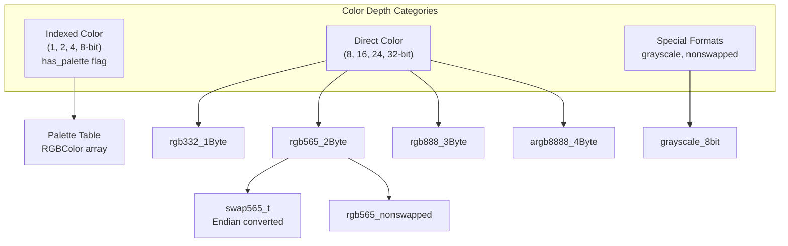

**Sources:** [src/lgfx/v1/LGFXBase.hpp:386-387](), [src/lgfx/v1/LGFXBase.cpp:52-57]()

---

## Color Type Structures

LovyanGFX defines type-safe structures for each color format. These structures provide compile-time type safety and consistent interfaces for color manipulation.

### Core Color Types

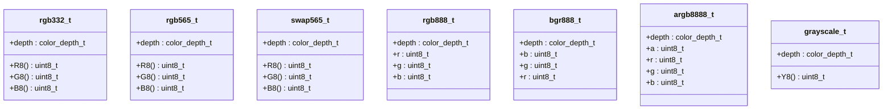

### Type-Specific Characteristics

Each color type structure includes:

1. **Static depth member**: Compile-time constant identifying the format
2. **Component accessors**: Methods like `R8()`, `G8()`, `B8()` that extract 8-bit channel values
3. **Memory layout**: Matches the expected byte order for the target format

The `bgr888_t` type specifically handles the BGR byte order used by many LCD controllers, while `rgb888_t` represents standard RGB order. The `swap565_t` type includes built-in endian conversion for 16-bit colors.

**Sources:** [src/lgfx/v1/LGFXBase.hpp:100-114](), [src/lgfx/v1/misc/colortype.hpp]() (referenced)

---

## Color Conversion Infrastructure

The `color_conv_t` structure provides the core color conversion mechanism. Each `LGFXBase` instance maintains two converters: one for writing to the display (`_write_conv`) and one for reading from it (`_read_conv`).

### color_conv_t Structure

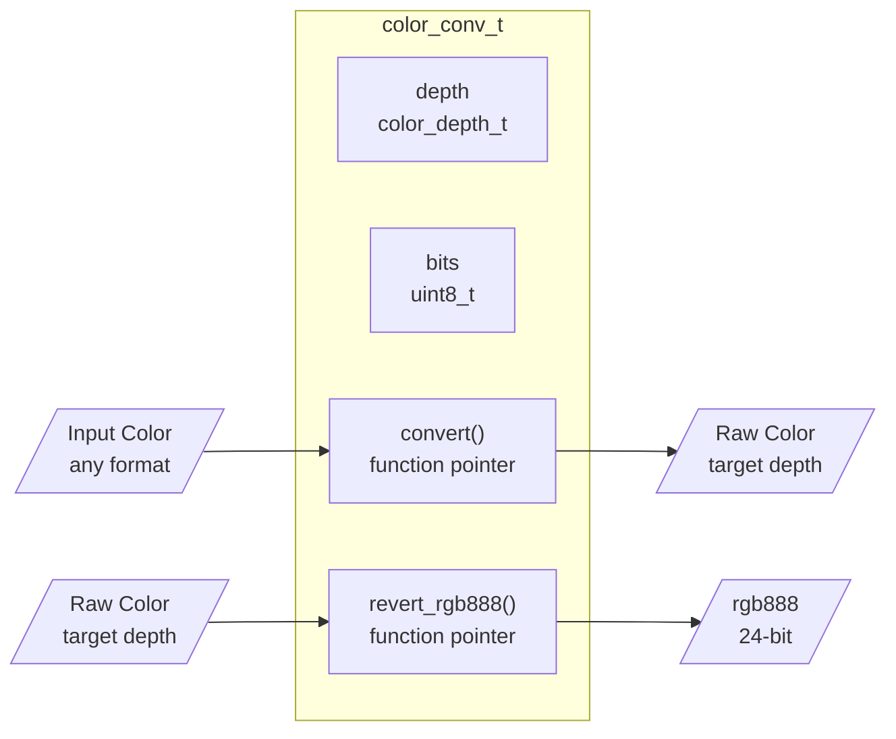

### Converter Lifecycle

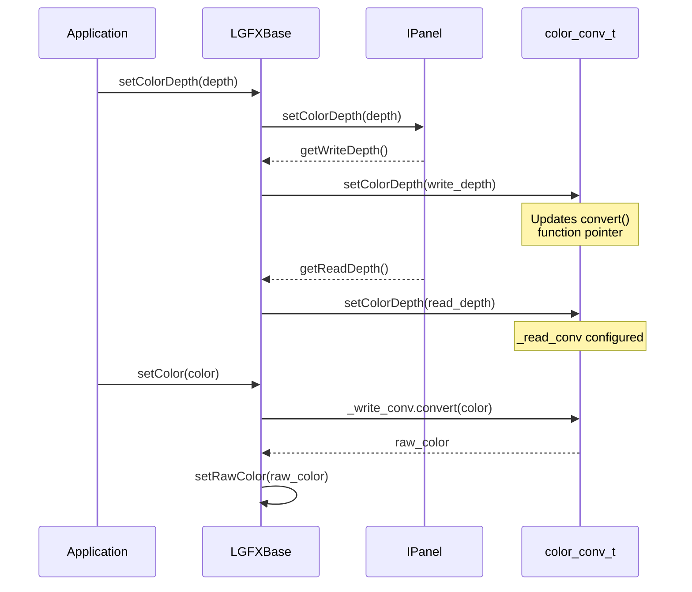

The `color_conv_t` structure maintains:
- **`depth`**: Current color depth format
- **`bits`**: Number of bits per pixel
- **`convert()`**: Function pointer to convert from RGB888 to target format
- **`revert_rgb888()`**: Function pointer to convert from target format back to RGB888

When color depth changes, the panel's write and read depths may differ (e.g., panel writes in RGB565 but reads in RGB666). The converters are updated accordingly.

**Sources:** [src/lgfx/v1/LGFXBase.cpp:52-57](), [src/lgfx/v1/LGFXBase.hpp:128-129]()

---

## Static Color Conversion Functions

`LGFXBase` provides static helper functions for creating color codes and converting between formats. These are constexpr functions that can be evaluated at compile time.

### Color Creation Functions

| Function | Input | Output | Description |
|----------|-------|--------|-------------|
| `color332(r,g,b)` | 3× uint8_t | uint8_t | Creates 8-bit RGB332 color |
| `color565(r,g,b)` | 3× uint8_t | uint16_t | Creates 16-bit RGB565 color |
| `color888(r,g,b)` | 3× uint8_t | uint32_t | Creates 24-bit RGB888 color |
| `swap565(r,g,b)` | 3× uint8_t | uint16_t | Creates endian-swapped RGB565 |
| `swap888(r,g,b)` | 3× uint8_t | uint32_t | Creates endian-swapped RGB888 |

### Format Conversion Functions

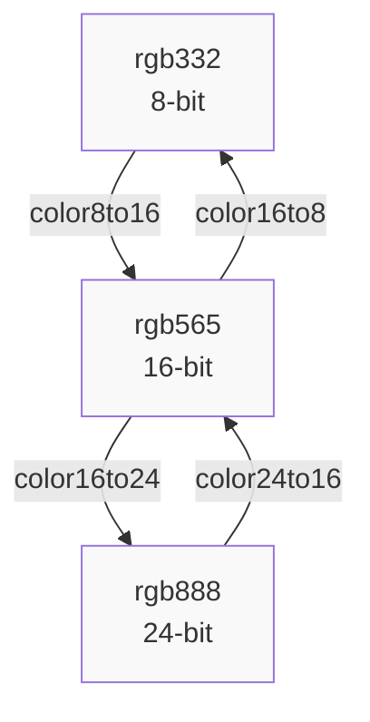

These conversion functions use the template-based `color_convert<TO, FROM>()` mechanism:

```cpp
// From LGFXBase.hpp
static uint8_t  color16to8 (uint32_t rgb565) { 
    return lgfx::color_convert<rgb332_t, rgb565_t>(rgb565); 
}
static uint16_t color8to16 (uint32_t rgb332) { 
    return lgfx::color_convert<rgb565_t, rgb332_t>(rgb332); 
}
static uint32_t color16to24(uint32_t rgb565) { 
    return lgfx::color_convert<rgb888_t, rgb565_t>(rgb565); 
}
static uint16_t color24to16(uint32_t rgb888) { 
    return lgfx::color_convert<rgb565_t, rgb888_t>(rgb888); 
}
```

The template system ensures compile-time resolution of conversion paths with minimal runtime overhead.

**Sources:** [src/lgfx/v1/LGFXBase.hpp:65-114]()

---

## Application Color Setting Flow

The color setting mechanism in LovyanGFX uses a multi-stage process to convert application-level colors to the raw format expected by the panel hardware.

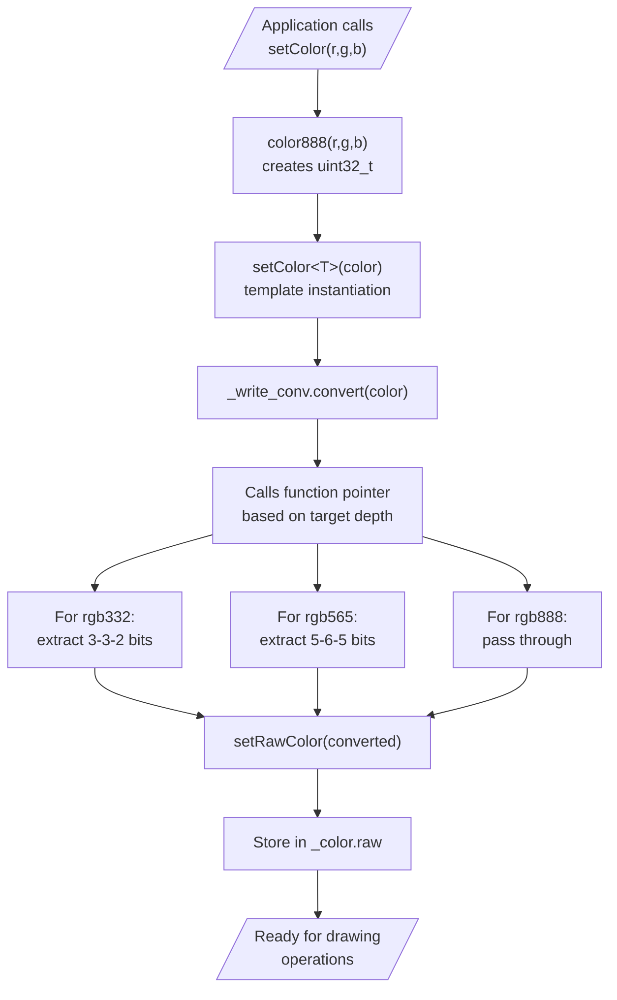

### Internal Color State

The `LGFXBase` class maintains color state in multiple representations:

- **`_color.raw`**: The raw color value in the panel's native format (8, 16, 24, or 32 bits)
- **`_base_rgb888`**: The base/background color in 24-bit RGB888 format
- **`_write_conv`**: Converter from application colors to panel write format
- **`_read_conv`**: Converter from panel read format to application colors

When `setColor()` is called:
1. Template overload resolves the input type
2. If not RGB888, converts to RGB888 first
3. `_write_conv.convert()` transforms to panel format
4. Result stored in `_color.raw` for immediate use

**Sources:** [src/lgfx/v1/LGFXBase.hpp:120-129](), [src/lgfx/v1/LGFXBase.cpp:52-57]()

---

## Read and Write Converter Separation

LovyanGFX maintains separate converters for read and write operations because many display panels have asymmetric color formats.

### Common Asymmetric Scenarios

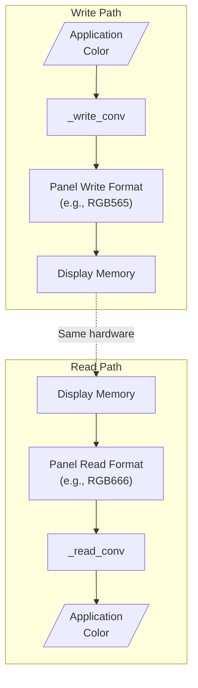

### Examples of Format Asymmetry

| Panel Type | Write Format | Read Format | Reason |
|------------|--------------|-------------|---------|
| ILI9342 | RGB565 | RGB666 | Controller adds padding bits on readback |
| ST7735 | RGB565 | RGB565 | Symmetric operation |
| IT8951 | Grayscale | Grayscale | E-paper with 4-bit grayscale |
| HDMI | RGB888 | Not readable | Output-only device |

### Converter Configuration

When color depth is set via `setColorDepth()`, both converters are configured:

```cpp
// From LGFXBase.cpp:52-57
void LGFXBase::setColorDepth(color_depth_t depth)
{
    _panel->setColorDepth(depth);
    _write_conv.setColorDepth(_panel->getWriteDepth());
    _read_conv.setColorDepth(_panel->getReadDepth());
}
```

The panel implementation determines the actual write and read formats, which may differ from the requested depth due to hardware limitations.

**Sources:** [src/lgfx/v1/LGFXBase.cpp:52-57](), [src/lgfx/v1/LGFXBase.hpp:128-129]()

---

## Palette Mode and Indexed Colors

Palette mode allows storing images and sprites using indexed colors (1, 2, 4, or 8 bits per pixel), with the actual colors stored in a separate palette table.

### Palette Color System

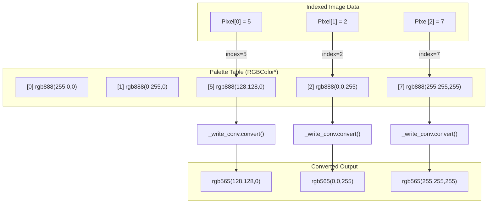

### Palette Detection and Usage

The system detects palette mode using the `has_palette` flag in `color_depth_t`:

```cpp
// Check if palette mode is active
bool hasPalette() const { return _palette_count; }

// Get palette table pointer
RGBColor* getPalette() const { return getPalette_impl(); }

// Get number of colors in palette
uint32_t getPaletteCount() const { return _palette_count; }
```

During rendering operations, the `pixelcopy_t` structure receives the palette pointer, and the conversion function performs a two-stage process:
1. Use the pixel value as an index into the palette table
2. Convert the RGB888 palette entry to the target format

### Benefits of Palette Mode

- **Memory efficiency**: 8-bit indexed mode uses 1/3 the memory of RGB888
- **Fast color changes**: Modify palette entries to recolor entire images
- **Retro graphics**: Emulate classic systems with limited color palettes

**Sources:** [src/lgfx/v1/LGFXBase.hpp:313-315](), [src/lgfx/v1/LGFXBase.cpp:52-57]()

---

## Color Conversion in Rendering Operations

Color conversion occurs at multiple points during rendering operations, optimized for performance through function pointer dispatch.

### Drawing Operation Flow

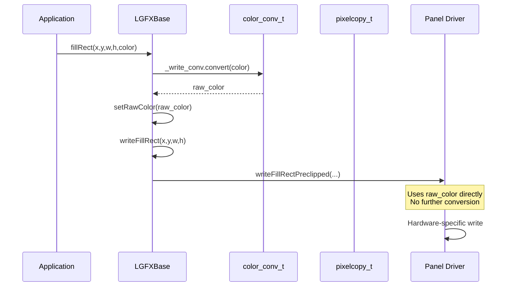

### Image Rendering with Conversion

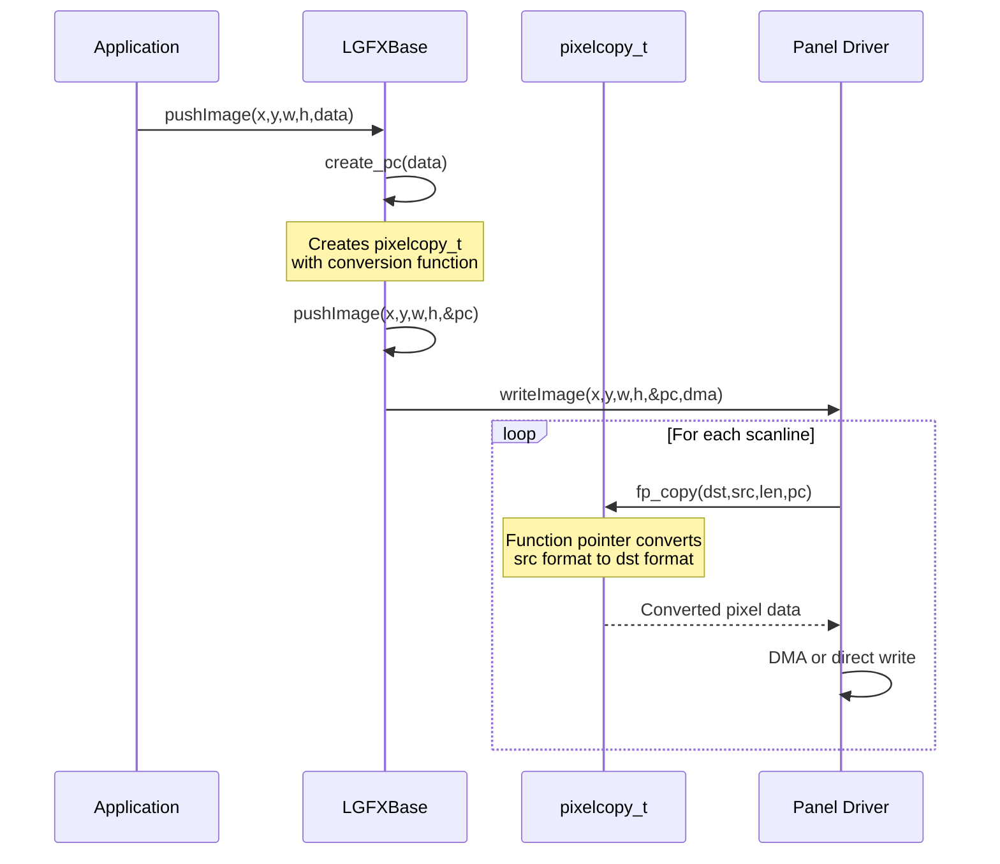

### Function Pointer Selection

The conversion function pointer is selected based on source and destination formats:

```cpp
// Example from LGFXBase.cpp:1394-1400
pc.fp_copy = (dst_depth == rgb565_2Byte) ? pixelcopy_t::copy_grayscale_affine<swap565_t>
           : (dst_depth == rgb332_1Byte) ? pixelcopy_t::copy_grayscale_affine<rgb332_t>
           : (dst_depth == rgb888_3Byte) ? pixelcopy_t::copy_grayscale_affine<bgr888_t>
           : (dst_depth == rgb666_3Byte) ? pixelcopy_t::copy_grayscale_affine<bgr666_t>
           : (dst_depth == rgb565_nonswapped) ? pixelcopy_t::copy_grayscale_affine<rgb565_t>
           : (dst_depth == grayscale_8bit) ? pixelcopy_t::copy_grayscale_affine<grayscale_t>
           : nullptr;
```

This template-based dispatch system allows the compiler to generate optimized conversion code for each format combination without virtual function overhead.

**Sources:** [src/lgfx/v1/LGFXBase.cpp:1383-1403](), [src/lgfx/v1/LGFXBase.cpp:1425-1443]()

---

## Swap Bytes Setting

The `_swapBytes` flag controls endian conversion for 16-bit and 32-bit color formats, primarily used when working with sprites and external image data.

### Swap Bytes Impact

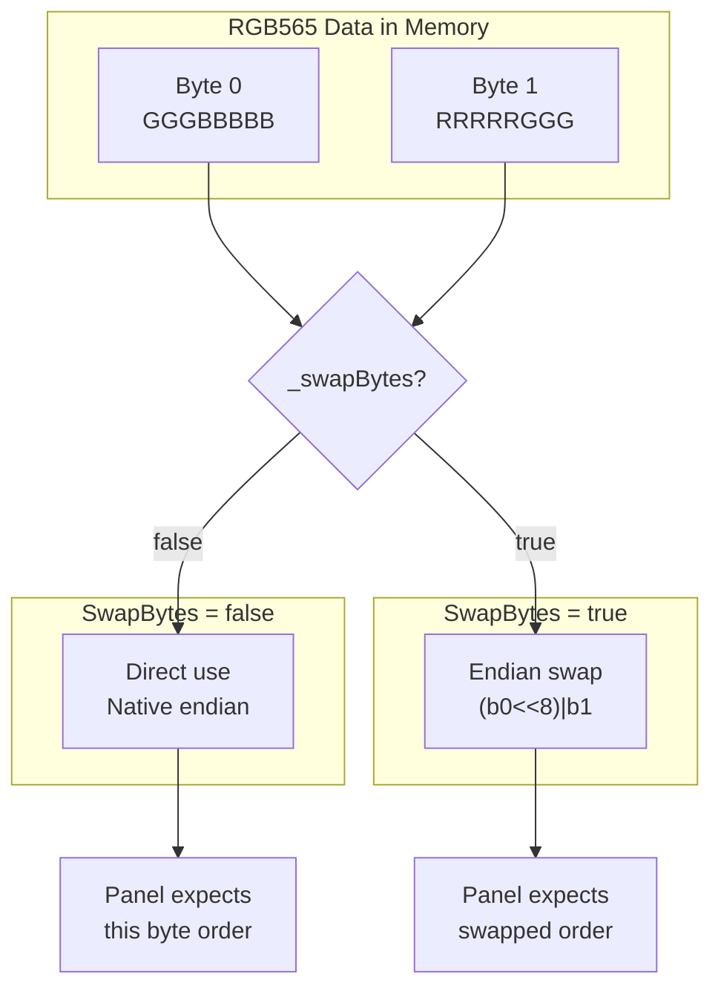

### When to Use SwapBytes

```cpp
// Check current setting
bool getSwapBytes() const { return _swapBytes; }

// Enable swap for big-endian RGB565 data
setSwapBytes(true);
```

Common scenarios requiring swap bytes:
- Loading BMP files (often use big-endian RGB565)
- Drawing sprites created on different endian systems
- Working with external image buffers

The swap bytes setting affects:
- `writePixels()` and `pushPixels()` operations
- `readRect()` operations with 16-bit output
- Image push operations with explicit swap parameter

**Sources:** [src/lgfx/v1/LGFXBase.hpp:318-319](), [src/lgfx/v1/LGFXBase.cpp:1760-1772]()

---

## Integration with Pixel Copy System

The color conversion system integrates tightly with the pixel copy system (detailed in [Pixel Copy and Transformation](#3.3)). The `pixelcopy_t` structure uses the color converter information to select appropriate copy functions.

### Converter to Pixelcopy Bridge

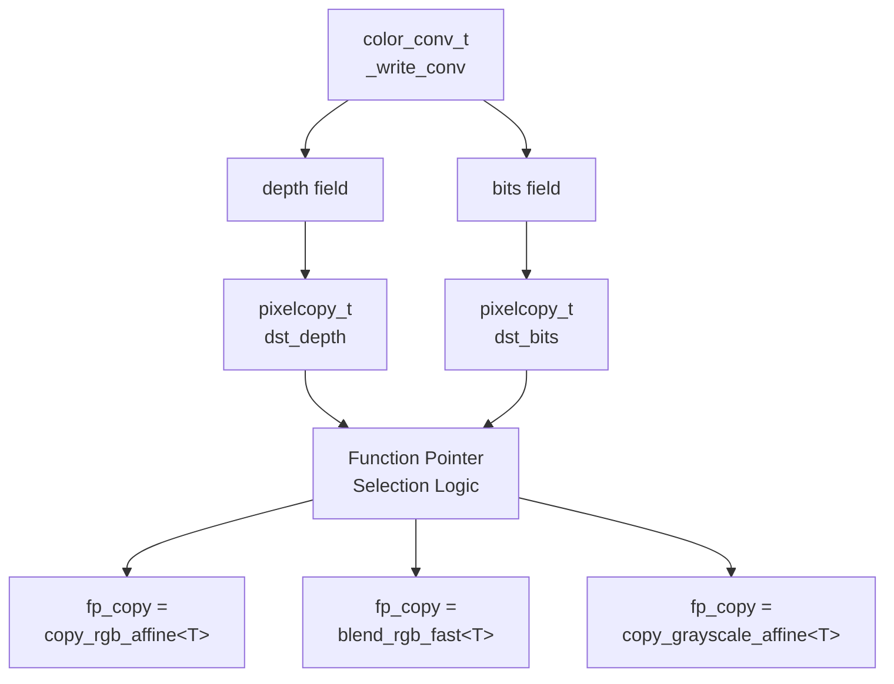

Key integration points:

1. **Depth propagation**: `_write_conv.depth` → `pixelcopy_t.dst_depth`
2. **Bits propagation**: `_write_conv.bits` → `pixelcopy_t.dst_bits`
3. **Palette handling**: Palette pointer passed through pixelcopy_t
4. **Function selection**: Based on combined source/destination formats

This tight integration ensures that color conversion happens efficiently during image operations without redundant format checks or conversions.

**Sources:** [src/lgfx/v1/LGFXBase.cpp:1383-1403](), [src/lgfx/v1/LGFXBase.cpp:1754-1774]()