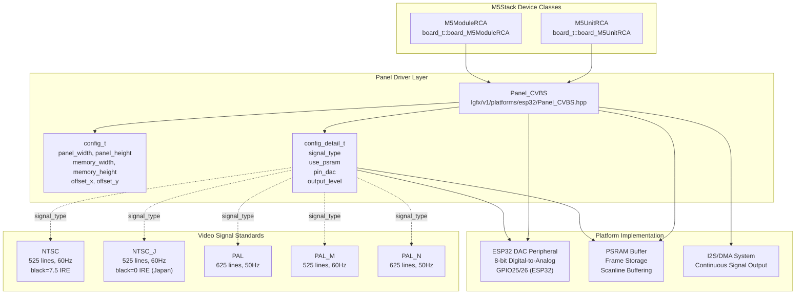
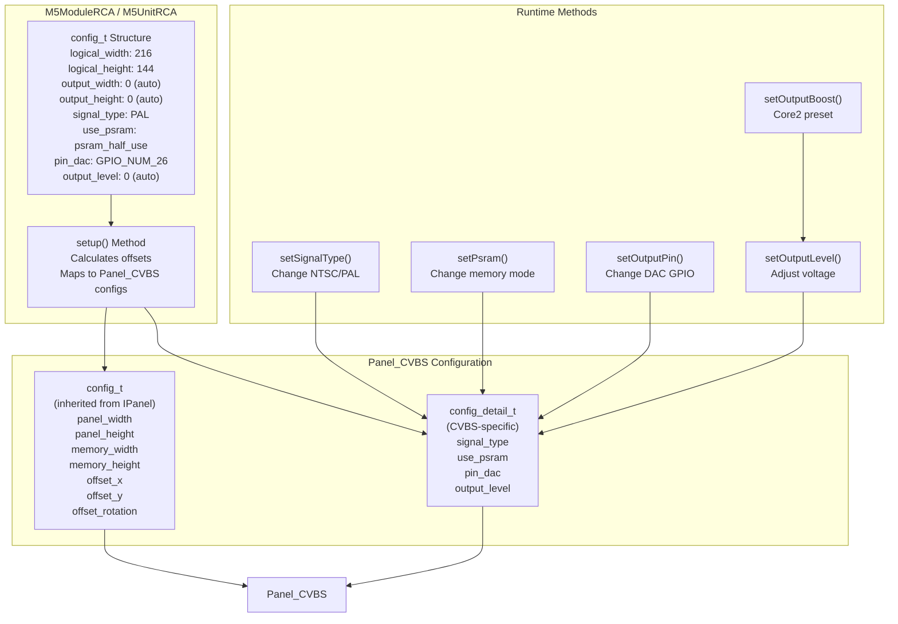
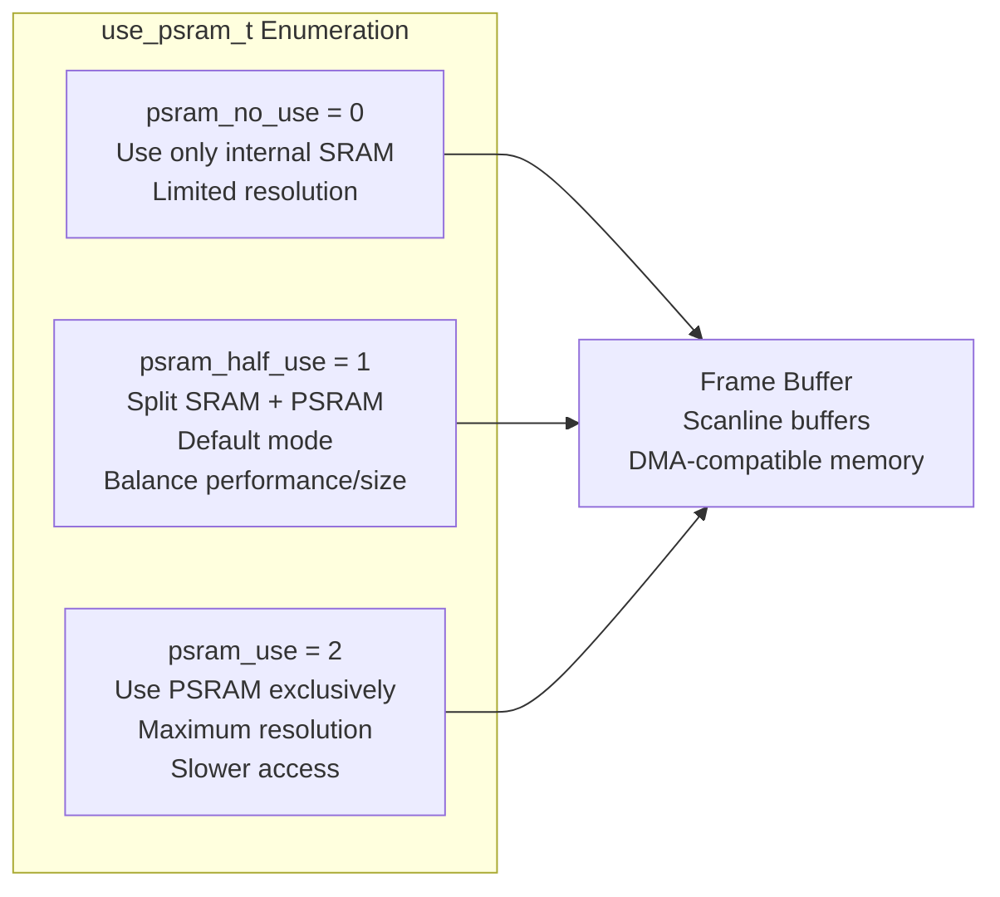
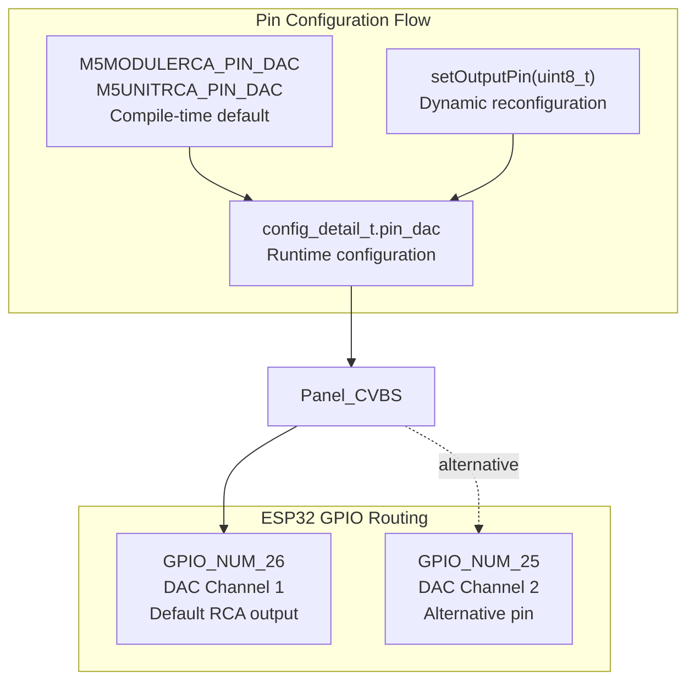
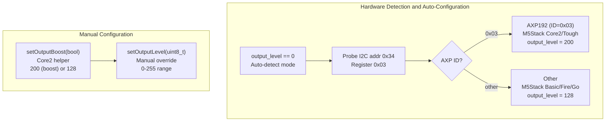
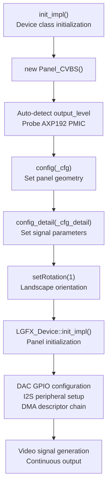
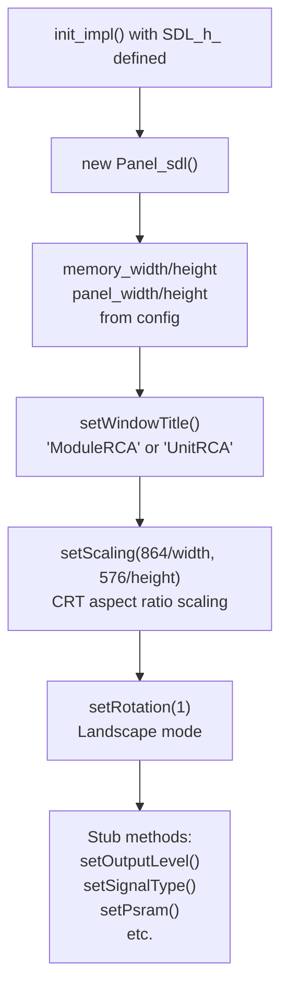

M5GFX Composite Video Panel Driver

# Composite Video Panel Driver

<details>
<summary>Relevant source files</summary>

The following files were used as context for generating this wiki page:

- [src/M5AtomDisplay.h](src/M5AtomDisplay.h)
- [src/M5ModuleDisplay.h](src/M5ModuleDisplay.h)
- [src/M5ModuleRCA.h](src/M5ModuleRCA.h)
- [src/M5UnitRCA.h](src/M5UnitRCA.h)

</details>


## Purpose and Scope

This document describes the `Panel_CVBS` driver implementation for generating composite video signals (NTSC/PAL) via DAC output on ESP32 hardware. The panel driver enables M5Stack devices to output analog video signals through RCA connectors, supporting standard television video formats.

The `Panel_CVBS` driver is used by two M5Stack device classes: `M5ModuleRCA` and `M5UnitRCA`. For HDMI digital video output, see [HDMI Panel Driver](#4.3). For general panel architecture concepts, see [Panel Driver Architecture](#4).

**Sources:** [src/M5ModuleRCA.h:1-297](), [src/M5UnitRCA.h:1-297]()

---

## Panel_CVBS Architecture

The `Panel_CVBS` driver is a platform-specific panel implementation that generates composite video baseband signals (CVBS - Composite Video Baseband Signal) using the ESP32's built-in DAC peripheral. Unlike LCD panel drivers that communicate via SPI/I2C, this driver directly outputs analog voltage levels representing luminance and chrominance information encoded according to NTSC or PAL standards.



**Sources:** [src/M5ModuleRCA.h:10-11](), [src/M5UnitRCA.h:10-11](), [src/M5ModuleRCA.h:53-54](), [src/M5UnitRCA.h:53-54]()

---

## Signal Type Configuration

The `Panel_CVBS` driver supports five composite video standards through the `signal_type_t` enumeration. Each standard defines specific timing, line count, field rate, and pedestal levels.

| Signal Type | Lines | Field Rate | Pedestal Level | Region |
|-------------|-------|-----------|----------------|---------|
| `NTSC` | 525 | 60Hz | 7.5 IRE | North America |
| `NTSC_J` | 525 | 60Hz | 0 IRE | Japan |
| `PAL` | 625 | 50Hz | 0 IRE | Europe/Asia |
| `PAL_M` | 525 | 60Hz | 0 IRE | Brazil |
| `PAL_N` | 625 | 50Hz | 0 IRE | Argentina |

The signal type is configured via `config_detail_t::signal_type` and can be changed at runtime using the `setSignalType()` method.

**Sources:** [src/M5ModuleRCA.h:35-36](), [src/M5ModuleRCA.h:58](), [src/M5ModuleRCA.h:258-270](), [src/M5UnitRCA.h:35-36](), [src/M5UnitRCA.h:258-270]()

---

## Configuration System

The composite video panel uses a two-tier configuration structure separating display geometry from signal generation parameters.



### Panel Geometry Configuration

The `config_t` structure (inherited from `IPanel`) defines display dimensions:

- **`panel_width` / `panel_height`**: Logical drawing resolution (default 216×144)
- **`memory_width` / `memory_height`**: Physical buffer resolution (auto-calculated or specified)
- **`offset_x` / `offset_y`**: Centering offsets when logical < memory dimensions
- **`offset_rotation`**: Fixed at 3 for proper orientation

**Sources:** [src/M5ModuleRCA.h:65-75](), [src/M5ModuleRCA.h:114-138](), [src/M5UnitRCA.h:65-75](), [src/M5UnitRCA.h:114-138]()

### Signal Generation Configuration

The `config_detail_t` structure contains CVBS-specific parameters:

- **`signal_type`**: Video standard (NTSC, NTSC_J, PAL, PAL_M, PAL_N)
- **`use_psram`**: Memory allocation strategy (see Memory Management section)
- **`pin_dac`**: DAC output GPIO pin (GPIO_NUM_26 on ESP32)
- **`output_level`**: Voltage adjustment value (0-255, default 128)

**Sources:** [src/M5ModuleRCA.h:134-137](), [src/M5UnitRCA.h:134-137]()

---

## Memory Management and PSRAM Usage

Composite video generation requires continuous frame buffer access. The `use_psram` parameter controls memory allocation strategy through three modes:



| Mode | Value | Memory Source | Use Case |
|------|-------|---------------|----------|
| `psram_no_use` | 0 | Internal SRAM only | Small resolutions, faster access |
| `psram_half_use` | 1 | SRAM + PSRAM split | Default, balanced performance |
| `psram_use` | 2 | PSRAM only | Maximum resolution, lower speed |

The PSRAM mode can be changed at runtime using `setPsram()`:

```cpp
void setPsram(use_psram_t use_psram);  // Typed enum
void setPsram(uint8_t use_psram);      // Numeric value 0-2
```

**Sources:** [src/M5ModuleRCA.h:44-46](), [src/M5ModuleRCA.h:59-63](), [src/M5ModuleRCA.h:273-292](), [src/M5UnitRCA.h:44-46](), [src/M5UnitRCA.h:273-292]()

---

## Output Signal Control

### DAC Pin Configuration

The composite video signal is output through an ESP32 DAC-capable GPIO pin. The default configuration is `GPIO_NUM_26` on ESP32, which is compatible with M5Stack Module/Unit RCA hardware.



**Sources:** [src/M5ModuleRCA.h:15-20](), [src/M5ModuleRCA.h:249-256](), [src/M5UnitRCA.h:15-20](), [src/M5UnitRCA.h:249-256]()

### Output Level Adjustment

The `output_level` parameter (0-255) adjusts the DAC output voltage to compensate for protection resistors in the signal path. Different M5Stack hardware requires different levels due to varying resistor values:



The output level is auto-detected on ESP32 by probing for the AXP192 PMIC (present on Core2/Tough). If detected, level is set to 200; otherwise defaults to 128 for Basic/Fire/Go.

**Sources:** [src/M5ModuleRCA.h:196-211](), [src/M5ModuleRCA.h:232-247](), [src/M5UnitRCA.h:196-211](), [src/M5UnitRCA.h:232-247]()

---

## Platform-Specific Implementation

### ESP32 Platform

On ESP32 hardware, the `Panel_CVBS` driver uses the DAC peripheral with I2S/DMA for continuous signal generation. The initialization process includes:

1. Allocate frame buffer (SRAM/PSRAM based on `use_psram`)
2. Configure DAC output on specified GPIO pin
3. Setup I2S peripheral for timed DAC updates
4. Configure DMA descriptors for scanline streaming
5. Generate sync pulses and video data according to `signal_type`



**Sources:** [src/M5ModuleRCA.h:183-230](), [src/M5UnitRCA.h:183-230]()

### SDL Simulation Platform

When compiled with SDL support, the device classes instantiate `Panel_sdl` instead of `Panel_CVBS`, rendering to a desktop window with appropriate scaling for composite video aspect ratios.



The SDL implementation provides no-op stubs for all CVBS-specific methods (signal type, output level, PSRAM control) since they have no meaning in desktop simulation.

**Sources:** [src/M5ModuleRCA.h:140-180](), [src/M5UnitRCA.h:140-180]()

---

## M5ModuleRCA Device Class

The `M5ModuleRCA` class provides a pre-configured composite video display for the M5Stack Module RCA hardware, which connects to the M5Stack Core/Core2 via the M-Bus connector.

### Default Configuration

| Parameter | Default Value | Macro Override |
|-----------|---------------|----------------|
| Logical Width | 216 | `M5MODULERCA_LOGICAL_WIDTH` |
| Logical Height | 144 | `M5MODULERCA_LOGICAL_HEIGHT` |
| Signal Type | PAL | `M5MODULERCA_SIGNAL_TYPE` |
| Output Width | 0 (auto) | `M5MODULERCA_OUTPUT_WIDTH` |
| Output Height | 0 (auto) | `M5MODULERCA_OUTPUT_HEIGHT` |
| PSRAM Mode | `psram_half_use` | `M5MODULERCA_USE_PSRAM` |
| DAC Pin | GPIO_NUM_26 | `M5MODULERCA_PIN_DAC` |
| Output Level | 0 (auto) | `M5MODULERCA_OUTPUT_LEVEL` |

### Initialization Example

```cpp
// Default configuration
M5ModuleRCA display;
display.init();

// Custom resolution and signal type
M5ModuleRCA display(320, 240, 0, 0, 
                    M5ModuleRCA::signal_type_t::NTSC);
display.init();

// Using config_t structure
M5ModuleRCA::config_t cfg;
cfg.logical_width = 256;
cfg.logical_height = 192;
cfg.signal_type = M5ModuleRCA::signal_type_t::NTSC_J;
cfg.use_psram = M5ModuleRCA::psram_use;
M5ModuleRCA display(cfg);
display.init();
```

**Sources:** [src/M5ModuleRCA.h:29-49](), [src/M5ModuleRCA.h:65-75](), [src/M5ModuleRCA.h:79-97]()

---

## M5UnitRCA Device Class

The `M5UnitRCA` class provides identical functionality to `M5ModuleRCA` but is designated for the M5Stack Unit RCA hardware, which connects via PortA/PortB Grove connectors.

The class implementation is nearly identical to `M5ModuleRCA`, differing only in:
- Board type identifier: `board_t::board_M5UnitRCA`
- SDL window title: "UnitRCA" vs "ModuleRCA"

All configuration parameters, macros, and methods are the same.

**Sources:** [src/M5UnitRCA.h:29-49](), [src/M5UnitRCA.h:65-75](), [src/M5UnitRCA.h:79-97]()

---

## Runtime Configuration Methods

Both device classes expose methods to reconfigure the composite video output after initialization:

| Method | Parameters | Purpose |
|--------|------------|---------|
| `setSignalType()` | `signal_type_t` | Switch between NTSC/PAL variants |
| `setOutputLevel()` | `uint8_t (0-255)` | Adjust DAC output voltage |
| `setOutputBoost()` | `bool` | Preset for Core2 (200) or Basic (128) |
| `setOutputPin()` | `uint8_t` | Change DAC GPIO pin |
| `setPsram()` | `use_psram_t` or `uint8_t` | Change memory allocation mode |

All methods retrieve the current `Panel_CVBS` instance via `_panel_last.get()`, read the existing configuration, modify the specified parameter, and write the updated configuration back to the panel.

**Example Usage:**

```cpp
M5ModuleRCA display;
display.init();

// Switch from default PAL to NTSC
display.setSignalType(M5ModuleRCA::signal_type_t::NTSC);

// Boost output for Core2 hardware
display.setOutputBoost(true);

// Use PSRAM exclusively for higher resolution
display.setPsram(M5ModuleRCA::psram_use);
```

**Sources:** [src/M5ModuleRCA.h:232-292](), [src/M5UnitRCA.h:232-292]()