M5GFX Cross-Platform Code Patterns

# Cross-Platform Code Patterns

<details>
<summary>Relevant source files</summary>

The following files were used as context for generating this wiki page:

- [src/M5AtomDisplay.h](src/M5AtomDisplay.h)
- [src/M5ModuleDisplay.h](src/M5ModuleDisplay.h)
- [src/M5ModuleRCA.h](src/M5ModuleRCA.h)
- [src/M5UnitRCA.h](src/M5UnitRCA.h)
- [src/lgfx/v1/platforms/esp32/Bus_SPI.cpp](src/lgfx/v1/platforms/esp32/Bus_SPI.cpp)
- [src/lgfx/v1/platforms/esp32/Bus_SPI.hpp](src/lgfx/v1/platforms/esp32/Bus_SPI.hpp)
- [src/lgfx/v1/platforms/esp32/common.cpp](src/lgfx/v1/platforms/esp32/common.cpp)
- [src/lgfx/v1/platforms/esp32/common.hpp](src/lgfx/v1/platforms/esp32/common.hpp)
- [src/lgfx/v1/platforms/sdl/Panel_sdl.cpp](src/lgfx/v1/platforms/sdl/Panel_sdl.cpp)
- [src/lgfx/v1/platforms/sdl/Panel_sdl.hpp](src/lgfx/v1/platforms/sdl/Panel_sdl.hpp)
- [src/lgfx/v1/platforms/sdl/common.cpp](src/lgfx/v1/platforms/sdl/common.cpp)

</details>


## Purpose and Scope

This page documents the code patterns and techniques used in M5GFX to support both embedded ESP32 hardware and desktop SDL simulation from a single codebase. It covers conditional compilation strategies, platform detection macros, dual implementation patterns, entry point management, and build configuration approaches that enable developers to write platform-agnostic application code while providing platform-specific implementations underneath.

For information about the SDL platform implementation details, see [SDL Simulation Platform](#5.6). For build system configuration details, see [PlatformIO Project Configuration](#6.2) and [SDL Development Workflow](#6.3).

## Cross-Platform Strategy Overview

M5GFX employs compile-time platform selection using preprocessor directives to maintain separate code paths for ESP32 and SDL platforms while presenting a unified API to application code. This approach enables the same application code to run on both physical hardware and desktop simulation without modification.

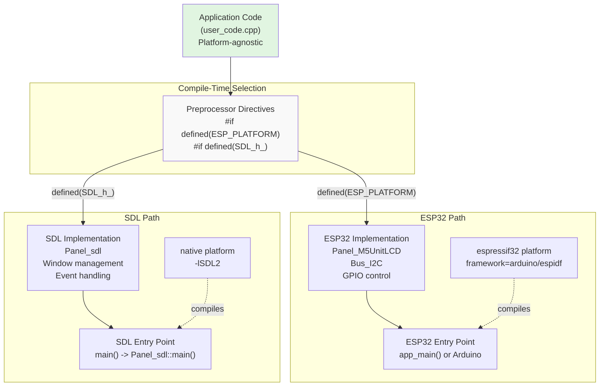

**Sources:** [src/M5UnitLCD.h:10-14](), [examples/PlatformIO_SDL/src/user_code.cpp:18-29](), [examples/PlatformIO_SDL/platformio.ini:17-66]()

## Platform Detection Macros

The codebase uses specific preprocessor macros to detect the target platform at compile time. These macros control which implementation code is included and compiled.

| Macro | Definition Source | Purpose | Usage Context |
|-------|------------------|---------|---------------|
| `ESP_PLATFORM` | ESP-IDF/Arduino ESP32 framework | Indicates ESP32 target platform | Device implementations, bus drivers, GPIO |
| `SDL_h_` | SDL2 library header inclusion | Indicates SDL desktop simulation | Window management, event emulation |
| `ARDUINO` | Arduino framework | Indicates Arduino build environment | Arduino-specific APIs |
| `CONFIG_IDF_TARGET_*` | ESP-IDF sdkconfig | Specific ESP32 variant (ESP32, S2, S3, C3, C6, P4) | Chip-specific register access |
| `M5GFX_SCALE` | Build flag | Configures SDL window scaling | Desktop display sizing |
| `M5GFX_BOARD` | Build flag | Forces specific board type | Testing specific device configurations |

**Primary Detection Pattern:**

```cpp
#if defined (ESP_PLATFORM)
  // ESP32 hardware implementation
  #include <sdkconfig.h>
#else
  // SDL simulation implementation
  #include "lgfx/v1/platforms/sdl/Panel_sdl.hpp"
#endif
```

**Chip Variant Detection:**

[src/lgfx/v1/platforms/esp32/common.cpp:18-19]() uses `ESP_PLATFORM` to include ESP32-specific headers, while [src/M5AtomDisplay.h:27-29]() and [src/M5ModuleDisplay.h:27-29]() check for specific chip targets like `CONFIG_IDF_TARGET_ESP32S3` to enable platform-specific features.

**Sources:** [src/M5UnitLCD.h:10-14](), [src/M5UnitOLED.h:10-14](), [src/M5UnitGLASS.h:10-14](), [src/M5AtomDisplay.h:27-29](), [src/M5ModuleDisplay.h:27-29](), [src/lgfx/v1/platforms/esp32/common.cpp:18-19]()

## Conditional Compilation Structure

Device classes use conditional compilation to provide completely different implementations for ESP32 and SDL while maintaining identical public APIs. This pattern appears consistently throughout the M5GFX wrapper classes.

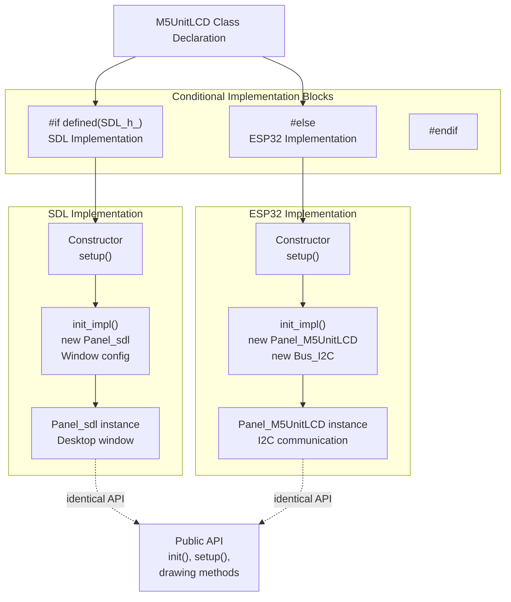

**Sources:** [src/M5UnitLCD.h:52-107](), [src/M5UnitLCD.h:108-185]()

## Device Class Dual Implementation Pattern

All M5GFX device wrapper classes follow a consistent dual implementation pattern. The public API remains identical across platforms, but internal initialization differs completely.

### Common Structure

Each device class contains:
1. **Shared elements:** Class declaration, configuration structure, public API
2. **Platform-specific elements:** Constructor details, `init_impl()` method, panel/bus instantiation

### M5UnitLCD Example Pattern

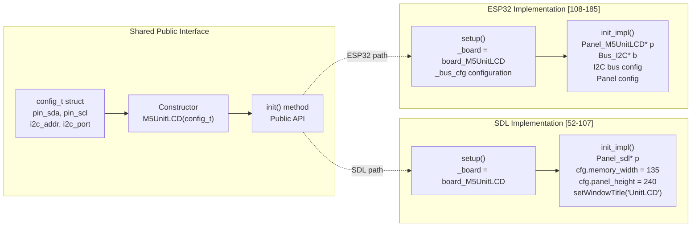

**Key Implementation Details:**

**SDL Path** [src/M5UnitLCD.h:74-106]():
- Creates `Panel_sdl` instance
- Configures memory dimensions (135x240)
- Sets window title and scaling
- No bus configuration needed (window-based)

**ESP32 Path** [src/M5UnitLCD.h:154-184]():
- Creates `Panel_M5UnitLCD` instance
- Creates `Bus_I2C` instance
- Configures bus parameters (pins, frequency, I2C port)
- Links panel to bus
- Manages resource lifetime with smart pointers

**Sources:** [src/M5UnitLCD.h:35-186]()

## Entry Point Patterns

Different platforms require different entry point signatures and initialization sequences. M5GFX provides patterns for both ESP32 and SDL environments.

### SDL Entry Point Pattern

The SDL platform requires a standard C++ `main()` function that delegates to `Panel_sdl::main()` for event loop management.

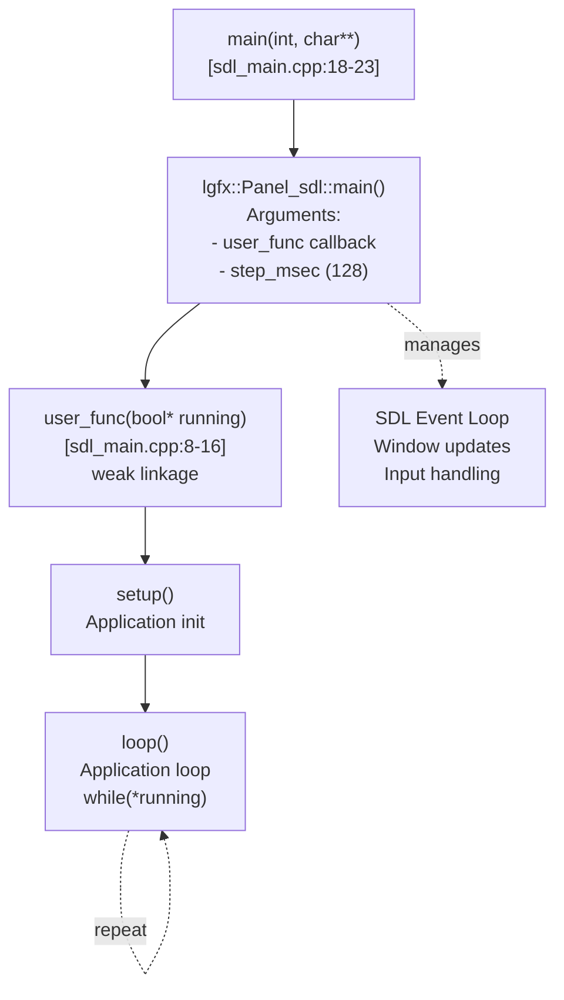

**Implementation:**

[examples/PlatformIO_SDL/src/sdl_main.cpp:2-25]()
- Conditional compilation: `#if defined ( SDL_h_ )`
- `__attribute__((weak))` allows user override of `user_func()`
- `Panel_sdl::main()` handles event loop and timing
- Step execution parameter (128ms) supports debugging with breakpoints

### ESP32 Entry Point Patterns

ESP32 supports two entry point styles depending on the framework:

**Arduino Framework:**
```cpp
void setup() { /* init */ }
void loop() { /* repeat */ }
```

**ESP-IDF Framework:**
```cpp
extern "C" {
  int app_main(int, char**) {
    setup();
    for (;;) { loop(); }
    return 0;
  }
}
```

[examples/PlatformIO_SDL/src/user_code.cpp:18-29]()

**Sources:** [examples/PlatformIO_SDL/src/sdl_main.cpp:1-25](), [examples/PlatformIO_SDL/src/user_code.cpp:18-29]()

## Configuration Structure Pattern

Device classes use a consistent configuration structure pattern that works across platforms but handles defaults differently.

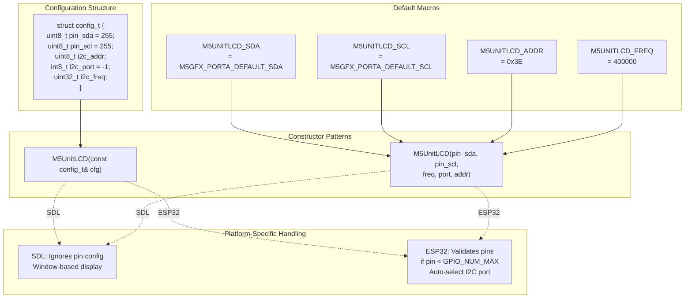

**ESP32 Pin Validation Pattern:**

[src/M5UnitLCD.h:112-114]()
```cpp
uint8_t pin_sda = cfg.pin_sda < GPIO_NUM_MAX ? cfg.pin_sda : M5UNITLCD_SDA;
uint8_t pin_scl = cfg.pin_scl < GPIO_NUM_MAX ? cfg.pin_scl : M5UNITLCD_SCL;
```

**I2C Port Auto-Selection:**

[src/M5UnitLCD.h:132-141]()
```cpp
if (i2c_port < 0) {
  i2c_port = 0;
#ifdef _M5EPD_H_
  if ((pin_sda == 25 && pin_scl == 32))  /// M5Paper
  {
    i2c_port = 1;
  }
#endif
}
```

**Sources:** [src/M5UnitLCD.h:41-48](), [src/M5UnitLCD.h:110-152](), [src/M5UnitOLED.h:41-155]()

## Build Configuration Patterns

PlatformIO configuration files manage the dual-target build system, defining separate environments for native (SDL) and ESP32 builds with appropriate compiler flags and library dependencies.

### Environment Structure

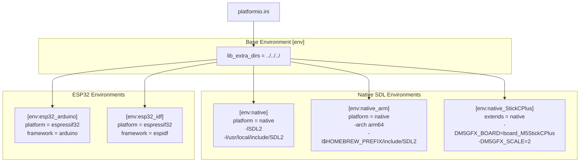

### Key Build Flags

| Flag | Purpose | Platform | Example Value |
|------|---------|----------|---------------|
| `-lSDL2` | Link SDL2 library | SDL/native | Required |
| `-I<path>` | SDL2 include path | SDL/native | `/usr/local/include/SDL2` |
| `-L<path>` | SDL2 library path | SDL/native | `/usr/local/lib` |
| `-DM5GFX_SCALE=n` | Window scaling factor | SDL/native | `2` (2x size) |
| `-DM5GFX_BOARD=<board>` | Force board type | SDL/native | `board_M5StickCPlus` |
| `-DM5GFX_ROTATION=n` | Display rotation | SDL/native | `0` (0°), `1` (90°) |
| `-DM5GFX_SHOW_FRAME` | Show device frame | SDL/native | Enabled |
| `-DM5GFX_BACK_COLOR=0xRRGGBB` | Background color | SDL/native | `0x222222` |
| `-xc++` | Force C++ mode | SDL/native | Required |
| `-std=c++14` | C++ standard | SDL/native | C++14 or higher |

**Sources:** [examples/PlatformIO_SDL/platformio.ini:1-67]()

## SDL-Specific Initialization Pattern

SDL implementations configure window properties and display characteristics that are irrelevant on physical hardware but essential for desktop simulation.

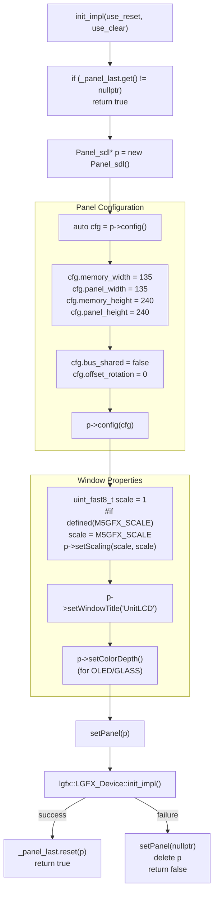

**Color Depth Configuration for Monochrome Displays:**

[src/M5UnitOLED.h:97]()
```cpp
p->setColorDepth(lgfx::color_depth_t::grayscale_8bit);
```

This is only applicable in SDL mode for OLED and GLASS displays to simulate grayscale appearance.

**Sources:** [src/M5UnitLCD.h:74-106](), [src/M5UnitOLED.h:74-107](), [src/M5UnitGLASS.h:74-108]()

## ESP32-Specific Initialization Pattern

ESP32 implementations configure hardware buses and link them to panel drivers, managing resource allocation with smart pointers.

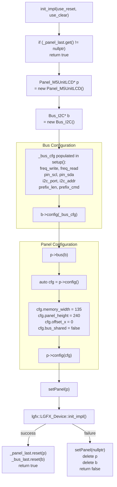

**Bus Configuration Details:**

[src/M5UnitLCD.h:143-151]()
```cpp
_bus_cfg.freq_write = i2c_freq;
_bus_cfg.freq_read = i2c_freq > 400000 ? 400000 + ((i2c_freq - 400000) >> 1) : i2c_freq;
_bus_cfg.pin_scl = pin_scl;
_bus_cfg.pin_sda = pin_sda;
_bus_cfg.i2c_port = i2c_port;
_bus_cfg.i2c_addr = i2c_addr;
_bus_cfg.prefix_len = 0;
```

Note: Read frequency is capped to prevent I2C bus issues at high speeds.

**Resource Management:**

[src/M5UnitLCD.h:175-178]()
```cpp
_panel_last.reset(p);  // Take ownership with smart pointer
_bus_last.reset(b);    // Take ownership with smart pointer
```

Smart pointers (`std::shared_ptr` or similar) ensure automatic cleanup and prevent memory leaks.

**Sources:** [src/M5UnitLCD.h:154-184](), [src/M5UnitOLED.h:157-183]()

## Application Code Pattern

Application code remains completely platform-agnostic by using only the public M5GFX API. No conditional compilation is needed in user code.

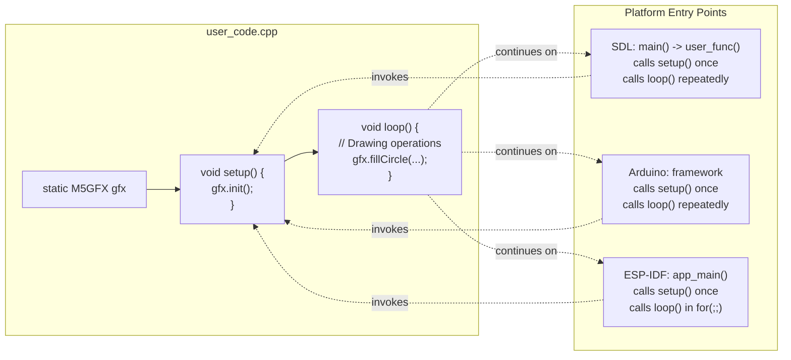

**Complete Example:**

[examples/PlatformIO_SDL/src/user_code.cpp:1-30]()

The only platform-specific code in application files is the optional ESP-IDF entry point wrapper at the end, conditionally compiled with:

```cpp
#if defined ( ESP_PLATFORM ) && !defined ( ARDUINO )
extern "C" {
  int app_main(int, char**) {
    setup();
    for (;;) { loop(); }
    return 0;
  }
}
#endif
```

**Sources:** [examples/PlatformIO_SDL/src/user_code.cpp:1-30]()

## Header Include Pattern

Device class headers follow a consistent pattern for including platform-specific dependencies.

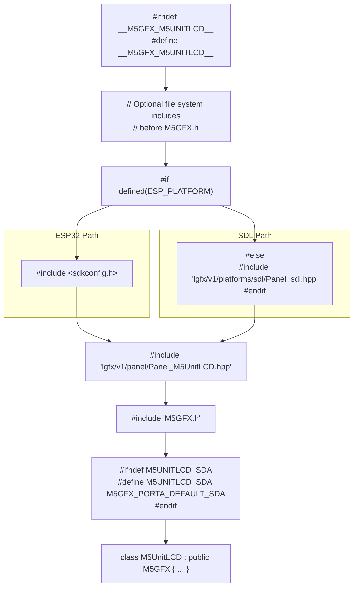

**Include Order Rationale:**

1. **Platform detection first:** Determines which headers to include
2. **Platform-specific panel:** Only `Panel_sdl.hpp` for SDL (ESP32 uses hardware panels)
3. **Device panel header:** Specific panel driver (works on ESP32, unused on SDL)
4. **M5GFX base:** Common base class and framework
5. **Configuration macros:** Default pin and parameter definitions

**Sources:** [src/M5UnitLCD.h:1-34](), [src/M5UnitOLED.h:1-34](), [src/M5UnitGLASS.h:1-34]()

## Platform Utility Function Abstraction

M5GFX abstracts common utility functions through platform-specific implementations in `common.hpp` and `common.cpp` files. These provide consistent APIs while using native platform capabilities underneath.

### Timing Functions

**Title:** Timing Function Implementations Across Platforms

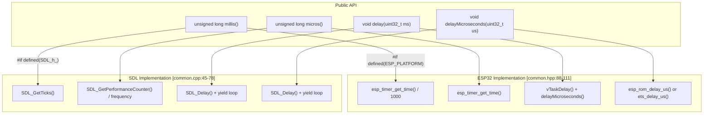

**ESP32:** [src/lgfx/v1/platforms/esp32/common.hpp:88-111]() uses `esp_timer_get_time()` for microsecond precision and `vTaskDelay()` for cooperative multitasking delays.

**SDL:** [src/lgfx/v1/platforms/sdl/common.cpp:45-78]() uses SDL's platform-independent timing APIs with `SDL_GetTicks()` and `SDL_GetPerformanceCounter()`.

### GPIO Functions

**Title:** GPIO Control Abstraction Pattern

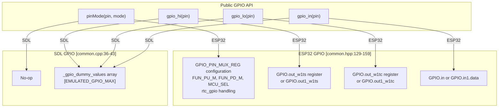

**ESP32:** [src/lgfx/v1/platforms/esp32/common.hpp:335-398]() implements `pinMode()` with direct register access to `GPIO_PIN_MUX_REG`, configuring pull-up/down resistors and GPIO function multiplexing. [src/lgfx/v1/platforms/esp32/common.hpp:157-158]() provides inline `gpio_hi()` and `gpio_lo()` using hardware register writes.

**SDL:** [src/lgfx/v1/platforms/sdl/common.cpp:38-43]() uses an emulated array `_gpio_dummy_values` to track virtual GPIO states for testing.

### Memory Allocation Functions

**Title:** Memory Allocation Strategy by Platform

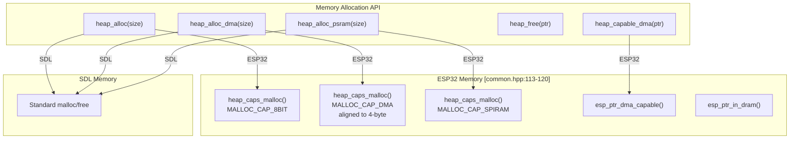

**ESP32:** [src/lgfx/v1/platforms/esp32/common.hpp:113-120]() uses `heap_caps_malloc()` with capability flags to allocate from specific memory regions (DMA-capable internal RAM, PSRAM). The `heap_capable_dma()` function checks if a pointer is DMA-accessible using `esp_ptr_dma_capable()`.

**SDL:** Uses standard C++ `malloc()`/`free()` as there are no DMA or PSRAM constraints on desktop platforms.

**Sources:** [src/lgfx/v1/platforms/esp32/common.hpp:88-120](), [src/lgfx/v1/platforms/esp32/common.hpp:129-159](), [src/lgfx/v1/platforms/esp32/common.hpp:335-398](), [src/lgfx/v1/platforms/sdl/common.cpp:36-78]()

## Bus Abstraction Pattern

The `IBus` interface defines a common API for communication buses, with platform-specific implementations for ESP32 hardware and SDL stubs.

**Title:** Bus Implementation Architecture

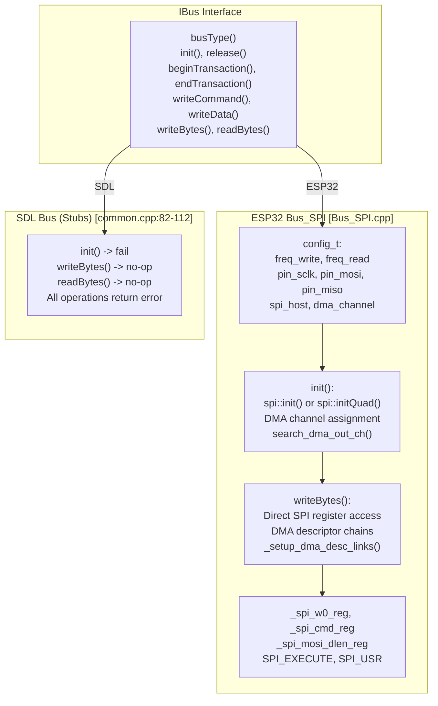

**ESP32 Implementation:**

[src/lgfx/v1/platforms/esp32/Bus_SPI.cpp:113-203]() implements `Bus_SPI::init()` which:
1. Calls `spi::init()` or `spi::initQuad()` from [src/lgfx/v1/platforms/esp32/common.cpp:550-710]()
2. Locates assigned DMA channel using `search_dma_out_ch()` from [src/lgfx/v1/platforms/esp32/common.cpp:270-294]()
3. Configures register pointers: `_spi_w0_reg`, `_spi_cmd_reg`, `_spi_mosi_dlen_reg` [src/lgfx/v1/platforms/esp32/Bus_SPI.cpp:119-130]()

[src/lgfx/v1/platforms/esp32/Bus_SPI.cpp:630-735]() implements `writeBytes()` with:
- Direct SPI FIFO register writes for small transfers (<64 bytes)
- DMA descriptor chains for large transfers using `_setup_dma_desc_links()`
- Platform-specific handling for ESP32 vs ESP32-C3/S3 (with/without `SPI_HIGHPART`)

**SDL Implementation:**

[src/lgfx/v1/platforms/sdl/common.cpp:82-112]() provides stub implementations that return `cpp::fail(error_t::unknown_err)` since desktop simulation doesn't use SPI buses.

**Sources:** [src/lgfx/v1/platforms/esp32/Bus_SPI.cpp:113-203](), [src/lgfx/v1/platforms/esp32/Bus_SPI.cpp:630-735](), [src/lgfx/v1/platforms/esp32/common.cpp:270-320](), [src/lgfx/v1/platforms/esp32/common.cpp:550-710](), [src/lgfx/v1/platforms/sdl/common.cpp:82-112]()

## Best Practices for Cross-Platform Development

### 1. Write Platform-Agnostic Application Code

Application code should only use the public M5GFX API without platform-specific logic:

```cpp
// Good: Platform-agnostic
M5GFX display;
display.init();
display.fillScreen(BLACK);
display.drawString("Hello", 10, 10);

// Bad: Platform-specific in application code
#if defined(ESP_PLATFORM)
  display.setBrightness(128);
#endif
```

### 2. Use Conditional Compilation Only in Library Code

Platform-specific implementations belong in device wrapper classes and platform abstraction layers, not in application code. The pattern is:

- **Application layer:** Platform-agnostic
- **M5GFX device classes:** Platform-conditional (`#if defined(SDL_h_)` vs `#else`)
- **Panel/bus drivers:** Platform-specific (separate directories: `platforms/esp32/` vs `platforms/sdl/`)
- **Common utilities:** Dual implementation in `common.cpp`/`common.hpp`

### 3. Maintain Identical Public APIs

Both SDL and ESP32 implementations must provide the same public interface:

```cpp
// Constructor signatures must match
M5UnitLCD(uint8_t pin_sda = ..., uint8_t pin_scl = ..., ...);
M5UnitLCD(const config_t &cfg);

// Methods must match
bool init(uint8_t pin_sda, ...);
void setup(uint8_t pin_sda, ...);
```

### 4. Handle Platform-Specific Configuration Gracefully

SDL implementations should ignore hardware-specific parameters rather than error. For example, [src/M5UnitLCD.h:74-106]() SDL implementation ignores I2C pin parameters since it renders to a window, while [src/M5UnitLCD.h:110-184]() ESP32 implementation validates and uses them.

### 5. Use Smart Pointers for Resource Management

Both implementations use smart pointers to manage panel and bus lifetimes:

```cpp
_panel_last.reset(p);  // Automatic cleanup
_bus_last.reset(b);    // Automatic cleanup
```

[src/M5UnitLCD.h:175-178]() shows ESP32 resource management, while [src/M5UnitLCD.h:103]() shows SDL equivalent.

### 6. Leverage Platform-Specific Optimizations

While maintaining API compatibility, each platform can optimize internally:

- **ESP32:** [src/lgfx/v1/platforms/esp32/Bus_SPI.cpp:679-732]() uses DMA with descriptor chains for efficient bulk transfers
- **SDL:** [src/lgfx/v1/platforms/sdl/Panel_sdl.cpp:558-570]() uses mutex locking and texture updates for thread-safe rendering

### 7. Test on Both Platforms

Leverage the SDL simulation for rapid development and debugging, then validate on actual ESP32 hardware:

1. Develop and debug on desktop using SDL
2. Test platform-specific features (peripherals, power management)
3. Validate performance and memory usage on hardware
4. Iterate between platforms as needed

**Sources:** [examples/PlatformIO_SDL/README.md:1-115](), [src/M5UnitLCD.h:35-186](), [examples/PlatformIO_SDL/src/user_code.cpp:1-30](), [src/lgfx/v1/platforms/esp32/Bus_SPI.cpp:630-735](), [src/lgfx/v1/platforms/sdl/Panel_sdl.cpp:558-627]()

## Summary

M5GFX's cross-platform architecture enables a single application codebase to run on both ESP32 hardware and desktop computers through:

- **Preprocessor-based platform detection** using `ESP_PLATFORM` and `SDL_h_` macros
- **Dual implementation pattern** in device classes with identical public APIs
- **Platform-specific build environments** managed by PlatformIO configuration
- **Consistent entry point patterns** that abstract platform initialization differences
- **Smart resource management** using RAII and smart pointers

This design allows developers to write graphics applications once and deploy them to both simulation and hardware environments without code modifications.