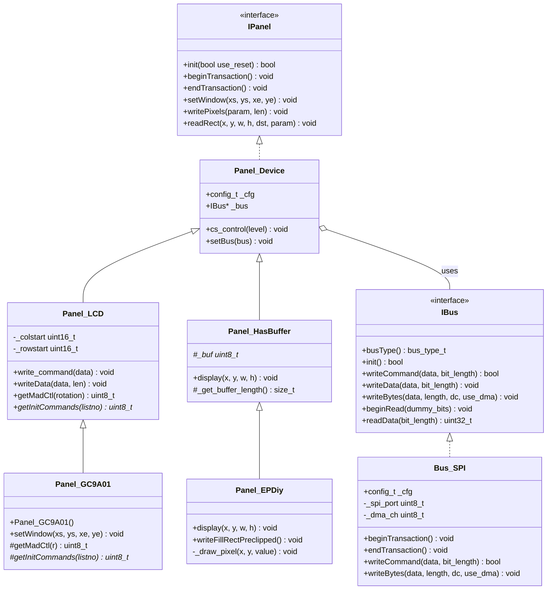
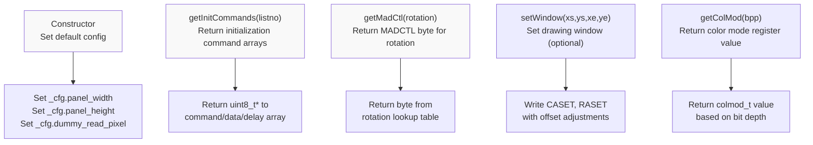
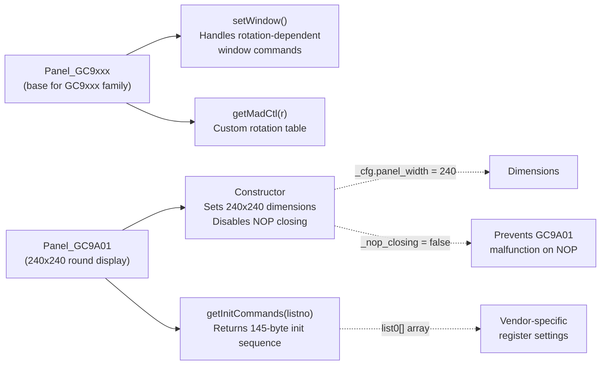
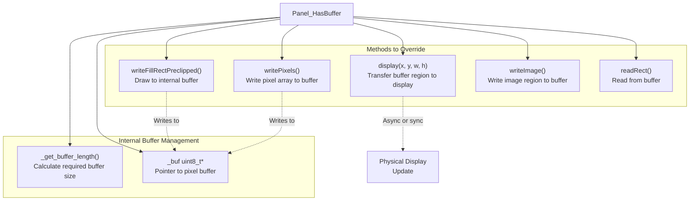
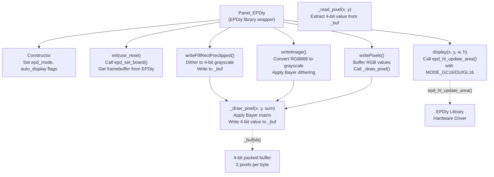

M5GFX Custom Panel and Bus Drivers

# Custom Panel and Bus Drivers

<details>
<summary>Relevant source files</summary>

The following files were used as context for generating this wiki page:

- [src/lgfx/v1/lgfx_fonts.cpp](src/lgfx/v1/lgfx_fonts.cpp)
- [src/lgfx/v1/lgfx_fonts.hpp](src/lgfx/v1/lgfx_fonts.hpp)
- [src/lgfx/v1/panel/Panel_EPDiy.cpp](src/lgfx/v1/panel/Panel_EPDiy.cpp)
- [src/lgfx/v1/panel/Panel_EPDiy.hpp](src/lgfx/v1/panel/Panel_EPDiy.hpp)
- [src/lgfx/v1/panel/Panel_GC9A01.hpp](src/lgfx/v1/panel/Panel_GC9A01.hpp)
- [src/lgfx/v1/panel/Panel_LCD.cpp](src/lgfx/v1/panel/Panel_LCD.cpp)
- [src/lgfx/v1/panel/Panel_LCD.hpp](src/lgfx/v1/panel/Panel_LCD.hpp)
- [src/lgfx/v1/platforms/esp32/Bus_SPI.cpp](src/lgfx/v1/platforms/esp32/Bus_SPI.cpp)
- [src/lgfx/v1/platforms/esp32/Bus_SPI.hpp](src/lgfx/v1/platforms/esp32/Bus_SPI.hpp)
- [src/lgfx/v1/platforms/esp32/common.cpp](src/lgfx/v1/platforms/esp32/common.cpp)
- [src/lgfx/v1/platforms/esp32/common.hpp](src/lgfx/v1/platforms/esp32/common.hpp)

</details>


This page provides guidance for implementing custom panel drivers for display controllers not included in M5GFX, and custom bus drivers for communication protocols beyond the built-in SPI, I2C, and parallel implementations. This is an advanced topic requiring understanding of both the target display controller's datasheet and M5GFX's internal architecture.

For information about using existing panel and bus drivers, see the device configuration pages ([#2](#2)). For platform-specific implementation details, see [#5](#5).

---

## Driver Architecture Overview

M5GFX uses an interface-based architecture that separates display control logic (panels) from communication protocols (buses). This separation enables mixing different panel types with different bus types without code duplication.

### Panel and Bus Hierarchy



**Sources:** [src/lgfx/v1/panel/Panel_LCD.hpp:28-142](), [src/lgfx/v1/panel/Panel_GC9A01.hpp:29-74](), [src/lgfx/v1/panel/Panel_EPDiy.hpp:35-83](), [src/lgfx/v1/platforms/esp32/Bus_SPI.hpp:65-205]()

The `IPanel` interface defines the contract that all panel drivers must fulfill. `Panel_Device` provides common functionality, while `Panel_LCD` and `Panel_HasBuffer` serve as base classes for specific display technologies. Similarly, `IBus` defines the bus interface, with concrete implementations like `Bus_SPI`.

---

## Implementing Custom LCD Panel Drivers

Custom LCD panel drivers extend `Panel_LCD` and override specific methods to accommodate controller-specific initialization sequences, rotation matrices, and command protocols.

### Key Methods to Override

The following diagram shows the typical method override pattern for LCD panels:



**Sources:** [src/lgfx/v1/panel/Panel_LCD.hpp:85-141](), [src/lgfx/v1/panel/Panel_LCD.cpp:29-54]()

### Configuration Structure

The `Panel_LCD::config_t` structure (inherited from `Panel_Device`) contains hardware-specific parameters:

| Field | Type | Purpose |
|-------|------|---------|
| `panel_width` | `int16_t` | Physical panel width in pixels |
| `panel_height` | `int16_t` | Physical panel height in pixels |
| `memory_width` | `int16_t` | Controller memory width (may differ from panel) |
| `memory_height` | `int16_t` | Controller memory height |
| `offset_x` | `int16_t` | Horizontal offset in controller memory |
| `offset_y` | `int16_t` | Vertical offset in controller memory |
| `offset_rotation` | `uint_fast8_t` | Rotation offset for physical orientation |
| `dummy_read_pixel` | `uint_fast8_t` | Dummy bits before pixel read |
| `dummy_read_bits` | `uint_fast8_t` | Dummy bits for command reads |
| `readable` | `bool` | Whether display supports pixel readback |
| `invert` | `bool` | Default invert state |
| `rgb_order` | `bool` | false=BGR order, true=RGB order |
| `dlen_16bit` | `bool` | Whether to use 16-bit command/data transfers |

**Sources:** [src/lgfx/v1/panel/Panel_Device.hpp:1-100]()

### Example: Panel_GC9A01 Implementation

The GC9A01 driver demonstrates a minimal custom panel implementation:



**Sources:** [src/lgfx/v1/panel/Panel_GC9A01.hpp:78-151]()

Key implementation details:

1. **Constructor** [src/lgfx/v1/panel/Panel_GC9A01.hpp:80-90](): Sets panel dimensions to 240x240, configures `dummy_read_pixel = 16`, and disables `_nop_closing` because GC9A01 malfunctions when receiving NOP commands.

2. **getInitCommands()** [src/lgfx/v1/panel/Panel_GC9A01.hpp:94-150](): Returns a static array of initialization commands in the format `{command, data_count, data0, data1, ..., CMD_INIT_DELAY, delay_ms, ...}`. The array terminates with `0xFF, 0xFF`.

3. **getMadCtl()** [src/lgfx/v1/panel/Panel_GC9A01.hpp:59-73](): Provides rotation matrix mapping. Each entry combines `MAD_MX` (mirror X), `MAD_MY` (mirror Y), and `MAD_MV` (swap X/Y) bits to achieve 8 rotation states.

4. **setWindow()** [src/lgfx/v1/panel/Panel_GC9A01.hpp:31-55](): Custom implementation that conditionally writes `CMD_RASET` based on rotation parity, accommodating the GC9A01's quirky window management.

**Sources:** [src/lgfx/v1/panel/Panel_GC9A01.hpp:29-151]()

### Command List Format

Initialization commands follow a specific byte sequence format parsed by `Panel_LCD::command_list()`:

```
[command_byte] [data_count] [data_bytes...] [optional: CMD_INIT_DELAY, delay_ms] ...
```

The special value `CMD_INIT_DELAY` (0x80) in the data_count field indicates the next byte specifies a delay in milliseconds. Terminate with `0xFF, 0xFF`.

**Sources:** [src/lgfx/v1/panel/Panel_Device.cpp:120-155]()

---

## Implementing Custom Buffered Panel Drivers

Buffered panels (e-paper, OLED with internal RAM, HDMI with frame buffer) extend `Panel_HasBuffer` rather than `Panel_LCD`. These panels accumulate pixel data in memory before transferring the entire frame to the display.

### Buffered Panel Architecture



**Sources:** [src/lgfx/v1/panel/Panel_HasBuffer.hpp:1-100]()

### Example: Panel_EPDiy Implementation

The EPDiy driver demonstrates integration with an external e-paper library:



**Sources:** [src/lgfx/v1/panel/Panel_EPDiy.cpp:45-321](), [src/lgfx/v1/panel/Panel_EPDiy.hpp:35-83]()

Key implementation details:

1. **Buffer Management** [src/lgfx/v1/panel/Panel_EPDiy.cpp:45-76](): EPDiy manages its own framebuffer, so `_get_buffer_length()` returns 0 and `init()` obtains `_buf` via `epd_hl_get_framebuffer()`.

2. **Pixel Format Conversion** [src/lgfx/v1/panel/Panel_EPDiy.cpp:247-262](): The `_draw_pixel()` method converts RGB888 input (sum of weighted R, G, B) to 4-bit grayscale using Bayer dithering matrix `Bayer[16]` [src/lgfx/v1/panel/Panel_EPDiy.cpp:43]().

3. **Display Update** [src/lgfx/v1/panel/Panel_EPDiy.cpp:283-321](): The `display()` method selects EPD update mode based on `_epd_mode` (fastest/fast/text/quality) and calls `epd_hl_update_area()`. It tracks modified regions in `_range_mod` to optimize partial updates.

4. **Rotation Handling** [src/lgfx/v1/panel/Panel_EPDiy.cpp:274-281](): The `_update_transferred_rect()` method applies rotation transformations via `_rotate_pos()` and maintains a bounding box of modified pixels.

**Sources:** [src/lgfx/v1/panel/Panel_EPDiy.cpp:45-326]()

### Buffer Allocation Strategy

Buffered panels must override `_get_buffer_length()` to specify buffer size:

```cpp
// For RGB888 3-byte format:
size_t _get_buffer_length(void) const override {
    return _cfg.panel_width * _cfg.panel_height * 3;
}

// For packed 4-bit format (2 pixels per byte):
size_t _get_buffer_length(void) const override {
    return (_cfg.panel_width * _cfg.panel_height + 1) / 2;
}
```

The base class `Panel_HasBuffer::init()` allocates `_buf` using `heap_alloc()` or `heap_alloc_psram()` based on size.

**Sources:** [src/lgfx/v1/panel/Panel_HasBuffer.cpp:30-80]()

---

## Implementing Custom Bus Drivers

Custom bus drivers implement the `IBus` interface to support communication protocols beyond the built-in SPI, I2C, and parallel buses.

### IBus Interface Requirements

```mermaid
graph TB
    IBus["IBus Interface"]
    
    subgraph "Initialization Methods"
        busType["busType()<br/>Return bus_type_t enum"]
        init["init()<br/>Initialize hardware"]
        release["release()<br/>Release hardware resources"]
    end
    
    subgraph "Transaction Control"
        beginTransaction["beginTransaction()<br/>Acquire bus, configure settings"]
        endTransaction["endTransaction()<br/>Release bus"]
        wait["wait()<br/>Block until transfer complete"]
        busy["busy()<br/>Check if transfer in progress"]
    end
    
    subgraph "Write Operations"
        writeCommand["writeCommand(data, bit_length)<br/>Send command with DC=0"]
        writeData["writeData(data, bit_length)<br/>Send data with DC=1"]
        writeDataRepeat["writeDataRepeat(data, bit_length, count)<br/>Optimized repeated data write"]
        writeBytes["writeBytes(data, length, dc, use_dma)<br/>Send byte array"]
        writePixels["writePixels(param, length)<br/>Send pixels with color conversion"]
    end
    
    subgraph "Read Operations"
        beginRead["beginRead(dummy_bits)<br/>Prepare for read transaction"]
        endRead["endRead()<br/>Complete read transaction"]
        readData["readData(bit_length)<br/>Read data bits"]
        readBytes["readBytes(dst, length, use_dma)<br/>Read byte array"]
        readPixels["readPixels(dst, param, length)<br/>Read pixels with color conversion"]
    end
    
    subgraph "DMA Support (Optional)"
        initDMA["initDMA()<br/>Setup DMA channels"]
        addDMAQueue["addDMAQueue(data, length)<br/>Queue DMA transfer"]
        execDMAQueue["execDMAQueue()<br/>Execute queued transfers"]
        getDMABuffer["getDMABuffer(length)<br/>Allocate DMA-capable buffer"]
    end
    
    IBus --> busType
    IBus --> init
    IBus --> release
    IBus --> beginTransaction
    IBus --> endTransaction
    IBus --> wait
    IBus --> busy
    IBus --> writeCommand
    IBus --> writeData
    IBus --> writeDataRepeat
    IBus --> writeBytes
    IBus --> writePixels
    IBus --> beginRead
    IBus --> endRead
    IBus --> readData
    IBus --> readBytes
    IBus --> readPixels
    IBus --> initDMA
    IBus --> addDMAQueue
    IBus --> execDMAQueue
    IBus --> getDMABuffer
```



**Sources:** [src/lgfx/v1/Bus.hpp:1-200]()

### Bus_SPI Implementation Structure

The SPI bus driver demonstrates key patterns for bus implementation:

```mermaid
graph TB
    Bus_SPI["Bus_SPI"]
    
    subgraph "Configuration"
        config_t["config_t struct<br/>freq_write, freq_read<br/>pin_sclk, pin_miso, pin_mosi, pin_dc<br/>spi_mode, spi_3wire<br/>dma_channel, spi_host"]
    end
    
    subgraph "Hardware State"
        _spi_port["_spi_port uint8_t<br/>SPI peripheral number"]
        _dma_ch["_dma_ch uint8_t<br/>Assigned DMA channel"]
        _spi_cmd_reg["_spi_cmd_reg volatile uint32_t*<br/>Direct register access"]
        _spi_w0_reg["_spi_w0_reg volatile uint32_t*<br/>TX data buffer register"]
        _gpio_reg_dc["_gpio_reg_dc[2] volatile uint32_t*<br/>DC pin control registers"]
    end
    
    subgraph "DMA Management"
        _dmadesc["_dmadesc lldesc_t*<br/>DMA descriptor chain"]
        _flip_buffer["_flip_buffer FlipBuffer<br/>Double-buffered DMA memory"]
        _setup_dma_desc_links["_setup_dma_desc_links()<br/>Build descriptor chain"]
    end
    
    subgraph "Key Methods"
        init_method["init()<br/>Call spi::init()<br/>Detect DMA channel<br/>Configure registers"]
        writeCommand_method["writeCommand()<br/>Set DC=0<br/>Write to SPI_W0_REG<br/>Trigger SPI_EXECUTE"]
        writeBytes_method["writeBytes()<br/>DMA for large transfers<br/>Register writes for small"]
        beginTransaction_method["beginTransaction()<br/>Calculate clock divider<br/>Acquire bus lock"]
    end
    
    Bus_SPI --> config_t
    Bus_SPI --> _spi_port
    Bus_SPI --> _dma_ch
    Bus_SPI --> _spi_cmd_reg
    Bus_SPI --> _spi_w0_reg
    Bus_SPI --> _gpio_reg_dc
    Bus_SPI --> _dmadesc
    Bus_SPI --> _flip_buffer
    Bus_SPI --> init_method
    Bus_SPI --> writeCommand_method
    Bus_SPI --> writeBytes_method
    Bus_SPI --> beginTransaction_method
    Bus_SPI --> _setup_dma_desc_links
    
    init_method -.->|"search_dma_out_ch()"| DMADetection["Query GDMA registers<br/>for assigned channel"]
    writeBytes_method -.->|"length > 64"| DMAPath["Use DMA descriptors"]
    writeBytes_method -.->|"length <= 64"| RegisterPath["Direct register writes"]
```



**Sources:** [src/lgfx/v1/platforms/esp32/Bus_SPI.hpp:65-209](), [src/lgfx/v1/platforms/esp32/Bus_SPI.cpp:113-203]()

Key implementation aspects:

1. **Direct Register Access** [src/lgfx/v1/platforms/esp32/Bus_SPI.hpp:142-146](): Performance-critical operations bypass ESP-IDF APIs and write directly to SPI peripheral registers using cached pointers: `_spi_cmd_reg`, `_spi_w0_reg`, `_spi_mosi_dlen_reg`.

2. **DMA Detection** [src/lgfx/v1/platforms/esp32/Bus_SPI.cpp:177-198](): On ESP32-S3/C3 with GDMA, the driver calls `search_dma_out_ch()` [src/lgfx/v1/platforms/esp32/common.cpp:270-294]() to query GDMA peripheral registers and identify the DMA channel assigned by `spi_bus_initialize()`.

3. **Clock Configuration** [src/lgfx/v1/platforms/esp32/Bus_SPI.cpp:243-253](): `beginTransaction()` calculates SPI clock divider using `FreqToClockDiv()` [src/lgfx/v1/platforms/esp32/common.cpp:202-209]() based on APB frequency, supporting dynamic frequency switching.

4. **DC Pin Control** [src/lgfx/v1/platforms/esp32/Bus_SPI.hpp:148-175](): The `dc_control()` method efficiently toggles the data/command pin by writing to pre-cached GPIO set/clear registers (`_gpio_reg_dc[0]` for command, `_gpio_reg_dc[1]` for data).

5. **DMA Descriptor Chains** [src/lgfx/v1/platforms/esp32/Bus_SPI.cpp:1000-1046](): Large transfers use linked `lldesc_t` descriptors (max 4092 bytes each) built by `_setup_dma_desc_links()`, enabling non-blocking transfers of arbitrary length.

**Sources:** [src/lgfx/v1/platforms/esp32/Bus_SPI.cpp:113-1050]()

### Transaction and CS Control

Panel drivers call bus methods in this sequence:

```
beginTransaction()
  -> writeCommand() / writeData() / writeBytes()
  -> wait() / busy()
endTransaction()
```

The panel's `cs_control()` method manages chip select timing around transactions. For buses without CS pin (e.g., dedicated I2C displays), `cs_control()` may be a no-op.

**Sources:** [src/lgfx/v1/panel/Panel_Device.cpp:80-120]()

---

## Configuration and Integration

### Configuration Structure Pattern

Both panels and buses use configuration structures to separate compile-time constants from runtime state:

```cpp
struct Panel_CustomLCD : public Panel_LCD {
    Panel_CustomLCD() {
        _cfg.panel_width = 320;
        _cfg.panel_height = 240;
        _cfg.memory_width = 320;
        _cfg.memory_height = 240;
        _cfg.offset_x = 0;
        _cfg.offset_y = 0;
        _cfg.dummy_read_pixel = 8;
        _cfg.readable = true;
        _cfg.invert = false;
        _cfg.rgb_order = false;
    }
};

struct Bus_CustomProtocol : public IBus {
    struct config_t {
        uint32_t freq = 10000000;
        int16_t pin_data = -1;
        int16_t pin_clock = -1;
        // ... other hardware config
    };
    
    void config(const config_t& cfg) { _cfg = cfg; }
private:
    config_t _cfg;
};
```

This pattern enables M5GFX's device classes to instantiate drivers with device-specific parameters while keeping driver code reusable.

**Sources:** [src/lgfx/v1/panel/Panel_Device.hpp:30-100](), [src/lgfx/v1/platforms/esp32/Bus_SPI.hpp:75-97]()

### Testing and Validation

When developing custom drivers, validate the following:

| Aspect | Validation Method |
|--------|------------------|
| **Initialization** | Verify `init()` returns `true` and display shows expected output |
| **Command Sequences** | Use logic analyzer to confirm correct command/data/timing per datasheet |
| **Rotation** | Test all 8 rotation values, verify coordinate mapping and MADCTL correctness |
| **Color Depth** | Test RGB565 and RGB888 modes, verify color accuracy and byte order |
| **Partial Updates** | Test `setWindow()` with various rectangles, verify efficient pixel streaming |
| **Read Operations** | If `readable=true`, verify `readRect()` returns written pixel data |
| **DMA Transfers** | Test large image writes, verify DMA completes without corruption |
| **Bus Sharing** | If `bus_shared=true`, verify CS timing and NOP closing (if applicable) |

**Sources:** [src/lgfx/v1/panel/Panel_LCD.cpp:29-450]()

### Platform Abstraction

Custom drivers should use platform abstraction functions from `lgfx::v1` namespace rather than direct ESP-IDF or Arduino calls:

| Function | Purpose |
|----------|---------|
| `gpio_hi(pin)` | Set GPIO high |
| `gpio_lo(pin)` | Set GPIO low |
| `gpio_in(pin)` | Read GPIO state |
| `pinMode(pin, mode)` | Configure GPIO mode |
| `delay(ms)` | Delay milliseconds |
| `delayMicroseconds(us)` | Delay microseconds |
| `heap_alloc(size)` | Allocate memory |
| `heap_alloc_dma(size)` | Allocate DMA-capable memory |
| `getApbFrequency()` | Get APB clock frequency |

These functions work identically on ESP32 and SDL simulation platforms.

**Sources:** [src/lgfx/v1/platforms/esp32/common.hpp:82-174]()

---

## Advanced Techniques

### Optimizing Write Performance

The Bus_SPI driver demonstrates several optimization techniques applicable to custom buses:

1. **Register Caching** [src/lgfx/v1/platforms/esp32/Bus_SPI.cpp:113-156](): Cache volatile register pointers during `config()` to eliminate address calculations in hot loops.

2. **DMA Queueing** [src/lgfx/v1/platforms/esp32/Bus_SPI.cpp:824-939](): The `addDMAQueue()` / `execDMAQueue()` pattern batches multiple write operations into a single DMA chain, reducing transaction overhead.

3. **Double Buffering** [src/lgfx/v1/platforms/esp32/Bus_SPI.cpp:537-544](): `FlipBuffer` manages double-buffered DMA memory, allowing CPU to prepare next buffer while DMA reads current buffer.

4. **Conditional Compilation** [src/lgfx/v1/platforms/esp32/Bus_SPI.cpp:547-627](): ESP32-C3/S3 use different SPI hardware; `#if defined(SPI_UPDATE)` branches optimize for each variant.

**Sources:** [src/lgfx/v1/platforms/esp32/Bus_SPI.cpp:113-939]()

### Handling Platform Differences

Use conditional compilation for platform-specific code:

```cpp
#if defined (ESP_PLATFORM)
    // ESP32-specific code using direct register access
#elif defined (SDL_h_)
    // SDL simulation code using dummy operations
#endif
```

The common pattern is to implement full functionality for ESP32 and dummy/simulated behavior for SDL to enable desktop testing.

**Sources:** [src/lgfx/v1/platforms/esp32/common.cpp:18-35]()

### Error Handling

Bus and panel drivers should use the `cpp::result<void, error_t>` return type for operations that can fail:

```cpp
cpp::result<void, error_t> init(void) override {
    if (!_cfg.valid()) {
        return cpp::fail(error_t::invalid_config);
    }
    // ... initialization
    return {};  // Success
}
```

This pattern enables M5GFX to gracefully handle initialization failures and provide diagnostic information.

**Sources:** [src/lgfx/v1/platforms/esp32/common.cpp:550-630]()