M5GFX Development and Build System

# Development and Build System

<details>
<summary>Relevant source files</summary>

The following files were used as context for generating this wiki page:

- [README.md](README.md)
- [examples/PlatformIO_SDL/README.md](examples/PlatformIO_SDL/README.md)
- [examples/PlatformIO_SDL/platformio.ini](examples/PlatformIO_SDL/platformio.ini)
- [examples/PlatformIO_SDL/src/sdl_main.cpp](examples/PlatformIO_SDL/src/sdl_main.cpp)
- [examples/PlatformIO_SDL/src/user_code.cpp](examples/PlatformIO_SDL/src/user_code.cpp)
- [idf_component.yml](idf_component.yml)
- [library.json](library.json)
- [library.properties](library.properties)
- [src/lgfx/v1/gitTagVersion.h](src/lgfx/v1/gitTagVersion.h)

</details>


This document describes the build system, development environments, and configuration required to compile and deploy M5GFX on both embedded targets (ESP32 variants) and desktop platforms (for simulation and debugging). It covers CMake and PlatformIO build configurations, conditional compilation patterns, SDL2 simulation setup, and dependency management.

For information about the SDL simulation platform's runtime behavior, see [SDL Simulation Platform](#5.3). For board detection implementation details, see [M5GFX Class and Board Auto-Detection](#2.1).

---

## Supported Development Environments and Build Systems

M5GFX supports three primary development workflows, each with distinct build system configurations:

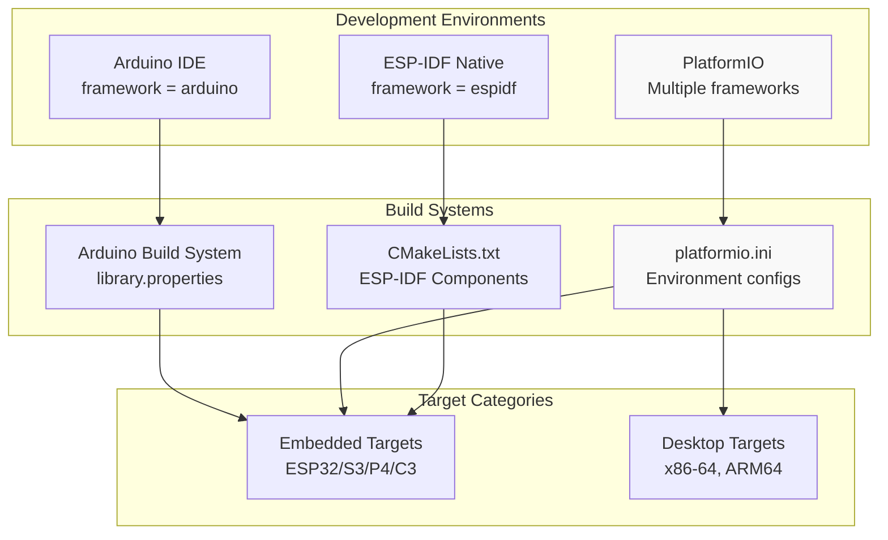

**Sources:** [CMakeLists.txt:1-35](), [examples/PlatformIO_SDL/platformio.ini:1-67]()

### Arduino IDE

The Arduino IDE uses the standard Arduino library structure with a `library.properties` file. The build process relies on the Arduino framework's automatic source discovery and compilation. No explicit build configuration is required beyond selecting the appropriate board in the IDE.

### PlatformIO

PlatformIO provides the most flexible build environment, supporting:
- **Embedded targets:** Using `framework = arduino` or `framework = espidf`
- **Desktop targets:** Using `platform = native` for SDL2-based simulation
- Multiple build configurations in a single `platformio.ini` file

### ESP-IDF Native

ESP-IDF projects use CMake as the build system. M5GFX registers as an ESP-IDF component through `CMakeLists.txt`, with automatic dependency management for required IDF components.

---

## Build Configuration Files

The build system uses multiple configuration files to support different development environments and package managers:

**Diagram: Build Configuration File Ecosystem**

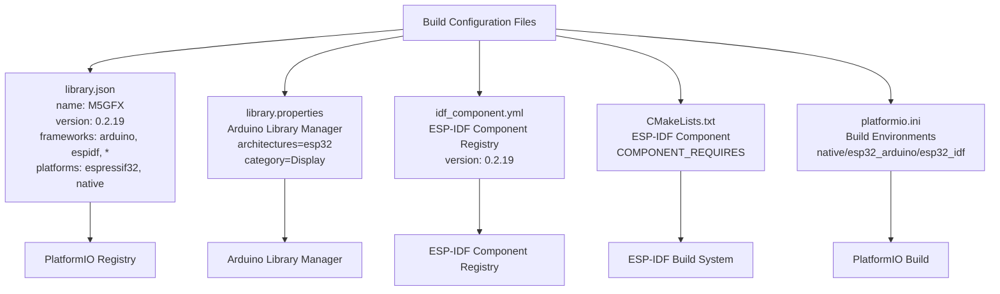

**Sources:** [library.json:1-17](), [library.properties:1-11](), [idf_component.yml:1-6](), [CMakeLists.txt:1-35](), [examples/PlatformIO_SDL/platformio.ini:1-67]()

---

### library.json and library.properties - Library Metadata

M5GFX provides metadata for multiple library management systems:

| File | Purpose | Key Fields |
|------|---------|-----------|
| `library.json` | PlatformIO Registry | `name`, `version`, `frameworks`, `platforms`, `headers` |
| `library.properties` | Arduino Library Manager | `name`, `version`, `architectures`, `category`, `includes` |
| `idf_component.yml` | ESP-IDF Component Registry | `version`, `repository`, `description` |

**library.json configuration:**
```json
{
  "name": "M5GFX",
  "version": "0.2.19",
  "frameworks": ["arduino", "espidf", "*"],
  "platforms": ["espressif32", "native"],
  "headers": "M5GFX.h"
}
```

The `"*"` in `frameworks` indicates support for any framework, enabling use in ESP-IDF native projects and other environments. The `"native"` platform enables SDL2 desktop simulation.

**Sources:** [library.json:1-17](), [library.properties:1-11](), [idf_component.yml:1-6]()

---

### CMakeLists.txt - ESP-IDF Component Configuration

The root `CMakeLists.txt` defines M5GFX as an ESP-IDF component:

**Diagram: CMake Component Registration Flow**

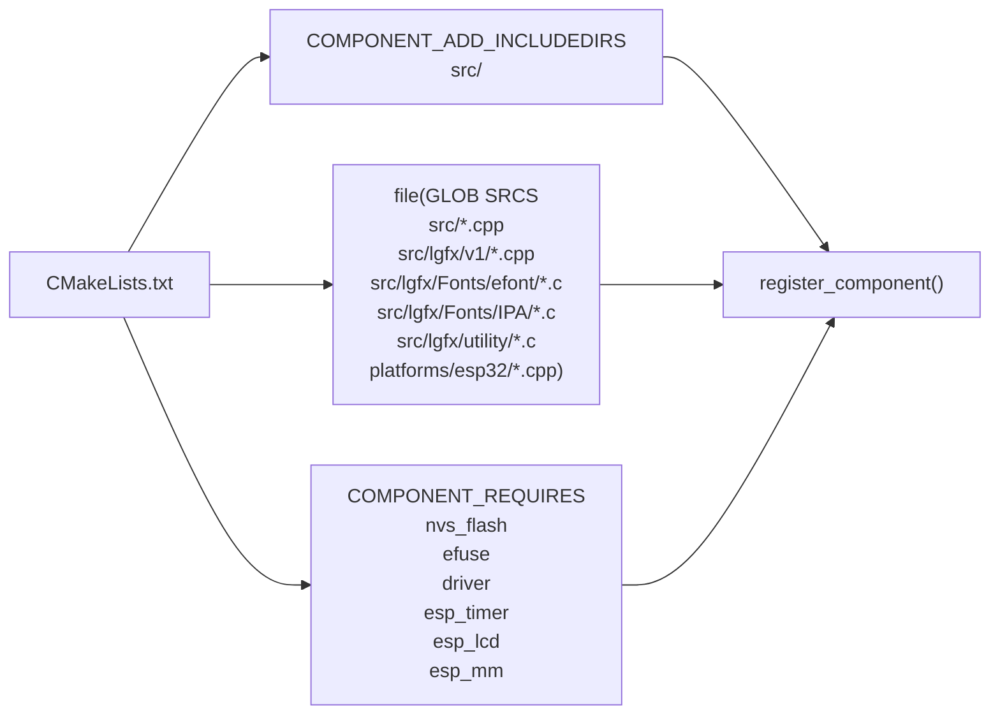

**Key configuration elements:**

| Configuration | Description | Line Reference |
|--------------|-------------|----------------|
| `COMPONENT_ADD_INCLUDEDIRS` | Public include directories: `src` | [CMakeLists.txt:1-3]() |
| Source patterns | Glob patterns for all `.cpp` and `.c` files | [CMakeLists.txt:4-17]() |
| IDF version check | Conditional requirements based on IDF version | [CMakeLists.txt:20-26]() |
| Component requirements | `nvs_flash`, `efuse`, `driver`, `esp_timer`, `esp_lcd`, `esp_mm` | [CMakeLists.txt:21]() |

The source file patterns include platform-specific directories:
- `src/lgfx/v1/platforms/esp32/*.cpp` - ESP32 (original)
- `src/lgfx/v1/platforms/esp32c3/*.cpp` - ESP32-C3
- `src/lgfx/v1/platforms/esp32s3/*.cpp` - ESP32-S3
- `src/lgfx/v1/platforms/esp32p4/*.cpp` - ESP32-P4 with DSI support

**Sources:** [CMakeLists.txt:1-35]()

---

### platformio.ini - Multi-Environment Configuration

The PlatformIO configuration file supports multiple build environments for different targets:

**Diagram: PlatformIO Environment Hierarchy**

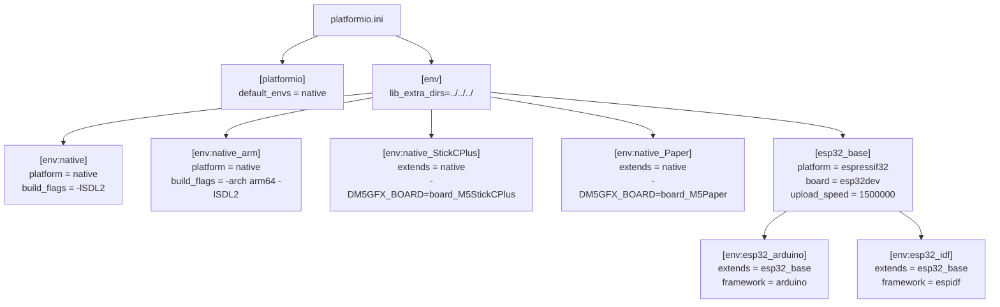

**Sources:** [examples/PlatformIO_SDL/platformio.ini:1-67]()

#### Desktop (Native) Environment Configuration

The native environment configuration for desktop simulation:

| Environment | Platform | Architecture | Build Flags |
|------------|----------|--------------|-------------|
| `native` | `platform = native` | x86-64 | `-I"/usr/local/include/SDL2"` (Intel Mac Homebrew)<br/>`-L"/usr/local/lib"` |
| `native_arm` | `platform = native` | ARM64 | `-arch arm64` (Apple Silicon)<br/>`-I"${sysenv.HOMEBREW_PREFIX}/include/SDL2"`<br/>`-L"${sysenv.HOMEBREW_PREFIX}/lib"` |

**Common native build flags:**
- `-O0` - No optimization for debugging
- `-xc++` - Force C++ compilation
- `-std=c++14` - C++14 standard
- `-lSDL2` - Link SDL2 library
- `-DM5GFX_SHOW_FRAME` - Display frame image border
- `-DM5GFX_BACK_COLOR=0x222222u` - Background color outside frame

**Sources:** [examples/PlatformIO_SDL/platformio.ini:17-35]()

#### Board-Specific Desktop Environments

Custom environments can override board detection with compile-time defines:

```ini
[env:native_StickCPlus]
build_flags = ${env:native.build_flags}
  -DM5GFX_SCALE=2
  -DM5GFX_ROTATION=0
  -DM5GFX_BOARD=board_M5StickCPlus
```

| Define | Purpose | Values |
|--------|---------|--------|
| `M5GFX_BOARD` | Force specific board type | `board_M5StickCPlus`, `board_M5Paper`, etc. |
| `M5GFX_SCALE` | Window scaling factor | Integer (1, 2, 3...) |
| `M5GFX_ROTATION` | Initial rotation | 0-7 |

**Sources:** [examples/PlatformIO_SDL/platformio.ini:36-50]()

#### ESP32 Environment Configuration

```ini
[esp32_base]
build_type = debug
platform = espressif32
board = esp32dev
upload_speed = 1500000
monitor_speed = 115200
monitor_filters = esp32_exception_decoder
```

The `esp32_base` configuration is inherited by both Arduino and ESP-IDF frameworks through the `extends` directive.

**Sources:** [examples/PlatformIO_SDL/platformio.ini:51-67]()

---

## SDL2 Desktop Simulation Setup

### Platform-Specific SDL2 Installation

SDL2 must be installed on the development machine for desktop simulation:

**Diagram: SDL2 Installation Process by Platform**

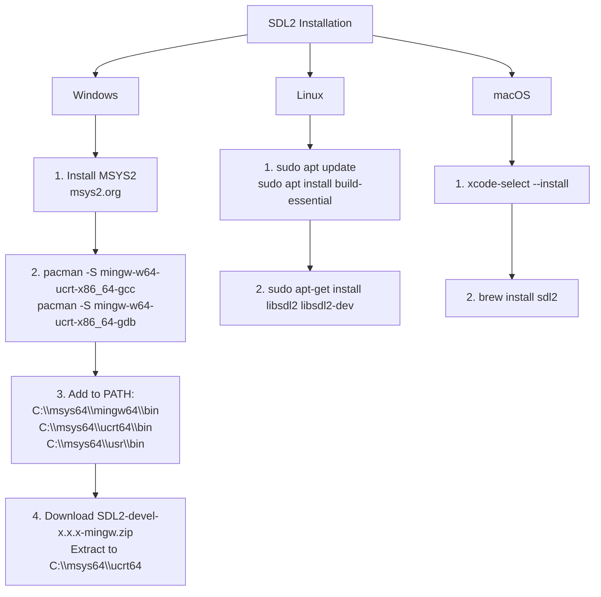

**Sources:** [examples/PlatformIO_SDL/README.md:13-71]()

### SDL Application Entry Point

Desktop builds use a custom entry point that wraps Arduino-style `setup()` and `loop()` functions:

**Diagram: SDL Application Execution Flow**

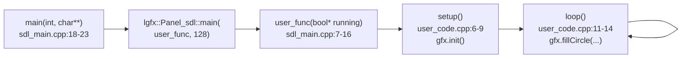

**Entry point structure:**

| Function | Location | Purpose |
|----------|----------|---------|
| `main()` | [examples/PlatformIO_SDL/src/sdl_main.cpp:18-23]() | Application entry point, calls `lgfx::Panel_sdl::main()` |
| `user_func()` | [examples/PlatformIO_SDL/src/sdl_main.cpp:7-16]() | Wrapper calling `setup()` once, then `loop()` continuously |
| `setup()` | [examples/PlatformIO_SDL/src/user_code.cpp:6-9]() | User initialization code |
| `loop()` | [examples/PlatformIO_SDL/src/user_code.cpp:11-14]() | User main loop |

The second parameter to `Panel_sdl::main()` (value `128`) specifies milliseconds per frame for slow execution with breakpoint support. This ensures screen updates are visible during step-through debugging.

**Sources:** [examples/PlatformIO_SDL/src/sdl_main.cpp:1-26](), [examples/PlatformIO_SDL/src/user_code.cpp:1-30]()

---

## Conditional Compilation Patterns

M5GFX uses preprocessor directives to enable platform-specific code paths:

**Diagram: Conditional Compilation Strategy**

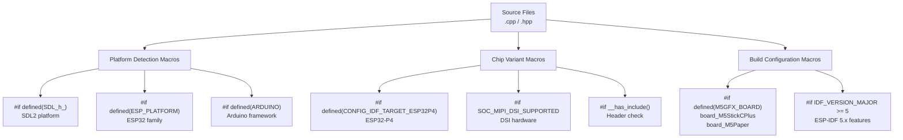

### Platform Detection Macros

| Macro | Defined By | Purpose |
|-------|-----------|---------|
| `SDL_h_` | SDL2 headers | Indicates SDL2 is available for desktop simulation |
| `ESP_PLATFORM` | ESP-IDF | Indicates ESP32 platform |
| `ARDUINO` | Arduino framework | Indicates Arduino environment |
| `CONFIG_IDF_TARGET_ESP32P4` | sdkconfig | ESP32-P4 chip variant |
| `SOC_MIPI_DSI_SUPPORTED` | soc_caps.h | MIPI DSI hardware support |
| `M5GFX_BOARD` | Build flags | Compile-time board selection |
| `IDF_VERSION_MAJOR` | ESP-IDF | ESP-IDF version number |

### SDL-Specific Code Example

The entry point wrapper demonstrates conditional compilation:

```cpp
#include <M5GFX.h>
#if defined ( SDL_h_ )

void setup(void);
void loop(void);

__attribute__((weak))
int user_func(bool* running)
{
  setup();
  do
  {
    loop();
  } while (*running);
  return 0;
}

int main(int, char**)
{
  return lgfx::Panel_sdl::main(user_func, 128);
}

#endif
```

The entire SDL main implementation is wrapped in `#if defined ( SDL_h_ )`, ensuring it only compiles for desktop builds.

**Sources:** [examples/PlatformIO_SDL/src/sdl_main.cpp:1-26]()

### ESP32 Variant-Specific Code Example

Platform directories contain variant-specific implementations. For example, DSI panel support is only available on ESP32-P4:

```cpp
#if __has_include(<soc/soc_caps.h>)
#include <soc/soc_caps.h> 
#if SOC_MIPI_DSI_SUPPORTED

#include <esp_lcd_mipi_dsi.h>
#include <esp_ldo_regulator.h>

// DSI-specific implementation
struct Panel_DSI : public Panel_FrameBufferBase
{
  // ...
};

#endif
#endif
```

This pattern ensures DSI code only compiles when the hardware supports it.

**Sources:** [src/lgfx/v1/platforms/esp32p4/Panel_DSI.hpp:20-23](), [src/lgfx/v1/platforms/esp32p4/Panel_DSI.cpp:21](), [src/lgfx/v1/platforms/esp32p4/Bus_DSI.cpp:18-21]()

### IDF Version Checks

The CMakeLists.txt adjusts component requirements based on ESP-IDF version:

```cmake
if (IDF_VERSION_MAJOR GREATER_EQUAL 5)
    set(COMPONENT_REQUIRES nvs_flash efuse driver esp_timer esp_lcd esp_mm)
elseif ((IDF_VERSION_MAJOR EQUAL 4) AND (IDF_VERSION_MINOR GREATER 3) OR IDF_VERSION_MAJOR GREATER 4)
    set(COMPONENT_REQUIRES nvs_flash efuse esp_lcd)
else()
    set(COMPONENT_REQUIRES nvs_flash efuse)
endif()
```

This ensures compatibility across multiple IDF versions by only requiring components that exist in each version.

**Sources:** [CMakeLists.txt:20-26]()

---

## ESP-IDF Component Dependencies

The library requires specific ESP-IDF components depending on the IDF version:

**Diagram: ESP-IDF Component Dependencies**

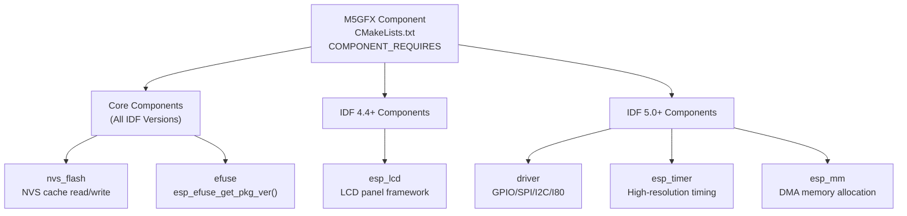

| Component | Required Version | Purpose |
|-----------|------------------|---------|
| `nvs_flash` | All | Non-volatile storage for board detection cache (`nvs_open()`, `nvs_get_blob()`, `nvs_set_blob()`) |
| `efuse` | All | Reading chip package version (`esp_efuse_get_pkg_ver()`) |
| `esp_lcd` | IDF 4.4+ | LCD panel and DPI interface framework |
| `driver` | IDF 5.0+ | Low-level peripheral drivers (GPIO, SPI, I2C, I80) |
| `esp_timer` | IDF 5.0+ | High-resolution timer API (`esp_timer_get_time()`) |
| `esp_mm` | IDF 5.0+ | Memory management utilities including DMA-capable allocation |

**Sources:** [CMakeLists.txt:20-26]()

---

## Building and Running Examples

### PlatformIO SDL Build Process

**Diagram: PlatformIO SDL Build and Execution**

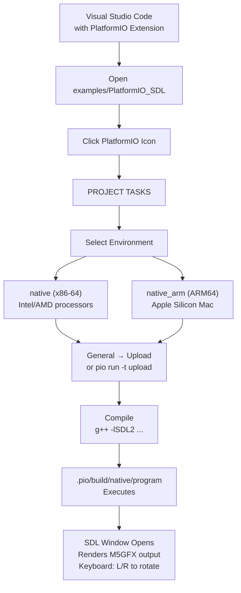

**Steps:**

1. Open `examples/PlatformIO_SDL` folder in Visual Studio Code with PlatformIO extension
2. Click PlatformIO icon in left sidebar
3. Expand `PROJECT TASKS` → environment (`native` or `native_arm`) → `General` → `Upload`
4. The SDL window launches (may be hidden behind other windows on some platforms)
5. Press `L` or `R` keys to rotate the display

**Sources:** [examples/PlatformIO_SDL/README.md:74-86]()

### Debugging with LLDB (macOS)

Desktop builds support full debugging with breakpoints:

**Diagram: VSCode LLDB Debugging Setup**

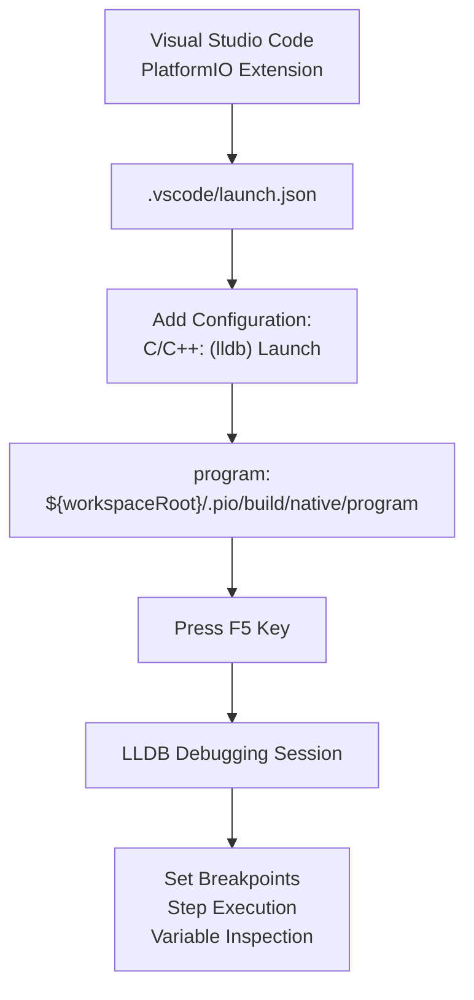

**Configuration steps:**

1. Navigate to `.vscode/launch.json` in VSCode Explorer
2. Click "Add Configuration..."
3. Select "C/C++: (lldb) Launch"
4. Update `"program"` field to: `"${workspaceRoot}/.pio/build/native/program"`
5. Ensure environment name matches your active PlatformIO environment (e.g., `native` or `native_arm`)
6. Press `F5` to start debugging

The second parameter to `Panel_sdl::main()` (set to `128` in [examples/PlatformIO_SDL/src/sdl_main.cpp:22]()) enables slow execution mode at approximately 128ms per frame, ensuring screen updates are visible when stepping through code.

**Sources:** [examples/PlatformIO_SDL/README.md:88-108]()

---

## ESP32-P4 DSI Panel Development

ESP32-P4 introduces MIPI DSI support for high-resolution displays. The build system automatically includes DSI support when targeting ESP32-P4:

**Diagram: ESP32-P4 DSI Component Compilation**

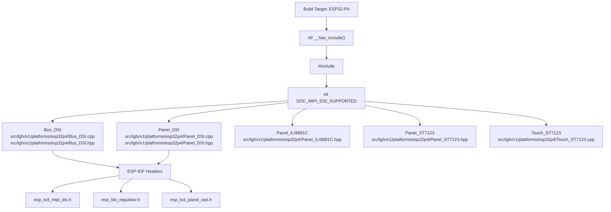

### DSI Bus Configuration Structure

The `Bus_DSI` class provides DSI bus initialization and configuration:

| Configuration Field | Type | Purpose |
|-------------------|------|---------|
| `lane_mbps` | `uint16_t` | Data lane bit rate in Mbps |
| `lane_num` | `uint8_t` | Number of data lanes (2, 3, or 4) |
| `bus_id` | `uint8_t` | DSI bus ID (0 or 1) |
| `ldo_voltage_mv` | `uint32_t` | LDO regulator voltage (typically 2500mV) |
| `ldo_chan_id` | `uint8_t` | LDO channel ID (typically 3) |
| `lcd_cmd_bits` | `uint8_t` | Command bit width (8 bits) |
| `lcd_param_bits` | `uint8_t` | Parameter bit width (8 bits) |

**Sources:** [src/lgfx/v1/platforms/esp32p4/Bus_DSI.hpp:51-62](), [src/lgfx/v1/platforms/esp32p4/Bus_DSI.cpp:29-58]()

### DSI Panel DPI Timing Configuration

DSI panels require precise DPI (Display Pixel Interface) timing parameters:

| Timing Parameter | Type | Purpose |
|-----------------|------|---------|
| `dpi_freq_mhz` | `uint16_t` | Pixel clock frequency |
| `hsync_back_porch` | `uint16_t` | Horizontal sync back porch |
| `hsync_pulse_width` | `uint16_t` | Horizontal sync pulse width |
| `hsync_front_porch` | `uint16_t` | Horizontal sync front porch |
| `vsync_back_porch` | `uint16_t` | Vertical sync back porch |
| `vsync_pulse_width` | `uint16_t` | Vertical sync pulse width |
| `vsync_front_porch` | `uint16_t` | Vertical sync front porch |

These parameters configure the video timing for the DSI display controller. The `Panel_DSI` base class uses these values to initialize the ESP-IDF DPI panel driver.

**Sources:** [src/lgfx/v1/platforms/esp32p4/Panel_DSI.hpp:42-54](), [src/lgfx/v1/platforms/esp32p4/Panel_DSI.cpp:67-89]()

### DSI Panel Initialization Sequence

DSI panel drivers like `Panel_ILI9881C` and `Panel_ST7123` define initialization parameter lists through the `getInitParams()` virtual method:

```cpp
const uint8_t* getInitParams(size_t listno) const override
{
  static constexpr uint8_t list0[] =
  {//len(cmd+params), cmd, params
    4,  CMD_CNDBKxSEL, BKxSEL0, BKxSEL1, BKxSEL2_PAGE1,
    2,  CMD_PAD_CONTROL, DSI_2_LANE,
    0, // end
  };
  // ...
  return (listno == 0) ? list0 : nullptr;
}
```

The initialization sequence:
1. Panel driver provides command lists through `getInitParams(listno)`
2. Each list is a sequence of: `[length, command, param1, param2, ...]`
3. Lists are sent sequentially with delays specified by `getInitDelay(listno)`
4. After all lists, the DPI interface is initialized and frame buffer is configured

**Sources:** [src/lgfx/v1/platforms/esp32p4/Panel_ILI9881C.hpp:49-294](), [src/lgfx/v1/platforms/esp32p4/Panel_ST7123.hpp:34-116](), [src/lgfx/v1/platforms/esp32p4/Panel_DSI.cpp:33-64]()

---

## Library Dependencies

M5GFX incorporates several third-party libraries as dependencies:

**Diagram: M5GFX Third-Party Dependencies**

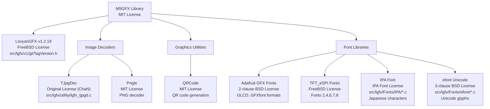

### Font File Compilation

Font files are compiled as C source files in the build system through CMake glob patterns:

```cmake
file(GLOB SRCS
     src/*.cpp
     src/lgfx/Fonts/efont/*.c
     src/lgfx/Fonts/IPA/*.c
     src/lgfx/utility/*.c
     src/lgfx/v1/*.cpp
     # ...
     )
```

Font data is embedded directly into the binary, eliminating the need for runtime file access. The CMakeLists.txt includes both `.c` files (fonts) and `.cpp` files (graphics code) in the source list.

**Sources:** [CMakeLists.txt:4-17](), [src/lgfx/v1/gitTagVersion.h:1-4](), [README.md:41-53]()

---

## Board Auto-Detection Build Integration

The board auto-detection system integrates with the build process through compile-time defines and runtime probing:

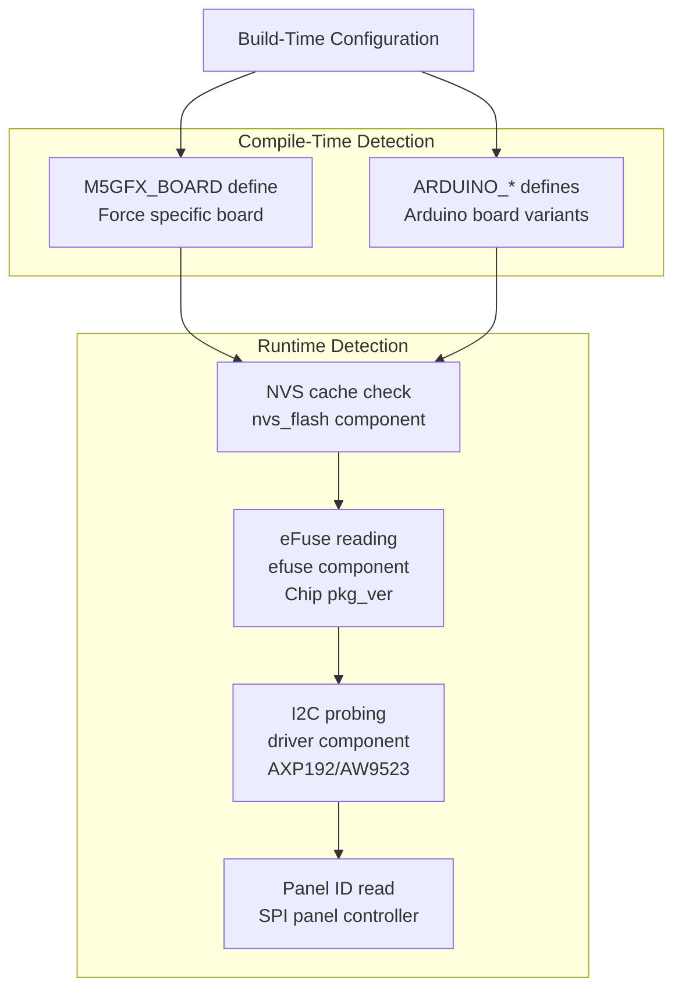

### Build-Time Board Selection

Developers can bypass auto-detection by defining `M5GFX_BOARD` at compile time:

**PlatformIO example:**
```ini
[env:native_StickCPlus]
build_flags = -DM5GFX_BOARD=board_M5StickCPlus
```

**Arduino IDE example:**
The library automatically detects Arduino board defines like:
- `ARDUINO_M5Stack_Core_ESP32` → M5Stack Basic
- `ARDUINO_M5STACK_Core2` → M5Stack Core2
- `ARDUINO_M5Stick_C` → M5StickC

### Runtime Detection Dependencies

Runtime auto-detection requires ESP-IDF components:

| Detection Stage | Required Component | API Used |
|----------------|-------------------|----------|
| NVS cache read/write | `nvs_flash` | `nvs_open()`, `nvs_get_blob()`, `nvs_set_blob()` |
| Chip variant detection | `efuse` | `esp_efuse_get_pkg_ver()` |
| I2C device probing | `driver` | `i2c_cmd_link_create()`, `i2c_master_*()` |
| SPI panel ID read | `driver` | `spi_device_transmit()` |

This multi-stage detection minimizes false positives while supporting 40+ M5Stack board variants without manual configuration.

**Sources:** CMakeLists.txt component requirements [CMakeLists.txt:20-26]()

---

## Summary of Build System Components

| Build Component | File(s) | Purpose |
|----------------|---------|---------|
| ESP-IDF CMake | [CMakeLists.txt:1-35]() | Component registration, source files, dependencies |
| PlatformIO Config | [examples/PlatformIO_SDL/platformio.ini:1-67]() | Multi-environment configuration for embedded and desktop |
| SDL Entry Point | [examples/PlatformIO_SDL/src/sdl_main.cpp:1-26]() | Desktop simulation entry point and setup/loop wrapper |
| User Code | [examples/PlatformIO_SDL/src/user_code.cpp:1-30]() | Application code using M5GFX API |
| Bus Interface | [src/lgfx/v1/Bus.hpp:32-42]() | Bus type enumeration including `bus_dsi` |
| DSI Bus | [src/lgfx/v1/platforms/esp32p4/Bus_DSI.hpp:48-106](), [src/lgfx/v1/platforms/esp32p4/Bus_DSI.cpp:29-92]() | ESP32-P4 MIPI DSI bus implementation |
| DSI Panel Base | [src/lgfx/v1/platforms/esp32p4/Panel_DSI.hpp:38-99](), [src/lgfx/v1/platforms/esp32p4/Panel_DSI.cpp:33-178]() | Base class for DSI panels with DPI timing |
| DSI Panel Drivers | [src/lgfx/v1/platforms/esp32p4/Panel_ILI9881C.hpp:31-308](), [src/lgfx/v1/platforms/esp32p4/Panel_ST7123.hpp:29-122]() | Specific DSI display controller implementations |
| DSI Touch Controller | [src/lgfx/v1/platforms/esp32p4/Touch_ST7123.hpp:28-56](), [src/lgfx/v1/platforms/esp32p4/Touch_ST7123.cpp:38-158]() | Touch controller for ST7123 panels |

The build system provides comprehensive support for:
- **Embedded development** on all ESP32 variants using Arduino or ESP-IDF frameworks
- **Desktop simulation** with SDL2 for rapid prototyping and debugging
- **Advanced displays** including MIPI DSI panels on ESP32-P4
- **Flexible configuration** through compile-time defines and runtime detection
- **Version compatibility** across ESP-IDF 4.x and 5.x

For extending M5GFX with new panel drivers or device classes, see [Extending M5GFX](#6.4).