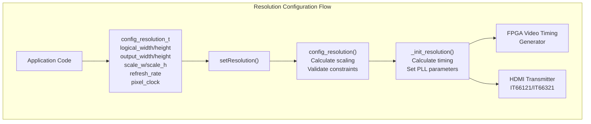
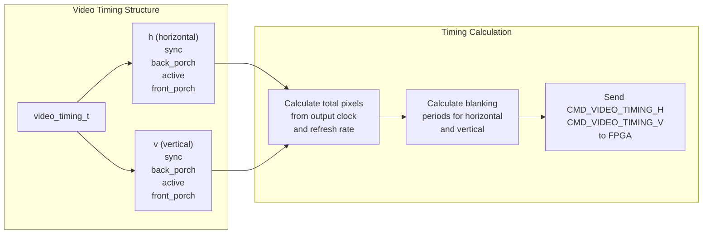
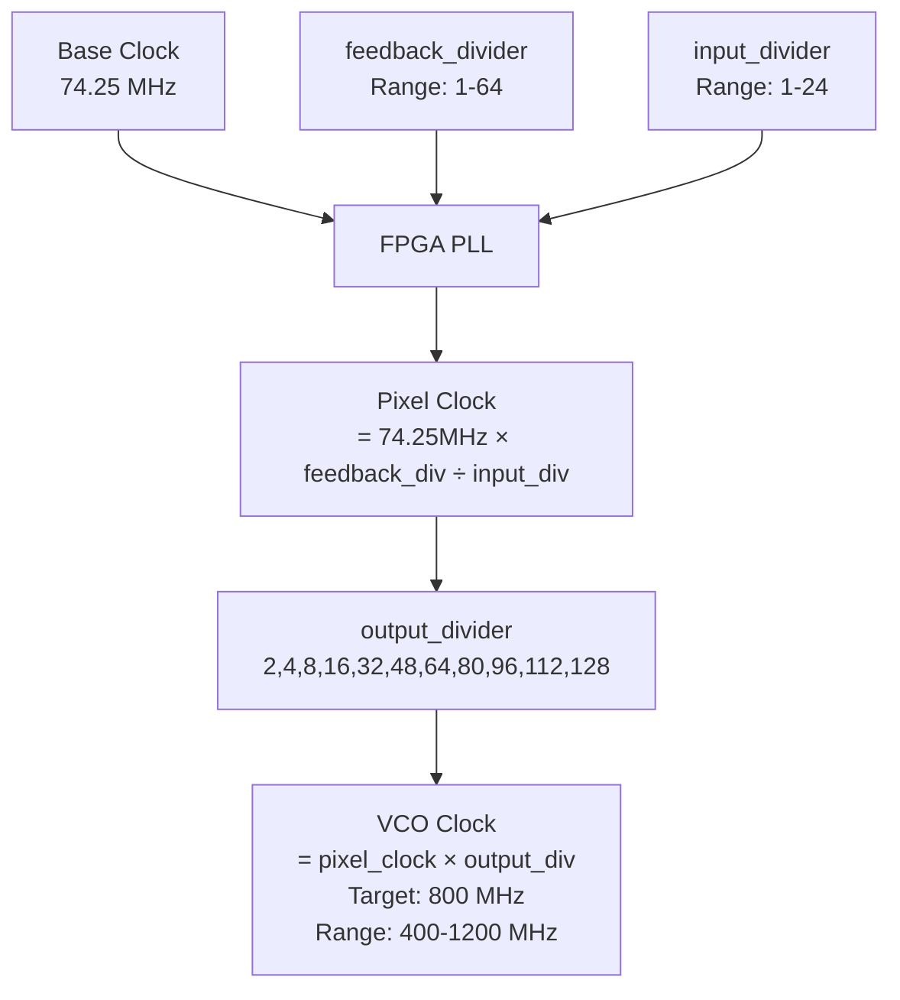
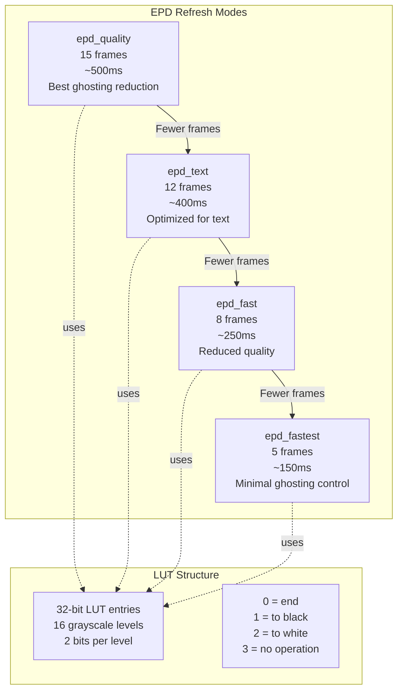
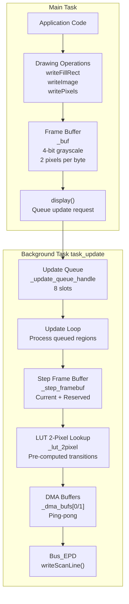
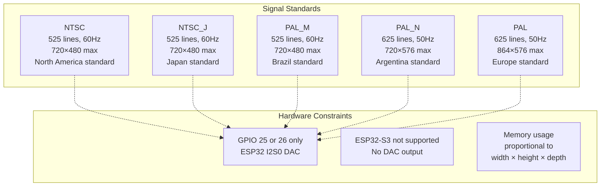
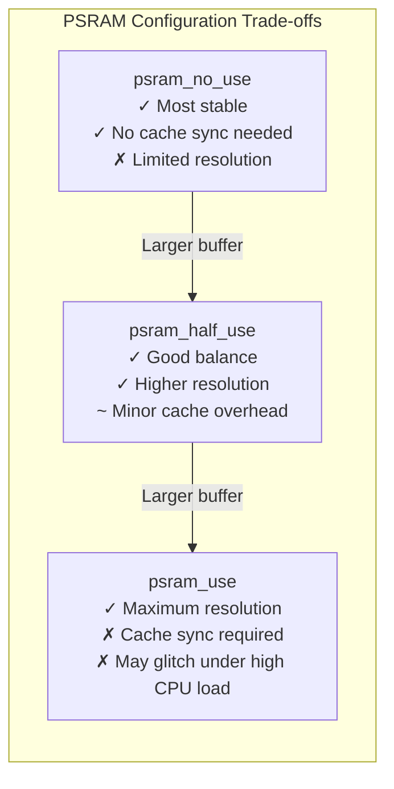
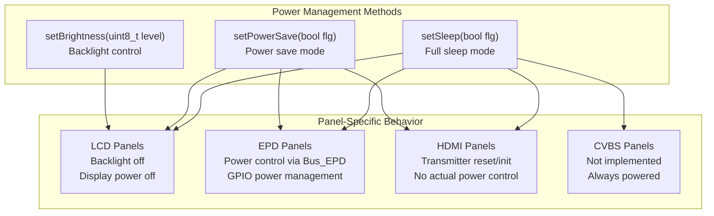
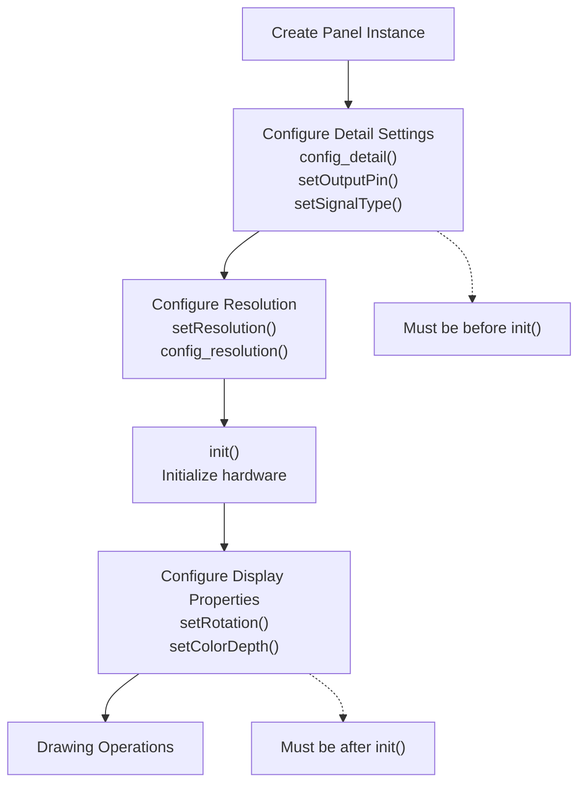

M5GFX Display-Specific Configuration

# Display-Specific Configuration

<details>
<summary>Relevant source files</summary>

The following files were used as context for generating this wiki page:

- [docs/ATOMDisplay.md](docs/ATOMDisplay.md)
- [docs/UnitRCA.md](docs/UnitRCA.md)
- [examples/Basic/TouchTest/TouchTest.ino](examples/Basic/TouchTest/TouchTest.ino)
- [src/M5AtomDisplay.h](src/M5AtomDisplay.h)
- [src/M5GFX.cpp](src/M5GFX.cpp)
- [src/M5GFX.h](src/M5GFX.h)
- [src/M5ModuleDisplay.h](src/M5ModuleDisplay.h)
- [src/M5ModuleRCA.h](src/M5ModuleRCA.h)
- [src/M5UnitRCA.h](src/M5UnitRCA.h)
- [src/lgfx/boards.hpp](src/lgfx/boards.hpp)
- [src/lgfx/v1/misc/enum.hpp](src/lgfx/v1/misc/enum.hpp)
- [src/lgfx/v1/panel/Panel_M5HDMI.cpp](src/lgfx/v1/panel/Panel_M5HDMI.cpp)
- [src/lgfx/v1/panel/Panel_M5HDMI.hpp](src/lgfx/v1/panel/Panel_M5HDMI.hpp)
- [src/lgfx/v1/panel/Panel_M5HDMI_FS.h](src/lgfx/v1/panel/Panel_M5HDMI_FS.h)
- [src/lgfx/v1/platforms/esp32/Bus_EPD.cpp](src/lgfx/v1/platforms/esp32/Bus_EPD.cpp)
- [src/lgfx/v1/platforms/esp32/Bus_EPD.h](src/lgfx/v1/platforms/esp32/Bus_EPD.h)
- [src/lgfx/v1/platforms/esp32/Panel_EPD.cpp](src/lgfx/v1/platforms/esp32/Panel_EPD.cpp)
- [src/lgfx/v1/platforms/esp32/Panel_EPD.hpp](src/lgfx/v1/platforms/esp32/Panel_EPD.hpp)

</details>


## Purpose and Scope

This page documents advanced configuration options for specific display technologies supported by M5GFX. It covers resolution and timing configuration for HDMI displays, refresh mode optimization for e-paper displays, video signal configuration for composite RCA output, and power management options across all display types.

For general panel driver architecture, see [Panel Driver Architecture](#4). For platform-specific bus implementations, see [Platform Abstraction Layer](#5).

---

## HDMI Display Configuration

The `Panel_M5HDMI` class provides extensive configuration options for HDMI video output through the M5AtomDisplay and M5ModuleDisplay devices. The display uses an FPGA for video timing generation and supports flexible resolution configuration.

### Resolution Configuration Structure

HDMI resolution is configured through the `config_resolution_t` structure, which allows independent control of logical drawing resolution and physical output resolution:



**Sources:** [src/lgfx/v1/panel/Panel_M5HDMI.hpp:115-137](), [src/lgfx/v1/panel/Panel_M5HDMI.cpp:727-895]()

### Key Configuration Parameters

| Parameter | Type | Description | Constraints |
|-----------|------|-------------|-------------|
| `logical_width` | `uint16_t` | Drawing surface width in pixels | ≤ 2048 |
| `logical_height` | `uint16_t` | Drawing surface height in pixels | ≤ 2048 |
| `output_width` | `uint16_t` | Physical output width | ≤ 2048, typically 1280 for HD |
| `output_height` | `uint16_t` | Physical output height | ≤ 2048, typically 720 for HD |
| `scale_w` | `uint8_t` | Horizontal scaling factor | 1-8, must divide output_width |
| `scale_h` | `uint8_t` | Vertical scaling factor | 1-8 |
| `refresh_rate` | `float` | Display refresh rate in Hz | 1.0-512.0, default 60.0 |
| `pixel_clock` | `uint32_t` | Pixel clock frequency | Default 74250000 (74.25 MHz) |

The constraint `width × height × refresh_rate ≤ 55,296,000` ensures the FPGA can generate valid video timing.

**Sources:** [src/lgfx/v1/panel/Panel_M5HDMI.cpp:771-895](), [docs/ATOMDisplay.md:26-32]()

### Video Timing Configuration

Video timing parameters control the blanking periods in the HDMI signal. The `video_timing_t` structure allows manual control when automatic timing calculation is insufficient:



The timing is calculated in `_init_resolution()` [src/lgfx/v1/panel/Panel_M5HDMI.cpp:641-724]() to generate valid VESA-compatible timings. The sync period is typically kept minimal (1 line for vertical, 24+ pixels for horizontal), with the remaining blanking divided between front and back porches.

**Sources:** [src/lgfx/v1/panel/Panel_M5HDMI.hpp:33-44](), [src/lgfx/v1/panel/Panel_M5HDMI.cpp:681-711]()

### Pixel Clock Configuration

The pixel clock is generated by the FPGA using a PLL with the following parameters:



The `getPllParams()` function [src/lgfx/v1/panel/Panel_M5HDMI.cpp:593-639]() automatically calculates optimal PLL parameters to generate the requested pixel clock while keeping the VCO frequency near the ideal 800 MHz. For Full HD at 60Hz (pixel clock ~148.5 MHz), the `use_half_clock` flag allows the FPGA video circuit to operate at half the clock rate while outputting each pixel for 2 clock cycles.

**Sources:** [src/lgfx/v1/panel/Panel_M5HDMI.hpp:46-68](), [src/lgfx/v1/panel/Panel_M5HDMI.cpp:593-639]()

### Example HDMI Configuration

```cpp
// Standard 720p configuration
M5AtomDisplay display(1280, 720, 60);

// Custom resolution with explicit scaling
Panel_M5HDMI::config_resolution_t cfg;
cfg.logical_width = 640;
cfg.logical_height = 360;
cfg.output_width = 1280;
cfg.output_height = 720;
cfg.scale_w = 2;
cfg.scale_h = 2;
cfg.refresh_rate = 60.0f;
cfg.pixel_clock = 74250000;
display.setResolution(cfg);

// Ultra-low resolution for retro aesthetics
M5AtomDisplay display(256, 192, 60, 512, 384, 2, 2);
```

**Sources:** [docs/ATOMDisplay.md:17-77]()

---

## E-Paper Display Refresh Modes

The `Panel_EPD` class provides four refresh modes that trade off between image quality and update speed. These modes are controlled through Look-Up Tables (LUTs) that define the pixel transition sequences.

### EPD Mode Definitions



Each mode is defined by a LUT array that specifies, for each frame of the refresh cycle, what operation (black, white, or hold) to perform for each of the 16 grayscale levels. The LUT format uses 2 bits per grayscale level, packed into 32-bit words.

**Sources:** [src/lgfx/v1/misc/enum.hpp:42-52](), [src/lgfx/v1/platforms/esp32/Panel_EPD.cpp:74-157]()

### LUT Configuration Structure

The `config_detail_t` structure allows custom LUTs to be provided for each mode:

| Field | Type | Description |
|-------|------|-------------|
| `lut_quality` | `const uint32_t*` | LUT for highest quality mode |
| `lut_text` | `const uint32_t*` | LUT optimized for text rendering |
| `lut_fast` | `const uint32_t*` | LUT for faster updates |
| `lut_fastest` | `const uint32_t*` | LUT for fastest updates |
| `lut_quality_step` | `size_t` | Number of frames in quality LUT |
| `lut_text_step` | `size_t` | Number of frames in text LUT |
| `lut_fast_step` | `size_t` | Number of frames in fast LUT |
| `lut_fastest_step` | `size_t` | Number of frames in fastest LUT |
| `line_padding` | `uint8_t` | Extra bytes per DMA line transfer |
| `task_priority` | `uint8_t` | FreeRTOS task priority (default 2) |
| `task_pinned_core` | `uint8_t` | CPU core for background task |

**Sources:** [src/lgfx/v1/platforms/esp32/Panel_EPD.hpp:42-58]()

### EPD Update Task Architecture

The EPD driver uses a background FreeRTOS task to perform refresh operations asynchronously:



The update task is created in `init_intenal()` [src/lgfx/v1/platforms/esp32/Panel_EPD.cpp:293]() and runs on a configurable CPU core. This architecture prevents refresh operations from blocking the main application thread.

**Sources:** [src/lgfx/v1/platforms/esp32/Panel_EPD.cpp:213-296](), [src/lgfx/v1/platforms/esp32/Panel_EPD.hpp:99-126]()

### EPD Mode Selection Example

```cpp
// Set mode before drawing
display.setEpdMode(epd_mode_t::epd_fastest);  // Fast updates for animations
display.fillScreen(TFT_WHITE);
display.drawString("Fast Update", 10, 10);

// Switch to quality mode for final image
display.setEpdMode(epd_mode_t::epd_quality);
display.display();  // Trigger high-quality refresh

// Custom LUT configuration
Panel_EPD::config_detail_t cfg;
cfg.lut_quality = my_custom_lut;
cfg.lut_quality_step = 20;  // 20 frame custom refresh
cfg.task_priority = 3;      // Higher priority task
cfg.task_pinned_core = 1;   // Pin to core 1
my_epd_panel.config_detail(cfg);
```

**Sources:** [examples/Basic/TouchTest/TouchTest.ino:17]()

---

## RCA Video Output Configuration

The `Panel_CVBS` class (available through `M5UnitRCA` and `M5ModuleRCA`) generates composite video signals using the ESP32's I2S DAC output. This imposes specific constraints and requires careful configuration.

### Signal Type Configuration

Five video signal standards are supported, each with different timing and resolution characteristics:



The signal type affects the maximum resolution, line count, and field timing. NTSC-based signals use 525 lines per frame at 60Hz, while PAL-based signals use 625 lines at 50Hz.

**Sources:** [docs/UnitRCA.md:6-82]()

### Output Level and Pin Configuration

The output signal level can be adjusted to compensate for protection resistors on certain devices:

```cpp
// Default configuration with explicit parameters
M5UnitRCA display(
    216,                                    // logical_width
    144,                                    // logical_height
    256,                                    // output_width
    160,                                    // output_height
    M5UnitRCA::signal_type_t::PAL,         // signal_type
    M5UnitRCA::use_psram_t::psram_half_use,// use_psram
    26,                                     // GPIO pin (25 or 26 only)
    128                                     // output_level (default)
);

// Boost output for devices with protection resistors (e.g., Core2)
display.setOutputBoost(true);  // Automatic boost
display.setOutputLevel(200);   // Manual level control (range: 0-255)

// Change output pin
display.setOutputPin(25);  // Only 25 or 26 valid
```

The `output_level` parameter controls the DAC output amplitude. The default of 128 produces approximately 1Vp-p output. Devices with series protection resistors may require boosting to 150-200 to achieve proper video levels.

**Sources:** [docs/UnitRCA.md:86-137]()

### PSRAM Usage Configuration

The RCA driver can allocate its frame buffer from different memory regions:

| Mode | Description | Use Case |
|------|-------------|----------|
| `psram_no_use` | All SRAM, no PSRAM | Smallest resolutions, most stable |
| `psram_half_use` | Half PSRAM, half SRAM | Balanced approach |
| `psram_use` | All PSRAM | Largest resolutions, may glitch under load |



When PSRAM is used, cache coherency operations may cause video disturbances during high CPU load. This is because the I2S DMA must read from PSRAM through the cache, and cache line fills can delay DMA reads.

**Sources:** [docs/UnitRCA.md:147-153]()

### Recommended Resolutions

The video signal type determines maximum resolution and recommended divisors:

| Signal | Max Width | Max Height | Recommended Widths | Recommended Heights |
|--------|-----------|------------|-------------------|-------------------|
| NTSC, NTSC_J, PAL_M | 720 | 480 | 720, 480, 360, 240, 180, 144, 120 | 480, 240, 160, 120, 96, 80, 60 |
| PAL_N | 720 | 576 | (same as NTSC) | 576, 288, 192, 144, 113, 96, 72 |
| PAL | 864 | 576 | 864, 576, 432, 288, 216, 173, 144 | (same as PAL_N) |

These recommendations ensure that scaling factors are integer or simple fractions (1, 1.5, 2, 3, etc.) which produces cleaner scaling without interpolation artifacts.

**Sources:** [docs/UnitRCA.md:22-82]()

---

## Power Management

All panel types support power management through common interfaces, though the implementation details vary by display technology.

### Common Power Management Interface



**Sources:** [src/lgfx/v1/platforms/esp32/Panel_EPD.cpp:328-336](), [src/lgfx/v1/panel/Panel_M5HDMI.cpp:1003-1018]()

### EPD Power Control Implementation

The EPD power control manages multiple GPIO signals to sequence power-on and power-off:

```cpp
// EPD power control sequence (from Bus_EPD)
bool Bus_EPD::powerControl(bool flg_on) {
    if (_pwr_on != flg_on) {
        _pwr_on = flg_on;
        wait();
        if (flg_on) {
            // Power-on sequence
            gpio_hi(_config.pin_oe);       // Output enable
            delayMicroseconds(100);
            gpio_hi(_config.pin_pwr);      // Power supply
            delayMicroseconds(100);
            gpio_hi(_config.pin_spv);      // Start pulse (gate driver)
            delay(1);
        } else {
            // Power-off sequence
            delay(1);
            gpio_lo(_config.pin_pwr);      // Power supply off
            delayMicroseconds(10);
            gpio_lo(_config.pin_oe);       // Output disable
            delayMicroseconds(100);
            gpio_lo(_config.pin_spv);      // Start pulse off
        }
    }
    return true;
}
```

The power sequencing is critical for EPD displays to avoid damaging the electrophoretic medium. The timing delays ensure proper voltage settling before enabling the display drivers.

**Sources:** [src/lgfx/v1/platforms/esp32/Bus_EPD.cpp:77-99]()

### HDMI Power Management

The HDMI panel's power management controls the IT66121/IT66321 HDMI transmitter rather than actual display power:

```cpp
// setSleep implementation for Panel_M5HDMI
void Panel_M5HDMI::setSleep(bool flg) {
    HDMI_Trans driver(_HDMI_Trans_config);
    if (flg) {
        driver.reset();  // Reset transmitter to low power
    } else {
        driver.init();   // Re-initialize transmitter
    }
}
```

The `reset()` function [src/lgfx/v1/panel/Panel_M5HDMI.cpp:372-382]() places the HDMI transmitter in a low-power state, while `init()` [src/lgfx/v1/panel/Panel_M5HDMI.cpp:389-443]() performs full PLL locking and video timing setup. Note that this does not control power to the connected display, only to the transmitter IC.

**Sources:** [src/lgfx/v1/panel/Panel_M5HDMI.cpp:1003-1014](), [src/lgfx/v1/panel/Panel_M5HDMI.cpp:372-443]()

### Panel-Specific Power Behavior Summary

| Panel Type | `setSleep()` | `setPowerSave()` | `setBrightness()` | Power Down Time |
|------------|--------------|------------------|------------------|-----------------|
| Panel_LCD | Backlight + command | Backlight + command | PWM control | <1ms |
| Panel_EPD | GPIO sequence | GPIO sequence | Not implemented | ~10ms |
| Panel_M5HDMI | Transmitter reset | Not implemented | Not implemented | <100ms |
| Panel_CVBS | Not implemented | Not implemented | Not implemented | N/A |

---

## Configuration Priority and Application Order

When configuring displays, certain settings must be applied in a specific order to take effect:



Configuration settings like `config_detail()` for EPD or `setOutputPin()` for RCA must be applied before calling `init()`. Settings like `setRotation()` and `setColorDepth()` should be applied after initialization. Resolution changes for HDMI can be made at any time but require a full reconfiguration of the video timing.

**Sources:** [src/lgfx/v1/platforms/esp32/Panel_EPD.cpp:178-209](), [docs/UnitRCA.md:122-169]()