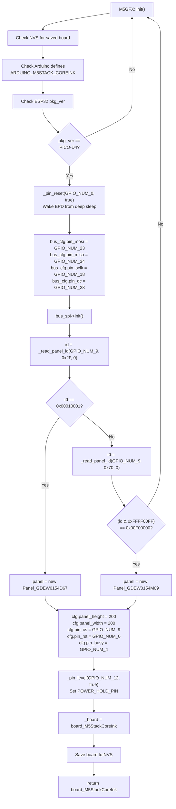
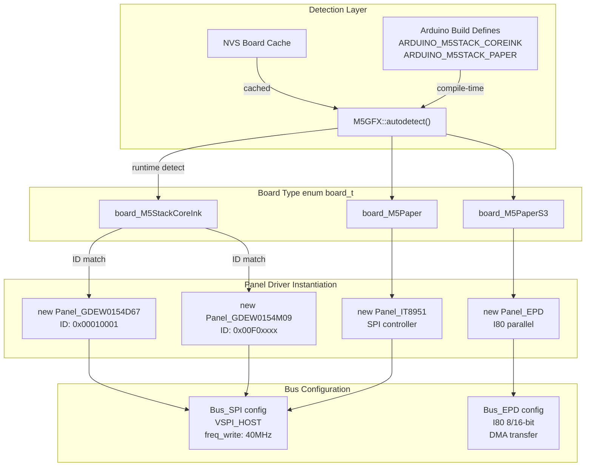
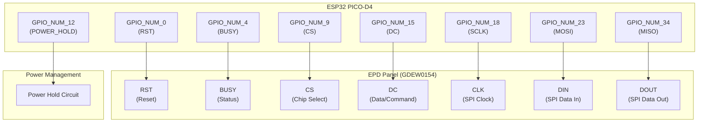
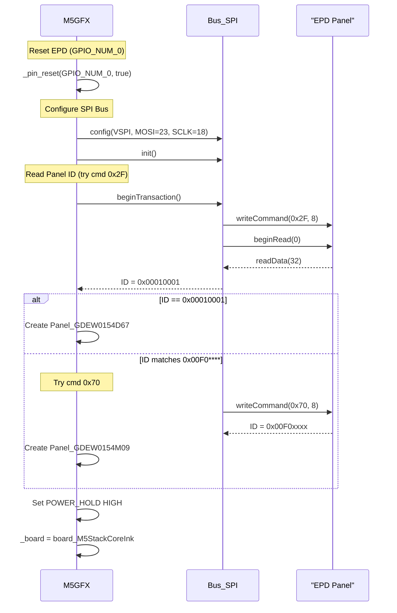

M5GFX E-Paper Device Detection and Configuration

# E-Paper Device Detection and Configuration

<details>
<summary>Relevant source files</summary>

The following files were used as context for generating this wiki page:

- [src/M5GFX.cpp](src/M5GFX.cpp)
- [src/M5GFX.h](src/M5GFX.h)
- [src/lgfx/boards.hpp](src/lgfx/boards.hpp)
- [src/lgfx/v1/misc/enum.hpp](src/lgfx/v1/misc/enum.hpp)
- [src/lgfx/v1/platforms/esp32/Bus_EPD.cpp](src/lgfx/v1/platforms/esp32/Bus_EPD.cpp)
- [src/lgfx/v1/platforms/esp32/Bus_EPD.h](src/lgfx/v1/platforms/esp32/Bus_EPD.h)
- [src/lgfx/v1/platforms/esp32/Panel_EPD.cpp](src/lgfx/v1/platforms/esp32/Panel_EPD.cpp)
- [src/lgfx/v1/platforms/esp32/Panel_EPD.hpp](src/lgfx/v1/platforms/esp32/Panel_EPD.hpp)

</details>


## Overview

This page explains how M5GFX automatically detects and configures e-paper display devices. M5GFX supports three e-paper products: M5Paper, M5PaperS3, and M5StackCoreInk. The detection system identifies the specific hardware variant through chip package detection, I2C probing, and SPI panel ID reading. Once identified, M5GFX instantiates the appropriate panel driver (`Panel_IT8951`, `Panel_EPD`, or `Panel_GDEW*`) and configures GPIO pins, power control, and bus interfaces.

The detection process is critical for e-paper devices because:
- CoreInk uses two different panel variants (GDEW0154D67 vs GDEW0154M09) requiring different initialization
- EPD panels may be in deep sleep mode requiring mandatory reset sequences
- Power hold pins must be configured correctly or the device will power off
- M5PaperS3 requires ESP32-S3 with Octal SPIRAM configuration

For panel driver implementation details (LUT waveforms, grayscale rendering, async update mechanisms), see page 4.2.

**Sources:** [src/M5GFX.cpp:784-830](), [src/lgfx/boards.hpp:15-16,28]()

---

## Supported E-Paper Products

M5GFX provides auto-detection and configuration for the following e-paper display products:

| Product | Board Type | Panel Driver | Resolution | ESP32 Package | Detection Method |
|---------|-----------|------------|------------|---------------|-----------------|
| M5Paper | `board_M5Paper` | `Panel_IT8951` | 960x540 | D0WDQ6 | Arduino define or manual |
| M5PaperS3 | `board_M5PaperS3` | `Panel_EPD` | 960x540 | ESP32-S3 | Octal SPIRAM config |
| M5StackCoreInk | `board_M5StackCoreInk` | `Panel_GDEW0154D67`<br/>`Panel_GDEW0154M09` | 200x200 | PICO-D4 | SPI panel ID read |

**Detection Priority:** M5GFX first checks NVS cache, then Arduino build defines (e.g., `ARDUINO_M5STACK_COREINK`), then performs hardware detection via eFuse package version and SPI panel ID reading. M5StackCoreInk is the only e-paper device with full automatic SPI-based panel ID detection.

**Sources:** [src/lgfx/boards.hpp:15-16,28](), [src/M5GFX.cpp:659-665,784-830](), [src/M5GFX.cpp:16,21-23]()

---

## System Architecture

## M5StackCoreInk Detection Process

### Detection Flow Diagram

**M5StackCoreInk Hardware Auto-Detection**



**Detection Steps:**

1. **Package Version Check:** Read `EFUSE_RD_CHIP_VER_PKG_ESP32PICOD4` to confirm ESP32 PICO-D4 variant
2. **Mandatory Reset:** Assert `GPIO_NUM_0` LOW to wake EPD from deep sleep (EPD controllers power down to conserve energy)
3. **SPI Bus Configuration:** Initialize VSPI with MOSI=23, MISO=34, SCLK=18, DC=15, 3-wire mode
4. **Panel ID Read (attempt 1):** Send command `0x2F` with CS=9 to read panel info register
5. **Panel Variant Selection:**
   - If ID == `0x00010001`: Instantiate `Panel_GDEW0154D67`
   - Otherwise, send command `0x70` to read status register
   - If ID matches `0x00F0****`: Instantiate `Panel_GDEW0154M09` (first lot: `0x00F00000`, 2023 revision: `0x00F01600`)
6. **Power Hold Configuration:** Set `GPIO_NUM_12` HIGH to prevent device power-off
7. **Panel Configuration:** Set panel dimensions (200x200), CS=9, RST=0, BUSY=4

The mandatory reset at GPIO_NUM_0 is critical because EPD controllers enter deep sleep automatically. Without this reset, panel ID reads will fail and detection cannot proceed.

**Sources:** [src/M5GFX.cpp:736-830](), [src/M5GFX.cpp:796-807](), [src/M5GFX.cpp:810-811]()

### Board Type to Panel Driver Mapping

**E-Paper Panel Driver Instantiation**



**Mapping Logic:**
- **`board_M5StackCoreInk`** → Runtime SPI panel ID detection → `Panel_GDEW0154D67` or `Panel_GDEW0154M09` + `Bus_SPI`
- **`board_M5Paper`** → Arduino define detection → `Panel_IT8951` + `Bus_SPI`
- **`board_M5PaperS3`** → ESP32-S3 Octal SPIRAM config → `Panel_EPD` + `Bus_EPD` (I80 parallel)

**Sources:** [src/lgfx/boards.hpp:15-16,28](), [src/M5GFX.cpp:784-830](), [src/M5GFX.cpp:16,21-23,42]()

---

## Panel Configuration Details

### EPD Refresh Modes

E-paper displays support multiple refresh modes selectable via `epd_mode_t` enum:

| Mode | Enum Value | Frame Count | Characteristics | Use Case |
|------|-----------|-------------|-----------------|----------|
| `epd_quality` | 1 | ~15 frames | Full black-white-black cycling, eliminates ghosting | High-quality images, first display |
| `epd_text` | 2 | ~12 frames | Text-optimized, reduced flashing | Monochrome text display |
| `epd_fast` | 3 | ~8 frames | Partial update, some ghosting | Frequent updates |
| `epd_fastest` | 4 | ~5 frames | Minimal transitions, noticeable ghosting | Real-time animations |

Each mode uses different LUT (Look-Up Table) waveforms that control pixel transitions. The mode is stored in `Panel_EPD::_epd_mode` and affects the LUT selection during `display()` calls. For LUT implementation details, see page 4.2.

**Sources:** [src/lgfx/v1/misc/enum.hpp:42-52](), [src/lgfx/v1/platforms/esp32/Panel_EPD.cpp:163-164,575]()

### M5StackCoreInk Pin Configuration



**Pin Assignment Summary:**

```cpp
// SPI Bus Configuration
bus_cfg.pin_mosi = GPIO_NUM_23;  // Master Out Slave In
bus_cfg.pin_miso = GPIO_NUM_34;  // Master In Slave Out (input only)
bus_cfg.pin_sclk = GPIO_NUM_18;  // SPI Clock
bus_cfg.pin_dc   = GPIO_NUM_15;  // Data/Command select
bus_cfg.spi_3wire = true;        // 3-wire mode (DC separate)

// Panel Configuration
panel_cfg.pin_cs   = GPIO_NUM_9;  // Chip Select
panel_cfg.pin_rst  = GPIO_NUM_0;  // Reset (also used for deep sleep wake)
panel_cfg.pin_busy = GPIO_NUM_4;  // Busy status indicator

// Power Management (critical)
GPIO_NUM_12 = HIGH;  // POWER_HOLD_PIN (must remain HIGH)
```

**Power Management:** `GPIO_NUM_12` must be driven HIGH immediately after detection to maintain power. If this pin goes LOW or floats, the device will power off. The configuration sequence sets this pin via `_pin_level(GPIO_NUM_12, true)` at line 810. The BUSY pin (`GPIO_NUM_4`) is read by the panel driver to determine when refresh operations complete.

**Sources:** [src/M5GFX.cpp:788-791,819-824,810]()

## Panel ID Detection Protocol

### SPI Command Sequence



**Panel ID Reading Implementation:**

The `_read_panel_id()` helper function implements the SPI panel identification protocol:

```cpp
// Function signature: _read_panel_id(bus, cs_pin, command, dummy_read_bit)
uint32_t id = _read_panel_id(bus_spi, GPIO_NUM_9, 0x2F, 0);
```

The function performs:
1. Begin SPI transaction
2. Assert CS HIGH (deselect)
3. Send dummy 0x00 command (8 bits)
4. Assert CS LOW (select)
5. Send identification command (8 bits)
6. Begin read with dummy bit count
7. Read 32-bit response
8. End transaction and deselect

**Panel Variant Identification:**

| Panel Model | Command | Expected ID | ID Mask | Notes |
|------------|---------|-------------|---------|-------|
| GDEW0154D67 | `0x2F` | `0x00010001` | Exact match | Panel info register |
| GDEW0154M09 | `0x70` | `0x00F0xxxx` | `0xFFFF00FF` | First lot: `0x00F00000`<br/>2023/11/17: `0x00F01600` |

The detection tries command `0x2F` first for GDEW0154D67. If that fails, it tries command `0x70` with masked comparison for GDEW0154M09. The lower 16 bits of the M09 response vary by manufacturing lot, so only the upper bits are checked.

**Sources:** [src/M5GFX.cpp:583-598,796-807]()

### Color Depth Configuration

E-paper panels in M5GFX use `grayscale_8bit` as both read and write depth:

```cpp
// Panel_EPD::setColorDepth() implementation
color_depth_t Panel_EPD::setColorDepth(color_depth_t depth)
{
  _write_depth = color_depth_t::grayscale_8bit;
  _read_depth = color_depth_t::grayscale_8bit;
  return depth;
}
```

The 8-bit grayscale values (0-255) are internally converted to 4-bit values (0-15) during frame buffer storage. This conversion uses Bayer dithering for higher visual quality. RGB color inputs are converted to grayscale using standard luminance weighting (R×0.299 + G×0.587 + B×0.114).

**Sources:** [src/lgfx/v1/platforms/esp32/Panel_EPD.cpp:171-176]()

## M5PaperS3 ESP32-S3 Configuration

### Build Configuration Requirements

M5PaperS3 requires specific ESP-IDF sdkconfig settings for `Panel_EPD` support:

```c
// Required configuration defines for M5PaperS3
#if defined (CONFIG_IDF_TARGET_ESP32S3)
#if defined (CONFIG_ESP32S3_SPIRAM_SUPPORT) && defined (CONFIG_SPIRAM_MODE_OCT)
#include <lgfx/v1/platforms/esp32/Panel_EPD.hpp>
#endif
#endif
```

**Configuration Requirements:**

| Config Symbol | Required Value | Purpose |
|--------------|----------------|---------|
| `CONFIG_IDF_TARGET_ESP32S3` | Defined | Target ESP32-S3 chip |
| `CONFIG_ESP32S3_SPIRAM_SUPPORT` | Enabled | Enable SPIRAM support |
| `CONFIG_SPIRAM_MODE_OCT` | Enabled | Octal SPI SPIRAM mode |
| `SOC_LCD_I80_SUPPORTED` | 1 (automatic) | I80 parallel interface available |

**Memory Requirements:**
- **Frame Buffer:** 960×540 pixels ÷ 2 (4-bit packed) = 259,200 bytes (~253 KB)
- **Step Buffer:** 2× frame buffer for async update = 518,400 bytes (~506 KB)
- **Total SPIRAM:** Approximately 780 KB minimum

The Octal SPIRAM mode provides 80 MB/s bandwidth compared to 40 MB/s for Quad mode, essential for the large frame buffers and async update operations in `Panel_EPD`.

**Sources:** [src/M5GFX.cpp:37-44](), [src/lgfx/v1/platforms/esp32/Panel_EPD.cpp:20](), [src/lgfx/v1/platforms/esp32/Panel_EPD.cpp:228-256]()

---

## Usage Example

### Basic E-Paper Device Initialization

```cpp
#include <M5GFX.h>

M5GFX display;

void setup() {
  // Auto-detect and initialize
  // Supports M5Paper, M5PaperS3, M5StackCoreInk
  display.init();
  
  // Check detected board
  auto board = display.getBoard();
  if (board == board_M5StackCoreInk) {
    Serial.println("M5StackCoreInk detected");
  }
  
  // Set EPD refresh mode
  // epd_quality (1), epd_text (2), epd_fast (3), epd_fastest (4)
  display.setEpdMode(epd_mode_t::epd_text);
  
  // Draw operations
  display.fillScreen(TFT_WHITE);
  display.setTextSize(2);
  display.drawString("Hello E-Paper", 10, 10);
  
  // For auto-display mode, updates happen automatically
  // For manual mode, call display.display() explicitly
  // display.display();  
  
  // Wait for update completion
  display.waitDisplay();
}
```

**Key Methods:**
- `init()`: Auto-detects and initializes appropriate e-paper hardware
- `setEpdMode(epd_mode_t)`: Selects refresh mode/quality tradeoff
- `waitDisplay()`: Blocks until asynchronous update completes
- `displayBusy()`: Non-blocking check if update is in progress

**Sources:** [src/M5GFX.h:174-274](), [src/lgfx/v1/misc/enum.hpp:42-52]()