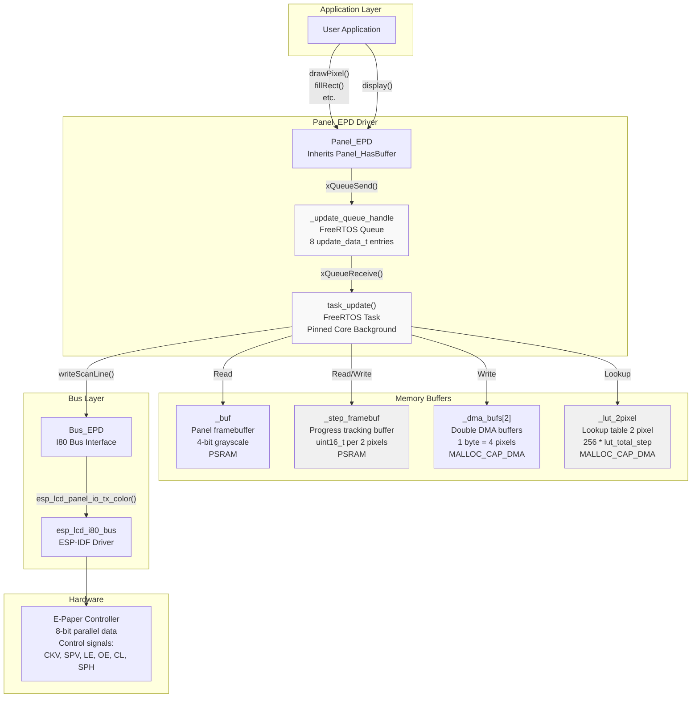
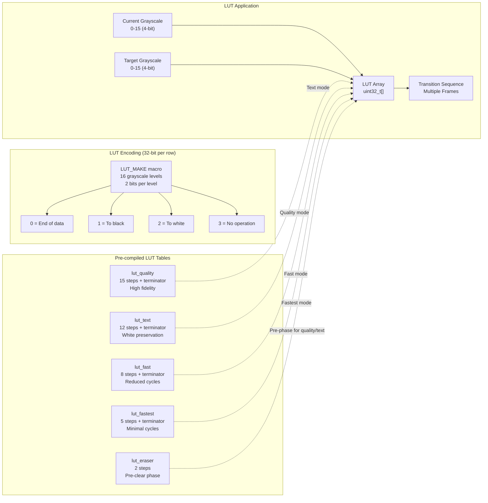
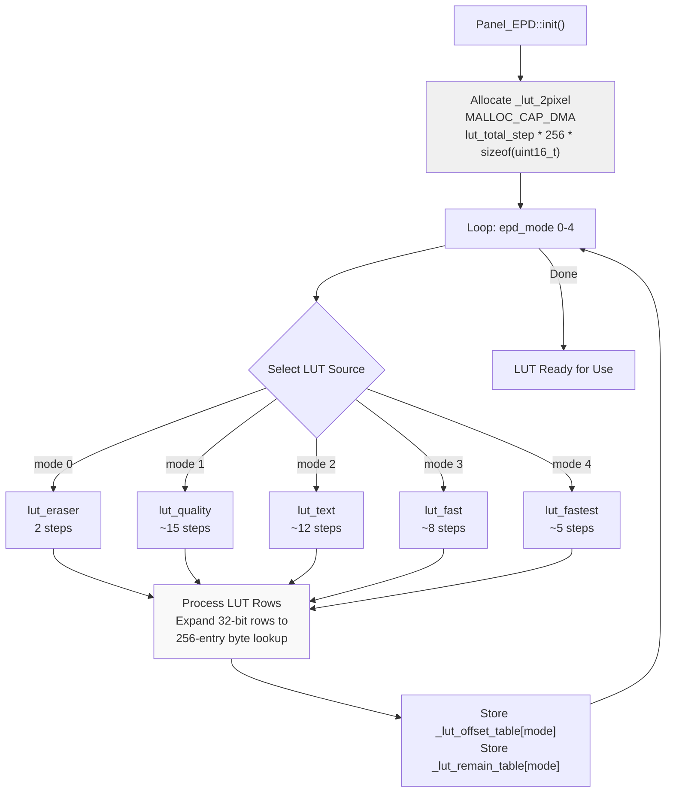
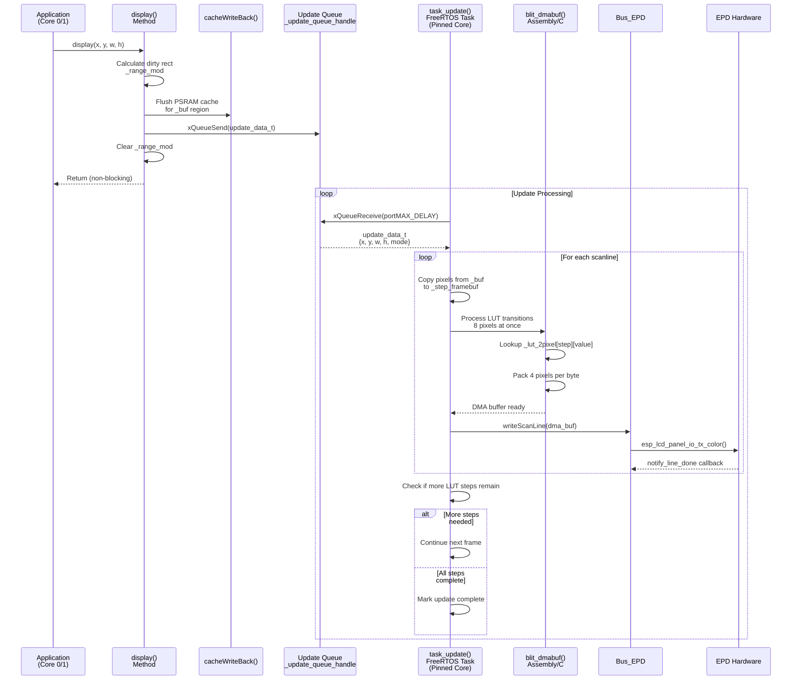
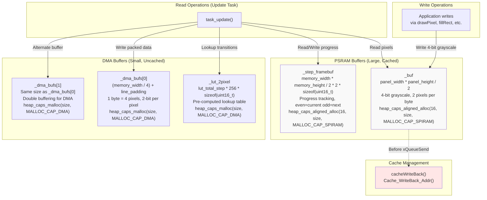
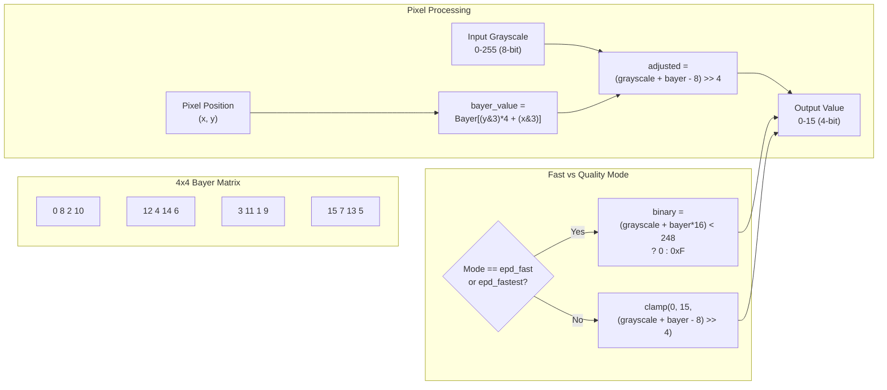
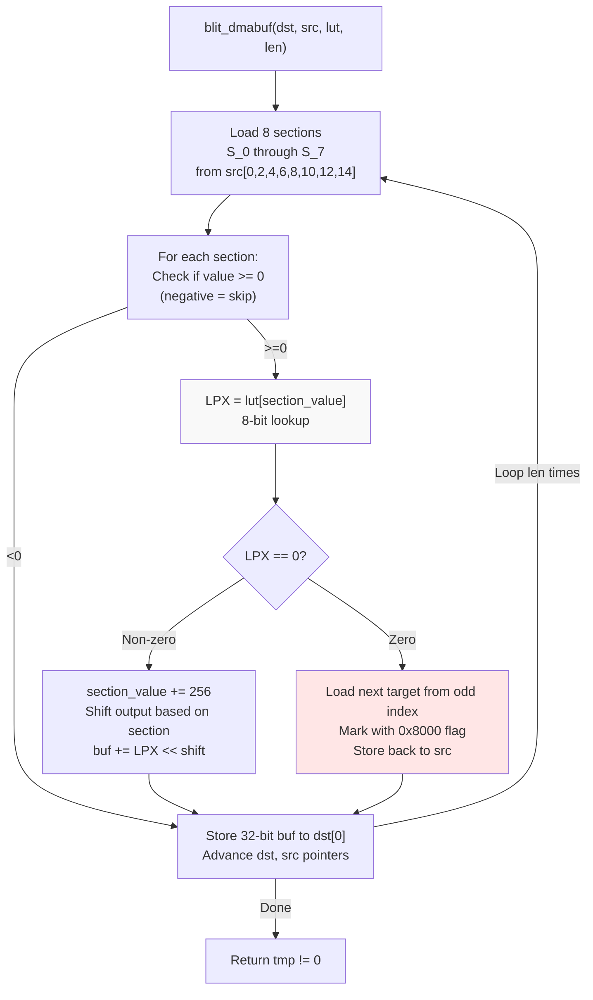
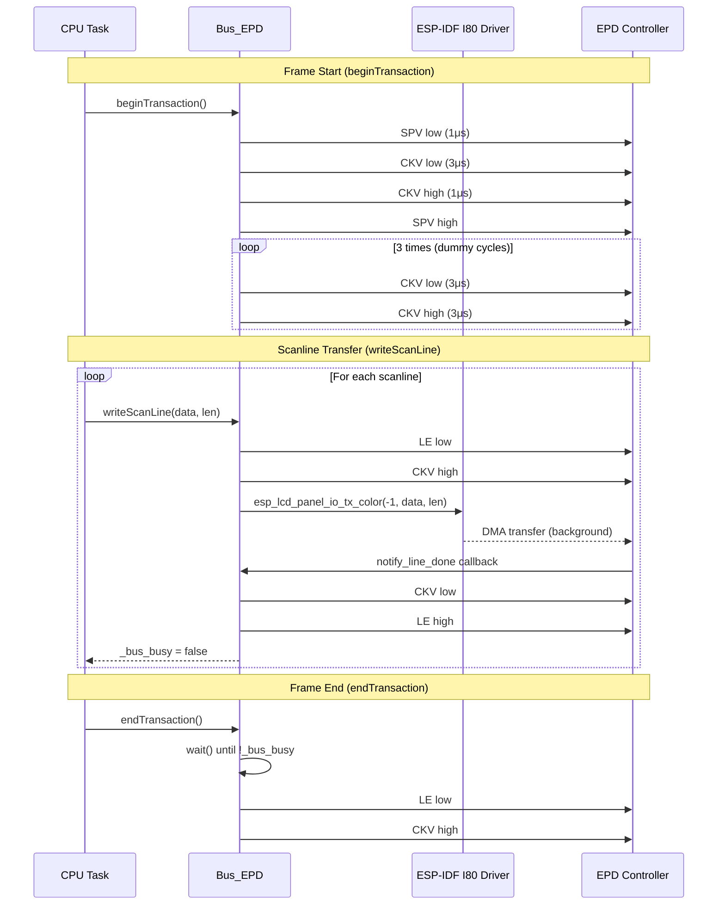
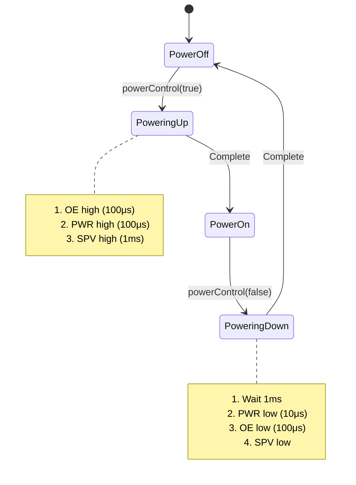
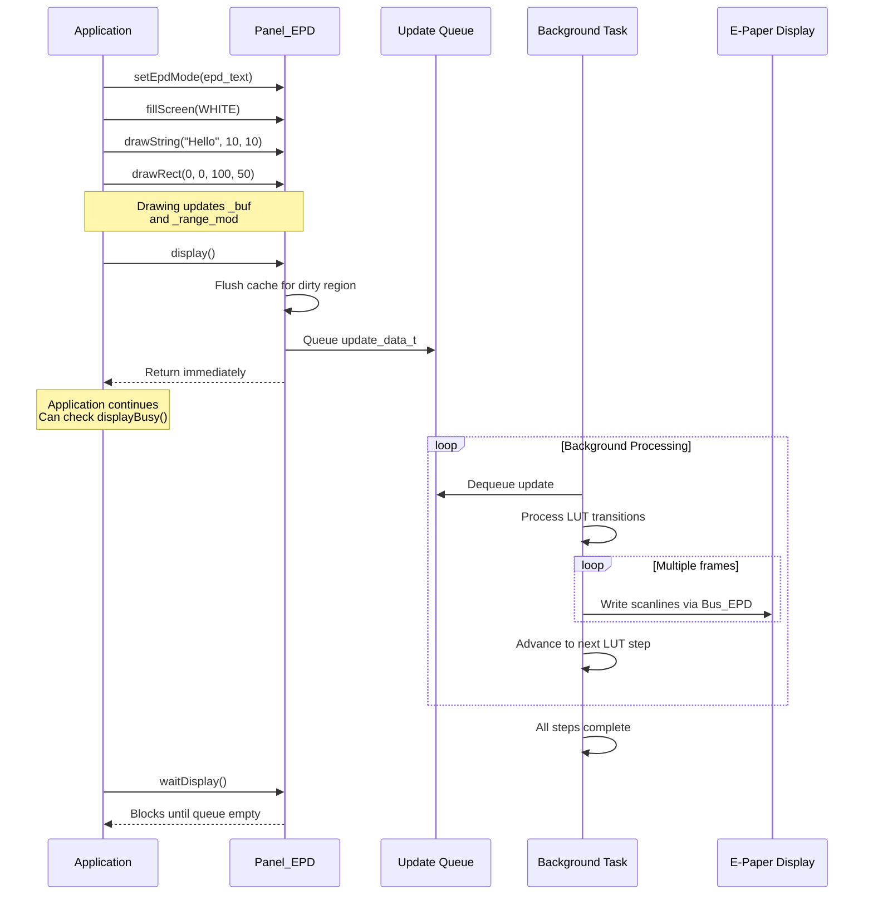

M5GFX E-Paper Panel Driver

# E-Paper Panel Driver

<details>
<summary>Relevant source files</summary>

The following files were used as context for generating this wiki page:

- [src/lgfx/v1/misc/enum.hpp](src/lgfx/v1/misc/enum.hpp)
- [src/lgfx/v1/platforms/esp32/Bus_EPD.cpp](src/lgfx/v1/platforms/esp32/Bus_EPD.cpp)
- [src/lgfx/v1/platforms/esp32/Bus_EPD.h](src/lgfx/v1/platforms/esp32/Bus_EPD.h)
- [src/lgfx/v1/platforms/esp32/Panel_EPD.cpp](src/lgfx/v1/platforms/esp32/Panel_EPD.cpp)
- [src/lgfx/v1/platforms/esp32/Panel_EPD.hpp](src/lgfx/v1/platforms/esp32/Panel_EPD.hpp)

</details>


## Purpose and Scope

This page documents the `Panel_EPD` driver implementation for e-paper displays using ESP32-S3's I80 parallel bus interface. The driver provides asynchronous, LUT-based grayscale rendering with FreeRTOS task management for non-blocking display updates. It is specific to ESP32-S3 devices with SOC_LCD_I80_SUPPORTED capability.

For LCD panel drivers using SPI/I2C buses, see [4.1](#4.1). For other buffered display types (IT8951, EPDiy), refer to their specific panel implementations which also inherit from `Panel_HasBuffer`.

**Sources:** [src/lgfx/v1/platforms/esp32/Panel_EPD.hpp:1-131](), [src/lgfx/v1/platforms/esp32/Panel_EPD.cpp:1-54]()

---

## Architecture Overview

The e-paper panel driver consists of two primary components: `Panel_EPD` which manages rendering and grayscale transitions, and `Bus_EPD` which handles I80 parallel bus communication with the physical EPD controller hardware.



**Key Components:**
- **Panel_EPD**: Main panel driver class, inherits from `Panel_HasBuffer` [src/lgfx/v1/platforms/esp32/Panel_EPD.hpp:37-126]()
- **Bus_EPD**: I80 parallel bus abstraction for EPD hardware [src/lgfx/v1/platforms/esp32/Bus_EPD.h:38-107]()
- **task_update()**: Background FreeRTOS task performing async EPD updates [src/lgfx/v1/platforms/esp32/Panel_EPD.cpp:887-1166]()
- **update_queue_handle**: Queue for buffering update requests between cores [src/lgfx/v1/platforms/esp32/Panel_EPD.hpp:116]()

**Sources:** [src/lgfx/v1/platforms/esp32/Panel_EPD.hpp:37-126](), [src/lgfx/v1/platforms/esp32/Panel_EPD.cpp:161-210](), [src/lgfx/v1/platforms/esp32/Bus_EPD.h:38-107]()

---

## Update Modes and LUT System

`Panel_EPD` supports four update modes defined by `epd_mode_t`, each using a different lookup table (LUT) that defines pixel transition sequences over time. LUTs control how pixels transition from their current grayscale level to the target level.

### EPD Mode Enumeration

| Mode | Enum Value | Purpose | Typical Use Case |
|------|------------|---------|------------------|
| `epd_quality` | 1 | High quality, full grayscale | Photos, detailed graphics |
| `epd_text` | 2 | Optimized for text, white preserving | Text rendering, UI elements |
| `epd_fast` | 3 | Faster refresh, reduced flicker | Frequent updates |
| `epd_fastest` | 4 | Minimal refresh steps | Maximum speed, binary content |

**Sources:** [src/lgfx/v1/misc/enum.hpp:42-52]()

### LUT Structure and Format



The LUT format uses the `LUT_MAKE` macro to encode 16 grayscale levels (0=black to 15=white) with 2 bits each, packed into a 32-bit value. Each LUT row represents one frame of EPD refresh. The horizontal axis represents source grayscale intensity, and each row is processed sequentially (vertical axis = time).

```cpp
// Example LUT row encoding from lut_quality
LUT_MAKE(1, 1, 1, 1, 1, 1, 1, 2, 1, 2, 2, 1, 1, 1, 1, 1)
// Grayscale: 0  1  2  3  4  5  6  7  8  9  a  b  c  d  e  f
// Action:    B  B  B  B  B  B  B  W  B  W  W  B  B  B  B  B
```

**Sources:** [src/lgfx/v1/platforms/esp32/Panel_EPD.cpp:74-159](), [src/lgfx/v1/platforms/esp32/Panel_EPD.cpp:258-284]()

### LUT Processing Pipeline

During initialization, all LUT tables are pre-processed into `_lut_2pixel`, a flattened lookup array where each byte represents the combined operation for two adjacent pixels. This allows efficient lookup during the scanline blit operation.



**Sources:** [src/lgfx/v1/platforms/esp32/Panel_EPD.cpp:258-284]()

---

## Asynchronous Update Pipeline

The EPD update system uses a producer-consumer pattern with FreeRTOS primitives to enable non-blocking display updates that can span multiple frames.

### Update Flow Diagram



**Sources:** [src/lgfx/v1/platforms/esp32/Panel_EPD.cpp:553-589](), [src/lgfx/v1/platforms/esp32/Panel_EPD.cpp:887-1166]()

### Update Data Structure

The `update_data_t` structure encapsulates a single update request:

```cpp
struct update_data_t {
  uint16_t x;        // X coordinate (memory space)
  uint16_t y;        // Y coordinate (memory space)
  uint16_t w;        // Width in pixels
  uint16_t h;        // Height in pixels
  epd_mode_t mode;   // Update mode (quality/text/fast/fastest)
};
```

**Sources:** [src/lgfx/v1/platforms/esp32/Panel_EPD.hpp:99-111]()

### Task Creation and Core Pinning

The background task is created during `init_intenal()` and can be pinned to a specific CPU core to optimize cache coherency:

| Configuration Parameter | Default Value | Purpose |
|------------------------|---------------|---------|
| `task_priority` | 2 | FreeRTOS task priority |
| `task_pinned_core` | -1 (auto) | CPU core assignment (0/1 or auto-select) |

When `task_pinned_core` is -1, the driver automatically pins the task to the opposite core from the calling code to distribute processing load [src/lgfx/v1/platforms/esp32/Panel_EPD.cpp:289-293]().

**Sources:** [src/lgfx/v1/platforms/esp32/Panel_EPD.cpp:286-296](), [src/lgfx/v1/platforms/esp32/Panel_EPD.hpp:42-58]()

---

## Memory Management and Cache Coherency

The driver uses four distinct memory regions with different allocation strategies to balance DMA requirements, capacity, and performance.

### Memory Buffer Overview



**Sources:** [src/lgfx/v1/platforms/esp32/Panel_EPD.cpp:221-257]()

### Cache Coherency Strategy

ESP32-S3 PSRAM is cached, requiring explicit cache writeback when data written by one core must be read by another. The driver addresses this in two locations:

1. **Application to Task:** Before queuing an update, `display()` calls `cacheWriteBack()` to flush the dirty region of `_buf` [src/lgfx/v1/platforms/esp32/Panel_EPD.cpp:578]()

2. **Task Internal:** The `blit_dmabuf()` function modifies `_step_framebuf` in place, which may require writeback if accessed across cores

The cache writeback implementation detects ESP32-S3 and uses either `esp_cache_msync()` (IDF 5.4+) or `Cache_WriteBack_Addr()` (older IDF versions):

```cpp
#if defined (ESP_CACHE_MSYNC_FLAG_DIR_C2M)
int Cache_WriteBack_Addr(uint32_t addr, uint32_t size) {
  uintptr_t start = addr & ~127u;
  uintptr_t end = (addr + size + 127u) & ~127u;
  return esp_cache_msync((void*)start, end - start, 
                         ESP_CACHE_MSYNC_FLAG_DIR_C2M | 
                         ESP_CACHE_MSYNC_FLAG_TYPE_DATA);
}
#endif
```

**Sources:** [src/lgfx/v1/platforms/esp32/Panel_EPD.cpp:27-70](), [src/lgfx/v1/platforms/esp32/Panel_EPD.cpp:578]()

---

## Bayer Dithering for Grayscale Rendering

Since e-paper pixels have limited grayscale levels, the driver uses ordered Bayer dithering to create the appearance of more gray levels through spatial patterns.

### Bayer Matrix and Application



The 4x4 Bayer matrix defined at [src/lgfx/v1/platforms/esp32/Panel_EPD.cpp:74]() provides threshold values that vary spatially, creating dithering patterns:

**Fast Mode Behavior:** In `epd_fast` and `epd_fastest` modes, the algorithm uses a binary threshold to avoid intermediate gray levels, reducing ghosting and improving refresh speed [src/lgfx/v1/platforms/esp32/Panel_EPD.cpp:349-358]().

**Quality Mode Behavior:** In `epd_quality` and `epd_text` modes, the full 16-level grayscale range is utilized for better tonal reproduction [src/lgfx/v1/platforms/esp32/Panel_EPD.cpp:354-358]().

**Sources:** [src/lgfx/v1/platforms/esp32/Panel_EPD.cpp:74](), [src/lgfx/v1/platforms/esp32/Panel_EPD.cpp:466-532]()

### Rotation and Bayer Tile Alignment

The `_draw_pixels()` method maintains correct Bayer tile alignment even when display rotation is applied, by pre-calculating Bayer offsets in rotated coordinate space:

```cpp
int yy = (y&3)<<2; int xx = x&3;
for (int i = 0; i < 4; ++i) {
  btbl[i] = Bayer[yy + xx];
  xx = (xx + ax) & 0x03;  // Wrap within 4x4 tile
  yy = (yy + (ay << 2)) & 0x0C;
}
```

**Sources:** [src/lgfx/v1/platforms/esp32/Panel_EPD.cpp:483-490]()

---

## DMA Blit Optimization

The `blit_dmabuf()` function processes 16 pixels (8 uint16_t pairs from `_step_framebuf`) per iteration, packing them into 4 pixels per output byte for DMA transfer. Two implementations exist: optimized Xtensa assembly for ESP32, and portable C for other architectures.

### Xtensa Assembly Implementation



The assembly version [src/lgfx/v1/platforms/esp32/Panel_EPD.cpp:591-804]() uses ESP32's `loop` instruction for zero-overhead looping and conditional branches to skip completed pixels. Key optimizations:

- **Parallel Section Processing:** Loads all 8 sections at once using unrolled `l16si` instructions
- **Bit Shifting:** Uses `slli` to position each 4-bit pixel value into the correct position in the 32-bit output
- **Zero Detection:** When LUT returns 0 (end of transition), switches to the queued next target value stored in the odd index [src/lgfx/v1/platforms/esp32/Panel_EPD.cpp:727-781]()

**Sources:** [src/lgfx/v1/platforms/esp32/Panel_EPD.cpp:591-804]()

### Double Buffering Protocol

The `_step_framebuf` uses a paired structure where even indices hold the currently processing value, and odd indices hold the next queued target:

| Index | Purpose |
|-------|---------|
| `[0]` | Current processing step for pixel 0 |
| `[1]` | Next target value for pixel 0 (queued) |
| `[2]` | Current processing step for pixel 1 |
| `[3]` | Next target value for pixel 1 (queued) |

When the current processing completes (LUT returns 0), the system swaps in the queued value, OR'd with 0x8000 to mark it as "queued" [src/lgfx/v1/platforms/esp32/Panel_EPD.cpp:728-781]().

**Sources:** [src/lgfx/v1/platforms/esp32/Panel_EPD.cpp:232](), [src/lgfx/v1/platforms/esp32/Panel_EPD.cpp:805-884]()

---

## Bus_EPD: I80 Parallel Bus Interface

`Bus_EPD` abstracts the ESP32-S3's I80 parallel bus for driving e-paper controller hardware with specific control signal timing.

### Bus Configuration Structure

```cpp
struct config_t {
  uint32_t bus_speed;      // Bus clock frequency (Hz)
  
  // 8 or 16 parallel data lines
  int8_t pin_data[16];     // D0-D15 (or D0-D7 for 8-bit mode)
  
  // EPD control signals
  int8_t pin_pwr;          // Power control
  int8_t pin_sph;          // Start pulse horizontal (XSTL)
  int8_t pin_spv;          // Start pulse vertical (gate driver)
  int8_t pin_oe;           // Output enable (XOE)
  int8_t pin_le;           // Latch enable (XLE)
  int8_t pin_cl;           // Clock source driver (XCL)
  int8_t pin_ckv;          // Clock gate driver
  
  uint8_t bus_width;       // 8 or 16
};
```

**Sources:** [src/lgfx/v1/platforms/esp32/Bus_EPD.h:41-81]()

### Control Signal Timing



**Key Timing Requirements:**
- **SPV Pulse:** Start pulse vertical must be low for ≥100ns, high for gate driver reset [src/lgfx/v1/platforms/esp32/Bus_EPD.cpp:54-57]()
- **CKV Cycles:** Clock gate driver requires 3 dummy cycles at 0.5μs intervals [src/lgfx/v1/platforms/esp32/Bus_EPD.cpp:58-63]()
- **LE Latch:** Latch enable goes high after CKV goes low to latch data into source driver [src/lgfx/v1/platforms/esp32/Bus_EPD.cpp:40-41]()

**Sources:** [src/lgfx/v1/platforms/esp32/Bus_EPD.cpp:48-75](), [src/lgfx/v1/platforms/esp32/Bus_EPD.cpp:101-110]()

### Power Control Sequence



The power control sequence follows a specific order to avoid damage to the EPD [src/lgfx/v1/platforms/esp32/Bus_EPD.cpp:77-99]():

1. **Power On:** OE → PWR → SPV with delays
2. **Power Off:** PWR → OE → SPV with delays

**Sources:** [src/lgfx/v1/platforms/esp32/Bus_EPD.cpp:77-99]()

---

## Configuration Options

The `config_detail_t` structure allows customization of LUT tables and task behavior:

### Configuration Structure

| Field | Type | Default | Purpose |
|-------|------|---------|---------|
| `lut_quality` | `const uint32_t*` | Built-in | Custom quality mode LUT |
| `lut_text` | `const uint32_t*` | Built-in | Custom text mode LUT |
| `lut_fast` | `const uint32_t*` | Built-in | Custom fast mode LUT |
| `lut_fastest` | `const uint32_t*` | Built-in | Custom fastest mode LUT |
| `lut_quality_step` | `size_t` | Calculated | Number of steps in quality LUT |
| `lut_text_step` | `size_t` | Calculated | Number of steps in text LUT |
| `lut_fast_step` | `size_t` | Calculated | Number of steps in fast LUT |
| `lut_fastest_step` | `size_t` | Calculated | Number of steps in fastest LUT |
| `line_padding` | `uint8_t` | 0 | Extra bytes per DMA scanline |
| `task_priority` | `uint8_t` | 2 | FreeRTOS task priority (0-31) |
| `task_pinned_core` | `uint8_t` | -1 | CPU core (0, 1, or -1=auto) |

**Usage Example:**

```cpp
Panel_EPD panel;
auto cfg_detail = panel.config_detail();
cfg_detail.task_priority = 3;           // Higher priority
cfg_detail.task_pinned_core = 1;        // Pin to Core 1
cfg_detail.lut_fast = custom_lut_fast;  // Custom LUT
cfg_detail.lut_fast_step = 10;
panel.config_detail(cfg_detail);
```

If custom LUT pointers are `nullptr`, the driver uses built-in LUTs [src/lgfx/v1/platforms/esp32/Panel_EPD.cpp:181-197]().

**Sources:** [src/lgfx/v1/platforms/esp32/Panel_EPD.hpp:42-61](), [src/lgfx/v1/platforms/esp32/Panel_EPD.cpp:181-197]()

---

## Display Workflow Example

### Typical Usage Pattern



**Key Methods:**

- **setEpdMode()**: Change update mode between quality/text/fast/fastest [src/lgfx/v1/misc/enum.hpp:44-50]()
- **display()**: Queue the current dirty region for async update [src/lgfx/v1/platforms/esp32/Panel_EPD.cpp:553-589]()
- **displayBusy()**: Check if update queue has space available [src/lgfx/v1/platforms/esp32/Panel_EPD.cpp:312-319]()
- **waitDisplay()**: Block until all pending updates complete [src/lgfx/v1/platforms/esp32/Panel_EPD.cpp:307-310]()

**Sources:** [src/lgfx/v1/platforms/esp32/Panel_EPD.cpp:307-319](), [src/lgfx/v1/platforms/esp32/Panel_EPD.cpp:553-589]()