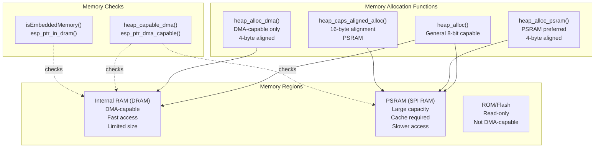
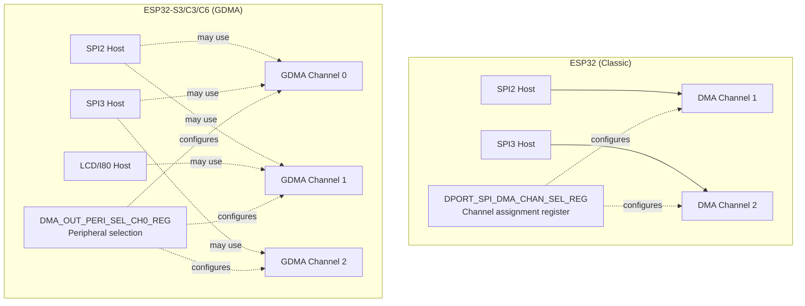
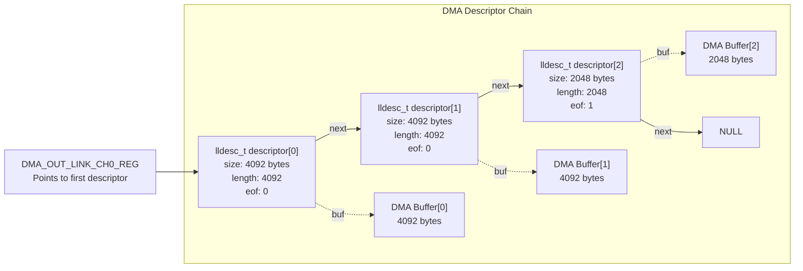
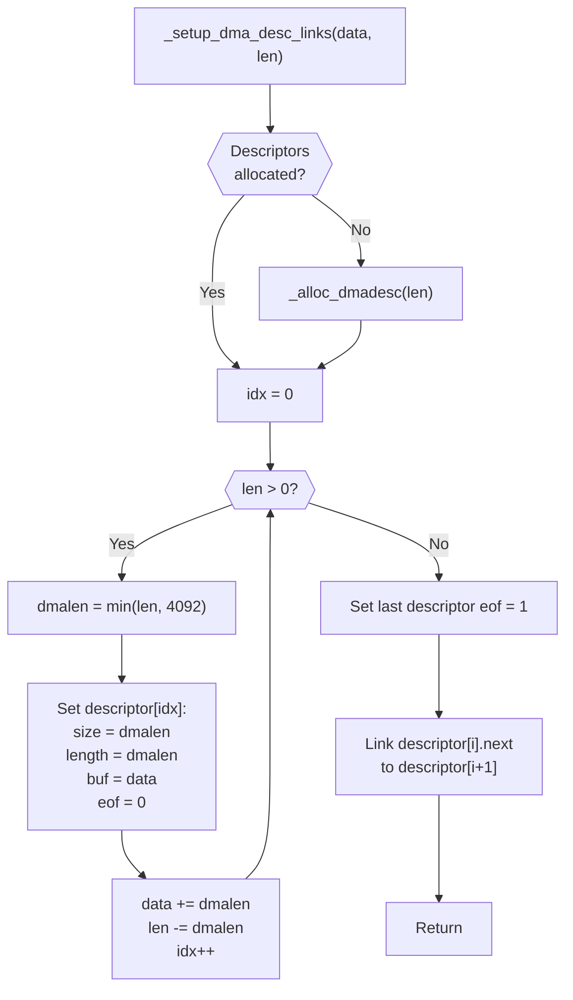
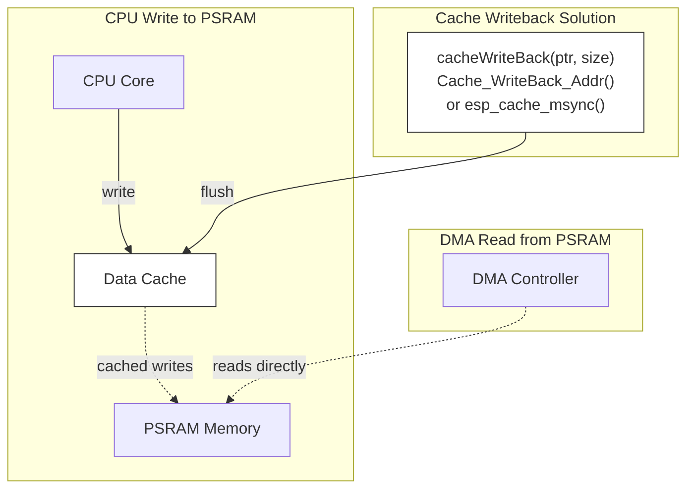
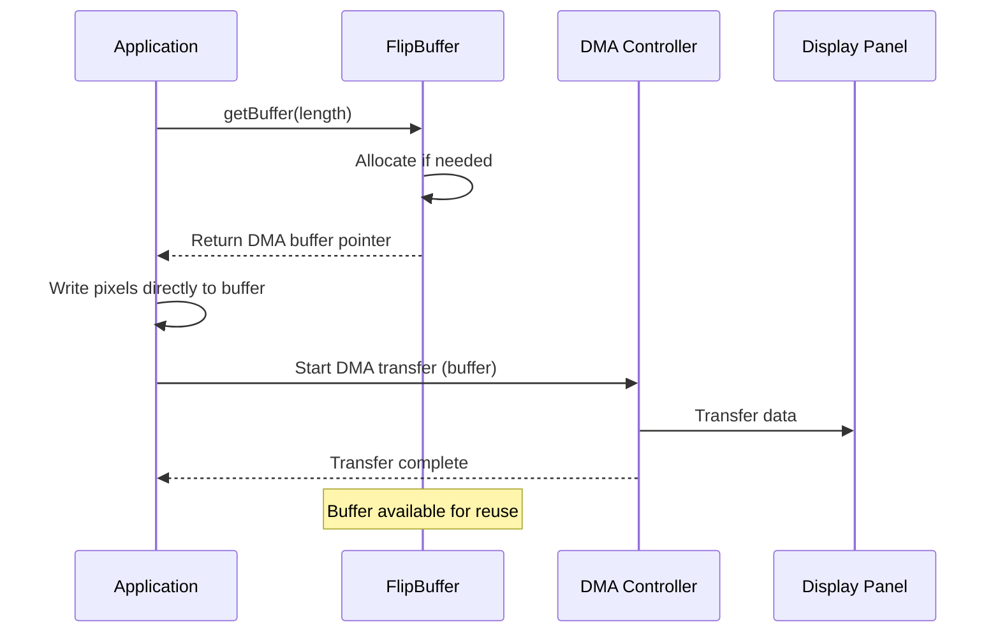
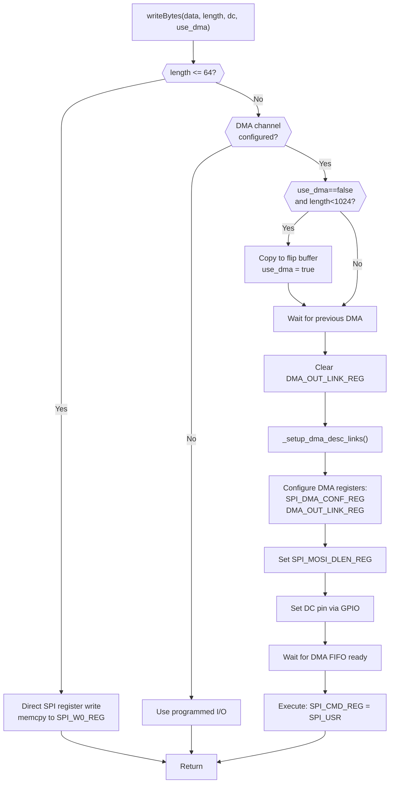
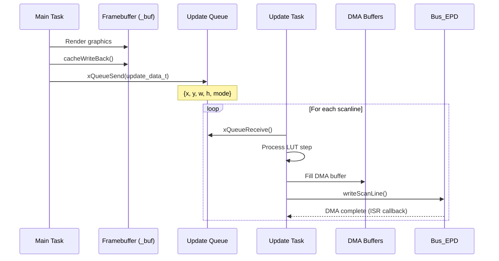

M5GFX ESP32 DMA and Memory Management

# ESP32 DMA and Memory Management

<details>
<summary>Relevant source files</summary>

The following files were used as context for generating this wiki page:

- [src/lgfx/v1/LGFX_Sprite.cpp](src/lgfx/v1/LGFX_Sprite.cpp)
- [src/lgfx/v1/misc/pixelcopy.cpp](src/lgfx/v1/misc/pixelcopy.cpp)
- [src/lgfx/v1/misc/pixelcopy.hpp](src/lgfx/v1/misc/pixelcopy.hpp)
- [src/lgfx/v1/panel/Panel_FrameBufferBase.cpp](src/lgfx/v1/panel/Panel_FrameBufferBase.cpp)
- [src/lgfx/v1/panel/Panel_FrameBufferBase.hpp](src/lgfx/v1/panel/Panel_FrameBufferBase.hpp)
- [src/lgfx/v1/platforms/esp32/Bus_SPI.cpp](src/lgfx/v1/platforms/esp32/Bus_SPI.cpp)
- [src/lgfx/v1/platforms/esp32/Bus_SPI.hpp](src/lgfx/v1/platforms/esp32/Bus_SPI.hpp)
- [src/lgfx/v1/platforms/esp32/common.cpp](src/lgfx/v1/platforms/esp32/common.cpp)
- [src/lgfx/v1/platforms/esp32/common.hpp](src/lgfx/v1/platforms/esp32/common.hpp)

</details>


This page documents the Direct Memory Access (DMA) operations and memory management strategies used in M5GFX for ESP32 platforms. It covers memory allocation for different heap types, DMA descriptor chain construction, cache coherency handling, and zero-copy transfer mechanisms.

For information about the specific SPI bus implementation using DMA, see [ESP32 SPI Bus Implementation](#5.3). For I2C bus details, see [ESP32 I2C Bus Implementation](#5.4).

---

## Memory Architecture Overview

M5GFX distinguishes between multiple memory regions on ESP32 platforms, each with different characteristics and capabilities. Understanding these regions is critical for efficient DMA operations and graphics performance.



**Sources:** [src/lgfx/v1/platforms/esp32/common.hpp:113-127]()

### Memory Allocation Functions

M5GFX provides wrapper functions around ESP-IDF's `heap_caps_malloc` to allocate memory with specific capabilities:

| Function | Capability Flags | Alignment | Use Case |
|----------|-----------------|-----------|----------|
| `heap_alloc()` | `MALLOC_CAP_8BIT` | Natural | General purpose allocation |
| `heap_alloc_dma()` | `MALLOC_CAP_DMA` | 4-byte | DMA descriptor and buffer allocation |
| `heap_alloc_psram()` | `MALLOC_CAP_SPIRAM` | 4-byte | Large framebuffers, off-screen buffers |
| `heap_caps_aligned_alloc()` | `MALLOC_CAP_SPIRAM` | 16-byte | Cache-aligned PSRAM allocations |

**Sources:** [src/lgfx/v1/platforms/esp32/common.hpp:113-116]()

### DMA-Capable Memory Requirements

For DMA transfers to work correctly on ESP32, memory buffers must meet specific requirements:

1. **Internal DRAM**: Always DMA-capable, no special handling required
2. **PSRAM**: DMA-capable on ESP32-S3/C3/C6, requires cache coherency handling
3. **4-byte alignment**: All DMA buffers must be 4-byte aligned
4. **ROM/Flash**: Never DMA-capable, must be copied to RAM first

The `heap_capable_dma()` function checks if a pointer refers to DMA-capable memory by calling `esp_ptr_dma_capable()`.

**Sources:** [src/lgfx/v1/platforms/esp32/common.hpp:117](), [src/lgfx/v1/platforms/esp32/Bus_SPI.cpp:661-671]()

---

## DMA Channel Architecture

ESP32 variants use different DMA architectures. The original ESP32 uses SPI-specific DMA channels, while newer chips (S3, C3, C6, P4) use General DMA (GDMA) that can be assigned to any peripheral.



**Sources:** [src/lgfx/v1/platforms/esp32/common.cpp:262-286](), [src/lgfx/v1/platforms/esp32/Bus_SPI.cpp:177-198]()

### DMA Channel Detection

M5GFX includes functions to detect which DMA channel is assigned to a peripheral at runtime:

**`search_dma_out_ch(int peripheral_select)`** - Scans GDMA peripheral selection registers to find which channel is assigned to a given peripheral. Returns channel index or -1 if not found.

**`search_dma_in_ch(int peripheral_select)`** - Similar to above but for input DMA channels.

These functions iterate through `SOC_GDMA_PAIRS_PER_GROUP_MAX` channels, checking the `DMA_OUT_PERI_SEL_CH0_REG` registers for matching peripheral IDs like `SOC_GDMA_TRIG_PERIPH_SPI2` or `SOC_GDMA_TRIG_PERIPH_LCD0`.

**Sources:** [src/lgfx/v1/platforms/esp32/common.cpp:262-312](), [src/lgfx/v1/platforms/esp32/Bus_SPI.cpp:177-192]()

---

## DMA Descriptor Chains

DMA operations on ESP32 use linked descriptor chains to transfer data from memory to peripherals. Each descriptor points to a data buffer and the next descriptor, allowing transfers larger than the maximum descriptor size.



**Sources:** [src/lgfx/v1/platforms/esp32/Bus_SPI.cpp:831-901]()

### Descriptor Structure and Constraints

The `lldesc_t` structure (defined in ESP-IDF ROM) contains:

- **`size`**: Buffer size in bytes (max 4092 bytes per descriptor)
- **`length`**: Actual data length to transfer
- **`buf`**: Pointer to data buffer
- **`next`**: Pointer to next descriptor (or NULL)
- **`eof`**: End-of-frame flag (set to 1 for last descriptor)

Key constraints:
- Maximum **4092 bytes** per descriptor
- Buffers must be in **DMA-capable memory**
- Descriptors themselves must be in **internal DRAM**
- Total chain length limited by available descriptor memory

**Sources:** [src/lgfx/v1/platforms/esp32/Bus_SPI.cpp:831-901]()

### Descriptor Chain Construction

The `_setup_dma_desc_links()` method constructs descriptor chains dynamically:



**Sources:** [src/lgfx/v1/platforms/esp32/Bus_SPI.cpp:903-949]()

The `_alloc_dmadesc()` helper allocates descriptor memory with a safety margin:

```
required_descriptors = (length + 4091) / 4092
allocated_descriptors = required_descriptors + 1  // safety margin
```

Descriptors are allocated using `heap_alloc_dma()` to ensure they're in DMA-capable internal RAM.

**Sources:** [src/lgfx/v1/platforms/esp32/Bus_SPI.cpp:831-867]()

---

## Cache Coherency for PSRAM

When using PSRAM (external SPI RAM) on ESP32-S3 and newer chips, CPU writes may be cached and not immediately visible to DMA hardware. M5GFX handles this by explicitly flushing the cache before DMA transfers.



**Sources:** [src/lgfx/v1/platforms/esp32/Panel_EPD.cpp:27-70]()

### Cache Writeback Implementation

M5GFX provides a `cacheWriteBack()` function that adapts to the ESP-IDF version:

**For ESP-IDF 5.3+:**
```cpp
esp_cache_msync(ptr, size, 
    ESP_CACHE_MSYNC_FLAG_DIR_C2M | ESP_CACHE_MSYNC_FLAG_TYPE_DATA);
```

**For ESP32-S3 with older IDF:**
```cpp
Cache_WriteBack_Addr((uint32_t)ptr, size);
```

The function includes optimization: if the pointer refers to internal RAM (checked via `isEmbeddedMemory()`), no cache flush is needed since internal RAM is not cached.

**Cache alignment:** The cache line size on ESP32-S3 is 128 bytes. The writeback function aligns the address and size to 128-byte boundaries:

```cpp
uintptr_t start = addr & ~127u;
uintptr_t end = (addr + size + 127u) & ~127u;
```

**Sources:** [src/lgfx/v1/platforms/esp32/Panel_EPD.cpp:32-70]()

### When Cache Writeback is Required

Cache writeback must be performed:

1. **Before DMA transfers from PSRAM** - E-paper panel updates write framebuffer data from PSRAM, requiring cache flush before starting DMA:
   ```cpp
   cacheWriteBack(&_buf[y * _cfg.panel_width >> 1], 
                  h * _cfg.panel_width >> 1);
   ```

2. **Multi-core considerations** - When the update task runs on a different CPU core than the graphics rendering, cache coherency becomes critical. The EPD panel explicitly handles this with task pinning and cache synchronization.

**Sources:** [src/lgfx/v1/platforms/esp32/Panel_EPD.cpp:578](), [src/lgfx/v1/platforms/esp32/Panel_EPD.cpp:232-295]()

---

## Zero-Copy Transfer Optimization

M5GFX implements a "flip buffer" mechanism to minimize memory copies during graphics operations. The system maintains a pool of DMA-capable buffers that can be reused across transactions.



**Sources:** [src/lgfx/v1/platforms/esp32/Bus_SPI.cpp:529-545]()

### FlipBuffer Architecture

The `FlipBuffer` class manages a dynamically-sized DMA-capable buffer:

**Key methods:**
- **`getBuffer(uint32_t length)`** - Returns a pointer to a DMA-capable buffer of at least `length` bytes. Reallocates if the requested size is larger than current capacity.
- Buffer is allocated using `heap_alloc_dma()` to ensure DMA compatibility.
- Buffer persists between transactions for reuse, avoiding repeated allocations.

**Sources:** [src/lgfx/v1/platforms/esp32/Bus_SPI.cpp:537-543]()

### Usage in writePixels

The `writePixels()` method demonstrates the flip buffer optimization:

```cpp
if (_cfg.dma_channel) {
    uint32_t limit = (bytes == 2) ? 32 : 24;
    uint32_t len;
    do {
        len = (limit << 1) <= length ? limit : length;
        if (limit <= 256) limit <<= 1;
        auto dmabuf = _flip_buffer.getBuffer(len * bytes);
        param->fp_copy(dmabuf, 0, len, param);
        writeBytes(dmabuf, len * bytes, true, true);
    } while (length -= len);
}
```

This approach:
1. Requests a buffer from the flip buffer pool
2. Copies converted pixel data directly into the DMA buffer
3. Initiates DMA transfer (zero-copy from that point)
4. Reuses the same buffer for the next chunk

**Sources:** [src/lgfx/v1/platforms/esp32/Bus_SPI.cpp:529-545]()

### Small Transfer Optimization

For small transfers under 1024 bytes, M5GFX may use the flip buffer even when `use_dma=false` to avoid overhead:

```cpp
if (false == use_dma && length < 1024) {
    auto buf = _flip_buffer.getBuffer(length);
    if (buf) {
        memcpy(buf, data, length);
        data = buf;
        use_dma = true;
    }
}
```

This converts a non-DMA transfer into a DMA transfer by copying data once into a DMA-capable buffer, then using hardware acceleration.

**Sources:** [src/lgfx/v1/platforms/esp32/Bus_SPI.cpp:663-671]()

---

## DMA Transfer Flow for SPI

The complete DMA transfer flow for SPI bus operations involves register configuration, descriptor setup, and transfer initiation.



**Sources:** [src/lgfx/v1/platforms/esp32/Bus_SPI.cpp:630-727]()

### DMA Register Configuration

For **GDMA-based chips (ESP32-S3/C3/C6)**:

```cpp
auto dma = reg(SPI_DMA_CONF_REG(_spi_port));
*dma = 0; // Clear previous transfer
*spi_dma_out_link_reg = DMA_OUTLINK_START_CH0 | ((int)(&_dmadesc[0]) & 0xFFFFF);
*dma = SPI_DMA_TX_ENA;
_clear_dma_reg = dma; // Save for cleanup
```

For **classic ESP32**:

```cpp
auto dma_conf_reg = reg(SPI_DMA_CONF_REG(_spi_port));
auto dma_conf = *dma_conf_reg & ~(SPI_OUT_DATA_BURST_EN | ...);
*dma_conf_reg = dma_conf | SPI_AHBM_RST | SPI_AHBM_FIFO_RST | SPI_OUT_RST;

// Enable burst mode only if length is 4-byte aligned
dma_conf |= (length & 3) ? (SPI_OUTDSCR_BURST_EN) 
                          : (SPI_OUTDSCR_BURST_EN | SPI_OUT_DATA_BURST_EN);
*dma_conf_reg = dma_conf;
*spi_dma_out_link_reg = SPI_OUTLINK_START | ((int)(&_dmadesc[0]) & 0xFFFFF);
```

The burst mode optimization avoids data corruption on ESP32 when:
- Clock is 80MHz (1:1 with APB)
- Length is not 4-byte aligned
- Burst read is enabled

**Sources:** [src/lgfx/v1/platforms/esp32/Bus_SPI.cpp:679-701]()

### FIFO Wait and Workarounds

Before starting the SPI transfer, the code waits for the DMA FIFO to be ready:

```cpp
#if defined (SOC_GDMA_SUPPORTED)
while (*_spi_dma_outstatus_reg & DMA_OUTFIFO_EMPTY_CH0) {}
#else
while (*_spi_dma_outstatus_reg & SPI_DMA_OUTFIFO_EMPTY) {}
#endif
```

On classic ESP32, an additional workaround may be required:
```cpp
if (_dma_ch) { 
    spicommon_dmaworkaround_transfer_active(_dma_ch); 
}
```

This addresses ESP32 silicon errata related to DMA transfers.

**Sources:** [src/lgfx/v1/platforms/esp32/Bus_SPI.cpp:707-722]()

---

## E-Paper DMA Architecture

The E-paper display driver (`Panel_EPD`) uses a sophisticated multi-buffer DMA system with background task processing for slow refresh operations.

```mermaid
graph TB
    subgraph "Memory Buffers"
        BUF["_buf<br/>Panel framebuffer<br/>4-bit grayscale<br/>PSRAM"]
        STEP_FB["_step_framebuf<br/>Progressive refresh state<br/>16-bit per 2 pixels<br/>PSRAM aligned 16-byte"]
        DMA_BUF0["_dma_bufs[0]<br/>Scanline buffer<br/>2-bit per 4 pixels<br/>DMA-capable"]
        DMA_BUF1["_dma_bufs[1]<br/>Scanline buffer<br/>2-bit per 4 pixels<br/>DMA-capable"]
        LUT["_lut_2pixel<br/>Lookup table<br/>256x step entries<br/>DMA-capable"]
    end
    
    subgraph "Task Processing"
        MAIN["Main Task<br/>Graphics rendering"]
        UPDATE["Update Task<br/>Background refresh<br/>FreeRTOS task"]
        QUEUE["_update_queue_handle<br/>xQueueCreate(8)"]
    end
    
    subgraph "DMA Transfer"
        BUS["Bus_EPD<br/>I80/LCD peripheral"]
        HARDWARE["E-Paper Panel<br/>Physical display"]
    end
    
    MAIN -->|display()| QUEUE
    QUEUE -->|update_data_t| UPDATE
    UPDATE -->|Read 2px at a time| STEP_FB
    UPDATE -->|Lookup| LUT
    UPDATE -->|Write scanline| DMA_BUF0
    UPDATE -->|Write scanline| DMA_BUF1
    UPDATE -->|DMA transfer| BUS
    BUS -->|writeScanLine()| HARDWARE
    
    MAIN -.cacheWriteBack().-> BUF
    UPDATE -.reads from.-> BUF
```

**Sources:** [src/lgfx/v1/platforms/esp32/Panel_EPD.cpp:214-296](), [src/lgfx/v1/platforms/esp32/Panel_EPD.hpp:88-126]()

### Multi-Buffer Strategy

The E-paper system uses **five separate memory buffers**:

1. **`_buf`** (PSRAM): Main framebuffer, 4-bit grayscale per pixel
   - Size: `(panel_width * panel_height) / 2` bytes
   - User-facing buffer where graphics are rendered
   
2. **`_step_framebuf`** (PSRAM): Progressive refresh state buffer
   - Size: `(memory_width * memory_height / 2) * 2 * sizeof(uint16_t)`
   - Tracks current grayscale level during multi-step refresh
   - 16-byte aligned for cache efficiency
   - Doubled for current + reserved buffer
   
3. **`_lut_2pixel`** (DMA): Lookup table for pixel transitions
   - Size: `lut_total_step * 256 * sizeof(uint16_t)`
   - Pre-computed transitions for all grayscale combinations
   
4. **`_dma_bufs[0]` and `_dma_bufs[1]`** (DMA): Ping-pong scanline buffers
   - Size: `memory_width / 4 + line_padding` each
   - 2-bit per pixel (4 pixels per byte) for panel output

**Sources:** [src/lgfx/v1/platforms/esp32/Panel_EPD.cpp:228-250]()

### Asynchronous Update Flow

The E-paper refresh happens asynchronously via a FreeRTOS task:



**Sources:** [src/lgfx/v1/platforms/esp32/Panel_EPD.cpp:553-589]()

### Task Priority and Core Pinning

The background update task is created with configurable priority and core affinity:

```cpp
auto task_priority = _config_detail.task_priority;       // default: 2
auto task_pinned_core = _config_detail.task_pinned_core; // default: -1
if (task_pinned_core >= portNUM_PROCESSORS) {
    task_pinned_core = (xPortGetCoreID() + 1) % portNUM_PROCESSORS;
}
xTaskCreatePinnedToCore((TaskFunction_t)task_update, "epd", 4096, 
                        this, task_priority, &_task_update_handle, 
                        task_pinned_core);
```

When the task runs on a different core than the main rendering task, cache coherency becomes critical, requiring the explicit `cacheWriteBack()` call before queueing updates.

**Sources:** [src/lgfx/v1/platforms/esp32/Panel_EPD.cpp:287-295]()

---

## Memory Debugging

M5GFX includes a debugging utility for examining memory contents:

```cpp
void debug_memory_dump(const void* src, size_t len) {
    auto s = (const uint32_t*)src;
    do {
        printf("0x%08x = 0x%08x\n", (int)s, (int)s[0]);
        ++s;
        len -= 4;
    } while (len > 0);
}
```

This function dumps memory in 4-byte chunks with addresses, useful for verifying DMA buffer contents and descriptor chains.

**Sources:** [src/lgfx/v1/platforms/esp32/common.cpp:314-323]()

---

## Platform-Specific Register Access

M5GFX uses direct register access for performance-critical DMA operations, with platform-specific differences handled via conditional compilation:

```cpp
static inline volatile uint32_t* reg(uint32_t addr) { 
    return (volatile uint32_t *)ETS_UNCACHED_ADDR(addr); 
}
```

The `ETS_UNCACHED_ADDR` macro ensures register accesses bypass the cache, preventing stale reads.

### Register Naming Differences

Different ESP32 chips use different register names for the same functionality:

| Function | ESP32-S3/C3/C6 | ESP32-P4 | Classic ESP32 |
|----------|----------------|----------|---------------|
| DMA Out Link | `DMA_OUT_LINK_CH0_REG` | `AXI_DMA_OUT_LINK1_CH0_REG` | `SPI_DMA_OUT_LINK_REG` |
| DMA FIFO Status | `DMA_OUTFIFO_STATUS_CH0_REG` | `AXI_DMA_OUTFIFO_STATUS_CH0_REG` | `SPI_DMA_OUTSTATUS_REG` |
| DMA Start | `DMA_OUTLINK_START_CH0` | `AXI_DMA_OUTLINK_START_CH0` | `SPI_OUTLINK_START` |

M5GFX uses `#define` macros to unify these names at compile time.

**Sources:** [src/lgfx/v1/platforms/esp32/Bus_SPI.cpp:66-95](), [src/lgfx/v1/platforms/esp32/common.cpp:129-156]()

---

## Summary

M5GFX's DMA and memory management system provides:

- **Flexible memory allocation** with heap_caps for different memory types
- **Automatic DMA channel detection** across ESP32 variants
- **Linked descriptor chains** for arbitrary-length transfers
- **Cache coherency handling** for PSRAM on multi-core systems
- **Zero-copy flip buffers** to minimize memory operations
- **Asynchronous background processing** for slow display updates

The architecture balances performance, memory efficiency, and portability across the ESP32 family while hiding platform differences behind a unified API.