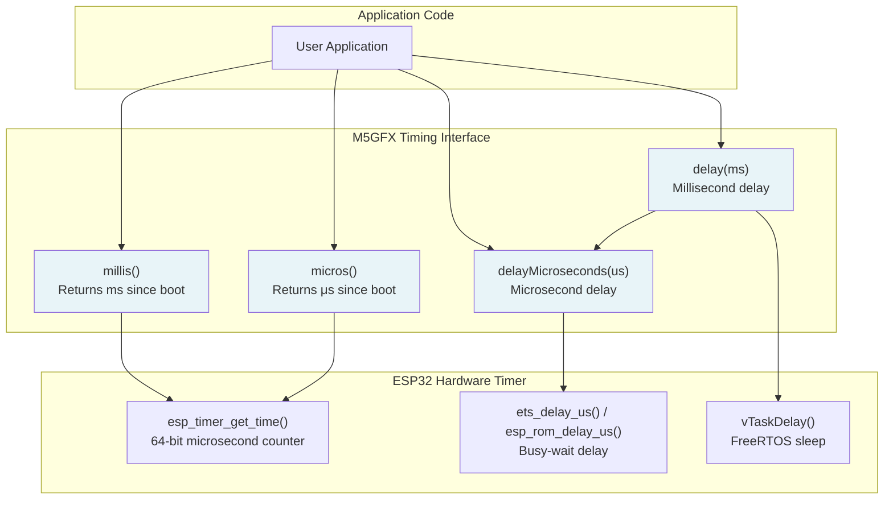
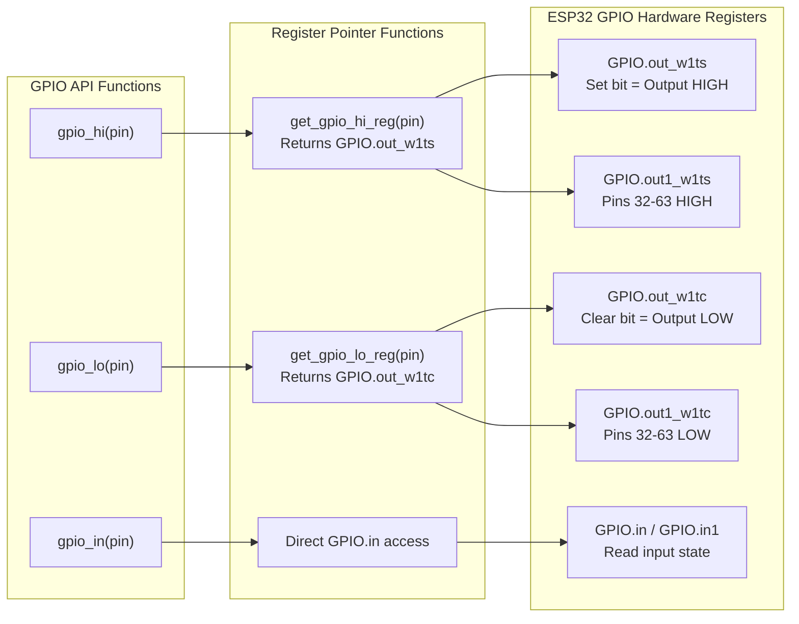
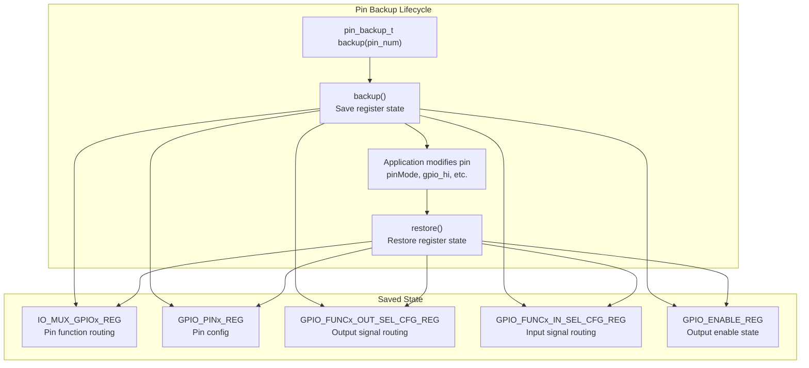
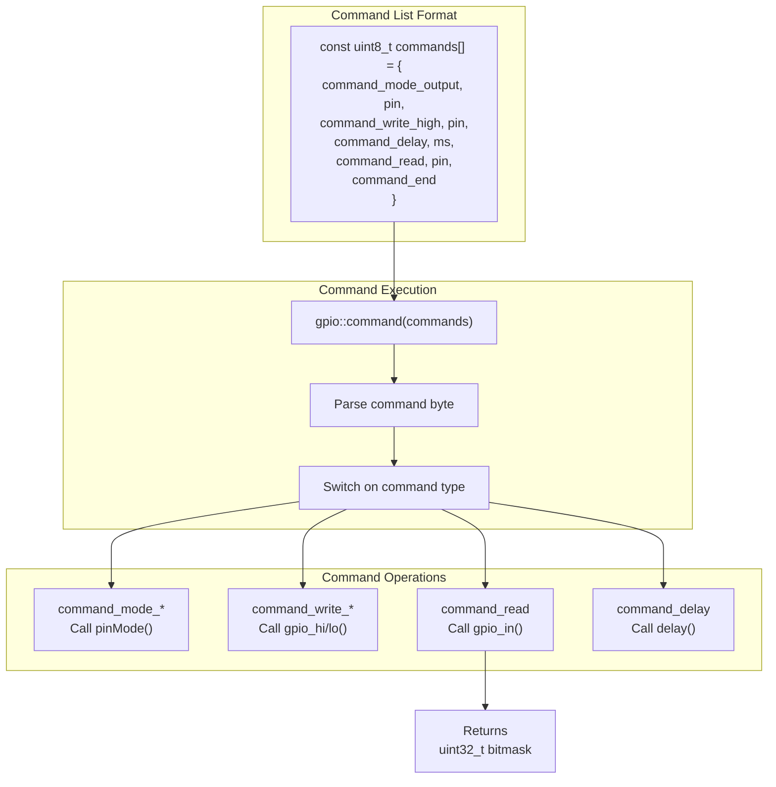
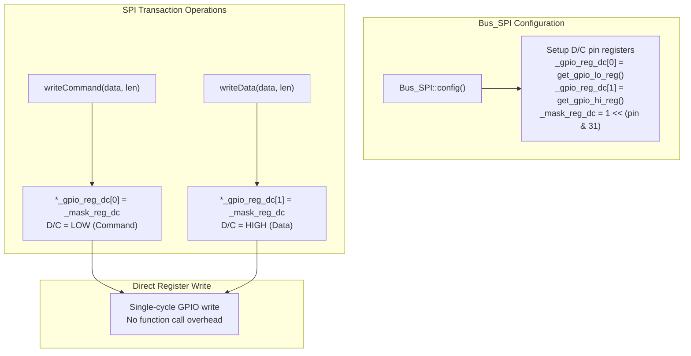
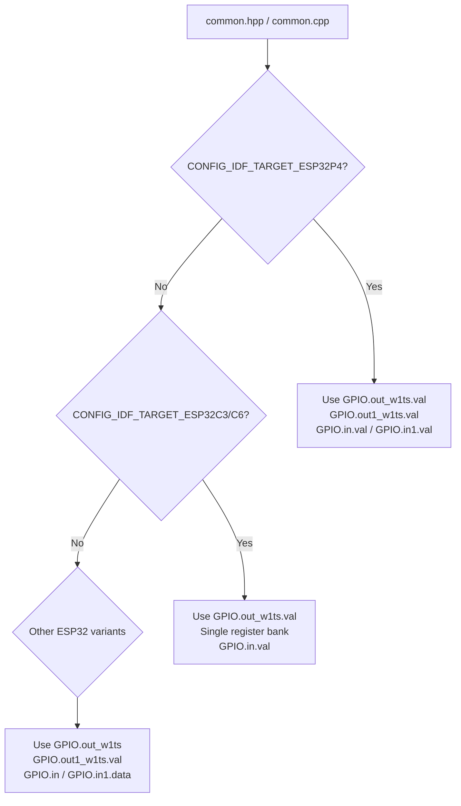

M5GFX ESP32 GPIO and Timing Functions

# ESP32 GPIO and Timing Functions

<details>
<summary>Relevant source files</summary>

The following files were used as context for generating this wiki page:

- [src/lgfx/v1/platforms/esp32/Bus_SPI.cpp](src/lgfx/v1/platforms/esp32/Bus_SPI.cpp)
- [src/lgfx/v1/platforms/esp32/Bus_SPI.hpp](src/lgfx/v1/platforms/esp32/Bus_SPI.hpp)
- [src/lgfx/v1/platforms/esp32/common.cpp](src/lgfx/v1/platforms/esp32/common.cpp)
- [src/lgfx/v1/platforms/esp32/common.hpp](src/lgfx/v1/platforms/esp32/common.hpp)

</details>


## Purpose and Scope

This document covers the low-level GPIO control and timing functions provided by the ESP32 platform abstraction layer in M5GFX. These functions form the foundation for all ESP32-specific peripheral implementations and provide direct hardware register access for optimal performance.

For information about ESP32 SPI bus implementation, see [ESP32 SPI Bus Implementation](#5.3). For I2C bus implementation, see [ESP32 I2C Bus Implementation](#5.4).

## Overview

The ESP32 GPIO and timing functions provide a thin abstraction layer over ESP32 hardware registers, enabling efficient GPIO manipulation and precise timing control. The implementation prioritizes performance through direct register access and inline functions, while maintaining compatibility across ESP32 variants (ESP32, ESP32-S2, ESP32-S3, ESP32-C3, ESP32-C6, ESP32-P4).

**Key Features:**
- Direct register access for single-cycle GPIO operations
- Microsecond-precision timing functions
- Pin configuration backup and restore
- GPIO command sequences for automated pin manipulation
- Platform-independent interface used throughout M5GFX

Sources: [src/lgfx/v1/platforms/esp32/common.hpp:82-175](), [src/lgfx/v1/platforms/esp32/common.cpp:327-514]()

## Timing Functions

### Implementation Architecture



Sources: [src/lgfx/v1/platforms/esp32/common.hpp:88-111]()

### Timing Function Specifications

| Function | Return Type | Precision | Implementation | Use Case |
|----------|-------------|-----------|----------------|----------|
| `millis()` | `unsigned long` | Milliseconds | `esp_timer_get_time() / 1000` | General timing, timeouts |
| `micros()` | `unsigned long` | Microseconds | `esp_timer_get_time()` | Precise timing, protocols |
| `delay(ms)` | `void` | ~1ms | `vTaskDelay()` + busy-wait | Cooperative multitasking delays |
| `delayMicroseconds(us)` | `void` | ~1μs | `ets_delay_us()` or `esp_rom_delay_us()` | Bit-banging, protocol timing |

Sources: [src/lgfx/v1/platforms/esp32/common.hpp:88-111]()

### Delay Function Behavior

The `delay()` function uses a hybrid approach to balance CPU efficiency with timing accuracy:

1. **For delays ≥ 8ms:** Uses `vTaskDelay()` to yield CPU to other tasks
2. **For delays < 8ms:** Combines `vTaskDelay()` with `delayMicroseconds()` for precise timing
3. **Compensation:** Measures actual elapsed time and compensates with busy-wait if needed

This ensures delays shorter than the FreeRTOS tick period (typically 10ms) are still accurate.

Sources: [src/lgfx/v1/platforms/esp32/common.hpp:98-111]()

## GPIO Control Functions

### Register Access Architecture



Sources: [src/lgfx/v1/platforms/esp32/common.hpp:143-158]()

### GPIO Function Reference

**Fast GPIO Output Control:**
```cpp
void gpio_hi(int_fast8_t pin)  // Set pin HIGH (if pin >= 0)
void gpio_lo(int_fast8_t pin)  // Set pin LOW (if pin >= 0)
```

These functions use write-1-to-set (`GPIO.out_w1ts`) and write-1-to-clear (`GPIO.out_w1tc`) registers for atomic single-cycle operations. The conditional check `if (pin >= 0)` allows safe calling with invalid pin numbers.

**GPIO Input Reading:**
```cpp
bool gpio_in(int_fast8_t pin)  // Returns true if pin is HIGH
```

Reads directly from `GPIO.in` or `GPIO.in1` register depending on pin number (0-31 or 32+).

**Pin Configuration:**
```cpp
void pinMode(int_fast16_t pin, pin_mode_t mode)
```

Configures pin mode with these options:
- `pin_mode_t::output` - Push-pull output
- `pin_mode_t::input` - High-impedance input
- `pin_mode_t::input_pullup` - Input with internal pull-up
- `pin_mode_t::input_pulldown` - Input with internal pull-down

Sources: [src/lgfx/v1/platforms/esp32/common.hpp:129-158](), [src/lgfx/v1/platforms/esp32/common.cpp:327-390]()

### Platform-Specific Register Mapping

The GPIO register access is abstracted across ESP32 variants:

| ESP32 Variant | Pin Range | OUT_W1TS Register | OUT_W1TC Register | IN Register |
|---------------|-----------|-------------------|-------------------|-------------|
| ESP32, ESP32-S2, ESP32-S3 | 0-31 | `GPIO.out_w1ts` | `GPIO.out_w1tc` | `GPIO.in` |
| ESP32, ESP32-S2, ESP32-S3 | 32+ | `GPIO.out1_w1ts.val` | `GPIO.out1_w1tc.val` | `GPIO.in1.data` |
| ESP32-C3, ESP32-C6 | 0-31 | `GPIO.out_w1ts.val` | `GPIO.out_w1tc.val` | `GPIO.in.val` |
| ESP32-P4 | 0-31 | `GPIO.out_w1ts.val` | `GPIO.out_w1tc.val` | `GPIO.in.val` |
| ESP32-P4 | 32+ | `GPIO.out1_w1ts.val` | `GPIO.out1_w1tc.val` | `GPIO.in1.val` |

Sources: [src/lgfx/v1/platforms/esp32/common.hpp:143-156]()

## Pin Configuration Management

### Pin Backup and Restore System

The `gpio::pin_backup_t` class provides a mechanism to temporarily reconfigure GPIO pins and restore their original state, essential for bus recovery and peripheral sharing.



Sources: [src/lgfx/v1/platforms/esp32/common.hpp:272-290](), [src/lgfx/v1/platforms/esp32/common.cpp:396-471]()

### Pin Backup Implementation

The backup system preserves five critical GPIO registers per pin:

1. **IO_MUX register** - Controls pin function selection (GPIO vs peripheral)
2. **GPIO_PIN register** - Pin-specific configuration
3. **GPIO_FUNC_OUT register** - Output signal routing
4. **GPIO_FUNC_IN register** - Input signal routing (if connected)
5. **GPIO_ENABLE bit** - Output enable state

**Usage Pattern:**
```cpp
gpio::pin_backup_t backup_sda(pin_sda);  // Constructor calls backup()
gpio::pin_backup_t backup_scl(pin_scl);

// Temporarily reconfigure pins
gpio_set_level(pin_sda, 1);
gpio_set_direction(pin_sda, GPIO_MODE_INPUT_OUTPUT_OD);

// Later restore original state
backup_sda.restore();
backup_scl.restore();
```

Sources: [src/lgfx/v1/platforms/esp32/common.cpp:396-471]()

## GPIO Command System

### Command Sequence Architecture

The GPIO command system allows defining sequences of GPIO operations as byte arrays, useful for initialization sequences and protocol bit-banging.



Sources: [src/lgfx/v1/platforms/esp32/common.hpp:292-306](), [src/lgfx/v1/platforms/esp32/common.cpp:473-514]()

### Command Types

| Command | Parameter | Action | Returns |
|---------|-----------|--------|---------|
| `command_end` | - | Terminates command list | - |
| `command_read` | GPIO pin | Reads pin state | Adds bit to result |
| `command_write_low` | GPIO pin | Sets pin LOW | - |
| `command_write_high` | GPIO pin | Sets pin HIGH | - |
| `command_mode_output` | GPIO pin | Sets output mode | - |
| `command_mode_input` | GPIO pin | Sets input mode | - |
| `command_mode_input_pulldown` | GPIO pin | Sets input with pull-down | - |
| `command_mode_input_pullup` | GPIO pin | Sets input with pull-up | - |
| `command_delay` | Milliseconds | Delays execution | - |

The `command_read` operations accumulate results as a left-shifted bitmask, allowing multiple pin reads to be combined.

Sources: [src/lgfx/v1/platforms/esp32/common.hpp:292-306](), [src/lgfx/v1/platforms/esp32/common.cpp:473-514]()

## Integration with Bus Implementations

### GPIO Usage in SPI Bus

The SPI bus implementation demonstrates intensive GPIO usage for D/C (Data/Command) pin control:



Sources: [src/lgfx/v1/platforms/esp32/Bus_SPI.cpp:113-155](), [src/lgfx/v1/platforms/esp32/Bus_SPI.cpp:314-354]()

### Performance Optimization

The SPI bus caches GPIO register pointers during configuration to eliminate overhead:

1. **Register pointer caching:** `_gpio_reg_dc[0]` and `_gpio_reg_dc[1]` are set once during `config()`
2. **Bitmask precalculation:** `_mask_reg_dc = 1 << (pin & 31)` computed once
3. **Inline register writes:** Direct register write in `writeCommand()` and `writeData()`

This approach achieves single-cycle D/C toggling without function call overhead.

**Example from Bus_SPI:**
```cpp
// From Bus_SPI::config() [lines 131-142]
if (cfg.pin_dc < 0) {
  _mask_reg_dc = 0;
  _gpio_reg_dc[0] = &_mask_reg_dc;  // Dummy register for no-op
  _gpio_reg_dc[1] = &_mask_reg_dc;
} else {
  _mask_reg_dc = (1ul << (cfg.pin_dc & 31));
  _gpio_reg_dc[0] = get_gpio_lo_reg(cfg.pin_dc);
  _gpio_reg_dc[1] = get_gpio_hi_reg(cfg.pin_dc);
}

// From Bus_SPI::writeCommand() [line 351]
*gpio_reg_dc = mask_reg_dc;  // Single register write
```

Sources: [src/lgfx/v1/platforms/esp32/Bus_SPI.cpp:131-142](), [src/lgfx/v1/platforms/esp32/Bus_SPI.cpp:314-354]()

## Clock Frequency Utilities

### APB Frequency Detection

```cpp
uint32_t getApbFrequency(void)
```

Reads the current CPU frequency configuration and returns the APB (Advanced Peripheral Bus) clock frequency, used for calculating peripheral clock dividers. Returns 80 MHz for CPU frequencies ≥ 80 MHz, or a proportional frequency for lower CPU speeds.

Sources: [src/lgfx/v1/platforms/esp32/common.cpp:180-192]()

### Clock Divider Calculation

```cpp
uint32_t FreqToClockDiv(uint32_t fapb, uint32_t hz)
```

Converts a target frequency in Hz to an ESP32 SPI clock divider register value. Handles the special case of maximum speed (`SPI_CLK_EQU_SYSCLK`) and calculates pre-scaler and divider values for other frequencies.

```cpp
void calcClockDiv(uint32_t* div_a, uint32_t* div_b, uint32_t* div_n, 
                  uint32_t* clkcnt, uint32_t baseClock, uint32_t targetFreq)
```

Calculates fractional clock divider parameters for I2S and LCD_CAM peripherals, finding optimal divider values to minimize frequency error. Uses iterative search to find the best combination of:
- `div_n`: Integer divider (2-256)
- `div_a`, `div_b`: Fractional divider (duty = b/a)
- `clkcnt`: Clock count (2-64)

Sources: [src/lgfx/v1/platforms/esp32/common.cpp:194-243]()

## Platform Variant Handling

### Conditional Compilation Patterns

The GPIO implementation uses preprocessor conditionals to handle differences across ESP32 variants:



**Key Differences:**
- **ESP32-P4:** Both register banks use `.val` accessor
- **ESP32-C3/C6:** Single GPIO register bank (no GPIO1)
- **ESP32/S2/S3:** Mixed accessor styles (direct vs `.val` vs `.data`)

Sources: [src/lgfx/v1/platforms/esp32/common.hpp:142-156]()

### IDF Version Compatibility

The timing functions adapt to ESP-IDF version changes:

```cpp
#if defined ( LGFX_IDF_V5 )
  esp_rom_delay_us(us);  // IDF v5.x
#else
  ets_delay_us(us);      // IDF v4.x and earlier
#endif
```

Sources: [src/lgfx/v1/platforms/esp32/common.hpp:90-97]()

## Usage Examples

### Basic GPIO Control

```cpp
// Configure pin as output
pinMode(GPIO_NUM_5, pin_mode_t::output);

// Fast toggle
gpio_hi(GPIO_NUM_5);
delayMicroseconds(100);
gpio_lo(GPIO_NUM_5);

// Read input
pinMode(GPIO_NUM_18, pin_mode_t::input_pullup);
bool state = gpio_in(GPIO_NUM_18);
```

### Pin Backup for Temporary Reconfiguration

```cpp
// Save original configuration
gpio::pin_backup_t backup_pin(GPIO_NUM_21);

// Temporarily reconfigure
pinMode(GPIO_NUM_21, pin_mode_t::output);
gpio_hi(GPIO_NUM_21);
delay(100);
gpio_lo(GPIO_NUM_21);

// Restore original state
backup_pin.restore();
```

### GPIO Command Sequence

```cpp
// Define initialization sequence
const uint8_t init_sequence[] = {
    gpio::command_mode_output, 5,        // Set pin 5 as output
    gpio::command_write_low, 5,          // Set pin 5 LOW
    gpio::command_delay, 10,             // Wait 10ms
    gpio::command_write_high, 5,         // Set pin 5 HIGH
    gpio::command_end                    // End of sequence
};

// Execute sequence
gpio::command(init_sequence);
```

Sources: [src/lgfx/v1/platforms/esp32/common.cpp:473-514]()

## Performance Characteristics

| Operation | Execution Time | Method |
|-----------|----------------|--------|
| `gpio_hi()` / `gpio_lo()` | ~1 CPU cycle | Direct register write |
| `gpio_in()` | ~2 CPU cycles | Direct register read |
| `pinMode()` | ~50-100 cycles | Multiple register writes |
| `delayMicroseconds()` | Variable | ROM busy-wait function |
| `delay()` | ≥ FreeRTOS tick | Task yield + busy-wait compensation |

The GPIO functions are declared as `static inline` to enable compiler inlining, eliminating function call overhead for critical operations.

Sources: [src/lgfx/v1/platforms/esp32/common.hpp:157-158]()