M5GFX ESP32 I2C Bus Implementation

# ESP32 I2C Bus Implementation

<details>
<summary>Relevant source files</summary>

The following files were used as context for generating this wiki page:

- [src/lgfx/v1/platforms/esp32/Bus_SPI.cpp](src/lgfx/v1/platforms/esp32/Bus_SPI.cpp)
- [src/lgfx/v1/platforms/esp32/Bus_SPI.hpp](src/lgfx/v1/platforms/esp32/Bus_SPI.hpp)
- [src/lgfx/v1/platforms/esp32/common.cpp](src/lgfx/v1/platforms/esp32/common.cpp)
- [src/lgfx/v1/platforms/esp32/common.hpp](src/lgfx/v1/platforms/esp32/common.hpp)

</details>


This document describes the I2C bus implementation for ESP32 platforms in M5GFX. This implementation provides direct hardware register control with state machine management, bus recovery logic, and multi-threading support for I2C communication with display panels and other peripherals.

For SPI bus implementation details, see [5.3](#5.3). For general ESP32 platform features, see [5.1](#5.1).

**Sources:** [src/lgfx/v1/platforms/esp32/common.cpp:840-1436](), [src/lgfx/v1/platforms/esp32/common.hpp:321-341]()

---

## Overview and Architecture

The I2C implementation resides in the `lgfx::v1::i2c` namespace and provides low-level control of ESP32's I2C peripherals. Unlike the SPI implementation which bypasses ESP-IDF drivers for performance, the I2C implementation integrates with ESP-IDF's I2C driver infrastructure while adding sophisticated state management and error recovery.

### Core Components

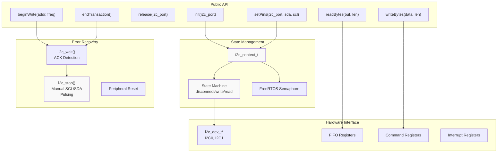

**Sources:** [src/lgfx/v1/platforms/esp32/common.cpp:971-1066](), [src/lgfx/v1/platforms/esp32/common.cpp:840-927]()

---

## Context Structure and State Management

### i2c_context_t Structure

The `i2c_context_t` structure maintains per-port state for I2C communication:

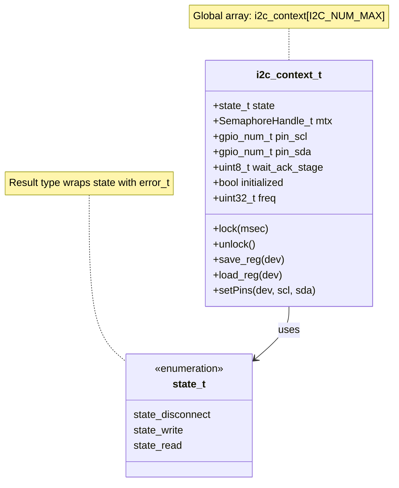

| Field | Type | Purpose |
|-------|------|---------|
| `state` | `cpp::result<state_t, error_t>` | Current transaction state with error tracking |
| `mtx` | `SemaphoreHandle_t` | FreeRTOS mutex for thread safety |
| `pin_scl`, `pin_sda` | `gpio_num_t` | GPIO pin assignments |
| `wait_ack_stage` | `uint8_t` | ACK wait state: 0=none, 1=after address, 2=during data |
| `initialized` | `bool` | Whether port has been initialized |
| `freq` | `uint32_t` | Current operating frequency |

The global array `i2c_context[I2C_NUM_MAX]` stores one context per I2C port (typically 2 ports on ESP32, 1 port on ESP32-C3/C6).

**Sources:** [src/lgfx/v1/platforms/esp32/common.cpp:971-1066](), [src/lgfx/v1/platforms/esp32/common.cpp:1067]()

### State Transitions

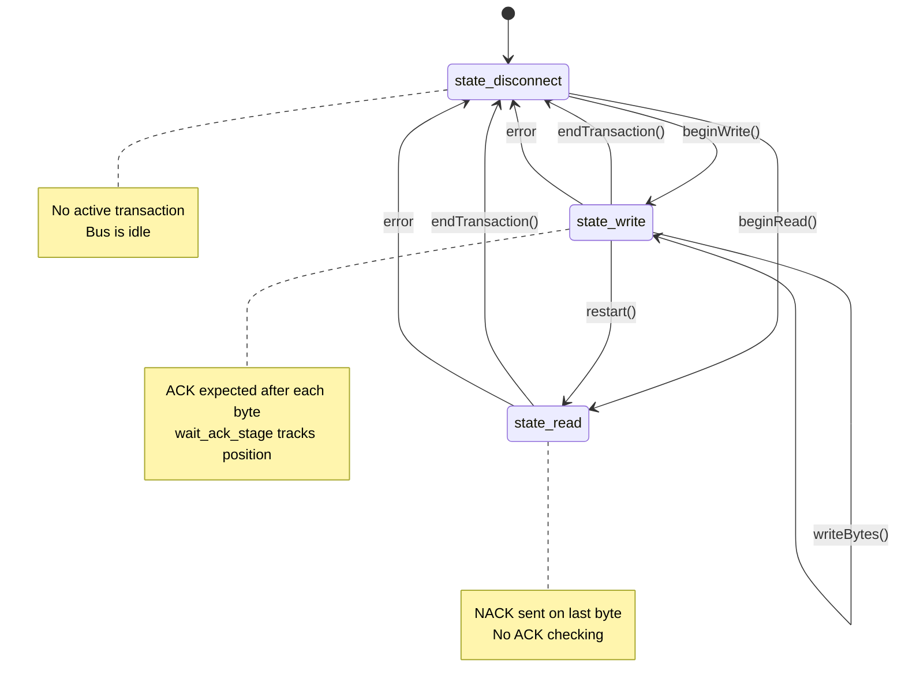

**Sources:** [src/lgfx/v1/platforms/esp32/common.cpp:973-978](), [src/lgfx/v1/platforms/esp32/common.cpp:1172-1262]()

---

## Initialization and Configuration

### Pin Configuration Flow

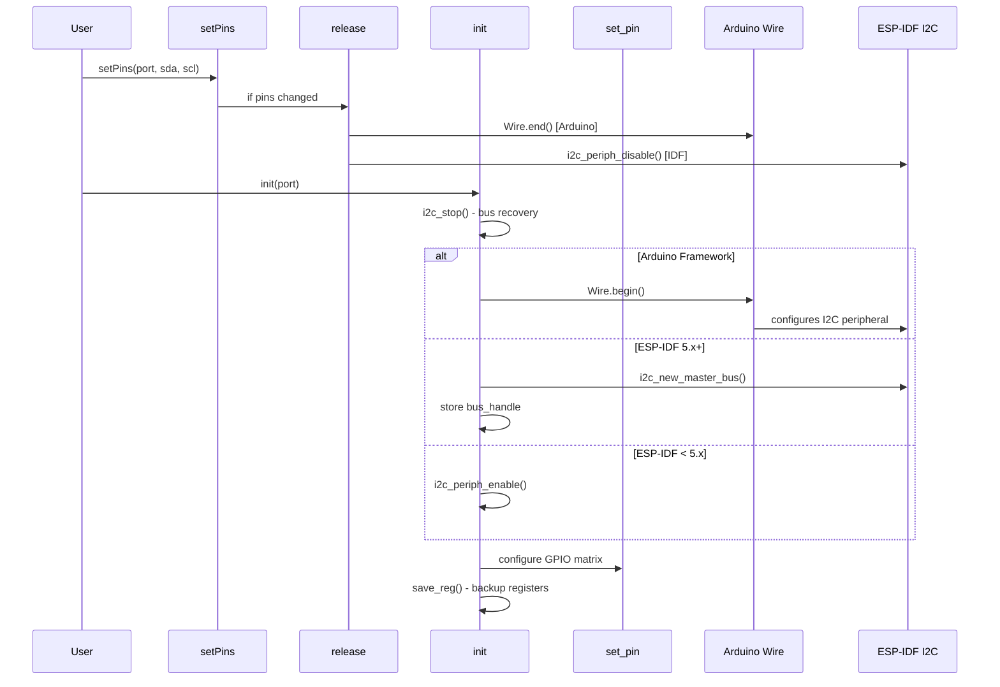

**Key Functions:**

- **`setPins(i2c_port, pin_sda, pin_scl)`** [common.cpp:1305-1342](): Sets GPIO pins and releases previous configuration if changed
- **`init(i2c_port)`** [common.cpp:1354-1407](): Initializes I2C peripheral, performs bus recovery
- **`set_pin(i2c_port, pin_sda, pin_scl)`** [common.cpp:1069-1091](): Configures GPIO matrix routing

**Sources:** [src/lgfx/v1/platforms/esp32/common.cpp:1305-1407](), [src/lgfx/v1/platforms/esp32/common.cpp:1069-1091]()

### Framework-Specific Initialization

The implementation adapts to three environments:

| Environment | Detection | Initialization Path |
|-------------|-----------|---------------------|
| **Arduino** | `#if defined(ARDUINO) && __has_include(<Wire.h>)` | Uses `Wire.begin()` / `Wire1.begin()` |
| **ESP-IDF 5.x+** | `__has_include(<driver/i2c_master.h>)` | Uses new `i2c_new_master_bus()` API |
| **ESP-IDF < 5.x** | fallback | Uses `i2c_periph_enable()` direct control |

**Sources:** [src/lgfx/v1/platforms/esp32/common.cpp:1372-1399]()

---

## Command Structure and Hardware Interface

### I2C Command Encoding

ESP32's I2C peripheral uses a command queue system. Commands are encoded differently across chip variants:

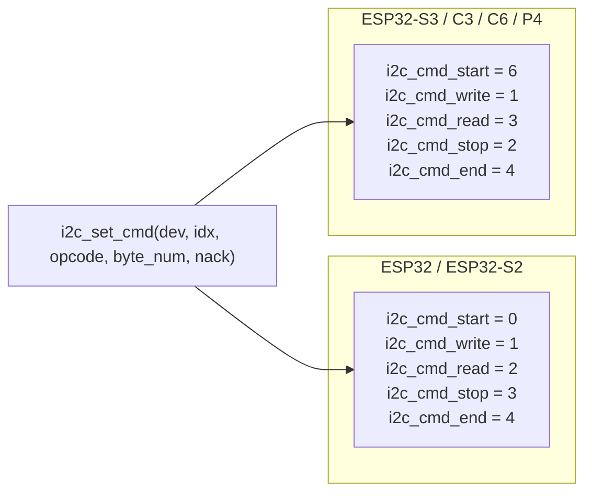

**Command Encoding in `i2c_set_cmd()`** [common.cpp:1104-1133]():

```
Command Value = byte_num 
              | (ack_enable ? 0x100 : 0)
              | (opcode << 11)
              | (nack_flag << 10)
```

| Field | Bits | Purpose |
|-------|------|---------|
| `byte_num` | [7:0] | Number of bytes to transfer |
| `ack_en` | [8] | Enable ACK checking (for write/stop) |
| `ack_value` | [10] | NACK flag for read operations |
| `op_code` | [13:11] | Command type (start/write/read/stop/end) |

**Sources:** [src/lgfx/v1/platforms/esp32/common.cpp:929-965](), [src/lgfx/v1/platforms/esp32/common.cpp:1104-1133]()

### Hardware Register Access

```mermaid
graph TB
    subgraph "Register Access Helper Functions"
        GetDev["getDev(i2c_num)<br/>returns i2c_dev_t*"]
        GetFifo["getFifoAddr(i2c_num)<br/>returns FIFO register"]
        GetRxCount["getRxFifoCount(dev)<br/>platform-specific"]
    end
    
    subgraph "i2c_dev_t Structure"
        IntRaw["int_raw<br/>Interrupt status"]
        SR["sr / status_reg<br/>FIFO counts"]
        CmdRegs["command[16]<br/>Command queue"]
        Data["data / fifo_data<br/>FIFO register"]
        Ctr["ctr<br/>Control register"]
    end
    
    GetDev --> IntRaw
    GetDev --> SR
    GetDev --> CmdRegs
    GetFifo --> Data
    GetRxCount --> SR
    
    note right of GetRxCount
        ESP32-C3: sr.rx_fifo_cnt
        ESP32-S3/C6/P4: sr.rxfifo_cnt
        Others: status_reg.rx_fifo_cnt
    end note
```

**Platform-Specific Differences:**

The implementation handles multiple chip-specific register layouts:

- **Command Register Array:** On ESP32-S3 IDF 5.x+, accessed via `dev->comd[idx].val` instead of `dev->command[idx].val` [common.cpp:1122-1132]()
- **FIFO Address:** Varies by chip - uses `getFifoAddr()` to abstract [common.cpp:934-958]()
- **Update Mechanism:** ESP32-S3+ requires `dev->ctr.conf_upgate = 1` after register changes [common.cpp:947-950]()

**Sources:** [src/lgfx/v1/platforms/esp32/common.cpp:860-867](), [src/lgfx/v1/platforms/esp32/common.cpp:934-966](), [src/lgfx/v1/platforms/esp32/common.cpp:1093-1102]()

---

## Transaction Flow and ACK Detection

### Write Transaction

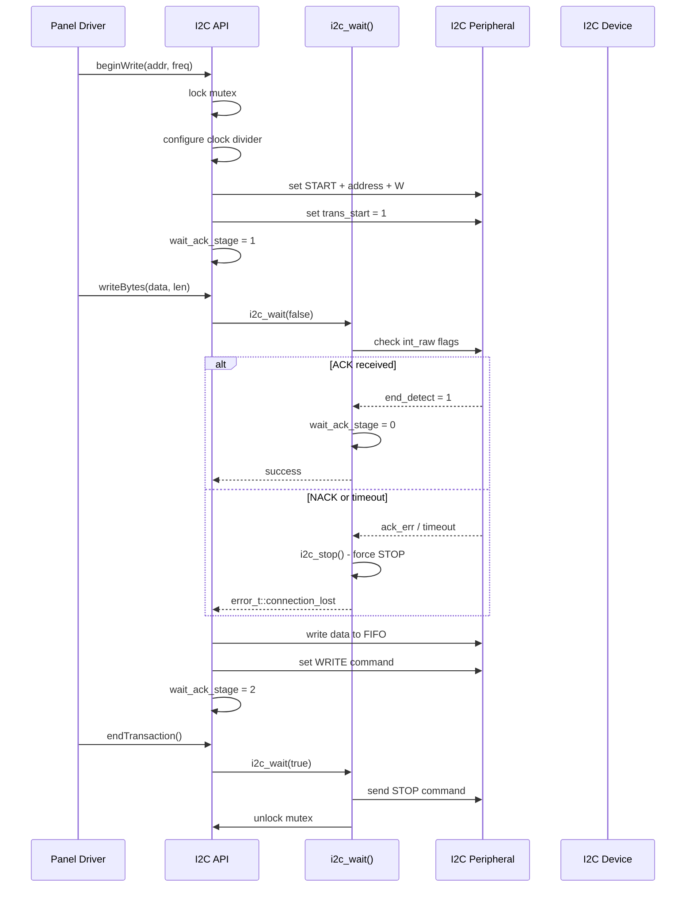

**ACK Wait Logic** [common.cpp:1172-1220]():

The `wait_ack_stage` field tracks where ACK is expected:
- **0:** Not waiting for ACK
- **1:** Waiting after address byte (initial connection)
- **2:** Waiting during data transmission

Timeout calculation adapts based on stage:
```cpp
uint32_t us_limit = (scl_period) * (1 + tx_fifo_count);
us_limit += 512 << wait_ack_stage;  // Longer timeout after address
```

**Sources:** [src/lgfx/v1/platforms/esp32/common.cpp:1172-1262](), [src/lgfx/v1/platforms/esp32/common.cpp:1182-1203]()

### Interrupt Flag Detection

The implementation monitors multiple interrupt flags:

| Flag | Condition | Meaning |
|------|-----------|---------|
| `I2C_ACK_ERR_INT_RAW_M` / `I2C_NACK_INT_RAW_M` | Set when NACK received | Device did not acknowledge |
| `I2C_END_DETECT_INT_RAW_M` | Set on successful completion | Transaction completed normally |
| `I2C_ARBITRATION_LOST_INT_RAW_M` | Set when bus arbitration lost | Multi-master conflict |

**Platform Variation:** ESP32 classic additionally checks SDA line directly for NACK [common.cpp:1206-1207]():
```cpp
bool flg_nack = (gpio_in(pin_sda) == 1);
```

**Sources:** [src/lgfx/v1/platforms/esp32/common.cpp:1179](), [src/lgfx/v1/platforms/esp32/common.cpp:1206-1213]()

---

## Bus Recovery and Error Handling

### i2c_stop() - Manual Bus Recovery

When communication errors occur, the `i2c_stop()` function [common.cpp:1135-1170]() performs manual bus recovery by bit-banging STOP conditions:

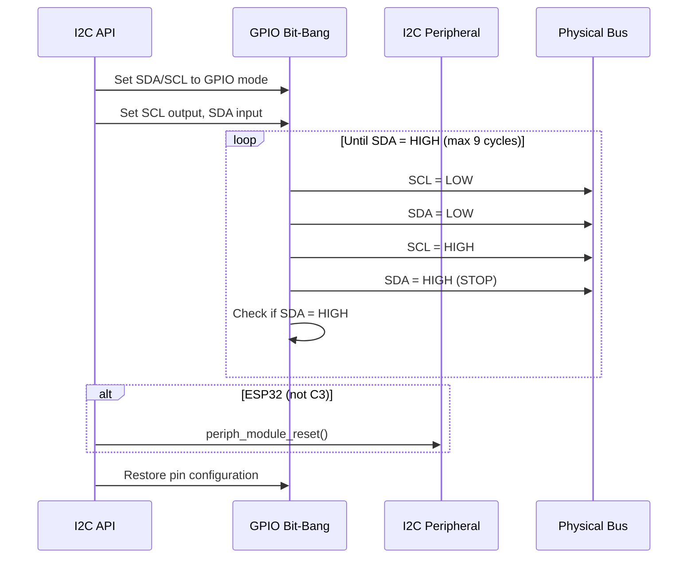

**Recovery Process:**

1. **Switch to GPIO mode:** Configure SCL/SDA as GPIO open-drain outputs
2. **Generate clock pulses:** Send up to 9 SCL pulses to allow device to complete byte
3. **Send STOP condition:** Generate START→STOP sequence to reset bus
4. **Reset peripheral:** Call `periph_module_reset()` (except on ESP32-C3 where it causes issues)
5. **Restore configuration:** Restore original pin settings from backup

**Special Case for ESP32-C3:** The peripheral reset is skipped [common.cpp:1165-1167]() due to a bug where it causes permanent communication failure.

**Sources:** [src/lgfx/v1/platforms/esp32/common.cpp:1135-1170]()

### Error States and Recovery

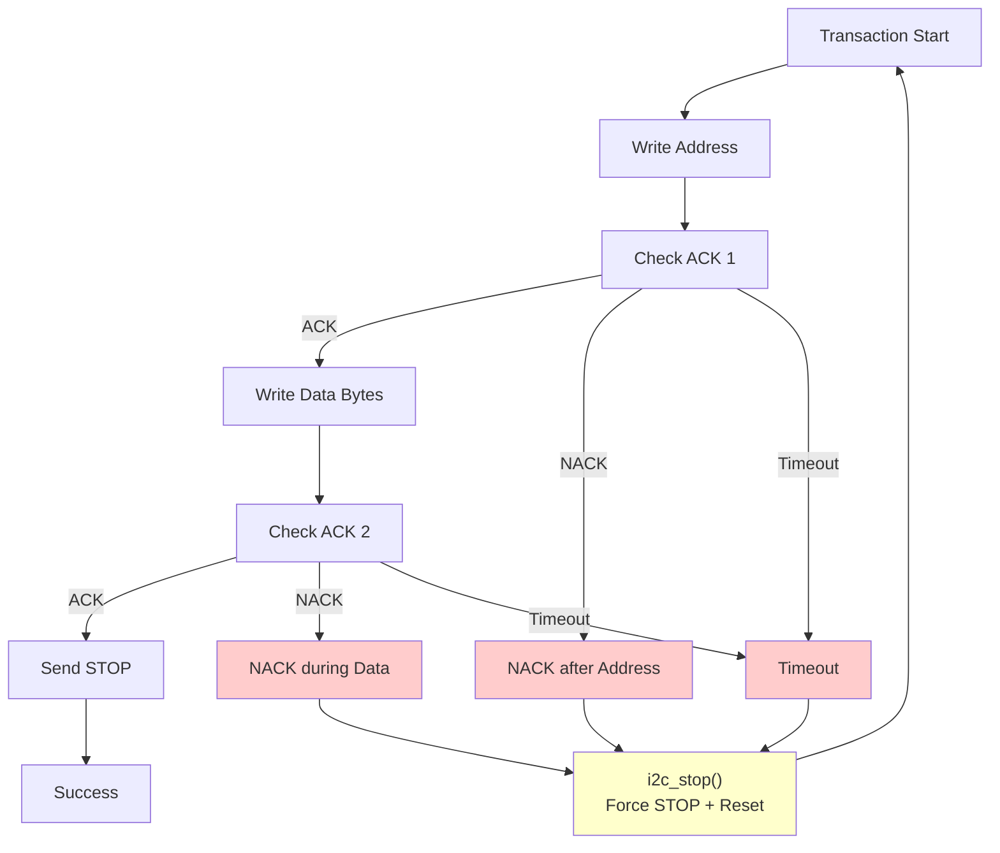

When errors occur, the state is set to `cpp::fail(error_t::connection_lost)` and subsequent operations return this error until `endTransaction()` performs recovery.

**Sources:** [src/lgfx/v1/platforms/esp32/common.cpp:1215-1216](), [src/lgfx/v1/platforms/esp32/common.cpp:1222-1253]()

---

## Multi-Threading and Locking

### Mutex-Based Synchronization

Each I2C port has a FreeRTOS semaphore for thread-safe access:

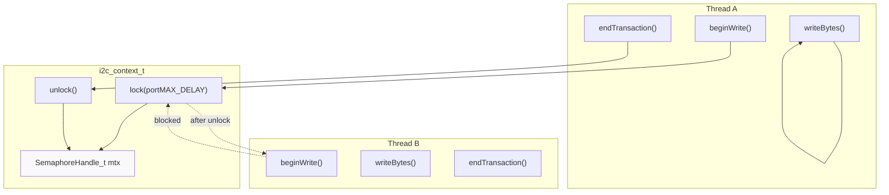

**Lock Methods** [common.cpp:983-992]():

```cpp
void lock(uint32_t msec = portMAX_DELAY) {
    if (mtx == nullptr) {
        mtx = xSemaphoreCreateMutex();
    }
    xSemaphoreTake(mtx, msec);
}

void unlock(void) {
    xSemaphoreGive(mtx);
}
```

**Lock Acquisition Points:**
- Locked during `beginWrite()` / `beginRead()`
- Unlocked during `endTransaction()` or on error
- Timeout parameter allows non-blocking acquisition

**Sources:** [src/lgfx/v1/platforms/esp32/common.cpp:981-992]()

### Register Backup and Restoration

The `i2c_context_t` includes register backup functionality to support temporary pin switching:

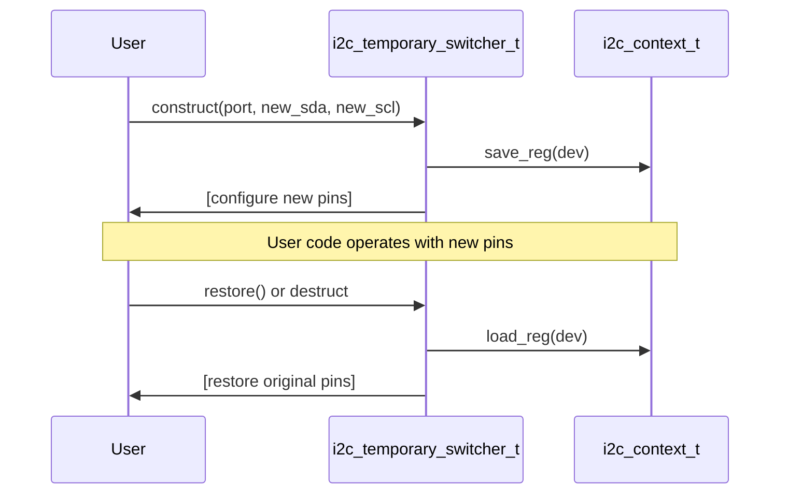

**`save_reg()` / `load_reg()`** [common.cpp:1000-1029]():

These methods backup and restore all I2C peripheral registers except the FIFO data register, enabling temporary configuration changes without losing the original setup. This is used by `i2c_temporary_switcher_t` for temporary device access.

**Sources:** [src/lgfx/v1/platforms/esp32/common.cpp:1000-1029](), [src/lgfx/v1/platforms/esp32/common.hpp:328-340]()

---

## Framework Integration Patterns

### Conditional Compilation Strategy

The implementation uses extensive conditional compilation to support multiple frameworks:

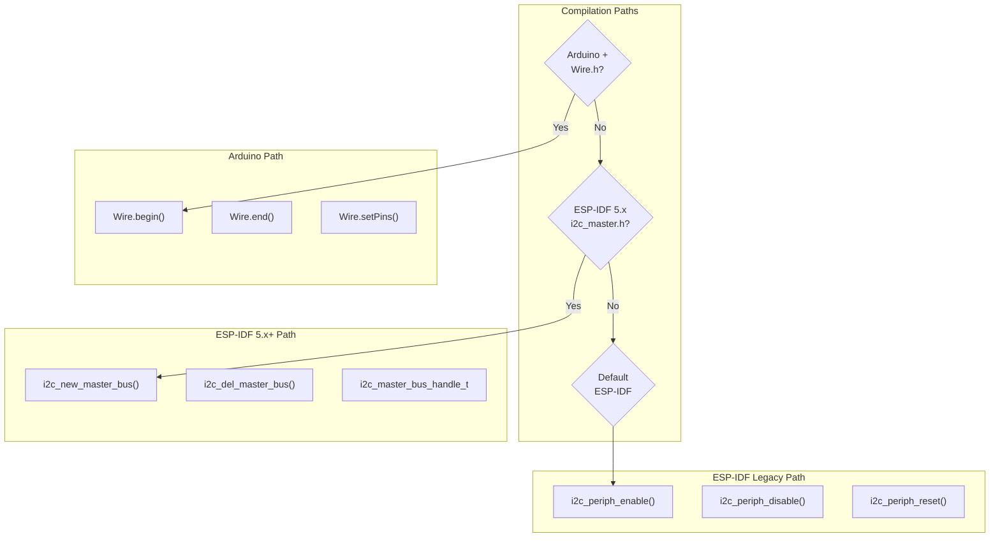

**Key Compilation Guards:**

| Guard | Purpose |
|-------|---------|
| `#if defined(ARDUINO) && __has_include(<Wire.h>)` | Arduino framework support |
| `#if __has_include(<driver/i2c_master.h>)` | ESP-IDF 5.x new I2C driver |
| `#if defined(I2C_CLOCK_SRC_ATOMIC)` | ESP-IDF 5.3+ peripheral control macros |

**Sources:** [src/lgfx/v1/platforms/esp32/common.cpp:1035-1057](), [src/lgfx/v1/platforms/esp32/common.cpp:1372-1399](), [src/lgfx/v1/platforms/esp32/common.cpp:869-927]()

### Pin Configuration Integration

Different frameworks require different approaches to pin configuration:

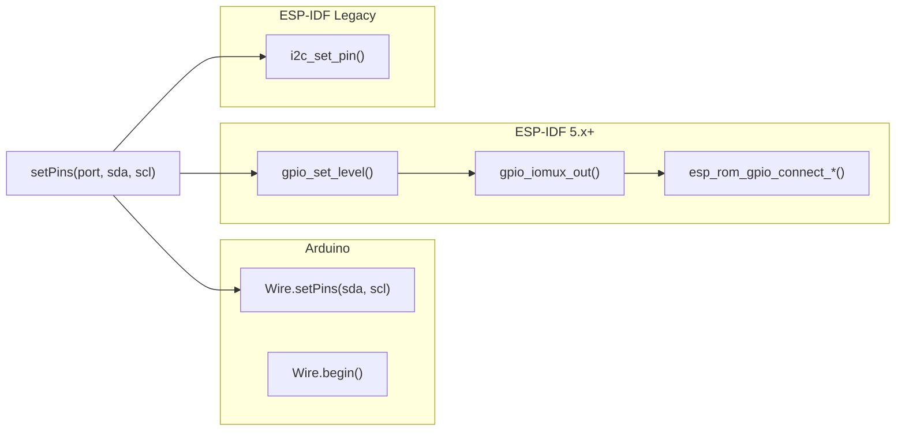

**Arduino Integration** [common.cpp:1035-1057]():
- Uses `Wire.setPins()` if available (ESP-IDF 4.x+)
- Falls back to `Wire.begin(sda, scl)` on older versions
- Distinguishes between `Wire` (I2C port 0) and `Wire1` (I2C port 1)

**ESP-IDF 5.x+ Integration** [common.cpp:1071-1087]():
- Direct GPIO matrix configuration via `esp_rom_gpio_connect_out_signal()` and `esp_rom_gpio_connect_in_signal()`
- Sets pull-up mode and open-drain configuration manually
- Uses `i2c_periph_signal` lookup table for signal routing

**ESP-IDF Legacy Integration** [common.cpp:1089]():
- Uses `i2c_set_pin()` convenience function
- Automatically configures pull-ups and master mode

**Sources:** [src/lgfx/v1/platforms/esp32/common.cpp:1069-1091](), [src/lgfx/v1/platforms/esp32/common.cpp:1035-1057]()

---

## Usage Patterns

### Basic I2C Transaction

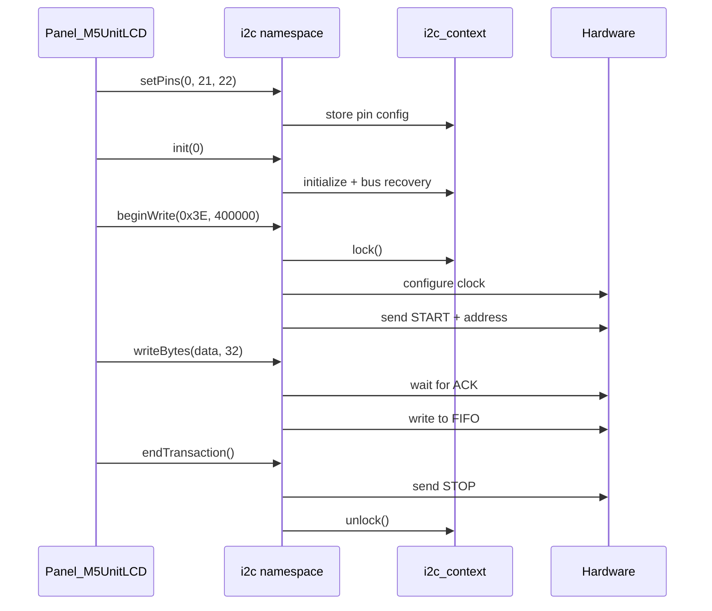

**Typical Usage in Panel Drivers:**

Panel drivers that use I2C (e.g., `Panel_M5UnitLCD`, `Panel_SH110x`) follow this pattern:
1. Call `i2c::init()` during initialization
2. Begin write transaction with device address and frequency
3. Write command/data bytes
4. End transaction to release the bus

**Sources:** Referenced implementation patterns from panel drivers

---

## Performance Characteristics

### Timing Constraints

The I2C implementation enforces timing based on clock divider and FIFO depth:

| Parameter | Typical Value | Notes |
|-----------|---------------|-------|
| **Bus Speed** | 100kHz - 400kHz | Configurable per transaction |
| **ACK Timeout** | Dynamic | Calculated from SCL period and FIFO count |
| **Initial ACK Timeout** | `us_limit + 512` μs | After address byte |
| **Data ACK Timeout** | `us_limit + 1024` μs | During data transmission |
| **Clock Period Calculation** | `scl_high_period + scl_low_period + 16` | Hardware-specific |

**Timeout Scaling** [common.cpp:1189-1195]():
```cpp
uint32_t us_limit = (scl_period) * (1 + tx_fifo_cnt);
us_limit += 512 << wait_ack_stage;  // 512μs after address, 1024μs during data
```

**Sources:** [src/lgfx/v1/platforms/esp32/common.cpp:1189-1195]()

### FIFO Management

ESP32's I2C FIFO is 32 bytes deep. The implementation monitors FIFO count to determine when to wait:

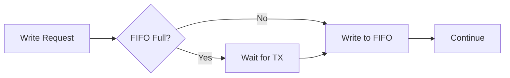

The `getRxFifoCount()` function [common.cpp:1093-1102]() provides platform-independent FIFO level access, abstracting register name differences across chip variants.

**Sources:** [src/lgfx/v1/platforms/esp32/common.cpp:1093-1102](), [src/lgfx/v1/platforms/esp32/common.cpp:1189]()