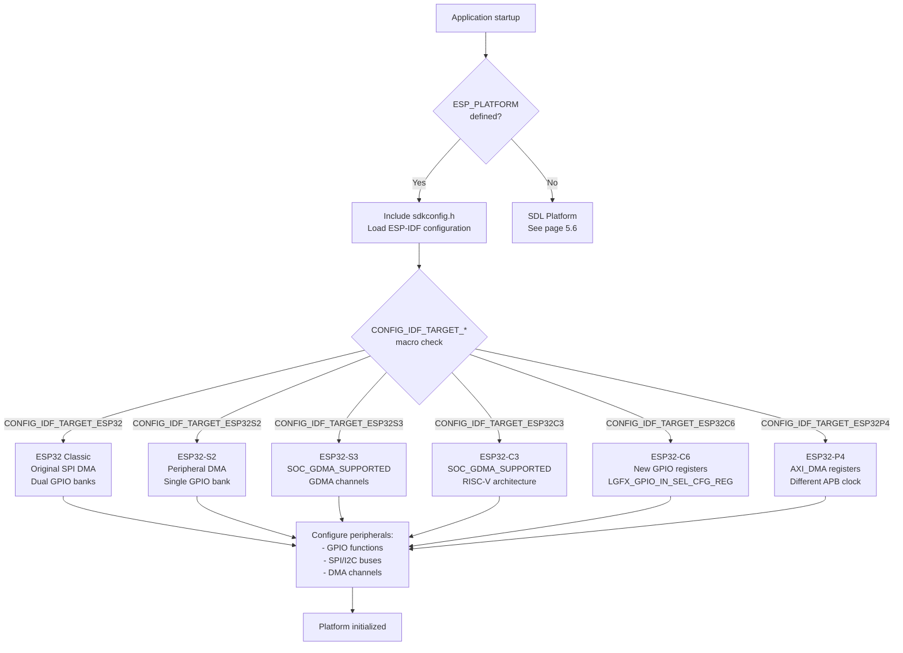
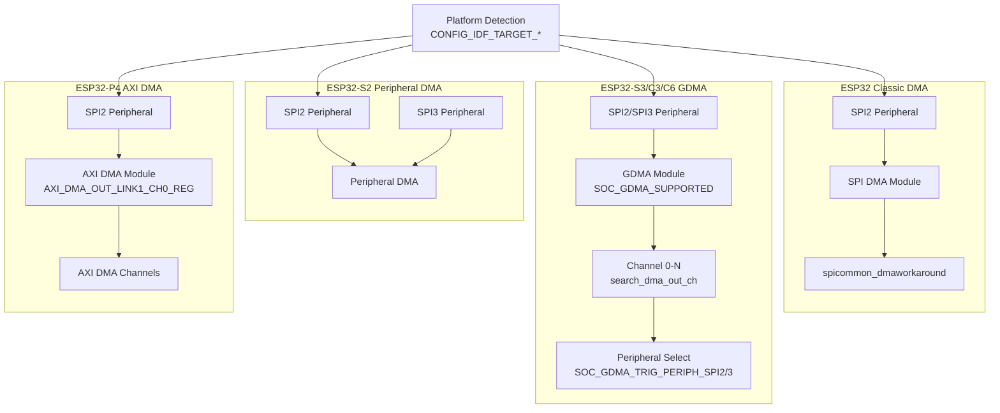
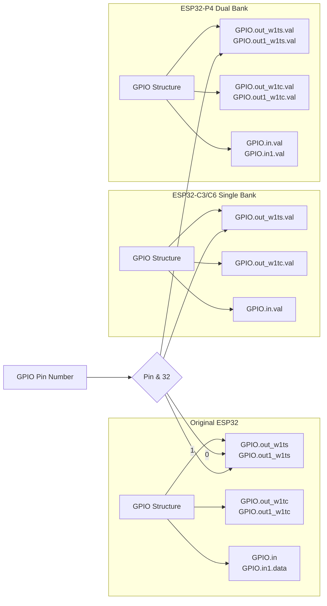
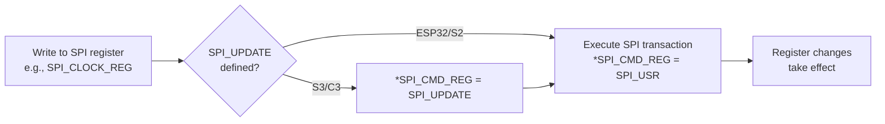
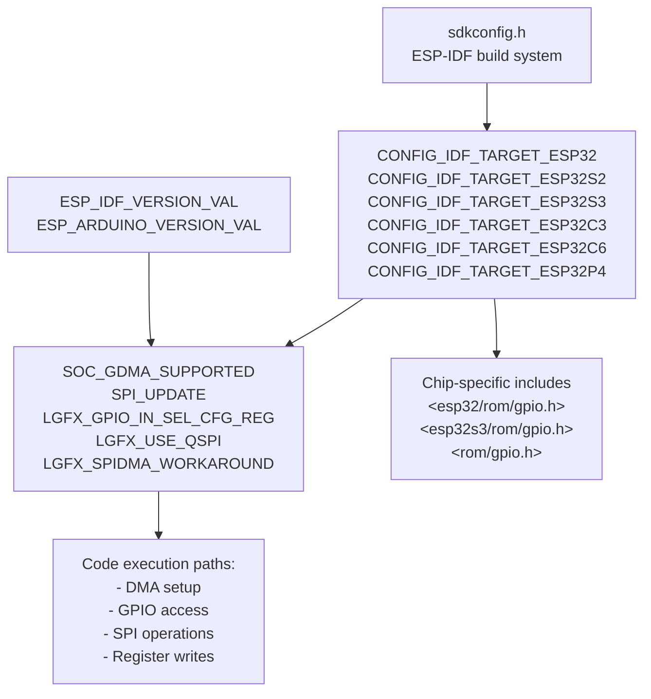
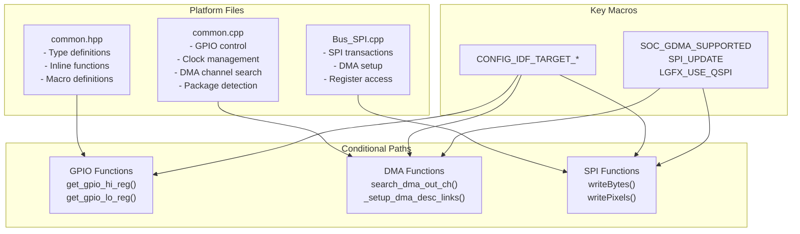

M5GFX ESP32 Platform Overview

# ESP32 Platform Overview

<details>
<summary>Relevant source files</summary>

The following files were used as context for generating this wiki page:

- [src/lgfx/v1/platforms/esp32/Bus_SPI.cpp](src/lgfx/v1/platforms/esp32/Bus_SPI.cpp)
- [src/lgfx/v1/platforms/esp32/Bus_SPI.hpp](src/lgfx/v1/platforms/esp32/Bus_SPI.hpp)
- [src/lgfx/v1/platforms/esp32/common.cpp](src/lgfx/v1/platforms/esp32/common.cpp)
- [src/lgfx/v1/platforms/esp32/common.hpp](src/lgfx/v1/platforms/esp32/common.hpp)

</details>


## Purpose and Scope

This page provides an overview of M5GFX's support for the ESP32 family of microcontrollers, covering the architectural differences between chip variants and how the library adapts to each platform through conditional compilation. This document focuses on platform-level abstractions and chip variant differences.

For detailed implementation of specific subsystems, see:
- GPIO control and timing functions: [5.2](#5.2)
- SPI bus implementation: [5.3](#5.3)
- I2C bus implementation: [5.4](#5.4)
- DMA and memory management: [5.5](#5.5)

## Supported ESP32 Chip Variants

M5GFX supports six ESP32 chip families, each with distinct peripheral architectures that require platform-specific code paths:

| Chip Variant | CPU Architecture | DMA System | GPIO Ports | QSPI Support | Key Platform Macro |
|--------------|-----------------|------------|------------|--------------|-------------------|
| ESP32 | Xtensa LX6 Dual-Core | SPI DMA | 2 banks (32+8) | Limited | `CONFIG_IDF_TARGET_ESP32` |
| ESP32-S2 | Xtensa LX7 Single-Core | Peripheral DMA | 1 bank (46 pins) | Yes | `CONFIG_IDF_TARGET_ESP32S2` |
| ESP32-S3 | Xtensa LX7 Dual-Core | GDMA | 2 banks (45+4) | Yes | `CONFIG_IDF_TARGET_ESP32S3` |
| ESP32-C3 | RISC-V Single-Core | GDMA | 1 bank (22 pins) | Yes | `CONFIG_IDF_TARGET_ESP32C3` |
| ESP32-C6 | RISC-V Single-Core | GDMA | 1 bank (31 pins) | Yes | `CONFIG_IDF_TARGET_ESP32C6` |
| ESP32-P4 | RISC-V Dual-Core | AXI DMA | 2 banks (55 pins) | No (in progress) | `CONFIG_IDF_TARGET_ESP32P4` |

Sources: [src/lgfx/v1/platforms/esp32/common.cpp:18-199](), [src/lgfx/v1/platforms/esp32/common.hpp:57-80]()

## Platform Detection and Initialization



The platform initialization begins with the `ESP_PLATFORM` macro check at [src/lgfx/v1/platforms/esp32/common.cpp:18](), which gates all ESP32-specific code. The ESP-IDF SDK configuration is loaded via `sdkconfig.h`, which provides `CONFIG_IDF_TARGET_*` macros that identify the specific chip variant.

Sources: [src/lgfx/v1/platforms/esp32/common.cpp:18-20]()

## DMA Architecture Differences

Different ESP32 variants use fundamentally different DMA systems, requiring separate code paths:



### DMA Channel Detection

The library must dynamically discover which DMA channel is assigned to a given SPI peripheral. For GDMA-based systems (S3/C3/C6), the `search_dma_out_ch()` function scans peripheral selection registers:

[src/lgfx/v1/platforms/esp32/common.cpp:270-294]() implements channel detection by reading `GDMA_OUT_PERI_SEL_CH0_REG` registers and comparing against the target peripheral identifier (`SOC_GDMA_TRIG_PERIPH_SPI2` or `SOC_GDMA_TRIG_PERIPH_SPI3`).

For ESP32-P4, the function handles renamed AXI DMA registers through macro aliases at [src/lgfx/v1/platforms/esp32/common.cpp:142-152]().

Sources: [src/lgfx/v1/platforms/esp32/common.cpp:270-320](), [src/lgfx/v1/platforms/esp32/Bus_SPI.cpp:65-96]()

## GPIO Register Architecture

GPIO register layouts vary significantly across ESP32 variants:



The helper functions `get_gpio_hi_reg()`, `get_gpio_lo_reg()`, and `gpio_in()` abstract these differences:

[src/lgfx/v1/platforms/esp32/common.hpp:142-158]() provides three implementations:
- **ESP32-P4**: Uses `.val` accessors and checks bit 32 for bank selection
- **ESP32-C3/C6**: Single bank with `.val` accessors
- **ESP32/S2/S3**: Dual bank without `.val` accessors

For GPIO input signal routing, ESP32-C6 and P4 use a different register structure requiring the `LGFX_GPIO_IN_SEL_CFG_REG` macro at [src/lgfx/v1/platforms/esp32/common.cpp:161-163]().

Sources: [src/lgfx/v1/platforms/esp32/common.hpp:142-158](), [src/lgfx/v1/platforms/esp32/common.cpp:161-163](), [src/lgfx/v1/platforms/esp32/common.cpp:178-186]()

## SPI Register Differences

### SPI_UPDATE Requirement

ESP32-S3 and C3 require explicit register update commands due to register buffering:



The `SPI_UPDATE` macro gates this behavior at [src/lgfx/v1/platforms/esp32/Bus_SPI.cpp:67-73](), where `SPI_EXECUTE` is defined as either `SPI_USR | SPI_UPDATE` (for S3/C3) or just `SPI_USR` (for other variants).

This affects register writes throughout the SPI implementation, requiring update commands after modifying:
- Clock divider: [src/lgfx/v1/platforms/esp32/Bus_SPI.cpp:285-287]()
- User mode register: [src/lgfx/v1/platforms/esp32/Bus_SPI.cpp:975-977]()
- Pin configuration: [src/lgfx/v1/platforms/esp32/Bus_SPI.cpp:954-958]()

### MOSI_HIGHPART Limitation

ESP32 classic supports using the upper 32 bytes of the SPI buffer via `SPI_USR_MOSI_HIGHPART`, enabling ping-pong buffering for improved throughput. ESP32-S3 and C3 lack this feature, requiring different buffer management:

[src/lgfx/v1/platforms/esp32/Bus_SPI.cpp:548-627]() shows the conditional implementation where `#if defined ( SPI_UPDATE )` branches to simpler sequential buffer usage.

Sources: [src/lgfx/v1/platforms/esp32/Bus_SPI.cpp:67-73](), [src/lgfx/v1/platforms/esp32/Bus_SPI.cpp:548-627](), [src/lgfx/v1/platforms/esp32/Bus_SPI.cpp:739-820]()

## APB Clock and Frequency Management

The Advanced Peripheral Bus (APB) clock frequency varies by chip and affects peripheral timing calculations:

[src/lgfx/v1/platforms/esp32/common.cpp:188-200]() implements `getApbFrequency()` which:
- Reads current CPU frequency configuration via `rtc_clk_cpu_freq_get_config()`
- Returns 80 MHz for configurations ≥ 80 MHz (most common)
- For ESP32-P4, calculates based on source frequency and integer divider
- For other chips, uses fractional divider

This frequency is used to calculate SPI clock dividers at [src/lgfx/v1/platforms/esp32/common.cpp:202-209]() via `FreqToClockDiv()`, and I2C timing parameters via `calcClockDiv()` at [src/lgfx/v1/platforms/esp32/common.cpp:211-251]().

Sources: [src/lgfx/v1/platforms/esp32/common.cpp:188-251]()

## Conditional Compilation Patterns

The codebase uses several layers of conditional compilation to handle platform differences:



### Macro Hierarchy

1. **Primary Platform Detection**: `ESP_PLATFORM` at [src/lgfx/v1/platforms/esp32/common.cpp:18]()
2. **Chip Variant Selection**: `CONFIG_IDF_TARGET_*` macros from sdkconfig.h
3. **Feature Detection**: Derived macros like `SOC_GDMA_SUPPORTED` at [src/lgfx/v1/platforms/esp32/Bus_SPI.cpp:65]()
4. **Library-Specific Flags**: Custom macros like `LGFX_SPIDMA_WORKAROUND` at [src/lgfx/v1/platforms/esp32/Bus_SPI.cpp:23-25]()

### Include Path Management

Header includes adapt to chip variant using cascading `__has_include` checks:

[src/lgfx/v1/platforms/esp32/Bus_SPI.cpp:49-59]() demonstrates the pattern:
```cpp
#if defined ESP_IDF_VERSION_MAJOR && ESP_IDF_VERSION_MAJOR >= 5
    #include <rom/gpio.h>  // IDF v5+
#elif defined ( CONFIG_IDF_TARGET_ESP32S3 ) && __has_include (<esp32s3/rom/gpio.h>)
    #include <esp32s3/rom/gpio.h>
#elif defined ( CONFIG_IDF_TARGET_ESP32S2 ) && __has_include (<esp32s2/rom/gpio.h>)
    #include <esp32s2/rom/gpio.h>
// ... additional variants
#endif
```

Sources: [src/lgfx/v1/platforms/esp32/common.cpp:18-124](), [src/lgfx/v1/platforms/esp32/Bus_SPI.cpp:23-96](), [src/lgfx/v1/platforms/esp32/common.hpp:69-80]()

## Package Version Detection

The `get_pkg_ver()` function reads chip package information from eFuse registers to distinguish between package variants (PICO, WROOM, WROVER, etc.):

[src/lgfx/v1/platforms/esp32/common.cpp:253-268]() implements two paths:
- **Modern IDF (≥3.4.0)**: Uses `esp_efuse_get_pkg_ver()` API
- **Legacy IDF**: Directly reads `EFUSE_BLK0_RDATA3_REG` and handles ESP32PICOV302 detection via `APB_CTRL_DATE_REG`

This information is used during M5GFX hardware autodetection to distinguish between M5Stack device variants with the same display controller but different package types.

Sources: [src/lgfx/v1/platforms/esp32/common.cpp:94-124](), [src/lgfx/v1/platforms/esp32/common.cpp:253-268]()

## QSPI Support Status

Quad SPI support varies across chip families:

| Chip | QSPI Status | Macro |
|------|-------------|-------|
| ESP32 | Limited | Manual configuration |
| ESP32-S2 | Yes | `LGFX_USE_QSPI` |
| ESP32-S3 | Yes | `LGFX_USE_QSPI` |
| ESP32-C3 | Yes | `LGFX_USE_QSPI` |
| ESP32-C6 | Yes | `LGFX_USE_QSPI` |
| ESP32-P4 | No (in progress) | Disabled |

The `LGFX_USE_QSPI` macro is defined at [src/lgfx/v1/platforms/esp32/common.hpp:74-78]() for IDF ≥4.4.0, excluding ESP32-P4 where QSPI support is still being implemented.

Sources: [src/lgfx/v1/platforms/esp32/common.hpp:74-78](), [src/lgfx/v1/platforms/esp32/Bus_SPI.hpp:84-87]()

## Platform-Specific Workarounds

### ESP32 DMA Workaround

Original ESP32 requires idle state management before SPI transactions due to silicon errata. The workaround is gated by `LGFX_SPIDMA_WORKAROUND`:

[src/lgfx/v1/platforms/esp32/Bus_SPI.cpp:293-295]() calls `spicommon_dmaworkaround_idle()` before releasing the bus, and [src/lgfx/v1/platforms/esp32/Bus_SPI.cpp:712-714]() calls `spicommon_dmaworkaround_transfer_active()` when starting DMA.

### I2C Register Reset Differences

ESP32-C3 exhibits bus failure after calling `periph_module_reset()`, requiring special handling at [src/lgfx/v1/platforms/esp32/common.cpp:1173-1176]() where the reset is skipped for C3 during I2C stop sequence.

### Memory Access Patterns

ESP32-P4 requires special handling for peripheral register writes as `memcpy()` to peripheral memory doesn't work reliably. [src/lgfx/v1/platforms/esp32/Bus_SPI.cpp:649-656]() shows a loop-based copy for P4 instead of `memcpy()`.

Sources: [src/lgfx/v1/platforms/esp32/Bus_SPI.cpp:23-25](), [src/lgfx/v1/platforms/esp32/Bus_SPI.cpp:293-295](), [src/lgfx/v1/platforms/esp32/Bus_SPI.cpp:649-656](), [src/lgfx/v1/platforms/esp32/common.cpp:1173-1176]()

## Summary of Platform-Specific Code Locations



**Primary Implementation Files:**
- [src/lgfx/v1/platforms/esp32/common.cpp]() - Core platform functions
- [src/lgfx/v1/platforms/esp32/common.hpp]() - Platform abstractions and macros
- [src/lgfx/v1/platforms/esp32/Bus_SPI.cpp]() - SPI bus with platform-specific DMA handling

**Related Documentation:**
- Detailed GPIO implementation: [5.2](#5.2)
- SPI bus deep-dive: [5.3](#5.3)
- I2C implementation: [5.4](#5.4)
- DMA memory management: [5.5](#5.5)

Sources: [src/lgfx/v1/platforms/esp32/common.cpp:1-2431](), [src/lgfx/v1/platforms/esp32/common.hpp:1-346](), [src/lgfx/v1/platforms/esp32/Bus_SPI.cpp:1-1209]()