M5GFX Font Rendering System

# Font Rendering System

<details>
<summary>Relevant source files</summary>

The following files were used as context for generating this wiki page:

- [src/lgfx/v1/LGFXBase.cpp](src/lgfx/v1/LGFXBase.cpp)
- [src/lgfx/v1/LGFXBase.hpp](src/lgfx/v1/LGFXBase.hpp)
- [src/lgfx/v1/lgfx_fonts.cpp](src/lgfx/v1/lgfx_fonts.cpp)
- [src/lgfx/v1/lgfx_fonts.hpp](src/lgfx/v1/lgfx_fonts.hpp)
- [src/lgfx/v1/misc/colortype.hpp](src/lgfx/v1/misc/colortype.hpp)
- [src/lgfx/v1/panel/Panel_EPDiy.cpp](src/lgfx/v1/panel/Panel_EPDiy.cpp)
- [src/lgfx/v1/panel/Panel_EPDiy.hpp](src/lgfx/v1/panel/Panel_EPDiy.hpp)
- [src/lgfx/v1/panel/Panel_GC9A01.hpp](src/lgfx/v1/panel/Panel_GC9A01.hpp)
- [src/lgfx/v1/panel/Panel_LCD.cpp](src/lgfx/v1/panel/Panel_LCD.cpp)
- [src/lgfx/v1/panel/Panel_LCD.hpp](src/lgfx/v1/panel/Panel_LCD.hpp)

</details>


## Purpose and Scope

The font rendering system provides a unified interface for displaying text across multiple font formats and character encodings. It handles glyph rasterization, UTF-8 decoding, font metrics calculation, and style application (size scaling, color, spacing). This system supports nine distinct font formats ranging from simple bitmaps to runtime-loadable vector fonts.

For information about text drawing functions in the high-level API, see [LGFXBase Graphics Operations](#3.1). For color conversion during text rendering, see [Color Types and Conversion](#3.2).

---

## Font System Architecture

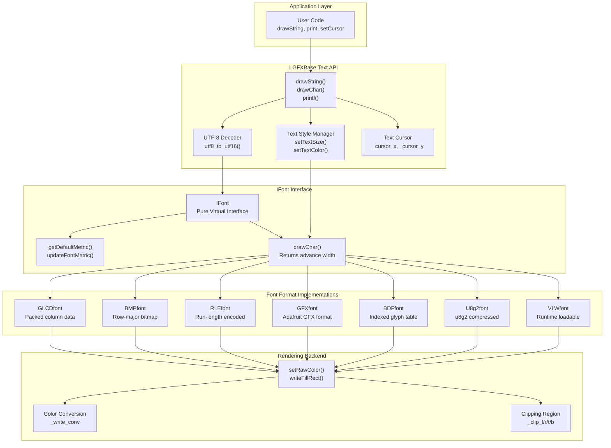

**Sources:** [src/lgfx/v1/lgfx_fonts.hpp:1-260](), [src/lgfx/v1/lgfx_fonts.cpp:1-1000](), [src/lgfx/v1/LGFXBase.hpp:1-800]()

---

## IFont Interface

The `IFont` class defines the contract that all font implementations must fulfill. It provides methods for querying font metrics and rendering individual characters.

### Core Virtual Methods

| Method | Purpose | Return Value |
|--------|---------|--------------|
| `getType()` | Returns font format identifier | `font_type_t` enum |
| `getDefaultMetric()` | Retrieves default font dimensions | Populates `FontMetrics*` |
| `updateFontMetric()` | Gets metrics for specific character | `bool` (true if glyph exists) |
| `drawChar()` | Renders single character | `size_t` (pixel width rendered) |
| `unloadFont()` | Releases font resources | `bool` (true if unloaded) |

### Font Type Enumeration

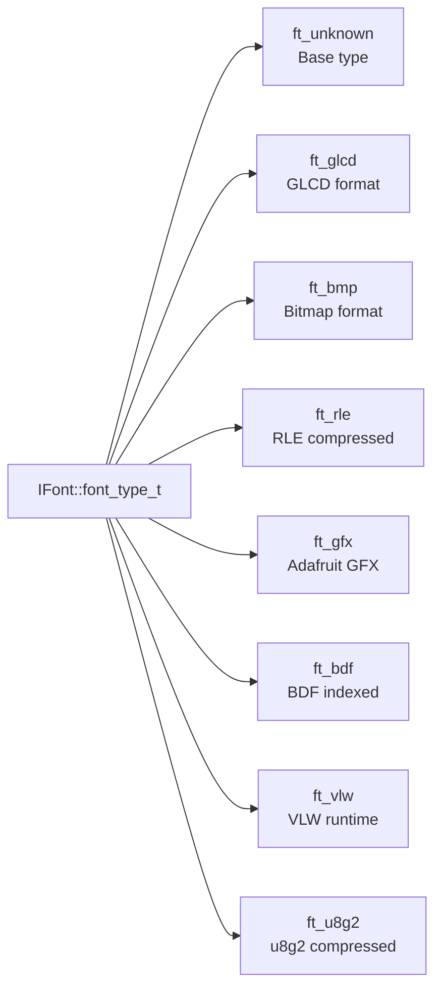

**Sources:** [src/lgfx/v1/lgfx_fonts.hpp:19-41]()

---

## Font Types and Data Structures

### BaseFont Family

`BaseFont` provides common data members for fonts with pre-compiled glyph tables stored in program memory.

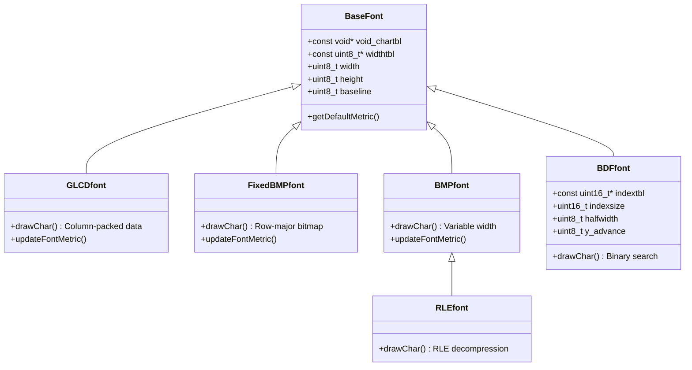

**Data Access Pattern:**
- **GLCDfont**: `chartbl + (charcode * datawidth)` → Column-packed bytes [src/lgfx/v1/lgfx_fonts.cpp:77-141]()
- **FixedBMPfont**: `chartbl + (charcode * ((width+7)>>3) * height)` → Row-major bitmap [src/lgfx/v1/lgfx_fonts.cpp:223-239]()
- **BMPfont**: `((const uint8_t**)chartbl)[charcode]` → Pointer array to bitmaps [src/lgfx/v1/lgfx_fonts.cpp:241-250]()
- **RLEfont**: Same as BMPfont but with RLE decoding [src/lgfx/v1/lgfx_fonts.cpp:265-323]()
- **BDFfont**: Binary search in `indextbl`, index into `chartbl` [src/lgfx/v1/lgfx_fonts.cpp:252-263]()

**Sources:** [src/lgfx/v1/lgfx_fonts.hpp:43-118](), [src/lgfx/v1/lgfx_fonts.cpp:56-263]()

### GFXfont (Adafruit Format)

The `GFXfont` structure supports Adafruit GFX library fonts with custom Unicode ranges.

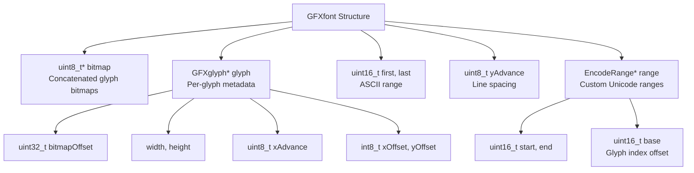

**Glyph Lookup Algorithm:**
1. Check if `uniCode` is within `[first, last]` range
2. If `range_num == 0`: Direct index = `uniCode - first`
3. If `range_num > 0`: Search `range[]` array for matching `[start, end]`, calculate index using `base` offset
4. Return `&glyph[index]`

**Sources:** [src/lgfx/v1/lgfx_fonts.hpp:126-173](), [src/lgfx/v1/lgfx_fonts.cpp:328-450]()

### U8g2font (u8g2 Format)

The `U8g2font` wraps u8g2 library fonts, reading compressed glyph data from a packed byte array.

**Header Structure (23 bytes):**
| Offset | Field | Description |
|--------|-------|-------------|
| 0 | glyph_cnt | Total glyphs in font |
| 1 | bbx_mode | Bounding box mode |
| 2-8 | bits_per_* | Bit widths for encoding fields |
| 9-10 | max_char_width/height | Maximum glyph dimensions |
| 11-12 | x_offset, y_offset | Global offsets |
| 13-14 | ascent_A, descent_g | Baseline metrics |
| 15-16 | ascent_para, descent_para | Paragraph metrics |
| 17-22 | start_pos_* | Offsets to glyph sections |

**Sources:** [src/lgfx/v1/lgfx_fonts.hpp:177-212](), [src/lgfx/v1/lgfx_fonts.cpp:452-740]()

### VLWfont (Runtime Loadable)

`VLWfont` extends `RunTimeFont` and loads font metrics from `DataWrapper` at runtime.

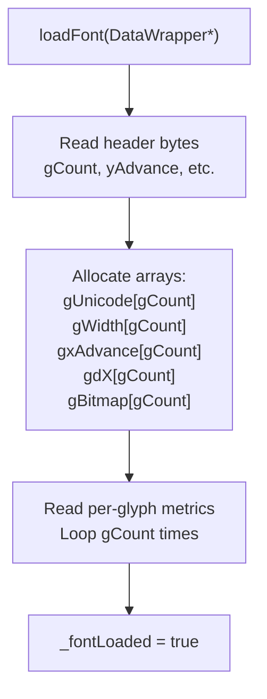

**Drawing Process:**
1. Binary search `gUnicode[]` for character code
2. Read glyph bitmap from `DataWrapper` at `gBitmap[index]` file position
3. Render 8-bit grayscale bitmap with alpha blending

**Sources:** [src/lgfx/v1/lgfx_fonts.hpp:216-259](), [src/lgfx/v1/lgfx_fonts.cpp:742-1000]()

---

## Font Metrics System

The `FontMetrics` structure captures dimensional information for font rendering and layout.

### FontMetrics Structure

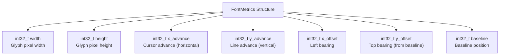

**Key Metrics:**
- **baseline**: Distance from top to baseline (positive = down)
- **y_offset**: Vertical offset from cursor position to top of glyph (can be negative for descenders)
- **x_offset**: Horizontal offset from cursor to left edge of glyph (can be negative for overhang)
- **x_advance**: Horizontal distance to move cursor after drawing
- **y_advance**: Vertical distance to move cursor for next line

**Default Metric Calculation:**
- `BaseFont::getDefaultMetric()`: Uses fixed `width`, `height`, `baseline` [src/lgfx/v1/lgfx_fonts.cpp:56-65]()
- `BDFfont::getDefaultMetric()`: Adds `y_advance` field [src/lgfx/v1/lgfx_fonts.cpp:66-70]()
- `GFXfont::getDefaultMetric()`: Calculates from glyph bounding boxes [src/lgfx/v1/lgfx_fonts.cpp:368-399]()

**Sources:** [src/lgfx/v1/lgfx_fonts.cpp:36-70](), [src/lgfx/v1/lgfx_fonts.cpp:328-399]()

---

## Character Rendering Pipeline

### drawChar Method Signature

```cpp
size_t drawChar(LGFXBase* gfx, int32_t x, int32_t y, uint16_t c, 
                const TextStyle* style, FontMetrics* metrics, int32_t& filled_x) const
```

**Parameters:**
- `gfx`: Target drawing surface
- `x, y`: Cursor position (top-left or baseline depending on font type)
- `c`: Unicode character code (UTF-16)
- `style`: Text rendering style (colors, size multipliers)
- `metrics`: Pre-calculated font metrics for this character
- `filled_x`: Tracks rightmost filled background pixel (for clearing gaps)

**Return Value:** Pixel width actually rendered

### Common Rendering Pattern

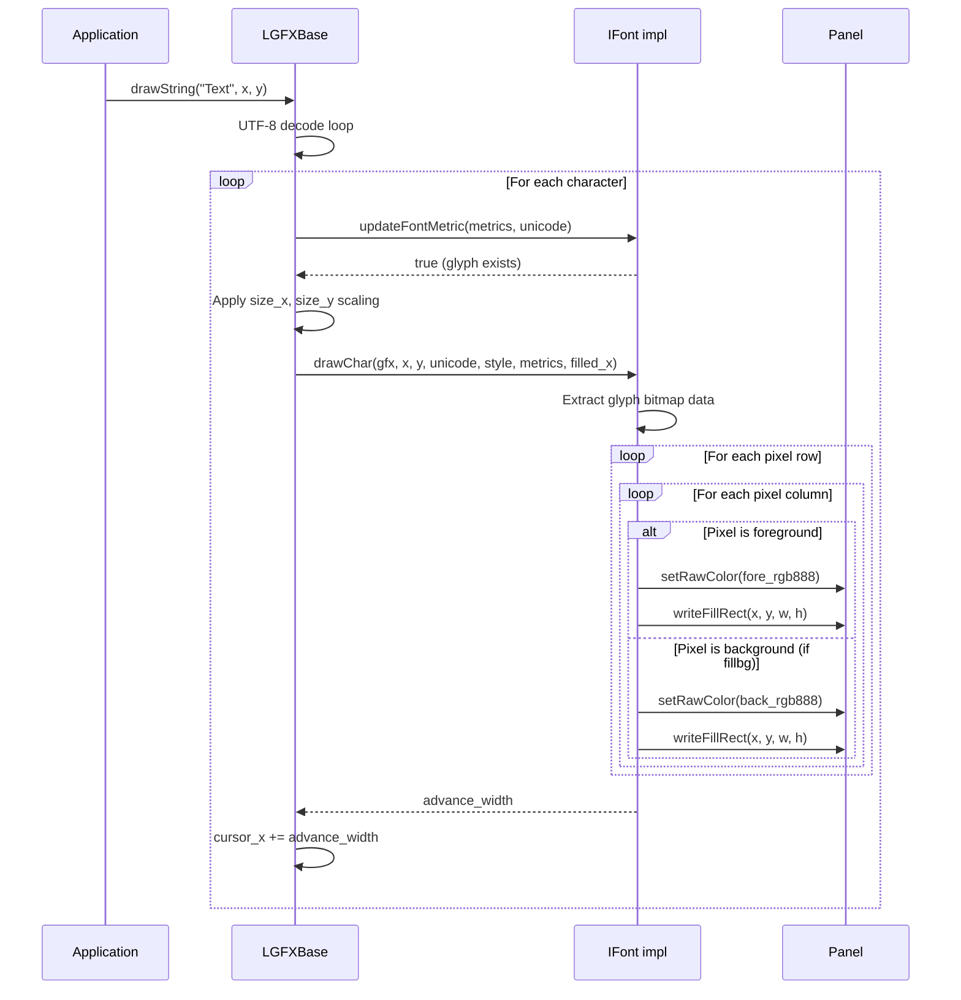

**Sources:** [src/lgfx/v1/lgfx_fonts.cpp:77-323]()

### Size Scaling Implementation

All font rendering applies fixed-point scaling using `TextStyle::size_x` and `TextStyle::size_y`:

```cpp
int32_t sx = 65536 * style->size_x;  // 16.16 fixed-point
int32_t sy = 65536 * style->size_y;

// For each original pixel coordinate i:
int32_t scaled_position = (i * sx) >> 16;
```

This allows sub-pixel precision without floating-point math. Each font's `drawChar()` implementation uses this pattern to scale glyph dimensions and positions.

**Sources:** [src/lgfx/v1/lgfx_fonts.cpp:38-41](), [src/lgfx/v1/lgfx_fonts.cpp:101-130](), [src/lgfx/v1/lgfx_fonts.cpp:153-198]()

---

## Bitmap Font Rendering (draw_char_bmp)

The `draw_char_bmp()` helper function implements efficient row-major bitmap rendering for `FixedBMPfont`, `BMPfont`, and `BDFfont`.

### Rendering Algorithm

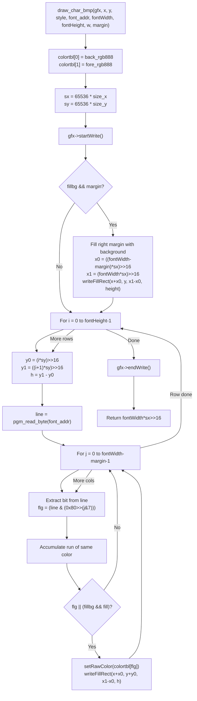

**Optimization: Run-Length Encoding**

The function accumulates consecutive pixels of the same color into a single `writeFillRect()` call:
- Scan horizontally within a row
- Track `x0` (run start) and `x1` (run end)
- When color changes or row ends, flush the accumulated rectangle

**Sources:** [src/lgfx/v1/lgfx_fonts.cpp:143-202]()

---

## RLE Font Decompression

`RLEfont` uses a custom run-length encoding with 7-bit length + 1-bit color flag.

### RLE Byte Format

```
Bit 7: Color flag (0=background, 1=foreground)
Bits 6-0: Run length (0-127, actual length is value+1)
```

### Decoding Algorithm

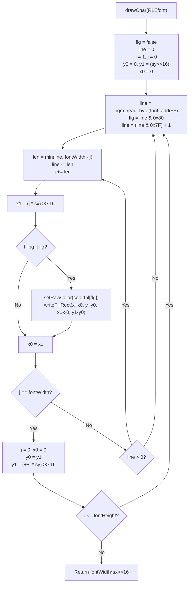

**Compression Efficiency:**
- Typical ASCII characters have large background runs (compression ratio 10-20:1)
- Worst case: Alternating pixels require one byte per pixel (expansion)
- Format stores foreground/background runs sequentially without explicit coordinates

**Sources:** [src/lgfx/v1/lgfx_fonts.cpp:265-323]()

---

## GFXfont Rendering with Baseline Alignment

GFXfont glyphs use baseline-relative positioning, unlike other formats that use top-left anchoring.

### Coordinate System Transformation

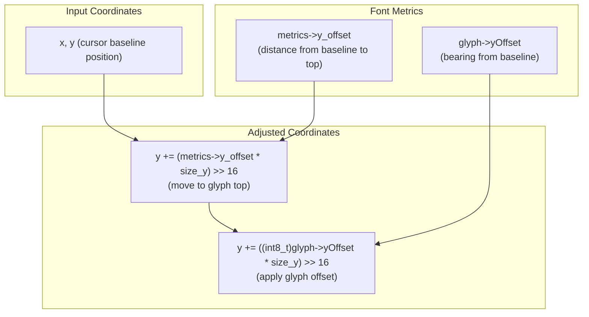

**Why Two Y-Offsets?**
1. `metrics->y_offset`: Global adjustment to convert baseline to top-of-font
2. `glyph->yOffset`: Per-character vertical bearing (e.g., 'p' descends below baseline, 'Á' has accent above)

**Background Fill Strategy:**

GFXfont can leave gaps between glyphs due to variable widths and bearings. The `filled_x` parameter tracks the rightmost background-filled pixel:

```cpp
if (fillbg) {
    left  = std::max<int>(filled_x, x + (xoffset < 0 ? xoffset : 0));
    right = x + std::max<int>((w * sx >> 16) + xoffset, xAdvance);
    filled_x = right;
    // Fill rectangle [left, right) with back_rgb888
}
```

**Sources:** [src/lgfx/v1/lgfx_fonts.cpp:401-450]()

---

## Text Style System

The `TextStyle` structure encapsulates all rendering parameters passed to `drawChar()`.

### TextStyle Members

| Member | Type | Purpose |
|--------|------|---------|
| `fore_rgb888` | `uint32_t` | Foreground color (RGB888) |
| `back_rgb888` | `uint32_t` | Background color (RGB888) |
| `size_x` | `float` | Horizontal scale factor |
| `size_y` | `float` | Vertical scale factor |
| `cp437` | `bool` | Enable CP437 charset (legacy IBM PC) |

**CP437 Mode:**

When `cp437 == true`, character codes 176-255 are displayed directly. When `false`, code 176+ is incremented by 1 to handle "classic" charset mapping (skip reserved code point).

**Example from GLCDfont:**
```cpp
if (!style->cp437 && (c >= 176)) {
    c++; // Handle 'classic' charset behavior
}
```

**Size Scaling:**

Size factors are converted to 16.16 fixed-point for integer arithmetic:
```cpp
const int32_t sx = 65536 * style->size_x;
const int32_t sy = 65536 * style->size_y;
```

**Color Conversion:**

Font implementations convert RGB888 colors to panel's native format:
```cpp
auto cc = gfx->getColorConverter();
uint32_t colortbl[2] = { 
    cc->convert(style->back_rgb888), 
    cc->convert(style->fore_rgb888) 
};
```

**Sources:** [src/lgfx/v1/lgfx_fonts.cpp:85-99](), [src/lgfx/v1/lgfx_fonts.cpp:145-154]()

---

## UTF-8 Decoding and Character Mapping

While the font rendering system operates on UTF-16 character codes, LGFXBase handles UTF-8 string decoding in higher-level text functions.

### UTF-8 to UTF-16 Conversion

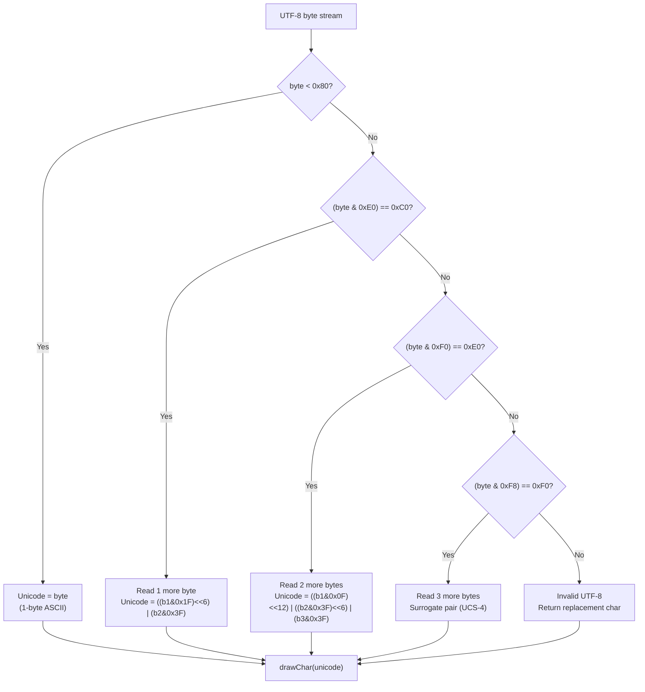

**Multibyte Font Support:**

BDFfont and VLWfont support full Unicode including CJK characters. GFXfont and U8g2font support custom Unicode ranges via `EncodeRange` tables.

**Glyph Fallback:**

When `updateFontMetric()` returns `false` (glyph not found), fonts typically:
1. Attempt to render space character (0x20)
2. If space unavailable, call `drawCharDummy()` which renders an empty rectangle outline

**Sources:** [src/lgfx/v1/lgfx_fonts.cpp:72-84](), [src/lgfx/v1/lgfx_fonts.cpp:328-346](), [src/lgfx/v1/lgfx_fonts.cpp:36-54]()

---

## Usage Patterns

### Selecting Fonts

Fonts are set via LGFXBase methods (not shown in provided files but referenced):

```cpp
// Built-in fonts (compile-time)
gfx.setFont(&fonts::Font4);            // RLE font
gfx.setFont(&fonts::FreeSans12pt7b);   // GFXfont

// Runtime-loaded fonts
VLWfont vlw;
vlw.loadFont(&dataWrapper);
gfx.setFont(&vlw);
```

### Drawing Text

Once a font is selected, text rendering uses standard methods:

```cpp
gfx.setTextSize(2.0f);                 // 2x scaling
gfx.setTextColor(TFT_WHITE, TFT_BLACK); // Foreground + background
gfx.drawString("Hello", 10, 20);       // x, y position
```

### Custom Font Implementation

To create a new font format:

1. **Inherit from `IFont`:**
```cpp
struct MyFont : public IFont {
    font_type_t getType() const override { return ft_unknown; }
    // Implement required virtual methods
};
```

2. **Implement `getDefaultMetric()`:**
   - Calculate overall font dimensions
   - Set baseline position

3. **Implement `updateFontMetric()`:**
   - Return `false` if glyph doesn't exist
   - Populate `width`, `height`, `x_advance`, `x_offset`

4. **Implement `drawChar()`:**
   - Extract glyph bitmap data
   - Apply size scaling using fixed-point math
   - Call `gfx->setRawColor()` and `gfx->writeFillRect()`
   - Return rendered width

**Sources:** [src/lgfx/v1/lgfx_fonts.hpp:19-41](), [src/lgfx/v1/lgfx_fonts.cpp:36-54]()

---

## Font Data Storage

### Compile-Time Fonts

All `BaseFont`-derived fonts store data in program memory (PROGMEM on AVR/ESP platforms):

- **Access via `pgm_read_byte()`**: [src/lgfx/v1/lgfx_fonts.cpp:81-110]()
- **Access via `pgm_read_word()`**: [src/lgfx/v1/lgfx_fonts.cpp:350-365]()
- **Declared as `const`**: [src/lgfx/v1/lgfx_fonts.hpp:46-49]()

### Runtime Fonts

`VLWfont` allocates metric arrays dynamically and reads bitmap data on-demand from `DataWrapper`:

```cpp
gUnicode  = (uint16_t*)alloca(gCount * sizeof(uint16_t));
gWidth    = (uint8_t*) alloca(gCount * sizeof(uint8_t));
// ... read from DataWrapper
```

Bitmap pixels are not cached—each `drawChar()` seeks to file position `gBitmap[index]` and reads the required bytes.

**Sources:** [src/lgfx/v1/lgfx_fonts.cpp:742-900]()