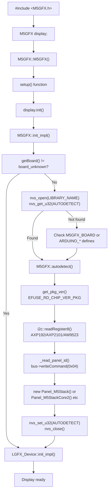
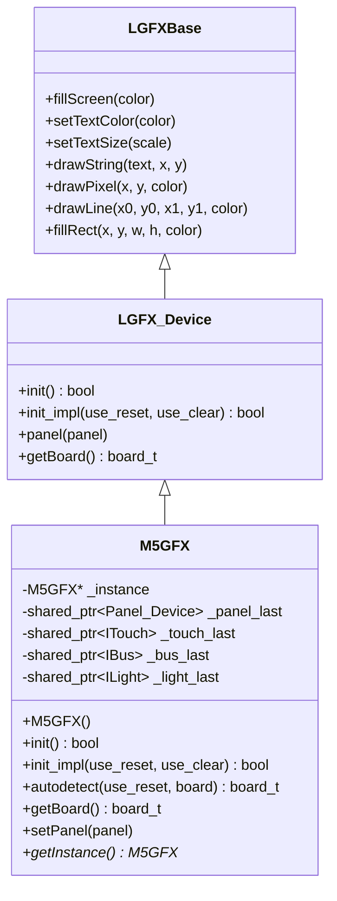
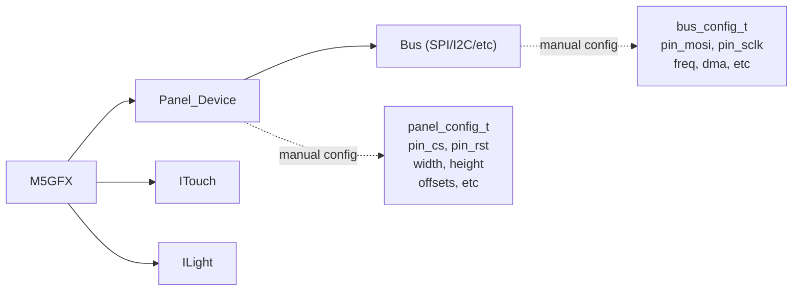
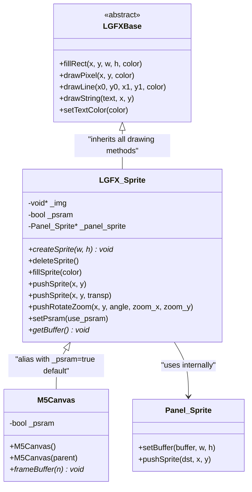
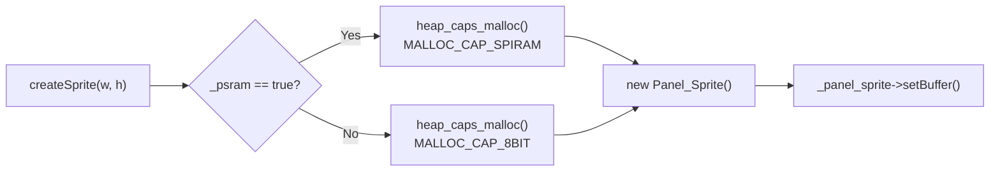
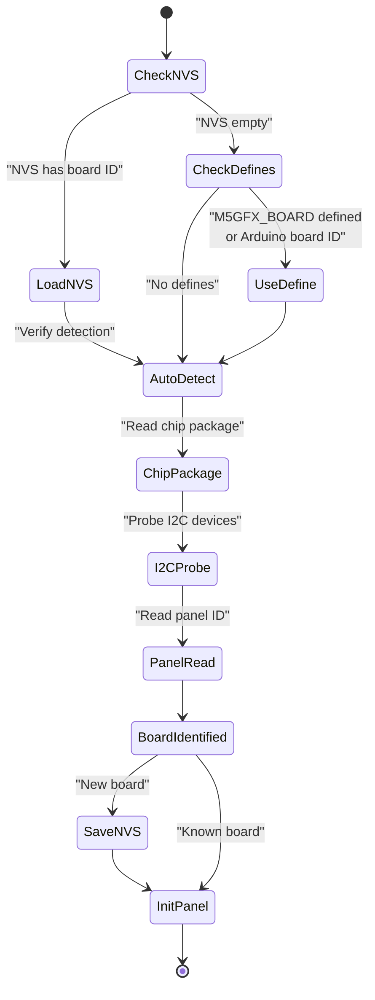

M5GFX Getting Started

# Getting Started

<details>
<summary>Relevant source files</summary>

The following files were used as context for generating this wiki page:

- [README.md](README.md)
- [examples/PlatformIO_SDL/README.md](examples/PlatformIO_SDL/README.md)
- [examples/PlatformIO_SDL/platformio.ini](examples/PlatformIO_SDL/platformio.ini)
- [examples/PlatformIO_SDL/src/sdl_main.cpp](examples/PlatformIO_SDL/src/sdl_main.cpp)
- [examples/PlatformIO_SDL/src/user_code.cpp](examples/PlatformIO_SDL/src/user_code.cpp)
- [idf_component.yml](idf_component.yml)
- [library.json](library.json)
- [library.properties](library.properties)
- [src/M5GFX.cpp](src/M5GFX.cpp)
- [src/M5GFX.h](src/M5GFX.h)
- [src/lgfx/boards.hpp](src/lgfx/boards.hpp)
- [src/lgfx/v1/gitTagVersion.h](src/lgfx/v1/gitTagVersion.h)

</details>


This page provides a quick-start guide for installing and using M5GFX with M5Stack hardware. It covers framework prerequisites, installation methods, basic initialization patterns, and simple usage examples to get your first graphics application running.

For detailed information about the library architecture, see [Architecture Overview](#1.2). For a complete list of supported devices, see [Supported Devices and Displays](#1.3). For advanced configuration options, see [Display-Specific Configuration](#7.4).

---

## Prerequisites

M5GFX requires one of the following development frameworks:

**Supported Frameworks:**
- **ESP-IDF** - Espressif's native IoT Development Framework
- **Arduino for ESP32** - Arduino framework with ESP32 core

**Supported Platforms:**
- **espressif32** - ESP32, ESP32-S3, ESP32-C3, ESP32-C6, ESP32-P4 microcontrollers
- **native** - Desktop simulation via SDL2 (for development/testing)

**Library Information:**
- Current version: `0.2.19` (LovyanGFX core: `1.2.19`)
- License: MIT (M5GFX), FreeBSD (LovyanGFX core)
- Repository: https://github.com/m5stack/M5GFX

Sources: [library.json:1-17](), [library.properties:1-11](), [src/lgfx/v1/gitTagVersion.h:1-5]()

---

## Installation

### Arduino IDE Installation

**Method 1: Library Manager (Recommended)**

1. Open Arduino IDE
2. Navigate to **Sketch → Include Library → Manage Libraries**
3. Search for "M5GFX"
4. Click **Install**

**Method 2: Manual Installation**

1. Download the latest release from: https://github.com/m5stack/M5GFX/releases
2. Extract the archive
3. Move the `M5GFX` folder to your Arduino libraries directory:
   - Windows: `Documents\Arduino\libraries\`
   - macOS: `~/Documents/Arduino/libraries/`
   - Linux: `~/Arduino/libraries/`
4. Restart Arduino IDE

### PlatformIO Installation

Add M5GFX to your `platformio.ini`:

```ini
[env:m5stack-core-esp32]
platform = espressif32
board = m5stack-core-esp32
framework = arduino

lib_deps =
    m5stack/M5GFX@^0.2.19
```

For ESP-IDF framework projects:

```ini
[env:esp32dev]
platform = espressif32
board = esp32dev
framework = espidf

lib_deps =
    m5stack/M5GFX@^0.2.19
```

Sources: [library.json:1-17](), [library.properties:1-11]()

---

## Basic Usage Patterns

### Initialization Flow

**Initialization Flow Diagram**



**Initialization Process:**
1. Include `M5GFX.h` and instantiate `M5GFX` class (calls `M5GFX::M5GFX()` constructor)
2. Call `display.init()` in `setup()`, which invokes `M5GFX::init_impl()`
3. Check if board already detected via `getBoard()`
4. If not detected, check NVS storage via `nvs_open()` and `nvs_get_u32()`
5. If NVS empty, check compile-time defines (`M5GFX_BOARD`, `ARDUINO_M5STACK_CORE_ESP32`, etc.)
6. Call `M5GFX::autodetect()` to probe hardware:
   - Read ESP32 package version via `get_pkg_ver()` and `EFUSE_RD_CHIP_VER_PKG`
   - Probe I2C bus for PMICs using `lgfx::i2c::readRegister8()`
   - Read panel ID via `_read_panel_id()` which sends RDDID command (0x04)
7. Instantiate appropriate panel class (`Panel_M5Stack`, `Panel_M5StackCore2`, etc.)
8. Cache result to NVS via `nvs_set_u32()` for faster subsequent boots
9. Call `LGFX_Device::init_impl()` to initialize panel hardware
10. Display is ready for graphics operations

Sources: [src/M5GFX.cpp:60-63](), [src/M5GFX.cpp:620-710](), [src/M5GFX.cpp:712-880](), [src/M5GFX.cpp:583-598](), [src/M5GFX.h:174-201]()

---

## First Program: Auto-Detection Mode

The simplest way to use M5GFX is with automatic hardware detection. The library will identify your M5Stack device and configure the appropriate panel driver.

### Minimal Example

```cpp
#include <M5GFX.h>

M5GFX display;

void setup() {
  display.init();  // Auto-detect hardware and initialize
  
  display.fillScreen(TFT_BLACK);
  display.setTextColor(TFT_WHITE);
  display.setTextSize(2);
  display.drawString("Hello M5Stack!", 10, 10);
}

void loop() {
  // Your application code
}
```

### Key Classes and Methods

**Class Hierarchy**



| Class/Method | Purpose |
|-------------|---------|
| `M5GFX` | Main display class, inherits from `LGFX_Device`, provides singleton pattern |
| `M5GFX::M5GFX()` | Constructor, sets singleton `_instance` pointer |
| `M5GFX::init()` | Initialize display with auto-detection, calls `init_impl()` |
| `M5GFX::init_impl()` | Implementation of init, checks NVS and calls `autodetect()` |
| `M5GFX::autodetect()` | Hardware detection via eFuse, I2C probing, panel ID reading |
| `M5GFX::getInstance()` | Get singleton instance pointer |
| `LGFXBase::fillScreen(color)` | Fill entire screen with color |
| `LGFXBase::setTextColor(color)` | Set text foreground color |
| `LGFXBase::setTextSize(scale)` | Set text scaling factor |
| `LGFXBase::drawString(text, x, y)` | Draw text at position |

Sources: [src/M5GFX.h:174-210](), [src/M5GFX.cpp:60-63](), [src/M5GFX.cpp:620-710]()

---

## Drawing Operations Example

### Basic Graphics

```cpp
#include <M5GFX.h>

M5GFX display;

void setup() {
  display.init();
  display.setRotation(1);  // Landscape orientation
  
  // Clear screen
  display.fillScreen(TFT_BLACK);
  
  // Draw shapes
  display.fillRect(10, 10, 100, 50, TFT_RED);
  display.drawCircle(160, 120, 40, TFT_GREEN);
  display.drawLine(0, 0, 319, 239, TFT_BLUE);
  
  // Draw text
  display.setTextColor(TFT_WHITE, TFT_BLACK);
  display.drawString("M5GFX", 120, 10);
}

void loop() {
  delay(1000);
}
```

### Common Drawing Methods

| Method | Description |
|--------|-------------|
| `fillRect(x, y, w, h, color)` | Draw filled rectangle |
| `drawRect(x, y, w, h, color)` | Draw rectangle outline |
| `fillCircle(x, y, r, color)` | Draw filled circle |
| `drawCircle(x, y, r, color)` | Draw circle outline |
| `drawLine(x0, y0, x1, y1, color)` | Draw line |
| `drawPixel(x, y, color)` | Draw single pixel |
| `pushImage(x, y, w, h, data)` | Draw image buffer |

Sources: [src/M5GFX.h:174-216]()

---

## Manual Panel Configuration

For specialized displays or non-standard configurations, you can manually configure the panel instead of using auto-detection.

### Manual Configuration Example

```cpp
#include <M5GFX.h>
#include <lgfx/v1/panel/Panel_ILI9342.hpp>

M5GFX display;

void setup() {
  // Create panel instance
  auto panel = new lgfx::Panel_ILI9342();
  
  // Configure panel settings
  auto cfg = panel->config();
  cfg.pin_cs   = 14;
  cfg.pin_rst  = 33;
  cfg.panel_width  = 320;
  cfg.panel_height = 240;
  panel->config(cfg);
  
  // Initialize with manual panel
  display.init(panel);
  
  display.fillScreen(TFT_BLACK);
  display.drawString("Manual Config", 10, 10);
}

void loop() {
  // Application code
}
```

**Available Panel Drivers:**
- `Panel_ILI9342` - M5Stack Basic, Core2, CoreS3 (320x240)
- `Panel_ST7735S` - M5StickC (80x160)
- `Panel_ST7789` - M5StickCPlus (135x240)
- `Panel_GC9A01` - M5Dial (240x240 round)
- `Panel_IT8951` - M5Paper e-ink (960x540)
- `Panel_SSD1306` - OLED displays (128x64)
- `Panel_M5HDMI` - ATOM Display, Module Display (HDMI output)
- `Panel_CVBS` - Unit RCA, Module RCA (composite video)

Sources: [src/M5GFX.h:269-273](), [src/M5GFX.cpp:16-32](), [src/M5GFX.cpp:85-110]()

### Configuration Structure



**Configuration Flow:**
1. Create panel driver instance (e.g., `Panel_ILI9342`)
2. Get config structure via `panel->config()`
3. Set pin assignments and parameters
4. Apply config via `panel->config(cfg)`
5. Initialize display with `display.init(panel)`

Sources: [src/M5GFX.h:269-273](), [src/M5GFX.cpp:85-110]()

---

## Using Sprites (Off-Screen Buffers)

Sprites enable double-buffering and complex graphics without flicker.

### Sprite Example

```cpp
#include <M5GFX.h>

M5GFX display;
M5Canvas sprite(&display);

void setup() {
  display.init();
  
  // Create sprite buffer
  sprite.createSprite(100, 100);
  sprite.fillSprite(TFT_RED);
  sprite.drawString("Sprite", 10, 40);
}

void loop() {
  // Draw sprite at different positions
  for (int x = 0; x < 220; x += 5) {
    sprite.pushSprite(x, 70);
    delay(10);
  }
}
```

### Sprite Class Hierarchy

**M5Canvas and LGFX_Sprite Relationship**



**Key Sprite Methods:**

| Method | Purpose | Memory Allocation |
|--------|---------|------------------|
| `createSprite(width, height)` | Allocate sprite buffer, returns buffer pointer | Heap or PSRAM based on `setPsram()` |
| `fillSprite(color)` | Fill sprite with color | N/A |
| `pushSprite(x, y)` | Copy sprite to display at position | Temporary DMA buffer if needed |
| `pushSprite(x, y, transp)` | Copy with transparency color | Temporary DMA buffer if needed |
| `pushRotateZoom(x, y, angle, zoom_x, zoom_y)` | Copy with affine transformation | Temporary DMA buffer if needed |
| `deleteSprite()` | Free sprite memory | Deallocates buffer |
| `setPsram(true)` | Use PSRAM for buffer (ESP32) | Must call before `createSprite()` |
| `getBuffer()` | Get raw buffer pointer | N/A |
| `frameBuffer(n)` | M5Canvas-specific, alias for `getBuffer()` | N/A |

**Memory Allocation Strategy:**



Sources: [src/M5GFX.h:277-284]()

---

## Device-Specific Initialization

### Board Detection States



**Detection Process:**

1. **NVS Check** - Look for cached board ID in non-volatile storage
2. **Build Defines** - Check for `M5GFX_BOARD` or Arduino board macros
3. **Auto-Detection** - If needed, probe hardware:
   - Read ESP32 chip package version
   - Probe I2C bus for power management ICs (AXP192, AXP2101)
   - Probe I2C bus for GPIO expanders (AW9523B)
   - Read LCD panel IDs via SPI
   - Match hardware profile to `board_t` enumeration
4. **Cache Result** - Save board ID to NVS for faster future boots
5. **Panel Init** - Configure and initialize detected panel

Sources: [src/M5GFX.cpp:620-710](), [src/M5GFX.cpp:712-1820](), [src/lgfx/boards.hpp:1-78]()

---

## Checking Detected Hardware

### Runtime Board Information

```cpp
#include <M5GFX.h>

M5GFX display;

void setup() {
  Serial.begin(115200);
  display.init();
  
  // Get detected board
  auto board = display.getBoard();
  Serial.printf("Detected board: %d\n", board);
  
  // Get display dimensions
  Serial.printf("Width: %d, Height: %d\n", 
                display.width(), display.height());
  
  // Check if display has touch
  if (display.touch()) {
    Serial.println("Touch panel available");
  }
}
```

### Board Enumeration

The `board_t` enum defines all supported devices:

| Category | Boards |
|----------|--------|
| **Core devices** | `board_M5Stack`, `board_M5StackCore2`, `board_M5StackCoreS3`, `board_M5StackCoreS3SE` |
| **Stick devices** | `board_M5StickC`, `board_M5StickCPlus`, `board_M5StickCPlus2` |
| **E-Paper devices** | `board_M5StackCoreInk`, `board_M5Paper`, `board_M5PaperS3` |
| **Specialized** | `board_M5Dial`, `board_M5DinMeter`, `board_M5Cardputer`, `board_M5VAMeter`, `board_M5Tab5` |
| **Atom series** | `board_M5AtomS3`, `board_M5AtomS3R`, `board_M5AtomLite`, `board_M5AtomPsram` |
| **External displays** | `board_M5AtomDisplay`, `board_M5UnitLCD`, `board_M5UnitOLED`, `board_M5UnitRCA` |

Sources: [src/lgfx/boards.hpp:8-78]()

---

## Common Initialization Patterns

### Pattern Comparison

```mermaid
graph TB
    subgraph "Auto-Detection Pattern"
        A1["M5GFX display;"]
        A2["display.init();"]
        A3["Auto board detection"]
        A1 --> A2
        A2 --> A3
    end
    
    subgraph "Manual Panel Pattern"
        M1["M5GFX display;"]
        M2["auto panel = new Panel_ILI9342();"]
        M3["Configure panel settings"]
        M4["display.init(panel);"]
        M1 --> M2
        M2 --> M3
        M3 --> M4
    end
    
    subgraph "External Display Pattern"
        E1["M5UnitLCD display;"]
        E2["display.init(I2C_port, SDA, SCL);"]
        E3["I2C communication"]
        E1 --> E2
        E2 --> E3
    end
```



**When to Use Each Pattern:**

| Pattern | Use Case |
|---------|----------|
| **Auto-Detection** | Standard M5Stack devices with internal displays |
| **Manual Panel** | Custom hardware, non-standard pin assignments, advanced configuration |
| **External Display** | Unit/Module displays connected via Grove ports (I2C/SPI) |

Sources: [src/M5GFX.cpp:620-625](), [src/M5GFX.h:269-273]()

---

## Cross-Platform Development

M5GFX supports SDL simulation for desktop development:

### SDL Desktop Simulation

**SDL Platform Setup**

```cpp
#include <M5GFX.h>

#if defined(SDL_h_)
// SDL-specific entry point
int user_func(bool* running) {
  setup();
  do {
    loop();
  } while (*running);
  return 0;
}

int main(int, char**) {
  // 128ms slow execution for debugging
  return lgfx::Panel_sdl::main(user_func, 128);
}
#endif

M5GFX display;

void setup() {
  display.init();
  
  #if defined(SDL_h_)
    printf("Running in SDL simulation mode\n");
  #else
    Serial.println("Running on physical hardware");
  #endif
  
  display.fillScreen(TFT_BLACK);
  display.drawString("Cross-platform!", 10, 10);
}

void loop() {
  delay(100);
}
```

**PlatformIO SDL Configuration:**

```ini
[env:native]
platform = native
build_type = debug
build_flags = -O0 -xc++ -std=c++14 -lSDL2
  -I"/usr/local/include/SDL2"
  -L"/usr/local/lib"
  -DM5GFX_SHOW_FRAME             ; Display frame image
  -DM5GFX_BACK_COLOR=0x222222u   ; Color outside frame
  -DM5GFX_BOARD=board_M5Stack    ; Specify board type
```

**SDL Platform Benefits:**
- Develop/debug on desktop without hardware
- Faster compile-test cycles (no flashing required)
- Use desktop debugging tools (lldb, gdb, Valgrind, Address Sanitizer)
- Same codebase runs on both platforms via conditional compilation
- Mouse input maps to touch coordinates
- Keyboard shortcuts: `L` (rotate left), `R` (rotate right)

**Platform Detection:**
- `SDL_h_` macro defined when SDL2 is available
- `ESP_PLATFORM` macro defined on ESP32 hardware
- Use conditional compilation to handle platform differences

For complete SDL setup guide, see [SDL Development Workflow](#6.3).

Sources: [src/M5GFX.cpp:47-52](), [examples/PlatformIO_SDL/src/sdl_main.cpp:1-26](), [examples/PlatformIO_SDL/platformio.ini:1-67]()

---

## Troubleshooting Common Issues

### Display Not Initializing

**Symptom:** `display.init()` returns `false` or display stays blank

**Solutions:**
1. Check power supply - ensure adequate current (>500mA for most devices)
2. Verify USB cable supports data (not charge-only)
3. Clear NVS cache:
   ```cpp
   #include <nvs_flash.h>
   nvs_flash_erase();
   nvs_flash_init();
   ```
4. Force board detection:
   ```cpp
   // Define before including M5GFX.h
   #define M5GFX_BOARD board_M5Stack
   #include <M5GFX.h>
   ```

### Wrong Display Detected

**Symptom:** Auto-detection identifies wrong board model

**Solutions:**
1. Erase NVS and reboot:
   ```cpp
   #include <nvs_flash.h>
   nvs_flash_erase();
   ESP.restart();
   ```
2. Use compile-time board specification (add before `#include <M5GFX.h>`):
   ```cpp
   #define M5GFX_BOARD board_M5StackCore2
   #include <M5GFX.h>
   ```
3. Check NVS contents:
   ```cpp
   uint32_t nvs_handle = 0;
   if (0 == nvs_open("M5GFX", NVS_READONLY, &nvs_handle)) {
     uint32_t cached_board = 0;
     nvs_get_u32(nvs_handle, "AUTODETECT", &cached_board);
     Serial.printf("Cached board: %d\n", cached_board);
     nvs_close(nvs_handle);
   }
   ```

**Available board_t Values:**

See complete enumeration in `lgfx::boards::board_t`:
- `board_M5Stack` = 1
- `board_M5StackCore2` = 2
- `board_M5StickC` = 3
- `board_M5StickCPlus` = 4
- `board_M5StackCoreS3` = 19
- And 30+ other values...

Sources: [src/M5GFX.cpp:627-635](), [src/M5GFX.cpp:639-677](), [src/lgfx/boards.hpp:8-78]()

### Compilation Errors

**Symptom:** `M5GFX.h: No such file or directory`

**Solutions:**
1. Verify library installation in Arduino/libraries/ or .pio/libdeps/
2. Check `platformio.ini` includes correct `lib_deps`
3. Restart IDE after installation

### Memory Issues

**Symptom:** Crashes, heap allocation failures with sprites

**Solutions:**
1. Reduce sprite dimensions
2. Use PSRAM if available:
   ```cpp
   sprite.setPsram(true);
   ```
3. Monitor heap:
   ```cpp
   Serial.printf("Free heap: %d\n", ESP.getFreeHeap());
   ```

Sources: [src/M5GFX.cpp:627-635]()

---

## Next Steps

After completing basic initialization, explore:

- **[Architecture Overview](#1.2)** - Understand the library's layered structure
- **[Supported Devices](#1.3)** - Full device compatibility list
- **[LGFXBase Graphics Operations](#3.1)** - Comprehensive drawing API
- **[Font Rendering System](#3.5)** - Text rendering and font options
- **[Sprite System](#3.4)** - Advanced off-screen buffer techniques
- **[Performance Optimization](#7.2)** - DMA and buffer management strategies

**Example Projects:**
- examples/Basic/ - Simple drawing examples
- examples/Advanced/ - Sprites, images, fonts
- examples/HowToUse/ - Feature demonstrations

Sources: [README.md:1-56]()