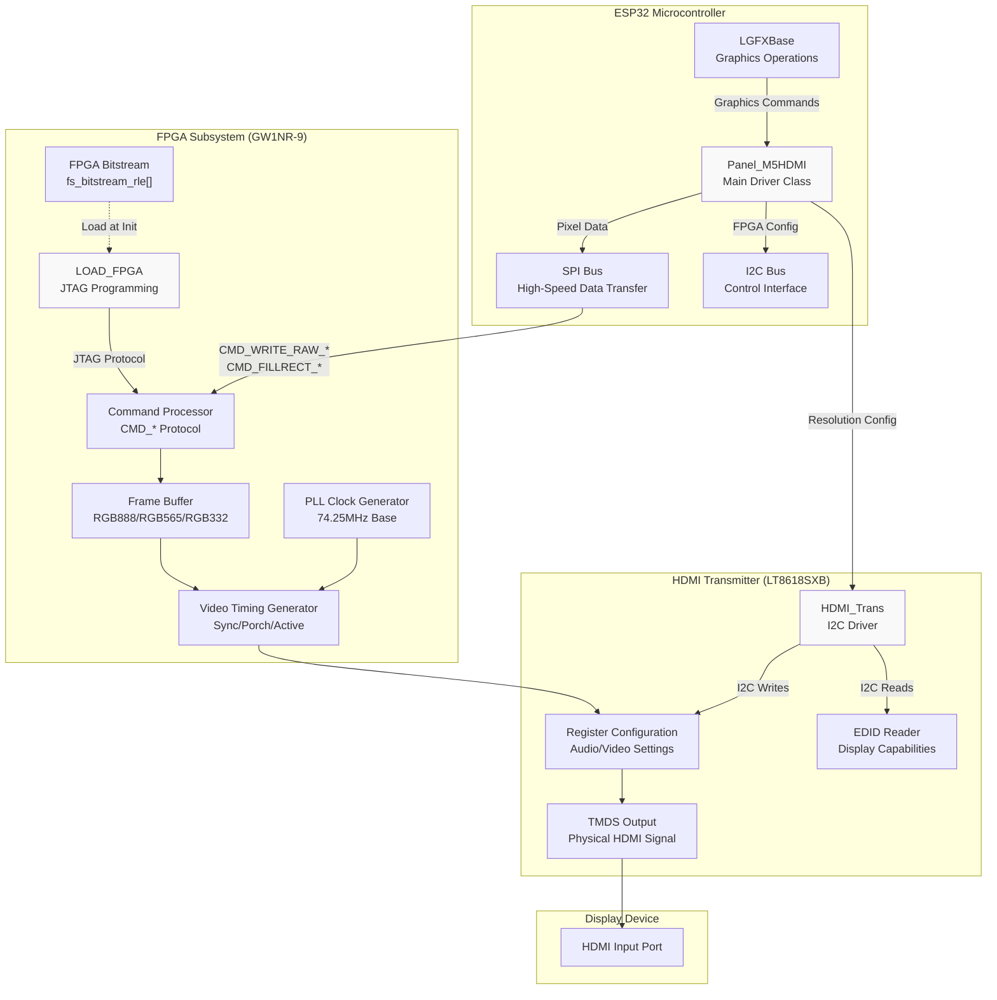
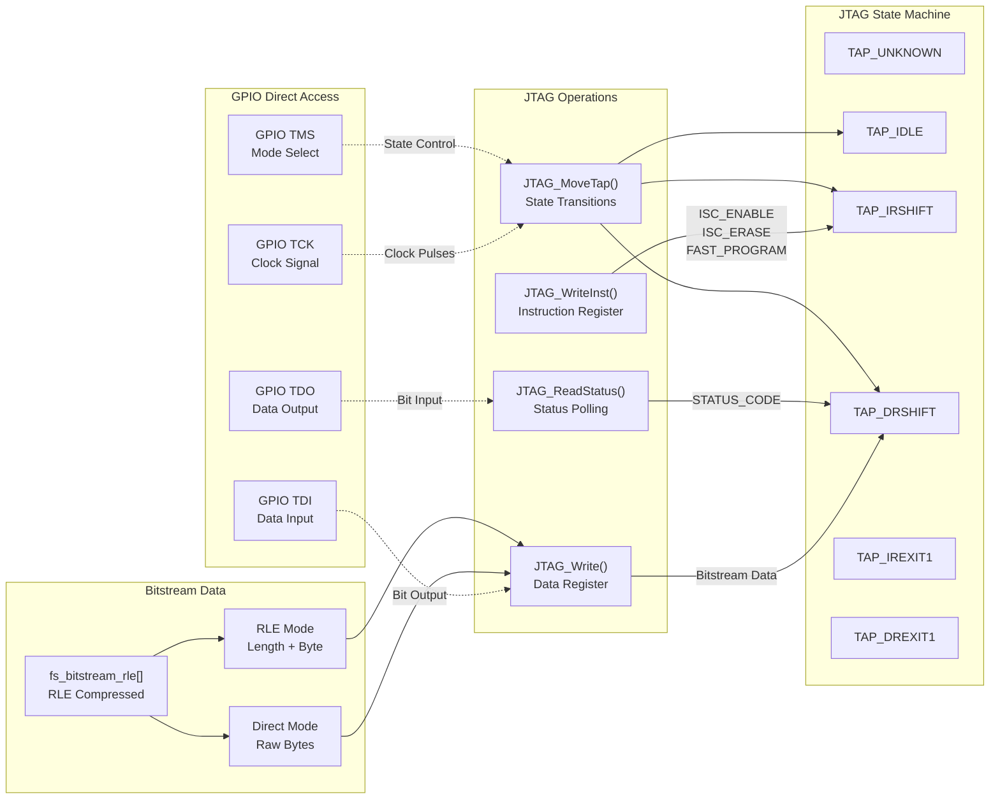
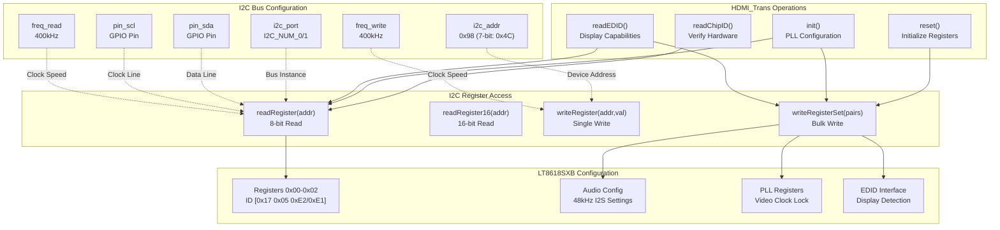
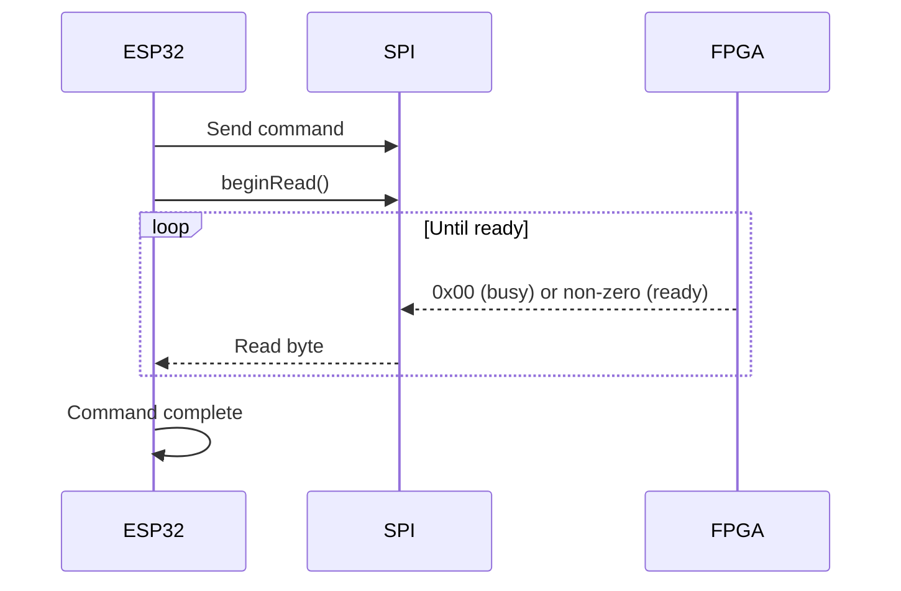
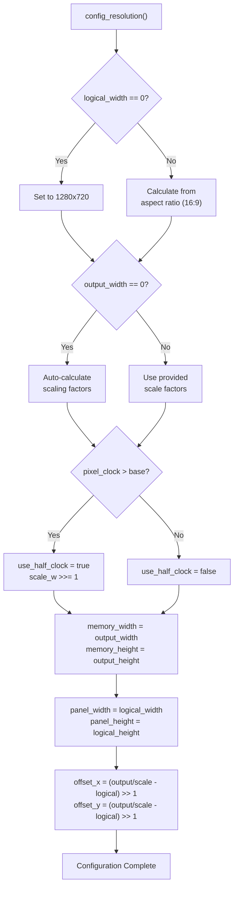
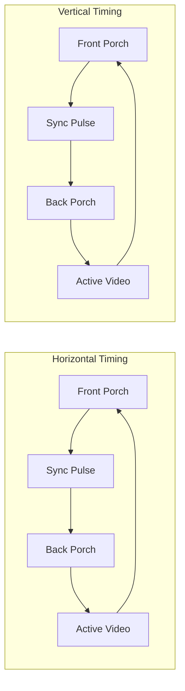
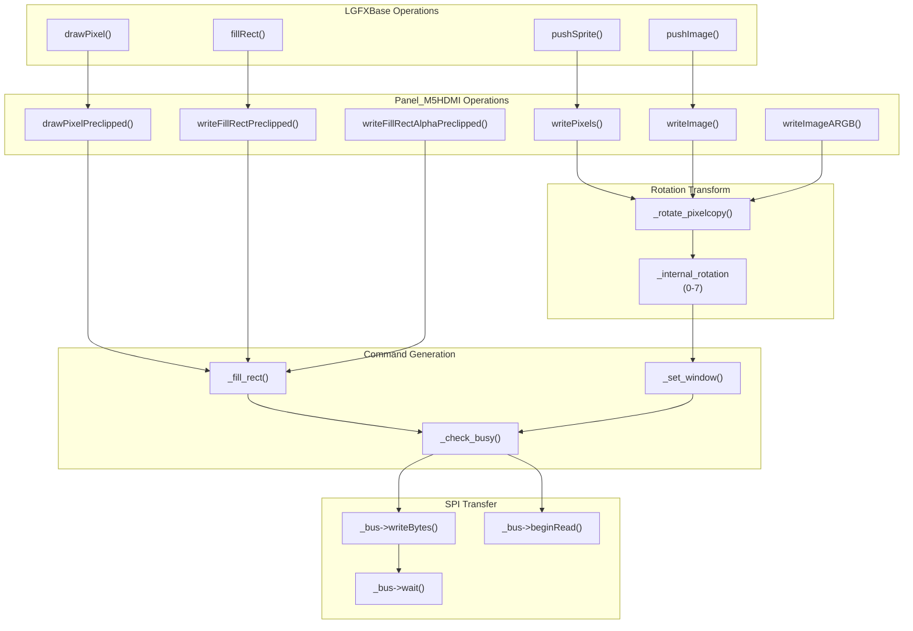
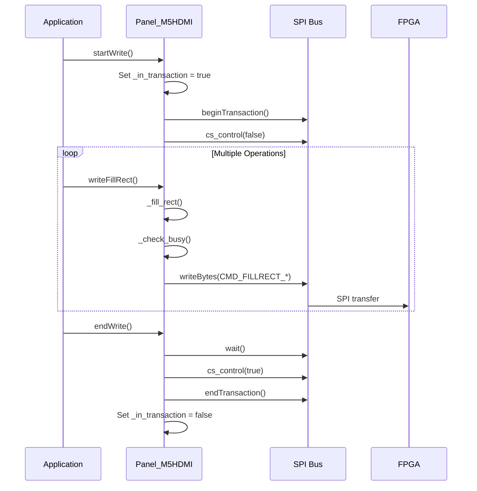
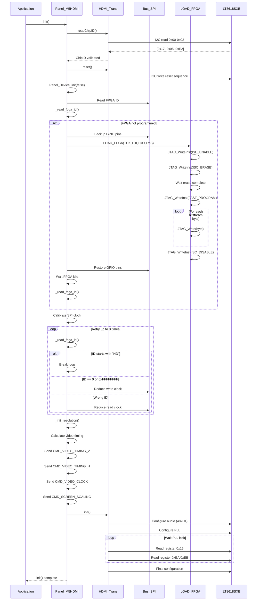

M5GFX HDMI Panel Driver

# HDMI Panel Driver

<details>
<summary>Relevant source files</summary>

The following files were used as context for generating this wiki page:

- [docs/ATOMDisplay.md](docs/ATOMDisplay.md)
- [docs/UnitRCA.md](docs/UnitRCA.md)
- [examples/Basic/TouchTest/TouchTest.ino](examples/Basic/TouchTest/TouchTest.ino)
- [src/lgfx/v1/panel/Panel_M5HDMI.cpp](src/lgfx/v1/panel/Panel_M5HDMI.cpp)
- [src/lgfx/v1/panel/Panel_M5HDMI.hpp](src/lgfx/v1/panel/Panel_M5HDMI.hpp)
- [src/lgfx/v1/panel/Panel_M5HDMI_FS.h](src/lgfx/v1/panel/Panel_M5HDMI_FS.h)

</details>


## Purpose and Scope

The HDMI Panel Driver (`Panel_M5HDMI`) provides hardware acceleration for HDMI video output using an FPGA-based architecture. This driver is specifically designed for M5Stack's ATOM Display and Module Display products, which combine an ESP32 with a Gowin GW1NR-9 FPGA and LT8618SXB HDMI transmitter chip to generate HDMI video signals.

This page covers the FPGA programming, HDMI transmitter configuration, video timing generation, and graphics command protocol. For device-specific initialization wrappers, see [Atom Display Device Classes](#2.3). For general panel driver architecture, see [Panel Driver Architecture](#4). For SPI bus implementation details, see [ESP32 SPI Bus Implementation](#5.3).

**Sources:** [src/lgfx/v1/panel/Panel_M5HDMI.hpp:1-314](), [src/lgfx/v1/panel/Panel_M5HDMI.cpp:1-50]()

---

## System Architecture

The HDMI Panel Driver consists of three major subsystems that work together to generate HDMI video output:



**Sources:** [src/lgfx/v1/panel/Panel_M5HDMI.hpp:30-309](), [src/lgfx/v1/panel/Panel_M5HDMI.cpp:18-44]()

---

## FPGA Programming Subsystem

### LOAD_FPGA Class

The `LOAD_FPGA` inner class implements JTAG-based FPGA configuration using the Gowin FPGA programming protocol. This class is instantiated only during initialization to load the bitstream into the FPGA's SRAM.



The FPGA programming sequence follows this flow:

1. **Erase SRAM** - Clear existing configuration using `ISC_ERASE` instruction
2. **Enter Programming Mode** - Use `FAST_PROGRAM` instruction
3. **Stream Bitstream** - Write RLE-compressed bitstream data
4. **Verify and Exit** - Check status and issue `ISC_DISABLE`

**Sources:** [src/lgfx/v1/panel/Panel_M5HDMI.cpp:86-180](), [src/lgfx/v1/panel/Panel_M5HDMI.hpp:239-282]()

### JTAG Protocol Implementation

| Method | Purpose | Key Operations |
|--------|---------|----------------|
| `JTAG_MoveTap()` | State machine transitions | Controls TMS signal for TAP state changes |
| `JTAG_WriteInst()` | Write instruction register | Sends 8-bit GWFPGA_Inst_Def commands |
| `JTAG_Write()` | Write data register | Sends bitstream bytes with optional RLE decompression |
| `JTAG_ReadStatus()` | Read FPGA status | Reads 32-bit GWFPGA_StatusReg_Def flags |
| `JTAG_DUMMY_CLOCK()` | Generate clock cycles | Creates delay for FPGA operations |

**Sources:** [src/lgfx/v1/panel/Panel_M5HDMI.cpp:182-301](), [src/lgfx/v1/panel/Panel_M5HDMI.hpp:245-281]()

### Bitstream Format

The FPGA bitstream is stored as RLE-compressed data in `fs_bitstream_rle[]`. The compression format uses two modes:

- **RLE Mode**: Length byte followed by data byte (repeat `length` times)
- **Direct Mode**: Length 0x00, then length byte, then raw data bytes

**Sources:** [src/lgfx/v1/panel/Panel_M5HDMI_FS.h:1-468](), [src/lgfx/v1/panel/Panel_M5HDMI.cpp:141-173]()

---

## HDMI Transmitter Control

### HDMI_Trans Class

The `HDMI_Trans` inner class manages the LT8618SXB HDMI transmitter chip via I2C. This chip converts the FPGA's parallel RGB video into HDMI TMDS signals.



**Sources:** [src/lgfx/v1/panel/Panel_M5HDMI.cpp:305-482](), [src/lgfx/v1/panel/Panel_M5HDMI.hpp:211-237]()

### Chip Identification and Validation

The HDMI transmitter returns a 3-byte chip ID:
- Byte 0: `0x17`
- Byte 1: `0x05`
- Byte 2: `0xE1` (older revision) or `0xE2` (newer revision with extended features)

**Sources:** [src/lgfx/v1/panel/Panel_M5HDMI.cpp:350-370](), [src/lgfx/v1/panel/Panel_M5HDMI.cpp:415-419]()

### Audio Configuration

The driver configures 48kHz audio by default (96kHz settings are available but commented out). Audio settings are written during `init()`:

| Register Bank | Purpose |
|---------------|---------|
| 0xFF=0x82, 0xD6-0xD7 | Audio format and sampling rate |
| 0xFF=0x84, 0x06-0x3C | I2S interface configuration |
| 0xFF=0x81, 0x23-0x2D | Audio clock division and timing |

**Sources:** [src/lgfx/v1/panel/Panel_M5HDMI.cpp:399-413]()

### EDID Reading

The `readEDID()` method retrieves Extended Display Identification Data from the connected display in 32-byte blocks:

1. Configure EDID interface registers (0xFF=0x85)
2. Set block address (0x05 register)
3. Trigger read operation (0x07 register)
4. Poll for completion (0x40 register)
5. Read 32 bytes from 0x83 register

**Sources:** [src/lgfx/v1/panel/Panel_M5HDMI.cpp:445-482]()

---

## FPGA Command Protocol

### Command Structure

The FPGA firmware responds to SPI commands that follow a specific byte-oriented protocol. Commands are sent from the ESP32 via SPI and processed by the FPGA's command processor.

| Command Category | Command Byte | Arguments | Description |
|------------------|--------------|-----------|-------------|
| System | `CMD_NOP` (0x00) | 0 bytes | No operation |
| System | `CMD_READ_ID` (0x04) | 0 bytes | Read FPGA ID ("HD" + version) |
| Window | `CMD_CASET` (0x2A) | 4 bytes | Set X range (XS:16, XE:16) |
| Window | `CMD_RASET` (0x2B) | 4 bytes | Set Y range (YS:16, YE:16) |
| Drawing | `CMD_FILLRECT_8` (0x69) | 9 bytes | Fill rect with RGB332 color |
| Drawing | `CMD_FILLRECT_16` (0x6A) | 10 bytes | Fill rect with RGB565 color |
| Drawing | `CMD_FILLRECT_24` (0x6B) | 11 bytes | Fill rect with RGB888 color |
| Drawing | `CMD_FILLRECT_32` (0x6C) | 12 bytes | Fill rect with ARGB8888 color |
| Drawing | `CMD_DRAWPIXEL_8` (0x61) | 5 bytes | Draw pixel with RGB332 color |
| Drawing | `CMD_DRAWPIXEL_16` (0x62) | 6 bytes | Draw pixel with RGB565 color |
| Drawing | `CMD_DRAWPIXEL_24` (0x63) | 7 bytes | Draw pixel with RGB888 color |
| Drawing | `CMD_DRAWPIXEL_32` (0x64) | 8 bytes | Draw pixel with ARGB8888 color |
| Pixel Data | `CMD_WRITE_RAW_8` (0x41) | Variable | Stream RGB332 pixels |
| Pixel Data | `CMD_WRITE_RAW_16` (0x42) | Variable | Stream RGB565 pixels |
| Pixel Data | `CMD_WRITE_RAW_24` (0x43) | Variable | Stream RGB888 pixels |
| Pixel Data | `CMD_WRITE_RAW_32` (0x44) | Variable | Stream ARGB8888 pixels |
| Pixel Data | `CMD_WRITE_RAW_A` (0x45) | Variable | Stream alpha channel only |
| Utility | `CMD_COPYRECT` (0x23) | 12 bytes | Copy rectangle within framebuffer |
| Config | `CMD_SCREEN_SCALING` (0x18) | 7 bytes | Set scaling factors |
| Config | `CMD_SCREEN_ORIGIN` (0x19) | 5 bytes | Set viewport offset |
| Config | `CMD_VIDEO_TIMING_V` (0xB0) | 9 bytes | Vertical timing parameters |
| Config | `CMD_VIDEO_TIMING_H` (0xB1) | 9 bytes | Horizontal timing parameters |
| Config | `CMD_VIDEO_CLOCK` (0xB2) | 6 bytes | PLL clock configuration |

**Sources:** [src/lgfx/v1/panel/Panel_M5HDMI.hpp:144-199](), [src/lgfx/v1/panel/Panel_M5HDMI.cpp:488-504]()

### Busy Detection Protocol

Before sending commands, the driver checks if the FPGA is ready by reading a status byte:



The `_check_busy()` method implements a threshold-based system: after 512 bytes of data transfer, it polls the FPGA status to prevent buffer overflow.

**Sources:** [src/lgfx/v1/panel/Panel_M5HDMI.cpp:948-975](), [src/lgfx/v1/panel/Panel_M5HDMI.cpp:917-946]()

### Coordinate Encoding

Commands that specify coordinates use big-endian 16-bit values with byte swapping:

```cpp
// Encode X and Y coordinates
uint32_t xy = x + (y << 16);
uint32_t mask = 0xFF00FF;
uint32_t encoded = ((xy >> 8) & mask) + ((xy & mask) << 8);
```

**Sources:** [src/lgfx/v1/panel/Panel_M5HDMI.cpp:1062-1066](), [src/lgfx/v1/panel/Panel_M5HDMI.cpp:1129-1132]()

---

## Resolution and Video Timing Configuration

### Configuration Parameters

The `config_resolution_t` structure defines the complete display configuration:

| Field | Type | Description |
|-------|------|-------------|
| `logical_width` | uint16_t | Width visible to application (e.g., 1280) |
| `logical_height` | uint16_t | Height visible to application (e.g., 720) |
| `refresh_rate` | float | Vertical refresh rate in Hz (e.g., 60.0) |
| `output_width` | uint16_t | Physical output width after scaling |
| `output_height` | uint16_t | Physical output height after scaling |
| `scale_w` | uint8_t | Horizontal scaling factor (1-8) |
| `scale_h` | uint8_t | Vertical scaling factor (1-8) |
| `pixel_clock` | uint32_t | Target pixel clock frequency (default: 74250000) |

**Sources:** [src/lgfx/v1/panel/Panel_M5HDMI.hpp:115-125](), [src/lgfx/v1/panel/Panel_M5HDMI.cpp:727-739]()

### Resolution Calculation Algorithm



**Sources:** [src/lgfx/v1/panel/Panel_M5HDMI.cpp:771-896]()

### PLL Clock Calculation

The driver calculates optimal PLL parameters for the target pixel clock using a 74.25 MHz base clock:

```
pixel_clock = base_clock * feedback_divider / input_divider
VCO_clock = pixel_clock * output_divider
```

Constraints:
- `1 <= input_divider <= 24`
- `1 <= feedback_divider <= 64`
- `output_divider ∈ {2, 4, 8, 16, 32, 48, 64, 80, 96, 112, 128}`
- `400 MHz <= VCO_clock <= 1200 MHz` (target: 800 MHz)

**Sources:** [src/lgfx/v1/panel/Panel_M5HDMI.cpp:593-639](), [src/lgfx/v1/panel/Panel_M5HDMI.hpp:46-68]()

### Video Timing Structure

The `video_timing_t` structure defines horizontal and vertical timing parameters:



The driver automatically calculates blanking intervals based on the total resolution and refresh rate:

**Sources:** [src/lgfx/v1/panel/Panel_M5HDMI.hpp:33-44](), [src/lgfx/v1/panel/Panel_M5HDMI.cpp:641-724]()

---

## Graphics Operations

### Drawing Pipeline



**Sources:** [src/lgfx/v1/panel/Panel_M5HDMI.cpp:1024-1090](), [src/lgfx/v1/panel/Panel_M5HDMI.cpp:1173-1321]()

### Rotation Handling

The driver supports 8 rotation modes (0-7) by transforming coordinates and adjusting pixel copy operations:

| Rotation | Transform | Vertical Flip | Horizontal Flip | Swap XY |
|----------|-----------|---------------|-----------------|---------|
| 0 | Normal | No | No | No |
| 1 | 90° CW | Yes | No | Yes |
| 2 | 180° | Yes | Yes | No |
| 3 | 270° CW | No | Yes | Yes |
| 4 | Mirror | No | No | No |
| 5 | Mirror + 90° | Yes | No | Yes |
| 6 | Mirror + 180° | Yes | Yes | No |
| 7 | Mirror + 270° | No | Yes | Yes |

**Sources:** [src/lgfx/v1/panel/Panel_M5HDMI.cpp:988-997](), [src/lgfx/v1/panel/Panel_M5HDMI.cpp:1138-1171]()

### Color Depth Support

The driver supports three color depths:

| Depth | Bits | Format | Byte Size |
|-------|------|--------|-----------|
| `rgb332_1Byte` | 8 | R3G3B2 | 1 byte |
| `rgb565_2Byte` | 16 | R5G6B5 | 2 bytes |
| `rgb888_3Byte` | 24 | R8G8B8 | 3 bytes |

The FPGA also supports `ARGB8888` (32-bit) for alpha blending operations via `CMD_WRITE_RAW_32` and `CMD_FILLRECT_32`.

**Sources:** [src/lgfx/v1/panel/Panel_M5HDMI.cpp:977-986]()

### Transaction Management

Drawing operations are wrapped in transactions for efficiency:



**Sources:** [src/lgfx/v1/panel/Panel_M5HDMI.cpp:898-915]()

---

## Initialization Sequence

The initialization process involves multiple subsystems that must be configured in a specific order:



**Sources:** [src/lgfx/v1/panel/Panel_M5HDMI.cpp:506-591]()

### Clock Calibration

The driver performs automatic SPI clock calibration to find the optimal transfer speed:

1. Read FPGA ID using current clock settings
2. Check if ID starts with "HD" (0x48 0x44)
3. If MISO doesn't change (0x00000000 or 0xFFFFFFFF), reduce write clock
4. If ID is wrong but data varies, reduce read clock
5. Repeat up to 8 times until successful

**Sources:** [src/lgfx/v1/panel/Panel_M5HDMI.cpp:548-576]()

---

## Data Flow Architecture

The complete data flow from application code to HDMI output:

```mermaid
graph TB
    subgraph "Application Layer"
        AppCode["Application Code<br/>display.fillRect()"]
    end
    
    subgraph "M5GFX Layer"
        M5AtomDisplay["M5AtomDisplay<br/>Device Wrapper"]
    end
    
    subgraph "LovyanGFX Core"
        LGFXBase["LGFXBase<br/>Graphics Primitives"]
        ColorConvert["Color Conversion<br/>RGB888→RGB565→RGB332"]
        Clipping["Clipping & Transform"]
    end
    
    subgraph "Panel_M5HDMI"
        WriteOps["writePixels()<br/>writeFillRect()<br/>writeImage()"]
        RotationXform["Rotation Transform<br/>_rotate_pixelcopy()"]
        CommandGen["Command Generation<br/>_fill_rect()<br/>_set_window()"]
        BusyCheck["Busy Detection<br/>_check_busy()"]
    end
    
    subgraph "Bus Layer"
        SPIBus["Bus_SPI<br/>ESP32 SPI Hardware"]
        DMA["DMA Controller<br/>Zero-Copy Transfer"]
    end
    
    subgraph "FPGA Processing"
        SPIReceiver["SPI Receiver<br/>Command Decoder"]
        FrameBufferRAM["Frame Buffer SRAM<br/>RGB888/RGB565/RGB332"]
        VideoTimingGen["Video Timing Gen<br/>Sync/Blank/Active"]
        PixelSerializer["Pixel Serializer<br/>RGB Parallel Output"]
    end
    
    subgraph "HDMI Transmitter"
        LT8618SXB["LT8618SXB Chip<br/>Parallel→TMDS"]
        TMDSEncoder["TMDS Encoder<br/>8b/10b Encoding"]
        DifferentialDriver["Differential Driver<br/>HDMI Lanes 0-3"]
    end
    
    subgraph "Display"
        HDMIInput["HDMI Receiver<br/>Display Panel"]
    end
    
    AppCode --> M5AtomDisplay
    M5AtomDisplay --> LGFXBase
    LGFXBase --> ColorConvert
    ColorConvert --> Clipping
    Clipping --> WriteOps
    
    WriteOps --> RotationXform
    RotationXform --> CommandGen
    CommandGen --> BusyCheck
    BusyCheck --> SPIBus
    
    SPIBus --> DMA
    DMA -.->|"SPI MOSI"| SPIReceiver
    
    SPIReceiver -->|"Decode CMD_*"| FrameBufferRAM
    FrameBufferRAM --> VideoTimingGen
    VideoTimingGen --> PixelSerializer
    
    PixelSerializer -->|"Parallel RGB"| LT8618SXB
    LT8618SXB --> TMDSEncoder
    TMDSEncoder --> DifferentialDriver
    DifferentialDriver -->|"HDMI Cable"| HDMIInput
    
    style Panel_M5HDMI fill:#f9f9f9
    style FPGA Processing fill:#f9f9f9
```



**Sources:** [src/lgfx/v1/panel/Panel_M5HDMI.cpp:1-2108]()

---

## Configuration Examples

### Custom Resolution Configuration

```cpp
// Configure for 960x540 @ 60Hz with 2x scaling
Panel_M5HDMI::config_resolution_t cfg;
cfg.logical_width = 960;
cfg.logical_height = 540;
cfg.refresh_rate = 60.0f;
cfg.output_width = 1920;   // 2x scaling
cfg.output_height = 1080;  // 2x scaling
cfg.scale_w = 2;
cfg.scale_h = 2;
cfg.pixel_clock = 148500000; // Full HD pixel clock

panel.setResolution(cfg);
```

**Sources:** [src/lgfx/v1/panel/Panel_M5HDMI.hpp:115-137]()

### Video Timing Customization

```cpp
Panel_M5HDMI::video_timing_t vt;

// Horizontal timing (1280x720 example)
vt.h.active = 1280;
vt.h.front_porch = 110;
vt.h.sync = 40;
vt.h.back_porch = 220;

// Vertical timing
vt.v.active = 720;
vt.v.front_porch = 5;
vt.v.sync = 5;
vt.v.back_porch = 20;

panel.setVideoTiming(&vt);
```

**Sources:** [src/lgfx/v1/panel/Panel_M5HDMI.hpp:33-44]()

### Pixel Clock Configuration

```cpp
Panel_M5HDMI::video_clock_t vc;

// For 74.25 MHz (720p @ 60Hz)
vc.input_divider = 1;
vc.feedback_divider = 1;
vc.output_divider = 8;  // VCO = 74.25 * 1 * 8 = 594 MHz
vc.use_half_clock = false;

// For 148.5 MHz (1080p @ 60Hz)
vc.input_divider = 1;
vc.feedback_divider = 2;
vc.output_divider = 8;  // VCO = 74.25 * 2 * 8 = 1188 MHz
vc.use_half_clock = false;
```

**Sources:** [src/lgfx/v1/panel/Panel_M5HDMI.hpp:46-68]()

---

## Advanced Features

### Copy Rectangle Optimization

The FPGA supports hardware-accelerated rectangle copying within the framebuffer using `CMD_COPYRECT`:

**Sources:** [src/lgfx/v1/panel/Panel_M5HDMI.cpp:1323-1345](), [src/lgfx/v1/panel/Panel_M5HDMI.hpp:152]()

### Alpha Blending

The FPGA firmware supports ARGB8888 format with alpha channel blending:

**Sources:** [src/lgfx/v1/panel/Panel_M5HDMI.cpp:1092-1097](), [src/lgfx/v1/panel/Panel_M5HDMI.hpp:161]()

### Viewport and Scaling

Independent control of logical resolution, physical output resolution, and scaling factors enables flexible display configurations:

**Sources:** [src/lgfx/v1/panel/Panel_M5HDMI.hpp:140-142](), [src/lgfx/v1/panel/Panel_M5HDMI.cpp:771-896]()

### Sleep and Power Management

The driver supports power-saving modes by resetting or reinitializing the HDMI transmitter:

**Sources:** [src/lgfx/v1/panel/Panel_M5HDMI.cpp:1003-1014]()