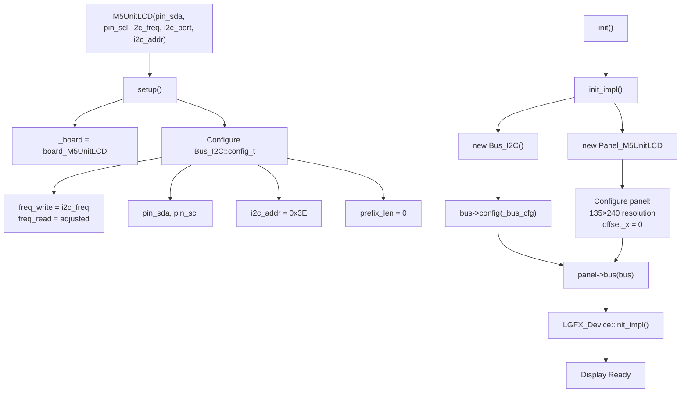
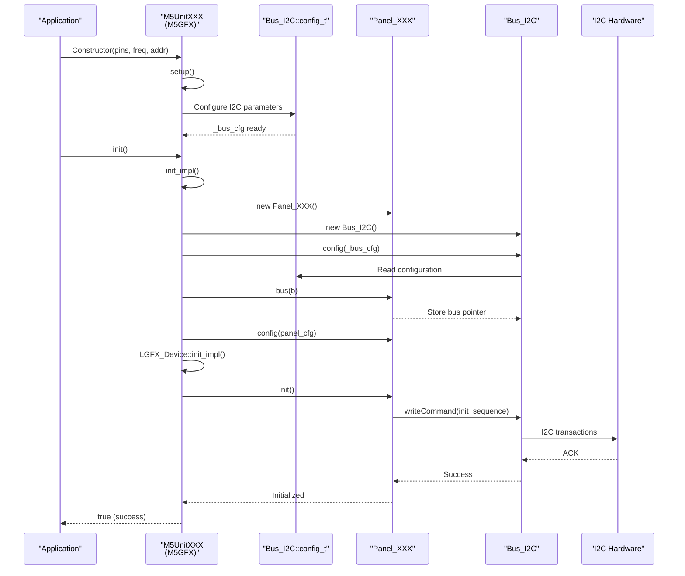
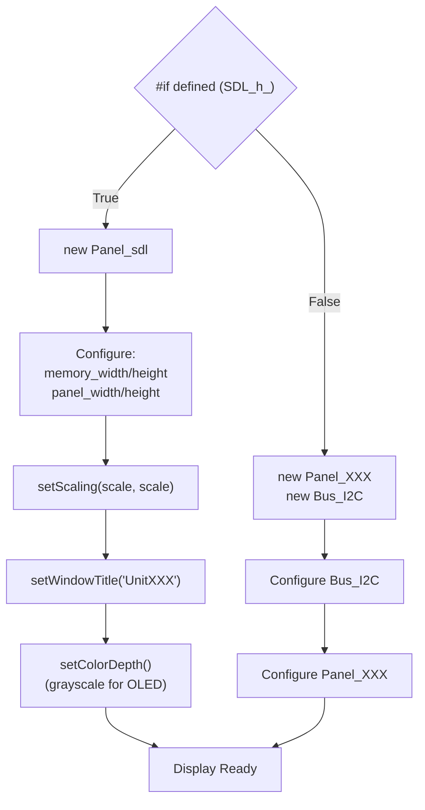
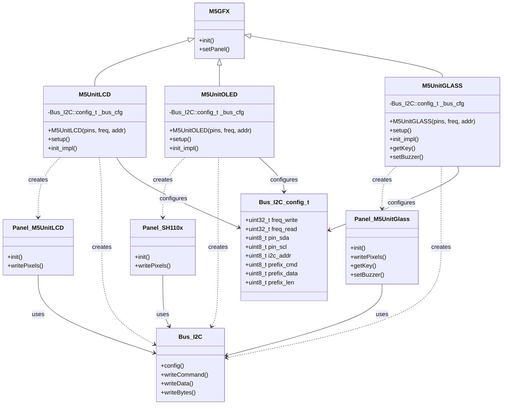

M5GFX I2C Display Panel Drivers

# I2C Display Panel Drivers

<details>
<summary>Relevant source files</summary>

The following files were used as context for generating this wiki page:

- [src/M5UnitGLASS.h](src/M5UnitGLASS.h)
- [src/M5UnitLCD.h](src/M5UnitLCD.h)
- [src/M5UnitOLED.h](src/M5UnitOLED.h)

</details>


## Purpose and Scope

This page documents the I2C-based display panel drivers in M5GFX, which provide support for small displays that communicate over the I2C bus rather than SPI. These displays are typically used as external units/modules that connect via Grove connectors to M5Stack devices.

The three I2C display classes covered here are:
- **M5UnitLCD**: 135x240 color LCD display
- **M5UnitOLED**: 64x128 grayscale OLED display
- **M5UnitGLASS**: 128x64 grayscale OLED with integrated keys and buzzer

For information about the high-level device classes that wrap these drivers, see [Unit Display Device Classes](#2.4). For details on the underlying I2C bus implementation, see [ESP32 I2C Bus Implementation](#5.4). For SPI-based LCD panel drivers, see [LCD Panel Drivers](#4.1).

---

## I2C Display Device Class Overview

All three I2C display classes inherit from `M5GFX` and follow a common architecture pattern. Each class encapsulates a panel driver and `Bus_I2C` instance, configured with device-specific parameters.

### Display Comparison

| Class | Resolution | Panel Driver | Default I2C Address | Color Depth | Special Features |
|-------|-----------|--------------|---------------------|-------------|------------------|
| `M5UnitLCD` | 135×240 | `Panel_M5UnitLCD` | 0x3E | RGB565 | None |
| `M5UnitOLED` | 64×128 | `Panel_SH110x` | 0x3C | Grayscale 8-bit | None |
| `M5UnitGLASS` | 128×64 | `Panel_M5UnitGlass` | 0x3D | Grayscale 8-bit | 3 keys, buzzer |

### Common Configuration Structure

All three classes define a `config_t` structure for I2C configuration:

```cpp
struct config_t {
    uint8_t pin_sda = 255;      // I2C data pin
    uint8_t pin_scl = 255;      // I2C clock pin
    uint8_t i2c_addr;           // 7-bit I2C address
    int8_t i2c_port = -1;       // I2C port number (-1 for auto)
    uint32_t i2c_freq;          // I2C frequency in Hz
};
```

Default frequencies are 400 kHz for all three displays, matching standard I2C fast-mode specifications.

**Sources:** [src/M5UnitLCD.h:41-48](), [src/M5UnitOLED.h:41-48](), [src/M5UnitGLASS.h:41-48]()

---

## M5UnitLCD Class

The `M5UnitLCD` class provides a 135×240 pixel color LCD display that communicates over I2C. The display uses a custom protocol where pixel data is transmitted via I2C to an internal controller that manages the LCD panel.

### Initialization and Configuration



### Bus Configuration Details

The `M5UnitLCD` uses a distinctive I2C configuration:
- **Write frequency**: User-specified (default 400 kHz)
- **Read frequency**: Adjusted to `400000 + ((i2c_freq - 400000) >> 1)` for frequencies above 400 kHz
- **Prefix length**: 0 (no command/data prefix bytes)

The read frequency adjustment is designed to optimize performance while maintaining compatibility with the internal controller's read timing requirements.

**Sources:** [src/M5UnitLCD.h:129-152](), [src/M5UnitLCD.h:154-184]()

---

## M5UnitOLED Class

The `M5UnitOLED` class provides a 64×128 pixel grayscale OLED display using the SH110x controller. This driver demonstrates the I2C command/data prefix mechanism required by many OLED controllers.

### Panel Configuration

```cpp
// Panel_SH110x configuration
cfg.panel_width = 64;
cfg.offset_x = 32;        // Hardware offset for centered display
cfg.bus_shared = false;
```

The `offset_x = 32` setting compensates for the SH110x controller's 128-pixel internal buffer when driving a 64-pixel wide display. This centers the visible area within the controller's memory.

### I2C Prefix Mechanism

The SH110x controller requires a prefix byte before each I2C transaction to distinguish commands from data:

```cpp
_bus_cfg.prefix_cmd = 0x00;    // Command prefix
_bus_cfg.prefix_data = 0x40;   // Data prefix
_bus_cfg.prefix_len = 1;       // 1-byte prefix
```

When `Bus_I2C` sends data:
- Commands are prefixed with `0x00`
- Display data is prefixed with `0x40`

This mechanism is common in I2C OLED controllers (SSD1306, SH110x families) where the first byte of each transaction indicates the subsequent bytes' purpose.

**Sources:** [src/M5UnitOLED.h:144-154](), [src/M5UnitOLED.h:157-183]()

---

## M5UnitGLASS Class

The `M5UnitGLASS` class provides a 128×64 grayscale OLED display with integrated hardware features: three tactile keys and a buzzer. This makes it unique among M5Stack displays by combining display output with input and audio capabilities.

### Hardware Features API

Beyond standard display operations, `M5UnitGLASS` exposes device-specific methods:

| Method | Purpose | Return Type |
|--------|---------|-------------|
| `getKey(uint_fast8_t key)` | Read key state (0-2) | `uint8_t` (0=pressed, 1=released) |
| `getFirmwareVersion()` | Query internal firmware version | `uint8_t` |
| `setBuzzer(uint16_t freq, uint8_t duty)` | Configure buzzer tone | `void` |
| `setBuzzerEnable(bool enable)` | Enable/disable buzzer | `void` |

These methods cast the panel pointer to `Panel_M5UnitGlass*` to access hardware-specific functionality:

```cpp
uint8_t getKey(uint_fast8_t key) {
    auto p = (lgfx::Panel_M5UnitGlass*)_panel_last.get();
    return (p == nullptr) ? 1 : p->getKey(key);
}
```

### Rotation Configuration

The `M5UnitGLASS` has a special rotation offset to match the physical orientation of the display in its enclosure:

```cpp
cfg.offset_rotation = 3;  // 270-degree hardware offset
p->config(cfg);
p->setRotation(1);        // Logical rotation
```

The combination of `offset_rotation = 3` and `setRotation(1)` results in a default orientation optimized for the typical mounting position of the unit.

**Sources:** [src/M5UnitGLASS.h:156-181](), [src/M5UnitGLASS.h:183-204]()

---

## Initialization Flow Diagram



**Sources:** [src/M5UnitLCD.h:117-127](), [src/M5UnitOLED.h:118-128](), [src/M5UnitGLASS.h:119-129]()

---

## Bus_I2C Configuration Structure

The `Bus_I2C::config_t` structure defines all parameters needed for I2C communication with display panels:

```cpp
struct config_t {
    uint32_t freq_write;    // Write operation frequency (Hz)
    uint32_t freq_read;     // Read operation frequency (Hz)
    int16_t pin_sda;        // I2C data pin
    int16_t pin_scl;        // I2C clock pin
    uint8_t i2c_port;       // I2C peripheral number (0 or 1)
    uint8_t i2c_addr;       // 7-bit I2C address
    uint8_t prefix_cmd;     // Command prefix byte
    uint8_t prefix_data;    // Data prefix byte
    uint8_t prefix_len;     // Prefix length (0 or 1)
};
```

### Prefix Mechanism for OLED Controllers

OLED controllers like SH110x require a control byte before each data transmission:

| Display Type | prefix_len | prefix_cmd | prefix_data | Purpose |
|--------------|------------|------------|-------------|---------|
| M5UnitLCD | 0 | N/A | N/A | No prefix (direct protocol) |
| M5UnitOLED | 1 | 0x00 | 0x40 | SH110x command/data selection |
| M5UnitGLASS | 0 | N/A | N/A | No prefix (custom protocol) |

When `prefix_len = 1`, the `Bus_I2C` implementation automatically prepends:
- `prefix_cmd` (0x00) when sending commands via `writeCommand()`
- `prefix_data` (0x40) when sending pixel data via `writeData()`

This abstraction allows panel drivers to use standard `writeCommand()` and `writeData()` methods without managing control bytes manually.

**Sources:** [src/M5UnitOLED.h:144-154]()

---

## I2C Port Selection

All three classes implement automatic I2C port selection logic:

```cpp
if (i2c_port < 0) {
    i2c_port = 0;
#ifdef _M5EPD_H_
    if ((pin_sda == 25 && pin_scl == 32)) {  // M5Paper
        i2c_port = 1;
    }
#endif
}
```

When `i2c_port = -1` is specified:
- Default to I2C port 0
- Override to port 1 if using M5Paper's external I2C pins (SDA=25, SCL=32)

This ensures compatibility with M5Paper's dual I2C bus configuration, where port 0 is used for internal peripherals and port 1 for external Grove connectors.

**Sources:** [src/M5UnitLCD.h:132-141](), [src/M5UnitOLED.h:133-142](), [src/M5UnitGLASS.h:134-143]()

---

## SDL Simulation Support

All three I2C display classes include SDL desktop simulation support for development without physical hardware. The conditional compilation uses `#if defined (SDL_h_)` to switch between real hardware and simulation.

### SDL Configuration



### SDL Display Properties

| Class | SDL Window Title | Default Scale | Color Depth |
|-------|-----------------|---------------|-------------|
| M5UnitLCD | "UnitLCD" | 1× | RGB565 |
| M5UnitOLED | "UnitOLED" | 2× | Grayscale 8-bit |
| M5UnitGLASS | "UnitGLASS" | 2× | Grayscale 8-bit |

The scale factor can be overridden at compile time with the `M5GFX_SCALE` macro. OLED displays use a higher default scale (2×) to improve visibility of the smaller resolution.

**Sources:** [src/M5UnitLCD.h:52-107](), [src/M5UnitOLED.h:52-107](), [src/M5UnitGLASS.h:52-108]()

---

## Panel Driver Architecture

The following diagram shows the relationship between device classes, panel drivers, and the I2C bus:



**Sources:** [src/M5UnitLCD.h:35-186](), [src/M5UnitOLED.h:35-185](), [src/M5UnitGLASS.h:35-205]()

---

## Default Pin Definitions

All three classes use platform-specific default pin definitions with fallback to M5Stack's standard Port A configuration:

```cpp
#ifndef M5UNITLCD_SDA
 #define M5UNITLCD_SDA M5GFX_PORTA_DEFAULT_SDA
#endif

#ifndef M5UNITLCD_SCL
 #define M5UNITLCD_SCL M5GFX_PORTA_DEFAULT_SCL
#endif
```

The `M5GFX_PORTA_DEFAULT_SDA` and `M5GFX_PORTA_DEFAULT_SCL` macros are defined in the main `M5GFX.h` header and vary by M5Stack device:
- M5Stack Basic/Core2: SDA=21, SCL=22
- M5StickC/Plus: SDA=32, SCL=33
- M5Paper: SDA=25, SCL=32 (external port)

This allows users to override pin assignments at compile time by defining the macros before including the header.

**Sources:** [src/M5UnitLCD.h:19-25](), [src/M5UnitOLED.h:19-25](), [src/M5UnitGLASS.h:19-25]()

---

## Usage Example Patterns

### Basic Initialization

```cpp
// Using defaults (Port A pins, 400 kHz, auto port selection)
M5UnitLCD lcd;
lcd.init();

// Custom pins and frequency
M5UnitOLED oled(/* sda */ 32, /* scl */ 33, /* freq */ 800000);
oled.init();

// Using config_t structure
M5UnitGLASS::config_t cfg;
cfg.pin_sda = 25;
cfg.pin_scl = 32;
cfg.i2c_freq = 400000;
cfg.i2c_port = 1;
M5UnitGLASS glass(cfg);
glass.init();
```

### Hardware Feature Access (M5UnitGLASS)

```cpp
// Read key state (returns 0 when pressed, 1 when released)
uint8_t key0 = glass.getKey(0);
uint8_t key1 = glass.getKey(1);
uint8_t key2 = glass.getKey(2);

// Control buzzer
glass.setBuzzer(/* freq */ 2000, /* duty */ 128);  // 2 kHz tone
glass.setBuzzerEnable(true);

// Check firmware version
uint8_t version = glass.getFirmwareVersion();
```

**Sources:** [src/M5UnitGLASS.h:183-204]()